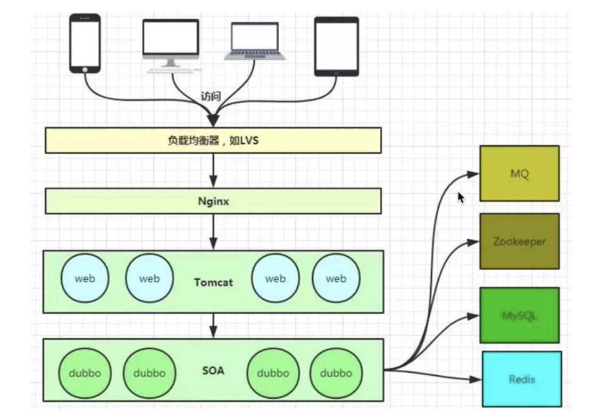
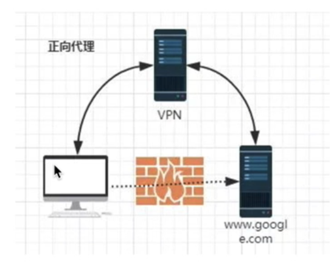
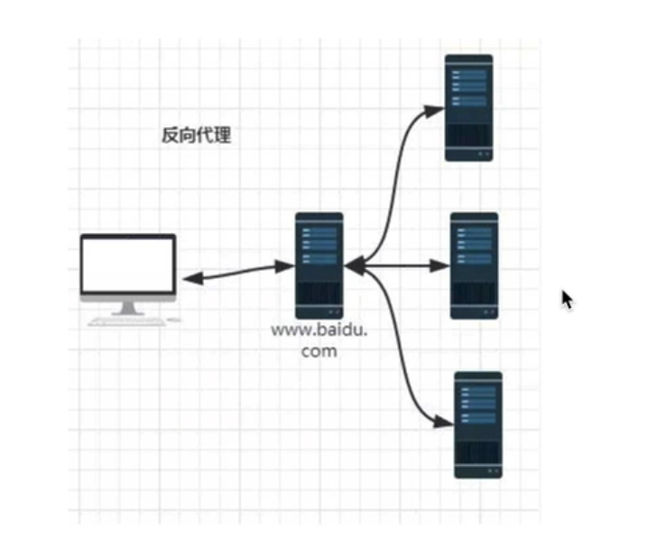
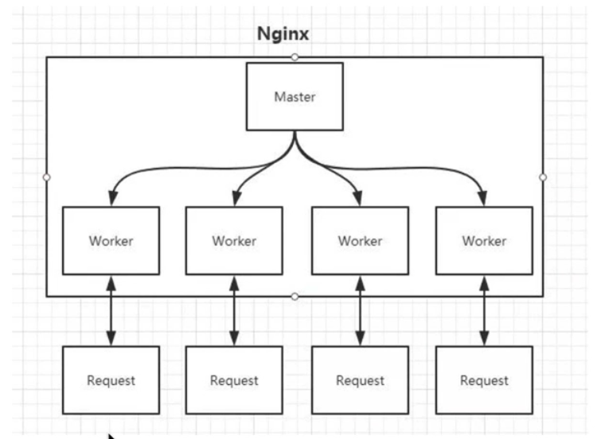
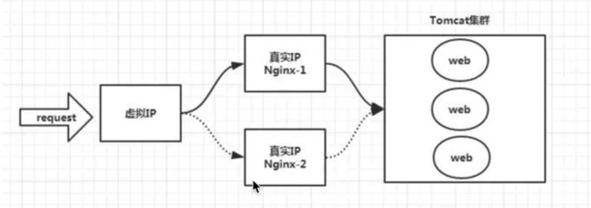
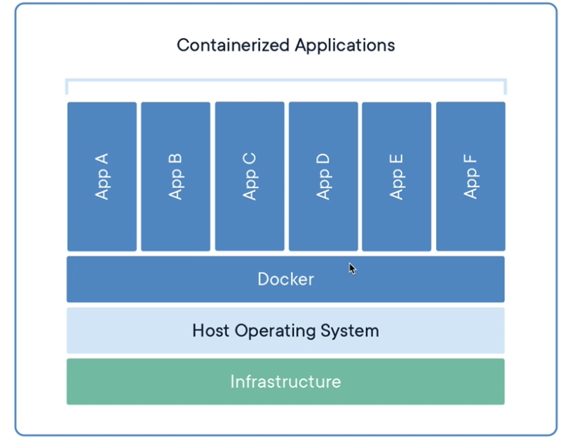

# 1. 操作系统

忽略

# 2. 虚拟机

* 虚拟机（virtual machine）是指通过软件模拟的具有完整硬件系统功能的、运行在一个完全隔离环境中的完整计算机系统

# 3. Linux 内核和发行版(版本)

* Linux 内核只有一个
* Linux 发行版有多个就是对Linux进行了封装。Linux 的发行版说简单点就是将 Linux 内核与应用软件做一个打包

Linux 能运行主要的 UNIX 工具软件、应用程序和网络协议。它支持 32 位和 64 位硬件。Linux 继承了 Unix ==以网络为核心的设计思想==，是一个性能稳定的==多用户网络操作系统==。

今天各种场合都有使用各种 Linux 发行版，从嵌入式设备到超级计算机，并且在服务器领域确定了地位，通常服务器使用==LAMP（Linux + Apache + MySQL + PHP）==或 ==LNMP（Linux + Nginx+ MySQL + PHP）==组合。

# 4. 多用户操作系统

* Linux 没有盘符的概念，只有一个根目录 / ,所有的文件都在它的下面。
* 由于Linux是多用户操作系统，在 根目录 `/` 下面有一个 `/home` 文件夹用来存放多用户的文件夹。每个用户可以在 `/home` 文件夹下新建自己的文件夹，然后再自己的文件夹中存放自己的文件。不能去其他的文件夹下操作。

单用户： 一个用户，在登录计算机（操作系统），只能允许==同时==登录一个用户；

单任务：一个任务，允许用户==同时==进行的操作任务数量。

多用户：多个用户，在登录计算机，允许==同时==登录多个用户进行操作；

多任务：多个任务，允许用户同时进行多个操作任务。

window：单用户、多任务

linux：多用户、多任务

# 5. linux 系统特点

开放性（开源）、多用户、多任务、良好的用户界面、优异的性能与稳定性、

## 5.1 学习和建议

linux 不是编程，要学会查手册和百度，不需要学会所有的指令。

# 6. linux 分支

linux 分支有很多，比较有名的 ubuntu、debian、==centos== 等

## centos(Redhat)

* 免费，社区克隆官方版。与 redhat 是孪生兄弟。
* 包管理方式：采用的是基于 `rpm` 包的 `yum`包管理方式

##  debian

* debian 是社区类 Linux 的典范，更多的依赖社区更新。
* 包管理方式：采用的是基于 `apt-get`、`dpkg`包管理方式。
* Ubuntu 是基于 debian 的 unstable 版本加强而来的。

# 7、 linux 安装

## 1、 安装方式

目前有两种安装方式：真机安装、虚拟机安装

## 2、 虚拟机软件（vm 和 centos系统）

虚拟机目前有两个比较有名的产品，vmware出品的 vmware workstation、Oracle 出品的 virtual box.

1. 安装 vm 软件 12(不选更新，然后输入激活码)
2. 通过 vm 软件来创建一个虚拟机空间
3. 通过 vm 软件来创建好的虚拟空间上，安装 centos 系统
4. 使用 centos 

## 3. centos 安装

前置条件：需要把电脑的 bios 界面的中的 virtualtechnology 设置为 enable
1. 创建虚拟机（空间）
2. 开始安装系统（Centos6.8）

### 3.1 安装过程中容易出错的地方

1. 虚拟机设置的网络适配器设置

   * 桥接模式  linux（虚拟机里面的） 可以和其他的系统直接通信，但是可能造成 ip 地址冲突

   * NAT 模式：网络地址转换方式：linux 可以访问外网，不会造成 ip 冲突。

     linux 系统的ip地址为本机的ip地址划分

     比如一个电脑的网路ip地址为 192.168.0.40 能够访问所有 192.168.0 下面的电脑，本机还有一个 ip 地址为 192.168.100.200，linux 的ip地址可以为 192.168.100.50 ，linux 系统就可以通过本地的网络代理实现对 0 网段下面所有计算机的访问，0网段下面的机子不能访问linux系统。

   * 仅主机模式：linux 系统是一个独立的主机不能访问外面的主机。

   一般建议使用 NAT 模式。

# 8. Linux 启动

- 内核的引导。
- 运行 init。
- 系统初始化。
- 建立终端 。
- 用户登录系统。

https://www.runoob.com/linux/linux-system-boot.html


## 8.1 运行

许多程序需要开机启动。它们在Windows叫做"服务"（service），在Linux就叫做"守护进程"（daemon）。

Linux允许为不同的场合，分配不同的开机启动程序，这就叫做"运行级别"（runlevel）。

# 9. Linux 目录结构

https://www.runoob.com/linux/linux-system-contents.html

## bin

* bin 是 Binaries (二进制文件) 的缩写, 这个目录存放着最经常使用的命令。常用命令脚本。

## etc

* 存放一些配置文件。包括 password、profile

  *ETC*是Linux系统下的一个*文件夹*，一般用来存放程序所需的整个文件系统的配置文件。

## sbin

* 这里存放的是系统管理员使用的系统管理程序。

## usr

 usr 是 unix shared resources(共享资源) 的缩写，这是一个非常重要的目录，用户的很多应用程序和文件都放在这个目录下，类似于 windows 下的 program files 目录。比如说自己安装的一些软件。

## var

var 是 variable(变量) 的缩写，这个目录中存放着在不断扩充着的东西，我们习惯将那些经常被修改的目录放在这个目录下。包括各种==日志文件==或者缓存文件、临时文件 tmp。

## lib

lib 是 Library(库) 的缩写这个目录里存放着系统最基本的动态连接共享库，其作用类似于 Windows 里的 DLL 文件。几乎所有的应用程序都需要用到这些共享库。

## srv

该目录存放一些服务启动之后需要提取的数据。

## home 

家目录，存放着除了 root 之外的用户。用户的主目录，在 Linux 中，每个用户都有一个自己的目录，一般该目录名是以用户的账号命名的。

## **boot：**

这里存放的是==启动== Linux 时使用的一些核心文件，包括一些连接文件以及镜像文件。

## **mnt**

系统提供该目录是为了让用户临时挂载别的文件系统的，我们可以将光驱挂载在 /mnt/ 上，然后进入该目录就可以查看光驱里的内容了

## **opt**

opt 是 optional(可选) 的缩写，这是给主机额外安装软件所摆放的目录。比如你安装一个ORACLE数据库则就可以放到这个目录下。默认是空的。

## **proc**

proc 是 Processes(进程) 的缩写，/proc 是一种伪文件系统（也即虚拟文件系统），存储的是当前内核运行状态的一系列特殊文件，这个目录是一个虚拟的目录，它是系统内存的映射，我们可以通过直接访问这个目录来获取系统信息。
这个目录的内容不在硬盘上而是在内存里，我们也可以直接修改里面的某些文件，比如可以通过下面的命令来屏蔽主机的ping命令，使别人无法ping你的机器：

## 需要掌握的目录路径知识

### 1. 查看系统内核信息

`cat /proc/version`

* 还可以使用 lsb 查看系统

```bash
$ yum install -y redhat-lsb
$ lsb_release -a
```

* 查看系统物理内核信息

  ```bash
  cat /proc/cpuinfo
  ```

* 也可以直接统计

  `lscpu`

### 2. 查看网络信息

```bash
# centos
$ cat /etc/sysconfig/network-scripts/ifcfg-eth0
```

### 3. DNS 配置

```bash
$ cat /etc/resolv.conf
```

### 4. host 文件

```bash
$ cat /etc/hosts
```

### 5. 用户/组

查看用户

```bash
$ cat /etc/passwd

# 查看组
$ cat /etc/group
```

* 查看当前用户：whoami

### 6. 查看内存/CPU

```bash
$ cat /proc/cpuinfo

# 查看内存
$ cat /proc/meminfo
```

### 7. 其他

* /etc/fstab （开机自动挂载列表）
* /etc/rc.local (开机自启动文件，自启动命令，脚本)
* /etc/init.d (服务自动命令脚本目录)
* /etc/profile (全局环境变量)
* /usr/local (编译安装软件默认安装目录)
* /var/log/message (系统日志)
* /var/log/secure (系统安全日志)
* /proc/mounts (系统挂载信息)

### 8. /bin、/sbin、/usr/bin、/usr/sbin、/usr/local/bin、/usr/local/sbin 目录的区别

1. bin 和 sbin

   /bin：    存放所有用户皆可用的==系统程序==，即普通的基本命令，如：cat，ls，chmod等。 /sbin：   存放超级用户才能使用的系统程序，即基本的系统命令，如：shutdown，reboot等。

2. **/usr/bin与/usr/sbin的区别**

   /usr/bin：    存放所有用户都可用的==应用程序==，一般是已安装软件的运行脚本，如：free、make、wget等。
   
    /usr/sbin：   存放超级用户才能使用的应用程序 ，一般是与服务器软件程序命令相关的，如：dhcpd、 httpd、samba等。
   
3. **/usr/local/bin与/usr/local/sbin的区别**

   /usr/local/bin：    存放所有用户都可用的与本地机器无关的程序，即第三方软件程序

    /usr/local/sbin：   存放超级用户才能使用的与本地机器无关的程序

# 10. Linux 启动过程

https://www.runoob.com/linux/linux-system-boot.html


# linux 基础篇

## 0. 先学会帮助命令吧

### 1. man 命令

* man 是 manual (手册) 的缩写

* 使用

  man + 命令

  `man ls`

* man 命令有9个章节，为了避免命令和文件重名的情况。章节就是为了归类

  例如: man passwd 、man 5 passwd，5就代表文件帮助( /etc/passwd 文件 )

* 如果不知道是命令还是文件可以使用 `man -a 命令`来查看

* 打开说明

  * 直接查看 `synopsis`摘要，看看简单的用法。
  * 查看 `description` 看具体的指令

### 2. help 帮助(专门针对命令)

* shell （命令解释器）自带的命令称为内部命令。其他的是外部命令

* 内部命令使用 help 帮助

  * ```shell
    help cd
    ```

* 外部的命令使用 help 帮助

  ```shell
  ls --help
  ```

* 区分内部和外部的命令

  使用 `type`关键字可以区分命令的类型

  ```shell
  type cd
  ```

### 3. Info 帮助

* info 帮助比 help 更详细，作为 help 的补充

  ```shell
  info ls
  ```

  

## 1. 先加一下指令吧

比如说 `ls -a -l` 后面的 `-`是这条指令的参数

所有的命令注意空格

### 以某文件为头

`文件名*` 适用于后面的所有命令

### 1. 查看文件命令

查看完整文件 cat ， 参数：`-n`（number，行数）

查看头部十行 `head 文件名`，参数：`-n` 行数 文件名

查看尾部十行`tail 文件名`，参数同上

`more 文件名` 全屏显示（能显示多少显示多少，按enter键下翻，q退出）


`ls 目录名`能够查看该目录下的文件

ll === ls -l

### 2. 移动文件

mv 文件名 目录

* 注：也可以使用`mv 文件名 文件名` 的方式修改文件名称


### 3. 删除

`rm -rf`

`f` 代表一个文件，`-r` 代表递归(recursion)（用来删除文件夹）

rm === rm -f

### 4. 拷贝

`cp 文件名 文件名` 文件名不能重复

`cp -r 文件夹` 拷贝文件夹

### 压缩

`tar zcvf 压缩成功的压缩包名 压缩源文件`，`tar zcvf test.tar.gz test`

v 是否展示压缩过程，f 是文件名（必须有），z 是格式，c ：compress 压缩 (必须有的三个参数)

### 解压

`tar xvf 文件名` (-x -v -f)

`x` 代表解压 `f` 跟着一个压缩文件 `v`是过程

window 常用的压缩文件(`.zip`)

压缩： `zip -r 文件后名称 压缩的文件` (-r 递归) （不需要加后缀，tar 需要后缀）

解压： `unzip test.zip`

### 软连接（快捷键）

`ln -s kuaijie.js kuajie1.js`

名称不能一样，源文件，快捷键名称


## 2. 文件系统

* 在Linux 中一切皆文件，文件系统

需要掌握的命令

pwd、cd、ls

### 2.1 ls 查看当前目录下的文件

使用： `ls [选项、选项] 参数...` （大部分都是以这种方式，必须有空格，可以有多个参数）

* 常用参数
  * -l 长格式显示文件
  
  * -a 显示隐藏文件
  
  * -r 逆序显示
  
  * -t 按时间顺序显示
  
  * -R 递归显示
  
  * -h 以m或者g的形式展示，最大的文件大小
  
  * -d 查询具体的目录
  
    `ls -ld /test`
  
* 多个参数

  `ls / /root`

1. ls -l 长格式显示

   包括：文件类型和权限，例：`drwx------@`

   `drwx------@  5 elvis staff  160 9 21 14:24 Applications`

   第一个字符表示类型，普通的文件 `-`(文本，音乐)，文件夹`d`表示（Linux文件系统，目录也当做文件来管理）

   5 表示文件个数

   elvis 该文件创建用户

   staff 创建文件用户的用户组

   160 当前文件大小

   9 21 14:24 文件最后修改时间

   Applications 文件名称

2. -r 逆向的

   一般配合 -l 显示，默认采用文件名逆向

   -t 以时间的方式进行逆向显示
   
3. `-R`递归显示

注意：

1. `/ /root`  `/` 代表根目录，`/root` root 用户的家目录

2. 命令选项，扩充命令的操作；命令的参数，命令操作的对象

3. 终端前边有 # 提示符，就代表是不受限制的用户

   切换为 root 用户，命令`su - root`
   
4. ==清除==，clear | ctrl+l

5. 不加参数显示当前文件夹，省略了 `.`。同样`./`也是可以省略的

6. Linux 中以 `.`开头的文件或文件夹就是隐藏的

7. 命令合并 `ls -lrt`，和选项的顺序没有关系

8. 两个通配符，`*` `?`。`?`是表示匹配后边一个字符

   比如说 `ls test*`，以test 为开头的文件

   比如 `cp test*`

### 2. 2 cd

小技巧：

1. 回到刚才的目录

   `cd -`

2. 回到上级

   `cd ..`或`cd ../`

### 2.3 mkdir 创建目录

1. 可以同时创建多个目录

   `mkdir a b`

2. 存在的目录，再次创建会提示失败

3. 创建多级目录。如果不存在上级文件先创建上级文件，递归创建。

   如果要创建多级的目录，可以使用 `-p`选项，`mkdir -p /a/b/c/d/e/f/g`，`-p`忽略创建重复文件时候的报错

### 2.4 rmdir 删除目录

* 只能删除空白目录

### 2.5 rm 删除

* 删除目录

  `rm -r -f a`不进行提示删除

### 2.6 cp 复制

`cp`辅助命令，不能复制目录，如果复制目录需要加 `-r`

* 显示进度条，复制的过程

  `cp -v a b`

* 复制文件之后，操作时间和操作人等信息会发生变化，如果希望这些信息不发生变化的话，可以加 `-p`(保留修改时间)，`-a`（保留属主，时间的所有属性）

  `cp -p a b`

### 2. 7 mv

* 有两个作用，一个重命名，一个移动
* 可以直接移动文件夹

### 2.8 关机

```shell
shutdown
```

### 2.9 设备文件

`ls /dev`

dev 下存放着设备文件

`crw-rw---- 1 root tty       7,   0 Jan  6 22:44 vcs`

c 代表字符设备

b 代表块设备

### 文件描述符

* 参考：https://www.zhihu.com/question/446420291/answer/1751954627

​	https://zhuanlan.zhihu.com/p/143430585

> Linux 系统中，把一切都看做是文件，当进程==打开现有文件或创建新文件时==，内核向进程返回一个文件描述符，文件描述符就是内核为了==高效管理已被打开的文件所创建的索引==，用来指向被打开的文件（这也就是为什么node使用fs.open拿到fd），所有执行I/O操作的系统调用都会通过文件描述符。

* 打开和创建新文件时，内核向进程返回。是一个索引，用来指向被打开的文件(必须是在进程中打开的文件)

> 文件描述符，一般叫fd。linux万物皆文件，fd就是抽象之后的体现。linux中，我们很多操作都是靠着这个fd，具体来说，当我们想操作一个资源的时候，就会调用操作系统对应的接口，这个接口就会返回一个fd，后续我们就可以通过这个fd去操作这个资源，

* 拿到fd就能够进行对文件的操作

### 软链接和硬链接

参考： https://zhuanlan.zhihu.com/p/382931448

> 硬链接是通过**[索引节点](https://www.zhihu.com/search?q=索引节点&search_source=Entity&hybrid_search_source=Entity&hybrid_search_extra={"sourceType"%3A"article"%2C"sourceId"%3A"382931448"})**进行的链接。在Linux中，多个文件指向同一个索引节点是允许的，像这样的链接就是硬链接。(也就是两个文件使用相同的fd，可以使用node的fs.open查看)。
>
> 硬链接只能在**同一文件系统中的文件之间进行链接**，不能对目录进行创建。如果删除硬链接对应的源文件，则硬链接文件仍然存在，而且保存了原有的内容，这样可以起到防止因为误操作而错误删除文件的作用。由于硬链接是有着相同 `inode` 号仅文件名不同的文件，因此，删除一个硬链接文件并不影响其他有相同 `inode` 号的文件。 创建硬链接会增加文件`inode`的链接计数，删除硬链接文件会减少文件`inode`的链接计数。
>
> * 相当于不同的文件名，相同文件。有点像数组索引对应多个文件名。修改其中一个另一个也会变，不是纯粹的拷贝

Linux创建硬链接: link 或者 ln 老文件 新文件

```shell
link oldfile newfile
ln oldfile newfile
```

> 软链接（也叫符号链接）与硬链接不同，文件用户数据块中存放的内容是**另一文件的绝对路径**。软链接就是一个**普通文件**，只是数据块内容有点特殊。软链接可对文件或目录创建。
>
> 软链接主要应用于以下两个方面：一是方便管理，例如可以把一个复杂路径下的文件链接到一个简单路径下方便用户访问；另一方面就是解决文件系统磁盘空间不足的情况。例如某个文件文件系统空间已经用完了，但是现在必须在该文件系统下创建一个新的目录并存储大量的文件，那么可以把另一个剩余空间较多的文件系统中的目录链接到该文件系统中，这样就可以很好的解决空间不足问题。删除软链接并不影响被指向的文件，但若被指向的原文件被删除，则相关软连接就变成了[死链接](https://www.zhihu.com/search?q=死链接&search_source=Entity&hybrid_search_source=Entity&hybrid_search_extra={"sourceType"%3A"article"%2C"sourceId"%3A"382931448"})。创建和删除软链接文件不会影响文件`inode`的链接计数。
>
> * 不影响 inode 链接计数
> * 能够跨域文件系统
> * 因为只是一个引用，所以fd相同。也就是源文件的fd
> * 可以对目录进行创建

linux 创建软连接：比硬链接加了 -n

```shell
ls -n old.fle soft.link
ls -n old.dir soft.link.dir
```

### inode

参考：https://zhuanlan.zhihu.com/p/385384549

> 文件储存在硬盘上，硬盘的最小存储单位叫做”扇区”（Sector）。每个扇区储存512字节（相当于0.5KB）。
>
> 操作系统读取硬盘的时候，不会一个个扇区地读取，这样效率太低，而是一次性连续读取多个扇区，即一次性读取一个”块”（block）。这种由多个扇区组成的”块”，是文件存取的最小单位。”块”的大小，最常见的是4KB，即连续八个 sector组成一个 block。
>
> 文件数据都储存在”块”中，那么很显然，我们还必须找到一个地方储存文件的元信息，比如文件的创建者、文件的创建日期、文件的大小等等。这种储存文件元信息的区域就叫做inode，中文译名为”索引节点”。
>
> 每一个文件都有对应的inode，里面包含了与该文件有关的一些信息。
>
> 总之，==除了文件名（没有存储文件名）==以外的所有文件信息，都存在inode之中。至于为什么没有文件名，下文会有详细解释。

> `inode`叫做索引节点号，这是Linux文件系统管理文件的方式。在建立文件系统时，会建立一个索引节点表，里面包含一定数量的索引节点。每当建立一个文件时，就会为他分配一个索引节点号，相当于文件的地址。
>
> `readlink`命令可以找出符号链接所指向的位置。常用选项`-f`， 可以递归跟随给出文件名的所有符号链接以[标准化](https://www.zhihu.com/search?q=标准化&search_source=Entity&hybrid_search_source=Entity&hybrid_search_extra={"sourceType"%3A"article"%2C"sourceId"%3A"382931448"})，但除最后一个外所有组件必须存在。

> 那么很显然，我们还必须找到一个地方储存文件的元信息，比如文件的创建者、文件的创建日期、文件的大小等等。这种储存文件元信息的区域就叫做inode，中文译名为”索引节点”。==值得注意的是，inode根本不关系文件存放的目录，它只是存放了文件数据 block 的位置==

* 每个inode都有一个号码，操作系统用inode号码来识别不同的文件。

  这里值得重复一遍，Unix/Linux系统内部不使用文件名，而使用inode号码来识别文件。对于系统来说，文件名只是inode号码便于识别的别称或者绰号。

  有点像ip和网址的关系

  ==表面上，用户通过文件名，打开文件。实际上，系统内部这个过程分成三步==：首先，系统找到这个文件名对应的inode号码；其次，通过inode号码，获取inode信息；最后，根据inode信息，找到文件数据所在的block，读出数据。

#### 命令

* 查看文件的inode号码

  ```shell
  ls -i 文件名
  ```

* 查看某个文件的inode信息

  ```shell
  stat 文件名
  ```

* 查看每个硬盘分区的inode总数和已经使用的数量

  ```shell
  df -i
  ```

#### 注意

* inode 索引是磁盘上为了方便存储的索引
* fd 是内核返回给进程的索引

#### inode 特殊作用

> 由于inode号码与文件名分离，这种机制导致了一些Unix/Linux系统特有的现象。
>
> 　　1. 有时，文件名包含特殊字符，无法正常删除。这时，直接删除inode节点，就能起到删除文件的作用。
>
> 　　2. 移动文件或重命名文件，只是改变文件名，不影响inode号码。
>
> 　　3. 打开一个文件以后，系统就以inode号码来识别这个文件，不再考虑文件名。因此，通常来说，系统无法从inode号码得知文件名。
>
> 第3点使得软件更新变得简单，可以在不关闭软件的情况下进行更新，不需要重启。因为系统通过inode号码，识别运行中的文件，不通过文件名。更新的时候，新版文件以同样的文件名，生成一个新的inode，不会影响到运行中的文件。等到下一次运行这个软件的时候，文件名就自动指向新版文件，旧版文件的inode则被回收。

#### 与文件描述符区别

* 为什么不能让进程直接操作inode 索引呢？

  相当于封了一层信息，包括该进程打开该文件的权限等信息，就是封装了一层，让后控制和暴露部分信息。
  
  inode 根本不需要知道文件名和权限等信息！

### 目录文件

>Unix/Linux系统中，目录（directory）也是一种文件。打开目录，实际上就是打开目录文件。
>
>目录文件的结构非常简单，就是一系列目录项（dirent）的列表。每个目录项，由两部分组成：所包含文件的文件名，以及该文件名对应的inode号码。
>
>==inode号码存在目录文件中？==

* 也就是为什么目录有查看权限

ls命令只列出目录文件中的所有文件名：

ls -i命令列出整个目录文件，即文件名和inode号码：

* 看起来ls 一个文件，查看文件的信息，是由该文件所在的目录提供的能力。

### 系统文件

* log 文件存放在 /var/log 中

* /proc/ 下所有的文件在硬盘中都是不存在的，操作系统读取内存的中的信息，在文件的形式呈现。可以像操作文件一样操作这些信息，大部分支持查看。

  `cat /proc/version` 能够查看版本信息

  进程信息也存放在这个目录下，目录名为具体的进程 id。cwd 目录使用 ls -l 查看，能够看到执行该进程运行的目录，该目录不能被卸载。ls -l fd 能够查看该进程的输入输出情况：0 标准输入，1、2标准输出，

* 查看系统版本

  `cat /etc/issue`


### tmp 目录——临时目录

> Linux 中的“/tmp”或 tmp 目录（临时目录）是任何程序存储在==执行会话期间==可以使用的必要文件的地方。 它是 Linux 中最常用的目录之一。 假设您正在编写文档。 你在 vscode 中这样做。 vscode 会将您的文档的临时副本保存在 tmp 文件中，并会定期更新它。 您可以随时去那里并在必要时恢复它。

* 感觉有点像缓存

> /tmp 目录包含在程序执行期间“临时”需要的所有必需文件。 如果发生任何崩溃或意外事件，您可以从目录中检索文件。 此外，您还可以查看在程序执行期间正在使用哪些子程序。

#### Linux临时目录/tmp与/var/tmp

https://zhuanlan.zhihu.com/p/352642228

## 查看文件

### 1. cat

* 文本内容显示到终端

### 2. head

* 查看文件开头10行，`-5`查看5行`head -5 test`

### 3. tail

* 查看文件的结尾，默认10行，扩展和上边一样
* `-f` 文件动态变化，进行跟踪

### 4. wc

* 统计文件有多少行，来判断使用上边那个命令
* `wc -l test`

### 剩余的查看文件命令

* more、less

### 5. grep

* Linux grep 命令用于查找文件里符合条件的字符串。

* grep 指令用于查找内容包含指定的范本样式的文件，如果发现某文件的内容符合所指定的范本样式，预设 grep 指令会把含有范本样式的那一列显示出来。若不指定任何文件名称，或是所给予的文件名为 **-**，则 grep 指令会从标准输入设备读取数据。
* 相当于 Linux 的正则。更多用法，参考 https://www.runoob.com/linux/linux-comm-grep.html

基础用法：grep 字符串 限定文件

1. 在当前目录中，查找后缀有 file 字样的文件中包含 test 字符串的文件，并打印出该字符串的行。

  ```shell
	grep test *file 
  ```

2. 以递归的方式查找符合条件的文件。例如，查找指定目录/etc/acpi 及其子目录（如果存在子目录的话）下所有文件中包含字符串"update"的文件，并打印出该字符串所在行的内容，使用的命令为：

   ```shell
   grep -r update /etc/acpi 
   ```

3. 反向查找。前面各个例子是查找并打印出符合条件的行，通过"-v"参数可以打印出不符合条件行的内容。

   查找文件名中包含 test 的文件中不包含test 的行，此时，使用的命令为：

   ```shell
   grep -v test *test*
   ```

### 6. 终端操作

* 结束终端

  exit

## 操作文件

### sed 命令——使用简单原生的脚本处理文件

Linux sed 命令是利用脚本来处理文本文件。

sed 可依照脚本的指令来处理、编辑文本文件。

Sed 主要用来自动编辑一个或多个文件、简化对文件的反复操作、编写转换程序等。

语法：

```bashe
sed [-hnV][-e<script>][-f<script文件>][文本文件]
```

**参数说明**：

- -e<script>或--expression=<script> 以选项中指定的script来处理输入的文本文件。
- -f<script文件>或--file=<script文件> 以选项中指定的script文件来处理输入的文本文件。
- -h或--help 显示帮助。
- -n或--quiet或--silent 仅显示script处理后的结果。
- -V或--version 显示版本信息。

**动作说明**：

- a ：新增， a 的后面可以接字串，而这些字串会在新的一行出现(目前的下一行)～
- c ：取代， c 的后面可以接字串，这些字串可以取代 n1,n2 之间的行！
- d ：删除，因为是删除啊，所以 d 后面通常不接任何东东；
- i ：插入， i 的后面可以接字串，而这些字串会在新的一行出现(目前的上一行)；
- p ：打印，亦即将某个选择的数据印出。通常 p 会与参数 sed -n 一起运行～
- s ：取代，可以直接进行取代的工作哩！通常这个 s 的动作可以搭配正则表达式！例如 1,20s/old/new/g 就是啦！


## 打包和压缩

### 1. 打包

* 最早的Linux备份介质是磁带，使用的命令是 tar
* 可以打包后的磁带文件进行压缩存储，压缩的命令是 gzip 和 bzip2
* 经常使用的扩展名是 .tar.gz、 .tar.bz2、 .taz
* ==`/etc`文件== 是Linux 的配置文件所在的目录，对Linux进行备份一般是备份这个目录

使用：

`tar cf 目的地 打包目标`

`c`打包命令，`f`代表文件。没有`-`，注意。打包的时候会把绝对目录去掉，方便解压到任何目录。

比如： `tar czf /tmp/etc-backup.tar.gz /etc`

z 代表采用了 `gzip` 压缩，`czf`代表打包并压缩

采用 bzip2 的压缩方式

`tar cjf /tmp/etc-backup.tar.bz2 /etc`

### 2. 压缩和解压缩

* gzip 拥有更快的压缩速度
* bzip2 拥有更小的压缩体积

解压缩

* 使用

  `tar xf  /tmp/etc-backup.tar.bz2 -C /etc`，需要加`-C` 后面跟目录

  gzip 解压，使用`zxf`

  bzip2 解压用到 `jxf`

  在网络传播过程中有可能存在 `.tgz`和`.tbz2`的缩写，只不过是缩写，和上边的情况相同。
  
* 还有 xz 后缀的文件，使用 xvf 的方式解压

  tar xvf linux-5.1.10.tar.xz -C /usr/src/kernels

* 参数

  末尾+ `--strip-components 1`，则表示不会解压一个和压缩文件一样的文件夹出来，而是直接把解压的文件放到当前文件下。

## 硬件查看

### 1. 查看磁盘内存

* df 以磁盘分区为单位查看文件系统，可以获取硬盘被占用了多少空间，目前还剩下多少空间等信息。**du** 的英文原义为 **disk usage**。df 查看整个磁盘，du 查看具体的文件使用情况。

  - **df -hl**：查看磁盘剩余空间

  - **df -h**：查看每个根路径的分区大小

  - **du -sh [目录名]**：返回该目录的大小

  - **du -sm [文件夹]**：返回该文件夹总M数

  - **du -h [目录名]**：查看指定文件夹下的所有文件大小（包含子文件夹）

    ==**-h**：以K，M，G为单位，提高信息的可读性。==

## 编辑器

### 多模式文本编辑器

* vim

* 四种模式

  1. 正常模式 （normal-mode）

     `yy`进行复制

     `3yy`进行三行复制

     `p`粘贴

     `y `+`$` 辅助光标到本行最后，不包括换行符

     `dd`剪切光标所在的一行

     `d$`剪切光标所在行到最后一个字符

     `u`进行操作撤销

     `ctrl + r`前进

     `x`进行光标所选位置删除一个字符

     `r`+ 新的字符，可以替换选定的字符

     `11 G` 移动到11行，输入数字+enter： 跳转当前行+数字的行

     `g`移动到第一行

     `G`移动到最后一行

     `^`一行的开头

     `$`一行的结尾

     `ctrl + f` 最后一行

  2. 插入模式（insert-mode） 按 i 进入插入模式

     按如下的命令进入插入模式

     `i`  光标当前的位置前一位进入

     `I`  光标来到当前行的开头

     `a` 光标来到当前光标位置的后一位

     `A` 光标来到当前光标所在行的最后一位

     `o`光标来到当前所在行的下一行，并新建一行空行

     `O`光标当前行的上一行新建一行 

  3. 命令模式（command-mode）

     按 `:`进入

     * `wq`保存退出

     * `q!`不保存退出

     * 在当前vim打开的文件中，临时查看一条配置命令，比如查看 ip 配置`ifconfig`，可是使用 `!ifconfig`来查看

     * `/x` 查找x字符，`/`为查找字符，按`n`跳到下一个查找的字符，`N`跳到上一个字符

     * `s/x/X`将光标所在行的`x`替换成`X`

       `%s/x/X`将文件所有的替换，这俩只替换第一个找到的字符

       `%s/x/X/g` 替换整个文件所有的字符

       `11,12%s/x/X` 11,12行的第一个字符

     * 去掉高亮显示 `set nohlsearch`

     * `:set nu`显示当前的行、`:set nonu`不显示当前行

       让每一次vim打开都有行号

     * linux 软件的设置就是修改配置文件

       `vim /etc/vimrc`

       在最后一行添加 `set nu`，保存。思考怎么样快速跳到最后一行，并且新加一行输入。

     * `!which shutdown` 能找到该命令的位置

  4. 可视模式 (visual-mode)，进行大量重复性操作的时候

     按 `v`、`V`、`ctrl + v` 进入

     * `v`字节可视模式

     * `V` 行可视模式

     * `ctrl + v` 块可视模式

       然后按 `I`，进行输入，然后按两下 `esc`就可在块前边添加一样的东西。

     * 配合 `d` 和 `I`命令可以进行块的便利操作，`d`删除，`I`输入

* hjkl 对光标上下左右移动

## 远程连接

* `ssh` 

  SSH 为 Secure Shell 的缩写，由 IETF 的网络工作小组（Network Working Group）所制定。

  SSH 为建立在应用层和传输层基础上的安全协议。

  ​	例子

  ```bash
  $ ssh -p 22 root@81.70.160.168
  # 指定端口，用户@ip
  ```

* 查看主机ssh配置

  ```bash
  $ cd /etc/ssh
  ```


## 其他命令

### tree

Linux tree命令用于以树状图列出目录的内容。

执行tree指令，它会列出指定目录下的所有文件，包括子目录里的文件。


## 命令行奇淫技巧

### 1. 换行输入

可以使用 `\` 来换行输入

### 2. which 和 whereis

* whereis 命令范围更广，不限制于 path 查找。

### 3. find 命令

Linux find 命令用来在==指定目录==（和which的区别）下查找文件。任何位于参数之前的字符串都将被视为欲查找的目录名。如果使用该命令时，不设置任何参数，则 find 命令将在当前目录下查找子目录与文件。并且将查找到的子目录和文件全部进行显示。

## 命令逻辑

主要表达前后命令行之间的关系。

&： **表示任务在后台执行，如要在后台运行**

&&： **表示前一条命令执行成功时，才执行后一条命令**

|：上一条命令输出作为下一条命令的输入参数

||：**表示上一条命令执行失败后，才执行下一条命令**

\>：**将正常信息重定向**，重定向后面的命令

```shell
$cat basic-shell > test
```

&>：错误信息也将重定向


# 用户和权限管理(在云服务器测试)

* Linux 属于多用户操作系统，需要对用户进行管理，对用户所属的文件进行管理。所使用的的资源根据资源的合理性进行隔离。

## 用户管理常用命令

*  useradd 新建用户
* userdel 删除用户
* passwd 修改用户密码
* usermod 修改用户属性
* chage 修改用户属性

## 用户

* root 用户可以访问系统的配置文件，以及普通用户的家目录权限。普通用户（受限用户）只能访问自己家目录下的文件以及root用户开放给他一些没有危及系统的文件。

* useradd 新建用户

* `id root`能够查看 root 用户，`id test`查看test用户。

  id tab 能够查看所有用户

* root 在 `/root`目录下，新建的 test 用户的家目录在，`/home/test`目录下

* 新建的用户会在 `/etc/passwd`文件中创建一个用户，会在 `/etc/shadow`中添加一个用户

* Root 用户 的 `uid=0`

* 一组用户需要分配相同 的资源时候，就可以使用用户组，没有指定组，就创建一个和用户同名的组

* 用户操作只能 root 用户来操作

* `passwd user`修改user的密码

* `userdel -r user` 删除用户，可以删除用户的家目录，如果不加 `-r`，改家目录就会变成无属主的文件。`ls -l`查看

* `usermod -d 新的家目录 用户名称`,修改用户家目录之后，用户登录访问的目录就发生了变化，配置文件也发生了变化

* `chage`更改用户的密码过期时间，用户过期时间等

### 组管理命令

* groupadd 新建用户组

  修改用户组方法：用户的 `gid 和 组会发生变化`

  1. ```shell
     groupadd group1
     useradd test
     usermod -g group1 test
     id test
     ```

  2. ```shell
     useradd -g group1 test
     ```

* groupdel 删除用户组

## 切换用户

* linux 提供了 `su` 命令

  ```shell
  su - test
  ```

  `-`代表完全切换环境

  退出切换，使用 `exit`

* 注意：

  root 用户切换普通用户不需要密码，普通用户切换 root 用户需要密码

### 切换用户命令

* su 切换用户，需要使用 root 密码，风险很大

  * `su - username` 使用 login shell 方式切换用户

  * 比如：

    ```shell
    shutdown -h 30
    # 30分钟关机
    ```

    

* ==sudo  以其他用户身份执行命令，==只需要部分命令可执行，不需要密码。规避权限过大的问题。

  因为普通用户的密码是 root 设置的

  * `visudo`  设置需要使用sudo的用户（组）
  * 例子：
    1. 执行 `visudo`
    2. 添加 `test ALL=/usr/sbin/shutdown -c`
    3. 切换 test 用户
    4. 执行 `sudo /usr/sbin/shutdown -c`
  
* 添加 test 的sudo 权限。可以使用 su 切换 root 用户使用系统，

  ```shell
  whereis sudoers
  chmod u+w /etc/sudoers
  vim /etc/sudoers
  ```

  

## 用户和用户组的配置文件

* 配置文件一共有三个

  * `/etc/passwd`
  * `/etc/shadow`
  * `/etc/group`

* paddwd 文件，比如 root 用户和 test 用户。linux 用 uid 来识别用户

  `root:x:0:0:root:/root:/bin/bash`

  `test:x:1000:1000::/home/test:/bin/bash`

  用户名称:x(是否需要密码验证，不需要为空):uid:gid::(注释)用户家目录:用户登录之后的命令解释器(常用的还有 `/sbin/nologin`不让用户登录终端)

* shadow 文件 `/etc/shadow`

  `root:$1$oqgtLkvO$0ggQmYHBwr2YtQvjibk5D0:18612:0:99999:7:::`

  `用户名:加密密码($1开头)`

  用户使用相同的密码，在shadow中也显示不一样

* group 文件，`/etc/group`

  `root:x:0:`

  `mail:x:12:postfix`

  `用户名:是否需要密码:gid:username(其他组设置,让用户属于这个组)`，其他组设置：又能属于其他组


## 给用户sudo权限

### 方法1：sudoers

* 修改该文件能给用户权限 sudoers

# 文件与目录权限

`drwx------ 4 test test 4096 Jan  6 22:51 test`

`类型权限`

* 一定要先看清类型，==不通类型的目录 `rw`表示的权限不同==，一共有9个位置

  前三个字符表示所属用户的权限，第二个三个字符表示当前用户组权限，第三个三个字符表示除了所属用户和用户组外，其他人对这个文件的权限

* Linux 字符类的操作系统不是太关注文件的扩展名，主要关注文件的类型。文件类型在创建的时候就固定了，不能再次更改

* 文件类型

  * `-`普通文件

  * `d` 目录文件

  * `b` 块特殊文件

    设备，比如说对硬盘进行备份

  * `c` 字符特殊文件

    终端等

  * `l` 符号链接

    类似快捷方式

  * `f` 命名管道

  * `s` 套接字文件

    最后两个用来做进程通信

## 普通文件权限

* 字符权限表示方法

  * r 读
  * w 写
  * x 执行

* 数字权限的表示方法

  * r=4
  * w=2
  * x=1

* 测试

  读： cat

  写： vim 不是真正的写，原理是写到 . 隐藏文件中，按 `wq`退出是进行文件替换

* 创建新文件有默认权限，根据 umask 值计算，属主和属组根据当前进程的用户来设定


## 目录权限的表示方法

* x 进入目录
* rx 显示目录内的文件名
* wx 修改目录内的文件名

## 修改权限命令

* chmod 修改文件、目录权限

  * `chmod u+x /temp/test`

    一共有`u g o a`四种，user,group,other,all。`+ - =`增加、减少、设置权限

  * `chmod 755 /temp/test`，相当于三个权限加起来

  * 如果时候sh 脚本文件，想要执行必须有读写权限。

* chown 更改属主、属组。这个是更改文件的属组，更改用户的属组用的是前边的命令

  如果设置的群主不存在，报 illegal （非法的）错误

  属主

  `chown user2 /test`

  属组

  `chown :group1 /test`

  同时修改：
  `chown user2:group1 /test`

* chgrp 可以单独更改属组，不常用

  `chgrp user2 /test`

### 普通文件默认文件的权限

* 普通文件的权限是 666 - umask(022)，所以默认文件的权限都是 644

==所有的权限限制都是限制普通用户==

* 小技巧

  按 ctrl + r 能够搜索历史出现的命令

## 文件权限测试

* echo 命令

  `echo 123` 输出123到终端

* `echo 123 > test` 输出重定向，并且把 test 中的字符清空，然后换成 123，就是写入

## 特殊权限

* 系统目录有些权限是不一样的，成为特殊权限

* SUID 用于二进制可执行文件，执行命令时取得文件属主权限

  新建用户不能每次都去配置 sudo 执行

  * 如 `/user/bin/passwd`，执行 passwd 命令的时候自动获得 root 的权限

  * passwd 权限

    `-rwsr-xr-x 1 root root 27856 Apr  1  2020 passwd`

    属主是 root ，普通用户就可以获取 root 的身份。root 身份有啥权限，普通用户就有啥权限。

  设置 SUID 权限

  `chmod 4777 /test.file` 加一个4 代表 `rws` 加了 s

* SGID 用于目录，在该目录下创建新的文件和目录，权限自动更改为该目录的属组

  设置

* SBIT 用于目录，该目录下新建的文件和目录，仅 root 和 自己可以删除

  * 如 /tmp
  * `-rw-rw-rwT 1 root root    0 Jan  9 20:08 testFile`

  设置 SBIT 权限

  `chmod 1777 /test.file` 加一个4 代表 `rwt` 加了 t

# 网络管理

* 网络状态查看
* 网络配置
* 路由命令
* 网络故障排除
* 网络服务管理
* 常用网络配置文件

## 网络状态查看工具

net-tools vs iproute

1.  net-tools (centos7以前)。如果不存在如下命令，可以使用 `yum install net-tools`
   * ifconfig
   * route
   * netstat
2. iproute2 （第二个版本）
   * ip
   * ss

### ifconfig

interface config

* eth0 第一块网卡 （网络接口）
* 你的第一个网络接口可能叫做下面的名字
  * eno1 板载⽹网卡
  * ens33 PCI-E⽹网卡
  * enp0s3 ⽆无法获取物理理信息的 PCI-E ⽹网卡
  * CentOS 7 使⽤用了了⼀一致性⽹网络设备命名，以上都不不匹配则使⽤用 eth0

命令：

root 用户 `ifconfig`

普通用户 `/sbin/ifconfig`

#### ⽹网络接⼝口命名修改

* centos 7 之后网卡改名

* ⽹网卡命名规则受 biosdevname 和 net.ifnames 两个参数影响

  编辑 /etc/default/grub 文件，增加 biosdevname=0 net.ifnames=0。这个文件是给用户看的。

  更更新 grub，转化为 grub2，是真正在启动的时候读取的

  \# grub2-mkconfig -o /boot/grub2/grub.cfg

  重启

  \# reboot

* vim /etc/default/grub

  `GRUB_CMDLINE_LINUX="crashkernel=auto console=ttyS0 console=tty0 panic=5 net.ifnames=0 biosdevname=0 intel_idle.max_cstate=1 intel_pstate=disable"`

  主要查看这一行 `net.ifnames=0 biosdevname=0`

* 组合显示的网卡名称

|      | biosdevname | net.ifnames | 网卡名 |
| ---- | ----------- | ----------- | ------ |
| 默认 | 0 | 1 | ens33 |
|组合1|1|0|em1|
|组合2|0|0|eth0|

#### 启动&关闭

```bash
$ ifconfig eth0 down
$ ifconfig eth0 up
```


### 查看网卡

```shell
eth0: flags=4163<UP,BROADCAST,RUNNING,MULTICAST>  mtu 1500
        inet 172.21.0.9  netmask 255.255.240.0  broadcast 172.21.15.255
        inet6 fe80::5054:ff:fe06:bbfc  prefixlen 64  scopeid 0x20<link>
        ether 52:54:00:06:bb:fc  txqueuelen 1000  (Ethernet)
        RX packets 1620543  bytes 137035973 (130.6 MiB)
        RX errors 0  dropped 0  overruns 0  frame 0
        TX packets 1578997  bytes 264877253 (252.6 MiB)
        TX errors 0  dropped 0 overruns 0  carrier 0  collisions 0

lo: flags=73<UP,LOOPBACK,RUNNING>  mtu 65536
        inet 127.0.0.1  netmask 255.0.0.0
        inet6 ::1  prefixlen 128  scopeid 0x10<host>
        loop  txqueuelen 1000  (Local Loopback)
        RX packets 2212  bytes 109337 (106.7 KiB)
        RX errors 0  dropped 0  overruns 0  frame 0
        TX packets 2212  bytes 109337 (106.7 KiB)
        TX errors 0  dropped 0 overruns 0  carrier 0  collisions 0
```

eth0 网卡名、 inet: IP 地址、netmask 子网掩码、ether mac地址、RX/TX 发送和接受数据包个数

lo 本地的还回，永远是 127.0.0.1。

如果只想查看 eth0，`ifconfig eth0`

### 查看网卡物理连接情况

* mii-tool eth0

### 查看网关命令

* 查看网关

  * route -n 。 route 会把网关解析成域名的方式，加上-n 就是 ip 地址，速度更快，不用解析
  * 使用 -n 参数不解析主机名

  route

  ```shell
  Destination     Gateway         Genmask         Flags Metric Ref    Use Iface
  default         gateway         0.0.0.0         UG    0      0        0 eth0
  link-local      0.0.0.0         255.255.0.0     U     1002   0        0 eth0
  172.21.0.0      0.0.0.0         255.255.240.0   U     0      0        0 eth0
  ```

  route -n

  ```shell
  Destination     Gateway         Genmask         Flags Metric Ref    Use Iface
  0.0.0.0         172.21.0.1      0.0.0.0         UG    0      0        0 eth0
  169.254.0.0     0.0.0.0         255.255.0.0     U     1002   0        0 eth0
  172.21.0.0      0.0.0.0         255.255.240.0   U     0      0        0 eth0
  ```

### 网络配置命令（未实践）

* ifconfig <接⼝口> <IP地址> [netmask ⼦子⽹网掩码 ] ，设置网卡地址。不设置子网掩码，自动计算

  `ifconfig eth0 10.211.55.4 netmask 255.255.255.0`

* ifup <接⼝口>，启动网卡

  `ifup eth0`

  或者

  `ifconfig en0 up`

* ifdown <接⼝口>，关闭网卡

### 网关配置命令

* 删除网关

  `route del default gw 10.211.55.1`

  `route del -net 192.168.0.0 netmask 255.255.255.0`

* 添加网关
  * route add default gw <⽹网关ip>
  
    `route add default gw 10.211.55.1`
  
  * route add -host <指定ip> gw <⽹网关ip>，添加具体的明细的路由
  
    `route add -net 192.168.0.0 netmask 255.255.0.0 dev eth0`
  
    `route add -net 192.168.0.0 netmask 255.255.255.0 reject` 不允许访问（该网段）
  
    `route del -net 192.168.0.0 netmask 255.255.255.0 reject` 删除不允许访问的路由
  
    改子网掩码就是规定的网段，已这个开头
  
  * route add -net <指定⽹网段> netmask <⼦子⽹网掩码> gw <⽹网关ip>
  
    啥是网段

### 网络命令集合:ip 命令（第二种网卡设置，区别于ifconfig & route）

* ip addr ls
  
  * ifconfig 类似
  
  > BROADCAST 广播出去的
  
* ip link 类似于 ifconfig

* ip link set dev eth0 up
	
	* ifup eth0
	
* ip addr add 10.0.0.1/24 dev eth1
	& ifconfig eth1 10.0.0.1 netmask 255.255.255.0 
	
* iproute show
	
* ip route add 10.0.0/24 via 192.168.0.1
	
	* route add -net 10.0.0.0 netmask 255.255.255.0 gw 192.168.0.1

## 网络故障排除命令(一步一步向下)

* ping + 域名 （不需要协议）

  当前主机到目标主机是否是通的

* traceroute 

  配合ping 查看网络质量，查看具体的丢包率，数据包在哪里丢失

  `traceroute -w 1 www.baidu.com` 等待1秒

  无法解析的用 *** 展示

* mtr 

  配合ping 查看网络质量

  查看当前与主机通信的所有网络

* nslookup  `NDS解析`

  查看域名对用额 ip

  `nslookup  www.baidu.com`

  ```shell
  Server:         183.60.83.19
  Address:        183.60.83.19#53
  
  Non-authoritative answer:
  www.baidu.com   canonical name = www.a.shifen.com.
  Name:   www.a.shifen.com
  Address: 220.181.38.149
  Name:   www.a.shifen.com
  Address: 220.181.38.150
  ```

  dns 域名解析服务器 server

  查看本地的配置

  nslookup 

  server 查看服务器地址

* telnet 

  检查端口连接状态

  不存在命令的话，需要使用`yum install telnet -y` 安装

  检查从本主机到对方主机 80 端口是否畅通，http请求默认端口

  `telnet www.baidu.com 80`

* tcpdump ，捕获 tcp 连接

  如果网络没问题，就需要查看具体的包是否有问题

  `tcpdump -i any -n port 80`

  -i 网卡，any 所有网卡，-n 解析成 ip

  +  +`host 10.0.0.1 and port 80`  捕获具体的主机和端口
  + 保存截取的数据包 + `-w /tmp/flename` ，会保存到文件中

* netstat

  查看==本地服务监听的地址==，面向服务端。如果多的话，可以加 grep 进行筛选

  `netstat -ntpl`

  * 参数 n: 显示ip地址，t 表示 tcp 连接，u列出 UDP 协议端口，p 要显示进程，l 表示 listen 监听，a 表示所有（包括已连接和未连接的）

  ```shell
  tcp        0      0 0.0.0.0:22              0.0.0.0:*               LISTEN      950/sshd   
  ```

  

* ss

  同 netstat 使用
  
* curl 查看本机 ip

  `curl 链接`

  ```bash
  $ curl ipinfo.io
  # 查看本机的公网ip
  $ curl ip.cn
  # 中文
  $ curl cip.cc
  ```

  

顺便说说，127.0.0.1 只能访问本地的服务，0.0.0.0 表示任何能访问本地的服务。

# 网络管理和配置文件

* 先查看，然后再去配置
* Linux 不会保存使用之前工具配置的网络配置，如果在调试好网络状态之后，需要保存配置，需要修改配置文件

## 网络服务管理理（查看状态以及启停）

⽹网络服务管理理程序分为两种，分别为SysV和systemd。centos 已经使用 systemctl 完全控制。在工作当中要使用一个，不能两套都用。networkmanager 在个人电脑上使用，在服务器端使用 network 比较多，networkmanager 比较鸡肋。

* service network start|stop|restart

  `service network status`

*  chkconfig -list network

* systemctl list-unit-files NetworkManager.service 

  查看 NetworkManager 服务

* systemctl start|stop|restart NetworkManger 

* systemctl enable|disable NetworkManger

  启用和禁用

切换两种管理方式

1. chkconfig --list network 查看当前 network 使用状态
2. chkconfig --level 2345 network off 关闭使用 network ，networkmanager 会自动接管。(level 后期会解释，会在系统启用的时候讲解)
3. 

## 网络配置⽂文件（修改配置）（未实践）

* ifcfg-eth0 

  放在 /etc/sysconfig/network-scripts/

  ls ifcfg-*

  一个 ifcfg 文件对应一个网络接口

  vim ifcfg-eth0

  ```shell
  BOOTPROTO=dhcp 
  # dhcp ip地址是动态的，none 为静态的
  # 需要手动设置 IPADDR= 地址
  DEVICE=eth0
  HWADDR=52:54:00:06:bb:fc
  NM_CONTROLLED=no
  ONBOOT=yes
  # 开机的时候会被启用
  PERSISTENT_DHCLIENT=yes
  TYPE=Ethernet
  USERCTL=no
  
  # 静态配置的如下
  IPADDR=127.0.0.1
  NETMASK=255.0.0.0
  NETWORK=127.0.0.0
  GATEWAY=10.211.51.1
  DNS1=114.114.114.114
  # DNS 可以配置三个
  ```

  * 可以手动修改使其生效，配置成静态的
  * 使用 `service network` 生效配置的网络
  * 另一种生效 `systemctl restart NetworkManger `

* /etc/hosts

  查看主机名，`hostname` , 分为两部分一是主机名，二是 域名

  * 老套路，临时修改主机名

    hostname s7.test111

  * hostnamectl set-hostname test111

  因为很多服务需要依赖主机名，因此建议修改 主机名配置

  vim /etc/hosts

  添加 127.0.0.1 test111

## GUI 网络配置操作（图形界面）


# 软件安装

* 软件包管理理器器
* rpm 包和 rpm 命令 
* yum 仓库 
* 源代码编译安装 
* 内核升级

* grub 配置⽂文件

## 软件包管理器

* 包管理器是方便软件安装、卸载，解决软件依赖关系的重要工具。比如说 A 依赖 B，需要大于 1 版本，小于 2 版本。
  * CentOS、RedHat 使⽤用 yum 包管理理器器，软件安装包格式为 rpm（redhat package manager 缩写）
  * Debian、Ubuntu 使⽤用 apt 包管理理器器，软件安装包格式为 deb

> yum和apt-get的区别
>
> 一般来说著名的linux系统基本上分两大类：
>
> 1.RedHat系列：Redhat、Centos、Fedora等
>
> 2.Debian系列：Debian、Ubuntu等
>
> RedHat系列
>
> 1、常见的安装包格式rpm包，安装rpm包的命令是 rpm -参数
>
> 2、包管理工具yum
>
> 3、支持tar包
>
> Debian系列
>
> 1、常见的安装包格式deb包，安装deb包的命令是 dpkg -参数
>
> 2、包管理工具apt-get
>
> 3、支持tar包

### rpm 包

* rpm 包格式

  * vim-common-7.4.10-5.el7.x86_64.rpm

    软件名称(vim-common) 软件版本(7.4.10-5) 系统版本(el7) 平台(x86_64) rpm后缀

## 安装和卸载

  ### rpm 命令

* rpm 命令常⽤用参数

  * -q 查询软件包 

    `rpm -qa` 查询所有安装的软件包

    `rpm -qa | more` 分屏展示

    ` rpm -q vim-common ` 查询具体一个软件包的安装

  * -i 安装软件包 

    * 在安装软件包的时候，需要注意提示信息，如果提示依赖版本不对，需要先安装正确的依赖版本

  * -e 卸载软件包

    可以同时协助多个安装包

#### 前置知识

光驱文件 ` ls /dev/sr0 -l`

dev 下的 sr0 就是光驱文件

如果想把光盘文件做个镜像

`dd if=/dev/sr0 of=/xx/xx.iso`

b 开头的块设备，操作需要使用 mount 命令挂载。

linux 提供了一个文件夹用来挂载光驱，`/mnt`

* 将光驱中的东西挂载到文件夹中

  `mount /dev/sr0 /mnt`

* `cd /mnt`   `ls`

* 挂载到 mnt 文件夹下的 package 文件中


## yum 包管理理器

* rpm 包的问题

  * 需要⾃自⼰己解决依赖关系

  * 软件包来源不不可靠

* CentOS yum 源

  http://mirror.centos.org/centos/7/

* 国内镜像

  https://developer.aliyun.com/mirror/centos?spm=a2c6h.13651102.0.0.3e221b11ZSo8NK

### 常用命令

* install 安装软件包 

  参数 `-y`安装过程中全部选 yes  采用默认安装

* remove 卸载软件包

* list| grouplist 查看软件包 

* update 升级软件包

  建议定期更新，防止漏洞

### yum 下载加速

```bash
$ cd /etc/yum.repos.d/
$ cat CentOS-Base.repo
# 更新
$ wget -O CentOS-Base.repo 地址
# 清除缓存
$ yum clean all
# 查看新的地址
$ cat CentOS-Base.repo
# 更新缓存，之后安装会变快
$ yum makecache
```


## 源代码安装方式

* nodejs 就可以通过这种方式进行安装。这种安装方式适合安装具体详细的安装包

一个例子：

* wget https://openresty.org/download/openresty-1.15.8.1.tar.gz 

* tar -zxf openresty-VERSION.tar.gz

  解压，用压缩的命令

* cd openresty-VERSION/

  进入源代码目标，执行如下三个固定步骤

* ./configure --prefix=/usr/local/openresty

  configure 自动匹配系统，prefix 指定安装目录

* make -j2 

  编译，把源代码编译成可执行程序 `-j2 ` 代表两个逻辑 CPU 来执行编译

* make install

  把编译好的可执行程序安装到指定的目录

## 内核安装（升级，防止漏洞，未实践）

* rpm 格式内核

  * 查看内核版本

    uname –r

  * 升级内核版本，如果 yum 仓库中不存在高版本的内核，需要先扩展仓库 `yum install epel-release -y`，然后 `yum install kernel`

    yum install kernel-3.10.0

  * 升级已安装的其他软件包和补丁

    yum update

* 源代码编译安装内核

  * 安装依赖包(下边就是在安装过程中可能出现的报错)

    yum install gcc gcc-c++ make ncurses-devel openssl-devel elfutils-libelf-devel

  * 下载并解压缩内核

    * https://www.kernel.org

    * tar xvf linux-5.1.10.tar.xz -C /usr/src/kernels

      内核文件一般放置在 /usr/src/kernels/ 文件夹下

  * 配置内核编译参数，需要手动去匹配，不能直接使用 make

    * cd /usr/src/kernels/linux-5.1.10/

    * make menuconfig | allyesconfig | allnoconfig

      allyesconfig 全部配置

      allnoconfig 只要基本的内核

  * 使⽤用当前系统内核配置

    cp /boot/config-kernelversion.platform /usr/src/kernels/ linux-5.1.10/.config

    因为使用 make menuconfig 配置完成的内核就会生成 .config 文件，因此在复用配置文件的时候要覆盖 .config 文件

  * 查看 CPU

    lscpu

  * 编译

    make -j2 all

  * 安装内核

    make modules_install  安装内核支持的模块

    make install

## grub 配置⽂件（未实践）


# 进程管理

## 1. 进程的概念与进程查看

* 进程—运⾏行行中的程序，从程序开始运⾏行行到终⽌止的整个⽣生命周期是可管理理的

* C 程序的启动是从 main 函数开始的

  * int main(int agrc, char *argv[])

  * 终⽌止的⽅方式并不不唯⼀一，分为正常终⽌止和异常终⽌止

  * 正常终⽌止也分为从 main 返回、调⽤用 exit 等⽅方式 异常终⽌止分为调⽤用 abort、接收信号等

### 进程的查看命令

* 查看命令，进程对应唯一的编号，名称可以重复

  * ps 

    ps 查看当前所有进程的状态

    ```shell
    # 唯一id 终端（使用的是哪个终端） 时间（不具有参考价值）  进程名称
    PID TTY          TIME CMD
    27479 pts/3    00:00:00 bash
    27653 pts/3    00:00:00 ps
    ```

    * 使用 ps -e 能够查看更多进程，`ps -e | more`

    * ps -ef | more 能够查看是哪个用户进行启动的，root 用户启动的进程，用户身份是可以改变的，不一定就是真实的启动用户

    ```shell
    # 有效用户ID，PPID 继承的父进程
    UID        PID  PPID  C STIME TTY          TIME CMD
    root         1     0  0 Jan06 ?        00:02:07 /usr/lib/systemd/systemd --switched-root --system --deserialize 22
    root         2     0  0 Jan06 ?        00:00:01 [kthreadd]
    root         4     2  0 Jan06 ?        00:00:00 [kworker/0:0H]
    ```

    * ps -eLf | more   大写的 L 能够查看线程

      LWP 轻微量进程，线程

    * 注意：

      所有的进程都继承自进程id 为 0 的进程，开天辟地的idle进程其pid=0，其前身是系统创建的第一个进程，也是唯一一个没有通过fork或者kernel_thread产生的进程。完成加载系统后，演变为进程调度、交换

      Centos 7 初始化进程是 systemmd 。
      
      * 如果想要过滤掉指定名字的进程，可以使用管道符 `ps -ef | grep tail` 查找含有 tail 的进程

  * pstree 

    进程是树形结构

    ```shell
    systemd─┬─YDLive───6*[{YDLive}]
            ├─YDService─┬─YDEdr───11*[{YDEdr}]
            │           └─23*[{YDService}]
            ├─acpid
            ├─2*[agetty]
            ├─atd
            ├─auditd───{auditd}
            ├─barad_agent─┬─barad_agent
            │             └─barad_agent───3*[{barad_agent}]
            ├─crond
            ├─dbus-daemon
            ├─dhclient
            ├─lsmd
            ├─lvmetad
            ├─ntpd
            ├─polkitd───6*[{polkitd}]
            ├─rsyslogd───2*[{rsyslogd}]
            ├─sgagent───{sgagent}
            ├─sshd─┬─4*[sshd───bash]
            │      └─sshd───bash───pstree
            ├─systemd-journal
            ├─systemd-logind
            ├─systemd-udevd
            └─tuned───4*[{tuned}]
    ```

    

  * top

    动态查看进程的运行状态。按 m 查看内存情况，按t 查看cpu使用情况。列表：M 内存进行倒叙排序。P cpu 占用倒叙排序。

    ```shell
    top - 18:49:29 up 37 days, 20:04,  6 users,  load average: 0.00, 0.01, 0.05
    Tasks:  89 total,   1 running,  88 sleeping,   0 stopped,   0 zombie
    %Cpu(s):  0.3 us,  0.7 sy,  0.0 ni, 99.0 id,  0.0 wa,  0.0 hi,  0.0 si,  0.0 st
    KiB Mem :  1882008 total,   213592 free,   194696 used,  1473720 buff/cache
    KiB Swap:        0 total,        0 free,        0 used.  1499132 avail Mem 
    # 下边是具体的情况
    PID USER      PR  NI    VIRT    RES    SHR S %CPU %MEM     TIME+ COMMAND                                                                                                                          
      876 root      20   0  586052  18672   5652 S  0.4  1.0   4:12.36 tuned                                                                                                                            
    29945 root      20   0  986104  52904  10244 S  0.4  2.8  35:24.00 YDService                                                                                                                        
    32487 root      20   0  160280  11308   2004 S  0.4  0.6  12:51.62 barad_agent                                                                                                                      
        1 root      20   0  125552   3912   2496 S  0.0  0.2   2:08.48 systemd 
    ```

    >37 days 代表启动了 时间
    >
    >load average: 0.00, 0.01, 0.05 平均负载，衡量系统的繁忙程度。不同时期的采样，进行计算。1分钟 5分钟 10分钟。越近的值越接近1就代表越来越繁忙，比如说双车道 1 代表全部堵满，0.5 代表一条车道堵满。
    >
    >Tasks 进程有多少个任务在执行，后面跟着的都是运行的状态
    >
    >%Cpu(s) cpu 使用情况，cpus 代表如果是多个 cpu 的话，算的是平均值，如果想看每个逻辑 cpu 的具体状态，按数字1。  0.3 us: 百分之  0.3 用作用户状态进行计算。sy 用作系统状态进行计算（上边的进程状态）。99.0 id (idle: 空闲的)百分之 99 处于空闲的状态。0.0 wa：IO wait 等待时间
    >
    >KiB Mem: 内存，buff/cache 读写缓存
    >
    >KiB Swap 虚拟内存
    >
    >下边进程的具体情况，默认3秒刷新一次，可以按 s 输入1回车，切换成 1 秒刷新一次
    >
    >PR 代表系统优先级，NI nice 值 代表进程占用了多少资源。PR 值会根据 NI 值进行调整。
    >
    >S : R 代表运行，T 代表暂停

    top -p 1020 查看具体的进程号

* 结论
  进程也是树形结构
  ==进程和权限有着密不不可分的关系==：进程的启动和用户对该文件的权限是结合的。比如说在 普通 用户的终端中，不能执行的文件。
  
  

## 2. 进程的控制

* 调整优先级

  nice 范围从-20 到 19 ，值越⼩小优先级越⾼高，抢占资源就越多

  `nice -n 10 ./a.sh（要执行的文件或命令）`

  `renice -n 15 进程号` 对进行的进程降低优先级 

  renice 重新设置优先级

* 进程的作业控制（暂停等）。进程的前台后台切换，进程运行在前台，不能输入其他的指令，（一个窗口）

  * jobs

    能够查看后台运行的进程

    然后，`fg 1`  1 是上个命令的后台运行的进程编号，让该进程切换到前台运行

  * & 符号

    在终端执行命令或者文件的时候，空格 + & 能够在后台运行该进程

  * 一个正在执行的进程中，不想终止该进程，同一个终端，按下 ctrl + z 能够将该进程切换到后台运行，并且暂停该进程

    如果想要继续执行该进程，jobs 查看进程编号，`bg 1` 在后台运行，`fg 1`在前台运行

## 3. 进程间通信

* 信号是进程间通信⽅式之⼀，典型⽤法是:终端用户输入中断命令，通过信号机制 停⽌⼀一个程序的运行。通信就是使用命令发送信号。还有管道也是一种信号。

* 使⽤用信号的常⽤用快捷键和命令

  * kill -l   查看所有支持的信号，如下信号。发送信号，执行 `kill -信号数字 进程号` 
  * SIGINT 通知前台进程组终⽌止进程。常用的 ctrl + c 就是传递的这个信号，可以使用 shell 脚本处理掉这个信号。
  
    * SIGKILL ⽴立即结束程序，不不能被阻塞和处理理 kill -9 pid

## 4. 守护进程（daemon）

* 不是前台进行和后台进行，机器启动的时候运行

* 特点

  * 不需要终端运行。创建进程由1号进程收留。脱离终端的束缚，独立运行 
  * 启用的时候输出会打印到特殊的文件中
  * 进程占用的目录是根目录。避免进程占用了移动硬盘目录，移动硬盘不能卸载的情况

* 与守护进程相似的，关闭终端也不会对进程进行影响

  * 使⽤用 nohup 与 & 符号配合运⾏⼀一个命令，& 就是那个让进程在后台执行的命令

    比如： `nohup tail -f test &`，关闭终端也会执行，并且把忽略输入，把输出追加到当前目录下的 nohup.out 文件中。
    
    ​	然后输入 exit 退出终端，在第二个终端中查看进程会看到该进程变为孤儿进程，孤儿进程会被 1号进程收留，ppid 会变成1
    
    nohup 命令使进程忽略略 hangup(挂起)信号
    
  * 不打开终端怎么运行，登录终端之前就能启动。思路，创建子进程，然后让1号进程收留
  
* 日志文件

没有终端记录运行的记录，保存的日志文件中。

* 举个例子

  `ps -ef | grep sshd` sshd 服务就是一个daemon 进程。

  在 proc 文件夹下查看进程具体信息 `ls -l fd`。标准输入，标准输出

  ```shell
  lr-x------ 1 root root 64 Jan  6 22:44 0 -> /dev/null
  lrwx------ 1 root root 64 Jan  6 22:44 1 -> socket:[14779]
  lrwx------ 1 root root 64 Jan  6 22:44 2 -> socket:[14779]
  lrwx------ 1 root root 64 Jan  6 22:44 3 -> socket:[15180]
  ```

### screen 使用

使⽤用 screen 命令：（能够类似于 daemon 一样在后台运行，防止网络异常进程中断，因为很多进程，比如 sshd 进程就是通过 socket 通信的，依赖于网络）

* screen 进⼊入 screen 环境

* ctrl+a d 退出 (detached) screen 环境 
* screen -ls 查看 screen 的会话

* screen -r sessionid 恢复会话
* ctrl c 退出执行
* exit 退出 screen

## 5. 系统日志

常⻅见的系统⽇日志

* /var/log 
* message  系统日志
* dmesg  内核打印日志，一般在启动的时候内核打印的日志
* cron 执行一些周期性的任务，计划任务时候的信息
* secure  系统的安全日志

## 6. 服务管理工具systemctl

参考： http://www.ruanyifeng.com/blog/2016/03/systemd-tutorial-commands.html

Systemd 是 Linux 系统工具，用来启动[守护进程](http://www.ruanyifeng.com/blog/2016/02/linux-daemon.html)，已成为大多数发行版的标准配置。只用来操作守护进程。

### 简介

1. Systemd 并不是一个命令，而是一组命令，涉及到系统管理的方方面面。

* `systemctl`是 Systemd 的主命令，用于管理系统。

2. systemd-analyze

   `systemd-analyze`命令用于查看启动耗时。

   > ```bash
   > # 查看启动耗时
   > $ systemd-analyze                                                                                       
   > 
   > # 查看每个服务的启动耗时
   > $ systemd-analyze blame
   > 
   > # 显示瀑布状的启动过程流
   > $ systemd-analyze critical-chain
   > 
   > # 显示指定服务的启动流
   > $ systemd-analyze critical-chain atd.service
   > ```

3. hostnamectl

   `hostnamectl`命令用于查看当前==主机的信息==。

   > ```bash
   > # 显示当前主机的信息
   > $ hostnamectl
   > 
   > # 设置主机名。
   > $ sudo hostnamectl set-hostname rhel7
   > ```

4. localectl

   `localectl`命令用于查看本地化设置。

   > ```bash
   > # 查看本地化设置
   > $ localectl
   > 
   > # 设置本地化参数。
   > $ sudo localectl set-locale LANG=en_GB.utf8
   > $ sudo localectl set-keymap en_GB
   > ```

5. timedatectl

   `timedatectl`命令用于查看当前时区设置。

   > ```bash
   > # 查看当前时区设置
   > $ timedatectl
   > 
   > # 显示所有可用的时区
   > $ timedatectl list-timezones                                                                                   
   > 
   > # 设置当前时区
   > $ sudo timedatectl set-timezone America/New_York
   > $ sudo timedatectl set-time YYYY-MM-DD
   > $ sudo timedatectl set-time HH:MM:SS
   > ```

6. loginctl

   `loginctl`命令用于查看当前登录的用户。

   > ```bash
   > # 列出当前session
   > $ loginctl list-sessions
   > 
   > # 列出当前登录用户
   > $ loginctl list-users
   > 
   > # 列出显示指定用户的信息
   > $ loginctl show-user ruanyf
   > ```

7. Unit

   Systemd 可以管理所有系统资源。不同的资源统称为 Unit（单位）。

   Unit 一共分成12种。

   > - Service unit：系统服务
   > - Target unit：多个 Unit 构成的一个组
   > - Device Unit：硬件设备
   > - Mount Unit：文件系统的挂载点
   > - Automount Unit：自动挂载点
   > - Path Unit：文件或路径
   > - Scope Unit：不是由 Systemd 启动的外部进程
   > - Slice Unit：进程组
   > - Snapshot Unit：Systemd 快照，可以切回某个快照
   > - Socket Unit：进程间通信的 socket
   > - Swap Unit：swap 文件
   > - Timer Unit：定时器

8. ==最常用——unit 管理==

   对于用户来说，最常用的是下面这些命令，用于启动和停止 Unit（主要是 service）。

   ```bash
   # 立即启动一个服务
   $ sudo systemctl start apache.service
   
   # 立即停止一个服务
   $ sudo systemctl stop apache.service
   
   # 重启一个服务
   $ sudo systemctl restart apache.service
   
   # 杀死一个服务的所有子进程
   $ sudo systemctl kill apache.service
   
   # 重新加载一个服务的配置文件
   $ sudo systemctl reload apache.service
   
   # 重载所有修改过的配置文件
   $ sudo systemctl daemon-reload
   
   # 显示某个 Unit 的所有底层参数
   $ systemctl show httpd.service
   
   # 显示某个 Unit 的指定属性的值
   $ systemctl show -p CPUShares httpd.service
   
   # 设置某个 Unit 的指定属性
   $ sudo systemctl set-property httpd.service CPUShares=500
   ```

9. unit 的配置文件

   Systemd 默认从目录`/etc/systemd/system/`读取配置文件。但是，里面存放的大部分文件都是符号链接，指向目录`/usr/lib/systemd/system/`，真正的配置文件存放在那个目录。

10. journalctl

    journalctl 工具非常强大能够查看日志

    常用：

    ```bash
    # 查看系统本次启动的日志
    $ sudo journalctl -b
    
    # 显示尾部的最新10行日志
    $ sudo journalctl -n
    
    # 查看指定服务的日志
    $ sudo journalctl /usr/lib/systemd/systemd
    
    # 查看 unit 日志
    # 查看某个 Unit 的日志 ---- 常用
    $ sudo journalctl -u nginx.service
    $ sudo journalctl -u nginx.service --since today
    # 实时滚动显示某个 Unit 的最新日志
    $ sudo journalctl -u nginx.service -f
    
    ```

    


### 运行级别 & 等级

0:开机(请不要切换到此等级)
1:单人使用者模式 的文字界面
2:多人使用者模式的文字界面,不具有网络档案系统(NFS)功 能
3:多人使用者模式的文字界面,具有网络档案系统(NFS)功 能
4:某些发行版的linux使用此等级进入x windows system
5:某些发行版的linux使用此等级进入x windows system
6:重新启动

### chkconfig

chkconfig 命令用来设定和查询不同运行级上的系统服务。 注：谨记chkconfig不是立即自动禁止或激活一个服务，它只是简单的改变了符号连接。

==可用来添加服务==

每个被chkconfig管理的服务需要在对应的init.d下的脚本加上两行 或者更多行的注释。第一行告诉chkconfig缺省启动的运行级以及启动 和停止的优先级。如果某服务缺省不在任何运行级启动，那么使用 - 代 替运行级。第二行对服务进行描述，可以用\ 跨行注释。

==被chkconfig 管理的服务都需要在 `/etc/init.d/ `下编写脚本==，然后启动的服务就能被 systemd 命令集接管。

### 使用

* 服务(提供常见功能的守护进程)集中管理工具

  * service  centos <= 6  进程的管理依赖于开发者

    比如： network 服务`vim network`

  * systemctl 

     `cd /usr/lib/systemd/system`/

    `vim sshd.service`

    `chkconfig --list`: 查看系统启动的级别（原有的功能，现在已不用）。原来的 init 已经被 systemd 取代了，级别原来是由 init 进程（1号进程）来控制的。配置由 systemctl 取代。

    级别一共有 0-6 个级别，需要使用 init 0 去发送这个命令，常用：0关机，3字符多用户，6重启

    ```shell
    netconsole      0:off   1:off   2:off   3:off   4:off   5:off   6:off
    network         0:off   1:off   2:on    3:on    4:on    5:on    6:off
    # 下一行是某个级别要干的事。比如 init 3 就会打开 network 服务
    ```

* systemctl 常⻅见操作

  * systemctl start | stop | restart | reload | enable | disable 服务名称 

    systemctl status 查看状态

    修改配置文件，重新加载 使用 reload `systemctl daemom-reload` 重新加载所有守护进程。

    enable 开机运行起来，disable 开机不运行

  * 软件包安装的服务单元 /usr/lib/systemd/system/
  
  ==如果需要使用 systemd 工具集管理一个新安装的服务，需要先用 chkconfig 服务 on 开机启动这个服务，然后才能被 sytemd 工具集管理。chkconfig on 是在当前级别下启动这个服务。==

> 比如用 yum 安装的Nginx 能够通过 service nginx 来管理，用 chkconfig 管理的服务，就能通过 systemd 工具集来管理nginx 的状态。


# SELinux

普通的linux是通过权限系统进行访问控制的，如果用户权限控制不当，会出现安全风险——称为自主访问控制

* 会降低服务器的性能，大型服务器处于关闭状态
* MAC （强制访问控制） 与 DAC （自主访问控制）
* 强制访问控制，给进程、文件、用户都打上标签。标签对的上、类型对的上即可。

## 查看 命令

* getenforce 
* /usr/sbin/sestatus
* ps -Z and ls -Z and id -Z

## 关闭

* setenforce 0
* /etc/selinux/sysconfig


# 其他命令

## 1. Linux tee命令

Linux tee命令用于读取标准输入的数据，并将其内容输出成文件。

tee指令会从标准输入设备读取数据，将其内容输出到标准输出设备，同时保存成文件。

```bash
tee testFile 
> 输入的文字
# ctrl c 结束，就可以保存

tee testFile <<-EOF
> 测试测试
>EOF
# 保存文件
```

* `<<-EOF EOF` 输入会返回一个data


## 2. >

* 输出命令，可以输入内容到一个文件

# 总结

## 1. 一些快捷操作

如果需要执行一个很长的命令，又感觉很长。

* alias
* 软连接


# 番外

## 1. 性能测试

* Bench.sh:

  使用方法：

  ```bash
  wget -qO- bench.sh | bash
  # 或
  curl -Lso- bench.sh | bash
  ```

* LemonBench

  使用方法：

  ```bash
  curl -fsSL http://ilemonra.in/LemonBenchIntl | bash -s fast
  # 或
  wget -qO- http://ilemonra.in/LemonBenchIntl | bash -s fast
  ```

  


# Nginx

## 1. what

Nginx("engine x")是一款是由俄罗斯的程序设计师Igor Sysoev所开发高性能的 ==Web和 反向代理 服务器==，也是一个 IMAP/POP3/SMTP 代理服务器。

在高连接并发的情况下，Nginx是Apache服务器不错的替代品。



## 2. 什么是反向代理

正向代理：



* 由于防护墙的原因，我们并不能直接访问谷歌。正向代理的是客户端，而且客户端是知道目标的，而目标是不知道客户端是通过VPN访问的。

反向代理：



* 访问百度，百度去访问内部资源。反向代理，代理的是服务器端，这一过程对客户端来说是透明的。客户端无感知。


## 3. Nginx 技术架构



Master 进程的作用是读取并验证配置文件 nginx.conf;管理 worker 进程；

worker 进程的作用：每一个worker进程都维护一个线程（避免线程切换），处理连接和请求。

> 注意worker 进程的个数由配置文件决定，一般和 CPU 个数相关（有利于进程切换），配置几个就有几个worker 进程。

特点：

* 主进程 master


Nginx有五大优点：**模块化、事件驱动、异步、非阻塞、多进程单线程**。

### 如何做到高并发

Nginx采用了Linux的epoll模型，epoll模型基于事件驱动机制，它可以监控多个事件是否准备完毕，如果OK，那么放入epoll队列中，这个过程是异步的。worker只需要从epoll队列循环处理即可。


## 4. Nginx 高可用




VRRP (Virtual Router Redundancy Protocol)，即虚拟路由冗余协议。

Keepalived 是一个基于VRRP协议来实现的服务高可用方案，可以利用其来避免IP单点故障。但是它一般不会单独出现，而是与其他负载均衡技术一起来工作来达到集群的高可用。

Keepalived + Nginx来组成高可用方案：

1. 请不要直接达到 Nginx 上，应该先通过 keepalived (就是所谓的虚拟IP，VIP)
2. Keepalived 应该能监控 Nginx 的声明状态（提供一个用户自定义的脚本，定期检查Nginx进程状态，进行权重变化，从而实现Nginx故障切换）

就是要有一个前置的守卫，虚拟 IP 去监控，转发

## 5.Nginx 服务安装

### 5.1 centos 安装方式

https://www.runoob.com/w3cnote/nginx-install-and-config.html

推荐使用在线安装方式

| 分类 | yum 方式 | 源码安装 参考https://www.runoob.com/linux/nginx-install-setup.html |
| ---- | -------- | ---------- |
| 网络 | 需要     | 可以不需要 |
| 安装位置 | /etc/nginx 配置文件，./usr/sbin.nginx | /usr/local/nginx 目录 |
| 管理命令| 提供 | 不提供|
|启动|service nginx start | 执行绝对路径 /usr/local/nginx/sbin/nginx，如果有自己的配置文件 加 `nginx -c 配置文件` |
|删除|yum remove nginx 或者 rpm -e nginx | rm -rf usr/local/nginx|

#### ==yum 安装（没有改官方源的需要添加官方源）==

> gcc是linux下的编译器在此不多做解释，感兴趣的小伙伴可以去查一下相关资料，它可以编译 C,C++,Ada,Object C和Java等语言

* 添加nginx官方 repo

  ```bash
  cd /etc/yum.repos.d/
  # 新建并且编辑
  vim nginx.repo
  ```

* 输入

  ```shell
  [nginx-stable]
  name=nginx stable repo
  baseurl=http://nginx.org/packages/centos/$releasever/$basearch/
  gpgcheck=1
  enabled=1
  gpgkey=https://nginx.org/keys/nginx_signing.key
  
  [nginx-mainline]
  name=nginx mainline repo
  baseurl=http://nginx.org/packages/mainline/centos/$releasever/$basearch/
  gpgcheck=1
  enabled=0
  gpgkey=https://nginx.org/keys/nginx_signing.key
  ```

* 更新源

  `yum update`

* 安装

	`yum install -y nginx` 


* 安装完成

  `service nginx start `  启动

  `service nginx status` 查看状态

  `service nginx restart` 重启

  `service nginx stop` 停止Nginx

* 卸载

  `yum remove -y nginx`

* 强制卸载，不考虑依赖

  `rpm -e nginx`


#### 源码安装

* 安装对应的依赖

  ```bash
  $ yum -y install gcc gcc-c++ make libtool zlib zlib-devel openssl openssl-devel pcre pcre-devel
  ```

* 下载源码包：

  ```shell
  wget -o /tmp/nginx.tar.gz http://nginx.org/download/nginx-1.18.0.tar.gz
  ```

* 解压

  ```bash
  $ cd /tmp/
  $ tar zxvf nginx.tar.gz
  ```

* 编译

  ```bash
  $ cd nginx-1.18.0
  $ ./configure
  ```

* 安装

  ```bash
  make && make install
  ```

* 管理方法：

  直接可以使用可执行文件进行启动、停止、重启，==必须要绝对路径==

  ```bash
  # 启动
  /usr/local/nginx/sbin/nginx
  
  # 查看配置是否成功
  /usr/local/nginx/sbin/nginx -t
  
  # 查看状态
  ps -ef | grep nginx
  
	# 停止
  /usr/local/nginx/sbin/nginx -s stop
  
  # 重启
  /usr/local/nginx/sbin/nginx -s reload
  ```

#### ==重要==

* 如果觉得每次都执行绝对路径的文件太长，可以定制软连接，放在 `usr/local/sbin` 目录下，定制快捷命令

```bash
  # 创建软连接
  ln -s /usr/local/nginx/sbin/nginx /usr/local/sbin/nginx
  # 查看命令位置
  which nginx
  # 查看链接
  ls -la /usr/local/sbin/

  # 结果，可以看到 nginx -> /usr/local/nginx/sbin/nginx，证明软连接
  lrwxrwxrwx   1 root root   27 Apr 20 01:10 nginx -> /usr/local/nginx/sbin/nginx

  # 可以使用nginx命令代替执行绝对路径文件
```

* ==which 命令查找==

  ```bash
  # 比如未安装 mysql 查找 mysql 命令
  which mysql
  #/usr/bin/which: no mysql in (/usr/lib64/qt-3.3/bin:/usr/local/node/0.10.24/bin:/usr/local/sbin:/usr/local/bin:/usr/sbin:/usr/bin:/root/bin)
  ```

  * 上边就是查找顺序（有的是配置的环境变量），执行外部命令的时候也是这个查找顺序。

#### 将 nginx 注册为Linux 下的服务（使用 service 的方式管理）

1. 创建服务脚本

```bash
vim /etc/init.d/nginx
```

脚本：

```bash
#! /bin/sh
# chkconfig: - 85 15

PATH=/web/server/nginx/sbin

DESC="nginx daemon"
NAME=nginx
DAEMON=/web/server/nginx/sbin/$NAME
CONFIGFILE=/web/server/nginx/conf/$NAME.conf
PIDFILE=/web/server/nginx/logs/$NAME.pid
SCRIPTNAME=/etc/init.d/$NAME

set -e
[ -x "$DAEMON" ] || exit 0

do_start() {
$DAEMON -c $CONFIGFILE || echo -n "nginx already running"
}

do_stop() {
$DAEMON -s stop || echo -n "nginx not running"
}

do_reload() {
$DAEMON -s reload || echo -n "nginx can't reload"
}

case "$1" in
start)
echo -n "Starting $DESC: $NAME"
do_start
echo "."
;;
stop)
echo -n "Stopping $DESC: $NAME"
do_stop
echo "."
;;
reload|graceful)
echo -n "Reloading $DESC configuration..."
do_reload
echo "."
;;
restart)
echo -n "Restarting $DESC: $NAME"
do_stop
do_start
echo "."
;;
*)
echo "Usage: $SCRIPTNAME {start|stop|reload|restart}" >&2
exit 3
;;
esac

exit 0
```

2. 添加执行权限

   ```bash
   chmod +x /etc/init.d/nginx
   ```

   

3. 添加服务或者直接启动服务

   ```bash
   # 开启自启动
   chkconfig nginx on
   # or
   # 添加服务
   chkconfig --add nginx
   # 启动服务
   service nginx start
   ```

4. 使用 systemctl 进行管理

   ```bash
   systemctl status nginx
   ```

#### 使用 systemd 提供的方式管理nginx 服务

Systemd 默认从目录`/etc/systemd/system/`读取配置文件。但是，里面存放的大部分文件都是符号链接，指向目录`/usr/lib/systemd/system/`，真正的配置文件存放在那个目录。

1. 创建服务

   vim /usr/lib/systemd/system/nginx.service

2. .编辑如下内容

   ```powershell
   [Unit]
   Description=nginx - high performance web server
   Documentation=http://nginx.org/en/docs/
   After=network.target remote-fs.target nss-lookup.target
   
   
   [Service]
   Type=forking
   WorkingDirectory=/usr/local/nginx
   ExecStart=/usr/local/nginx/sbin/nginx
   ExecReload=/bin/kill -s HUP $MAINPID
   ExecStop=/bin/kill -s QUIT $MAINPID
   PrivateTmp=true
   
   
   [Install]
   WantedBy=multi-user.target
   
   ```

3. 编辑完配置文件，需要重新加载配置文件，重新启动（或者启动）

   ```bash
   systemctl daemon-reload
   
   systemctl restart httpd.service
   ```

### 5.2 nginx 配置文件

* 配置文件例子

```shell

#运行用户
user nobody;
#启动进程,通常设置成和cpu的数量相等
worker_processes  1;
worker_cpu_affinity 
 
#全局错误日志及PID文件
#error_log  logs/error.log;
#error_log  logs/error.log  notice;
#error_log  logs/error.log  info;
 
#pid        logs/nginx.pid;
 
#工作模式及连接数上限
events {
    #epoll是多路复用IO(I/O Multiplexing)中的一种方式,
    #仅用于linux2.6以上内核,可以大大提高nginx的性能
    use   epoll; 
 
    #单个后台worker process进程的最大并发链接数    
    worker_connections  1024;
 
    # 并发总数是 worker_processes 和 worker_connections 的乘积
    # 即 max_clients = worker_processes * worker_connections
    # 在设置了反向代理的情况下，max_clients = worker_processes * worker_connections / 4  为什么
    # 为什么上面反向代理要除以4，应该说是一个经验值
    # 根据以上条件，正常情况下的Nginx Server可以应付的最大连接数为：4 * 8000 = 32000
    # worker_connections 值的设置跟物理内存大小有关
    # 因为并发受IO约束，max_clients的值须小于系统可以打开的最大文件数
    # 而系统可以打开的最大文件数和内存大小成正比，一般1GB内存的机器上可以打开的文件数大约是10万左右
    # 我们来看看360M内存的VPS可以打开的文件句柄数是多少：
    # $ cat /proc/sys/fs/file-max
    # 输出 34336
    # 32000 < 34336，即并发连接总数小于系统可以打开的文件句柄总数，这样就在操作系统可以承受的范围之内
    # 所以，worker_connections 的值需根据 worker_processes 进程数目和系统可以打开的最大文件总数进行适当地进行设置
    # 使得并发总数小于操作系统可以打开的最大文件数目
    # 其实质也就是根据主机的物理CPU和内存进行配置
    # 当然，理论上的并发总数可能会和实际有所偏差，因为主机还有其他的工作进程需要消耗系统资源。
    # ulimit -SHn 65535
 
}
 
 
http {
    #设定mime类型,类型由mime.type文件定义
    include    mime.types;
    default_type  application/octet-stream;
    #设定日志格式
    log_format  main  '$remote_addr - $remote_user [$time_local] "$request" '
                      '$status $body_bytes_sent "$http_referer" '
                      '"$http_user_agent" "$http_x_forwarded_for"';
 
    access_log  logs/access.log  main;
 
    #sendfile 指令指定 nginx 是否调用 sendfile 函数（zero copy 方式）来输出文件，
    #对于普通应用，必须设为 on,
    #如果用来进行下载等应用磁盘IO重负载应用，可设置为 off，
    #以平衡磁盘与网络I/O处理速度，降低系统的uptime.
    sendfile     on;
    #tcp_nopush     on;
 
    #连接超时时间
    #keepalive_timeout  0;
    keepalive_timeout  65;
    tcp_nodelay     on;
 
    #开启gzip压缩
    gzip  on;
    gzip_disable "MSIE [1-6].";
 
    #设定请求缓冲
    client_header_buffer_size    128k;
    large_client_header_buffers  4 128k;
 
 
    #设定虚拟主机配置
    server {
        #侦听80端口
        listen    80;
        #定义使用 www.nginx.cn访问
        server_name  www.nginx.cn;
 
        #定义服务器的默认网站根目录位置
        root html;
 
        #设定本虚拟主机的访问日志
        access_log  logs/nginx.access.log  main;
 
        #默认请求
        location / {
            
            #定义首页索引文件的名称
            index index.php index.html index.htm;   
 
        }
 
        # 定义错误提示页面
        error_page   500 502 503 504 /50x.html;
        location = /50x.html {
        }
 
        #静态文件，nginx自己处理
        location ~ ^/(images|javascript|js|css|flash|media|static)/ {
            
            #过期30天，静态文件不怎么更新，过期可以设大一点，
            #如果频繁更新，则可以设置得小一点。
            expires 30d;
        }
 
        #PHP 脚本请求全部转发到 FastCGI处理. 使用FastCGI默认配置.
        location ~ .php$ {
            fastcgi_pass 127.0.0.1:9000;
            fastcgi_index index.php;
            fastcgi_param  SCRIPT_FILENAME  $document_root$fastcgi_script_name;
            include fastcgi_params;
        }
 
        #禁止访问 .htxxx 文件
            location ~ /.ht {
            deny all;
        }
 
    }
}
```

模块简介 https://www.cnblogs.com/fanggege/p/11144269.html

https://www.runoob.com/w3cnote/nginx-install-and-config.html

Nginx配置文件主要分成四部分：main（全局设置）、server（主机设置）、upstream（上游服务器设置，主要为反向代理、负载均衡相关配置）和 location（URL匹配特定位置后的设置），每部分包含若干个指令。main部分设置的指令将影响其它所有部分的设置；server部分的指令主要用于指定虚拟主机域名、IP和端口；upstream的指令用于设置一系列的后端服务器，设置反向代理及后端服务器的负载均衡；location部分用于匹配网页位置（比如，根目录"/","/images",等等）。他们之间的关系式：server继承main，location继承server；upstream既不会继承指令也不会被继承。它有自己的特殊指令，不需要在其他地方的应用。


* 全局块：配置影响 nginx 全局的指令。一般有运行 Nginx 服务器的用户组，nginx 进程 pid 存放路径，日志存放路径，配置文件引入，允许生成 worker process 数等。
* events 块：配置影响nginx 服务器或与用户的网络连接。有每个进程的最大连接数，选取哪种事件驱动模型处理连接请求，是否允许同时接受多个网络连接，开启多个网络连接序列化等。
* http块：可以嵌套多个server，配置代理，缓存，日志定义等绝大多数功能和第三方模块的配置。如文件引入，mime-type定义，日志自定义，是否使用sendfile传输文件，连接超时时间，单连接请求数等。
* **server块**：    配置虚拟主机的相关参数，一个http中可以有多个server。就是路径对应的domain
* **location块**：  配置请求的路由，以及各种页面的处理情况
* **upstream**：　 配置代理服务，在http 模块下，通过server端调用

### 配置详解

配置都是 `key value; `的形式，块级采用 `{}`

#### main全局配置

nginx在运行时与具体业务功能（比如http服务或者email服务代理）无关的一些参数，比如工作进程数，运行的身份等。

- woker_processes 2
  在配置文件的顶级*main*部分，worker角色的工作进程的个数，master进程是接收并分配请求给worker处理。这个数值简单一点可以设置为cpu的核数grep ^processor /proc/cpuinfo | wc -l，也是 auto 值，如果开启了ssl和gzip更应该设置成与逻辑CPU数量一样甚至为2倍，可以减少I/O操作。如果nginx服务器还有其它服务，可以考虑适当减少。

  推荐设置 cpu 内核数或内核数的倍数。

- worker_cpu_affinity （优化）
  也是写在*main*部分。在==高并发情况下==，通过设置cpu粘性来降低由于多CPU核切换造成的寄存器等现场重建带来的性能损耗。如worker_cpu_affinity 0001 0010 0100 1000; （四核）。

- worker_connections 2048
  写在*events*部分。每一个worker进程能并发处理（发起）的最大连接数（包含与客户端或后端被代理服务器间等所有连接数）。==nginx作为反向代理服务器==，计算公式 最大连接数 = worker_processes * worker_connections/4，所以这里客户端最大连接数是1024，这个可以增到到8192都没关系，看情况而定，但不能超过后面的worker_rlimit_nofile。==当nginx作为http服务器时==，计算公式里面是除以2。

- worker_rlimit_nofile 10240
  写在*main*部分。默认是没有设置，可以限制为操作系统最大的限制65535。

  进程最大可打开文件数：进程最大可打开文件数受限于操作系统，可通过 ulimit -n 命令查询，以前是1024，现在是65535,
  nginx提供了worker_rlimit_nofile指令，这是除了ulimit的一种设置可用的描述符的方式。 该指令与使用ulimit对用户的设置是同样的效果。此指令的值将覆盖ulimit的值，如：worker_rlimit_nofile 20960;

- use epoll
  写在events部分。在Linux操作系统下，nginx默认使用epoll事件模型，得益于此，nginx在Linux操作系统下效率相当高。同时Nginx在OpenBSD或FreeBSD操作系统上采用类似于epoll的高效事件模型kqueue。在操作系统不支持这些高效模型时才使用select。

### 压测工具 Apache ab

我们要测试 nginx 的负载能力，需要借助压力测试工具。本次使用 apache 服务器自带的一个web压力测试工具 ApacheBench，简称ab。ab是一个命令行工具，即通过 `ab` 命令行，模拟多个请求同时对某一个 url 地址进行访问，因此可以用来测试目标服务器的负载能力。

```bash
yum -y install httpd-tools

# 查看安装结果 大V
ab -V

# 简单使用
# -c: 一次并发请求的数量；-n： 请求的总次数
ab -c 5000 -n 200000 http://10/211/55/6:80/index.html
```

### linux 性能检测工具 ulimit

* 查看系统用户所有限制值

  `ulimit -a`

* ulimit -n 数量 修改可同时打开文件数

### 5.3 nginx 执行命令

* 指定配置文件执行

  `nginx -c 配置文件`

* nginx -t 检查配置项是否正确

* 查看 nginx 启动日志

  `journalctl -u nginx.service`


# 容器化运维操作

日趋复杂的运维开发环境，对虚拟服务器及其应用服务的要求更加多元化。我们需要更加容易扩展、性能优越、方便监控的管理服务。容器化应用、容器化运维应运而生。


## 1. 容器和docker

### 1.1 什么是容器化

容器化是将应用程序或者服务、其依赖项及其配置（抽象化为部署清单文件）一起==打包==为容器映像的一种软件开发方法。一种打包的软件开发方法。



软件容器充当软件部署的标准单元，其中可以包含不同的代码和依赖项。按照这种方式容器化软件，开发人员和 IT 专业人员只需要进行极少修改或不修改，即可将其部署到不同的环境。

容器化应用程序在容器主机上运行，而容器主机在 OS （Linux）上运行，因此，容器的占用比虚拟机（VM）映像小得多。

容器化的特点：

* 一致的运行环境
* 可伸缩性
* 更方便的移植
* 隔离性


### 1.2 什么是docker

Docker 是用 GO语言开发的应用容器引擎，基于容器化，沙箱机制的应用部署技术。可适用于自动化测试、打包，持续集成和发布应用程序等场景，包括阿里云和亚马逊在内的云计算服务商都采用了 docker来打造 serverless 服务平台，不仅能用来部署项目，还可以用于数据库搭建，Nginx服务搭建，nodejs、PHP等编程语言环境搭建。

[docker](./docker/docker.md)


# shell

## 变量

https://www.runoob.com/linux/linux-shell-variable.html

https://www.cnblogs.com/liang-io/p/9825363.html

```shell
your_name="qinjx"
echo $your_name
echo ${your_name}
```

### 环境变量

* 也叫全局变量，能够直接获取，不需要定义

