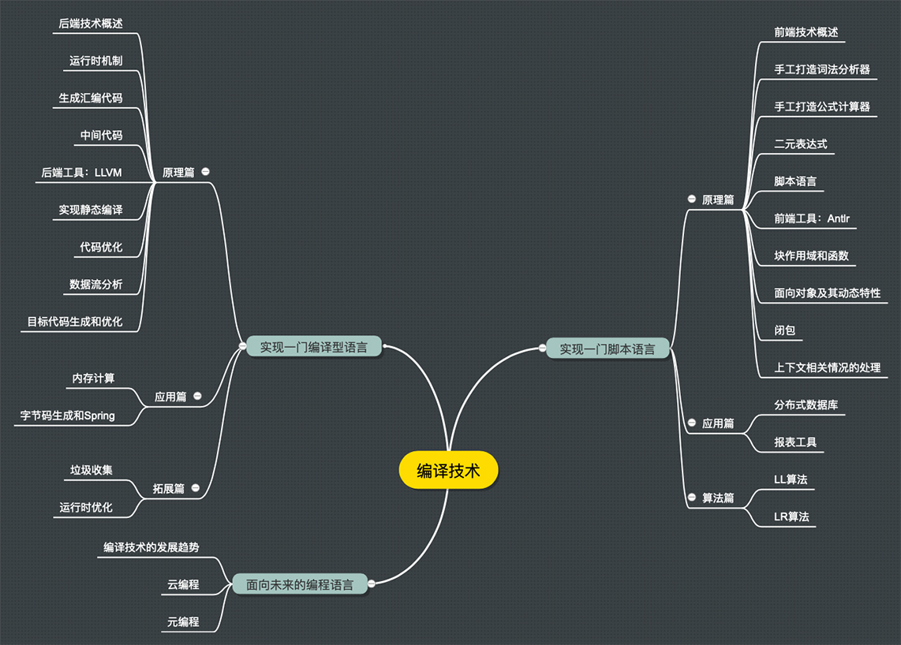
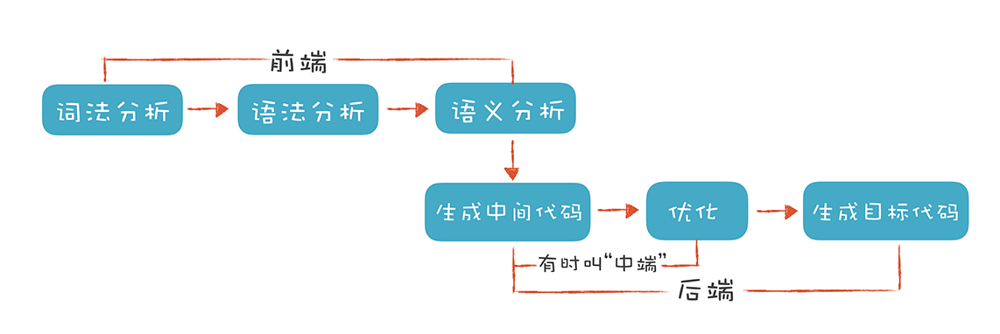

# 编译原理之美

## 前言

### 为什么要学？

这种想法是把编译原理的用途简单化了。**编译原理不是只能用于炫耀的屠龙技。** 别的不说，作为程序员，**在实际工作中你经常会碰到需要编译技术的场景。**

Java 程序员想必很熟悉 Hibernate 和 Spring，前者用到了编译技术做 HQL 的解析，后者对注解的支持和字节码动态生成也属于编译技术。所以，如果你要深入理解和用好这类工具，甚至想写这种类型的工具，会需要编译技术。

而 PHP 程序员在写程序的时候，一般会用到模板引擎实现界面设计与代码的分离。==模板引擎对模板进行编译，形成可执行的 PHP 代码==。模板引擎可以很强大，支持条件分支、循环等语法。如果你了解编译技术，会更容易掌握这些模板引擎，甚至写出更符合领域需求的模板引擎。

### 对于前端

除此之外，解析用户输入，防止代码注入，为前端工程师提供像 React 那样的 DSL，像 TypeScript 那样把一门语言翻译成另一门语言，像 CMake 和 Maven 那样通过配置文件来灵活工作，以及运维工程师分析日志文件等等高级别的需求，都要用到编译技术。

* 最后面试能有用

### todo

* 迭代出一门脚本语言和一门编译型语言

## 开始

### 编译器的前端技术

当然了，**这里的“前端”指的是编译器对程序代码的分析和理解过程。**它通常只跟语言的语法有关，跟目标机器无关（ts）。**而与之对应的“后端”则是生成目标代码的过程，跟目标机器有关。**(java)为了方便你理解，我用一张图直观地展现了编译器的整个编译过程。

