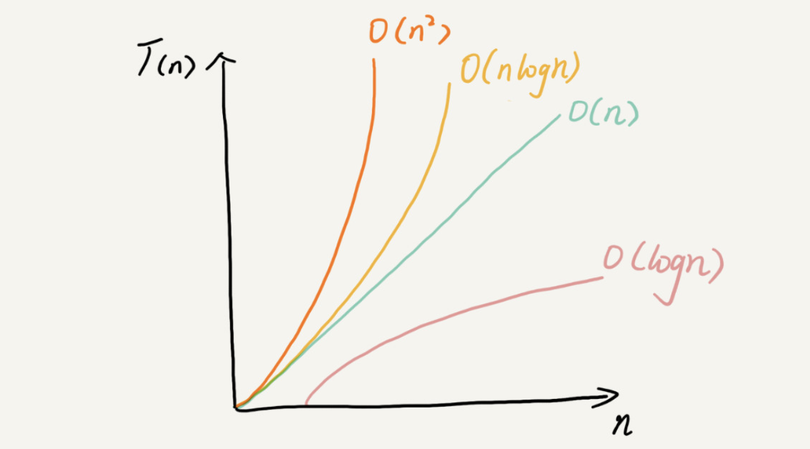

# profiling


# complexity

## commonly used(primary purpose)

* 这里面有 10 个数据结构：数组、链表、栈、队列、散列表、二叉树、堆、跳表、图、Trie树；10 个算法：递归、排序、二分查找、搜索、哈希算法、贪心算法、分治算法、回溯算法、动态规划、字符串匹配算法。

## why analyse complexity

1. 测试结果非常依赖测试环境，和硬件机器有关联，不通用
2. 测试结果受到数据规模的影响较大，数据规模小的排序，快排有可能比插入排序差，不通用。所以，我们需要一个不用具体的测试数据来测试，就可以粗略地估计算法的执行效率的方法。

## 大 O 复杂度表示法

算法的执行效率，粗略地讲，就是算法代码执行的时间。

从 CPU 的角度来看，这段代码的每一行都执行着类似的操作：读数据-运算-写数据。尽管每行代码对应的 CPU 执行的个数、执行的时间都不一样，但是，我们这里只是粗略估计，所以可以==假设每行代码执行的时间都一样==，为 unit_time。

所有代码的执行时间 T(n) 与每行代码的执行次数成正比。

==所有代码的执行时间 T(n) 与每行代码的执行次数 n成正比==

`T(n) = O(f(n))`

* T(n)表示代码执行时间；n表示数据规模的大小；f(n)表示每行代码执行的次数总和。因为这是一个公式，所以用 f(n)来表示。公式中的 O，表示代码的执行时间 T(n) 与 f(n) 表达式成正比。
* 大 O 时间复杂度实际上并不具体表示代码真正的执行时间，==而是表示代码执行时间随数据规模增长的变化趋势==，所以，也叫作==渐进时间复杂度==（asymptotic time complexity），简称时间复杂度。因此常数复杂度，即使执行了 10000 次也是常量，都可以省略。

### 分析时间复杂度

三个实用的方法

1. 只关注循环执行次数最多的一段代码

   循环n次可以忽略执行一次的代码

2. 加法法则：总复杂度等于量级最大的那段代码的复杂度

3. 乘法法则：嵌套代码的复杂度等于嵌套内外代码复杂度的乘积

   ```
   T1(n)=O(f(n)), T2(n)=O(g(n))
   T(n)=T1(n)*T2(n)=O(f(n))*O(g(n))=O(f(n)*g(n))
   ∴
   T1(n)=O(n),T2(n)=O(n^2),则 T1(n)*T2(n)=O(n^3)
   ```

   

## usually used complexity

常用的复杂度量级，我们可以粗略的分为两类，多项式量级和非多项式量级。

多项式量级

* 常量阶 O(1)
* 对数阶 O(logn)
* 线性阶 O(n)
* 线性对数阶 O(nlogn)
* 平方阶 O(n^2)、立方阶 O(n^3)..... k 次方阶 O(n^k)

非多项式量级（NP）

* O(2^n)
* O(n!)

当数据规模 n 越来越大时，非多项式量级算法的执行时间会急剧增加，求解问题的执行时间会无限增长。所以，非多项式时间复杂度的算法其实是非常低效的算法。

### 1.O(1)

首先你必须明确一个概念，O(1) 只是常量级时间复杂度的一种表示方法，并不是指只执行了一行代码。比如这段代码，即便有 3 行，它的时间复杂度也是 O(1），而不是 O(3)

只要代码的执行时间不随 n 的增大而增长，这样代码的时间复杂度我们都记作 O(1)。或者说，一般情况下，只要算法中不存在循环语句、递归语句，即使有成千上万行的代码，其时间复杂度也是Ο(1)

### 2. O(logn)、O(nlogn)

代码

```js
let i = 1;
while (i <= n) {
  i = i * 3
}
```

* 分析上述代码

  执行次数设置为k，每一行时间unit_time。注意，所有的分析都是要求出执行次数，k

  1 1\*3  1*3^2...  1\*3^k=n

  k = log3(n)

  O(log(n))

* O(nlogn) 则是一个O(n) 量级的算法乘以一个对数阶的算法

### 3. O(m+n)、O(m*n)

* 无法事先评估的两个数据规模相加，就不能省略其中一个了

## spatial complexity

* 空间复杂度： 渐进空间复杂度。表示算法的存储空间与数据规模之间的增长关系。
* 我们常见的空间复杂度就是 O(1)、O(n)、O(n^2)，像 O(logn)、O(nlogn) 这样的对数阶复杂度平时都用不到。空间复杂度分析比时间复杂度分析要简单很多。

粒子

```js
function fn (n) {
  let i = 0
  let arr = []
  arr.length = n
  for (; i < arr.length; ++i) {
    arr[i] = i*i
  }
}
```

* 代码的空间复杂度就是 O(n)
* 计算的是为了得到结果==额外需要的内存==，而不是本身存储这个数据结构消耗的内存。时间复杂度也是一样的，本身存储的时候时间不计算，而是计算得到结果所需时间。说白了就是中间的变量，存储结果的数据结构也不算在内。

## summary

* 复杂度也叫渐进复杂度，包括时间复杂度和空间复杂度，用来分析算法执行效率与数据规模之间的增长关系。




  

## best case time complexity & worst case time complexity

* 最好时间复杂度、最坏时间复杂度
* 最好时间复杂度：在最理想的情况下，执行这段代码的时间复杂度
* 最坏情况时间复杂度就是，在最糟糕的情况下，执行这段代码的时间复杂度

任何算法都要有最好时间复杂度的出口

## 平均时间复杂度

* 简单：

  要查找的变量 x 在数组中的位置，有 n+1 种情况：在数组的 0～n-1 位置中和不在数组中。我们把每种情况下，查找需要遍历的元素个数累加起来，然后再除以 n+1，就可以得到需要遍历的元素个数的平均值，即：

  查找元素在各个位置所需的次数 / 所有情况个数 

* 引入概率

  我们知道，要查找的变量 x，要么在数组里，要么就不在数组里。这两种情况对应的概率统计起来很麻烦，为了方便你理解，我们假设在数组中与不在数组中的概率都为 1/2。另外，要查找的数据出现在 0～n-1 这 n 个位置的概率也是一样的，为 1/n。所以，根据概率乘法法则，要查找的数据出现在 0～n-1 中任意位置的概率就是 1/(2n)。

  ```js
  1 * 1/2n + 2 * 1/2n + ... + n * 1/2n + n * 1/2 = (3n + 1)/4
  ```

  这个值就是概率论中的加权平均值，也叫作期望值，所以平均时间复杂度的全称应该叫加权平均时间复杂度或者期望时间复杂度。

## 均摊时间复杂度

```java
 // array 表示一个长度为 n 的数组
 // 代码中的 array.length 就等于 n
 int[] array = new int[n];
 int count = 0;
 
 void insert(int val) {
    if (count == array.length) {
       int sum = 0;
       for (int i = 0; i < array.length; ++i) {
          sum = sum + array[i];
       }
       array[0] = sum;
       count = 1;
    }
 
    array[count] = val;
    ++count;
 }
```

* 均摊时间复杂度出现的时候，都是有规律的出现，比如 n 个 O(1) 时间复杂度出现一个 O(n) 时间复杂度，这样才能进行均摊（摊还法）
* 对一个数据结构进行一组连续操作中，大部分情况下时间复杂度都很低，只有个别情况下时间复杂度比较高，而且这些操作之间存在前后连贯的时序关系，这个时候，我们就可以将这一组操作放在一块儿分析，看是否能将较高时间复杂度那次操作的耗时，平摊到其他那些时间复杂度比较低的操作上。而且，==在能够应用均摊时间复杂度分析的场合，一般均摊时间复杂度就等于最好情况时间复杂度==。

# dataStruct

## Array

**数组（Array）是一种线性表数据结构。它用一组连续的内存空间，来存储一组具有相同类型的数据。**

* 具有查找优势，删除和插入劣势
* 线性表数据结构

### 几个概念

1. 第一是**线性表**（Linear List）。顾名思义，线性表就是数据排成像一条线一样的结构。每个线性表上的数据最多==只有前和后两个方向==。其实除了数组，链表、队列、栈等也是线性表结构。


* 而与它相对立的概念是**非线性表**，比如二叉树、堆、图等。之所以叫非线性，是因为，在非线性表中，数据之间并不是简单的前后关系。

  

2. 第二个是**连续的内存空间和相同类型的数据**。正是因为这两个限制，它才有了一个堪称“杀手锏”的特性：“随机访问”。但有利就有弊，这两个限制也让数组的很多操作变得非常低效，比如要想在数组中删除、插入一个数据，为了保证连续性，就需要做大量的数据搬移工作。

### 数组是如何实现根据下标随机访问数组元素

* 我们拿一个长度为 10 的 int 类型的数组 int[] a = new int[10] 来举例。在我画的这个图中，计算机给数组 a[10]，分配了一块连续内存空间 1000～1039，其中，内存块的首地址为 base_address = 1000。


* 通过寻址公式查找元素。我们知道，计算机会给每个内存单元分配一个地址，计算机通过地址来访问内存中的数据。当计算机需要随机访问数组中的某个元素时，它会首先通过下面的==寻址公式==，计算出该元素存储的内存地址：

  ```js
  a[i]_address = base_address + i * data_type_size
  ```

* 这里我要特别纠正一个“错误”。我在面试的时候，常常会问数组和链表的区别，很多人都回答说，“链表适合插入、删除，时间复杂度 O(1)；数组适合查找，查找时间复杂度为 O(1)”。

  ==数组不是适合查找，准确的说是适合根据 索引 随机访问==。

  实际上，这种表述是不准确的。数组是适合查找操作，但是查找的时间复杂度并不为 O(1)。即便是排好序的数组，你用二分查找，时间复杂度也是 O(logn)。所以，正确的表述应该是，数组支持随机访问，根据下标随机访问的时间复杂度为 O(1)。

### 低效的“插入”和“删除”

如何优化：

* 插入

  如果数组中的数据是有序的，我们在某个位置插入一个新的元素时，就必须按照刚才的方法搬移 k 之后的数据。但是，如果数组中存储的数据并没有任何规律，数组只是被当作一个存储数据的集合。在这种情况下，如果要将某个数组插入到第 k 个位置，为了避免大规模的数据搬移，我们还有一个简单的办法就是，直接将第 k 位的数据搬移到数组元素的最后，把新的元素直接放入第 k 个位置。

  不需要保持原来数组的顺序，只需要把指定的数据插入到指定的位置即可。

  利用这种处理技巧，在特定场景下，在第 k 个位置插入一个元素的时间复杂度就会降为 O(1)。这个处理思想在快排中也会用到，我会在排序那一节具体来讲，这里就说到这儿。

* 删除

  和插入类似，如果删除数组末尾的数据，则最好情况时间复杂度为 O(1)；如果删除开头的数据，则最坏情况时间复杂度为 O(n)；平均情况时间复杂度也为 O(n)。

  我们继续来看例子。数组 a[10] 中存储了 8 个元素：a，b，c，d，e，f，g，h。现在，我们要依次删除 a，b，c 三个元素。

  

  为了避免 d，e，f，g，h 这几个数据会被搬移三次，我们可以先记录下已经删除的数据。每次的删除操作并不是真正地搬移数据，只是记录数据已经被删除。当数组没有更多空间存储数据时，我们再触发执行一次真正的删除操作，这样就大大减少了删除操作导致的数据搬移。

  如果你了解 JVM，你会发现，这不就是 JVM 标记清除垃圾回收算法的核心思想吗？没错，数据结构和算法的魅力就在于此，**很多时候我们并不是要去死记硬背某个数据结构或者算法，而是要学习它背后的思想和处理技巧，这些东西才是最有价值的**。如果你细心留意，不管是在软件开发还是架构设计中，总能找到某些算法和数据结构的影子。

### 警惕数组的访问越界问题

```c
int main(int argc, char* argv[]){
    int i = 0;
    int arr[3] = {0};
    for(; i<=3; i++){
        arr[i] = 0;
        printf("hello world\n");
    }
    return 0;
}
```

> 对文中示例的无限循环有疑问的同学，建议去查函数调用的栈桢结构细节（操作系统或计算机体系结构的教材应该会讲到）。
>
> 函数体内的局部变量存在栈上，且是连续压栈。在Linux进程的内存布局中，栈区在高地址空间，从高向低增长。变量i和arr在相邻地址，且i比arr的地址大，所以arr越界正好访问到i。
>
> 这段解释需要研究，只有在 c 语言中会出现

* 根据数组的寻址公式，arr[3] 会直接访问某块不属于数组的内存地址上。而这个地址正好是存储变量 i 的内存地址，那么 a[3]=0 就相当于 i=0，所以就会导致代码无限循环。
* 数组越界在 C 语言中是一种未决行为，并没有规定数组访问越界时编译器应该如何处理。因为，访问数组的本质就是访问一段连续内存，只要数组通过偏移计算得到的内存地址是可用的，那么程序就可能不会报任何错误。


### 容器能否完全替代数组？

* 容器完全不需要考虑数组的操作细节，比如说扩容等操作。
* 以Java为例，ArrayList 如果使用 ArrayList，我们就完全不需要关心底层的扩容逻辑，ArrayList 已经帮我们实现好了。每次存储空间不够的时候，它都会将空间自动扩容为 1.5 倍大小。（JavaScript 是怎样实现的）
* 不过，这里需要注意一点，因为扩容操作涉及内存申请和数据搬移，是比较耗时的。所以，如果事先能确定需要存储的数据大小，最好**在创建 ArrayList 的时候事先指定数据大小**。

### 总结

对于业务开发，直接使用容器就足够了，省时省力。毕竟损耗一丢丢性能，完全不会影响到系统整体的性能。但如果你是做一些非常底层的开发，比如开发网络框架，性能的优化需要做到极致，这个时候数组就会优于容器，成为首选。

### 答疑

为什么数组的下标会从 0 开始

从数组存储的内存模型上来看，“下标”最确切的定义应该是“偏移（offset）”。前面也讲到，如果用 a 来表示数组的首地址，a[0] 就是偏移为 0 的位置，也就是首地址，a[k] 就表示偏移 k 个 type_size 的位置，所以计算 a[k] 的内存地址只需要用这个公式。

因为数组寻址应用到寻址公式，如果使用 1 为下标开始，数组每次的查找都需要多进行一步减法操作。

## linked list

### 0. 引子：LRU 缓存淘汰算法

* 缓存是一种提高数据读取性能的技术，在硬件设计、软件开发中都有着非常广泛的应用，比如常见的 CPU 缓存、数据库缓存、浏览器缓存等等。
* 缓存的清理：缓存的大小有限，当缓存被用满时，哪些数据应该被清理出去，哪些数据应该被保留？这就需要缓存淘汰策略来决定。常见的策略有三种：先进先出策略 FIFO（First In，First Out）、最少使用策略 LFU（Least Frequently Used）、最近最少使用策略 LRU（Least Recently Used）。

### 1. 单链表

* 链表通过指针将一组零散的内存块串联在一起。其中，我们把内存块称为链表的“**结点**”。为了将所有的结点串起来，每个链表的结点除了存储数据之外，还需要记录链上的下一个结点的地址。如图所示，我们把这个记录下个结点地址的指针叫作**后继指针 next**。


* 与数组一样，链表也支持数据的查找、插入和删除操作。
* 两个特殊的结点，第一个结点和最后一个结点。我们习惯性地把第一个结点叫作**头结点**，把最后一个结点叫作**尾结点**。其中，头结点用来记录链表的基地址。有了它，我们就可以遍历得到整条链表。而尾结点特殊的地方是：指针不是指向下一个结点，而是指向一个**空地址 NULL**，表示这是链表上最后一个结点。
* 数组随机访问第 k 个元素，只需要执行寻址公式，找到对应的元素的地址即可。而链表随机访问一个结点，需要根据指针一个结点一个结点地依次遍历，直到找到相应的结点。所以，链表随机访问的性能没有数组好，需要 O(n) 的时间复杂度。

### 2. **循环链表**

* **循环链表是一种特殊的单链表**

  它跟单链表唯一的区别就在尾结点。我们知道，单链表的尾结点指针指向空地址，表示这就是最后的结点了。而循环链表的尾结点指针是指向链表的头结点。从我画的循环链表图中，你应该可以看出来，它像一个环一样首尾相连，所以叫作“循环”链表。

### 3. 双向链表

* 单向链表只有一个方向，结点只有一个后继指针 next 指向后面的结点。而双向链表，顾名思义，它支持两个方向，每个结点不止有一个后继指针 next 指向后面的结点，还有一个前驱指针 prev 指向前面的结点。


* 从我画的图中可以看出来，双向链表需要额外的两个空间来存储后继结点和前驱结点的地址。所以，如果存储同样多的数据，双向链表要比单链表占用更多的内存空间。虽然两个指针比较浪费存储空间，但可以支持双向遍历，这样也带来了双向链表操作的灵活性。
* 从结构上来看，双向链表可以支持 O(1) 时间复杂度的情况下找到前驱结点，正是这样的特点，也使双向链表在某些情况下的插入、删除等操作都要比单链表简单、高效。
* 你可能会说，我刚讲到单链表的插入、删除操作的时间复杂度已经是 O(1) 了，双向链表还能再怎么高效呢？别着急，刚刚的分析比较偏理论，很多数据结构和算法书籍中都会这么讲，但是这种说法实际上是不准确的，或者说是有先决条件的。我再来带你分析一下链表的两个操作。

#### 例子

在实际的软件开发中，从链表中删除一个数据无外乎这两种情况：

- 删除结点中“值等于某个给定值”的结点；
- 删除给定指针指向的结点。

对于第一种情况，不管是单链表还是双向链表，为了查找到值等于给定值的结点，都需要从头结点开始一个一个依次遍历对比，直到找到值等于给定值的结点，然后再通过我前面讲的指针操作将其删除。(节点值互换，节点 next 指针互换)

尽管单纯的删除操作时间复杂度是 O(1)，但遍历查找的时间是主要的耗时点，对应的时间复杂度为 O(n)。根据时间复杂度分析中的加法法则，删除值等于给定值的结点对应的链表操作的总时间复杂度为 O(n)。

对于第二种情况，我们已经找到了要删除的结点，但是删除某个结点 q 需要知道其前驱结点，而单链表并不支持直接获取前驱结点，所以，为了找到前驱结点，我们还是要从头结点开始遍历链表，直到 p->next=q，说明 p 是 q 的前驱结点。

但是对于双向链表来说，这种情况就比较有优势了。因为双向链表中的结点已经保存了前驱结点的指针，不需要像单链表那样遍历。所以，针对第二种情况，==单链表删除操作需要 O(n) 的时间复杂度，而双向链表只需要在 O(1) 的时间复杂度内就搞定了！==

同理，如果我们希望在链表的某个指定结点前面插入一个结点，双向链表比单链表有很大的优势。双向链表可以在 O(1) 时间复杂度搞定，而单向链表需要 O(n) 的时间复杂度。你可以参照我刚刚讲过的删除操作自己分析一下。

* 因为删除和插入都需要依赖前驱结点。

除了插入、删除操作有优势之外，对于一个有序链表，双向链表的按值查询的效率也要比单链表高一些。因为，我们可以记录上次查找的位置 p，每次查询时，根据要查找的值与 p 的大小关系，决定是往前还是往后查找，所以平均只需要查找一半的数据。

* 随机查找有序链表，需要判断是往左还是往右走，类似于二分法。

实际上，这里有一个更加重要的知识点需要你掌握，那就是**用空间换时间**的设计思想。当内存空间充足的时候，如果我们更加追求代码的执行速度，我们就可以选择空间复杂度相对较高、但时间复杂度相对很低的算法或者数据结构。相反，如果内存比较紧缺，比如代码跑在手机或者单片机上，这个时候，就要反过来用时间换空间的设计思路。

还是开篇缓存的例子。==缓存实际上就是利用了空间换时间的设计思想==。如果我们把数据存储在硬盘上，会比较节省内存，但每次查找数据都要询问一次硬盘，会比较慢。但如果我们通过缓存技术，事先将数据加载在内存中，虽然会比较耗费内存空间，但是每次数据查询的速度就大大提高了。

### 实现 LRU 缓存淘汰算法

我的思路是这样的：我们维护一个有序单链表，越靠近链表尾部的结点是越早之前访问的。当有一个新的数据被访问时，我们从链表头开始顺序遍历链表。

1. 如果此数据之前已经被缓存在链表中了，我们遍历得到这个数据对应的结点，并将其从原来的位置删除，然后再插入到链表的头部。

2. 如果此数据没有在缓存链表中，又可以分为两种情况：

- 如果此时缓存未满，则将此结点直接插入到链表的头部；
- 如果此时缓存已满，则链表尾结点删除，将新的数据结点插入链表的头部。

现在我们来看下 m 缓存访问的时间复杂度是多少。因为不管缓存有没有满，我们都需要遍历一遍链表，所以这种基于链表的实现思路，缓存访问的时间复杂度为 O(n)。

实际上，我们可以继续优化这个实现思路，比如引入**散列表**（Hash table）来记录每个数据的位置，将缓存访问的时间复杂度降到 O(1)。因为要涉及我们还没有讲到的数据结构，所以这个优化方案，我现在就不详细说了，等讲到散列表的时候，我会再拿出来讲。

## linked list vs Array

* 通过前面内容的学习，你应该已经知道，数组和链表是两种截然不同的内存组织方式。正是因为内存存储的区别，它们插入、删除、随机访问操作的时间复杂度正好相反。

  

#### 总结

* 不过，数组和链表的对比，并不能局限于时间复杂度。而且，在实际的软件开发中，不能仅仅利用复杂度分析就决定使用哪个数据结构来存储数据。

  数组简单易用，在实现上使用的是连续的内存空间，可以借助 CPU 的缓存机制[^1]，预读数组中的数据，所以访问效率更高。而链表在内存中并不是连续存储，所以对 CPU 缓存不友好，没办法有效预读。

[^1]:CPU在从内存读取数据的时候，会先把读取到的数据加载到CPU的缓存中。而CPU每次从内存读取数据并不是只读取那个特定要访问的地址，而是==读取一个数据块==(这个大小我不太确定。。)并保存到CPU缓存中，然后下次访问内存数据的时候就会先从CPU缓存开始查找，如果找到就不需要再从内存中取。这样就实现了比内存访问速度更快的机制，也就是CPU缓存存在的意义:为了弥补内存访问速度过慢与CPU执行速度快之间的差异而引入。 对于数组来说，存储空间是连续的，所以在加载某个下标的时候可以把以后的几个下标元素也加载到CPU缓存这样执行速度会快于存储空间不连续的链表存储。

* 数组的缺点是大小固定，一经声明就要占用整块连续内存空间。如果声明的数组过大，系统可能没有足够的连续内存空间分配给它，导致“内存不足（out of memory）”。如果声明的数组过小，则可能出现不够用的情况。这时只能再申请一个更大的内存空间，把原数组拷贝进去，非常费时。链表本身没有大小的限制，天然地支持动态扩容，我觉得这也是它与数组最大的区别。
* 除此之外，如果你的代码对内存的使用非常苛刻，那数组就更适合你。因为链表中的每个结点都需要消耗额外的存储空间去存储一份指向下一个结点的指针，所以内存消耗会翻倍。而且，对链表进行频繁的插入、删除操作，还会导致频繁的内存申请和释放，容易造成内存碎片，如果是 Java 语言，就有可能会导致频繁的 GC（Garbage Collection，垃圾回收）。


# algorithm skill summary

## 1. 快慢指针

* 需要找出一个线性数据结构的中点的时候，可以使用快慢指针，一个指针一次走一格，一个指针一次走两格。

## 2. 哨兵

* 如果每次遍历都需要两个判断条件，可以将其中一个==边界条件==换成一个哨兵，（相当于简化判断条件，因为判断条件也跟随着循环执行。）哨兵一般就是用来执行边界问题的。

```c
// 在数组 a 中，查找 key，返回 key 所在的位置
// 其中，n 表示数组 a 的长度
int find(char* a, int n, char key) {
  // 边界条件处理，如果 a 为空，或者 n<=0，说明数组中没有数据，就不用 while 循环比较了
  if(a == null || n <= 0) {
    return -1;
  }
  
  int i = 0;
  // 这里有两个比较操作：i<n 和 a[i]==key.
  while (i < n) {
    if (a[i] == key) {
      return i;
    }
    ++i;
  }
  
  return -1;
}
```


```c
// 在数组 a 中，查找 key，返回 key 所在的位置
// 其中，n 表示数组 a 的长度
// 我举 2 个例子，你可以拿例子走一下代码
// a = {4, 2, 3, 5, 9, 6}  n=6 key = 7
// a = {4, 2, 3, 5, 9, 6}  n=6 key = 6
int find(char* a, int n, char key) {
  if(a == null || n <= 0) {
    return -1;
  }
  
  // 这里因为要将 a[n-1] 的值替换成 key，所以要特殊处理这个值
  if (a[n-1] == key) {
    return n-1;
  }
  
  // 把 a[n-1] 的值临时保存在变量 tmp 中，以便之后恢复。tmp=6。
  // 之所以这样做的目的是：希望 find() 代码不要改变 a 数组中的内容
  char tmp = a[n-1];
  // 把 key 的值放到 a[n-1] 中，此时 a = {4, 2, 3, 5, 9, 7}
  a[n-1] = key;
  
  int i = 0;
  // while 循环比起代码一，少了 i<n 这个比较操作
  while (a[i] != key) {
    ++i;
  }
  
  // 恢复 a[n-1] 原来的值, 此时 a= {4, 2, 3, 5, 9, 6}
  a[n-1] = tmp;
  
  if (i == n-1) {
    // 如果 i == n-1 说明，在 0...n-2 之间都没有 key，所以返回 -1
    return -1;
  } else {
    // 否则，返回 i，就是等于 key 值的元素的下标
    return i;
  }
}
```

* 上边例子中的 i < n 条件不跟随循环去执行，节省了执行时间。