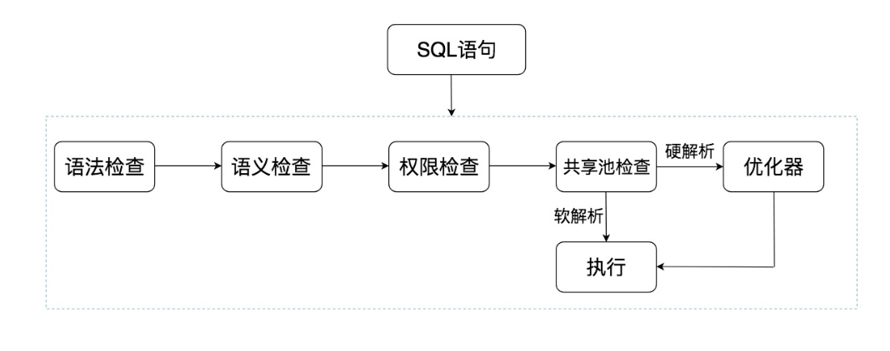
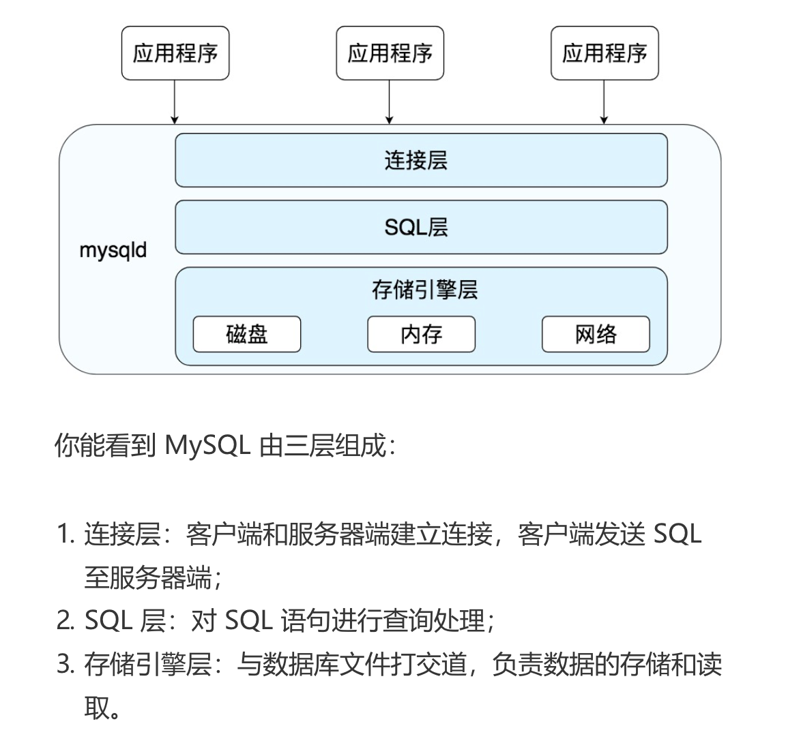

# 0. 一些基本的概念

* DB database，也就是数据库。数据库是存储数据的集合，你可以把它理解为多个数据表。
* DBMS （database management system），数据库管理系统，实际上它可以对多个数据库进行管理，所以你可以理解为 DBMS = 多个数据库(DB) + 管理系统。
* DBS (database System)，数据库系统。它是更大的概念，包括了数据库、数据库管理系统以及数据库管理人员 DBA
* Oracle、MySQL 等被称为数据库，确切的说，它们应该是数据库管理系统，即 DBMS
* RDBMS (relational database management system)，关系型数据库管理系统

# 1. 初始

* Oracle 中的 sql 是如何执行的

  
  
  
  
  * 共享池检查：==共享池( shared pool )== 是一块内存池，最主要的作用是缓存 SQL 语句和改语句的执行计划。Oracle 通过检查共享池是否存在 SQL 语句的执行计划，来判断进行软解析，还是硬解析。那软解析和硬解析又该怎么理解呢？
  
    在共享池中，Oracle 首先对 SQL 语句进行 Hash 运算，然后根据 Hash 值在库缓存（Library Cache）中查找，如果存在 SQL 语句的执行计划，就直接拿来执行，直接进入“执行器”的环节，这就是软解析。如果没有找到 SQL 语句和执行计划，Oracle 就需要创建解析树进行解析，生成执行计划，进入“优化器”这个步骤，这就是硬解析。
  
  * 优化器：优化器中就是要进行硬解析，也就是决定怎么做，比如创建解析树，生成执行计划。
  
  * 执行器：当有了解析树和执行计划之后，就知道了 SQL该怎么被执行，这样就可以在执行器中执行语句了。
  
* MySQL 架构

  首先 MySQL 是典型的 C/S 架构，即 Client/Server 架构，服务器端程序使用的 mysqld。

  

  你能看到 SQL 语句在 MySQL 中的流程是：SQL 语句→缓存查询→解析器→优化器→执行器。在一部分中，MySQL和 Oracle 执行 SQL 的原理是一样的。

   与 Oracle 不通的是，MySQL 的存储引擎采用了插件的形式，每个存储引擎都面向一种特定的数据库应用环境。同时开源的MySQL还允许开发人员设置自己的存储引擎。

  需要注意的是，数据库的设计在于表的设计，而在 MySQL中每个表的设计都可以采用不同的存储引擎，我们可以==根据实际的数据处理需要来选择存储引擎==，这也是 MySQL 的强大之处。对不通的表采用不通的存储引擎。

  不通的 数据库管理系统组织结构太过庞大，我们在学习的时候，还需要具备抽象的能力，抓取最核心的部分：==SQL 的执行原理==。因为不同的 DBMS 的SQL 的执行原理是相通的，只是在不同的软件中，各有各的实现路径。

## 2. mysql 的一些函数

```sql
-- 查询是否打开 profiling，检测性能的工具，能查看执行过程以及执行时间
slect @@profiling;
-- 打开 profiling
set profiling=1;
-- 查看执行的过程
show profile;
-- 查看请求query id为2的请求执行时间
show profile for query 2;
-- 查看版本
select version();
```

# MySQL

https://www.cainiaojc.com/mysql/mysql-tutorial.html

## 什么是数据库

Database 是按照数据结构来组织、存储和管理数据库的仓库。

> 我们也可以将数据存储在文件中，但是在文件中读写数据速度相对较慢。
>
> 所以，现在我们使用关系型数据库管理系统(RDBMS)来存储和管理大数据量。所谓的关系型数据库，是建立在关系模型基础上的数据库，借助于集合代数等数学概念和方法来处理数据库中的数据。

* 建立在关系模型基础上的数据库
* 借助集合代数等数学概念和方法来处理数据库中的数据

RDBMS 即关系数据库管理系统(Relational Database Management System)的特点：

- 1.数据以表格的形式出现
- 2.每行为各种记录名称
- 3.每列为记录名称所对应的数据域
- 4.许多的行和列组成一张表单
- 5.若干的表单组成database

## RDBMS 术语

* 数据库：数据库是一些关联表的集合
* 数据表：表示数据的矩阵。在一个数据库中表看起来像是一个简单的电子表格。
* 列：一列（数据元素）包含了相同类型的数据，例如邮政编码的数据
* 行：一行（=元祖，或记录）是一组相关的数据，例如一条用户订阅的数据
* **冗余**：存储两倍数据，冗余降低了性能，但提高了数据的安全性。
* **主键**：主键是唯一的。一个数据表中只能包含一个主键。你可以使用主键来查询数据。
* **外键：**外键用于关联两个表。
* **复合键**：复合键（组合键）将多个列作为一个索引键，一般用于复合索引。
* **索引：**使用索引可快速访问数据库表中的特定信息。索引是对数据库表中一列或多列的值进行排序的一种结构。类似于书籍的目录。
* **参照完整性:** 参照的完整性要求关系中不允许引用不存在的实体。与实体完整性是关系模型必须满足的完整性约束条件，目的是保证数据的一致性。

### MySQL 简介

MySQL 为关系型数据库(Relational Database Management System), 这种所谓的"关系型"可以理解为"表格"的概念, 一个关系型数据库由一个或数个表格组成, 如图所示的一个表格:


- 表头(header): 每一列的名称;
- 列(col): 具有相同数据类型的数据的集合;
- 行(row): 每一行用来描述某条记录的具体信息;
- 值(value): 行的具体信息, 每个值必须与该列的数据类型相同;
- **键(key)**: 键的值在当前列中具有唯一性。

### relational db

MySQL 是一种关联数据库管理系统，关联数据库将数据保存在不同的表中，而不是将所有数据放在一个大仓库内，这样就增加了速度并提高了灵活性。

* 不同的表共同维护数据，表与表之间通过id来关联


## database & schema

> 从 MySQL5.0 开始，官方文档中开始使用 schema 来代替 database 来描述 MySQL 中的数据库。但是，实际上 MySQL 中的数据库仍然可以使用 database 来称呼，两者是等价的


## mysql docker 容器

### 启动命令

如下是我的配置：

```bash
$ docker run -v "$PWD/data":/var/lib/mysql --user 1000:1000 -p 8095:3306 --name some-mysql -e MYSQL_ROOT_PASSWORD=my-secret-pw -d mysql
$ docker run -v /Users/zhangbinbinb28199/my-data/mysql/data:/var/lib/mysql --user 501:501 -p 8091:3306 --name mysql-test -e MYSQL_ROOT_PASSWORD=qazplm -d mysql
# 必须如上，否则有权限错误！！！参考：https://hub.docker.com/_/mysql 
# Running as an arbitrary user。 关键词permissions
# user 参考：https://www.cnblogs.com/sparkdev/p/9614164.html
```

## 客户端

使用的 mysql workbench

https://juejin.cn/book/7226988578700525605/section/7228944127025479738

### 概念间的关系——查看数据库

数据库组成：

每个数据库下存储着很多表、视图、存储过程和函数。


那么查找维度就变成了：
数据库 -> 数据表

我们最终要操作的就是表。

## mysql 数据类型

参考：https://www.cainiaojc.com/mysql/mysql-data-types.html

> MySQL中定义数据字段的类型对你数据库的优化是非常重要的。
>
> MySQL支持多种类型，大致可以分为三类：数值、日期/时间和字符串(字符)类型。

* 定义好字段类型对数据库的优化非常重要！

## 操作

### 选中数据库

sql操作的 form 一般指定的是表名称，一般情况下需要先找到数据库

```sql
use 'mysql-test';
```

&

```sql
DELETE FROM `hello-mysql`.`student` WHERE (`id` = '2');
```

* 用对象 . 链接的方式选中表

### 新建表

新建 database -> 新建表

### 字段类型

字段约束

* 非空约束 NN

  也就对应着接口这个数据是必填的

类型约束：

整数类的有：TINYINT、SMALLINT、MEDIUMINT、INT 和 BIGINT

看名字就可以看出来，就是存储空间的大小不同

浮点型数字的有 FLOAT、DOUBLE

定点型数字的有 DECIMAL、MUMARIC

字符串型的有 CHAR、VARCHAR、TEXT和 BLOB

日期型的有 DATE、TIME、DATETIME、TIMESTAMP

#### 常用的类型

**INT**：存储整数

**VARCHAR(100)**: 存储变长字符串，可以指定长度

**CHAR**：定长字符串，不够的自动在末尾填充空格

**DOUBLE**：存储浮点数

TEXT: 长文本类型，可以存储 65535 长度的字符串

**DATE**：存储日期 2023-05-27

**TIME**：存储时间 10:13

**DATETIME**：存储日期和时间 2023-05-27 10:13

其余的类型用到再查也行。

* 字符串用 varchar() 来创建，longtext 表示能存储大数据（最多4g的数据）

  bigint() 表示更大的 int 类型，varchar(10) 不管英文字母还是汉字还是数字都是10个长度。（MySQL>=5 版本）

> 这里还有个 TIMESTAMP 类型，它也是存储日期时间的，但是范围小一点，而且会转为中央时区 UTC 的时间来存储。
>
> 可以看到，mysql 设计了这么多的数据类型，一个目的自然是存储更丰富的信息，另一个目的就是尽可能的节省存储空间，比如 tiny、small、medinum、big 等各种 int。。。

### date 类型

* 如果选择了默认值 Current_date，则会默认插入当前时间

### 字段属性

* 主键
* Unique：唯一性，不能够存入相同的值。（主键的唯一性最大）

### 字段操作

* 更新

  ```sql
  UPDATE `hello-mysql`.`test-table` SET `sex` = '男' WHERE (`idtest-table` = '2');
  ```

* 删除

  ```sql
  DELETE FROM `hello-mysql`.`test-table` WHERE (`idtest-table` = '2');
  ```

* 查询

  查询有更多的复杂度，一般实践中也是先查到，然后进行修改或删除。

  将在后面的章节介绍。

### 新建行 record

新增行数据，每一行都是一个 record。


## 总结

按照 sql 分类，我们学的 table 的创建、删除、清空的 sql 都属于 DDL。table 数据的增删改属于 DML，而数据的查询属于 DQL。

# SQL

sql教程：https://www.runoob.com/sql/sql-alias.html

## 分类

这里简单说一下 sql 的分类，sql 是分为好几种的，这种创建数据库、创建表等修改结构的 sql 叫做 DDL（Data Definition Language），而增删改那种叫做 DML（Data Manipulate Language），查询数据的叫做 DQL（Data Query Language）。 

## 书写规范

* 字段使用下划线，不要使用中划线
* 推荐使用大写的SQL语句

## 表别名

语法：`select * from 表明 [as] 别名` 。 as 可省略。

* 注意：一旦使用了表别名，后面的语句必须使用别名，不能再使用表名

## 主键的选取

> 在设计关系数据表的时候，看上去唯一的列，例如身份证号、邮箱地址等，因为他们具有业务含义，因此不宜作为主键。

* 看似唯一的值，有业务属性。主键可能在某种情况下被修改，但是业务的唯一值不能被修改

## 查询

查询所有是：（也就是查询所有列）

```sql
SELECT * FROM student;
```

查询指定的列：

```sql
SELECT name, score FROM student;

# 指定列名
SELECT name as '名称', score FROM student;
```

### 带条件

查询自然是可以带条件的，通过 where：

语法就是直接拼到查询

```sql
SELECT name as '名字', score FROM student where score > 90;
```

多个条件，使用and拼接：

```sql
SELECT name as '名字', score FROM student where score > 90 and gender = '女';
```

模糊查询：（一般不推荐使用）

使用 LIKE 字段

```sql
SELECT * FROM student where score > 90 and name like '王%';
```

### 集合

指定集合中的元素：

使用in 关键字

```sql
select * from student where class in ('一班', '二班');
```

不属于：

```sql
select * from student where class not in ('一班', '二班');
```

### 区间

使用关键字 between and，是一个闭区间

语法：`字段 between start and end`

```sql
select * from student where score between 80 and 90;
```

### 限制返回区间-分页返回

使用 limit 字段，语法：`limit start length` 。注意：第二个字段是长度不是end。

不需要加where，写到句子末尾就行。

```sql
select * from student limit 0,5;;

# 或者省略
select * from student limit 3;

# 和其他条件组合
select * from student where score between 80 and 90 and score limit 2;
```

### 排序

可以通过 `order by` 来指定排序的列

```sql
select * from student order by score asc limit 5,2;

# 根据 score 排序，如果相同再根据 age 降序
select * from student order by score asc, age desc;
```

### 结果聚合

在结尾加 `GROUP BY 字段`。

聚合的目的就是聚合起来进行某种计算，group by 也意味着按某个维度进行统计！

```sql
select class as '班级', AVG(score) AS '平均成绩' FROM student group by class;

# 多个末尾条件组合
select class as '班级', AVG(score) AS '平均成绩' FROM student group by class order by '平均成绩' desc;
```

* 注意：不能不做计算就进行 group by，否则会报错

### 去重

distinct 不同的，select 之后

```sql
select distinct class from student;
```


### 内置函数

* 内置函数是在 from 之前使用

参考：https://www.cainiaojc.com/mysql/mysql-functions.html

### 分类

聚合函数：用于对数据的统计，比如 avg、count、sum、min、max

字符串函数：用于对字符串的处理，比如 concat、substr、length、upper、lower

#### avg 平均值

`Avg(字段) as 展示字段`

```sql
select class as '班级', AVG(score) AS '平均成绩' FROM student group by class order by '平均成绩' desc;
```

#### count 统计数目

返回查询的记录总数，expression 参数是一个字段或者 * 号。加字段就是包含这个字段的行。

查询的是记录总数，而不是直接计算字段和。

```sql
select class, count(*) as '人数' from student group by class;
```

* \* 代表当前行

#### sum 求和

求字段相加的和。

```sql
select class as '班级', SUM(score) as '总分' from student group by class;
```

#### max 和 min

* 计算某个字段的最大值和最小值

```sql
select avg(score) as '平均分', count(*) as '人数', sum(score) as '总分数', min(score)
	as '最低分', max(score) as '最高分' from student;
```

#### 字符串操作

```sql
select concat('名字-', name) as '名字', substr(name, 1, 1) as '姓', length(name) as '长度',
	upper('hh'), lower('aa') from student;
```

* substr(start, length)

#### 数值函数

用于对数值的处理，比如 ROUND、CEIL、FLOOR、ABS、MOD。

分别是 ROUND 四舍五入、CEIL 向上取整、FLOOR 向下取整、ABS 绝对值、MOD 取模。

#### 日期函数

**日期函数**：对日期、时间进行处理，比如 DATE、TIME、YEAR、MONTH、DAY

* 应该是和创建时间进行对比

#### 条件函数

根据条件是否成立返回不同的值，比如 IF、CASE

```sql
select name, if(score >= 80, concat('及格, 分数是', score), '不及格') from student;
```

> | IF(expr,v1,v2) | 如果表达式 expr 成立，返回结果 v1；否则，返回结果 v2。 | `SELECT IF(1 > 0,'正确','错误')   ->正确` |
> | -------------- | ------------------------------------------------------ | ----------------------------------------- |

case: 多个条件分支

```sql
select name, score, case when score >= 90 then '优秀' when score >= 60 then '良好'
	else '差' end as '评价' from student;
```

* case when then else end

#### 注意

* 如果用了一个 普通值 + 计算值 的组合，必须使用 group by 聚合

### 系统函数

用于获取系统信息，比如 VERSION、DATABASE、USER。

### 其他函数

**其他函数**：NULLIF、COALESCE、GREATEST、LEAST。

### 类型转换函数

转换类型为另一种，比如 CAST、CONVERT、DATE_FORMAT、STR_TO_DATE。

* 转换为数字

  ```sql
  select greatest(1, convert('123', signed),3);
  
  # cast
  select greatest(1, cast('123' as signed),3);
  ```

  > 这里可以转换的类型有这些：
  >
  > - signed：整型；
  > - unsigned：无符号整型
  > - decimal：浮点型；
  > - char：字符类型；
  > - date：日期类型；
  > - time：时间类型；
  > - datetime：日期时间类型；
  > - binary：二进制类型

* 剩下的 STR_TO_DATE 和 DATE_FORMAT 还是很容易理解的：

  主要是日期格式化

### 组合查询

https://segmentfault.com/a/1190000007926959

### having - 过滤

```sql
select class as '班级', SUM(score) as total from student group by class having total > 500;
```

### having 和 where 区别

having是在分组后对数据进行过滤

where是在分组前对数据进行过滤

having后面可以使用聚合函数

where后面不可以使用聚合

在查询过程中执行顺序：**from>where>group（含聚合）>having>order>select。**

* having 分组后对数据进行过滤！关键词 过滤。可以使用聚合函数。

  having 一般情况下都是与 group by 关键语句联合使用，用来过滤。

* where 分组前对数据进行过滤，关键词：筛选。不能使用聚合函数。


## MySQL 数据表连接-级联

参考：https://www.cainiaojc.com/mysql/mysql-join.html

https://zhuanlan.zhihu.com/p/68136613

> 实际开发中，但是在真正的应用中经常需要从多个数据表中读取数据。

你可以在 SELECT, UPDATE 和 DELETE 语句中使用 Mysql 的 JOIN 来联合多表查询。

JOIN 按照功能大致分为如下三类：

- **INNER JOIN（内连接,或等值连接）**：获取两个表中字段匹配关系的记录。
- **LEFT JOIN（左连接）：**获取左表所有记录，即使右表没有对应匹配的记录。
- **RIGHT JOIN（右连接）：** 与 LEFT JOIN 相反，用于获取右表所有记录，即使左表没有对应匹配的记录。

### 基础连表查询

连表查询不一定需要有任何关系，只需要满足 on 后面的条件即可。

语法 `from 源表 join 关联表 on 关联条件`

比如如下的连表查询：

```sql
select * from user join `id-card` on user.id = 9 and `id-card`.id = 8;
```

User.id 和 id-card.id 没有任何关系。

* On 后面的条件可以使用 表.字段 的方式去表示

#### 和 where 结合过滤

```sql
select * from department
	join employee on department.id = employee.department_id
    where department.id = 5;
```

* 可以和 where 结合

### 一对一的关系

id-card 表的一个外键和 user 表的主键关联，这样就能一对一查询了。

使用 join on 语句

```sql
select * from user join `id-card` on user.id = `id-card`.user_id;
```

join on 默认使用的是 inner join on。

left join 还会返回左表中没有关联上的数据。

right join 会返回右表中没有关联上的数据。

#### 外键数据同步方式

也就是主表数据变更之后，从表怎么跟随

有如下四种模式：

- CASCADE： 主表主键更新，从表关联记录的外键跟着更新，主表记录删除，从表关联记录删除。一般用来表示关系。
- SET NULL：主表主键更新或者主表记录删除，从表关联记录的外键设置为 null
- RESTRICT：只有没有从表的关联记录时，才允许删除主表记录或者更新主表记录的主键 id
- NO ACTION： 同 RESTRICT，只是 sql 标准里分了 4 种，但 mysql 里 NO ACTION 等同于 RESTRICT。

CASCADE: 级联 串联 联动、 restrict: 限制，限定，约束、

**RESTIRCT 和 NO ACTION 的处理逻辑：只要从表有关联记录，就不能更新 id 或者删除记录。**

### 名词

* 左表
* 右表
* 外键
* 从表
* 主表

### 一对多的关系

一对多非常常见，一个作者可能写出多篇文章，而每篇文章只属于一个作者

多对多也非常常见，一篇文章可以有多个标签，一个标签可以有多篇文章。


我们将以部门和员工表的关系来演示。

一个部门可能存在多个员工，一个员工表中的员工可能属于不同的部门。

* 设计一个部门表和一个员工表。员工表中增加一个 department_id 关联 department 表的id。

```sql
select * from department
	join employee on department.id = employee.department_id
    where department.id = 5;
```

* 可以在结果中使用 where 进行筛选！

### 多对多

以文章和标签为例子；


设计文章表和标签表，然后设计一个中间表来保存左表和右表的关系。

* 也就是中间表有两个主键（复合主键），分别表示左右的关联。
* 表外键的关联关系设置为 cascade。


关系多表查询

```sql
select * from article a
	join article_tag at on a.id = at.article_id
    join tag t on t.id = at.tag_id
    where a.id = 1;
```

* 使用到了表别名
* 多个表关联就是多句 join on 语句，on 后面就是当前 join 的俩表的关联条件。

#### 概念

* 联合主键

### 注意

* 如果在 where 条件中出现了多个表的引用，一定需要 from 多个表（也就是有对应个数的 from 语句），如果没from不能使用该表的字段。

  在表关联和子查询中都会出现。

## MySQL 嵌套 —— 子查询

> 我们学习了 select 的各种语法，包括 where、limit、order by、group by、having 等，再就是 avg、count、length 等函数。
>
> 还学了多个表的 join on 关联查询。
>
> 基于这些就已经可以写出复杂的查询了，但 sql 还支持更复杂的组合，sql 可以嵌套 sql，也就是子查询

* 相当于查询内容组成新的表再继续查询！
* 子查询一般后面跟着一个判断条件，比如说 = > 或者是否存在。子语句返回的结果作为比较的右输入！

### 基础子查询

```sql
select class, name from student where
	score = (select max(score) from student);
	

```

* 在where之后的条件中继续添加筛选语句

### EXISTS、NOT EXISTS

* 主要是判断子查询是否存在

子查询在某些情况下是能取代连表查询的，比如如下的场景

跨表查询：

```sql
select * from department
	where not exists (
		select * from employee where employee.department_id = department.id
    );
```

* 和连表查询类似

#### 与连表查询的关联

```sql
select * from employee
	join department on employee.department_id = department.id;

select * from employee
	where exists (
		select * from department where employee.department_id = department.id
    );
```

* 返回的结果是相同的，最大的区别就是第一个语句能够获取第二个表的字段。第二个语句已由第一个语句限制了字段。

### 插入语句使用子查询

```sql
insert into sum_department (id, name)
	select id, name from department;
```

* 如上：把一个表中查出来的数据插入到另一个表中。直接在 insert values 的后面添加子查询。

### 修改语句中使用子查询

```sql
update sum_department set name = '新的名称'
	where id = (
		select id from department where name = '客服部'
    );
```

### 删除语句中使用子查询

```sql
delete from sum_department where
	id = (
		select id from department where name = '客服部'
    );
```


## MySQL 事务 和隔离级别

有个问题：如果有两个 update 语句，一个把订单详情表数量修改了，一个把订单表金额修改了，但是修改订单总金额那个sql执行失败了。

* 多个sql执行，存在失败的情况，导致数据不同步

这种时候就需要引入事务了

### 事务 transaction

**START TRANSACTION 开启事务后所有的 sql 语句都可以 ROLLBACK，除非执行了 COMMIT 完成这段事务。**

* 一大段sql执行完成之后可以 commit，串行执行，类似于then
* 每一句前后都可以设置 savepoint，可以恢复到某个断点

**还可以设置几个 SAVEPOINT，这样可以 ROLLBACK TO 任何一个 SAVEPOINT 的位置。**

基础使用：

```sql
start transaction;
update tag set name = 'new_tag' where id = 2;
update article set title = 'new_title' where id = 2;
rollback;
commit;
```

* 也就是中间的一段sql开启事务，`start transaction`

#### 回退 rollback

中间的每个句子都可以插入一个 savepoint，方便进行里程碑回退。

```sql
start transaction;
savepoint aaaa;
update tag set name = 'new_tag2' where id = 2;
savepoint bbbb;
update article set title = 'new_title2' where id = 2;
rollback to savepoint aaaa;
commit;
```

* `rollback to savepoint 回退点` 的语法

#### 事务隔离级别

主要是多个事务执行，能不能通信的问题。

> 事务还没提交的数据，别的事务能不能读取到，这就涉及到隔离级别的概念了。

- **READ UNCOMMITTED**：可以读到别的事务尚未提交的数据。

这就有个问题，你这个事务内第一次读的数据是 aaa，下次读可能就是 bbb 了，这个问题叫做**不可重复读**。

而且，万一你读到的数据人家又回滚了，那你读到的就是临时数据，这个问题叫做**脏读**。

- **READ COMMITTED**：只读取别的事务已提交的数据。

这样是没有脏读问题了，读到的不会是临时数据。

但是还是有可能你这个事务内第一次读的数据是 aaa，下次读可能是 bbb ，也就是不可重复读的问题依然存在。

不只是数据不一样，可能你两次读取到的记录行数也不一样，这叫做**幻读**。

- **REPEATABLE READ**：在同一事务内，多次读取数据将保证结果相同。

这个级别保证了读取到的数据一样，但是不保证行数一样，也就是说解决了不可重复读的问题，但仍然存在幻读的问题。

- **SERIALIZABLE**：在同一时间只允许一个事务修改数据。

事务一个个执行，各种问题都没有了。

但是负面影响就是性能很差，只能一个个的事务执行。

这 4 种级别主要是数据一致性和性能的差别，一致性越好，并发性能就越差。

#### 查询当前隔离级别

语句

```sql
select @@transaction_isolation;
```


#### 重要

事务的隔离级别是性能和一致性不同的倾斜出现的不同策略。如果事务一个一个执行，就不会出现一致性问题了。

这 4 种级别主要是数据一致性和性能的差别，一致性越好，并发性能就越差。

需要根据实际情况来权衡。

### 使用场景

当你修改多个表的时候，并且这些表的数据是有关联的时候，事务是必须的。要不全部成功，要不全部不成功。

### 实战

基本上，只要写增删改的 sql，那都是要开事务的。

* 一般用默认的事务隔离级别，也就是 REPEATABLE READ。

注意：

* 不能长时间开启事务，那么它的并发性将会降低。不要再事务中做过多的操作。

## 视图、存储过程和函数

参考：https://juejin.cn/book/7226988578700525605/section/7237503560735260732

* 视图就是把查询结果保存下来，可以对这个视图做查询，简化了查询语句并且也能隐藏一些字段。

​	它增删改的限制比较多，一般只是来做查询。

​	就是MySQL提供的一个查询过滤器

* 存储过程就是把一段 sql 封装起来，传参数调用。

* 函数也是把一段 sql 或者其他逻辑封装起来，传参数调用，但是它还有返回值。

## MySQL 索引

参考：https://juejin.cn/post/7147609139974242317

MySQL 索引的建立对于MySQL的高效运行非常重要，索引可以打发提高MySQL的检索速度。

### 是什么

> 索引是关系数据库中对某一列或多个列的值进行预排序的数据结构。通过使用索引，可以让数据库系统不必扫描整个表，而是直接定位到符合条件的记录，这样就大大加快了查询速度。
>
> 参考：廖雪峰sql

* 也就是对数据库中的某一列或者多个列的值进行预排序的数据结构，这样就能像查字典的方式进行快速查找，大大加快了查询速度。

  在有序的列表中，最快的查询方式就是二分查找。

### 分类

* 需要合理的设计且使用索引

> 打个比方，如果合理的设计且使用索引的MySQL是一辆兰博基尼的话，那么没有设计和使用索引的MySQL就是一个人力三轮车。
>
> 拿汉语字典的目录页（索引）打比方，我们可以按拼音、笔画、偏旁部首等排序的目录（索引）快速查找到需要的字。

索引分为：

* 单列索引：一个索引质保函单个列，一个表可以有多个单列索引，但不是组合索引。
* 组合索引： 一个索引包含多个列

创建索引时，你需要确保该索引是应用在 SQL 查询语句的条件(一般作为 WHERE 子句的条件)。

==实际上索引也是一张表，该表保存了主键与索引字段，并指向实体表的记录==

### 现实场景

> 因为查询往往都是一个业务系统中最频繁的操作，一般项目的写/读请求比例都遵循三七定律，也就是`30%`的请求会涉及到写库操作，另外`70%`则属于查库类型的操作。

* 项目的实际请求中大概30%请求涉及到写库操作，70%则属于查询库类型的操作

### 注意

* 谨防索引滥用

  > 上面都在说使用索引的好处，但过多的使用索引将会造成滥用。因此索引也会有它的缺点：虽然索引大大提高了查询速度，同时却会降低更新表的速度，如对表进行INSERT、UPDATE和DELETE。因为更新表时，MySQL不仅要保存数据，还要保存一下索引文件。
  >
  > 可以对一张表创建多个索引。索引的优点是提高了查询效率，缺点是在插入、更新和删除记录时，需要同时修改索引，因此，索引越多，插入、更新和删除记录的速度就越慢。

  * 提高了标的查询速度，会降低表的更新速度！
  * 更新表的同时需要修改索引。

* 建立索引会占用磁盘空间的索引文件。

### 主键索引

> 对于主键，关系数据库会自动对其创建主键索引。使用主键索引的效率是最高的，因为主键会保证绝对唯一。

* 关系型数据库会自动为其主键创建索引。使用主键索引的效率是最高的，因为主键会保证绝对唯一（也就是散列程度最大！！）

### 创建索引

> `MySQL`可以通过`CREATE、ALTER、DDL`三种方式创建一个索引。

#### 依据什么创建索引

* 把索引单纯当做一种加快查找的方式。因此我们在建立索引的时候就是要看出发点是什么？也就是需要根据哪个字段进行查找，在实际的项目开发中，经常需要根据某些特性（字段）进行查找，因此索引键很容易确认。

​	参考：https://www.liaoxuefeng.com/wiki/1177760294764384/1218728442198976

#### 索引的效率问题

> 索引的效率取决于索引列的值是否散列，即该列的值如果越互不相同，那么索引效率越高。反过来，如果记录的列存在大量相同的值，例如`gender`列，大约一半的记录值是`M`，另一半是`F`，因此，对该列创建索引就没有意义。

* 索引的效率和该字段的散列程度有关系

#### 唯一索引

> 在设计关系数据表的时候，看上去唯一的列，例如身份证号、邮箱地址等，因为他们具有业务含义，因此不宜作为主键。
>
> 但是，这些列根据业务要求，又具有唯一性约束：即不能出现两条记录存储了同一个身份证号。这个时候，就可以给该列添加一个唯一索引。

* 也就是说在业务侧某些字段要求是唯一值的情况下，可以给改字段添加一个唯一索引！

##### 创建唯一索引

```sql
create unique index indexName2 on user_info (info);
```

* 加了个 unique 字段，一般用在不能重复的字段上

#### 使用create语句创建

语法：

```sql
CREATE INDEX indexName ON tableName (columnName(length) [ASC|DESC]);
```

这种创建方式可以给一张已存在的表结构添加索引，其中字段如下：

`indexName`：当前创建的索引，创建成功后叫啥名字。

`tableName`：要在哪张表上创建一个索引，这里指定表名。

`columnName`：要为表中的哪个字段创建索引，这里指定字段名。——也可以传入多个列表，用 , 分割

`length`：如果字段存储的值过长，选用值的前多少个字符创建索引。

`ASC|DESC`：指定索引的排序方式，`ASC`是升序，`DESC`是降序，默认`ASC`。

* 创建列索引

```sql
create index indexName on user_info (info);

# 多个列
create index indexName on user_info (info, name);
```

> 如果是CHAR，VARCHAR类型，length可以小于字段实际长度；如果是BLOB和TEXT类型，必须指定 length。

#### 使用 alter 语句创建

```sql
ALTER TABLE tableName ADD INDEX indexName(columnName(length) [ASC|DESC]);
```

* 如 create

#### 建表 DDL 语句创建

```sql
CREATE TABLE tableName(    columnName1 INT(8) NOT NULL,     columnName2 ....,  .....,  INDEX [indexName] (columnName(length))   );
```

* 可以在创建表的时候选择。这种方式就比较适合在库表设计时，已经确定了索引项的情况下建立。

### 联合索引

参考：https://juejin.cn/post/7025165263280537637

#### 联合索引陷阱

也就是没走索引的情况，参考如上链接

### 查询、删除、指定索引

#### 查看索引

```sql
show index from user_info;
```

字段含义

```tex
①Table：当前索引属于那张表。
②Non_unique：目前索引是否属于唯一索引，0代表是的，1代表不是。
③Key_name：当前索引的名字。
④Seq_in_index：如果当前是联合索引，目前字段在联合索引中排第几个。
⑤Column_name：当前索引是位于哪个字段上建立的。
⑥Collation：字段值以什么方式存储在索引中，A表示有序存储，NULL表无序。
⑦Cardinality：当前索引的散列程度，也就是索引中存储了多少个不同的值。
⑧Sub_part：当前索引使用了字段值的多少个字符建立，NULL表示全部。
⑨Packed：表示索引在存储字段值时，以什么方式压缩，NULL表示未压缩，
⑩Null：当前作为索引字段的值中，是否存在NULL值，YES表示存在。
⑪Index_type：当前索引的结构（BTREE, FULLTEXT, HASH, RTREE）。
```

> 这条命令在后续排除问题、性能调优时，会有不小的作用，比如可以通过分析其中的`Cardinality`字段值，如果该值少于数据的实际行数，那目前索引有可能失效（对于这些后续排查篇和`SQL`优化篇再聊）。

#### 删除索引

在`MySQL`中并未提供修改索引的命令，也就说当你建错了索引，只能先删再重新建立一次，删除索引的语句如下

```sql
drop index indexName on user_info;
```

#### 自动选择索引

MySQL的优化器会自动选择索引！

#### 指定索引

* 强制性的为 SELECT 语句执行索引

  也就是如果路径上有多个索引时，为期指定一个索引，减少选择索引耗时，其他情况下默认会自动检索索引。

```sql
SELECT * FROM table_name FORCE INDEX(index_name) WHERE .....;
```

> `FORCE INDEX`关键字可以为一条查询语句强制指定走哪个索引查询，但要牢记的是：**如果当前的查询`SQL`压根不会走指定的索引字段，哪这种方式是行不通的**，这个关键字的用法是：一条查询语句在有多个索引可以检索数据时，显式指定一个索引，减少优化器选择索引的耗时。

### MySQL 索引优化

参考：https://www.runoob.com/w3cnote/mysql-index.html

可以用来查看MySQL是否使用了索引，用了什么索引。


## MySQL UNION 操作符

就是两个SQL语句结合，结果会默认去重

```sql
select * from `id-card` where user_id = 8
union
select * from `id-card` where user_id = 9;
```

如果需要两个SQL所有的数据，不去重可以加all

```sql
select * from `id-card` where user_id >= 8
union all
select * from `id-card` where user_id = 9;
```

## MySQL 锁

### 原则

* 一致性
* 原子性

## MySQL 并发一致性

### 乐观锁、悲观锁和版本控制

https://www.modb.pro/issue/18992

https://juejin.cn/s/%E5%B9%B6%E5%8F%91%E4%BF%AE%E6%94%B9%E5%90%8C%E4%B8%80%E6%9D%A1%E6%95%B0%E6%8D%AE

https://juejin.cn/post/6844903537252515848#heading-3

并发修改同一条数据是数据库系统中普遍存在的问题。为了解决这个问题，常用的方法有乐观锁、悲观锁和版本控制。

* 乐观锁通过在数据行上附加版本或时间戳信息来确定数据是否已被修改，如果数据已被修改，则修改请求会失败。

* 悲观锁通过对数据行加锁来防止其他事务对该行的修改，在事务完成后释放锁。

* 版本控制通过在数据行上附加版本号信息来确定数据的当前版本，在修改时只有当前版本与更新版本相同时才允许修改。

### MySQL mvcc ——多版本并发控制

参考：https://juejin.cn/post/6844904194206351373

> MVCC 是无锁操作的一种实现方式，无锁就是没有锁。无锁能够大幅度提高数据库的并发性。它最基本的表现形式就是一致性非锁定读，通过 MVCC （多版本并发控制）来实现。MVCC 主要又是依靠 Read View 来实现的。

* 主要依赖的是 事务 隔离机制。事务隔离机制设置成 REPEATABLE READ 与 READ COMMITTED 默认开启mvcc。

## 字段不够的话，怎么样扩展字段

* 我目前想法就是利用外键的方式，建立一个新表，一对一关联
* 标准参考：https://cloud.tencent.com/developer/article/1801049

## MySQL 主从复制 —— ToDo

参考：https://ost.51cto.com/posts/11721

## MySQL 缓存


## MySQL 读写分离

读写分离


# node 操作 MySQL

## mysql2

作为 mysql 库的升级版

基础使用

```sql
import mysql2 from 'mysql2'

const connection = mysql2.createConnection({
  host: '127.0.0.1',
  port: 8091,
  user: 'root',
  password: 'qazplm',
  database: 'hello-mysql',
})

connection.query(
  'select * from article',
  (err, result, fields) => {
    console.log(result, fields.map(filed => filed.name))
  },
)
```

## 连接池

* 在实际生产中，重复建立连接和断开连接开销非常大，影响整体性能。

因此在生产中我们一般使用连接池来管理连接


> 连接池中放着好几个 mysql 的连接对象，用的时候取出来执行 sql，用完之后放回去，不需要断开连接。

### 实战

* 在实际开发中，一般一个项目会创建自己的连接池。

连接池实例

```sql
// 创建连接池实例
import mysql2 from 'mysql2/promise'

const run = async () => {
  const pool = await mysql2.createPool({
    host: '127.0.0.1',
    port: 8091,
    user: 'root',
    password: 'qazplm',
    database: 'hello-mysql',
    waitForConnections: true, // 指如果现在没有可用连接了，那就等待，设置为 false 就是直接返回报错。
    connectionLimit: 10, // 指定最多有多少个连接，比如 10 个，那就是只能同时用 10个，再多需要排队等。
    maxIdle: 10, // 指定最多有多少个空闲的，超过这个数量的空闲连接会被释放。
    idleTimeout: 60000, // idleTimeout 是指空闲的连接多久会断开。
    queueLimit: 0, // 可以排队的请求数量，超过这个数量就直接返回报错说没有连接了。设置为 0 就是排队没有上限。
    // enableKeepAlive、keepAliveInitialDelay 是保持心跳用的，用默认的就好。
    enableKeepAlive: true,
    keepAliveInitialDelay: 0
  })
  // 手动取数据，获取一个连接
  const connection = await pool.getConnection()

  // const [ result, fields ] = await pool.query('select * from article')
  const [ result, fields ] = await connection.query('select * from article')
  console.log(result, fields.map(field => field.name))
}

void run()
```

### ORM 

参考：https://www.ruanyifeng.com/blog/2019/02/orm-tutorial.html

> 面向对象编程把所有实体看成对象（object），关系型数据库则是采用实体之间的关系（relation）连接数据。很早就有人提出，关系也可以用对象表达，这样的话，就能使用面向对象编程，来操作关系型数据库。

* 提供一种 Object <-> relation 的映射。

> **简单说，ORM 就是通过实例对象的语法，完成关系型数据库的操作的技术，是"对象-关系映射"（Object/Relational Mapping） 的缩写。**

* 方便使用面向对象的编程的方式进行sql调用

  说白了就是一个转换层。

在实战中我们一般不会直接写sql操作数据库，而是使用 ORM 框架进行操作。

> **ORM 是 Object Relational Mapping，对象关系映射。也就是说把关系型数据库的表映射成面向对象的 class，表的字段映射成对象的属性映射，表与表的关联映射成属性的关联。**

## typeORM

不同于现有的所有其他 JavaScript ORM 框架，TypeORM 支持 [Active Record](https://typeorm.bootcss.com/active-record-data-mapper#what-is-the-active-record-pattern) 和 [Data Mapper](https://typeorm.bootcss.com/active-record-data-mapper#what-is-the-data-mapper-pattern) 模式，这意味着你可以以最高效的方式编写高质量的、松耦合的、可扩展的、可维护的应用程序。

### Active Record 和 Data mapper 模式

https://typeorm.bootcss.com/active-record-data-mapper

在 TypeORM 中，你可以使用 Active Record 和 Data Mapper 模式。

* 就是两种编程模式

#### Active Record

使用 Active Record 方法，你可以在模型本身内定义所有查询方法，并使用模型方法保存、删除和加载对象。

* 也就是定义模型和逻辑耦合在一起了。使用方便，但是可维护性较差。

#### Data Mapper

使用 Data Mapper 方法，你可以在名为"repositories"的单独类中定义所有查询方法，并使用存储库保存、删除和加载对象。 在数据映射器中，你的实体非常笨，它们只是定义了相应的属性，并且可能有一些很笨的方法。

* 添加删除逻辑不合定义在一起，松耦合。可维护性高

#### 怎么选择呢？

在软件开发中我们应该始终牢记的一件事是我们如何维护它。 `Data Mapper`方法可以帮助你保持软件的可维护性，这在更大的应用程序中更有效。 `Active record`方法可以帮助你保持简单，这在小型应用程序中运行更好。 简单性始终是提高可维护性的关键。

### 创建一个实体

*Entity*是由`@Entity`装饰器装饰的模型。将为此类模型创建数据库表。你可以使用 TypeORM 处理各处的实体，可以使用它们 load/insert/update/remove 并执行其他操作。

* 创建实体模型来操作数据库。就是表在面向对象中的映射。
* 创建一个新的实体就会在连接库中新增一个表

#### 列数据类型

默认情况下

* 字符串被映射到一个 varchar(255)类型（取决于数据库类型）。 
* 数字被映射到一个类似整数类型（取决于数据库类型）。

我们可以通过修改 Column 的type修改类型。MySQL中的列属性在 Column 中都能找到。

```typescript
import { Entity, Column, PrimaryGeneratedColumn, PrimaryColumn } from 'typeorm'

@Entity()
export class Photo {
  @PrimaryGeneratedColumn()
  id: number;

  // 修改字符串类型
  @Column({
    length: 12,
    // type: 'text', // 可以通过type修改类型
  })
  name: string;

  // 修改字符串的类型，说白了也就是字符串的长度
  @Column('text')
  content: string;

  @Column('double')
  tag_id: number;
}
```

* 更多的类型可以参考：https://typeorm.bootcss.com/entities#column-types

### 执行连接

基础的连接

```typescript
import "reflect-metadata";
import { DataSource } from 'typeorm'

import { Photo } from './entities/photoEntity'

// DataSource 会根据你传入的连接配置、驱动包，来创建数据库连接，并且如果制定了 synchronize 的话，会同步创建表。
const AppDataSource = new DataSource({
  type: 'mysql', // 数据库类型
  host: '127.0.0.1',
  port: 8091,
  username: 'root',
  password: 'qazplm',
  database: 'typeorm',
  synchronize: true, // 设置synchronize可确保每次运行应用程序时实体都将与数据库同步。
  logging: true, // 打印sql语句
  entities: [Photo],
  migrations: [], // 是修改表结构之类的 sql，暂时用不到，就不展开了
  subscribers: [], //  是一些 Entity 生命周期的订阅者，比如 insert、update、remove 前后，可以加入一些逻辑
  poolSize: 10, // 连接池最大数量
  connectorPackage: 'mysql2', // 驱动包
  // 额外发送给驱动包的一些选项
  extra: {
    authPlugin: 'sha256_password',
  },
})

AppDataSource.initialize()
  .then(() => {
    console.log('success');
  }).catch(err => {
    console.log(err)
  })
```

### 创建表

会根据传入的 entity 执行建表操作。

创建一个复杂类型的数据。

```typescript
import { Entity, Column, PrimaryGeneratedColumn, PrimaryColumn } from 'typeorm'

@Entity({
  name: 'user_info', // 自定义表名
})
export class User {
  @PrimaryGeneratedColumn({
    comment: '主键id',
  })
  id: number;

  @Column({
    name: 'user_name', // 自定义column名称
    length: 12,
    comment: '用户姓名',
  })
  name: string;

  @Column({
    unique: true,
    nullable: false,
    length: 20,
    width: 5,
    type: 'varchar',
    default: 'info',
  })
  info: string;

  @Column({
    type: 'double',
  })
  user_id: number;
}
```

### 操作

使用 AppDataSource.manager 操作 entity

* 新增

```typescript
AppDataSource.initialize()
  .then(async () => {
    console.log('success');

    // 操作User表
    // 新增
    const user = new User()
    user.info = '我是测试1'
    user.name = '我是名称1'
    user.user_id = 1111.221
    // 如果指定了id，那么就是修改
    user.id = 1

    await AppDataSource.manager.save(user)
  
  	// 多个数据保存
  	await AppDataSource.manager.save(User, [user1, user2])

  }).catch(err => {
    console.log(err)
  })
```

* 修改，如上：只要指定已存在的id即可

> 其实 EntityManager 还有 update 和 insert 方法，分别是修改和插入的，但是它们不会先 select 查询一次。而 save 方法会先查询一次数据库来确定是插入还是修改。

* 删除

```typescript
// 删除和批量删除
await AppDataSource.manager.delete(User, 1)
await AppDataSource.manager.delete(User, [2,3])
// 条件删除
await AppDataSource.manager.delete(User, {
  info: '我是测试4',
})
```

* 查询

```typescript
// 查询
const users = await AppDataSource.manager.find(User)
console.log(users)

// 直接用SQL查询
const users = await AppDataSource.manager.query('select * from user where age in(?, ?)', [21, 22]);
```

完整的find配置

```typescript
userRepository.find({
  select: ["firstName", "lastName"],
  relations: ["profile", "photos", "videos"],
  where: {
    firstName: "Timber",
    lastName: "Saw"
  },
  order: {
    name: "ASC",
    id: "DESC"
  },
  skip: 5,
  take: 10,
  cache: true
});
```

没有找到抛出错误

* findOneOrFail 或者 findOneByOrFail，如果没找到，会抛一个 EntityNotFoundError 的异常：

```typescript
const users = await AppDataSource.manager.findOneOrFail(User, {
  where: {
    user_id: MoreThan(200),
  },
})
```

* 条件查询

```typescript
// 条件查询
const users = await AppDataSource.manager.findBy(User, {
  info: '我是测试6',
})
```

* 查询条数

```typescript
const users = await AppDataSource.manager.findAndCountBy(User, {
  info: '我是测试6',
})
```

* 直接使用SQL

使用的是占位符 `?`，第二个参数与前面的占位符一一对应

```typescript
// 直接使用SQL语句
const users = await AppDataSource.manager.query('select * from user_info where info in (?, ?)', ['我是测试5', '我是测试3'])
```

#### 操作符

like、>、<、= 都需要使用操作符

```typescript
import { DataSource, Like, MoreThan } from 'typeorm'
```

#### 批量修改和新增

```typescript
// 批量插入和修改
await AppDataSource.manager.save(User, [
  {id: 1, info: '我是测试2', name: '我是名称2', user_id: 111.98},
  {info: '我是测试3', name: '我是名称3', user_id: 111.98},
  {info: '我是测试4', name: '我是名称4', user_id: 111.98},
  {info: '我是测试5', name: '我是名称5', user_id: 111.98},
])
```

#### 注意

* 如果执行了修改、新增、删除的操作，typeorm都会默认开启事务

```sql
START TRANSACTION;
# 执行的SQL
commit;
```

* 使用别名

​	在开发中我们一般不会直接把条件写到sql中，而是使用占位符去匹配

```typescript
const users = await AppDataSource.manager.query('select * from user_info where info in (?, ?)', ['我是测试5', '我是测试3'])

const users = await queryBuilder.select('user_info').from(User, 'user_info')
        .where('id = :query_id', {query_id: 4})
        .getOne()
```

#### 修改

* 修改一定是要找原数据，然后直接修改原数据的 entity，不能直接用数据覆盖。需要使用 entity 覆盖！

### 查询构造器-query builder

`QueryBuilder`是 TypeORM 最强大的功能之一 ，它允许你使用优雅便捷的语法构建 SQL 查询，执行并获得自动转换的实体。

#### 复杂SQL的查询

* 复杂的SQL查询需要使用 query builder

```typescript
const queryBuilder = await AppDataSource.manager.createQueryBuilder()
    const users = await queryBuilder.select('user_info').from(User, 'user_info')
        .where('id = :query_id', {query_id: 4})
        .getOne()
    console.log(users, '---users')
```

#### 与find 指定 where 区别

* 能够执行复杂的SQL，比如多个表的关联，也就是多个 entity 的查询

### 开启事务

* 基础使用

  ```typescript
  // 开启事务插入
  await AppDataSource.manager.transaction(async manager => {
    await manager.save(User, [
      {id: 4, info: '我是测试44', name: '我是名称44', user_id: 111.98},
      {id: 5, info: '我是测试55', name: '我是名称55', user_id: 111.98},
    ])
  })
  ```

### entity manage vs repository

关系图：


#### entity manage

> 使用`EntityManager`，你可以管理（insert, update, delete, load 等）任何实体。 EntityManager 就像放一个实体存储库的集合的地方。

* 一个entity集合，能够管理所有的实体

  如上代码都是 entity manage 的方式

#### repository

> `Repository`就像`EntityManager`一样，但其操作仅限于具体实体。

* 一个具体实体操作

* 基础使用

```typescript
// 使用 repository 管理实体，因为在创建的时候传入了一个实体，因此只能操作某个特定实体
// AppDataSource.getRepository
const UserManage = AppDataSource.getRepository(User)
const users = await UserManage.find({
  where: {
    id: 5,
  },
})
console.log(users)
```

### typeorm 一对一关联和映射

在typeorm中：

TypeORM 是把表、字段、表和表的关系映射成 Entity 的 class、属性、Entity 之间的关系

#### 实体

需要引入装饰器 `JoinColumn`、`OneToOne`(一对一的关系)

```typescript
// 这是一个有外链的实体
import { Entity, PrimaryGeneratedColumn, Column, OneToOne, JoinColumn } from 'typeorm'
import { User } from './user.entity'

@Entity()
export class IdCard {
  @PrimaryGeneratedColumn()
  id: number;

  @Column({
    length: 50,
    comment: '身份证号',
  })
  cardId: string;

  @JoinColumn()
  @OneToOne(() => User)
  user: User
}
```

* 修改外键的数据同步方式

​	用了上述建表方式新建的表的级联关系都用的默认的策略。如果要修改策略需要再 oneToOne 函数中修改参数

```typescript
@Entity()
export class IdCard {
  @PrimaryGeneratedColumn()
  id: number;

  @Column({
    length: 50,
    comment: '身份证号',
  })
  cardId: string;

  @JoinColumn()
  // 可以修改级联策略
  @OneToOne(() => User, {
    onDelete: 'CASCADE',
    onUpdate: 'CASCADE',
  })
  user: User
}
```

#### 新增和修改

```typescript
AppDataSource.initialize()
  .then(async () => {
    console.log('success')

    // 级联表的增删改查
    // 普通的新增
    const user = new User()
    user.info = '级联info'
    user.name = '级联name'
    user.user_id = 123

    const idCard = new IdCard()
    idCard.cardId = '1132131231'
    idCard.user = user

    await AppDataSource.manager.save(user)
    await AppDataSource.manager.save(idCard)
  })
  .catch(err => {
    console.log(err)
  })
```

* 只需要保存对应的实体引用即可

  如上是分开保存的，如果我们想保存idCard的时候自动保存呢？

​	只需要在idCard实体设置外键自动关联就行

```typescript
// 可以修改级联策略
@OneToOne(() => User, {
  cascade: true, // 保存该实体的时候自动保存外键关联的实体
  onDelete: 'CASCADE',
  onUpdate: 'CASCADE',
})
// 只需要级联关系，会自动创建字段名称
user: User
```

* 然后只需要保存idCard即可

#### 查询

* 在查询的时候自动把关联的外键数据查出来

```typescript
const result = await AppDataSource.manager.find(IdCard, {
  relations: {
    user: true, // 开启关联外键查询
  },
})
```

* 使用query builder 查询，能够更灵活的控制 join 的类型（left、right、inner）

  制定了别名，一定要用别名.的方式获取字段

```typescript
// 用 query builder 的方式查询
const result = await AppDataSource.getRepository(IdCard)
  .createQueryBuilder('ic') // 取了一个别名
  .leftJoinAndSelect('ic.user', 'u') // 更灵活的控制join方式，取了另一个别名
  .getMany()
// 指定返回
// 用 query builder 的方式查询
const result = await AppDataSource.getRepository(IdCard)
.createQueryBuilder('ic') // 取了一个别名
.select('ic.cardId')
.leftJoinAndSelect('ic.user', 'u') // 更灵活的控制join方式，取了另一个别名
.getMany()
```

#### 反向查询——使用被关联表查询关联表

1. 在实体中建立关系，使用 `oneToOne` 接口，（`@JoinColumn` 是维持外键关系的）

```typescript
// 添加反向查询关系
@OneToOne(() => IdCard, (idCard) => idCard.user)
idCard: IdCard;
```

2. 查询的时候传入关系

```typescript
// 反向查询，使用user查id_card
const result = await AppDataSource.manager.find(User, {
  relations: {
    idCard: true,
  },
})
```

#### 总结

TypeORM 里一对一关系的映射通过 @OneToOne 装饰器来声明，维持外键列的 Entity 添加 @JoinColumn 装饰器。

如果是非外键列的 Entity，想要关联查询另一个 Entity，则需要通过第二个参数指定外键列是另一个 Entity 的哪个属性。

### 一对多关系

实体：使用 ManyToOne 装饰器，表示多对一的关系。使用了这个就需要再save的时候传入这个数据。

```typescript
// 员工实体。多个员工可能属于一个 department
import { Entity, PrimaryGeneratedColumn, ManyToOne, Column } from 'typeorm'

import { Department } from './department.entity'

@Entity()
export class Employee {
  @PrimaryGeneratedColumn()
  id: number;

  @Column({
    comment: '用户姓名',
    length: 10,
  })
  name: string;

  @ManyToOne(() => Department, {
    cascade: true,
  })
  department: Department;
}
```

保存：

```typescript
const department = new Department()
department.name = '部门1'

const employee1 = new Employee()
const employee2 = new Employee()
employee1.name = '员工1'
employee2.name = '员工2'
employee1.department = department
employee2.department = department

// 保存多表的方式
await AppDataSource.manager.save(Employee, [employee1, employee2])
```

#### 关于 JoinColumn 在一对多中的使用

```typescript
// 因为一对多的关系只可能是在多的那一方保存外键呀！所以并不需要 @JoinColumn，但是可以使用它给 Column 添加规定的字段名称。
@JoinColumn({
  name: 'department_id',
})
```

#### 反向操作

* 也就是从一表出发怎么操作

实体：需要使用 OneToMany 装饰器，然后约定多数据表的属性

```typescript
@OneToMany(() => Employee, employee => employee.department, {
  cascade: true,
})
employees: Array<Employee>;
```

保存：也需要添加属性

```typescript
department.employees = [employee1, employee2]
await AppDataSource.manager.save(Department, department)
```

#### 查询

```typescript
// 查询
const results = await AppDataSource.manager.find(Department, {
  relations: {
    employees: true, // 把关联的表给带上
  },
})
console.log(results)
```

### 多对多关系

==仔细思考一下，多对多的关系是非常合理的！如果一个存在的表需要建立这种关系，并不需要修改这个存在的表。==

* 那么一个一对多的关系？是否需要修改存在的表呢？

#### 推荐使用 relation —— 所有操作中间表的操作都推荐

直接去两个库查询的效率太低了，不如直接使用 relation 进行查询，只需要一对一的关系

```typescript
const ids = await this.entityManager
      .createQueryBuilder()
      .relation(User, 'permissions')
      .of(id)
      .loadMany();
    // 方法1
```

实际上，除了直接新建，都推荐使用 relation 进行操作！所有操作中间表的需求都应该使用 relation！！！

比如：给定一个 userId 去找一个相关的权限 id

```typescript
await this.entityManager
  .createQueryBuilder()
  .relation(User, 'permissions')
  .of(id)
  .loadMany<Permission>();
```

### 给现有的表添加关系 —— 直接操作关系库

我们上面的操作都是操作两个多对多的关系表保存关系的，那么对于一方或者多方存在的表，我们怎么新建关系呢？

* 比如存在的 user 和 permission 表，怎么给user添加权限呢？也就是直接操作中间表。

参考：https://typeorm.bootcss.com/relational-query-builder

typeorm 提供了 Relations 相关操作，

> `RelationQueryBuilder`是`QueryBuilder`的一种允许你使用关系来查询的特殊类型。 通过使用你可以在数据库中将实体彼此绑定，而无需加载任何实体，或者可以轻松地加载相关实体。

* 直接操作关系表，减少数据库查询次数

```typescript
const queryBuilder = this.entityManager.createQueryBuilder();
    await queryBuilder.relation(User, 'permissions').of(userId).add(ids);
```


### 多表外键关系总结

1. 需要用对装饰器，`OneToOne`、`OneToMany`、`ManyToOne`

2. 选定了装饰器在操作的时候就需要添加对应的属性

3. 被引用的一方如果需要添加引用，一定要配置第二个参数，也就是要配置引用那个表用哪个属性引用的自己。

   不维护外键的entity（被引用方）都需要设置第二个参数，指定别的entity是通过哪个外键来访问自己的。

```typescript
// 一对多的场景下的 department
@OneToMany(() => Employee, employee => employee.department, {
  // cascade: true,
})
employees: Array<Employee>;
```

​	多对多的场景下，入股两方都配置了manyToMany那么两个表都需要配置第二个参数（如果两个表都想拿到引用的话，只有一个配置引用就不需要写第二个参数了）

> 因为如果当前 Entity 对应的表是包含外键的，那它自然就知道怎么找到关联的 Entity。
>
> 但如果当前 Entity 是不包含外键的那一方，怎么找到对方呢？
>
> 这时候就需要手动指定通过哪个外键列来找当前 Entity 了。

## Typeorm 缓存

https://typeorm.bootcss.com/caching

