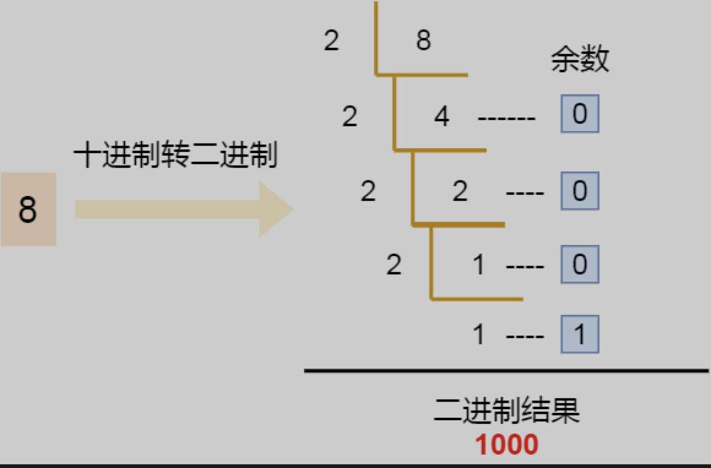
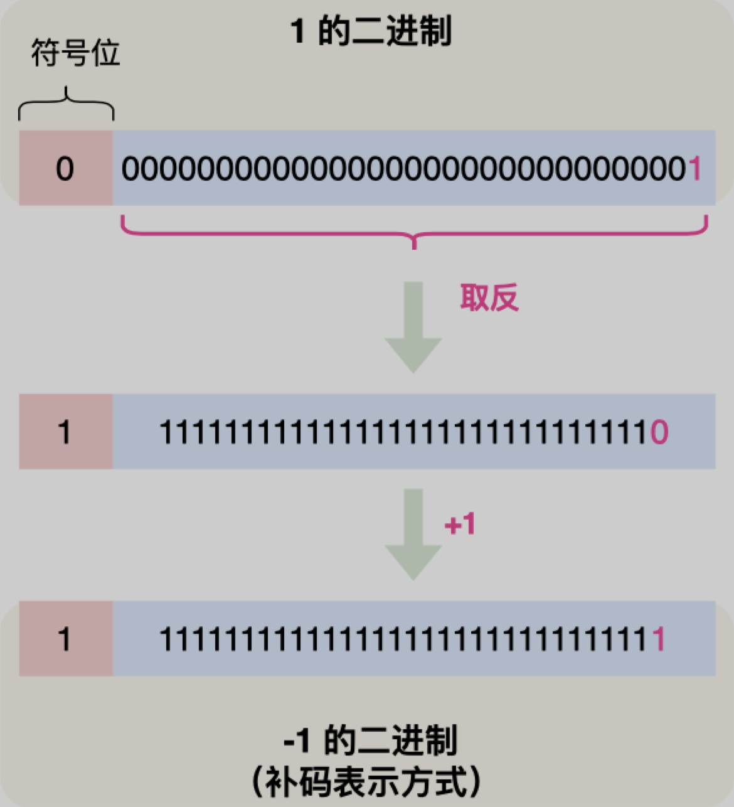
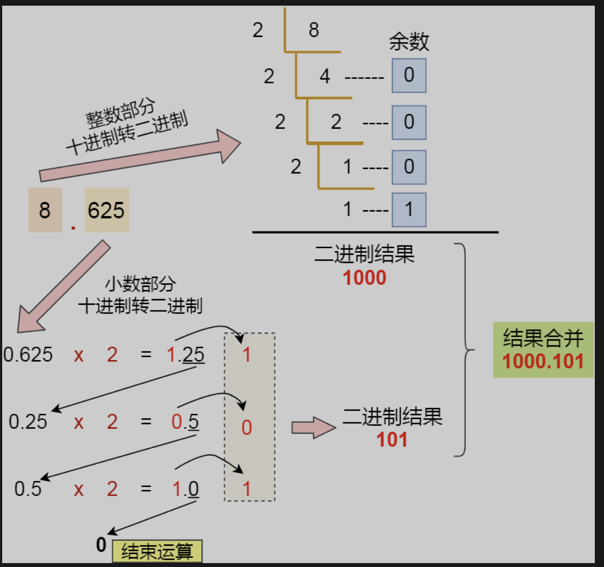
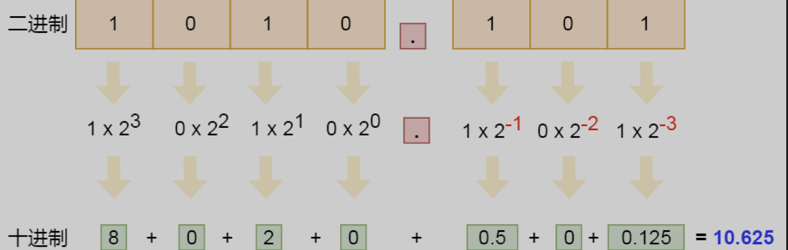
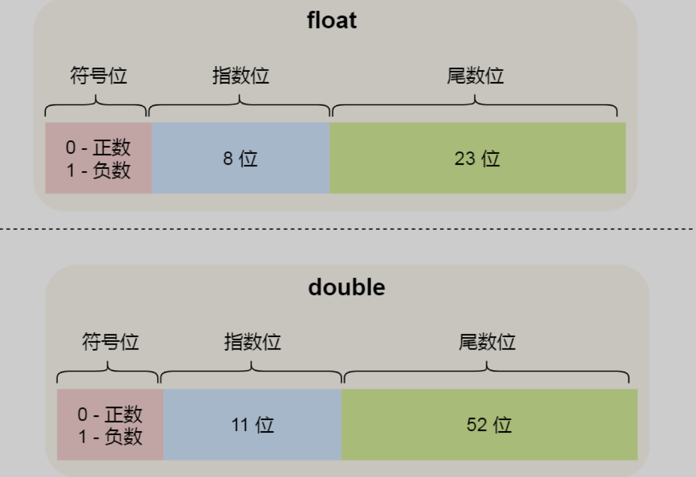
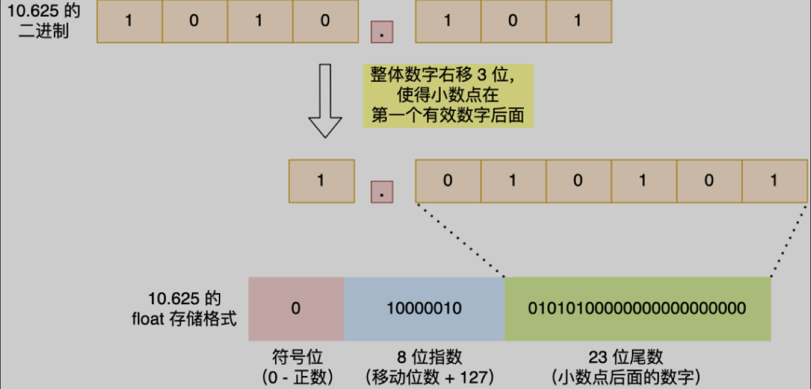
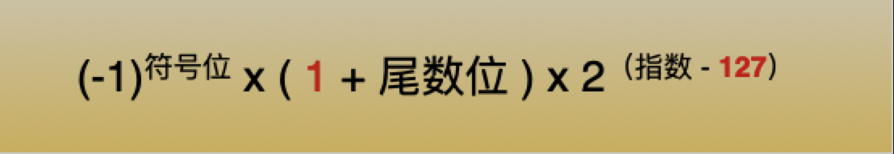
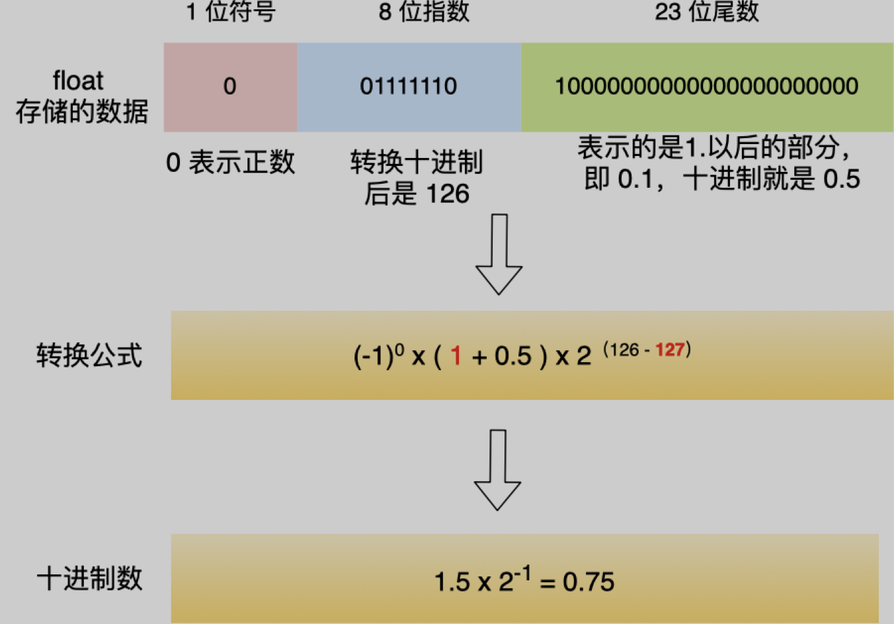

# 0. 引言

```js
0.1 + 0.2 != 0.3
```
https://mp.weixin.qq.com/s/Ftm7rp_z6KL38mtKg8-zsg

* 为什么
* 小数怎么表示
* 负数怎么表示

# 负数要用补码表示



* 十进制转二进制

* int 类型是 32 位的，其中最高位位==符号位标志位==，正数的符号是 0(-1^0)，负数的符号是 1（-1^1）。**剩余的 31 位则表示二进制数据**。

1. 正数就是直接转换成二进制数据

2. 负数需要采用补码的方式

   **所谓的补码就是把正数的二进制全部取反再加 1**，比如 -1 的二进制是把数字 1 的二进制取反后再加 1，如下图：

   


如果负数不是使用补码的方式表示，则在做基本对加减法运算的时候，**还需要多一步操作来判断是否为负数，如果为负数，还得把加法反转成减法，或者把减法反转成加法**，这就非常不好了，毕竟加减法运算在计算机里是很常使用的，所以为了性能考虑，应该要尽量简化这个运算过程。


# 十进制小数与二进制的转换

整数十进制转二进制我们知道了，接下来看看小数是怎么转二进制的，小数部分的转换不同于整数部分，它采用的是**乘 2 取整法**，将十进制中的小数部分乘以 2 作为二进制的一位，然后继续取小数部分乘以 2 作为下一位，直到不存在小数为止。

以 `8.625` 为例：




最后把「整数部分 + 小数部分」结合在一起后，其结果就是 `1000.101`。

但是，并不是所有小数都可以用二进制表示，前面提到的 0.625 小数是一个特例，刚好通过乘 2 取整法的方式完整的转换成二进制。

如果转换 0.1。**由于计算机的资源是有限的，所以是没办法用二进制精确的表示 0.1（为什么出现不准确，为什么偏偏是那个值呢？），只能用「近似值」来表示，就是在有限的精度情况下，最大化接近 0.1 的二进制数，于是就会造成精度缺失的情况**。

对于==二进制小数转十进制时==，需要注意一点，小数点后面的指数幂是**负数**。

比如，二进制 `0.1` 转成十进制就是 `2^(-1)`，也就是十进制 `0.5`，二进制 `0.01`转成十进制就是 `2^-2`，也就是十进制 `0.25`，以此类推。==正数从2^0开始，依次增加。小数从2^-1开始，依次减少==

举个例子，二进制 `1010.101` 转十进制的过程，如下图：




# 计算机是怎么存储小数的

`1000.101` 这种二进制小数是「定点数」形式，代表着小数点是定死的，不能移动，如果你移动了它的小数点，这个数就变了， 就不再是它原来的值了。

然而，计算机并不是这样存储的小数的，计算机存储小数的采用的是**浮点数**，名字里的「浮点」表示小数点是可以浮动的。==浮点代表小数点的浮动==。

比如 `1000.101` 这个二进制数，可以表示成 `1.000101 x 2^3`，类似于数学上的科学记数法。

比如有个很大的十进制数 1230000，我们可以也可以表示成 `1.23 x 10^6`，这种方式就称为科学记数法。

该方法在小数点左边只有一个数字，而且把这种整数部分没有前导 0 的数字称为**规格化**，比如 `1.0 x 10^(-9)` 是规格化的科学记数法，而 `0.1 x 10^(-9)` 和 `10.0 x 10^(-9)` 就不是了。

因此，如果二进制要用到科学记数法，同时要规范化，==那么不仅要保证基数为 2，还要保证小数点左侧只有 1 位，而且必须为 1==。

## IEEE 标准

所以通常将 `1000.101` 这种二进制数，规格化表示成 `1.000101 x 2^3`，其中，最为关键的是 000101 和 3 这两个东西，它就可以包含了这个二进制小数的所有信息。

- `000101` 称为**尾数**，即小数点后面的数字；
- `3` 称为**指数**，指定了小数点在数据中的位置；

==现在绝大多数计算机使用的浮点数，一般采用的是 IEEE 制定的国际标准，这种标准形式如下图：==


这三个重要部分的意义如下：

- *符号位*：表示数字是正数还是负数，为 0 表示正数，为 1 表示负数；
- *指数位*：指定了小数点在数据中的位置，指数可以是负数，也可以是正数，**指数位的长度越长则数值的表达范围就越大**；
- *尾数位*：小数点右侧的数字，也就是小数部分，比如二进制 1.0011 x 2^(-2)，尾数部分就是 0011，而且**尾数的长度决定了这个数的精度**，因此如果要表示精度更高的小数，则就要提高尾数位的长度；

## float&double

用 `32` 位来表示的浮点数，则称为**单精度浮点数**，也就是我们编程语言中的 `float`变量，而用 `64` 位来表示的浮点数，称为**双精度浮点数**，也就是 `double` 变量，它们的结构如下：



- double 的尾数部分是 52 位，float 的尾数部分是 23 位，由于同时都带有一个固定隐含位（这个后面会说），所以 double 有 53 个二进制有效位，float 有 24 个二进制有效位，所以所以它们的精度在十进制中分别是 `log10(2^53)` 约等于 `15.95` 和 `log10(2^24)` 约等于 `7.22` 位，因此 double 的有效数字是 `15~16` 位，float 的有效数字是 `7~8` 位，这些是有效位是包含整数部分和小数部分；
- double 的指数部分是 11 位，而 float 的指数位是 8 位，意味着 double 相比 float 能表示更大的数值范围；

## 那二进制小数，是如何转换成二进制浮点数的呢？

我们就以 `10.625` 作为例子，看看这个数字在 float 里是如何存储的




首先，我们计算出 10.625 的二进制小数为 1010.101。

然后**把小数点，移动到第一个有效数字后面**，即将 1010.101 右移 `3` 位成 `1.010101`，右移 3 位就代表 +3，左移 3 位就是 -3。

**float 中的「指数位」就跟这里移动的位数有关系，把移动的位数再加上「偏移量」，float 的话偏移量是 127，相加后就是指数位的值了**，即指数位这 8 位存的是 `10000010`（十进制 130），因此你可以认为「指数位」相当于指明了小数点在数据中的位置。

`1.010101` 这个数的**小数点右侧的数字就是 float 里的「尾数位」**，由于尾数位是 23 位，则后面要补充 0，所以最终尾数位存储的数字是 `01010100000000000000000`。

### 偏移量

在算指数的时候，你可能会有疑问为什么要加上偏移量呢？

前面也提到，指数可能是正数，也可能是负数，即指数是有符号的整数，而有符号整数的计算是比无符号整数麻烦的，所以为了减少不必要的麻烦，在实际存储指数的时候，需要把指数转换成**无符号整数**。

float 的指数部分是 8 位，IEEE 标准规定单精度浮点的指数取值范围是 `-126 ~ +127`，于是为了把指数转换成无符号整数，就要加个**偏移量**，比如 float 的指数偏移量是 `127`，这样指数就不会出现负数了。

比如，指数如果是 8，则实际存储的指数是 8 + 127（偏移量）= 135，即把 135 转换为二进制之后再存储，而当我们需要计算实际的十进制数的时候，再把指数减去「偏移量」即可。

细心的朋友肯定发现，==移动后的小数点左侧的有效位（即 1）消失了，它并没有存储到 float 里。==

这是因为 IEEE 标准规定，二进制浮点数的小数点左侧只能有 1 位，并且还只能是 1，**既然这一位永远都是 1，那就可以不用存起来了**。

于是就让 23 位尾数只存储小数部分，然后在计算时会**自动把这个 1 加上，这样就可以节约 1 位的空间，尾数就能多存一位小数，相应的精度就更高了一点**。

那么，对于我们在从 float 的二进制浮点数转换成十进制时，要考虑到这个隐含的 1，转换公式如下：



举个例子，我们把下图这个 float 的数据转换成十进制，过程如下：




### 0.1 + 0.2 == 0.3 ?

前面提到过，并不是所有小数都可以用「完整」的二进制来表示的，比如十进制 0.1 在转换成二进制小数的时候，是一串无限循环的二进制数，计算机是无法表达无限循环的二进制数的，毕竟计算机的资源是有限。

因此，计算机只能用「近似值」来表示该二进制，那么意味着计算机存放的小数可能不是一个真实值。

现在基本都是用  IEEE 754 规范的「单精度浮点类型」或「双精度浮点类型」来存储小数的，根据精度的不同，近似值也会不同。

0.1:

可以看到，8 位指数部分是 `01111011`，23 位的尾数部分是 `10011001100110011001101`，可以看到尾数部分是 `0011` 是一直循环的，只不过尾数是有长度限制的，所以只会显示一部分，所以是一个近似值，精度十分有限。

0.1 的二进制浮点数转换成十进制的结果是 `0.100000001490116119384765625`：

0.2 的二进制浮点数转换成十进制的结果是 `0.20000000298023223876953125`：

这两个结果相加就是 `0.300000004470348358154296875`：

所以，你会看到**在计算机中 0.1 + 0.2 并不等于完整的 0.3**。

这主要是**因为有的小数无法可以用「完整」的二进制来表示，所以计算机里只能采用近似数的方式来保存，那两个近似数相加，得到的必然也是一个近似数**。

我们在 JavaScript 里执行 0.1 + 0.2，你会得到下面这个结果：


# javascript 中最大的安全整数为什么是2的53次方

* 如上所述，js中的数字采用的是双精度浮点表示，安全整数就是和浮点数一一对应的，因此最大安全整数的范围就是 1.111...1(小数点后52个1)。

  改二进制数换算成十进制就是 `2^52+...+2^0` 等比数列求和结果为 `2^53-1`


# 总结

而我们二进制只能精准表达 2 除尽的数字 1/2, 1/4, 1/8，但是对于 0.1(1/10) 和 0.2(1/5)，在二进制中都无法精准表示时，需要根据精度舍入。

我们人类熟悉的十进制运算系统，可以精准表达 2 和 5 除尽的数字，例如 1/2, 1/4, 1/5(0.2), 1/8, 1/10(0.1)。

当然，十进制也有无法除尽的地方，例如 1/3, 1/7，也需要根据精度舍入。

==小数采用二进制浮点数存储==


