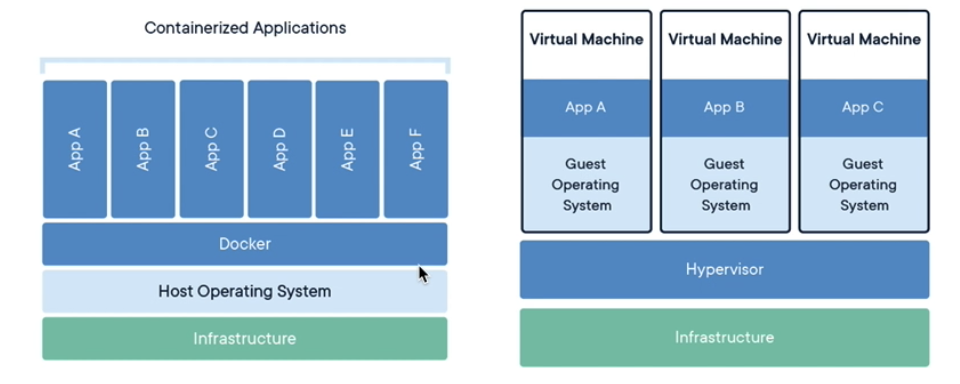
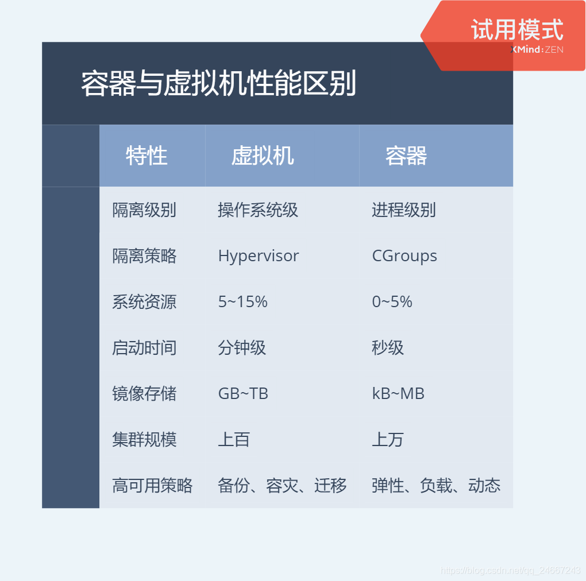
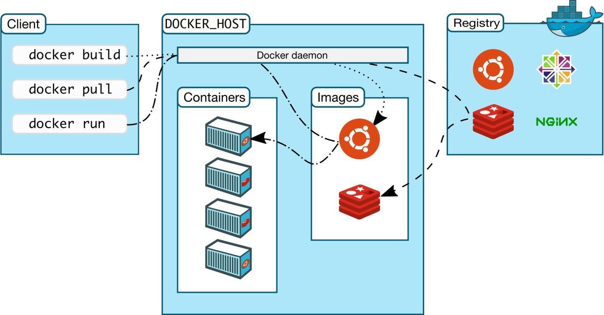
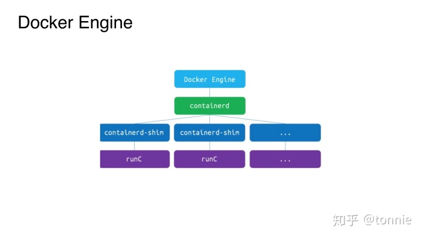

# 应用场景

- Web 应用的自动化打包和发布。（常用）
- 自动化测试和持续集成、发布。
- 在服务型环境中部署和调整数据库或其他的后台应用。
- 从头编译或者扩展现有的 OpenShift 或 Cloud Foundry 平台来搭建自己的 PaaS 环境。

> Docker 是一个用于开发，交付和运行应用程序的开放平台。Docker 使您能够将应用程序与基础架构分开，从而可以快速交付软件。借助 Docker，您可以与管理应用程序相同的方式来管理基础架构。通过利用 Docker 的方法来快速交付，测试和部署代码，您可以大大减少编写代码和在生产环境中运行代码之间的延迟。

## 是什么

Docker 是一个开源的应用容器引擎

## 简化&规范化 CI/CD

### 1、快速，一致地交付您的应用程序

Docker 允许开发人员使用您提供的应用程序或服务的本地容器在标准化环境中工作，从而简化了开发的生命周期。

容器非常适合持续集成和持续交付（CI / CD）工作流程，请考虑以下示例方案：

- 您的开发人员在本地编写代码，并使用 Docker 容器与同事共享他们的工作。
- 他们使用 Docker 将其应用程序推送到测试环境中，并执行自动或手动测试。
- 当开发人员发现错误时，他们可以在开发环境中对其进行修复，然后将其重新部署到测试环境中，以进行测试和验证。
- 测试完成后，将修补程序推送给生产环境，就像将更新的镜像推送到生产环境一样简单。

### 2、响应式部署和扩展

Docker 是基于容器的平台，允许高度可移植的工作负载。Docker 容器可以在开发人员的本机上，数据中心的物理或虚拟机上，云服务上或混合环境中运行。

Docker 的可移植性和轻量级的特性，还可以使您轻松地完成动态管理的工作负担，并根据业务需求指示，实时扩展或拆除应用程序和服务。

沙箱隔离。

### 3、在同一硬件上运行更多工作负载

Docker 轻巧快速。它为基于虚拟机管理程序的虚拟机提供了可行、经济、高效的替代方案，因此您可以利用更多的计算能力来实现业务目标。Docker 非常适合于高密度环境以及中小型部署，而您可以用==更少的资源做更多的事情==。

## docker vs 虚拟机



* 虚拟机是运行在虚拟内存上的，docker是运行的docker服务上的。

1. 容器是应用层的抽象，它将代码和依赖关系打包在一起。多个容器可以在同一台机器上运行，并与其他容器共享操作系统内核，每个容器在用户空间中作为独立进程运行。容器占用的空间比VM少（容器映像的大小通常为几十MB），可以处理更多的应用程序，并且需要更少的VM和操作系统。
2. 虚拟机（VM）是物理硬件的抽象，将一台服务器转变为多台服务器。管理程序允许多台VM在单台机器上运行。每个VM都包含操作系统的完整副本，应用程序，必要的二进制文件和库占用数十GB。虚拟机也可能很慢启动。




总结：

| 特性 | 容器 | 虚拟机 |
| ---- | ---- | ------ |
| 启动 | 秒级 | 分钟级 |
|硬盘使用|一般为 `MB`|一般为`GB`|
|性能|接近原生|弱于|
|系统支持量|单机支持上千个容器|一般几十个|
| 开发/环境定制|方便（***命令行***、面向对象式）|进入虚拟机|


***相同点***

1. 文件隔离/文件共享 （沙箱）
2. 资源隔离
3. 网络隔离
4. 支持多种宿主环境（扩展）
5. 快照/镜像（版本控制/变更管理）

***不同点***

1. 不同的资源管理/依赖/释放（虚拟机占用更多的资源）

2. 不同的应用运行环境

3. docker 是写时复制**Copy on write**，==真正操作会在基础镜像之上的读写层，然后能保存新的镜像==

   http://www.dannysite.com/blog/249/

4. 不同的日志方式（docker收集日志，虚拟机需要在虚拟系统中查看）

5. 不同的交互方式（docker偏向shell，虚拟机偏向GUI）


# 直接进入主题

> Docker是一个虚拟环境容器，可以将你的开发环境、代码、配置文件等一并打包到这个容器中，并发布和应用到任意平台中。比如，你在本地用Python开发网站后台，开发测试完成后，就可以将Python3及其依赖包、Flask及其各种插件、Mysql、Nginx等打包到一个容器中，然后部署到任意你想部署到的环境。




* 公共的仓库，可以从 registry 拉取。

## Docker Engine



Docker Engine是用于运行和编排容器的基础设施工具，我们平时说到的Docker大多数指的是Docker Engine，也就是在命令行和Docker进行交互的时候打交道的后台进程。

这是Docker Engine目前的架构，Docker客户端通过REST API与Docker Daemon来进行交互，Daemon把命令下发给containerd，containerd负责容器的生命周期管理以及镜像管理等，而runc负责创建容器。

Docker首次发布时，Docker Engine由两个核心组件构成：LXC和Docker Daemon。Docker Daemon是单一的二进制文件，包含诸如 Docker客户端、Docker API、容器运行时、镜像构建等。LXC提供了对Namespace(资源隔离)和CGroup(资源限制)等基础工具的操作能力，它们是基于Linux内核的容器虚拟化技术。

总结：

当 Docker 第一次启动一个容器时，初始的读写层是空的，当文件系统发生变化时，这些变化都会应用到这一层之上。比如，如果想修改一个文件，这个文件首先会从该读写层下面的只读层复制到该读写层。由此，该文件的只读版本依然存在于只读层，只是被读写层的该文件副本所隐藏。该机制则被称之为**写时复制（Copy on write）**

## 三个概念

### 镜像（Image）

类似于虚拟机中的镜像，是一个包含有文件系统的面向Docker引擎的==只读模板==。任何应用程序运行都需要环境，而镜像就是用来提供这种运行环境的。例如一个Ubuntu镜像就是一个包含Ubuntu操作系统环境的模板，同理在该镜像上装上Apache软件，就可以称为Apache镜像。

分片的文件系统，通常有dockerfile创建。为保证所有的服务镜像是相同的，镜像是一个只读的文件系统。

#### Docker镜像结构

所有的Docker镜像都起始于一个基础镜像层，==当进行修改或增加新的内容时，就会在当前镜像层之上，创建新的镜像层==。以Dockerfile为例，==每一行指令都产生一个新层==。

==镜像由一个或多个只读的镜像层构建而成==，每个镜像层拥有独立的哈希值，Docker在拉取或推送镜像时，会判断哪几层在本地或远端已存在，避免不必要的操作。

### 容器（Container）

类似于一个轻量级的沙盒，可以将其看作一个极简的Linux系统环境（包括root权限、进程空间、用户空间和网络空间等），以及运行在其中的应用程序。Docker引擎利用容器来运行、隔离各个应用。==容器是镜像创建的应用实例==，可以创建、启动、停止、删除容器，各个容器之间是是相互隔离的，互不影响。注意：镜像本身是只读的，容器从镜像启动时，Docker在镜像的上层创建一个可写层，镜像本身不变。

- 镜像（Image）和容器（Container）的关系，==就像是面向对象程序设计中的类和实例一样==，镜像是静态的定义，容器是镜像运行时的实体。容器可以被创建、启动、停止、删除、暂停等。

总结：

由 docker进程创建和管理的：文件系统 + 系统资源 + 网络配置 + 日志管理

docker 是 docker 镜像的运行环境，所以容器的概念也就比较好理解了。

### 仓库（Repository）

* 仓库可看成一个代码控制中心，用来保存镜像。

类似于代码仓库，这里是镜像仓库，是Docker用来集中存放镜像文件的地方。注意与注册服务器（Registry）的区别：注册服务器是存放仓库的地方，一般会有多个仓库；而仓库是存放镜像的地方，一般每个仓库存放一类镜像，每个镜像利用tag进行区分，比如Ubuntu仓库存放有多个版本（12.04、14.04等）的Ubuntu镜像。

* 可以设置 仓库镜像地址

### 概念

| Docker 镜像(Images)    | Docker 镜像是用于创建 Docker 容器的模板，比如 Ubuntu 系统。  |
| ---------------------- | ------------------------------------------------------------ |
| Docker 容器(Container) | 容器是独立运行的一个或一组应用，是镜像运行时的实体。         |
| Docker 客户端(Client)  | Docker 客户端通过命令行或者其他工具使用 Docker SDK (https://docs.docker.com/develop/sdk/) 与 Docker 的守护进程通信。 |
| Docker 主机(Host)      | 一个物理或者虚拟的机器用于执行 Docker 守护进程和容器。       |
| Docker Registry        | Docker 仓库用来保存镜像，可以理解为代码控制中的代码仓库。Docker Hub([https://hub.docker.com](https://hub.docker.com/)) 提供了庞大的镜像集合供使用。一个 Docker Registry 中可以包含多个仓库（Repository）；每个仓库可以包含多个标签（Tag）；每个标签对应一个镜像。通常，一个仓库会包含同一个软件不同版本的镜像，而标签就常用于对应该软件的各个版本。我们可以通过 **<仓库名>:<标签>** 的格式来指定具体是这个软件哪个版本的镜像。如果不给出标签，将以 **latest** 作为默认标签。 |
| Docker Machine         | Docker Machine是一个简化Docker安装的命令行工具，通过一个简单的命令行即可在相应的平台上安装Docker，比如VirtualBox、 Digital Ocean、Microsoft Azure。 |

## 安装和卸载

* https://www.runoob.com/docker/centos-docker-install.html

## 操作

1. docker version

   查看版本

   docker info

   查看信息

2. docker --help

   查看帮助信息

3. 启动

    `sudo systemctl start docker`

4. 重启 
   ```powershell
   $ sudo systemctl daemon-reload
   $ sudo systemctl restart docker
   $ systemctl enable docker
   ```
   
   * 只限 centos

### 镜像操作

镜像系统操作以 docker image 为开头，不指定 TAG 使用 latest 作为镜像。

* docker search centos 查看是否存在镜像

* docker pull centos  # 利用pull命令获取镜像

* docker image ls 查看所有镜像。docker images 同

  各个选项说明:

  - **REPOSITORY：**表示镜像的仓库源
  - **TAG：**镜像的标签
  - **IMAGE ID：**镜像ID
  - **CREATED：**镜像创建时间
  - **SIZE：**镜像大小

* docker image pull NAME[:TAG] 拉取指定的镜像

  * 当我们在本地主机上使用一个不存在的镜像时 Docker 就会自动下载这个镜像。如果我们想预先下载这个镜像，我们可以使用 docker pull 命令来下载它。

* docker image push NAME[:TAG] 推送一个镜像

* docker image rm NAME[:TAG] 删除一个镜像

  > 一般情况下，需要先删除使用该镜像的实例（容器）， `docker rm 容器id`，然后再删除镜像。使用 docker rmi 镜像名是一样的效果，i 是image 的简称。

  同 `docker rmi 镜像`

* docker image import file

* docker run NAME 运行这个镜像

  运行容器

* `docker tag 860c279d2fec runoob/centos:dev`

  更新镜像的 tag

#### 镜像使用

当运行容器时，==使用的镜像如果在本地中不存在，docker 就会自动从 docker 镜像仓库中下载==，默认是从 Docker Hub 公共镜像源下载。

##### 1. 列出镜像列表

我们可以使用 **docker images** 来列出本地主机上的镜像。

```
runoob@runoob:~$ docker images           
REPOSITORY          TAG                 IMAGE ID            CREATED             SIZE
ubuntu              14.04               90d5884b1ee0        5 days ago          188 MB
php                 5.6                 f40e9e0f10c8        9 days ago          444.8 MB
nginx               latest              6f8d099c3adc        12 days ago         182.7 MB
mysql               5.6                 f2e8d6c772c0        3 weeks ago         324.6 MB
httpd               latest              02ef73cf1bc0        3 weeks ago         194.4 MB
ubuntu              15.10               4e3b13c8a266        4 weeks ago         136.3 MB
hello-world         latest              690ed74de00f        6 months ago        960 B
training/webapp     latest              6fae60ef3446        11 months ago       348.8 MB
```

各个选项说明:

- **REPOSITORY：**表示镜像的仓库源
- **TAG：**镜像的标签
- **IMAGE ID：**镜像ID
- **CREATED：**镜像创建时间
- **SIZE：**镜像大小

==同一仓库源可以有多个 TAG，代表这个仓库源的不同个版本==，如 ubuntu 仓库源里，有 15.10、14.04 等多个不同的版本，我们使用 REPOSITORY:TAG 来定义不同的镜像。

所以，我们如果要使用版本为15.10的ubuntu系统镜像来运行容器时，命令如下：

```
runoob@runoob:~$ docker run -t -i ubuntu:15.10 /bin/bash 
root@d77ccb2e5cca:/#
```

### 创建镜像

当我们从 docker 镜像仓库中下载的镜像不能满足我们的需求时，我们可以通过以下两种方式对镜像进行更改。

- 1、从已经创建的容器中更新镜像，并且提交这个镜像。以已有的镜像为基础，更新一个镜像。
- 2、使用 Dockerfile 指令来创建一个新的镜像。自己构建一个镜像。

#### 更新镜像

更新镜像之前，我们需要使用镜像来创建一个容器。更新镜像并不是创建一个新的镜像，只是更新了使用的镜像源。

```
runoob@runoob:~$ docker run -t -i ubuntu:15.10 /bin/bash
root@e218edb10161:/# 
```

==在运行的容器内==使用 **yum update** 命令进行更新。

在完成操作之后，输入 exit 命令来退出这个容器。

此时 ID 为 e218edb10161 的容器，是按我们的需求更改的容器。我们可以通过命令 docker commit 来提交容器副本。

`docker commit -m='has update' -a='test' 6054279f0a8f test/centos:v2`

- **-m:** 提交的描述信息
- **-a:** 指定镜像作者
- **e218edb10161：**容器 ID
- **runoob/ubuntu:v2:** 指定要创建的目标镜像名

#### 构建镜像

我们使用命令 **docker build** ， ==从零开始来==创建一个新的镜像。为此，我们需要创建一个 Dockerfile 文件，其中==包含一组指令==来告诉 Docker 如何构建我们的镜像。==在前端项目中就需要使用这个命令，构建一个打好包的镜像==

```
runoob@runoob:~$ cat Dockerfile 
FROM    centos:6.7
MAINTAINER      Fisher "fisher@sudops.com"

RUN     /bin/echo 'root:123456' |chpasswd
RUN     useradd runoob
RUN     /bin/echo 'runoob:123456' |chpasswd
RUN     /bin/echo -e "LANG=\"en_US.UTF-8\"" >/etc/default/local
EXPOSE  22
EXPOSE  80
CMD     /usr/sbin/sshd -D
```

每一个指令都会在镜像上创建一个新的层，每一个指令的前缀都必须是大写的。

第一条FROM，指定使用哪个镜像源

RUN 指令告诉docker 在镜像内执行命令，安装了什么。。。

然后，我们使用 Dockerfile 文件，通过 docker build 命令来构建一个镜像。

```
runoob@runoob:~$ docker build -t runoob/centos:6.7 .
Sending build context to Docker daemon 17.92 kB
Step 1 : FROM centos:6.7
 ---&gt; d95b5ca17cc3
Step 2 : MAINTAINER Fisher "fisher@sudops.com"
 ---&gt; Using cache
 ---&gt; 0c92299c6f03
Step 3 : RUN /bin/echo 'root:123456' |chpasswd
 ---&gt; Using cache
 ---&gt; 0397ce2fbd0a
Step 4 : RUN useradd runoob
......
```

`docker build -t runoob/centos:6.7 .`

参数说明：

- **-t** ：指定要创建的目标镜像名
- **.** ：Dockerfile 文件所在目录，可以指定Dockerfile 的绝对路径

### 容器操作

* 容器的所有状态

  容器在创建时进入Created状态，运行后进入Running状态，接着会进入到Pause状态或Exited状态，对已经退出的容器执行重启操作会使容器进入Restarting状态，随后转为Running状态。

1. 查看容器列表

   `docker container ls [options]`

2. 删除容器

   `docker container rm 容器`

3. 查看容器进程信息

   `docker container top CONTAINER`

   或者：

   `docker top id`

4. 查看容器日志

   `dcoker container logs CONTAINER`

5. 启动容器

   ```shell
   docker run -it ubuntu /bin/bash
   
   # 运行一个web容器
   docker run -d -P training/webapp python app.py
   
   docker run -itd --name web -P nginx
   ```

   参数说明：

   - **-i**: 交互式操作。

   - **-t**: 终端。

   - **ubuntu**: ubuntu 镜像。

   - **/bin/bash**：放在镜像名后的是命令，这里我们希望有个交互式 Shell，因此用的是 /bin/bash。

   - **-P:**将容器内部使用的网络端口随机映射到我们使用的主机上。

   - 启动 ==不进入容器==，加参数 -d

     想要进入容器需要使用指令 docker exec

   - `--name test-name ` 自定义启动容器的名字

   - **-e username="ritchie":** 设置环境变量；

   - ***-v***: 将本地的目录挂载到容器中的目录

     ```bash
     -v /usr/local/test:usr/tmp/test
     ```

   退出终端（容器父进程）

   `exit`

   注意：

   在run一个容器的时候，如果没有找到该镜像，就会去远端仓库拉取该镜像。

   更多参考：https://www.runoob.com/docker/docker-run-command.html

   

6. 启动已停止运行的容器

   * 查看所有启动过的容器，查看历史记录。`docker container ls` (等于 `docker ps`，不加 `-a`)查看的是正在启动的容器。

     `docker ps -a`

     字段

     * PORTS: 端口

   * 找到 id ，然后重启一个已停止的容器

     ```shell
     docker start b750bbbcfd88 
     ```
> 重启之后的进程并不是并不是继承当前终端（不像直接启动容器，继承当前终端），如果想直接 kill 这个进程，需要先使用 `docker container top 容器id`找到进程号，然后执行 `kill -9 进程号`清理该进程。

7. 停止一个容器

   `docker stop 容器id`

   重启一个正在运行着的容器

   `docker restart 容器id`

8. 进入容器

   `docker exec -it 容器id /bin/bash`

9. 查看容器网络端口（映射到本地主机上）

   `docker port 容器名称|id`

10. 查看容器底层信息

    使用 **docker inspect** 来查看 Docker 的底层信息。它会返回一个 JSON 文件记录着 Docker 容器的配置和状态信息。

    

#### 导出和导入容器

1. 导出容器

   ```shell
   docker export 1e560fca3906 > ubuntu.tar
   ```

   可以将容器导出到本地，方便快速制作镜像

2. 导入容器快照

   `docker import centos-test.tar test/centos:v1 ` v1代表 tag ，会在镜像列表出现。

   此外，也可以通过指定 URL 或者某个目录来导入，例如：

   ```shell
   $ docker import http://example.com/exampleimage.tgz example/imagerepo
   ```

3. 删除容器

   `docker rm -f 容器id`

   * ==删除容器时，容器必须是停止状态，否则会报如下错误==

   下面的命令可以清理掉所有处于终止状态的容器。

   `docker container prune`

## 实例：运行一个 web 应用

* 前面我们运行的容器并没有一些什么特别的用处。

  接下来让我们尝试使用 docker 构建一个 web 应用程序。

  我们将在docker容器中运行一个 Python Flask 应用来运行一个web应用。

```bash
runoob@runoob:~# docker pull training/webapp  # 载入镜像
runoob@runoob:~# docker run -d -P training/webapp python app.py
```

参数说明:

- **-d:**让容器在后台运行。
- **-P:**将容器内部使用的网络端口==随机==映射到我们使用的主机上。

### 查看容器

使用 docker ps 来查看我们正在运行的容器：

```
runoob@runoob:~#  docker ps
CONTAINER ID        IMAGE               COMMAND             ...        PORTS                 
d3d5e39ed9d3        training/webapp     "python app.py"     ...        0.0.0.0:32769->5000/tcp
```

这里多了端口信息。

```
PORTS
0.0.0.0:32769->5000/tcp
```

Docker 开放了 5000 端口（默认 Python Flask 端口）映射到主机端口 32769 上。

#### 这时我们可以通过浏览器访问WEB应用


我们也可以通过 -p 参数来设置不一样的端口：

```
runoob@runoob:~$ docker run -d -p 5000:5000 training/webapp python app.py
```

* 可以使用 `docker port`查看容器端口
* `-P`大写是随机映射，`-p`小写能够设置

### 查看容器运行日志

`docker logs -f 容器id|名称`

* -f 可以像 `tail -f`一样动态的查看日志


### 容器连接

* 我们还可以使用 `-p` 设置绑定主机的网络地址，一般设置 `0.0.0.0` 才能被外界访问。比如说映射到 `127.0.0.1`。比如说设置不同的容器在主机上互相访问。

  `docker run -d -p 127.0.0.1:5001:5000 training/webapp python app.py`

  这样我们就可以通过访问 127.0.0.1:5001 来访问容器的 5000 端口。

  上面的例子中，默认都是绑定 tcp 端口，如果要绑定 UDP 端口，可以在端口后面加上 **/udp**。

  ```shell
  runoob@runoob:~$ docker run -d -p 127.0.0.1:5000:5000/udp training/webapp python app.py
  ```

#### Docker 容器互联

端口映射并不是唯一把 docker 连接到另一个容器的方法。

docker 有一个==连接系统==允许将多个容器连接在一起，共享连接信息。

docker 连接会创建一个父子关系，其中父容器可以看到子容器的信息。

#### 容器命名

当我们创建一个容器的时候，docker 会自动对它进行命名。另外，我们也可以使用 **--name** 标识来命名容器，例如：

```shell
runoob@runoob:~$  docker run -d -P --name runoob training/webapp python app.py
43780a6eabaaf14e590b6e849235c75f3012995403f97749775e38436db9a441
```

## docker 仓库管理

* 仓库（Repository）是集中存放镜像的地方。以下介绍一下 [Docker Hub](https://hub.docker.com/)。当然不止 docker hub，只是远程的服务商不一样，操作都是一样的。
* 登录需要输入用户名和密码，登录成功后，我们就可以从 docker hub 上拉取自己账号下的全部镜像。

```
$ docker login
```

[](https://www.runoob.com/wp-content/uploads/2019/10/5974B2AE-945F-4DD0-A7C8-9D9B01BDAF62.jpg)

**退出**

退出 docker hub 可以使用以下命令：

```shell
$ docker logout
```

* 拉取镜像

  你可以通过 docker search 命令来==查找官方仓库中==的镜像，并利用 docker pull 命令来将它下载到本地。

* 推送镜像

  推送的镜像是基于当前登录账号的仓库，只会推送到当前登录的仓库中。

  所以为什么在命名镜像的时候建议加上自己的仓库名称 `docker hub 用户名/镜像名`，这样在执行 push 操作的时候就会自动查找对应用户名下边的仓库。

  `docker push programmerzbb/centos`

## Dockerfile

### 什么是 Dockerfile？

Dockerfile 是一个用来构建镜像的文本文件，文本内容包含了一条条构建镜像所需的指令和说明。

这里仅讲解如何运行 Dockerfile 文件来定制一个镜像，具体 Dockerfile 文件内指令详解，将在下一节中介绍，这里你只要知道构建的流程即可。

**1、下面以定制一个 nginx 镜像（构建好的镜像内会有一个 /usr/share/nginx/html/index.html 文件）**

在一个空目录下，新建一个名为 Dockerfile 文件，并在文件内添加以下内容：


**FROM**：定制的镜像都是基于 FROM 的镜像，这里的 nginx 就是定制需要的基础镜像。后续的操作都是基于 nginx。

**RUN**：用于执行后面跟着的命令行命令。有以下俩种格式：

shell 格式：

```
RUN <命令行命令>
# <命令行命令> 等同于，在终端操作的 shell 命令。
```

exec 格式：

```shell
RUN ["可执行文件", "参数1", "参数2"]
# 例如：
# RUN ["./test.php", "dev", "offline"] 等价于 RUN ./test.php dev offline
```

**注意**：Dockerfile 的指令每执行一次都会在 docker 上新建一层。所以过多无意义的层，会造成镜像膨胀过大。例如：

FROM centos
RUN **yum install** **wget**
RUN **wget** -O redis.tar.gz "http://download.redis.io/releases/redis-5.0.3.tar.gz"
RUN **tar** -xvf redis.tar.gz
以上执行会创建 3 层镜像。可简化为以下格式：
FROM centos
RUN **yum install** **wget** \
  **&&** **wget** -O redis.tar.gz "http://download.redis.io/releases/redis-5.0.3.tar.gz" \
  **&&** **tar** -xvf redis.tar.gz

如上，==以 **&&** 符号连接命令，这样执行后，只会创建 1 层镜像。==

### ==开始构建镜像(一般情况下前端项目部署)==

在 Dockerfile 文件的存放目录下，执行构建动作。

以下示例，通过目录下的 Dockerfile 构建一个 nginx:v3（镜像名称:镜像标签）。

**注**：最后的 **.** 代表本次执行的上下文路径，下一节会介绍。

$ docker build -t nginx:v3 .


以上显示，说明已经构建成功。

### 上下文路径

上一节中，有提到指令最后一个 **.** 是上下文路径，那么什么是上下文路径呢？

$ docker build -t nginx:v3 .

上下文路径，是指 docker 在构建镜像，有时候想要使用到本机的文件（比如复制），==docker build 命令得知这个路径后，会将路径下的所有内容打包。==

**解析**：由于 docker 的运行模式是 C/S。我们本机是 C，docker 引擎是 S。实际的构建过程是在 docker 引擎下完成的，所以这个时候无法用到我们本机的文件。这就需要把我们本机的指定目录下的文件一起打包提供给 docker 引擎使用。

如果未说明最后一个参数，那么默认上下文路径就是 Dockerfile 所在的位置。

**注意**：上下文路径下不要放无用的文件，因为会一起打包发送给 docker 引擎，如果文件过多会造成过程缓慢。

## 指令详解

### COPY

复制指令，从上下文目录中复制文件或者目录到容器里指定路径。

格式：

```
COPY [--chown=<user>:<group>] <源路径1>...  <目标路径>
COPY [--chown=<user>:<group>] ["<源路径1>",...  "<目标路径>"]
```

**[--chown=<user>:<group>]**：可选参数，用户改变复制到容器内文件的拥有者和属组。

**<源路径>**：源文件或者源目录，这里可以是通配符表达式，其通配符规则要满足 Go 的 filepath.Match 规则。例如：

```
COPY hom* /mydir/
COPY hom?.txt /mydir/
```

**<目标路径>**：容器内的指定路径，该路径不用事先建好，路径不存在的话，会自动创建。

### ADD

ADD 指令和 COPY 的使用格式一致（同样需求下，官方推荐使用 COPY）。功能也类似，不同之处如下：

- ADD 的优点：在执行 <源文件> 为 tar 压缩文件的话，压缩格式为 gzip, bzip2 以及 xz 的情况下，会自动复制并解压到 <目标路径>。
- ADD 的缺点：在不解压的前提下，无法复制 tar 压缩文件。会令镜像构建缓存失效，从而可能会令镜像构建变得比较缓慢。具体是否使用，可以根据是否需要自动解压来决定。

### CMD

类似于 RUN 指令，用于运行程序，但二者运行的时间点不同:

- CMD 在docker run 时运行。
- RUN 是在 docker build。

**作用**：为启动的容器指定==默认要运行==的程序，程序运行结束，容器也就结束。CMD 指令指定的程序可被 docker run 命令行参数中指定要运行的程序所覆盖。

**注意**：如果 Dockerfile 中如果存在多个 CMD 指令，仅最后一个生效。nginx 运行命令也要使用 CMD

格式：

```
CMD <shell 命令> 
CMD ["<可执行文件或命令>","<param1>","<param2>",...] 
CMD ["<param1>","<param2>",...]  # 该写法是为 ENTRYPOINT 指令指定的程序提供默认参数
```

推荐使用第二种格式，执行过程比较明确。第一种格式实际上在运行的过程中也会自动转换成第二种格式运行，并且默认可执行文件是 sh。

### ENTRYPOINT

类似于 CMD 指令，但其不会被 docker run 的命令行参数指定的指令所覆盖，而且这些命令行参数会被当作参数送给 ENTRYPOINT 指令指定的程序。启动的时候传参，比如说配置文件不采用默认的，需要自定义。

但是, 如果运行 docker run 时使用了 --entrypoint 选项，将覆盖 CMD 指令指定的程序。

**优点**：在执行 docker run 的时候可以指定 ENTRYPOINT 运行所需的参数。

**注意**：如果 Dockerfile 中如果存在多个 ENTRYPOINT 指令，仅最后一个生效。

### ENV

设置环境变量，定义了环境变量，那么在后续的指令中，就可以使用这个环境变量。

格式：

```
ENV <key> <value>
ENV <key1>=<value1> <key2>=<value2>...
```

以下示例设置 NODE_VERSION = 7.2.0 ， 在后续的指令中可以通过 $NODE_VERSION 引用：

```shell
ENV NODE_VERSION 7.2.0

RUN curl -SLO "https://nodejs.org/dist/v$NODE_VERSION/node-v$NODE_VERSION-linux-x64.tar.xz" \
  && curl -SLO "https://nodejs.org/dist/v$NODE_VERSION/SHASUMS256.txt.asc"
```

### ARG

构建参数，与 ENV 作用一至。不过作用域不一样。ARG 设置的环境变量仅对 Dockerfile 内有效，也就是说只有 docker build 的过程中有效，构建好的镜像内不存在此环境变量。

构建命令 docker build 中可以用 --build-arg <参数名>=<值> 来覆盖。

格式：

```shell
ARG <参数名>[=<默认值>]
```

### WORKDIR

指定工作目录。用 WORKDIR 指定的工作目录，会在构建镜像的每一层中都存在。（WORKDIR 指定的工作目录，必须是提前创建好的）。

docker build 构建镜像过程中的，每一个 RUN 命令都是新建的一层。只有通过 WORKDIR 创建的目录才会一直存在。

格式：

```shell
WORKDIR <工作目录路径>
```

### USER

用于指定执行后续命令的用户和用户组，这边只是切换后续命令执行的用户（用户和用户组必须提前已经存在）。

格式：

```shell
USER <用户名>[:<用户组>]
```

## docker 其他操作

### 1. 查看元信息

https://www.runoob.com/docker/docker-inspect-command.html

docker inspect  查看容器/镜像元数据（就是一些创建时候的基础数据）

* 比如说能够查看 MySQL 的挂载路径，在 mounts 属性里边，每次挂载的路径都不一样，如果想要复用原来的路径，可以在启动的时候使用 `-v` 来指定。

## DevOps 流程

对开发和运维（DevOps） 人员来说，最希望的就是一次创建或配置，可以在任何地方正常运行。

使用 Docker 可以通过定制应用镜像来实现持续集成、持续交付、部署。开发人员可以通过 Dockerfile 来进行镜像构建，并结合 [持续集成（continuous Integration）](http://www.ruanyifeng.com/blog/2015/09/continuous-integration.html) 系统进行集成测试，而运维人员则可以直接在生产环境中快速部署该镜像，甚至结合持续部署(Continuous Delivery/Deployment) 系统进行自动部署。

而且使用 Dockerfile 使镜像构建透明化，不仅仅开发团队可以理解应用运行环 境，也方便运维团队理解应用运行所需条件，帮助更好的生产环境中部署该镜像。


# 总结

## 1. 命令

* 容器命令一般不用加 container 也行，images 需要加前缀

## 2. nginx 容器

* 官方规定启动 nginx 要使用命令 `nginx -g 'daemon off;'`。给 docker 启动命令传递参数

> Docker 容器启动时，默认会把容器内部第一个进程，也就是`pid=1`的程序，作为docker容器是否正在运行的依据，如果 docker 容器pid=1的进程挂了，那么docker容器便会直接退出。
>
> Docker未执行自定义的CMD之前，nginx的pid是1，执行到CMD之后，nginx就在后台运行，bash或sh脚本的pid变成了1。
>
> 所以一旦执行完自定义CMD，nginx容器也就退出了。

* nginx 官方的镜像是没有安装 vim 的，如果需要使用 vim 命令，要安装。同样也没有 yum 命令。

  ```shell
  # 先更新。这个命令的作用是：同步 /etc/apt/sources.list 和 /etc/apt/sources.list.d 中列出的源的索引，这样才能获取到最新的软件包
  apt-get update
  
  # 安装
  apt-get install vim
  ```


## 3. 实例：启动一个 MySQL 服务

`docker run -itd --name mysql -e MYSQL_ROOT_PASSWORD=123456 -p 8100:3306 mysql` 

* `MYSQL_ROOT_PASSWORD=12345` 根据环境变量，能够给MySQL设置密码
* mysql 默认3306

### 查看MySQL状态

1. `docker logs mysql`

2. 进入容器查看 `docker exec -it mysql /bin/bash`

   `mysql -u root -p` 登录MySQL

   

## 总结一下镜像

* 镜像是只读的文件系统，基于一个镜像创建的容器，不能够保存容器的数据，如果想要复用上一个容器的数据，可以在启动时指定目录。
* commit 只是把基础的配置保存到镜像中去了，没有保存数据

