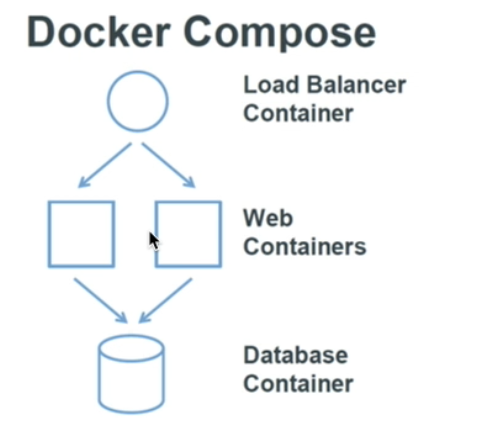
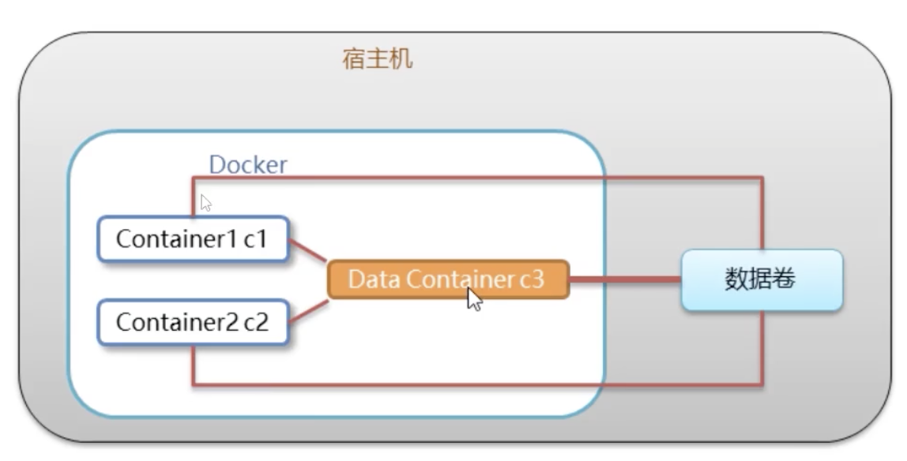
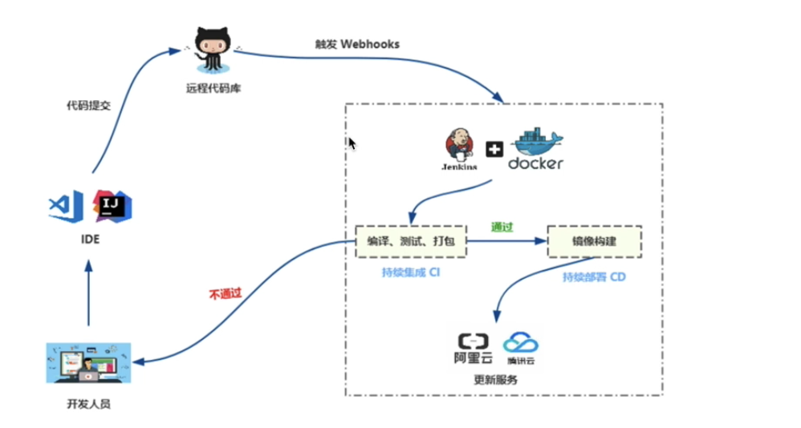
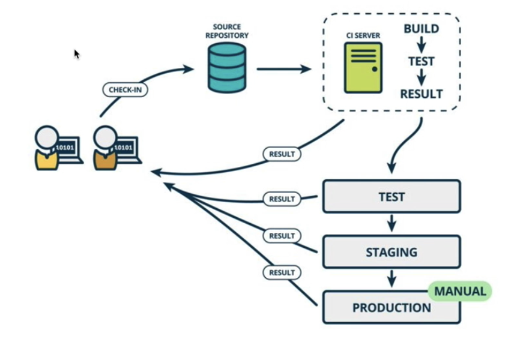
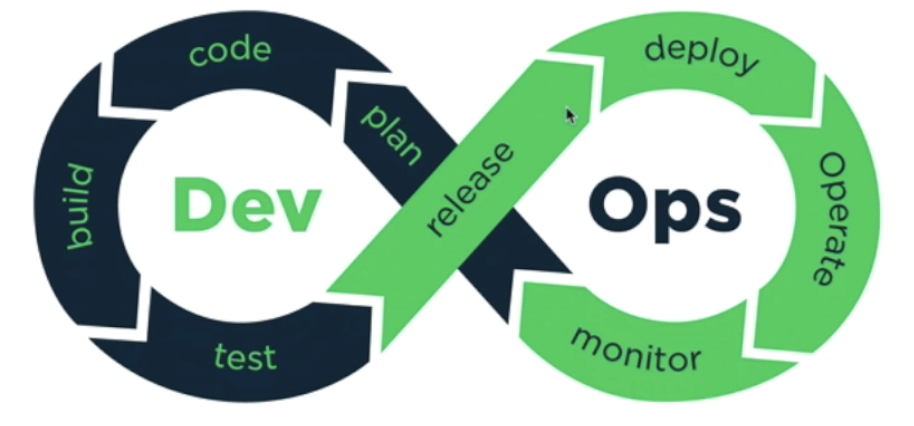
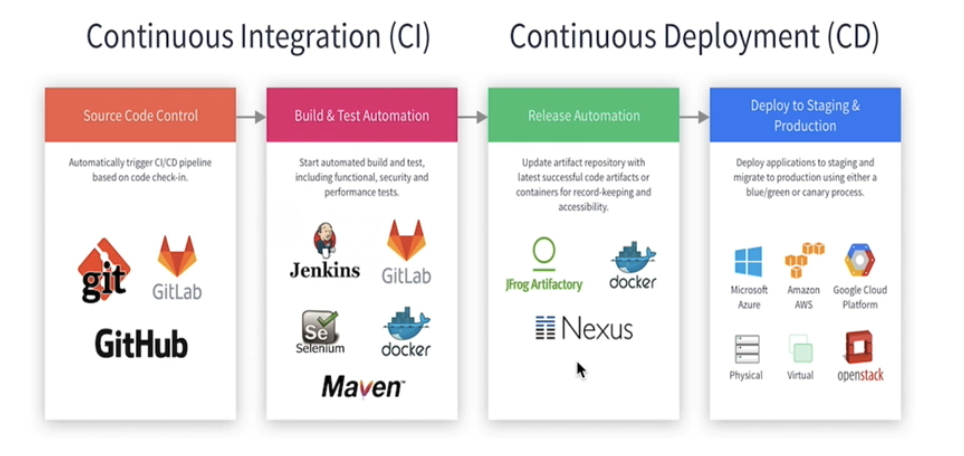
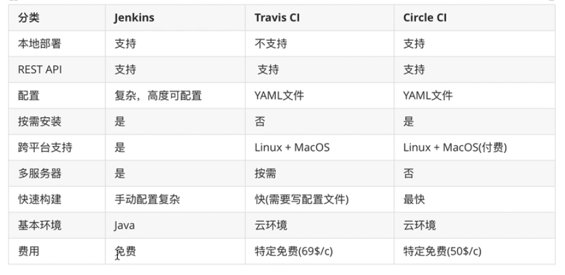
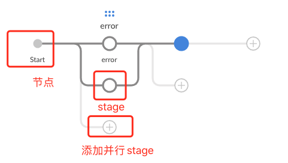

# 应用场景

- Web 应用的自动化打包和发布。（常用）
- 自动化测试和持续集成、发布。
- 在服务型环境中部署和调整数据库或其他的后台应用。
- 从头编译或者扩展现有的 OpenShift 或 Cloud Foundry 平台来搭建自己的 PaaS 环境。

> Docker 是一个用于开发，交付和运行应用程序的开放平台。Docker 使您能够将应用程序与基础架构分开，从而可以快速交付软件。借助 Docker，您可以与管理应用程序相同的方式来管理基础架构。通过利用 Docker 的方法来快速交付，测试和部署代码，您可以大大减少编写代码和在生产环境中运行代码之间的延迟。

## 是什么

Docker 是一个开源的应用容器引擎

## 简化&规范化 CI/CD

### 1、快速，一致地交付您的应用程序

Docker 允许开发人员使用您提供的应用程序或服务的本地容器在标准化环境中工作，从而简化了开发的生命周期。

容器非常适合持续集成和持续交付（CI / CD）工作流程，请考虑以下示例方案：

- 您的开发人员在本地编写代码，并使用 Docker 容器与同事共享他们的工作。
- 他们使用 Docker 将其应用程序推送到测试环境中，并执行自动或手动测试。
- 当开发人员发现错误时，他们可以在开发环境中对其进行修复，然后将其重新部署到测试环境中，以进行测试和验证。
- 测试完成后，将修补程序推送给生产环境，就像将更新的镜像推送到生产环境一样简单。

### 2、响应式部署和扩展

Docker 是基于容器的平台，允许高度可移植的工作负载。Docker 容器可以在开发人员的本机上，数据中心的物理或虚拟机上，云服务上或混合环境中运行。

Docker 的可移植性和轻量级的特性，还可以使您轻松地完成动态管理的工作负担，并根据业务需求指示，实时扩展或拆除应用程序和服务。

沙箱隔离。

### 3、在同一硬件上运行更多工作负载

Docker 轻巧快速。它为基于虚拟机管理程序的虚拟机提供了可行、经济、高效的替代方案，因此您可以利用更多的计算能力来实现业务目标。Docker 非常适合于高密度环境以及中小型部署，而您可以用==更少的资源做更多的事情==。

## docker vs 虚拟机


* 虚拟机是运行在虚拟内存上的，docker是运行的docker服务上的。

1. 容器是应用层的抽象，它将代码和依赖关系打包在一起。多个容器可以在同一台机器上运行，并与其他容器共享操作系统内核，每个容器在用户空间中作为独立进程运行。容器占用的空间比VM少（容器映像的大小通常为几十MB），可以处理更多的应用程序，并且需要更少的VM和操作系统。
2. 虚拟机（VM）是物理硬件的抽象，将一台服务器转变为多台服务器。管理程序允许多台VM在单台机器上运行。每个VM都包含操作系统的完整副本，应用程序，必要的二进制文件和库占用数十GB。虚拟机也可能很慢启动。


总结：

| 特性 | 容器 | 虚拟机 |
| ---- | ---- | ------ |
| 启动 | 秒级 | 分钟级 |
|硬盘使用|一般为 `MB`|一般为`GB`|
|性能|接近原生|弱于|
|系统支持量|单机支持上千个容器|一般几十个|
| 开发/环境定制|方便（***命令行***、面向对象式）|进入虚拟机|


***相同点***

1. 文件隔离/文件共享 （沙箱）
2. 资源隔离
3. 网络隔离
4. 支持多种宿主环境（扩展）
5. 快照/镜像（版本控制/变更管理）

***不同点***

1. 不同的资源管理/依赖/释放（虚拟机占用更多的资源）

2. 不同的应用运行环境

3. docker 是写时复制**Copy on write**，==真正操作会在基础镜像之上的读写层，然后能保存新的镜像==

   http://www.dannysite.com/blog/249/

4. 不同的日志方式（docker收集日志，虚拟机需要在虚拟系统中查看）

5. 不同的交互方式（docker偏向shell，虚拟机偏向GUI）


# 直接进入主题

> Docker是一个虚拟环境容器，可以将你的开发环境、代码、配置文件等一并打包到这个容器中，并发布和应用到任意平台中。比如，你在本地用Python开发网站后台，开发测试完成后，就可以将Python3及其依赖包、Flask及其各种插件、Mysql、Nginx等打包到一个容器中，然后部署到任意你想部署到的环境。


* 公共的仓库，可以从 registry 拉取。

## Docker Engine


Docker Engine是用于运行和编排容器的基础设施工具，我们平时说到的Docker大多数指的是Docker Engine，也就是在命令行和Docker进行交互的时候打交道的后台进程。

这是Docker Engine目前的架构，Docker客户端通过REST API与Docker Daemon来进行交互，Daemon把命令下发给containerd，containerd负责容器的生命周期管理以及镜像管理等，而runc负责创建容器。

Docker首次发布时，Docker Engine由两个核心组件构成：LXC和Docker Daemon。Docker Daemon是单一的二进制文件，包含诸如 Docker客户端、Docker API、容器运行时、镜像构建等。LXC提供了对Namespace(资源隔离)和CGroup(资源限制)等基础工具的操作能力，它们是基于Linux内核的容器虚拟化技术。

总结：

当 Docker 第一次启动一个容器时，初始的读写层是空的，当文件系统发生变化时，这些变化都会应用到这一层之上。比如，如果想修改一个文件，这个文件首先会从该读写层下面的只读层复制到该读写层。由此，该文件的只读版本依然存在于只读层，只是被读写层的该文件副本所隐藏。该机制则被称之为**写时复制（Copy on write）**

## 三个概念

### 镜像（Image）

类似于虚拟机中的镜像，是一个包含有文件系统的面向Docker引擎的==只读模板==。任何应用程序运行都需要环境，而镜像就是用来提供这种运行环境的。例如一个Ubuntu镜像就是一个包含Ubuntu操作系统环境的模板，同理在该镜像上装上Apache软件，就可以称为Apache镜像。

分片的文件系统，通常有dockerfile创建。为保证所有的服务镜像是相同的，镜像是一个只读的文件系统。

#### Docker镜像结构

所有的Docker镜像都起始于一个基础镜像层，==当进行修改或增加新的内容时，就会在当前镜像层之上，创建新的镜像层==。以Dockerfile为例，==每一行指令都产生一个新层==。

==镜像由一个或多个只读的镜像层构建而成==，每个镜像层拥有独立的哈希值，Docker在拉取或推送镜像时，会判断哪几层在本地或远端已存在，避免不必要的操作。

### 容器（Container）

类似于一个轻量级的沙盒，可以将其看作一个极简的Linux系统环境（包括root权限、进程空间、用户空间和网络空间等），以及运行在其中的应用程序。Docker引擎利用容器来运行、隔离各个应用。==容器是镜像创建的应用实例==，可以创建、启动、停止、删除容器，各个容器之间是是相互隔离的，互不影响。注意：镜像本身是只读的，容器从镜像启动时，Docker在镜像的上层创建一个可写层，镜像本身不变。

- 镜像（Image）和容器（Container）的关系，==就像是面向对象程序设计中的类和实例一样==，镜像是静态的定义，容器是镜像运行时的实体。容器可以被创建、启动、停止、删除、暂停等。

总结：

由 docker进程创建和管理的：文件系统 + 系统资源 + 网络配置 + 日志管理

docker 是 docker 镜像的运行环境，所以容器的概念也就比较好理解了。

### 仓库（Repository）

* 仓库可看成一个代码控制中心，用来保存镜像。

类似于代码仓库，这里是镜像仓库，是Docker用来集中存放镜像文件的地方。注意与注册服务器（Registry）的区别：注册服务器是存放仓库的地方，一般会有多个仓库；而仓库是存放镜像的地方，一般每个仓库存放一类镜像，每个镜像利用tag进行区分，比如Ubuntu仓库存放有多个版本（12.04、14.04等）的Ubuntu镜像。

* 可以设置 仓库镜像地址

### 概念

| Docker 镜像(Images)    | Docker 镜像是用于创建 Docker 容器的模板，比如 Ubuntu 系统。  |
| ---------------------- | ------------------------------------------------------------ |
| Docker 容器(Container) | 容器是独立运行的一个或一组应用，是镜像运行时的实体。         |
| Docker 客户端(Client)  | Docker 客户端通过命令行或者其他工具使用 Docker SDK (https://docs.docker.com/develop/sdk/) 与 Docker 的守护进程通信。 |
| Docker 主机(Host)      | 一个物理或者虚拟的机器用于执行 Docker 守护进程和容器。       |
| Docker Registry        | Docker 仓库用来保存镜像，可以理解为代码控制中的代码仓库。Docker Hub([https://hub.docker.com](https://hub.docker.com/)) 提供了庞大的镜像集合供使用。一个 Docker Registry 中可以包含多个仓库（Repository）；每个仓库可以包含多个标签（Tag）；每个标签对应一个镜像。通常，一个仓库会包含同一个软件不同版本的镜像，而标签就常用于对应该软件的各个版本。我们可以通过 **<仓库名>:<标签>** 的格式来指定具体是这个软件哪个版本的镜像。如果不给出标签，将以 **latest** 作为默认标签。 |
| Docker Machine         | Docker Machine是一个简化Docker安装的命令行工具，通过一个简单的命令行即可在相应的平台上安装Docker，比如VirtualBox、 Digital Ocean、Microsoft Azure。 |

## 安装和卸载

* https://www.runoob.com/docker/centos-docker-install.html

## mac 安装

```bash
brew install docker docker-compose
```

### docker desktop 收费问题

* docker desktop 已经对大公司收费了，所以推荐使用其他平替方案。

  比如使用

  参考：

  * https://juejin.cn/post/7223045442892234812
  * https://juejin.cn/post/7124226938176012296
  * github: https://github.com/abiosoft/colima

### colima 

#### 启用失败的问题

参考：https://github.com/abiosoft/colima/issues/20

#### 启动

```bash
$ colima start
```


## 操作

1. docker version

   查看版本

   docker info

   查看信息

2. docker --help

   查看帮助信息

3. 启动

    `sudo systemctl start docker`

4. 重启 
   ```powershell
   $ sudo systemctl daemon-reload
   $ sudo systemctl restart docker
   $ systemctl enable docker
   ```
   
   * 只限 centos

### 镜像操作

镜像系统操作以 docker image 为开头，不指定 TAG 使用 latest 作为镜像。

* docker search centos 查看是否存在镜像

* docker pull centos  # 利用pull命令获取镜像

* docker image ls 查看所有镜像。docker images 同

  各个选项说明:

  - **REPOSITORY：**表示镜像的仓库源
  - **TAG：**镜像的标签
  - **IMAGE ID：**镜像ID
  - **CREATED：**镜像创建时间
  - **SIZE：**镜像大小

* docker image pull NAME[:TAG] 拉取指定的镜像

  * 当我们在本地主机上使用一个不存在的镜像时 Docker 就会自动下载这个镜像。如果我们想预先下载这个镜像，我们可以使用 docker pull 命令来下载它。

* docker image push NAME[:TAG] 推送一个镜像

* docker image rm NAME[:TAG] 删除一个镜像

  > 一般情况下，需要先删除使用该镜像的实例（容器）， `docker rm 容器id`，然后再删除镜像。使用 docker rmi 镜像名是一样的效果，i 是image 的简称。

  同 `docker rmi 镜像`

* docker image import file

* docker run NAME 运行这个镜像

  运行容器

* `docker tag 860c279d2fec runoob/centos:dev`

  更新镜像的 tag

#### 镜像使用

当运行容器时，==使用的镜像如果在本地中不存在，docker 就会自动从 docker 镜像仓库中下载==，默认是从 Docker Hub 公共镜像源下载。

##### 1. 列出镜像列表

我们可以使用 **docker images** 来列出本地主机上的镜像。

```
runoob@runoob:~$ docker images           
REPOSITORY          TAG                 IMAGE ID            CREATED             SIZE
ubuntu              14.04               90d5884b1ee0        5 days ago          188 MB
php                 5.6                 f40e9e0f10c8        9 days ago          444.8 MB
nginx               latest              6f8d099c3adc        12 days ago         182.7 MB
mysql               5.6                 f2e8d6c772c0        3 weeks ago         324.6 MB
httpd               latest              02ef73cf1bc0        3 weeks ago         194.4 MB
ubuntu              15.10               4e3b13c8a266        4 weeks ago         136.3 MB
hello-world         latest              690ed74de00f        6 months ago        960 B
training/webapp     latest              6fae60ef3446        11 months ago       348.8 MB
```

各个选项说明:

- **REPOSITORY：**表示镜像的仓库源
- **TAG：**镜像的标签
- **IMAGE ID：**镜像ID
- **CREATED：**镜像创建时间
- **SIZE：**镜像大小

==同一仓库源可以有多个 TAG，代表这个仓库源的不同个版本==，如 ubuntu 仓库源里，有 15.10、14.04 等多个不同的版本，我们使用 REPOSITORY:TAG 来定义不同的镜像。

所以，我们如果要使用版本为15.10的ubuntu系统镜像来运行容器时，命令如下：

```
runoob@runoob:~$ docker run -t -i ubuntu:15.10 /bin/bash 
root@d77ccb2e5cca:/#
```

### ==创建镜像==

当我们从 docker 镜像仓库中下载的镜像不能满足我们的需求时，我们可以通过以下两种方式对镜像进行更改。

- 1、从已经创建的容器中更新镜像，并且提交这个镜像。以已有的镜像为基础，更新一个镜像。
- 2、使用 Dockerfile 指令来创建一个新的镜像。自己构建一个镜像。

==基础思路就是：1. 用 dockerfile 创建一个镜像 2.用commit去更新镜像。==

#### 1. 更新镜像

更新镜像之前，我们需要使用镜像来创建一个容器。更新镜像并不是创建一个新的镜像，只是更新了使用的镜像源。

```
runoob@runoob:~$ docker run -t -i ubuntu:15.10 /bin/bash
root@e218edb10161:/# 
```

==在运行的容器内==使用 **yum update** 命令进行更新。

在完成操作之后，输入 exit 命令来退出这个容器。

此时 ID 为 e218edb10161 的容器，是按我们的需求更改的容器。我们可以通过命令 docker commit 来提交容器副本。

`docker commit -m='has update' -a='test' 6054279f0a8f test/centos:v2`

- **-m:** 提交的描述信息
- **-a:** 指定镜像作者
- **e218edb10161：**容器 ID
- **runoob/ubuntu:v2:** 指定要创建的目标镜像名

注：

* 采用挂载的容器不能提交有问题，不会把数据卷的内容带过来

##### 压缩镜像

创建完镜像不方便传输，可以使用 压缩 再传输的方式

* 压缩

  ```bash
  docker save -o 压缩文件名称 镜像名称:版本号
  
  # 解压 还原
  docker load -i 压缩文件名称
  ```

  

#### 2. 构建镜像

我们使用命令 **docker build** ， ==从零开始来==创建一个新的镜像。为此，我们需要创建一个 Dockerfile 文件，其中==包含一组指令==来告诉 Docker 如何构建我们的镜像。==在前端项目中就需要使用这个命令，构建一个打好包的镜像==

```
runoob@runoob:~$ cat Dockerfile 
FROM    centos:6.7
MAINTAINER      Fisher "fisher@sudops.com"

RUN     /bin/echo 'root:123456' |chpasswd
RUN     useradd runoob
RUN     /bin/echo 'runoob:123456' |chpasswd
RUN     /bin/echo -e "LANG=\"en_US.UTF-8\"" >/etc/default/local
EXPOSE  22
EXPOSE  80
CMD     /usr/sbin/sshd -D
```

每一个指令都会在镜像上创建一个新的层，每一个指令的前缀都必须是大写的。

第一条FROM，指定使用哪个镜像源

RUN 指令告诉docker 在镜像内执行命令，安装了什么。。。

然后，我们使用 Dockerfile 文件，通过 docker build 命令来构建一个镜像。

```
runoob@runoob:~$ docker build -t runoob/centos:6.7 .
Sending build context to Docker daemon 17.92 kB
Step 1 : FROM centos:6.7
 ---&gt; d95b5ca17cc3
Step 2 : MAINTAINER Fisher "fisher@sudops.com"
 ---&gt; Using cache
 ---&gt; 0c92299c6f03
Step 3 : RUN /bin/echo 'root:123456' |chpasswd
 ---&gt; Using cache
 ---&gt; 0397ce2fbd0a
Step 4 : RUN useradd runoob
......
```

`docker build -t runoob/centos:6.7 .`

参数说明：

- **-t** ：指定要创建的目标镜像名
- **.** ：Dockerfile 文件所在目录，可以指定Dockerfile 的绝对路径

[具体查看](##Dockerfile)

#### 构建镜像并覆盖原镜像

https://juejin.cn/s/docker%20build%20%E8%A6%86%E7%9B%96%E9%95%9C%E5%83%8F

如果想要强制覆盖已有镜像，可以使用 `-f` 或者 `--force-rm` 选项。

示例：

```erlang
docker build --force-rm -t myimage .
```

### 容器操作

* 容器的所有状态

  容器在创建时进入Created状态，运行后进入Running状态，接着会进入到Pause状态或Exited状态，对已经退出的容器执行重启操作会使容器进入Restarting状态，随后转为Running状态。

1. 查看容器列表

   `docker container ls [options]`

2. 删除容器

   `docker container rm 容器`

3. 查看容器进程信息

   `docker container top CONTAINER`

   或者：

   `docker top id`

4. 查看容器日志

   `dcoker container logs CONTAINER`

5. 启动容器

   ```shell
   docker run -it ubuntu /bin/bash
   
   # 运行一个web容器
   docker run -d -P training/webapp python app.py
   
   docker run -itd --name web -P nginx
   ```

### 启动容器参数总结

参数说明：

- **-i**: 交互式操作。

- **-t**: 终端。

- **--rm** : 关闭时自动删除容器

- **ubuntu**: ubuntu 镜像。

- **/bin/bash**：放在镜像名后的是命令，这里我们希望有个交互式 Shell，因此用的是 /bin/bash。

- **-P:**将容器内部使用的网络端口随机映射到我们使用的主机上。

- -p 绑定指定的端口

  `-p 5000:5000`

- -d 启动 ==不进入容器==，加参数 -d，也就是 daemon 守护进程启动

  想要进入容器需要使用指令 docker exec

- `--name test-name ` 自定义启动容器的名字

- **-e username="ritchie":** 设置环境变量；

  比如：MySQL docker 官方就要求设置超级管理员密码

- ***-v***: 将本地的目录挂载到容器中的目录

  ```bash
  -v /usr/local/test:/usr/tmp/test
  ```
  
  注意： 
  
  1. 右边的目录是绝对目录，不能使用根目录符号 `~`
  2. 必须是目录拷贝，不能是单纯的文件
  
- 如果后边再跟命令，就是要在容器中执行的命令

  只是运行容器，并且执行后边的命令，然后会退出容器，输出执行的结果。

- 总结

  * 一个 `-` 后面跟 `key=value`
  * 两个 `-` 后面跟 `value`

退出终端（容器父进程）

`exit`

注意：

在run一个容器的时候，如果没有找到该镜像，就会去远端仓库拉取该镜像。

更多参考：https://www.runoob.com/docker/docker-run-command.html


1. 启动已停止运行的容器

   * 查看所有启动过的容器，查看历史记录。`docker container ls` (等于 `docker ps`，不加 `-a`)查看的是正在启动的容器。

     `docker ps -a`

     字段

     * PORTS: 端口

   * 找到 id ，然后重启一个已停止的容器

     ```shell
     docker start b750bbbcfd88 
     ```

> 重启之后的进程并不是并不是继承当前终端（不像直接启动容器，继承当前终端），如果想直接 kill 这个进程，需要先使用 `docker container top 容器id`找到进程号，然后执行 `kill -9 进程号`清理该进程。

7. 停止一个容器

   `docker stop 容器id`

   重启一个正在运行着的容器

   `docker restart 容器id`

8. 进入容器

   `docker exec -it 容器id /bin/bash`

9. 查看容器网络端口（映射到本地主机上）

   `docker port 容器名称|id`

10. 查看容器底层信息

    使用 **docker inspect** 来查看 Docker 的底层信息。它会返回一个 JSON 文件记录着 Docker 容器的配置和状态信息(包括网络配置、环境变量、宿主路径)。

### 其他 docker 操作

1. 查看版本

   `docker version`

2. 查看docker使用情况

   `docker info`

   查看具体容器使用情况

   `docker inspect id`


#### 导出和导入容器

1. 导出容器

   ```shell
   docker export 1e560fca3906 > ubuntu.tar
   ```

   可以将容器导出到本地，方便快速制作镜像

2. 导入容器快照

   `docker import centos-test.tar test/centos:v1 ` v1代表 tag ，会在镜像列表出现。

   此外，也可以通过指定 URL 或者某个目录来导入，例如：

   ```shell
   $ docker import http://example.com/exampleimage.tgz example/imagerepo
   ```

3. 删除容器

   `docker rm -f 容器id`

   * ==删除容器时，容器必须是停止状态，否则会报如下错误==

   下面的命令可以清理掉所有处于终止状态的容器。

   `docker container prune`

## 实例：运行一个 web 应用

* 前面我们运行的容器并没有一些什么特别的用处。

  接下来让我们尝试使用 docker 构建一个 web 应用程序。

  我们将在docker容器中运行一个 Python Flask 应用来运行一个web应用。

```bash
runoob@runoob:~# docker pull training/webapp  # 载入镜像
runoob@runoob:~# docker run -d -P training/webapp python app.py
```

参数说明:

- **-d:**让容器在后台运行。
- **-P:**将容器内部使用的网络端口==随机==映射到我们使用的主机上。

### 查看容器

使用 docker ps 来查看我们正在运行的容器：

```
runoob@runoob:~#  docker ps
CONTAINER ID        IMAGE               COMMAND             ...        PORTS                 
d3d5e39ed9d3        training/webapp     "python app.py"     ...        0.0.0.0:32769->5000/tcp
```

这里多了端口信息。

```
PORTS
0.0.0.0:32769->5000/tcp
```

Docker 开放了 5000 端口（默认 Python Flask 端口）映射到主机端口 32769 上。

#### 这时我们可以通过浏览器访问WEB应用


我们也可以通过 -p 参数来设置不一样的端口：

```
runoob@runoob:~$ docker run -d -p 5000:5000 training/webapp python app.py
```

* 可以使用 `docker port`查看容器端口
* `-P`大写是随机映射，`-p`小写能够设置

### 查看容器运行日志

`docker logs -f 容器id|名称`

* -f 可以像 `tail -f`一样动态的查看日志


### 容器连接

* 我们还可以使用 `-p` 设置绑定主机的网络地址，一般设置 `0.0.0.0` 才能被外界访问。比如说映射到 `127.0.0.1`。比如说设置不同的容器在主机上互相访问。

  `docker run -d -p 127.0.0.1:5001:5000 training/webapp python app.py`

  这样我们就可以通过访问 127.0.0.1:5001 来访问容器的 5000 端口。

  上面的例子中，默认都是绑定 tcp 端口，如果要绑定 UDP 端口，可以在端口后面加上 **/udp**。

  ```shell
  runoob@runoob:~$ docker run -d -p 127.0.0.1:5000:5000/udp training/webapp python app.py
  ```

#### Docker 容器互联

端口映射并不是唯一把 docker 连接到另一个容器的方法。

docker 有一个==连接系统==允许将多个容器连接在一起，共享连接信息。

docker 连接会创建一个父子关系，其中父容器可以看到子容器的信息。

#### 容器命名

当我们创建一个容器的时候，docker 会自动对它进行命名。另外，我们也可以使用 **--name** 标识来命名容器，例如：

```shell
runoob@runoob:~$  docker run -d -P --name runoob training/webapp python app.py
43780a6eabaaf14e590b6e849235c75f3012995403f97749775e38436db9a441
```

## docker 仓库管理

* 仓库（Repository）是集中存放镜像的地方。以下介绍一下 [Docker Hub](https://hub.docker.com/)。当然不止 docker hub，只是远程的服务商不一样，操作都是一样的。
* 登录需要输入用户名和密码，登录成功后，我们就可以从 docker hub 上拉取自己账号下的全部镜像。

```
$ docker login
```

[](https://www.runoob.com/wp-content/uploads/2019/10/5974B2AE-945F-4DD0-A7C8-9D9B01BDAF62.jpg)

**退出**

退出 docker hub 可以使用以下命令：

```shell
$ docker logout
```

* 拉取镜像

  你可以通过 docker search 命令来==查找官方仓库中==的镜像，并利用 docker pull 命令来将它下载到本地。

* docker pull

  默认拉取最新的，如果需要拉取指定的版本需要加 `:`

  例： `docker pull centos:8`

  * 如果设置成私有的，需要在本地登录

* 推送镜像

  推送的镜像是基于当前登录账号的仓库，只会推送到当前登录的仓库中。

  所以为什么在命名镜像的时候建议加上自己的仓库名称 `docker hub 用户名/镜像名`，这样在执行 push 操作的时候就会自动查找对应用户名下边的仓库。

  `docker push programmerzbb/centos`

## Dockerfile

一般 dockerfile 共包括四部分：

* 基础镜像信息

* 维护者信息

* 镜像操作指令

  对应分片文件系统

* 容器启动执行指令


### 解决什么问题

* 对于开发人员：可以为开发团队提供一个完全一致的开发环境
* 对于测试人员，只需要一个 文件就能运行一个一模一样的环境
* 对于运维：在部署时，可以实现应用的无缝移植


### 什么是 Dockerfile？

Dockerfile 是一个用来构建镜像的文本文件，文本内容包含了一条条构建镜像所需的指令和说明。

这里仅讲解如何运行 Dockerfile 文件来定制一个镜像，具体 Dockerfile 文件内指令详解，将在下一节中介绍，这里你只要知道构建的流程即可。

**1、下面以定制一个 nginx 镜像（构建好的镜像内会有一个 /usr/share/nginx/html/index.html 文件）**

在一个空目录下，新建一个名为 Dockerfile 文件，并在文件内添加以下内容：


**FROM**：定制的镜像都是基于 FROM 的镜像，这里的 nginx 就是定制需要的基础镜像。后续的操作都是基于 nginx。

**RUN**：用于执行后面跟着的命令行命令。有以下俩种格式：

shell 格式：

```
RUN <命令行命令>
# <命令行命令> 等同于，在终端操作的 shell 命令。
```

exec 格式：

```shell
RUN ["可执行文件", "参数1", "参数2"]
# 例如：
# RUN ["./test.php", "dev", "offline"] 等价于 RUN ./test.php dev offline
```

**注意**：Dockerfile 的指令每执行一次都会在 docker 上新建一层。所以过多无意义的层，会造成镜像膨胀过大。例如：

FROM centos
RUN **yum install** **wget**
RUN **wget** -O redis.tar.gz "http://download.redis.io/releases/redis-5.0.3.tar.gz"
RUN **tar** -xvf redis.tar.gz
以上执行会创建 3 层镜像。可简化为以下格式：
FROM centos
RUN **yum install** **wget** \
  **&&** **wget** -O redis.tar.gz "http://download.redis.io/releases/redis-5.0.3.tar.gz" \
  **&&** **tar** -xvf redis.tar.gz

如上，==以 **&&** 符号连接命令，这样执行后，只会创建 1 层镜像。==

### ==开始构建镜像(一般情况下前端项目部署)==

在 Dockerfile 文件的存放目录下，执行构建动作。

以下示例，通过目录下的 Dockerfile 构建一个 nginx:v3（镜像名称:镜像标签）。

**注**：最后的 **.** 代表本次执行的上下文路径，下一节会介绍。

$ docker build -t nginx:v3 .


以上显示，说明已经构建成功。

### 上下文路径

上一节中，有提到指令最后一个 **.** 是上下文路径，那么什么是上下文路径呢？

$ docker build -t nginx:v3 .

上下文路径，是指 docker 在构建镜像，有时候想要使用到本机的文件（比如复制），==docker build 命令得知这个路径后，会将路径下的所有内容打包。==

**解析**：由于 docker 的运行模式是 C/S。我们本机是 C，docker 引擎是 S。实际的构建过程是在 docker 引擎下完成的，所以这个时候无法用到我们本机的文件。这就需要把我们本机的指定目录下的文件一起打包提供给 docker 引擎使用。

如果未说明最后一个参数，那么默认上下文路径就是 Dockerfile 所在的位置。

**注意**：上下文路径下不要放无用的文件，因为会一起打包发送给 docker 引擎，如果文件过多会造成过程缓慢。

## 指令详解

### FROM

基于一个基础的镜像来修改

### MAINTAINER 

MAINTAINER      Fisher "fisher@sudops.com"

### COPY

复制指令，从上下文目录中复制文件或者目录到容器里指定路径。

格式：

```
COPY [--chown=<user>:<group>] <源路径1>...  <目标路径>
COPY [--chown=<user>:<group>] ["<源路径1>",...  "<目标路径>"]
```

**[--chown=<user>:<group>]**：可选参数，用户改变复制到容器内文件的拥有者和属组。

**<源路径>**：源文件或者源目录，这里可以是通配符表达式，其通配符规则要满足 Go 的 filepath.Match 规则。例如：

```
COPY hom* /mydir/
COPY hom?.txt /mydir/
```

**<目标路径>**：容器内的指定路径，该路径不用事先建好，路径不存在的话，会自动创建。

* 可以是相对路径，取决于 build 时候的 dockerfile 规定根目录

### ADD

ADD 指令和 COPY 的使用格式一致（同样需求下，官方推荐使用 COPY）。功能也类似，不同之处如下：

- ADD 的优点：在执行 <源文件> 为 tar 压缩文件的话，压缩格式为 gzip, bzip2 以及 xz 的情况下，会自动复制并解压到 <目标路径>。
- ADD 的缺点：在不解压的前提下，==无法复制 tar 压缩文件（自动压缩）==。会令镜像构建缓存失效，从而可能会令镜像构建变得比较缓慢。具体是否使用，可以根据是否需要自动解压来决定。

可以使用远程服务，解压。COPY 一般是本地文件。

### CMD

类似于 RUN 指令，用于运行程序，但二者运行的时间点不同:

- CMD 在docker run 时运行。
- RUN 是在 docker build。

**作用**：为启动的容器指定==默认要运行==的程序，程序运行结束，容器也就结束。CMD 指令指定的程序可被 docker run 命令行参数中指定要运行的程序所覆盖。

**注意**：==如果 Dockerfile 中如果存在多个 CMD 指令，仅最后一个生效。nginx 运行命令也要使用 CMD==

格式：

```
CMD <shell 命令> 
CMD ["<可执行文件或命令>","<param1>","<param2>",...] 
CMD ["<param1>","<param2>",...]  # 该写法是为 ENTRYPOINT 指令指定的程序提供默认参数
```

推荐使用第二种格式，执行过程比较明确。第一种格式实际上在运行的过程中也会自动转换成第二种格式运行，并且默认可执行文件是 sh。

### ENTRYPOINT

入口，一般在制作一些执行就关闭的容器中会使用。

类似于 CMD 指令，但其不会被 docker run 的命令行参数指定的指令所覆盖，而且这些命令行参数会被当作参数送给 ENTRYPOINT 指令指定的程序。启动的时候传参，比如说配置文件不采用默认的，需要自定义。

但是, 如果运行 docker run 时使用了 --entrypoint 选项，将覆盖 CMD 指令指定的程序。

**优点**：在执行 docker run 的时候可以指定 ENTRYPOINT 运行所需的参数。

**注意**：如果 Dockerfile 中如果存在多个 ENTRYPOINT 指令，仅最后一个生效。

### ENV

设置环境变量，定义了环境变量，那么在后续的指令中，就可以使用这个环境变量。

格式：

```
ENV <key> <value>
ENV <key1>=<value1> <key2>=<value2>...
```

以下示例设置 NODE_VERSION = 7.2.0 ， 在后续的指令中可以通过 $NODE_VERSION 引用：

```shell
ENV NODE_VERSION 7.2.0

RUN curl -SLO "https://nodejs.org/dist/v$NODE_VERSION/node-v$NODE_VERSION-linux-x64.tar.xz" \
  && curl -SLO "https://nodejs.org/dist/v$NODE_VERSION/SHASUMS256.txt.asc"
```

### ARG

构建参数，与 ENV 作用一至。不过作用域不一样。ARG 设置的环境变量仅对 Dockerfile 内有效，也就是说只有 docker build 的过程中有效，构建好的镜像内不存在此环境变量。

构建命令 docker build 中可以用 --build-arg <参数名>=<值> 来覆盖。

格式：

```shell
ARG <参数名>[=<默认值>]
```

### WORKDIR

指定工作目录。用 WORKDIR 指定的工作目录，会在构建镜像的每一层中都存在。（WORKDIR 指定的工作目录，必须是提前创建好的）。容器内的工作目录，绝对路径。

docker build 构建镜像过程中的，每一个 RUN 命令都是新建的一层。只有通过 WORKDIR 创建的目录才会一直存在。

格式：

```shell
WORKDIR <工作目录路径>
```

### USER

用于指定执行后续命令的用户和用户组，这边只是切换后续命令执行的用户（用户和用户组必须提前已经存在）。

格式：

```shell
USER <用户名>[:<用户组>]
```

### VOLUME

定义匿名数据卷。在启动容器时忘记挂载数据卷，会自动挂载到匿名卷。

作用：

- 避免重要的数据，因容器重启而丢失，这是非常致命的。
- 避免容器不断变大。

格式：

```
VOLUME ["<路径1>", "<路径2>"...]
VOLUME <路径>
```

在启动容器 docker run 的时候，我们可以通过 -v 参数修改挂载点。

### EXPOSE

仅仅只是声明端口。

作用：

- 帮助镜像使用者理解这个镜像服务的守护端口，以方便配置映射。
- 在运行时使用随机端口映射时，也就是 docker run -P 时，会自动随机映射 EXPOSE 的端口。

格式：

```
EXPOSE <端口1> [<端口2>...]
```

### 命令总结

* RUN 命令，也就是docker内部的命令
* CMD 命令，在启动容器的时候执行的命令

## ==使用 dockerfile 的一个例子==

制作一个前端 koa 启动的一个服务


### Dockerfile 示例:

```dockerfile
# 基于哪个镜像
FROM node:10

# LABEL <key>=<value> <key>=<value> <key>=<value> ...
LABEL version="1.0"

# 创建 app 目录
WORKDIR /app

# 把 package.json, package-lock.json 或 yarn.lock 复制到工作目录（相对路径）
COPY ["package.json","*.lock","./"]

# 打包 app 源码
# 特别注意：要指定工作目录中的文件名
COPY src ./src

# 使用.dockerignore 文件，上面两个 COPY 合并成一个
# COPY ..

# 使用 yarn 安装 app 依赖
# 如果你需要构建生产环境下的代码，请使用：
# --prod 参数
RUN yarn --prod --registry=https://registry.npm.taobao.org

# 对外暴露端口 -p 4000:3000
EXPOSE 3000

CMD [ "node", "src/index.js" ]
```

* `COPY .` : 拷贝当前目录下所有文件
* docker 容器需要持续运行，即控制台任务不能终止。所以运行 docker 容器的命令（CMD），需要占据主线程防止控制台关闭。就是 pid 为 1 的进程不能关闭。

### 总结

* RUN、RUN 多次命令需要合并

  RUN：构建镜像时，一般用于做一些系统配置，安装必备的软件。可有多个

* COPY  可以多次执行

* CMD：启动容器时，只能有一个CMD

* ENV: `ENV K1=v1` 类似于 node 中的 process.env

* 设置时区：一般情况下，需要为docker设置时区，防止打印的日志日期不太对

  ```dockerfile
  RUN ln -sf /usr/share/zoneinfo/Asia/Shanghai /etc/localtime && echo 'Asia/Shanghai' >/etc/timezone
  ```

* 任何服务都可以使用 `-g "daemon off;"` 让服务卡到前台运行，阻止docker容器的结束。

### ==重要==

* 为了使得 dockerfile 中的 CMD 命令起作用，在执行docker run 命令的时候，不能在镜像后添加任何命令，包括 `/bin/bash`

  ```dockerfile
  docker run -itd --name cicd -p 8082:80 zbb/testcicd:v1 && echo '上线完成'
  ```

* 建议在 dockerfile 中写 VOLUME，防止出现run的时候没有指定数据卷而出现的数据丢失情况。

### 打包

docker build 打包。（生产镜像）

`docker build -t ${name}/${iamge_name}:${tag} .`

`.`默认采用当前目录下的dockerfile，`tag` 是给镜像打的标签，用于版本控制

* -f 指定文件 ， `-f ./dockerfile`
* -t 指定镜像名称
* . 寻址路径，即如果有相对路径的出发点

## 运行

* 采用run 命令

以下命令使用 ubuntu 镜像启动一个容器，参数为以命令行模式进入该容器：

```bash
$ docker run -it ubuntu /bin/bash
```

### 为什么要用 daemon off

> docker 容器默认会把容器内部第一个进程，也就是pid=1的程序作为docker容器是否正在运行的依据，如果docker 容器pid挂了，那么docker容器便会直接退出。
>
> https://segmentfault.com/a/1190000009583997

* Nginx 会在后台运行，bash 结束后就会退出，不能卡住进程。所以pid为1的进程（bash）退出之后，容器也就结束了
* npm run start 等前端方式，不会结束进程，则不用使用 daemon off

## 更新

```bash
$ docker update <container id>
```

## 重启容器

```bash
$ docker restart <容器 ID>
```

### docker 自动重启--restart

* 参考：https://blog.csdn.net/yaomingyang/article/details/103480946

–restart参数有三个可选值：no,on-failure,always

- no为默认值，表示容器退出时，docker不自动重启容器
- on-failure表示，若容器的退出状态非0，则docker自动重启容器，还可以指定重启次数，若超过指定次数未能启动容器则放弃

- always表示只要容器退出，则docker将自动重启容器

1. 运行时设置

   ```bash
   $ docker run <镜像名> --restart=always
   ```

2. 已经启动的容器设置重启

   ```bash
   $ docker update --restart=always <continer id>
   ```

## .dockerignore

* 能够过滤掉不需要dockerfile 处理的文件。比如 copy . 的情况。


## dockerfile 总结

* 每一行一层，相当于一个步骤

### 步骤

1. 创建 dockerfile 
2. 先build成一个镜像
3. 然后运行这个镜像。这个时候指定运行的端口映射

以上步骤是必须的

### dockerfile 优化

#### 关于分层

Dockerfile 的指令每执行一次都会在 docker 上新建一层。所以过多无意义的层，会造成镜像膨胀过大。

```bash
FROM centos
RUN **yum** -y **install** **wget**
RUN **wget** -O redis.tar.gz "http://download.redis.io/releases/redis-5.0.3.tar.gz"
RUN **tar** -xvf redis.tar.gz
```

以上执行会创建 3 层镜像。可简化为以下格式：

```bash
FROM centos
RUN **yum** -y **install** **wget** \
  **&&** **wget** -O redis.tar.gz "http://download.redis.io/releases/redis-5.0.3.tar.gz" \
  **&&** **tar** -xvf redis.tar.gz
```

如上，以 **&&** 符号连接命令，这样执行后，只会创建 1 层镜像。 

## docker 其他操作

### 1. 查看元信息

https://www.runoob.com/docker/docker-inspect-command.html

docker inspect  查看容器/镜像元数据（就是一些创建时候的基础数据）

* 比如说能够查看 MySQL 的挂载路径，在 mounts 属性里边，每次挂载的路径都不一样，如果想要复用原来的路径，可以在启动的时候使用 `-v` 来指定。

## DevOps 流程

对开发和运维（DevOps） 人员来说，最希望的就是一次创建或配置，可以在任何地方正常运行。

使用 Docker 可以通过定制应用镜像来实现[持续集成](# 持续集成和持续发布)、持续交付、部署。开发人员可以通过 Dockerfile 来进行镜像构建，并结合 [持续集成（continuous Integration）](http://www.ruanyifeng.com/blog/2015/09/continuous-integration.html) 系统进行集成测试，而运维人员则可以直接在生产环境中快速部署该镜像，甚至结合持续部署(Continuous Delivery/Deployment) 系统进行自动部署。

而且使用 Dockerfile 使镜像构建透明化，不仅仅开发团队可以理解应用运行环 境，也方便运维团队理解应用运行所需条件，帮助更好的生产环境中部署该镜像。


## docker-compose 介绍

通过 docker-compose 用户可以容易用一个配置文件定义一个多容器应用（要不然需要运行多次次 docker run命令），然后使用一条指令安装这个应用的所有依赖，完成构建。docker-compose 解决了容器与容器之间如何管理编排的问题。



docker-compose 有两个重要的概念：

* 服务（service）：一个应用的容器，实际上可以包括若干个运行相同镜像的容器实例
* 项目（project）：由一组关联的应用容器组成的一个完整业务单元，在 docker-compose.yml 文件中定义。

docker compose 是docker的独立产品，需要安装 docker compose


# docker 容器的数据卷

## 数据卷概念

问题：

* docker 容器删除后，在容器中产生的数据也会随之销毁
* docker 容器和外部机器可以直接交换文件吗
* 容器之间想要进行数据交互

数据卷

* 数据卷是宿主机中的一个目录或文件

  容器能和数据卷进行数据同步

* 一个数据卷可以被多个容器同时挂载

* 一个容器可以被挂载多个数据卷

## 配置数据卷

* 创建启动容器时，使用 -v 参数 设置数据卷

  ```bash
  docker run ... -v 宿主机目录(文件): 容器内目录(文件)...
  ```

* 注意事项

  1. 目录必须是绝对路径

     宿主机可以使用 `~/root` ，容器不行

  2. 如果目录不存在，会自动创建

  3. 可以挂载多个数据卷

     ```bash
     docker run -it --name=c2 \
     -v ~/data2:/root/data2 \
     -v ~/data3:/root/data3 \
     centos:7 
     ```

### 注意

* mac 数据卷不能使用相对路径和绝对路径，都容易出错！！！！

  建议使用当前路径。

  ```bash
  $ docker run -v data:/var/lib/mysql --name=mysql-test2 -p 8091:3306 -e MYSQL_ROOT_PASSWORD=qazplm -d mysql
  ```

### 数据卷容器

多个容器进行数据交换：方法

1. 多个容器挂载同一个数据卷
2. 数据卷容器



​	就是使用一个容器去当桥梁，操作数据卷


#### 配置

1. 创建c3数据卷容器，使用 -v 参数设置数据卷

   ```bash
   docker run -it --name=c3 -v /volume cnetos:7 /bin/bash
   ```

   * docker 会自动创建在宿主机创建一个目录

2. 创建启动 c1 c2 容器，使用 --volumes-from 参数设置数据卷

   ```bash
   docker run -it --name=c1 --volumes-from c3 centos:7 /bin/bash
   docker run -it --name=c2 --volumes-from c3 centos:7 /bin/bash
   ```

   * 这样 c1 和 c2 中也会存在 /volume 目录

# docker 缓存相关

* 参考https://blog.51cto.com/u_1472521/5981360

# docker 桥接网络

## docker 网络模式

### network_mode

参考：https://www.runoob.com/docker/docker-compose.html

设置网络模式。

```
network_mode: "bridge"
network_mode: "host"
network_mode: "none"
network_mode: "service:[service name]"
network_mode: "container:[container name/id]"
```

## 容器间访问

第一种方式如上所述 [docker 容器怎么访问宿主机](###docker 容器怎么访问宿主机)

第二种方式就是桥接网络了

### 桥接网络的方式

1. 创建一个网络

   ```bash
   # 创建名为 common-network 的网络
   $ docker network create common-network
   # 查看网络列表
   $ docker network ls
   ```

2. 容器运行的时候指定 network

   ```bash
   # 运行MySQL指定network就行不需要指定port了，让network代理
   $ docker run -v /Users/zhangbinbinb28199/my-data/mysql/data:/var/lib/mysql --user 501:501 --name mysql-test --network common-network -e MYSQL_ROOT_PASSWORD=qazplm -d mysql
   # 运行 Redis
   $ docker run -v /Users/zhangbinbinb28199/my-data/redis/data:/data --name=redis-test1 --user=1000:1000 --network common-network -d redis redis-server --requirepass qazplm
   # 运行api 服务，需要对外指定port，方便外部访问，也需要指定network
   $ docker run --name=nest-test -p 3000:3000 -e NODE_ENV=production --network common-network -d nest-test
   ```

### docker compose 桥接

就是把run时候的参数翻译到 yaml 文件中

* 新建一个networks，命名为 common-network，模式为 bridge
* 也可以不指定 network，docker compose 回默认给其中的 service 创建一个 network

```yaml
# version 是指定 docker-compose.yml 的版本，因为不同版本配置不同
version: '3.8'
services:
  nest-test:
    build:
      context: ./
      dockerfile: ./Dockerfile
    depends_on:
      - mysql-service
      - redis-service
    ports:
      - '3000:3000'
    environment:
      - NODE_ENV=production
    # 配置重启
    restart: on-failure
    networks:
      - common-network
  # docker run -v data:/var/lib/mysql --name=mysql-test2 -p 8091:3306 -e MYSQL_ROOT_PASSWORD=qazplm -d mysql
  mysql-service:
    image: mysql
    # ports:
    #   - '8091:3306'
    networks:
      - common-network
    volumes:
      # - 'data:/var/lib/mysql'
      - /Users/zhangbinbinb28199/my-data/mysql/data:/var/lib/mysql
    environment:
      - MYSQL_ROOT_PASSWORD=qazplm
    user: '1000:1000'
  # docker run -v /Users/zhangbinbinb28199/my-data/redis/data:/data --name=redis-test1 --user=1000:1000 -p 8096:6379 -d redis redis-server --requirepass qazplm
  redis-service:
    image: redis
    # ports:
    #   - 8093:6379
    volumes:
      - /Users/zhangbinbinb28199/my-data/redis/data:/data
    user: '1000:1000'
    command: 'redis-server --requirepass qazplm'
    networks:
      - common-network
networks:
  common-network:
    driver: bridge
```


# docker 服务编排

* 微服务架构的应用系统中一般包含若干个微服务，每个微服务一般都会部署多个实例，如果每个微服务都要手动启停，维护的工作量会很大。

服务编排：

* 按照一定的业务规则批量管理容器。

## docker compose

* docker compose 是一个编排多容器分布式部署的工具。通过compose，你可以使用 YML 文件来配置应用程序需要的所有应用。然后，使用一个命令就可以从YML文件配置中创建并启动所有服务。提供命令集管理容器化应用的完整开发周期，包括服务构建，启动和停止。使用步骤：
  1. 使用 dockerfile 定义运行环境镜像
  
     两种模式：要不使用 dockerfile 的方式启动，要么直接使用已有的镜像启动；
  
  2. 使用 docker-compose.yml 定义组成应用的各服务，这样它们可以在隔离环境中一起运行。
  
  3. 运行 docker-compose up 启动应用

https://www.runoob.com/docker/docker-compose.html


使用：

1. 创建目录
2. 编写 docker-compose.yml 文件

```yaml
version: '3'
services:
	nginx:
		image: nginx
		ports:
		- 80:80
		links:
		- app
		volumes:
		- ./nginx/conf.d:/etc/nginx/conf.d
	app:
		image: app
		expose:
		- '8080'
```

* 并行的一个关系，每个容器之间
* 容器下面就是一些启动时要输入的命令
* 主要是加了 depends_on 字段，组织依赖关系！

3. 在 `/nginx/conf.d` 目录下编写 nginx 配置文件

4. 在 ~/docker-compose 目录下使用 docker-compose 启动容器

   `docker-compose up`

5. 测试访问

   

### 创建简单的 yml 文件

* 创建一个名为 docker-compose.yml 的文件

  ```yaml
  # yaml 配置
  version: '3'
  version: '0.1'
  services:
    nest-test:
      build:
        context: ./
        dockerfile: ./Dockerfile
      depends_on:
        - mysql-service
        - redis-service
      ports:
        - '3000:3000'
      environment:
        - NODE_ENV=production
    # docker run -v data:/var/lib/mysql --name=mysql-test2 -p 8091:3306 -e MYSQL_ROOT_PASSWORD=qazplm -d mysql
    mysql-service:
      image: mysql
      ports:
        - '8091:3306'
      volumes:
        # - 'data:/var/lib/mysql'
        - /Users/zhangbinbinb28199/my-data/mysql/data:/var/lib/mysql
      environment:
        - MYSQL_ROOT_PASSWORD=qazplm
      user: '1000:1000'
    # docker run -v /Users/zhangbinbinb28199/my-data/redis/data:/data --name=redis-test1 --user=1000:1000 -p 8096:6379 -d redis redis-server --requirepass qazplm
    redis-service:
      image: redis
      ports:
        - 8093:6379
      volumes:
        - /Users/zhangbinbinb28199/my-data/redis/data:/data
      user: '1000:1000'
      command: 'redis-server --requirepass qazplm'
  ```

  Web 项目的dockerfile就在当前目录下，redis 就是一个权限的镜像

* 主要就是 version 和 services 两个字段

  * Services 中是每个镜像的配置

### 命令

#### depends_on

设置依赖关系，这样就可能控制启动的先后顺序

- docker-compose up ：以依赖性顺序启动服务。在以下示例中，先启动 db 和 redis ，才会启动 web。
- docker-compose up SERVICE ：自动包含 SERVICE 的依赖项。在以下示例中，docker-compose up web 还将创建并启动 db 和 redis。
- docker-compose stop ：按依赖关系顺序停止服务。在以下示例中，web 在 db 和 redis 之前停止。

```
version: "3.7"
services:
  web:
    build: .
    depends_on:
      - db
      - redis
  redis:
    image: redis
  db:
    image: postgres
```

注意：web 服务不会等待 redis db 完全启动 之后才启动。

#### restart

- no：是默认的重启策略，在任何情况下都不会重启容器。
- always：容器总是重新启动。
- on-failure：在容器非正常退出时（退出状态非0），才会重启容器。
- unless-stopped：在容器退出时总是重启容器，但是不考虑在Docker守护进程启动时就已经停止了的容器

```
restart: "no"
restart: always
restart: on-failure
restart: unless-stopped
```

注：swarm 集群模式，请改用 restart_policy。

#### volumes

将主机的数据卷或着文件挂载到容器里。

```yaml
version: "3.7"
services:
  db:
    image: postgres:latest
    volumes:
      - "/localhost/postgres.sock:/var/run/postgres/postgres.sock"
      - "/localhost/data:/var/lib/postgresql/data"
```

### 思考

docker compose 更适合单机服务编排，如果分布式系统可能还是需要 k8s 去管理！

## docker nginx

### nginx 容器访问主机IP

参考：https://github.com/zhangyu921/blog/issues/8

* 使用这种方式就不需要设置端口了，直接就能当成外部的Nginx运行

### 我的网站Nginx配置

```bash
sudo docker run --name nginx -v /home/lighthouse/info/nginx/nginx.conf:/etc/nginx/nginx.conf \
-v /home/lighthouse/info/nginx/conf.d:/etc/nginx/conf.d \
-v /home/lighthouse/info/nginx/logs:/var/log/nginx \
-v /home/lighthouse/.acme.sh/programmerzbb.icu_ecc/programmerzbb.icu.cer:/cert/nginx.cert:ro \
-v /home/lighthouse/.acme.sh/programmerzbb.icu_ecc/programmerzbb.icu.key:/cert/nginx.key:ro \
--network host -d nginx
```

* 包含https的配置，Nginx.conf 的配置

* `--network host` 可以访问本地 IP，Nginx直接代理了本地网络了，不需要IP配置

## docker network

### docker 容器怎么访问宿主机

参考：https://zhuanlan.zhihu.com/p/500672080

docker network 模式：

docker 容器运行有三种网络配置：host， bridge，none，默认是bridge， 

* none表示容器无法使用网络，
* bridge 需要用-p 参数把端口映射出来。
* 如果用host，即表示宿主机与容器共用网络，那么容器的localhost 就是 宿主机的localhost。

#### 使用固定的IP

* 172.17.0.1/16 docker分配的子网

* host.docker.internal 

  比如：

  ```text
  curl http://host.docker.internal:8000
  curl http://gateway.docker.internal:8000
  ```

​	注意：在Linux下，这种情况搞不定，参考：https://stackoverflow.com/questions/74796374/mediasoup-error-when-running-observertc-example-getaddrinfo-enotfound-host-doc

​	Linux 下可以使用以下

```text
# 第一种方式
In linux Use localhost in host mode or 172.18.0.1 for bridge mode.
# 第二种方式
extra_hosts:
     - "host.docker.internal:host-gateway"
```

* 相关讨论：https://stackoverflow.com/questions/48546124/what-is-linux-equivalent-of-host-docker-internal

## docker componse 缓存

* 如果docker compose中的service已经创建了镜像，导致不能重新构建。可以直接删除镜像，重新打包。

# my website

## next项目

docker配置参考：https://juejin.cn/post/7085176928465846308#heading-3

### 注意点：

1. 覆盖掉原来的镜像


# 总结

## 1. 命令

* 容器命令一般不用加 container 也行，images 需要加前缀

## 2. nginx 容器

* 官方规定启动 nginx 要使用命令 `nginx -g 'daemon off;'`。给 docker 启动命令传递参数(dockerfile 的方式)

> Docker 容器启动时，默认会把容器内部第一个进程，也就是`pid=1`的程序（也就是dockerfile 中的CMD命令后执行的程序），作为docker容器是否正在运行的依据，如果 docker 容器pid=1的进程挂了，那么docker容器便会直接退出。
>
> Docker未执行自定义的CMD之前，nginx的pid是1，执行到CMD之后，nginx就在后台运行，bash或sh脚本的pid变成了1。
>
> 所以一旦执行完自定义CMD，nginx容器也就退出了。

* nginx 官方的镜像是没有安装 vim 的，如果需要使用 vim 命令，要安装。同样也没有 yum 命令。

  ```shell
  # 先更新。这个命令的作用是：同步 /etc/apt/sources.list 和 /etc/apt/sources.list.d 中列出的源的索引，这样才能获取到最新的软件包
  apt-get update
  
  # 安装
  apt-get install vim
  ```

* 安装的Nginx会在 目录 ` /usr/share/nginx` 下

### 3. 手动运行一个 Nginx 容器

```bash
docker run -itd --name=nginx_test \
-p 8081:80 \
-v $PWD/conf/nginx.conf:/etc/nginx/nginx.conf \
-v $PWD/logs:/var/log/nginx \
-v $PWD/html:/usr/share/nginx/html \
nginx
```

* 使用变量 `$PWD` 获取当前目录


## 3. 实例：启动一个 MySQL 服务

`docker run -itd --name mysql -e MYSQL_ROOT_PASSWORD=123456 -p 8100:3306 mysql` 

* `MYSQL_ROOT_PASSWORD=12345` 根据环境变量，能够给MySQL设置密码
* mysql 默认3306

### 查看MySQL状态

1. `docker logs mysql`

2. 进入容器查看 `docker exec -it mysql /bin/bash`

   `mysql -u root -p` 登录MySQL

   

## 总结一下镜像

* 镜像是只读的文件系统，基于一个镜像创建的容器，不能够保存容器的数据，如果想要复用上一个容器的数据，可以在启动时指定目录。
* commit 只是把基础的配置保存到镜像中去了，没有保存数据


# 持续集成和持续发布

http://www.ruanyifeng.com/blog/2015/09/continuous-integration.html

* 持续集成不用每次一下集成一大堆功能，出现错误不好发现。可以按功能集成，测试。

> **（1）快速发现错误。**每完成一点更新，就集成到主干，可以快速发现错误，定位错误也比较容易。
>
> **（2）防止分支大幅偏离主干。**如果不是经常集成，主干又在不断更新，会导致以后集成的难度变大，甚至难以集成。



## 1. 持续集成

### 1.1 核心概念

==集成，就是一些孤立的事物或元素通过某种方式集中在一起，产生联系，从而构成一个有机整体的过程。==

### 1.2 持续集成

持续集成（continuous integration，简称 CI）

在软件工程中，持续集成是指将所有开发者工作副本每天多次合并到主干的做法。

持续集成强调开发人员提交新代码之后，立即进行构建、（单元）测试。根据测试结果，我们可以确定新代码和原有代码能否正确地集成在一起。

### 1.3 持续交付

持续交付 （ continuous Delivery，简称 CD ）

完成 CI 中构建及单元测试和集成测试的自动化流程后，持续交付可自动将已验证的代码发布到存储库。为了实现高效的持续交付流程，务必要确保 CI 已内置于开发管道。持续交付的目标是拥有一个可随时部署到生产环境的代码库。



* 只有 production 是手动的

### 1.4 持续部署

continuous deployment ，简称 CD。 = 持续集成 + 自动化

对于一个成熟的 CI/CD 管道来说，最后的阶段是持续部署。作为持续交付一一自动将生产就绪型构建版本发布到代码存储库一一延伸，持续部署可以自动将应用发布到生产环境。就是上一步的 manual 手动部分可以变成自动的。


### 1.5 持续集成组成要素

全面的自动化测试。这是实践持续集成&持续部署的基础，同时，选择合适的自动化测试工具也极其重要；

灵活的基础设施。容器，虚拟机的存在让开发人员和 QA 人员不必再大费周折；

版本控制工具。如 Git，CVS，SVN 等；

自动化的构建和软件发布流程的工具，如 Bamboo， Jenkins；

反馈机制。如构建/测试的失败，可以快速地反馈到相关负责人，以尽快解决达到一个更稳定的版本。


#### 1.5.1 常见工作流



### 1.6 解决问题

* 高效率
* 高质量
* 高产出


### 1.7 工具



* ci

  你所熟知的CI/CD工具都是有哪些？ - 极客时间的回答 - 知乎 https://www.zhihu.com/question/296006908/answer/562263043

#### 1. Jenkins

优点：

* 价格（免费）
* 定制
* 插件系统
* 完全控制系统

缺点

* 需要专用服务器（或多个服务器）。导致额外的费用，对于服务器本身，devops 等
* 配置/定制所需时间

#### 2. Travis CI 的特点

http://www.ruanyifeng.com/blog/2017/12/travis_ci_tutorial.html

特点：

* 基于云：不需要专门的服务器，您无需管理它
* 支持 docker 运行测试
* 使用 YAML 文件进行配置
* 构建矩阵


#### 3. Circle  CI

小项目快速验证


#### 4. compare



## 2. Jenkins

https://www.jenkins.io/zh/doc/

相关概念：

1. 流水线：Jenkins pipeline 是一套插件，将持续交付的实现和实施集成到 Jenkins 中。
2. 节点：节点就是一个机器，主要用于执行 Jenkins 任务
3. 阶段：定义不同的执行任务，比如 构建、测试、发布（部署）
4. 步骤：相当于告诉 Jenkins 现在要做什么，比如 shell 命令


* 需要宿主机

### 2.1 安装环境

* 安装 JDK

  https://www.linuxprobe.com/centos-yum-jdk.html

  使用 `find / -name 'java'` 来查找安装目录

* 安装 Jenkins

  下载 Jenkins 

  https://www.cnblogs.com/wangzhichao/p/12692185.html


### docker 启动 Jenkins

```bash
docker run \
  -u root \
  --rm \
  -d \
  -p 8080:8080 \
  -p 50000:50000 \
  -v jenkins-data:/var/jenkins_home \
  -v /var/run/docker.sock:/var/run/docker.sock \
  jenkinsci/blueocean
```

* 查看日志能够查看启动的默认密码

  `docker logs e50a3e9be5df `

* Jenkins 加速

  在 插件管理（manage plugins） -> 高级（advanced）-> 升级站点中填入

  `https://mirrors.tuna.tsinghua.edu.cn/jenkins/updates/current/update-center.json`


* ==实例==。我自己的实例

  ```shell
  docker run -itd   --rm   -u root   -p 9090:8080   -v /root/workSpace/Jenkins:/var/jenkins_home   -v /var/run/docker.sock:/var/run/docker.sock -v $(which docker):/usr/bin/docker   -v "$HOME":/home   --name jenkins-vue  jenkins/jenkins
  ```

  * 如果 报错 docker 未发现

    `-v $(which docker):/usr/bin/docker`

#### ==jenkins 容器化配置安装==

1. jsk 安装

   全局工具配置 -> jdk -> 起名（JDK8 , 选择 8u212）-> 选择登陆 Oracle

#### 常见配置中有安全组

* 安全组和登陆配置

### 全局配置介绍

* 在 manage Jenkins 里有一些系统的初始化配置，点后边问号能够查看如何填写。

1. 配置 -> 环境配置

   能够配置宿主机上安装额软件路径（Java、docker）

2. GitHub

   能够配置 github 服务

#### 常用插件

* ***\*Blue Ocean\****

* docker 相关的

  tag 允许检查tag

* github 相关的 凭据

* git 相关的


### 常用全局工具配置

global tool configuration 全局工具配置

* git 
* Docker 配置目录 & 自动安装


### 用户管理

* 凭据管理

* 全局安全配置

  如果配置安全矩阵一定要给 root 用户所有的权限

### Jenkins 配置 gitlab & 配置 github

* 网上搜索


### pipeline 配置

* pipeline 的方式配置 ci/cd

https://www.jenkins.io/zh/doc/book/pipeline/

* Jenkinsfile 编写，语法：key value （多个 value 用 {}）

* git 链接使用的是浏览器中的链接，不是 .git 那个

#### 使用

blueocean -> 流水线 -> 创建流水线 -> 选 git / github

Git 的方式需要自己编写 Jenkinsfile  文件。

小技巧：使用 pipeline 能够快速生成 Jenkinsfile 文件内容。


```
Jenkinsfile (Declarative Pipeline)
pipeline { 
    agent {
        docker {
            iamge 'node:10'
            args '-p 9000:8080'
        }
    } 
    stages {
        stage('Build') { 
            steps { 
                // sh 'make' 
                sh 'node -v'
                sh 'echo "hello world!!"'
            }
        }
        // stage('Test'){
        //     steps {
        //         sh 'make check'
        //         junit 'reports/**/*.xml' 
        //     }
        // }
        // stage('Deploy') {
        //     steps {
        //         sh 'make publish'
        //     }
        // }
    }
}
```

#### 自定义pipeline




#### 多分支轮询

配置 -> 多分支流水线 触发器 -> 勾选 -> 1min 轮询一次


#### build 之后的文件夹

* docker + Jenkins build 之后的文件夹存放在 挂载到宿主机上的Jenkins -> workspace -> 对应名称下


#### 注意

1. 清理工作区

   https://www.cnblogs.com/sharef/p/13677185.html

2. git 拉取失败

   在流水线设置中，选择clean before


# TravisCI

## 1. 使用简介

TravisCI 只支持 GitHub，不支持其他代码托管服务。

* 拥有 GitHub 账号
* 该账号下面有一个项目
* 该项目里面有可运行的代码
* 该项目还可包含构建或者测试脚本

简单步骤：

1. github 授权面板
2. 获取GitHub的tokens
3. 配置项目 .travis.yml 
   * node 项目
   * script 脚本
   * 部署到github pages
   * 钩子用法
4. 其他


http://www.ruanyifeng.com/blog/2017/12/travis_ci_tutorial.html


## 2. 运行流程

Travis 的运行流程很简单，任何项目都会经过两个阶段。

> - install 阶段：安装依赖
> - script 阶段：运行脚本

### 2.1 install 字段

`install`字段用来指定安装脚本。

> ```javascript
> install: ./install-dependencies.sh
> ```

如果有多个脚本，可以写成下面的形式。

> ```javascript
> install:
>   - command1
>   - command2
> ```

上面代码中，如果`command1`失败了，整个构建就会停下来，不再往下进行。

如果不需要安装，即跳过安装阶段，就直接设为`true`。

> ```javascript
> install: true
> ```


### 2.2 script 字段

`script`字段用来指定构建或测试脚本。

> ```javascript
> script: bundle exec thor build
> ```

如果有多个脚本，可以写成下面的形式。

> ```javascript
> script:
>   - command1
>   - command2
> ```

注意，`script`与`install`不一样，如果`command1`失败，`command2`会继续执行。但是，整个构建阶段的状态是失败。

如果`command2`只有在`command1`成功后才能执行，就要写成下面这样。

> ```javascript
> script: command1 && command2
> ```

### 2.3 node项目

### 实例：Node 项目

Node 项目的环境需要写成下面这样。

> ```javascript
> language: node_js
> node_js:
>   - "8"
> ```

上面代码中，`node_js`字段用来指定 Node 版本。

Node 项目的`install`和`script`阶段都有默认脚本，可以省略。

> - `install`默认值：npm install
> - `script`默认值：npm test

