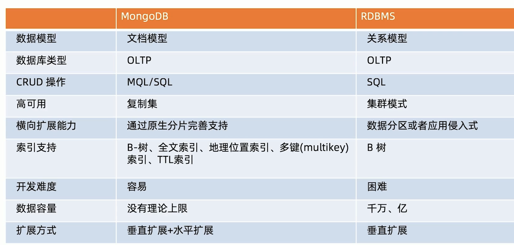

# 1. 概念

## 与传统数据库对比

* 连接按照：datebase -> collection -> id 顺序来操作

| SQL术语/概念 | MongoDB术语/概念 | 解释/说明                           |
| :----------- | :--------------- | :---------------------------------- |
| database     | database         | 数据库                              |
| table        | collection       | 数据库表/集合                       |
| row          | document         | 数据记录行/文档                     |
| column       | field            | 数据字段/域                         |
| index        | index            | 索引                                |
| table joins  |                  | 表连接,MongoDB不支持                |
| primary key  | primary key      | 主键,MongoDB自动将_id字段设置为主键 |

### 特点

* 不需要事先创建好数据库和集合，然后插入数据
* 不需要预先定义好集合中字段的类型和长度
* 同一个集合中的数据也不需要有相同的结构等等

更加灵活，可以让开发者更加专注于业务逻辑的实现，而不需哟关注数据库的细节，可以大大提高开发的效率。

## 快速查询聚合方法

* 英文：https://docs.mongodb.com/manual/reference/operator/aggregation/sort/#-sort-operator-and-memory
* 中文：https://docs.mongoing.com/can-kao/yun-suan-fu/aggregation-pipeline-stages
  * 建议中英对照
* 操作索引（中文）：https://mongodb.net.cn/manual/meta/aggregation-quick-reference/
* 参考，看例子（中文）：https://mongodb.net.cn/manual/reference/operator/aggregation-pipeline/
* 这个翻译的不错：https://www.docs4dev.com/docs/zh/mongodb/v3.6/reference/reference-operator-aggregation-match.html
* 这个实例也不错：https://blog.csdn.net/qq_18948359/article/details/88777066

## MongoDB aggregate 

* 参考： https://juejin.cn/post/6938220123454963719#heading-5

### pipeline

* pipeline 分为 stage 和 operation

#### 1. stage

https://docs.mongodb.com/manual/reference/operator/aggregation-pipeline/

#### 2. operation

https://docs.mongodb.com/manual/reference/operator/aggregation/

#### exist——字段是否存在

https://docs.mongodb.com/manual/reference/operator/query/exists/#examples

#### match 功能

可能用到：

get 某个字段：https://docs.mongodb.com/manual/reference/operator/aggregation/getField/#examples

## 一些快捷==查询==操作符

* 参考：https://docs.mongodb.com/manual/reference/operator/query/

### 逻辑查询

* https://docs.mongodb.com/manual/reference/operator/query-logical/

### 比较查询

* 相等 不相等啥的

* https://docs.mongodb.com/manual/reference/operator/query-comparison/

#### 常用

* *$replaceRoot*  *$unwind* *$addFields*

## 更新操作

* https://docs.mongodb.com/manual/reference/operator/update/

### api

#### **db.collection.updateOne()**

* 参考：https://docs.mongoing.com/can-kao/mongo-shell-methods/collection-methods/db-collection-updateone#shi-yong-upsert-geng-xin

  

# 2. 系统学习

## know

* 什么是 MongoDB：一个以 JSON 为==数据模型==的文档数据库（数据模型可能作为后期数据库选择的一个条件）

* 什么是文档数据库：文档来自于 “JSON Document”，并非我们一般理解的 PDF，word文档。（object的概念，而不是文件）

* 谁开发 MongoDB，上市公司 MongoDB inc，总部位于纽约

* 主要用途：应用数据库，类似于 Oracle，MySQL 海量数据处理，数据平台

  主要用途是不是和应用的数据模型相关？

* 主要特点：

  * 建模为可选。不同于传统的数据库，需要首先建立数据模型，MongoDB 可以直接将你程序的信息直接保存到数据库。
  * JSON 数据模型比较适合开发者，适合于面向对象的开发者
  * 横向扩展可以支持很大数据量和并发。4.0之后支持事务。

* 免费吗？社区版和企业版

## 发展历史

## 与传统数据库对比

* 高可用：复制集的特点（三个节点？），传统：使用第三方软件进行集群的搭建

## 数据结构

## 文档型数据库

* 文档是一个非常重要的概念，类似于 MySQL 中的 row

参考：https://www.bilibili.com/video/BV16u4y1y7Fm/?spm_id_from=333.788.recommend_more_video.3&vd_source=2fabd0267018a76cc44ae9345564dfb9

### BSON

* 准确来说：document 采用 binary json 来存储数据，是一种二进制的json格式，比普通的 json 可以更高效的存储和传输数据。

## 操作

* 不需要事先创建集合和字段类型，直接插入 json 即可。