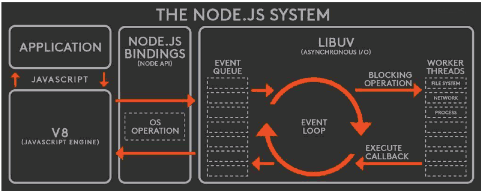
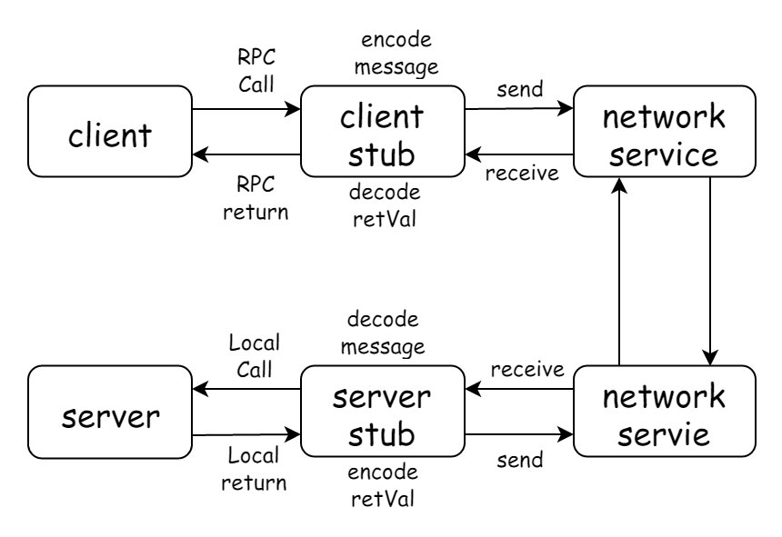
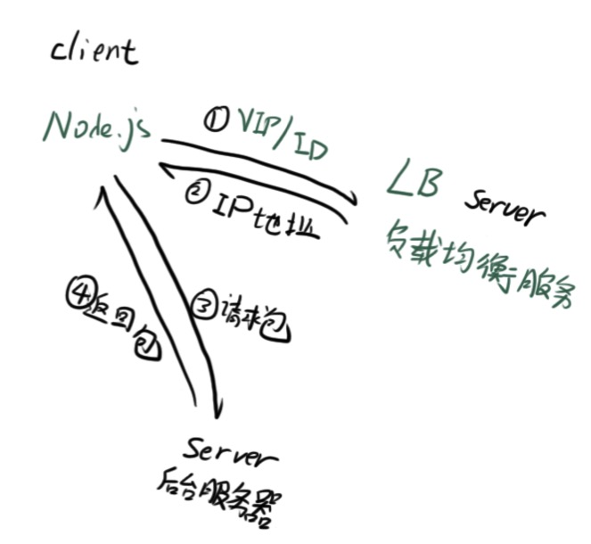

# 1. 目标

* 做一个 BFF 层（backend for frontend），组装后端数据给前端做服务
* 目标
  * 对用户侧提供 HTTP 服务
  * 使用后端 RPC 服务

# 2. 起飞

## 2.1 node 专有

* 失去了 requestAnimationFrame()，新增 setImmediate

* 环境变量

  __filename

  __dirname

* 进程对象

  process，记载了运行node进程信息，包含 性能分析，时间，内存管理，杀进程

  .env 当前所运行node的环境变量，argv 启动node 程序使用的命令行

## 2.2 一些思考

* 在前端工程化项目中，使用 `env.NODE_ENV`的方式，相当于给 process 的 env 对象中添加了一个属性。process.argv 则能打印出在运行该程序时的参数，例如 `node index.js test`


# 3. 复习一下规范

## 3.1 初代

* 浏览器使用 `script`标签去加载js，没有直接执行。

问题：

1. 脚本变多时，需要手动管理加载顺序
2. 不通的脚本之间逻辑调用，需要通过全局变量的方式。jQuery 就是挂载到全局变量上的
3. 没有 html 怎么办？ Node 需要一个模块规范来管理

## 3.2 commonjs 规范

* 导出的 exports 能够在外边改变改引用的属性

# 4. 内置模块

## 4.1 events 模块

### events 模块中的 EventEmitter

* 观察者模式(前端)
  * addEventListener
  * removeEventListener（待补上）

## 4.2 querystring 模块

* 能够解析 http 请求中的query

```js
const querystring = require('querystring')

const query = querystring.parse('name=111')
```


# 5. 非阻塞 I/O

## node js 的非阻塞 IO

* I / O 即 input/output ，一个系统的输入输出
* 阻塞 I/O 和 非阻塞 I/O 的区别就在于系统接受输入再到输出期间，能不能再接受其他输入。说白了就是利用了异步回调。

理解非阻塞 I/O 的要点在于

* 确定一个进行 input/output 的系统
* 思考在I/O 过程中，能不能进行其他的I/O。
* 非阻塞 I/O 是通过回调函数来实现的，回调函数的实现方式成为一部编程

## 异步编程

callback

* 回调函数格式规范
  * Error-first callback
  * Node-style callback
  
* 第一个参数是 error，后面的参数才是结果

  回调栈 -> 浏览器 sources 中的 call stack 

  node 中为了避免不知道第一个参数的类型，约定第一个参数是 error，第一个参数不为空，就代表调用失败

### 异步流程控制

1. 回调地狱
2. 异步并发

## node系统




## 事件循环

* 是实现非阻塞 I/O 的基础。libuv c++ 库

1. 面试问题，抛出的异常不能捕获
2. 手动实现事件循环

# Http 库

## express

* 特点，强大的路由能力
* 中间件 洋葱模型

### feature

- Robust routing

  强壮的路由系统

- Focus on high performance

  专注高性能，功能稍弱

- Super-high test coverage

  

- HTTP helpers (redirection, caching, etc)

- View system supporting 14+ template engines

- Content negotiation

  negotiation 协商

- Executable for generating applications quickly

### 核心功能

* 路由

* request/response 简化

  request：pathname、query

  response：send()、json()、jsonp() 等

### response methods

| Method                                                       | Description                                                  |
| ------------------------------------------------------------ | ------------------------------------------------------------ |
| [res.download()](http://expressjs.com/en/4x/api.html#res.download) | Prompt a file to be downloaded.                              |
| [res.end()](http://expressjs.com/en/4x/api.html#res.end)     | End the response process.                                    |
| [res.json()](http://expressjs.com/en/4x/api.html#res.json)   | Send a JSON response.                                        |
| [res.jsonp()](http://expressjs.com/en/4x/api.html#res.jsonp) | Send a JSON response with JSONP support.                     |
| [res.redirect()](http://expressjs.com/en/4x/api.html#res.redirect) | Redirect a request.                                          |
| [res.render()](http://expressjs.com/en/4x/api.html#res.render) | Render a view template.                                      |
| [res.send()](http://expressjs.com/en/4x/api.html#res.send)   | Send a response of various types.                            |
| [res.sendFile()](http://expressjs.com/en/4x/api.html#res.sendFile) | Send a file as an octet stream.                              |
| [res.sendStatus()](http://expressjs.com/en/4x/api.html#res.sendStatus) | Set the response status code and send its string representation as the response body. |

## koa

* 及简设计模式，不带路由功能，由中间件自己提供
  * koa-mount 提供了路由功能
* 中间件执行可以是异步，能够中断执行
* 简单粗暴的直接赋值，而不是调用函数赋值


# RPC 调用

• Remote Procedure Call(远程过程调用)

* 和 Ajax 有什么相同点?

  * 都是两个计算机之间的网络通信 

  * 需要双方约定一个数据格式

*  和 Ajax 有什么不同点?
  * 不一定使用 DNS 作为寻址服务 
  * 应用层协议一般不使用 HTTP
  * 基于TCP或UDP协议

## 理解 RPC

RPC（Remote Procedure Call）中文名『远程过程调用』，又是一个很蹩脚的翻译。我们拆开理解下，==『过程』也叫方法或函数==，==『远程』就是说方法不在当前进程里，而是在其他进程或机器上面==，合起来 RPC 就是==调用其他进程或机器上面的函数==。

> 在没有网络的时代，程序都是单机版的，所有逻辑都必须在同一个进程里。进程之间就像高楼大厦里面陌生的邻居，大家无法共享，遇到同样的功能只能重复实现一次。显然进程的障碍是逆天的，不符合先进生产力的发展方向，这个时候『进程间通信』的需求出现了，大家要求进程之间能够相互交流，相互共享和调用。这样再写程序，就可以利用进程间通信机制来调用和共享已经存在的功能了。随着网络的出现，进程的隔阂进一步消除，不光同一栋楼里的邻居可以共享资源，其他小区、甚至其他城市的居民都可以通过互联网互相调用，这就是 RPC。概念很容易理解，==但是远程和本地的实现原理有很大区别，架构设计者的职责就是设计一个机制让远程调用服务就像调本地服务一样简单，这就是 RPC 框架。==


## 为什么需要 RPC

* 服务端拆分，异构语言，约定一个通用的调用方式解决该问题。语言隔阂
* 进程隔阂。有的功能已经被其他服务实现了，能不能直接复用呢。


## 基本原理

RPC 首要解决的是通讯的问题，==主流的 RPC 框架分为基于 HTTP 和基于 TCP 的两种==。基于 HTTP 的 RPC 调用很简单，就和我们访问网页一样，只是它的返回结果更单一（JSON 或 XML）。它的优点在于实现简单，标准化和跨语言（基本所有语言都有http相关库），比较适合对外提供 OpenAPI 的场景，而它的缺点是 HTTP 协议传输效率较低、短连接开销较大（HTTP 2.0 后有很大改进）。而基于 TCP 的 RPC 调用，由于 TCP 协议处于协议栈的下层，能够更加灵活地对协议字段进行定制，减少网络开销，提高性能，实现更大的吞吐量和并发数。但是需要更多地关注底层复杂的细节（需要语言提供 socket 编程），跨语言和跨平台难度大，实现的代价更高，它比较适合==内部系统之间追求极致性能的场景。（内部系统，因为需要定制协议，做不到通用）==

* 目前大厂使用的都是基于 TCP 实现的 RPC 方案，高速服务框架*HSF*（High-speed Service Framework）。

### RPC 基本调用过程



1. 调用方（Client）通过本地的 RPC 代理（Proxy）调用相应的接口
2. 本地代理将 RPC 的服务名，方法名和参数等等信息转换成一个标准的 RPC Request 对象交给 RPC 框架
3. RPC 框架采用 RPC 协议（RPC Protocol）将 RPC Request 对象序列化成二进制形式，然后通过 TCP 通道传递给服务提供方 （Server）
4. 服务端（Server）收到二进制数据后，将它反序列化成 RPC Request 对象
5. 服务端（Server）根据 RPC Request 中的信息找到本地对应的方法(可以按照文件目录的方式直接找到该方法)，传入参数执行，得到结果，并将结果封装成 RPC Response 交给 RPC 框架
6. RPC 框架通过 RPC 协议（RPC Protocol）将 RPC Response 对象序列化成二进制形式，然后通过 TCP 通道传递给服务调用方（Client）
7. 调用方（Client）收到二进制数据后，将它反序列化成 RPC Response 对象，并且将结果通过本地代理（Proxy）返回给业务代码（这一块的实现还不是很清楚???）

### 通讯层的设计

因为==在 TCP 通道（就是socket）里传输的数据只能是二进制形式的==，所以我们必须将数据结构或对象转换成二进制串传递给对方，这个过程就叫『序列化』。而相反，我们收到对方的二进制串后把它转换成数据结构或对象的过程叫『反序列化』。而序列化和反序列化的规则就叫『协议』。


## RPC 请求过程

### 寻址/负载均衡

* RPC：使用特有服务进行寻址



* al 使用 vip 方式去寻址 -> 寻址服务器

### 通信方式

* tcp 通信方式：

  * 单工通信
    * 只能一方往另一方发包，如果需要反过来，需要重新建立 tcp 链接

  * 半双工通信
    * 同一时间内只能一端向另一端发送数据
    * 轮番单工通信
  * 全双工通信
    * 交叉的方式进行通信

* 区别：实现难度和成本

### 使用协议

* 二进制协议
  * 更小的数据包体积
  * 更快的编解码速率

### 总结

* 寻址 + 负载均衡 有运维去消化
* 多路复用 + 二进制协议 bff 需要理解和实现


## node buffer

* 参考：http://nodejs.cn/api/buffer.html#bufferfrom-bufferalloc-and-bufferallocunsafe

### Buffer.from 和 Buffer.alloc()——创建buffer

一版就用这两种情况创建新的 buffer 实例

* `Buffer.from`：从现有的一个字符串或者数组创建出一个 buffer 实例

```js
const buffer1 = Buffer.from('test')
// 产生 4 位 buffer 每一位代表一个字符
const buffer2 = Buffer.from([1,2,3])
// 产生三个 buffer 每一位是数组的一个元素
```

* Buffer.alloc(): 按规定长度创建出一个 buffer 实例

  ```js
  const buffer3 = Buffer.alloc(20)
  // 长度位 20 的一个为空的 buffer （每一位都是 00）
  ```


### 读取 buffer

* 主要是 read**BE & read\*\*LE，BE 和 LE 区别就是大小。大段和小段。

  使用这些 方法能够对 buffer 对象进行读写操作。

* Todo ： utf-8 ?

```js
const buffer1 = Buffer.from([1,2,3,4])

// buffer1.writeInt16BE(256, 1)
buffer1.writeInt16LE(256, 1) // 16 进制需要占两位

console.log(buffer1)
```

```js
buf.writeInt8(value[, offset])
buf.writeInt16BE(value[, offset])
// 这些方法的区别就是添加的 value 的大小是有限制的
```


### Protocol Buffer

* 使用 Protocol Buffer 工具能够快速的对二进制协议进行编解码。node 环境
* 参考：https://github.com/mafintosh/protocol-buffers


### toString 方法

* 能够解码，默认 `utf-8`

  如果超出了 unicode 码的范围，则解析不出任何数据

* http://nodejs.cn/api/buffer.html#buftostringencoding-start-end


总结：

* toString 和 readInt** 等方法能够 decode buffer，但是 toString 有局限性。


## node net

### Node.js net 搭建多路复用的 RPC 通道

### node net 模块

* http://nodejs.cn/api/net.html

```js
const net = require('net');
const server = net.createServer((socket) => {
 	// socket 网络通道代理对象，能够读写
  socket.on('data', (buffer) => {
    
  })
});
server.on('error', (err) => {
  throw err;
});
server.listen(8124, () => {
  console.log('server bound');
});
```

* Socket 相当于通道，能够读取和写入数据
* socket 传递的数据都是 buffer，需要使用 buffer 的方法进行处理
* 双方（客户端和服务端）都是通过 socket.write 的方式去往通道中写数据；通过监听 data 事件的方式从管道中拿数据。


### 全双工通信实现

* 全双工通信需要在半双工通信的基础上，把数据包 的 id 带上（包序号）
* 数据的头部携带 id

#### 两个 api

* Buffer.slice 
* Buffer.concat
  * 都是 Buffer 直接调用，和数组的区别

### 粘包问题

* tcp 优化 粘包问题（准确的说 TCP不存在粘包问题，只是认为的给数据流分了包）


# koa 洋葱模型实现

* 一个 middleware 队列保存 use 的中间件

* 执行顺序的实现（洋葱模型）

  核心逻辑：

  ```js
  function fn(ctx) {
      return dispatch(0)
      function dispatch(i) {
          const mw = middleware[i]
          if (!mw) {
              return
          }
          return mw(ctx, dispatch.bind(null, i + 1))
      }
  }
  
  fn()
  ```

  https://zhuanlan.zhihu.com/p/279391637

  * 思路：
    1. 中间件队列中所有的 mw 都会得到执行
    2. 执行的时候注意 next 加入异步队列


# 数组 reduce 

* 如果没有初始值，则会从第一项 第二项开始执行


