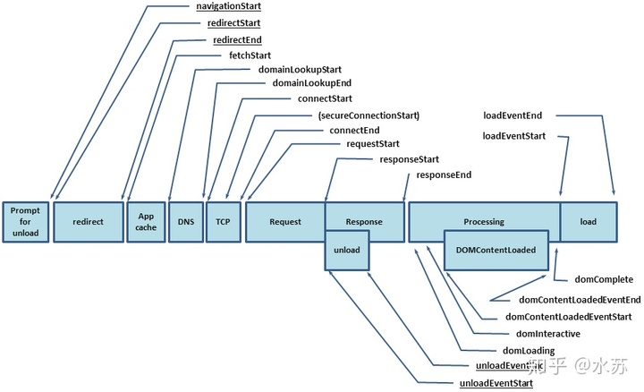

# window.requestAnimationFrame(性能优化)

**`window.requestAnimationFrame()`** 告诉浏览器——你希望执行一个动画，并且要求浏览器在下次重绘之前调用指定的回调函数更新动画。该方法需要传入一个回调函数作为参数，该回调函数会在浏览器下一次重绘之前执行。

* 搭配 window.cancelAnimationFrame 取消


# 前端路由 hash 模式 & history 模式

* 修改 hash 并且回车，并不会请求后端，只会用于页面定位。会被 window.hashchange 事件监控到。，HashHistory就是利用页面定位实现的不刷新跳转（传统的a标签默认get请求，target为当前tab），本质就是一个浏览器内置的发布订阅（只是能在url上用hash体现出来），改变hash会广播hashchange事件。

  你在JSX里使用Link组件，它本质是继承了原生a标签（接口继承），在onClick handler中将超链接默认事件阻止，避免了页面重定向。

* history 模式，利用 html 5 提供的 history 的 pushState 方法进行路由跳转的，不会刷新浏览器。前进后退能够监听 window.onpopstate ，来实现分发；其他情况的点击，类似于a标签，阻止默认事件后，调用内部的发布订阅系统，进行数据分发。


# readyState 

https://developer.mozilla.org/zh-CN/docs/Web/API/Document/readyState

* 能够使用 ==onreadystateChange== 模拟 DOMContentLoaded(该事件也是针对于 document)
* 描述了 ==document== 的加载状态，不是其他的状态，后期进行回流和重绘都不会影响。

## 状态

一个文档的 `**readyState**` 可以是以下之一：

- `loading`（正在加载）

  [`document`](https://developer.mozilla.org/zh-CN/docs/Web/API/Document) 仍在加载。

- `interactive`（可交互）

  文档已被解析，"**正在加载**"状态结束，但是诸如图像，样式表和框架之类的子资源仍在加载。

- `complete`（完成）

  文档和所有子资源已完成加载。表示 `load (en-US)` 状态的事件即将被触发。


# 安全

* xss（跨站脚本攻击）Cross-Site Scripting

  https://juejin.cn/post/6844903685122703367

  方案：输入过滤

* csrf

  CSRF（Cross-site request forgery）跨站请求伪造

  https://juejin.cn/post/6844903689702866952

  * 方案：

    同源检测

  
  
  

# 性能 api

## performance

* api 时序图



* 详情可参考：https://juejin.cn/post/6916527678807867400


## PerformanceObserver

* 能够做性能监控

  https://developer.mozilla.org/zh-CN/docs/Web/API/PerformanceObserver/PerformanceObserver


# AbortController

* prototype.signal

  该值可以传递给 fetch ，作为请求取消的标记

* prototype.abort

  调用该方法，能够将该实例 signal 标记的 fetch 请求取消掉。

  ==同样也可以取消监听器——addEventListenser==


# 事件

## addEventListener

注册一个事件。

* 第二个参数，一般情况下是一个函数，也可以是一个 EventListener 对象

  ```js
  {
    handleEvent: function (event) {
      alert('Element clicked through handleEvent property!');
    }
  }
  ```

  

* 第三个参数 option

  options 可选

  一个指定有关 `listener `属性的可选参数**对象**。可用的选项如下：

  - `capture`:  [`Boolean`](https://developer.mozilla.org/zh-CN/docs/Web/JavaScript/Reference/Global_Objects/Boolean)，表示 `listener` 会在该类型的事件捕获阶段传播到该 `EventTarget` 时触发。
  - `once`:  [`Boolean`](https://developer.mozilla.org/zh-CN/docs/Web/JavaScript/Reference/Global_Objects/Boolean)，表示 `listener 在添加之后最多只调用一次。如果是` `true，` `listener` 会在其被调用之后自动移除。
  - `passive`: [`Boolean`](https://developer.mozilla.org/zh-CN/docs/Web/JavaScript/Reference/Global_Objects/Boolean)，设置为true时，表示 `listener` 永远不会调用 `preventDefault()`。如果 listener 仍然调用了这个函数，客户端将会忽略它并抛出一个控制台警告。查看 [使用 passive 改善的滚屏性能](https://developer.mozilla.org/zh-CN/docs/Web/API/EventTarget/addEventListener#使用_passive_改善的滚屏性能) 了解更多.
  - `signal`：[`AbortSignal`](https://developer.mozilla.org/zh-CN/docs/Web/API/AbortSignal)，该 `AbortSignal` 的 [`abort()`](https://developer.mozilla.org/zh-CN/docs/Web/API/AbortController/abort) 方法被调用时，监听器会被移除。

  

### 1. 优点

`addEventListener()` 是 W3C DOM 规范中提供的注册事件监听器的方法。它的优点包括：

- 它允许给一个事件==注册多个监听器==。 特别是在使用[AJAX](https://developer.mozilla.org/zh-CN/docs/Glossary/AJAX)库，JavaScript模块，或其他需要第三方库/插件的代码。

  ==如果每次都是注册的同一个函数，则只会执行一次！这样能够节省内存==

- 它提供了一种更精细的手段控制 `listener` 的触发阶段。（==即可以选择捕获或者冒泡==）

  * capture: 能够按捕获的方式触发

  * signal 能够取消

  * once  触发一次

  * passive：[`Boolean`](https://developer.mozilla.org/zh-CN/docs/Web/JavaScript/Reference/Global_Objects/Boolean) `listener` 永远不会调用 `preventDefault()`。如果 listener 仍然调用了这个函数，客户端将会忽略它并抛出一个控制台警告。查看 [使用 passive 改善的滚屏性能](https://developer.mozilla.org/zh-CN/docs/Web/API/EventTarget/addEventListener#使用_passive_改善的滚屏性能) 了解更多.

    滚动的时候可以把这个设置为 true 

- 它对任何 DOM 元素都是有效的，而不仅仅只对 HTML 元素有效。


### 2. 缺点

* 内存问题，需要手动移除。


### 在事件分派时添加事件处理器

当一个 `EventListener `在 `EventTarget `正在处理事件的时候被注册到 `EventTarget `上，它不会被立即触发，但可能在事件流后面的事件触发阶段被触发，例如可能在捕获阶段添加，然后在冒泡阶段被触发。

* 如果在处理事件的时候添加，如果是捕获阶段，会在 冒泡阶段执行

  ==如果是冒泡阶段，会在下一次事件触发的时候触发，因为当前只是添加了一个宏任务==

  宏任务和微任务的分界：微任务一定会在宏任务的周期内执行完成。

## dom2 中的旧方法

`addEventListener()` 在DOM 2 [Events](https://www.w3.org/TR/DOM-Level-2-Events) 规范中引入。在这之前，事件监听器应该用以下的方法注册：

```js
// Pass a function reference — do not add '()' after it, which would call the function!
el.onclick = modifyText;

// Using a function expression
element.onclick = function() {
    // ... function logic ...
};
```

* 会把整个事件替换掉。


### [使用 passive 改善的滚屏性能](https://developer.mozilla.org/zh-CN/docs/Web/API/EventTarget/addEventListener#使用_passive_改善的滚屏性能)

根据规范，`passive` 选项的默认值始终为false。但是，这引入了处理某些触摸事件（以及其他）的事件监听器在尝试处理滚动时阻止浏览器的主线程的可能性，从而导致滚动处理期间性能可能大大降低。

为防止出现此问题，某些浏览器（特别是Chrome和Firefox）已将文档级节点 [`Window`](https://developer.mozilla.org/zh-CN/docs/Web/API/Window)，[`Document`](https://developer.mozilla.org/zh-CN/docs/Web/API/Document)和[`Document.body`](https://developer.mozilla.org/zh-CN/docs/Web/API/Document/body)的`touchstart (en-US)`和`touchmove (en-US)`事件的`passive`选项的默认值更改为true。这可以防止调用事件监听器，因此在用户滚动时无法阻止页面呈现。


## 事件流

### 事件[冒泡及捕获](https://developer.mozilla.org/zh-CN/docs/Learn/JavaScript/Building_blocks/Events#事件冒泡及捕获)

事件==冒泡和捕捉是两种机制==，主要描述当在一个元素上有两个相同类型的事件处理器被激活会发生什么。

* 说白了就是两种不同的机制。

当一个事件发生在具有父元素的元素上(例如，在我们的例子中是`<video>`元素)时，现代浏览器运行两个不同的阶段 - 捕获阶段和冒泡阶段。 在捕获阶段：

- 浏览器检查元素的最外层祖先`<html>`，是否在捕获阶段中注册了一个`onclick`事件处理程序，如果是，则运行它。
- 然后，它移动到`<html>`中单击元素的下一个祖先元素，并执行相同的操作，然后是单击元素再下一个祖先元素，依此类推，==直到到达实际点击的元素。==

在冒泡阶段，恰恰相反:

- 浏览器检查实际点击的元素是否在冒泡阶段中注册了一个`onclick`事件处理程序，如果是，则运行它
- 然后它移动到下一个直接的祖先元素，并做同样的事情，然后是下一个，等等，==直到它到达`<html>`元素。==


==在现代浏览器中，默认情况下，所有事件处理程序都在冒泡阶段进行注册。==


## 事件对象

* event

  注意的属性：

1. target: 永远等于当前你触发的元素，最小元素。不管当前触发的元素是否添加了事件。

   可以使用 target.parentNode 向上查找父链上的元素。

2. currentTarget: 永远等于当前事件绑定的元素，等于 this

3. path: 事件触发路径，就是冒泡路径。是一个数组，能够查找到所有链表上的元素。


# intersectionObserver

* 可以观察很多对象

* 可以用来做图片懒加载

  ```js
  // 使用 intersectionObserver 实现
  const observe = new IntersectionObserver(items => {
      items.forEach(item => {
          if (item.intersectionRatio > 0) {
              console.log(item)
              item.target.src = item.target.dataset.src
          }
      })
  })
  
  document.querySelectorAll('img').forEach(item => {
      observe.observe(item)
  })
  ```

  

# mutationObserver

* 首屏加载时长？
* https://www.jianshu.com/p/bf9353cfbbc6
* 使用 mutationObserver + getBoundingClientRect 来计算

## 问题

* 每个业务首屏加载的定义不一样，因此每个公司定义的首屏可能不太一样，需要问清楚
  * 新闻网站一般看文字
  * 电商网站一般看图片

## 首屏加载时长

* 普通的元素根据 MutationObserver 的配置就能获取到

  ```js
  {
    childList: true, // 观察目标子节点的变化，添加或者删除
    subtree: true // 默认为 false，设置为 true 可以观察后代节点
  }
  ```

* 


# 浏览器各部分耗时监控

```js
/*
{
  0: {key: "Redirect", desc: "网页重定向的耗时", value: 0}
  1: {key: "AppCache", desc: "检查本地缓存的耗时", value: 0}
  2: {key: "DNS", desc: "DNS查询的耗时", value: 0}
  3: {key: "TCP", desc: "TCP连接的耗时", value: 0}
  4: {key: "Waiting(TTFB)", desc: "从客户端发起请求到接收到响应的时间 / Time To First Byte", value: 132.11499998578802}
  5: {key: "Content Download", desc: "下载服务端返回数据的时间", value: 17.014999990351498}
  6: {key: "HTTP Total Time", desc: "http请求总耗时", value: 149.12999997613952}
  7: {key: "DOMContentLoaded", desc: "dom加载完成的时间", value: 2252.680000034161}
  8: {key: "Loaded", desc: "页面load的总耗时", value: 4014.0450000180863}
}
*/
```


# script 标签——浏览器渲染原理

## async 和 defer

* async

  对于普通脚本，如果存在 `async` 属性，那么普通脚本会被==并行请求==，==并尽快解析和执行。==

  该属性能够消除解析阻塞的 Javascript。解析阻塞的 Javascript 会导致浏览器必须加载并且执行脚本，之后才能继续解析。`defer` 在这一点上也有类似的作用。


* defer

  这个布尔属性被设定用来通知浏览器该脚本将在文档完成解析后，触发 `DOMContentLoaded (en-US)` 事件前执行。


# HTML 5 ==Canvas== vs. ==SVG==

* https://www.w3school.com.cn/html/html5_canvas_vs_svg.asp

**Canvas 和 SVG 都允许您在浏览器中创建图形，但是它们在根本上是不同的。**

## SVG

* XML 描述 2D 图像的语言

* 基于 XML，因此这意味着 SVG DOM 中的每个元素都是可用的，可以给其添加事件等。

* 一个图形被视为一个对象，通过修改其属性重现图形。

  > 在 SVG 中，每个被绘制的图形均被视为对象。如果 SVG 对象的属性发生变化，那么浏览器能够自动重现图形。

* 矢量图：不跟随分辨率变化

## canvas

* Canvas 通过 JavaScript 来绘制 2D 图形。

* Canvas 是逐像素进行渲染的。（和像素强相关）

* 一旦绘制浏览器就不可继续进行操作

  > 在 canvas 中，一旦图形被绘制完成，它就不会继续得到浏览器的关注。如果其位置发生变化，那么整个场景也需要重新绘制，包括任何或许已被图形覆盖的对象。

## 对比

* 原理不同

### Canvas

- 依赖分辨率
- 不支持事件处理器
- 弱的文本渲染能力
- 能够以 .png 或 .jpg 格式保存结果图像
- 最适合图像密集型的游戏，其中的许多对象会被频繁重绘。（适合游戏，重新绘制开销小）

### SVG

- 不依赖分辨率
- 支持事件处理器
- 最适合带有大型渲染区域的应用程序（比如谷歌地图）
- 复杂度高会减慢渲染速度（任何过度使用 DOM 的应用都不快，重新渲染开销大）
- 不适合游戏应用


# html5

## drag 相关

1. 拖动元素设置 draggable

2. 拖动元素设置 ondragstart，通过 event 对象的 dataTransfer 的 setData 设置要传递的对象，第一个参数对象名称，第二个参数对象的id

3. 容器元素设置 ondragover，设置 event.preventDefault()，阻止默认处理行为，让其可接受拖动元素

   > ondragover 事件规定在何处放置被拖动的数据。
   >
   > 默认地，无法将数据/元素放置到其他元素中。如果需要设置允许放置，我们必须阻止对元素的默认处理方式。

4. 容器元素接收拖动的元素，进行放置。设置容器元素的 ondrop 事件。

   当放置被拖数据时，会发生 drop 事件。

   ```js
   function drop(ev)
   {
       ev.preventDefault(); // 避免浏览器对数据的默认处理（drop 事件的默认行为是以链接形式打开）
       var data=ev.dataTransfer.getData("Text"); // 通过 dataTransfer.getData("Text") 方法获得被拖的数据。该方法将返回在 setData() 方法中设置为相同类型的任何数据。
       ev.target.appendChild(document.getElementById(data)); // 根据id 获取该元素，然后append到容器元素中。
   }
   ```

总结：

* dataTransfer 就是传递数据的桥梁
* ==主要分成两部分去思考：1. 一个可拖动的元素；2.一个可接受拖动的区域==


## html 规范

* https://whatwg-cn.github.io/html/


## input

* 牛死了，既然能有默认的时间控件
* 参考：https://developer.mozilla.org/zh-CN/docs/Web/HTML/Element/Input


# ==webApi==

## Blob

参考：https://developer.mozilla.org/zh-CN/docs/Web/API/Blob

### 1. 简介

`Blob` 对象表示一个==不可变、原始数据==的类文件对象。它的数据可以按文本或二进制的格式进行读取，也可以转换成 [`ReadableStream`](https://developer.mozilla.org/zh-CN/docs/Web/API/ReadableStream)

来用于数据操作。

Blob 表示的不一定是JavaScript原生格式的数据。[`File`](https://developer.mozilla.org/zh-CN/docs/Web/API/File)基于`Blob`，继承了 blob 的功能并将其扩展使其支持用户系统上的文件。

要从其他非blob对象和数据构造一个 `Blob`，请使用 [`Blob()`](https://developer.mozilla.org/zh-CN/docs/Web/API/Blob/Blob)要创建一个 blob 数据的子集 blob，请使用 [`slice()`](https://developer.mozilla.org/zh-CN/docs/Web/API/Blob/slice)户文件系统上的文件对应的 `Blob` 对象，请参阅 [`File`](https://developer.mozilla.org/zh-CN/docs/Web/API/File)档。

* 如上所述，给文件切片提供了一个方案：使用 slice 对文件进行切割。

### 2. blob 对象的创建

1. 通过`new Blob()` 的方式

   https://developer.mozilla.org/zh-CN/docs/Web/API/Blob/Blob

2. 通过 input:file 来处理

#### 实例：[使用 Blob 创建一个指向类型化数组的URL](https://developer.mozilla.org/zh-CN/docs/Web/API/Blob#示例：使用_blob_创建一个指向类型化数组的url)

```js
var typedArray = GetTheTypedArraySomehow();
var blob = new Blob([typedArray.buffer], {type: 'application/octet-stream'}); // 传入一个合适的 MIME 类型
var url = URL.createObjectURL(blob);
// 会产生一个类似 blob:d3958f5c-0777-0845-9dcf-2cb28783acaf 这样的URL字符串
// 你可以像使用普通 URL 那样使用它，比如用在 img.src 上。
```

* 这样就可以通过 url 的方式，新开页面获取通过 img.src 的方式访问这个对象

  例如：`blob:https://developer.mozilla.org/07d9f423-508e-4aca-972c-8fddce4d2bf3`

### slice 方法

* blob.slice() 方法能够按字节长度对文件进行切割


### API

[`Blob.slice([start[, end[, contentType\]]])`](https://developer.mozilla.org/zh-CN/docs/Web/API/Blob/slice)

返回一个新的 `Blob` 对象，包含了源 `Blob` 对象中指定范围内的数据。

[`Blob.stream()`](https://developer.mozilla.org/zh-CN/docs/Web/API/Blob/stream)

返回一个能读取blob内容的 [`ReadableStream`](https://developer.mozilla.org/zh-CN/docs/Web/API/ReadableStream)。

[`Blob.text()`](https://developer.mozilla.org/zh-CN/docs/Web/API/Blob/text)

返回一个promise且包含blob所有内容的UTF-8格式的 [`USVString`](https://developer.mozilla.org/zh-CN/docs/Web/API/USVString)。

[`Blob.arrayBuffer()`](https://developer.mozilla.org/zh-CN/docs/Web/API/Blob/arrayBuffer)

返回一个promise且包含blob所有内容的二进制格式的 [`ArrayBuffer`](https://developer.mozilla.org/zh-CN/docs/Web/JavaScript/Reference/Global_Objects/ArrayBuffer) 


## File

* File 对象一般使用 input DOM 对象去获取
* ==文件数据的读取==。具体的应用，详见下边拖放上传 略缩图的处理
  1. 使用 file 对象本身提供的 text、*arrayBuffer*、stream 等方法，有的方法是异步的（注意）
  2. 使用 FileReader 接口去读取，具体读取数据使用 asArrayBuffer 等方式。使用方式类似于image 对象的创建。
  3. 使用 URL.createObjectURL() 创建一个多媒体引用

### 属性

```
name
```

文件名称，只读字符串。只包含文件名，不包含任何路径信息。input 上传的文件拿不到任何路径信息。

```
size
```

以字节数为单位的文件大小，只读的64位整数。

```
type
```

文件的 MIME 类型，只读字符串，当类型不能确定时为 `""`。


### 发送一个 file 类型数据

* 发送一个 file 类型数据，需要使用 formData 的格式

```js
const form = new FormData()
form.append('myFile', file);

xhr.send(form)
```


## FileList

### 方法

#### [`item()`](https://developer.mozilla.org/zh-CN/docs/Web/API/FileList#item())

* 传入索引值，返回索引值对应的 File 对象

  直接使用数组的索引也能够获取。

* ```tex
  files 是一个 FileList 对象(类似于NodeList对象)
  ```


## 自定义上传组件

参考：https://developer.mozilla.org/zh-CN/docs/Web/API/File/Using_files_from_web_applications

### 1. 通过 click() 方法使用隐藏的 file input 元素

* 点击一个按钮，触发 input DOM 对象的 click 方法上传

### 2. [使用 label 元素来触发一个隐藏的 file input 元素](https://developer.mozilla.org/zh-CN/docs/Web/API/File/Using_files_from_web_applications#使用_label_元素来触发一个隐藏的_file_input_元素)

* 使用 label for + id 的方式，打开input:file 

```html
<input type="file" id="fileElem" multiple accept="image/*" class="visually-hidden">
<label for="fileElem">Select some files</label>

```

* 样式：模拟在其 label 上提供隐藏 input 字段的焦点状态的视觉提示，比如上面用的轮廓，或者背景颜色或边框阴影。

```css
.visually-hidden {
  position: absolute !important;
  height: 1px;
  width: 1px;
  overflow: hidden;
  clip: rect(1px, 1px, 1px, 1px);
}

/* Separate rule for compatibility, :focus-within is required on modern Firefox and Chrome */
input.visually-hidden:focus + label {
  outline: thin dotted;
}
input.visually-hidden:focus-within + label {
  outline: thin dotted;
}
```


### 3. 创建一个可拖放的区域来上传文件

* input 本身是支持拖放上传文件的，有时候需要自定义拖放区域

* 创建可拖放的区域，不仅能接受一个可拖动的元素，还能接受一些本地的文件等

  都是通过 dataTransfer 这个桥梁来接收数据的。

```js
const dropCont = document.querySelectorAll('.drop-box')[0]
dropCont.ondragover = e => {
    e.stopPropagation()
    e.preventDefault();
}

dropCont.ondragenter = e => {
    e.stopPropagation()
    e.preventDefault();
}

dropCont.ondrop = e => {
    e.stopPropagation()
    e.preventDefault();

    console.log(e.dataTransfer)
}
```


### 4. 上传文件之后显示一个略缩图

* 两种方式提前读取图片数据
  1. URL 对象
  2. FileReader 对象

```js
dropCont.ondrop = e => {
    e.stopPropagation()
    e.preventDefault();

    console.log(e.dataTransfer.files)
    const file = e.dataTransfer.files[0]

    const img = document.createElement('img')
    // 下边就是创建一个略缩图
    // 1. 使用 URL 对象
    const url = URL.createObjectURL(file)
    
    img.src = url
    img.width = '100'
    e.target.appendChild(img)

    // 2. 使用 FileReader
    const reader = new FileReader()
    reader.onload = e1 => {
        img.src = e1.target.result
        img.width = 200
        e.target.appendChild(img)
    }
    reader.readAsDataURL(file)

}
```

* 小技巧：
  * 可以使用 img.file = file 的方式给 img 对象添加一个file属性，这样就可以通过 img 对象拿到当前 img 对象图片的源文件对象。


### 5. 在浏览器中展示其他类型文件

* 其他的可以在浏览器中展示的文件，可以通过 iframe 设置 src 的方式进行展示。


## 上传一个问题

* 实现进度条


## Streams API

参考：https://developer.mozilla.org/zh-CN/docs/Web/API/Streams_API

流将你希望通过网络接收的资源拆分成小块，然后按位处理它。这正是浏览器在接收用于显示web页面的资源时做的事情——视频缓冲区和更多的内容可以逐渐播放，有时候随着内容的加载，你可以看到图像逐渐地显示。

* 接收到数据，然后按位处理这些数据。

但曾经这些对于JavaScript是不可用的。以前，如果我们想要处理某种资源（如视频、文本文件等），我们必须下载完整的文件，等待它反序列化成适当的格式，然后在完整地接收到所有的内容后再进行处理。

随着流在JavaScript中的使用，一切发生了改变——只要原始数据在客户端可用，你就可以使用JavaScript 按位处理它，而不再需要缓冲区、字符串或blob。


## URL

**`URL`**接口用于解析，构造，规范化和编码 [URLs](https://developer.mozilla.org/zh-CN/docs/Glossary/URL)。 

* 能够对 url 进行各种处理，包括其他类型转换为 url 类型（主要针对文件类型）

### URL.createObjectURL

* `createObjectURL()` 仅仅意味着将一个媒体元素的 `src` 属性关联到一个 [`MediaSource`](https://developer.mozilla.org/zh-CN/docs/Web/API/MediaSource)

  对象上去。

  调用`revokeObjectURL()` 使这个潜在的对象回到原来的地方，允许平台在合适的时机进行垃圾收集。

* 使用时机：

  ==当你需要在HTML中通过URL来引用一个[`File`](https://developer.mozilla.org/zh-CN/docs/Web/API/File)对象时，你可以创建一个对象URL==

* 这个方法能够将一个文件对象 File 或者一个 Blob 对象转换为一个 url，然后可以通过 src 的方式去进行访问。==包括img、video等元素==。常用的就是使用一个 video 或者 img 标签的src 去引用一个file 或者 blob 对象。

  ```js
  let url = URL.createObjectURL(file)
  ```

#### 返回值

* 返回一个 url 字符串

  这个 url 能够当做 src 被使用

### URL.[`revokeObjectURL()`](https://developer.mozilla.org/zh-CN/docs/Web/API/URL/revokeObjectURL)

* 销毁之前创建的 URL 实例


## FileReader

* `**FileReader**` 对象允许Web应用程序==异步读取存储在用户计算机上的文件==（或原始数据缓冲区）的内容，使用 [`File`](https://developer.mozilla.org/zh-CN/docs/Web/API/File)或者 [Bolb](https://developer.mozilla.org/zh-CN/docs/Web/API/Blob)指定要读取的文件或数据。

* 读取数据来源：
  1. 其中File对象可以是来自用户在一个 `input` 元素选择文件后返回的 FileList 对象
  
  2. 也可以使用 拖放 操作生成的 DataTransfer 对象
  
  3. 还可以是来自在一个[`HTMLCanvasElement`](https://developer.mozilla.org/zh-CN/docs/Web/API/HTMLCanvasElement)
  
     上执行`mozGetAsFile()`方法后返回结果。
  
* 为什么要读取：

  input 上传的文件并没有被真正的读取，只是一个 file 对象，如果要读取该文件，需要使用  FileReader 去操作。

### 使用方法

* 类似于img 对象的读取

```js
// 1. 构造一个实例
let reader = new FileReader()
// 2. 监听一个读取事件，然后在 callback 中 获取响应 result
// 该事件在读取操作完成时触发
reader.onload = e => {
  console.log(e.target.result) // 获取 reader.result
}
// 读取错误时触发
reader.onerror = e => {
  console.log(e.target.result) // 获取 reader.result
}
// 该事件在读取操作结束时（要么成功，要么失败）触发
reader.onloadend = e => {
  console.log(e.target.result) // 获取 reader.result
}

// 添加读取文件。file 获取  blob
reader.readAsArrayBuffer(file)

```

* 取消读取

  `reader.abort()`

[`FileReader.abort()`](https://developer.mozilla.org/zh-CN/docs/Web/API/FileReader/abort)

中止读取操作。在返回时，`readyState`属性为`DONE`。

[`FileReader.readAsArrayBuffer()`](https://developer.mozilla.org/zh-CN/docs/Web/API/FileReader/readAsArrayBuffer)

开始读取指定的 [`Blob`](https://developer.mozilla.org/zh-CN/docs/Web/API/Blob)中的内容, 一旦完成, result 属性中保存的将是被读取文件的 [`ArrayBuffer`](https://developer.mozilla.org/zh-CN/docs/Web/JavaScript/Reference/Global_Objects/ArrayBuffer) 数据对象.

[`FileReader.readAsBinaryString()`](https://developer.mozilla.org/zh-CN/docs/Web/API/FileReader/readAsBinaryString) 

开始读取指定的[`Blob`](https://developer.mozilla.org/zh-CN/docs/Web/API/Blob)容。一旦完成，`result`属性中将包含所读取文件的==原始二进制数据。==

[`FileReader.readAsDataURL()`](https://developer.mozilla.org/zh-CN/docs/Web/API/FileReader/readAsDataURL)

开始读取指定的[`Blob`](https://developer.mozilla.org/zh-CN/docs/Web/API/Blob)中的内容。一旦完成，`result`属性中将包含一个`data:` URL格式的Base64字符串以表示所读取文件的内容。

[`FileReader.readAsText()`](https://developer.mozilla.org/zh-CN/docs/Web/API/FileReader/readAsText)

开始读取指定的[`Blob`](https://developer.mozilla.org/zh-CN/docs/Web/API/Blob)中的内容。一旦完成，`result`属性中将包含一个字符串以表示所读取的文件内容。


## 在 web 应用程序中使用文件

* 一般情况下，只有两种方式
  1. 使用 input:file 的方式
  2. 使用 drag 拖动的方式选择本地文件


## MIME 类型

* 详见 http 基础


## FormData

* ```tex
  formData 只接受文件、Blob 或字符串，不能直接传递数组，所以必须循环嵌入
  ```

* 如果 formData 传递 file、Bolb


## HTMLMediaElement

* https://developer.mozilla.org/zh-CN/docs/Web/API/HTMLMediaElement

HTML媒体元素接口在属性和方法中添加了 [`HTML元素`](https://developer.mozilla.org/zh-CN/docs/Web/API/HTMLElement)媒体相关的能力，就像audio和video一样。[`HTML 视频元素`](https://developer.mozilla.org/zh-CN/docs/Web/API/HTMLVideoElement)ttps://developer.mozilla.org/zh-CN/docs/Web/API/HTMLAudioElement)元素都继承自此接口。


# DOM

## 自定义事件

https://developer.mozilla.org/zh-CN/docs/Web/API/Document/createEvent

```js
// 创建事件
var event = document.createEvent('Event');

// 定义事件名为'build'.
event.initEvent('build', true, true);

// 监听事件
elem.addEventListener('build', function (e) {
  // e.target matches elem
}, false);

// 触发对象可以是任何元素或其他事件目标
elem.dispatchEvent(event);
```

* 一版使用在 webview jsBridge 的挂载方面

