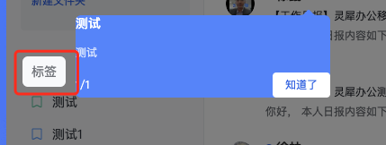

# 1. Grid 布局

* 采用网格布局的区域，称为"容器"（container）。容器内部采用网格定位的子元素，称为"项目"（item）。
* item 默认采用 content-box，如果不设置本身的宽度，则采用网格分割的宽高，包括margin 也会占用 item 分配的宽高。
* `grid-template-rows` 规定 的是 item 的长度，具体内容的长度，需要减去 margin

* 如果 item 内的内容长度超过 item 的长度，则按照 item 的长度压缩。比如 margin 设置 20 ，item 100px，那么你的内容只有 80px （！ 错误，永远保持你设置的长度，content-box。只不过 Chrome浏览器显示 102 px 加了 border ）

* item 内部的排列写法都是 item 与 flex 不同

  ```css
  justify-items
  ```

* Grid-template-areas 会覆盖 `grid-template-rows`

# 2. height

100% 是相对于内容的？


# 3. H5 开发问题

## 3.1 ios 异形屏

https://blog.csdn.net/shenxianhui1995/article/details/109113462


# 4. 水印的问题

* 水印就是 一个 cover 盒子在最上层，然后显示信息

* 主要用到

  ```css
  .cover {
    pointer-events: none; /* 主要是不阻挡遮挡的元素的事件 */
  }
  ```

  

# 5. css 通用属性值

## unset

如果CSS关键字 **`unset`** 从其父级继承，则将该属性重新设置为继承的值，如果没有继承父级样式，则将该属性重新设置为初始值。换句话说，在第一种情况下（继承属性）它的行为类似于[`inherit`](https://developer.mozilla.org/zh-CN/docs/Web/CSS/inherit)似于[`initial`](https://developer.mozilla.org/zh-CN/docs/Web/CSS/initial)CSS简写属性 [`all`](https://developer.mozilla.org/zh-CN/docs/Web/CSS/all)

## all

* 所有属性默认值

  

CSS 通用属性值： [`initial`](https://developer.mozilla.org/zh-CN/docs/Web/CSS/initial)https://developer.mozilla.org/zh-CN/docs/Web/CSS/inherit) and [`unset`](https://developer.mozilla.org/zh-CN/docs/Web/CSS/unset)


## css 取反色

### 1. filter 直接使用 filter 属性

https://developer.mozilla.org/en-US/docs/Web/CSS/filter-function/invert

css 图片的 filter 属性能够修改图片的反色

```css
filter: invert(1);
```

能够把整个页面进行颜色反转，包括图片、文字颜色和背景

#### 网站的图片灰色

* 在一些重大的事件可能会把网站变成灰色，使用的也是 filter

```css
filter: grayscale(100%);
```

### 2. 业务自定义


# var

* 参考：https://developer.mozilla.org/zh-CN/docs/Web/CSS/var#%E5%B0%9D%E8%AF%95%E4%B8%80%E4%B8%8B

var() css函数可以插入一个自定义属性（也被称为css变量）的值，用来代替非自定义属性中的值的任何部分。

`var()` 函数不能作为属性名、选择器或者其他除了属性值之外的值。（这样做通常会产生无效的语法或者一个没有关联到变量的值。）

## 语法

* 函数参数第一个值是要替换的自定义属性名称；第二个参数是backup，如果第一个参数引用值无效，则使用第二个值

> 可以使用多个回退值。自定义属性的回退值允许使用逗号。例如，`var(--foo, red, blue)` 将 `red, blue` 同时指定为回退值；即是说任何在第一个逗号之后到函数结尾前的值都会被考虑为回退值。

## 用var实现主题效果

```html
<!DOCTYPE html>
<html lang="en">
<head>
  <meta charset="UTF-8">
  <meta http-equiv="X-UA-Compatible" content="IE=edge">
  <meta name="viewport" content="width=device-width, initial-scale=1.0">
  <title>Document</title>
  <style>
    :root {
      --bg-color-1: red;
      --bg-color-2: blue;
    }
    :root {
      --bg-color: var(--bg-color-1);
    }
    .box {
      width: 100px;
      height: 100px;
      background-color: var(--bg-color);
    }
    .dark {
      --bg-color: var(--bg-color-2);
    }
  </style>
</head>
<body>
  <div class="box"></div>
  <button>按钮</button>
  <script>
    document.querySelector('button').onclick = () => {
      document.documentElement.classList.add('dark')
    }
  </script>
</body>
</html>
```


# 可替换元素

在 [CSS](https://developer.mozilla.org/zh-CN/docs/Web/CSS) 中，**可替换元素**（**replaced element**）的展现效果不是由 CSS 来控制的。这些元素是一种外部对象，它们外观的渲染，是独立于 CSS 的。

比如图片的展示，视频的播放，iframe 的展示，都是不受控的。

## 控制内容框对象的位置

* 只能够控制对象的位置

[`object-fit`](https://developer.mozilla.org/zh-CN/docs/Web/CSS/object-fit)

指定可替换元素的内容对象在元素盒区域中的填充方式。（有些类似于 [`background-size`](https://developer.mozilla.org/zh-CN/docs/Web/CSS/background-size) ）

[`object-position`](https://developer.mozilla.org/zh-CN/docs/Web/CSS/object-position)

指定可替换元素的内容对象在元素盒区域中的位置。（类似于 [`background-position`](https://developer.mozilla.org/zh-CN/docs/Web/CSS/background-position)


# width

* 百分比：永远相对于的是父元素的 content-width。不论哪种盒模型。


# 动画

* animation 是逐帧执行的，能够修改每一帧的样式

## 动画和文档流

* 动画不会脱离文档流：比如 `translateX` ，它本身的浮动不会影响其他的元素，但是修改它的宽高还是会影响文档流中给它留下的位置。因此，并没有脱离文档流。
* 动画相当于提升了图层，能够使用 GPU 进行加速


# 盒模型

## 标准盒模型


## 行内元素自动换行问题

```html
<div class="inner">
  <span>
    dwada111
  </span>
  <span>
    dwada222dwadawdawdawdawdawdwadw
  </span>
</div>
```

* 上面第二个span，如果父盒子宽度小，则可能自动拐弯换行

# 高级api

## Element.getBoundingClientRect()——边界矩形

`**Element.getBoundingClientRect()**` 方法返回元素的大小及其相对于视口的位置。

* 通俗点说就是获取边界矩形

https://developer.mozilla.org/zh-CN/docs/Web/API/Element/getBoundingClientRect

如果是标准盒子模型，元素的尺寸等于`width/height` + `padding` + `border-width`的总和。如果`box-sizing: border-box`，元素的的尺寸等于 `width/height`。

* 其实使用 style. 或者 offsetTop 等属性也能获取到这些熟悉，这个api只是提供了一个更为方便的方法访问这些属性。

* 返回的结果是包含完整元素的==最小矩形(如果行内元素换行，那就是最小包含矩形)==，并且拥有`left`, `top`, `right`, `bottom`, `x`, `y`, `width`, 和 `height`这几个以像素为单位的只读属性用于描述整个边框。除了`width` 和 `height` 以外的属性是相对于视图窗口的左上角来计算的。

  ==top、left是相对于视口的位置，滚动也会发生变化。非常方便==


## getClientRects()——获取矩形

https://developer.mozilla.org/zh-CN/docs/Web/API/Element/getClientRects

`**Element.getClientRects()**` 方法返回一个指向客户端中每一个盒子的边界矩形的矩形集合。

> 起初，微软打算让这个方法给文本的每一行都返回一个TextRectangle，但是，CSSOM工作草案规定它应该给每个边框返回一个ClientRect。因此，对于行内元素这两个定义是相同的，但是对于块级元素，Mozilla只会返回一个矩形。（译者注：==对于行内元素，元素内部的每一行都会有一个边框；对于块级元素，如果里面没有其他元素，一整块元素只有一个边框==）。

### 与getBoundingClientRect的区别

* getBoundingClientRect 不论行内还是块级元素都返回矩形边界

* ==getClientRects 行内元素会返回每一行的边界，所以返回的是一个数组==

  行内元素自动换行——是指最后一个 span 如果内容过长可能出现折叠换行，内容不连续，该span被拆成了两部分，因此需要获取一个数组，分别定制

> 不过呢，**行内元素**会产生自动换行这类看似分割整体的歧义，所以，我会把行内元素根据它换行划分成*多个盒子边界矩形*。这也是我和我的兄弟——getBoundingClientRect的区别。
>
> https://zhuanlan.zhihu.com/p/38568124


## DOMRect 

一个 DOMRect 代表一个矩形

*`DOMRect` 从它的父类继承方法，[`DOMRectReadOnly`](https://developer.mozilla.org/zh-CN/docs/Web/API/DOMRectReadOnly)。* 不同之处在于它们不再是只读的。

DOMRectReadOnly 没有啥特殊的

# 类型选择器(后期需要总结)

https://developer.mozilla.org/zh-CN/docs/Web/CSS/CSS_Selectors

* 计算角度一定是从内到外出发，采用 id > class > 标签

  这个不一定，主要是首先考虑选择器的类型，采用  id > class > 标签，最后再比较距离。

* 如果选择器类型相同的话，谁越近权重越高

  同样如果选择器相同，谁的路径越长越高

* 权重 > 距离


1. 先看类型 id > class > 标签，从外到里
2. 类型相同看距离，越近越高
3. 距离不相同，则路径越长越好;(越长越精确)


## 相对选择器

https://developer.mozilla.org/zh-CN/docs/Web/CSS/CSS_Selectors#relative_selector


## 属性选择器

* 写法：全部在中括号内完成，类似于正则，需要写规则的写到等号的前边、属性的后边，需要写匹配规则的需要写到第二个参数。

  匹配规则和正则一样，需要采用 i(不区分小写) s(区分大小写，默认)的写法。

```css
a {
  color: blue;
}

/* 以 "#" 开头的页面本地链接 */
a[href^="#"] {
  background-color: gold;
}

/* 包含 "example" 的链接 */
a[href*="example"] {
  background-color: silver;
}

/* 包含 "insensitive" 的链接,不区分大小写 */
a[href*="insensitive" i] {
  color: cyan;
}

/* 包含 "cAsE" 的链接，区分大小写 */
a[href*="cAsE" s] {
  color: pink;
}

/* 以 ".org" 结尾的链接 */
a[href$=".org"] {
  color: red;
}
```


## 选择器列表

https://developer.mozilla.org/zh-CN/docs/Learn/CSS/Building_blocks/Selectors

* 需要注意：兄弟选择器

  | [相邻兄弟选择器](https://developer.mozilla.org/zh-CN/docs/Web/CSS/Adjacent_sibling_combinator) | `h1 + p` | [相邻兄弟](https://developer.mozilla.org/zh-CN/docs/User:chrisdavidmills/CSS_Learn/CSS_Selectors/Combinators#Adjacent_sibling) |
  | ------------------------------------------------------------ | -------- | ------------------------------------------------------------ |
  | [通用兄弟选择器](https://developer.mozilla.org/zh-CN/docs/Web/CSS/General_sibling_combinator) | `h1 ~ p` | [通用兄弟](https://developer.mozilla.org/zh-CN/docs/User:chrisdavidmills/CSS_Learn/CSS_Selectors/Combinators#General_sibling) |


# z-index 和 float

* float 是脱离文档流，是布局层面的修改
* z-index 是渲染层面的修改，是图层的提升。


# css 属性

## 1. clip-path

https://developer.mozilla.org/zh-CN/docs/Web/CSS/clip-path

* 用来裁剪方式创建元素的显示区域。对元素的显示区域进行裁剪。


## 2. pointer-events

* https://developer.mozilla.org/zh-CN/docs/Web/CSS/pointer-events

  鼠标事件怎么样穿透

  > 某个特定的图形元素可以成为鼠标事件的target

## 3. overflow

* overflow: overlay; 和auto表现一样，只能在 webkit 内核中使用，滚动条不会占据位置。

  在 Chrome 和 Safari 能使用

  https://developer.mozilla.org/zh-CN/docs/Web/CSS/overflow

## 4. filter

[CSS](https://developer.mozilla.org/zh-CN/docs/Web/CSS)属性 **`filter`** 将模糊或颜色偏移等图形效果应用于元素。滤镜通常用于调整图像、背景和边框的渲染。

### 函数

1. url：获取指向 SVG 滤镜的 URI，该 [SVG filter](https://developer.mozilla.org/zh-CN/docs/Web/SVG/Element/filter) 可以嵌入到外部 XML 文件中。

2. blur: 使模糊

3. contrast 对比度

   filter: contrast(500%);

4. grayscale 改变图像灰度

   > [`grayscale()`](https://developer.mozilla.org/zh-CN/docs/Web/CSS/filter-function/grayscale) 函数将改变输入图像灰度。`amount` 的值定义了转换的比例。值为 `100%` 则完全转为灰度图像，值为 `0%` 图像无变化。值在 `0%` 到 `100%` 之间，则是效果的线性乘数。若未设置值，默认是 `0`。

5. hue-rotate 色相旋转
6. drop-shadow [`drop-shadow()`](https://developer.mozilla.org/zh-CN/docs/Web/CSS/filter-function/drop-shadow) 函数对输入图像应用阴影效果。


# lottie 动画

参考：剖析 lottie-web 动画实现原理 - 云音乐前端技术团队的文章 - 知乎 https://zhuanlan.zhihu.com/p/342477231

* 样例：https://lottiefiles.com/featured


# 1. 渐变色字体

1. 首先把背景色渐变：

   `background-image: liner-gradient(to right, #000， #fff)`

2. 背景剪裁，只有字体显示背景

   `background-clip: text;`

3. 字体颜色设置成透明：

   `color: transparent`

# flex

## flex 1 和 width 0

* 不知道原因，只说表象吧。如果需要 flex 1 的元素宽度需要父元素分配，则需要设置宽度为0；否则将会受到子元素宽度的影响！

> 如果没有设置width,当内部元素的内容大小超过平均分配的剩余空间时,元素的宽度等于内容大小,如果设置了width并且这个width的大小小于平均分配的剩余空间大小时,取平均分配的剩余空间;
> 当flex设置为 1 时 相当于 剩余空间大小 = 父元素的宽度 因此
> 平均的剩余空间大小等于 = 父元素的宽度 / 元素的个数
> 直接设置width为0可以保证元素宽度平分父元素宽度

## flex 怎么设置超出隐藏——flex省略号不出现

* 如果 flex: 1 沾满了，没给其他元素位置，也可以使用这个破解！

```less
.box {
  flex: 1,
  width: 0 // 这个是关键
}
```

## flex 子元素过长导致父元素兄弟元素被挤压

* 如题，也可以使用 width: 0 解决

```html
<!DOCTYPE html>
<html lang="en">
<head>
    <meta charset="UTF-8">
    <meta http-equiv="X-UA-Compatible" content="IE=edge">
    <meta name="viewport" content="width=device-width, initial-scale=1.0">
    <title>Document</title>
    <style>
        .parent {
            display: flex;
            align-items: stretch;
            height: 500px;
        }
        .child1 {
            background-color: red;
            flex: 1;
        }
        .child1-child {
            width: 1000px;
            background-color: blue;
            height: 300px;
        }
        .child2 {
            width: 100px;
        }
    </style>
</head>
<body>
    <!-- flex 子元素过长导致父元素兄弟元素被挤压 -->
    <div class="parent">
        <div class="child1">
            <div class="child1-child"></div>
        </div>
        <div class="child2"></div>
    </div>
</body>
</html>
```

* 子元素把父元素宽度撑大了，宽度设置为0，让flex去计算


# 文档流相关

## position

### Fixed 布局

* fixed 是相对于浏览器的位置

#### 什么情况下能影响 fixed 布局

* 在父元素使用了 translate 样式后，子元素的 fixed 布局会失效。会相对于父元素布局


# grid 布局

参考：https://juejin.cn/post/7208484366955085883

## 简介

css 网格布局（又称网格和css网格），是一种基于二位网格的布局。

## 术语

### 容器

grid 容器是指应用了 `display: grid` 的元素，它是所有网格项目的直接父元素。

### 项目（grid items）

指的是grid容器的直接子元素

### 网格线（grid line）

`网格线（Grid Lines）` 指的是构成网格结构的分界线。它们可以是垂直的（“列网格线”）或水平的（“行网格线”），并且位于行或列的任一侧。请看下图：


### 单元格（grid cell）

`单元格（Grid Cell）` 指的是相邻两行和相邻两列网格线之间的空间。它是网格的一个 "单元"。

下面是行网格线1和2，列网格线2和3之间的网格单元：


### 网格轨道（Grid Tracks）

`网格轨道（Grid Track）` 指的是两条相邻网格线之间的空间。你可以把它们看成是网格的列或行。


### 网格区域（Grid Area）

`网格区域（Grid Area）` 指的是由四条网格线包围的总空间。一个网格区域可以由任何数量的网格单元组成。

### gaps

`网格间距（Gaps）` 指的是轨道之间的间隙。为了确定尺寸，这些东西就像普通的轨道一样。你不能在缝隙中放置内容，但你可以将网格项目跨越它。

# Formatting context-格式化上下文

https://developer.mozilla.org/zh-CN/docs/Web/CSS/CSS_Flow_Layout/Intro_to_formatting_contexts

## 简介

格式化上下文包括：

* 块级格式化上下文 block formatting contexts
* 内联格式化上下文 inline formatting contexts
* 和灵活格式化上下文 flex formatting contexts

本文主要是讨论它们的基本行为以及如何利用这些行为。

==页面上所有的内容都是格式化上下文的一部分==，或者是一个以特定方式显示的区域。

> **块格式上下文（BFC）**将根据块布局规则布局子元素，**灵活格式上下文 flex formatting context** 将其子元素布局为灵活项[flex items](https://developer.mozilla.org/zh-CN/docs/Glossary/Flex_Item)等。每个格式上下文在其上下文中都有特定的布局规则。

* 内联格式化上下文和BFC应该是行为一致的。

### 为什么叫上下文呢？

* 相当于创建一个上下文，就像代码中的 `{}`，把代码中的内容捕获到当前上下文。bfc也是一样的，把内部的元素捕获到上下文中。（也就是当前盒子区域）

## BFC

> 文档最外层元素使用块布局规则或称为**初始块格式上下文**。这意味着`<html>`元素块中的每个元素都是按照正常流程遵循块和内联布局规则进行布局的。参与 BFC 的元素使用 CSS 框模型概述的规则，该模型定义了元素的边距、边框和填充如何与同一上下文中的其他块交互。

* html 使用初始 BFC。html 内的元素应该按照BFC规则布局。

> **块格式化上下文**（Block Formatting Context，BFC）是 Web 页面的可视 CSS 渲染的一部分，是块级盒子的布局过程发生的区域，也是浮动元素与其他元素交互的区域。

* 块级盒子的布局过程发生的区域，盒模型 宽、高、边距等。
* 浮动元素与其他元素交互的区域，主要是浮动元素怎么排列。


### 创建BFC

html 元素不是唯一能创建块级格式上下文的元素。任何==块级元素==都可以通过应用某些css属性来创建一个BFC

* 根元素（`<html>`）

- 浮动元素（[`float`](https://developer.mozilla.org/zh-CN/docs/Web/CSS/float) 值不为 `none`）
- 绝对定位元素（[`position`](https://developer.mozilla.org/zh-CN/docs/Web/CSS/position) 值为 `absolute` 或 `fixed`）
- 行内块元素（[`display`](https://developer.mozilla.org/zh-CN/docs/Web/CSS/display) 值为 `inline-block`）
- 表格单元格（[`display`](https://developer.mozilla.org/zh-CN/docs/Web/CSS/display) 值为 `table-cell`，HTML 表格单元格默认值）
- 表格标题（[`display`](https://developer.mozilla.org/zh-CN/docs/Web/CSS/display) 值为 `table-caption`，HTML 表格标题默认值）
- 匿名表格单元格元素（[`display`](https://developer.mozilla.org/zh-CN/docs/Web/CSS/display) 值为 `table`、`table-row`、 `table-row-group`、`table-header-group`、`table-footer-group`（分别是 HTML table、tr、tbody、thead、tfoot 的默认值）或 `inline-table`）
- [`overflow`](https://developer.mozilla.org/zh-CN/docs/Web/CSS/overflow) 值不为 `visible`、`clip` 的块元素
- [`display`](https://developer.mozilla.org/zh-CN/docs/Web/CSS/display) 值为 `flow-root` 的元素
- [`contain`](https://developer.mozilla.org/zh-CN/docs/Web/CSS/contain) 值为 `layout`、`content` 或 `paint` 的元素
- 弹性元素（[`display`](https://developer.mozilla.org/zh-CN/docs/Web/CSS/display) 值为 `flex` 或 `inline-flex` 元素的直接子元素），如果它们本身既不是 [flex](https://developer.mozilla.org/zh-CN/docs/Glossary/Flex_Container)、[grid](https://developer.mozilla.org/zh-CN/docs/Glossary/Grid_Container) 也不是 [table](https://developer.mozilla.org/zh-CN/docs/Web/CSS/CSS_Table) 容器
- 网格元素（[`display`](https://developer.mozilla.org/zh-CN/docs/Web/CSS/display) 值为 `grid` 或 `inline-grid` 元素的直接子元素），如果它们本身既不是 [flex](https://developer.mozilla.org/zh-CN/docs/Glossary/Flex_Container)、[grid](https://developer.mozilla.org/zh-CN/docs/Glossary/Grid_Container) 也不是 [table](https://developer.mozilla.org/zh-CN/docs/Web/CSS/CSS_Table) 容器
- 多列容器（[`column-count`](https://developer.mozilla.org/zh-CN/docs/Web/CSS/column-count) 或 [`column-width` (en-US)](https://developer.mozilla.org/en-US/docs/Web/CSS/column-width) 值不为 `auto`，包括`column-count` 为 `1`）
- `column-span` 值为 `all` 的元素始终会创建一个新的 BFC，即使该元素没有包裹在一个多列容器中 ([规范变更](https://github.com/w3c/csswg-drafts/commit/a8634b96900279916bd6c505fda88dda71d8ec51), [Chrome bug](https://bugs.chromium.org/p/chromium/issues/detail?id=709362))

常用：display: flow-root、overflow: hidden、position: `absolute` 或 `fixed`、浮动元素（[`float`](https://developer.mozilla.org/zh-CN/docs/Web/CSS/float) 值不为 `none`）、flex、grid.

### 行为描述

格式化上下文影响布局，通常，我们会为定位和清除浮动创建新的BFC，而不是更改布局，具体原因：

- 包含内部浮动

- 排除外部浮动

- 阻止 [外边距重叠](https://developer.mozilla.org/zh-CN/docs/Web/CSS/CSS_Box_Model/Mastering_margin_collapsing)

  主要说的是垂直方向上的外边距塌陷问题。

> **备注：** flex/grid 容器（[`display`](https://developer.mozilla.org/zh-CN/docs/Web/CSS/display)：flex/grid/inline-flex/inline-grid）建立新的 flex/grid 格式上下文，除布局之外，它与块格式上下文类似。flex/grid 容器中没有可用的浮动子级，但排除外部浮动和阻止外边距重叠仍然有效。

单纯的清除浮动只有清除浮动的效果，并没有实现BFC。

#### felx 和 grid

* 这两个布局不能包含浮动元素，但是能够排除外部的浮动元素和阻止外边距重叠。

#### 脱离文档流

脱离文档流的元素没有脱离 HTML 元素，因此需要开启一个 BFC，那么就不会脱离当前容器节点。

* 怎么样捕获脱离文档流的元素，那就开启一个新的bfc

  > 设置 `overflow: auto` 会自动创建包含浮动的新 BFC。现在，我们的 DIV 在布局中变成了一个迷你布局。任何子元素都将包含在其中。

  * 相当于开始一个新的html标签（迷你版）

#### 使用 `dispaly: flow-root`

* 这个属性将无副作用的创建一个BFC区域，就像html标签一样！！！


# 盒模型

https://developer.mozilla.org/zh-CN/docs/Learn/CSS/Building_blocks/The_box_model

> 在 CSS 中，所有的元素都被一个个的“盒子（box）”包围着，理解这些“盒子”的基本原理，是我们使用 CSS 实现准确布局、处理元素排列的关键。

## 块级盒子

块级盒子表现为

- 盒子会在内联的方向上扩展并占据父容器在该方向上的所有可用空间，在绝大数情况下意味着盒子会和父容器一样宽
- 每个盒子都会换行
- [`width`](https://developer.mozilla.org/zh-CN/docs/Web/CSS/width) 和 [`height`](https://developer.mozilla.org/zh-CN/docs/Web/CSS/height) 属性可以发挥作用
- 内边距（padding）, 外边距（margin）和 边框（border）会将其他元素从当前盒子周围“推开”

## 内联盒子

- 盒子不会产生换行。
- [`width`](https://developer.mozilla.org/zh-CN/docs/Web/CSS/width) 和 [`height`](https://developer.mozilla.org/zh-CN/docs/Web/CSS/height) 属性将不起作用。
- 垂直方向的内边距、外边距以及边框会被应用但是不会把其他处于 `inline` 状态的盒子推开。
- 水平方向的内边距、外边距以及边框会被应用且会把其他处于 `inline` 状态的盒子推开。

## 什么是css盒模型

> 完整的 CSS 盒模型应用于块级盒子，内联盒子只使用盒模型中定义的部分内容。模型定义了盒的每个部分 —— margin, border, padding, and content —— 合在一起就可以创建我们在页面上看到的内容。为了增加一些额外的复杂性，有一个标准的和替代（IE）的盒模型。

* 主要是规定 margin border padding content 的表现

### 盒模型各个部分

CSS 中组成一个块级盒子需要：

- **Content box**: 这个区域是用来显示内容，大小可以通过设置 [`width`](https://developer.mozilla.org/zh-CN/docs/Web/CSS/width) 和 [`height`](https://developer.mozilla.org/zh-CN/docs/Web/CSS/height).
- **Padding box**: 包围在内容区域外部的空白区域；大小通过 [`padding`](https://developer.mozilla.org/zh-CN/docs/Web/CSS/padding) 相关属性设置。
- **Border box**: 边框盒包裹内容和内边距。大小通过 [`border`](https://developer.mozilla.org/zh-CN/docs/Web/CSS/border) 相关属性设置。
- **Margin box**: 这是最外面的区域，是盒子和其他元素之间的空白区域。大小通过 [`margin`](https://developer.mozilla.org/zh-CN/docs/Web/CSS/margin) 相关属性设置。

# 工具

## scss


## classnames

* 这个工具能把驼峰转换成 - 拼接的

  https://github.com/JedWatson/classnames

# 开发中成长——问题记录

## 父组件overflow:hidden怎么破

* 可以使用一个代理盒子，这个盒子是一个 fixed 定位的盒子，相对于浏览器窗口的，需要超出显示的盒子写到这个代理盒子的里面即可实现。

## 新手引导样式怎么做

* 一个蒙层，怎么样让一个按钮穿过蒙层呢？也就是子元素穿过蒙层的样式呢？



	* 实际上蒙层的样式是由父元素的 border-shadow 控制的，也就是这个蒙层完全就是border的阴影，子元素的样式就能直接穿透了。比如说不设置背景色就能拿到蒙层后的元素样式。（注意：不能用边框，动态的，不知道边框多大）

# css3

## 前缀

* 浏览器针对css3实现的不同，需要加前缀

  todo 前缀和浏览器内核的对应关系
