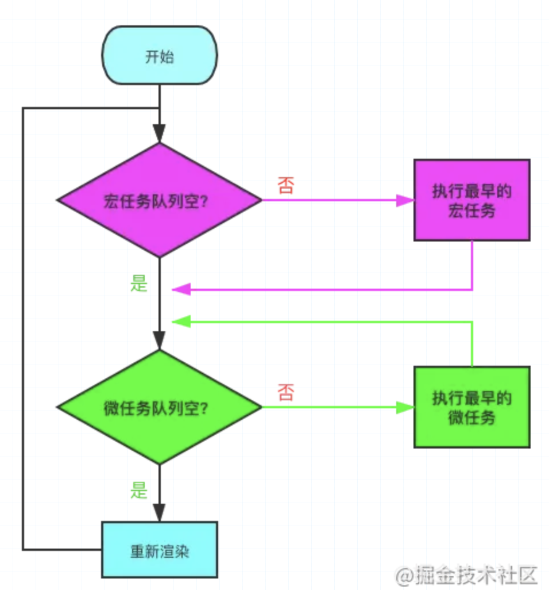

# 1. 任务

https://developer.mozilla.org/zh-CN/docs/Web/API/HTML_DOM_API/Microtask_guide

一个 **任务** 就是由执行诸如==从头执行一段程序（script标签）==、执行一个事件回调或一个 interval/timeout 被触发之类的标准机制而被调度的任意 JavaScript 代码。这些都在 **任务队列（task queue）**上被调度。

在以下时机，任务会被添加到任务队列：

- 一段新程序或子程序被直接执行时（比如从一个控制台，或在一个 [script](https://developer.mozilla.org/zh-CN/docs/Web/HTML/Element/script) 元素中运行代码）。
- 触发了一个事件，将其回调函数添加到任务队列时。
- 执行到一个由 [`setTimeout()`](https://developer.mozilla.org/zh-CN/docs/Web/API/setTimeout)ttps://developer.mozilla.org/zh-CN/docs/Web/API/setInterval) 创建的 timeout 或 interval，以致相应的回调函数被添加到任务队列时。


**宏任务与微任务的几种创建方式** 👇

| 宏任务（Macrotask）      | 微任务（Microtask）             |
| ------------------------ | ------------------------------- |
| setTimeout               | requestAnimationFrame（有争议） |
| setInterval              | MutationObserver（浏览器环境）  |
| MessageChannel           | Promise.[ then/catch/finally ]  |
| I/O，事件队列            | process.nextTick（Node环境）    |
| setImmediate（Node环境） | queueMicrotask                  |
| script（整体代码块）     |                                 |

==事件循环==驱动你的代码按照这些任务排队的顺序，一个接一个地处理它们。在当前迭代轮次中，只有那些当事件循环过程开始时 *已经处于任务队列中* 的任务会被执行。其余的任务不得不等待到下一次迭代。


## 微任务（microtasks）

起初微任务和任务之间的差异看起来不大。它们很相似；都由位于某个队列的 JavaScript 代码组成并在合适的时候运行。但是，只有在迭代开始时队列中存在的任务才会被事件循环一个接一个地运行，这和处理微任务队列是殊为不同的。

有两点关键的区别。

首先，每当一个任务存在，事件循环都会检查该任务是否正把控制权交给其他 JavaScript 代码。如若不然，事件循环就会运行微任务队列中的所有微任务。接下来微任务循环会在事件循环的每次迭代中被处理多次，包括处理完事件和其他回调之后。

其次，如果一个微任务通过调用 [`queueMicrotask()`](https://developer.mozilla.org/zh-CN/docs/Web/API/queueMicrotask)务，则那些新加入的微任务 *会早于下一个任务运行* 。这是因为事件循环会持续调用微任务直至队列中没有留存的，即使是在有更多微任务持续被加入的情况下。


## 使用微队列

在谈论更多之前，再次注意到一点是重要的，那就是如果可能的话，大部分开发者并不应该过多的使用微任务。在基于现代浏览器的 JavaScript 开发中有一个高度专业化的特性，那就是允许你调度代码跳转到其他事情之前，而那些事情原本是处于用户计算机中一大堆等待发生的事情集合之中的。==滥用这种能力将带来性能问题。==

## 什么时候使用呢？

在本章节中，我们来看看微任务特别有用的场景。通常，这些场景关乎捕捉或检查结果、执行清理等；其时机晚于一段 JavaScript 执行上下文主体的退出，但早于任何事件处理函数、timeouts 或 intervals 及其他回调被执行。

使用微任务的最主要原因简单归纳为：确保任务顺序的一致性，即便当结果或数据是同步可用的，也要同时减少操作中用户可感知到的延迟而带来的风险。


# 并发模型与事件循环

JavaScript有一个基于**事件循环**的==并发模型==，事件循环负责执行代码、收集和处理事件以及执行队列中的子任务。这个模型与其它语言中的模型截然不同，比如 C 和 Java。

https://developer.mozilla.org/zh-CN/docs/Web/JavaScript/EventLoop

## [运行时概念](https://developer.mozilla.org/zh-CN/docs/Web/JavaScript/EventLoop#运行时概念)

* 运行时就是一个能为程序提供执行环境的概念

接下来的内容解释了这个理论模型。现代JavaScript引擎实现并着重优化了以下描述的这些语义。


* 在这里函数就是帧

### 栈

主要是函数调用栈

### 堆

对象被分配在堆中，堆是一个用来表示一大块（通常是非结构化的，无法描述的结构，泛指）==内存区域==的计算机术语。

### 队列

一个 JavaScript 运行时包含了一个待处理消息的消息队列。每一个消息都关联着一个用以处理这个消息的回调函数。

在 [事件循环](https://developer.mozilla.org/zh-CN/docs/Web/JavaScript/EventLoop#事件循环) 期间的某个时刻，运行时会从最先进入队列的消息开始处理队列中的消息。被处理的消息会被移出队列，并作为输入参数来调用与之关联的函数。正如前面所提到的，调用一个函数总是会为其创造一个新的栈帧。

函数的处理会一直进行到执行栈再次为空为止；然后事件循环将会处理队列中的下一个消息（如果还有的话）。

## [事件循环](https://developer.mozilla.org/zh-CN/docs/Web/JavaScript/EventLoop#事件循环)

之所以称之为 **事件循环**，是因为它经常按照类似如下的方式来被实现：

```js
while (queue.waitForMessage()) {
  queue.processNextMessage();
}
```

`queue.waitForMessage()` 会同步地等待消息到达(如果当前没有任何消息等待被处理)。





### 执行至完成

每一个消息完整地执行后，其它消息才会被执行。这为程序的分析提供了一些优秀的特性，包括：当一个函数执行时，它不会被抢占，只有在它运行完毕之后才会去运行任何其他的代码，才能修改这个函数操作的数据。这与C语言不同，例如，如果函数在线程中运行，它可能在任何位置被终止，然后在另一个线程中运行其他代码。

==这个模型的一个缺点在于当一个消息需要太长时间才能处理完毕时，Web应用程序就无法处理与用户的交互，例如点击或滚动。为了缓解这个问题，浏览器一般会弹出一个“这个脚本运行时间过长”的对话框。一个良好的习惯是缩短单个消息处理时间，并在可能的情况下将一个消息裁剪成多个消息。==


### setTimeout

函数 `setTimeout` 接受两个参数：==待加入队列的消息==和一个时间值（可选，默认为 0）。这个时间值代表了==消息被实际加入到队列的最小延迟时间==。如果队列中没有其它消息并且栈为空，在这段延迟时间过去之后，消息会被马上处理。但是，如果有其它消息，`setTimeout` 消息必须等待其它消息处理完。因此第二个参数仅仅==表示最少延迟时间==，而非确切的等待时间。

* 下边这个粒子能够阻断js执行

```js
const s = new Date().getSeconds();

setTimeout(function() {
  // 输出 "2"，表示回调函数并没有在 500 毫秒之后立即执行
  console.log("Ran after " + (new Date().getSeconds() - s) + " seconds");
}, 500);

while(true) {
  if(new Date().getSeconds() - s >= 2) {
    console.log("Good, looped for 2 seconds");
    break;
  }
}
```


### [多个运行时互相通信](https://developer.mozilla.org/zh-CN/docs/Web/JavaScript/EventLoop#多个运行时互相通信)

一个 web worker 或者一个跨域的 `iframe` 都有自己的栈、堆和消息队列。两个不同的运行时只能通过 [`postMessage`](https://developer.mozilla.org/zh-CN/docs/Web/API/Window/postMessage)则此方法会向该运行时添加消息。


## [永不阻塞](https://developer.mozilla.org/zh-CN/docs/Web/JavaScript/EventLoop#永不阻塞)

JavaScript的事件循环模型与许多其他语言不同的一个非常有趣的特性是，它永不阻塞。 处理 I/O 通常通过==事件和回调==来执行，所以当一个应用正等待一个 [IndexedDB](https://developer.mozilla.org/zh-CN/docs/Web/API/IndexedDB_API) 查询返回或者一个 [XHR](https://developer.mozilla.org/zh-CN/docs/Web/API/XMLHttpRequest) 请求返回时，它仍然可以处理其它事情，比如用户输入。


# Promise

https://juejin.cn/post/6945319439772434469

* 为啥设计成异步的？
  * 如果里边的状态变化是同步的、异步的，打印顺序不一致，因此设计成异步的比较好。

## Promise A+ 规范


## 手写

* 只有 pending 状态下才会往队列中加
* 队列存的是 p 单独调用的 then ，并不是链式调用
* 链式调用的 用 返回的 Promise 代替，不是保存在一个队列了
* 只有上一个状态变了，下一个then 才会加入 异步队列
* 也就是说 Promise 本身就是一个状态机，只有状态发生变化，后边的才会加入异步队列
* then 方法必须传入一个函数，如果传入的不是函数，就把promise的值继续往下传。
* catch 之前没有处理错误的函数，它才会接受到（就是then第二个参数）。
* 因为每次都返回一个新的 Promise，因此在 catch finally 中才能使用 this 能拿它的状态
* 如果 then 返回一个 Promise 实例，就接管 后边的 then


## resolve 的拆箱功能

* resolve 有拆箱的功能，能够获得 当前 Promise 的状态，向后移动一步（链式调用多了一个异步消息）

* reject 没有拆箱效果，会直接执行 then 中的回调。

* 和 then 方法不同的是：then 方法返回的 Promise 对象会直接接管，当前的链式调用对象。

  https://juejin.cn/post/6870745273971245064#heading-14


# Async

* 会立即执行，直到遇到 await

* await 后边的都是 then ，需要用 try catch 去捕获

  为什么 then 第二个函数处理之后，就会变成 fulfilled ，和 Async 一样，线性执行，catch 之后如果有返回就是 fulfilled 状态。