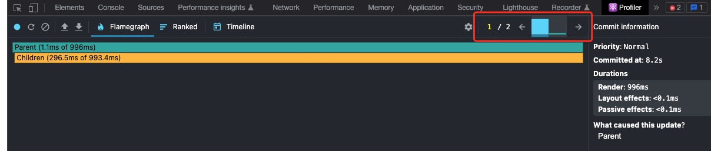
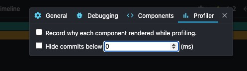

本文主要是探讨 react 的性能测量工具 react-devtool profiler 的使用。

参考：https://juejin.cn/post/7077091328420478989

# profile 一个 app

主要是录制、重现操作

# 查看性能数据

## 浏览 commits

从概念上讲，React 的运行分为两个阶段：

- 在 render 阶段会确定例如 DOM 之类的数据需要做那些变化。在这个阶段，React 将会执行（各个组件的）render 方法，之后会计算出和调用 render 方法之前有哪些变化。
- commit 阶段是 React 提交任何更改所在的阶段（在 React DOM 下，就是指 React 添加、修改和移除 DOM 节点的时候）。同时在这个阶段，React 会执行像 componentDidMount 和 componentDidUpdate 这类周期函数。

* 这些列的颜色和高度对应着该次 commit 在渲染上所花的时间（较高、偏黄的列会比较矮、偏蓝的列花费的时间多）。

* 左右切换就能看看其他组件渲染时长。

## 筛选 commits

你 profile 的记录时间越长，渲染次数就会越多。有时候你或许会被过多的（价值低的）commit 记录干扰。为了帮助你解决这个问题，profiler 提供了一个筛选功能。用它来制定一个时间阀值，之后 profiler 会隐藏所有比这个阀值更快的 commit。

* 可以定制一个 阈值，用来筛选哪些渲染时长超过这个阈值的 commit

## 火焰图

在 profiler 中对应 flamegraph。

