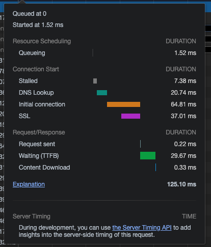

# 寻找性能瓶颈

* 了解性能指标-多快才算快
* 利用测量工具和APIs

## 1. Network  waterfall（横向查看）

* queue 队列索引，等待时间
* stalled 排队时长
* DNS lookup DNS 查找时间
* initial 链接时长
* SSL https 请求安全连接建立时间
* TTFB 真正请求发出，到响应时长
* download 下载

流程总结：

1. 有一个队列，保存排队的请求
2. 有一个在队列中的排队时长
3. 资源调度时长
4. 然后发送请求，DNS lookup DNS  查找时长
5. 网路连接建立时长
6. ssl https 安全连接建立时长
7. ttfb 真正的 发送请求，到第一个字节响应时长
8. 资源下载时长

总结：

1. 在 waterfall 中点击右键能保存 HAR 文件，方便在其他性能分析软件中进行分析

## 2. lighthouse

* 点击之后能够产生一个分数。谷歌提供的一个性能测试工具

### 两个主要指标

1. First Contentful Paint
2. Speed Index
   * 标准是 4s
   * ==人眼能达到的帧率是疫苗 60 帧，60fps==
3. 页面加载时间
4. 首次渲染

### 怎么查看帧率

* 打开控制台 -> command + shift + p -> 输入 frame -> 找到 FPS 那一项，就能在浏览器查看

建议：

* 异步请求在 1s 内返回，要不做压缩
* 加 loading

## 3. performance

* 查看 main 主线程的空闲时间，没有颜色的就是空闲

# 性能指标

## 性能指标分类

性能优化指标分为两种：一种是前端常见核心性能指标，一种是业务自定义指标

* 也就是前端通用的性能指标 和 业务自定义的性能指标

## 前端核心性能指标

| 指标名称 | 全称                     | 描述                                           |
| -------- | ------------------------ | ---------------------------------------------- |
| FP       | First Paint              | 浏览器第一次绘制时间，第一个像素时间           |
| TTI      | Time To Interactive      | 页面渲染完毕，可以响应用户输入的时间           |
| FID      | First Input Delay        | 用户与页面输入框等控件第一次可交互的时间       |
| LCP      | Largest Contentful Paint | 最大内容绘制时间                               |
| FMP      | First Meaningful Paint   | 首次有意义的绘制，页面主要内容出现在屏幕的时间 |
| FCP      | First Contentful Paint   | 浏览器第一次屏幕绘制内容时间                   |
| CLS      | Cumulative Layout Shift  | 累计布局版式位移，页面抖动，屏闪               |

# 什么是 RAIL

从用户角度出发，谷歌提出的概念

* response：用户操作之后的响应

  处理事件要在 50ms 内完成

* animation：动画是否流畅

  每 10ms 产生一帧

* idle  空闲 有足够的空闲时间处理响应，主线程不能一直繁忙

  尽可能增加空闲时间。懒加载、业务逻辑不要放在前端

* load 加载时间

  在 5s 内完成内容加载并可以交互

## 性能测量工具

* Chrome devtools 开发调试、性能评测
* Lighthouse 网站整体质量评测
* Webpagetest 多测试地点、全面性能报告

# 工具

## Google 性能测试工具

https://pagespeed.web.dev/

# web 指标

* 参考 https://web.dev/i18n/zh/vitals/

## 工具

web-vitals

参考：https://web.dev/vitals/#%E6%B5%8B%E9%87%8F%E5%92%8C%E6%8A%A5%E5%91%8A%E6%A0%B8%E5%BF%83-web-%E6%8C%87%E6%A0%87%E7%9A%84%E5%B7%A5%E5%85%B7

