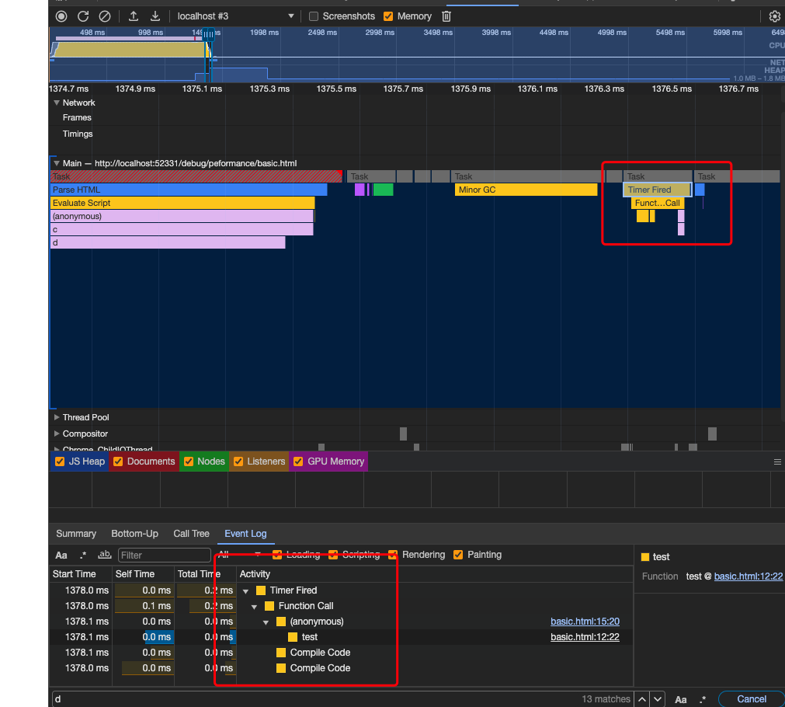

# Peformance 调试

参考：神光调试小册

有部分内容和 `web-performance.md` 文件重复

## 基础

录制完 performance 后，就能看到不同的线程。

* 我们可以看到每一个宏任务的调用栈
* 在下方可以直接对调用方法进行搜索
* 上方和主线程并列的就是各个线程的使用情况

## 事件循环

主线程是不断执行 Event Loop 的，可以看到有两个 Task（宏任务），调用栈分别是 a、b 和 c、d，和我们分析的对上了。（当然，还有一些浏览器内部的函数，比如 parseHtml、evaluateScript 等，这些可以忽略）

* main 现成就是不断执行 event loop 的

* **Performance 工具最重要的是分析主线程的 Event Loop，分析每个 Task 的耗时、调用栈等信息。**
* 当你点击某个宏任务的时候，在下面的面板会显示调用栈的详情（选择 bottom-up 是列表展示， call tree 是树形展示）

## 找到耗时代码

* 能看到长任务都被标红了（普通任务是灰色的），并且在 summary 中有长任务警告信息。

### long task

> 在 Performance 中宽度代表时间，超过 50ms 就被认为是 Long Task，会被标红。因为如果 16.7 ms 渲染一帧，那 50ms 就跨了 3、4 帧了。

* 这里也就是 RAIL 模型对应上了，因为这个模型中 response 要求最多为 50ms

### 优化长任务

**因为渲染和 JS 执行都在主线程，在一个 Event Loop 中，会相互阻塞，如果 JS 有长时间执行的 Task，就会阻塞渲染，导致页面卡顿。所以，性能分析主要的目的是找到 long task，之后消除它。**

## 怎么查看事件循环

如图：

* 灰色代表一个宏任务 task
* 蓝色就是 html parse
* 橙色的是浏览器内部的 JS：
* 紫色是样式的 reflow、repaint
* 绿色的部分就是渲染

* 每一次js执行完成，重绘之前会执行 requestAnimationFrame (也就是 Animation Frame Fired 任务)。

  requestAnimationFrame 的回调是在渲染前执行的，rAF 和渲染构成了一个宏任务

### 宏任务

> requestAnimationFrame 的回调是在渲染前执行的，rAF 和渲染构成了一个宏任务

* 为什么有的时候会掉帧、卡顿，就是因为阻塞的渲染的宏任务的执行：

  也就是到了16ms了，还没执行到下一个渲染的宏任务。

* requestIdleCallback

  触发了 fire Idle Callback 回调，也是新开一个宏任务。

* 垃圾回收也是宏任务

  触发了 Major GC 任务

* html 中直接执行的 script 也是宏任务

以上这些都可以通过 performance 看出来。

## layers-图层调试

### 简介

* 如上使用perform查看main task，可以看到 回流、重绘、绘制，然后再进行 合并图层。

  在 main 线程下有一个单独的线程 compositor，专门来做图层合并的事。

### 为什么需要绘制在不同的图层呢？

> 页面中的不同部分，重绘频率是不一样的，比如 video、canvas、动画这种就要高频重绘，而且现代浏览器都支持通过 GPU 做计算来加速渲染（硬件加速），怎么综合高频重绘和低频重绘、CPU 渲染和 GPU 渲染呢？
>
> 答案就是分成不同的图层，每个图层单独做自己的绘制，最后由 Compositor 线程把它们合并到一起。

* 主要是页面不同的元素渲染频率不一样，比如所高频的重绘就需要只用 GPU 进行加速渲染，怎么综合高频重绘和低频重绘、CPU渲染和GPU渲染呢？

  主要就是分成不同的图层，每个图层做自己单独的绘制，最后由 compositor 线程把它们合并到一起。

### 什么属性能创建图层呢？

> 大家可能听过用 3D transform 会新建图层，用 will-change 会新建图层等等，但是是否真的新建了图层心里并没底。

* 一般情况下使用 3D transform 创建新图层，并且开启 GPU 加速。
* position: absolute，脱离文档流也能够创建新图层

# source map 相关

## webpack source map 配置

- **eval**：浏览器 devtool 支持通过 sourceUrl 来把 eval 的内容单独生成文件，还可以进一步通过 sourceMappingUrl 来映射回源码，webpack 利用这个特性来简化了 sourcemap 的处理，可以直接从模块开始映射，不用从 bundle 级别。
- **cheap**：只映射到源代码的某一行，不精确到列，可以提升 sourcemap 生成速度
- **source-map**：生成 sourcemap 文件，可以配置 inline，会以 dataURL 的方式内联，可以配置 hidden，只生成 sourcemap，不和生成的文件关联
- **nosources**：不生成 sourceContent 内容，可以减小 sourcemap 文件的大小
- **module**： sourcemap 生成时会关联每一步 loader 生成的 sourcemap，可以映射回最初的源码

理解了这些基础配置项，根据 ^(inline-|hidden-|eval-)?(nosources-)?(cheap-(module-)?)?source-map$ 的规律来进行组合，就可以实现各种需求下的 sourcemap 配置。

## 相关原理

在 源码 的末尾添加 `sourceMappingURL = '路径'` 的方式就能够识别到 source map 对应的map文件。

怎么找到的呢？

* 一切都在 `.js.map` 文件中，这个文件保存了转换为 ast 后源码对应的位置信息。