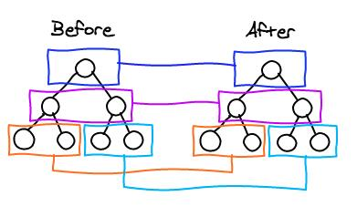

# 1. 说明

* 本笔记是慕课网《React16.4开发简书项目》笔记

# 2. 简介

* Facebook 推出
* 2013年开源
* 函数式编程
* 使用人数最多的前端框架
* 健全的文档与完善的社区（中文文档滞后）
* React Fiber （react16之后）

# 3. 快速启动

* 采用官方推荐的脚手架工具快速搭建react 项目

  安装：npm i -g create-react-app

  create-react-app  项目名称

  cd 项目

  yarn start

# 4. 项目结构分析


1. yarn.lock 项目依赖锁定

2. package.json 

   能通过 yarn 加 scripts 里面的字段来执行响应的命令。（类似于 npm run ）

3. public 文件

   favicon.ico 文件就是网站上的页面图标

   index.html 文件就是编译之后的首页文件

4. 入口：

   src 文件夹下面的 index.js 文件

   react 设计理念： all in js 在js 文件只中，类似于 vue 里面引入 css 文件，只需要把css 文件 import 即可，不需要命名。

   app.test.js 文件是自动化测试文件。

   manifest.json 文件是定义快速访问的一些特性（比如说桌面图标，颜色等等）

## 小的知识点

在 index.js 文件中引入了 registerServiceWorker js文件，涉及到 PWA（progressive web application） 的概念，引入registerServiceWorker 就是帮助利用网页写手机app 的功能。服务器挂掉之后，还能看到之前访问的网页。

# 5. 开始 react

## 5.1 react 简单入门

1. 组件

   引入 

   `import React, { Component } from "react"`

   定义：(render 函数的return加`()` 是为了方便多行编写代码)

   ```jsx
   class App extends Component { // 继承 React.Component 即可定义一个组件
       render() {
           return (
           	<div>
               	hello react
               </div>
           )
       }
   }
   ```

   ==render 最外层必须有一个顶级元素==

   导出：
   
   `export default App`
   
2. 首页一般需要一个 app 组件，在 index.js 文件中 使用`render` 方法将 app 组件挂载到首页上。

   每个组件自定义的 render 方法返回 react 组件 的结构。

3. react 中的组件都是单闭合使用方式，和 vue 的使用方式不太一样。

4. 首页的书写：

   1. 使用js 中写结构的方式(jsx 语法)，一定要引入 react

      ```jsx
      import React from "react"
      ```

      因为不引入 react 没法识别 `JSX` 语法

   2. 首页渲染需要引入 ReactDOM 

      ```jsx
      import ReactDOM from "react-dom"
      ```

      然后渲染首页

      ```jsx
      ReactDOM.render(<App/>, document.getElementById("root"));
      ```

   

### 5.1.2 注意

* 因为 react 要求组件的最外层必须有一个顶级元素来包围 里面的结构，但是有的时候并不需要这个最外层的元素， react 16 中提供了一个 `Fragment` 的占位符取代最外层的元素。

  ```js
  import { Fragment } from "react"
  ```

  fragment : 碎片，片段


## 5.2 React 中的响应式设计思想和事件绑定（重点）

### 5.2.1 基础

1. 任何类都有一个 constructor 方法，这个方法会由于任何方法优先执行。

   在react中定义变量

   ```jsx
   constructor(props) {
       super(props) // super 是调用父类的 constructor 方法
       this.state = { // react 中的数据都存放在 state 状态中
           
       }
   }
   ```

2. 在react的html 元素中使用 定义的数据

```html
<input value={this.state.inputVal} />
```

​	在 jsx  中使用 变量语法如上 需要加 `{}`

3. 获取变量

   this.state. 获取自定义的数据

   this.方法名 获取自定义的方法

   ==react 中有一个 immutable(不可改变的) 的概念==

   * state  不予许我们做任何的改变，就是不能直接修改 state 的值，需要使用 this.setState() 方法，先修改 state 的副本，然后再赋值给 state。一旦直接修改 state 中的内容，在后期做react性能优化的时候就会出现问题

     ```jsx
     const list = [...this.state.list]
     ```

     

4. 页面改变

   react 中需要改变页面，就需要改变 数据。
   
5. 在jsx中写注释

   ```jsx
   <my>
   	{/* 我是第一个注释 */}
       {
           // 我是二个注释
       }
   </my>
   ```

   

### 5.2.2 react 事件绑定

* ==react 事件绑定方法的this 不指向当前 class 的实例，需要在绑定事件的时候绑定 this==

* 不推荐在绑定事件的时候去绑定 this ，推荐直接在constructor中绑定，能减少一部分性能的损耗。

  ```js
  constructor (props) {
      this.handle = this.handle.bind(this)
  }
  ```

### 5.2.3 react 绑定事件传参（非常重要）

* react 在事件绑定的时候，不能够直接加`()`（和 vue 的区别），因为加上`()`之后，该事件绑定的方法就会立马执行。

* 解决方案：

  在绑定事件需要传参的时候，不能直接使用 `(参数)` 的形式来实现

  1. 通过 bind 来实现事件传参

     ```js
     <div onClick={this.handleClick.bind(this, arg1)}>
     ```

     但是该方案会造成性能损耗的情况，不推荐使用。

  2. 箭头函数的方式

     ```js
     <div onClick={() => {this.handleClick(arg1)}}>
     ```

     

## 5.3 引入样式文件

*  直接引入样式文件，class 用 className 替换

  ```js
  import "./my.css"
  ```

* 在 jsx 中如果想把字符串中的html元素展示出来（不转义），需要在元素中加 attribute `dangerouslySetInnerHTML`，不需要再去设置inner的值

  ```jsx
  <li dangerouslySetInnerHTML={{__html: item}}>
  	
  </li>
  ```
  
  ==实际上在jsx语法中返回一个结构时，需要在最外层有一个元素，不能同时存在两个最外层元素。==

## 5.4 拆分组件与组件之间的传值

### 5.4.1 组件的使用

* 组件在react 中的使用，直接单闭合标签，首字母大写。
* 在组件之间传值，是通过属性的方式来实现的（方法和变量），在子组件中能通过 `this.props`来调用传递的变量和方法（注意方法this的指向问题） 

### 5.4.2 组件中变量使用的问题

* 在开发的过程中，推荐使用解构赋值的形式来定义变量。

  比如在 render 函数中，

  ```jsx
  let { content } = this.props
  ```

 1. 注意
    ==标签太长的话，建议换行使用==
    
    jsx 返回太长的结构的话，建议封装成方法。

## 5.2 react 16 新特性

* 在新的 react 中推荐使用采用如下的方式修改 state 里面的变量。

  ```jsx
  this.setState((prevState) => ({ //prevState 是改变之前的 this.state
      value: prevState.value
  }))
  ```

  ==但是该方式是异步的，在获取 e.target 的时候e需要在执行 setState 之前做值得保存。==

  prevState 可以避免不小心改变 state的状态？（是不是浅拷贝，验证）

# 6. react 高级

## 6.1 react 中 props、state、render函数

* state 和 props 中的数据发生变化的时候，render函数就会去执行。 	 

  父组件render执行子组件也会执行？？？
  prevState 可以避免不小心改变 state的状态？（是不是浅拷贝，验证，不是浅拷贝，就是同一个对象）

## 5.6 react 父子组件之间的传值

1. 父组件传值给子组件

   直接在使用子组件的时候，传递属性

2. 子组件传值给父组件

   在子组件中触发父组件的方法，实现传参的传值。

## 5.7 PropsTypes 与 DefaultProps

1. propTypes 对子组件接受的父组件的数据做强校验

   ```js
   // 在子组件中
   import PropTypes from "prop-types"
   // 在导出组件之前
   Item.propTypes = {
       content: PropTypes.string, //content 接受的值要为string类型
       deleteItem: PropTypes.func, // 必须为 function
       index: PropTypes.number.isRequired, // 必须为number,必传
       str: PropTypes.oneOfType([PropTypes.number, PropTypes.string])
   }
   // 具体参考 react 官方文档
   ```

2. defaultProps

   能给没传的属性一个默认值

   ```js
   Item.defaultProps = {
       test: "default" // 这种情况就不会触发上面的检测
   }
   ```

   

# 6. react 思考

1. 声明式开发

   react 就是声明式开发，不必关心都DOM操作

2. 可以与其他框架并存

   react 只操作页面 id 为 root 的节点，需要操作其他节点可以使用 jquery 来实现。

3. 组件化开发

4. 单向数据流

   父组件可以向子组件传递一个值，但是不能在子组件中直接改变这个值，`props` 是read-only 的。

   但是可以通过调用父组件方法的方式，实现对父组件数据的更改（实质是父组件操作父组件的数据。）

5. 视图层的框架

   数据之间的传递，需要其他数据层的框架来实现。

6. 函数式编程

   自动化测试，直接检验一个函数的输入输出即可，如果全是函数的话方便自动化测试。

7. 命令式开发

   类似于 jquery 就是命令式开发

* 父组件的 render 函数执行之后，子组件的render函数一定会执行。

# 7. 虚拟 DOM

## 7.1 react 中的虚拟 DOM

思路：

* state 数据
* JSX 模板
* 数据 +  模板 结合，生成 真实的 DOM，来显示
* state 发生改变
* 数据 + 模板 结合，生成真实的 DOM ,替换原始的 DOM

缺陷： 

1. 第一次生成了一个完整的 DOM 片段
2. 第二次生成了一个完整的 DOM 片段
3. 第二次的 DOM 替换第一次的DOM，非常消耗性能


解决：

- state 数据
- JSX 模板
- 数据 +  模板 结合，生成 真实的 DOM，来显示
- state 发生改变
- 数据 + 模板 结合，生成真实的 DOM ,并不直接替换原始的 DOM
- 新的 DOM（DoucumentFragment） 和原始的DOM做对比，找差异
- 找出新的 input 框发生了变化
- 只用新的 DOM 中的 input 元素，替换吊老 DOM 中的input 元素。


缺陷：

性能的提升并不明显


第三种方案： 虚拟的 DOM

- state 数据

- JSX 模板

- 数据 +  模板 结合，生成 真实的 DOM，来显示

- 数据+模板 生成虚拟的 DOM （==虚拟DOM就是一个JS对象，用它来描述真实DOM==）（增加了小部分性能的损耗）

  虚拟 DOM 举例：

  ```html
  <div id="a">
      <span>hello world</span>
  </div>
  ```

  ```js
  [
      "div",
      {id: "a"},
      [
          "span",
          {},
          "hello world"
      ]
  ]
  ```

- state 发生变化

- 生成新的虚拟 DOM （极大的提升了性能，不用操作DOM）（==比较js对象不怎么消耗性能，比较DOM 会极大的消耗性能==）

  ```js
  [
      "div",
      {id: "a"},
      [
          "span",
          {},
          "新的内容"
      ]
  ]
  ```

- 比较新的虚拟DOM和原始的区别，找到是内容发生了变化

- 直接操作 DOM， 改变 span 中的内容。

## 7.2 深入了解虚拟 DOM

react 真实实现：（3和4 反过来）

1. state 数据

2. JSX 模板（render里面的就是模板）

3. 数据+模板 生成虚拟的 DOM （==虚拟DOM就是一个JS对象，用它来描述真实DOM==）（增加了小部分性能的损耗）

    虚拟 DOM 举例：

    ```js
    [
        "div",
        {id: "a"},
        [
            "span",
            {},
            "hello world"
        ]
    ]
    ```

4. 用虚拟的 DOM 的结构生成真实的 DOM，来显示
	```html
    <div id="a">
        <span>hello world</span>
    </div>
   ```

5. state 发生变化

6. 生成新的虚拟 DOM （极大的提升了性能，不用操作DOM）（==比较js对象不怎么消耗性能，比较DOM 会极大的消耗性能==）

    ```js
    [
        "div",
        {id: "a"},
        [
            "span",
            {},
            "新的内容"
        ]
    ]
    ```


7.  比较新的虚拟DOM和原始的区别，找到是内容发生了变化
8.  直接操作 DOM， 改变 span 中的内容。


JSX -> JS 对象 -> 真实的 DOM：

JSX:

```jsx
render() {
    return <div>我是内容</div>
}
```

JS 对象 -> 真实的 DOM：

```jsx
// render 中也可以这样写
render() {
    return React.createElement("div", {}, "我是内容")
}
// 例2
render() {
    return React.createElement("div", {}, React.createElement("span", {}, "span里面的内容"))
}
```

虚拟DOM的有点：

1. 性能提升了
2. 它是的跨端应用得以实现， React Native

# 8. react diff 算法

上面的 第7步，比较了俩个 DOM 的区别，diff 算法就是如何去比对



==setState 设计成异步的，是react为了节省性能，同时好几个state发生变化，最后做统一的虚拟DOM操作==

第一层节点不一样，就删掉当前节点下面所有的DOM，重新生成 虚拟 DOM。

1. react虚拟 DOM 对比是同层对比。（算法设计比较简单）
2. 虚拟 DOM 的对比要对比循环的 key 值（key值比对），删除或增加之后key值会发生变化，因此最好别使用 index 值作为 key值，可以使用 item 的内容来作为 key值。

# 9. ref 的使用

* 在react中我们使用 ref 来操作 DOM

