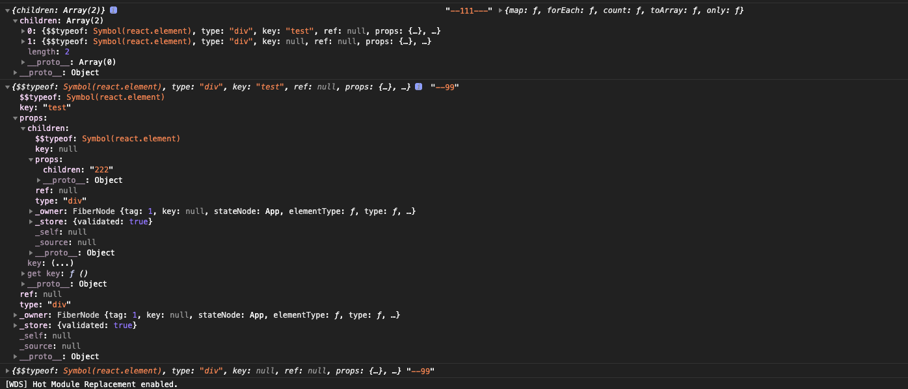
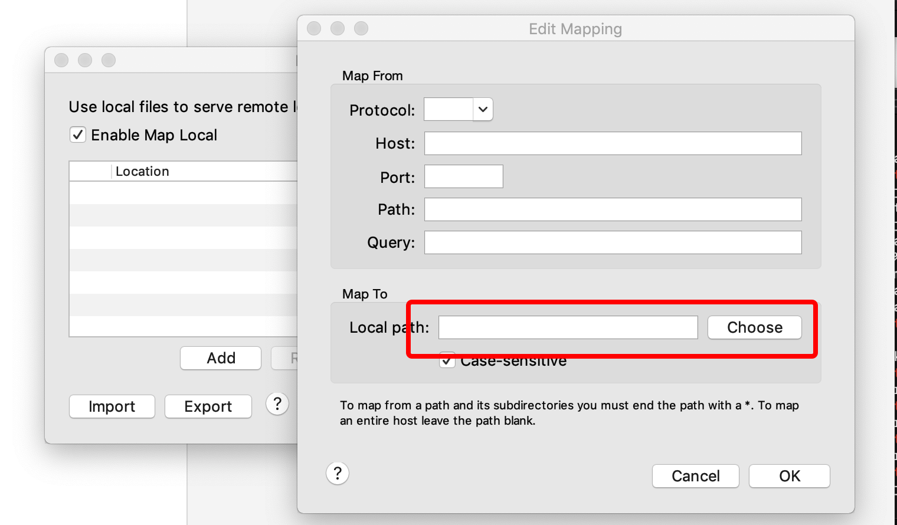
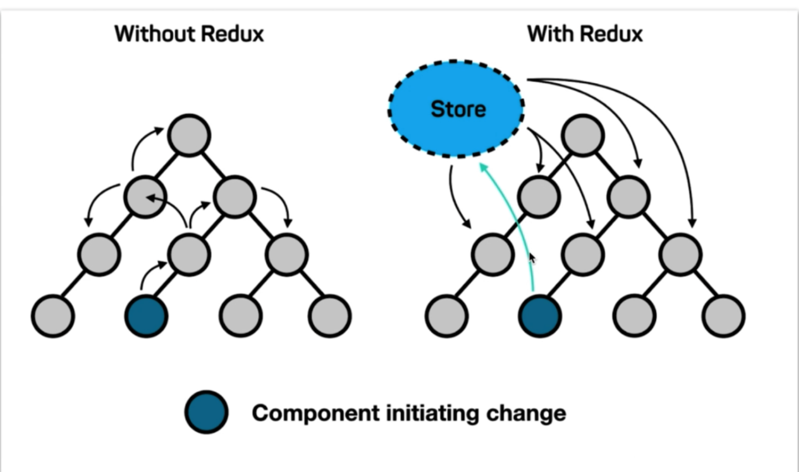
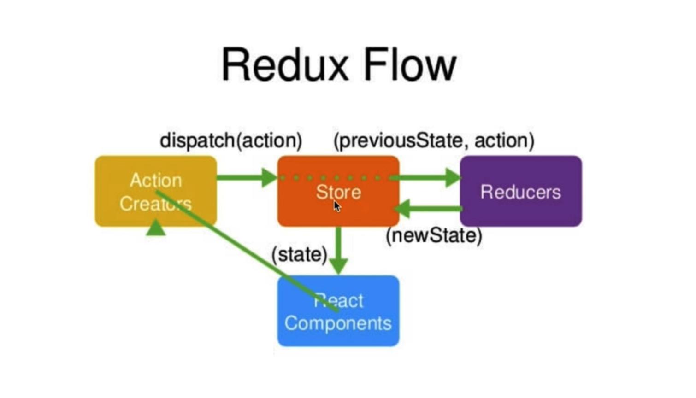
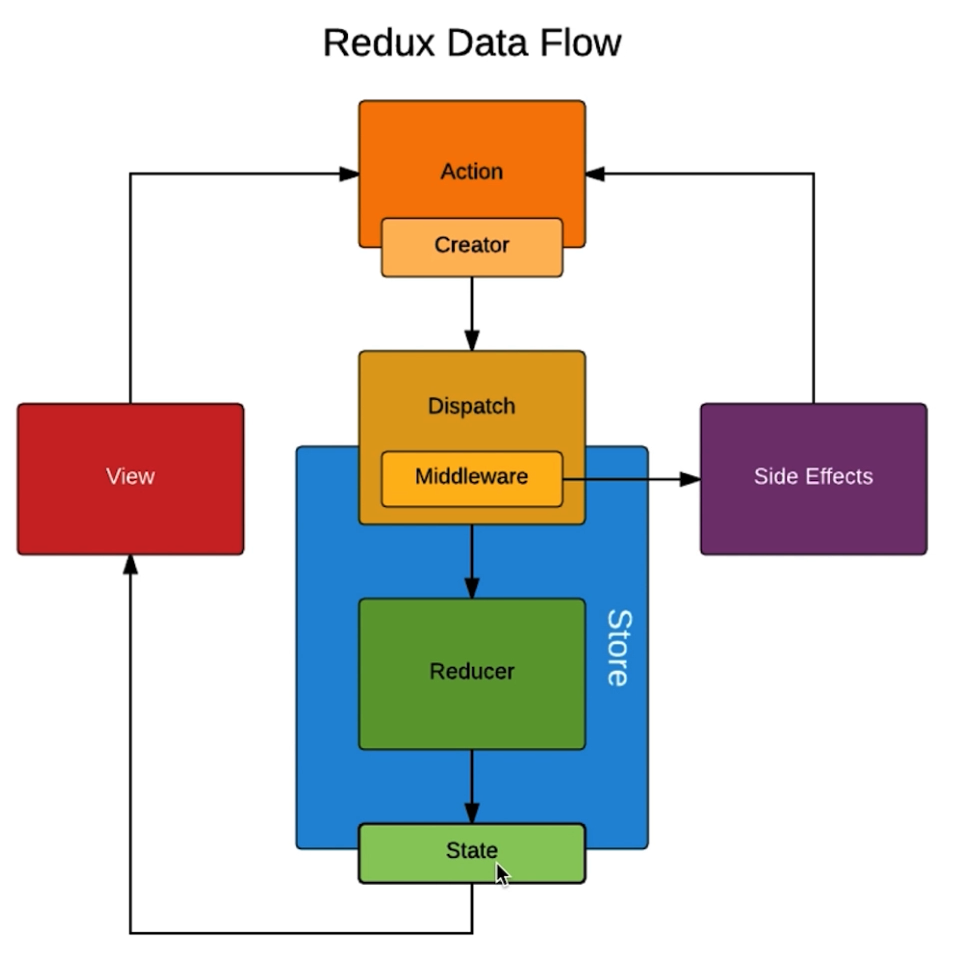

# 1. 说明

* 本笔记是慕课网《React16.4开发简书项目》笔记

# 2. 简介

* Facebook 推出
* 2013年开源
* 函数式编程
* 使用人数最多的前端框架
* 健全的文档与完善的社区（中文文档滞后）
* React Fiber （react16之后）

# 3. 快速启动

* 采用官方推荐的脚手架工具快速搭建react 项目

  安装：npm i -g create-react-app

  create-react-app  项目名称

  cd 项目

  yarn start

# 4. 项目结构分析


1. yarn.lock 项目依赖锁定

2. package.json 

   能通过 yarn 加 scripts 里面的字段来执行响应的命令。（类似于 npm run ）

3. public 文件

   favicon.ico 文件就是网站上的页面图标

   index.html 文件就是编译之后的首页文件

4. 入口：

   src 文件夹下面的 index.js 文件

   react 设计理念： all in js 在js 文件只中，类似于 vue 里面引入 css 文件，只需要把css 文件 import 即可，不需要命名。

   app.test.js 文件是自动化测试文件。

   manifest.json 文件是定义快速访问的一些特性（比如说桌面图标，颜色等等）

## 小的知识点

在 index.js 文件中引入了 registerServiceWorker js文件，涉及到 PWA（progressive web application） 的概念，引入registerServiceWorker 就是帮助利用网页写手机app 的功能。服务器挂掉之后，还能看到之前访问的网页。

# 5. 开始 react

## 5.1 react 简单入门

1. 组件

   引入 

   `import React, { Component } from "react"`

   定义：(render 函数的return加`()` 是为了方便多行编写代码)

   ```jsx
   class App extends Component { // 继承 React.Component 即可定义一个组件
       render() {
           return (
           	<div>
               	hello react
               </div>
           )
       }
   }
   ```

   ==render 最外层必须有一个顶级元素==

   * 组件也可以通过 `React.createClass({})`的方式创建一个组件
   
   导出：
   
   `export default App`
   
2. 首页一般需要一个 app 组件，在 index.js 文件中 使用`render` 方法将 app 组件挂载到首页上。

   每个组件自定义的 render 方法返回 react 组件 的结构。

3. react 中的组件都是单闭合使用方式，和 vue 的使用方式不太一样。

   也可以写成双闭合标签，双闭合就可以写子元素了。

4. 首页的书写：

   1. 使用js 中写结构的方式(jsx 语法)，一定要引入 react

      ```jsx
      import React from "react"
      ```

      因为不引入 react 没法识别 `JSX` 语法

   2. 首页渲染需要引入 ReactDOM 

      ```jsx
      import ReactDOM from "react-dom"
      ```

      然后渲染首页

      ```jsx
      ReactDOM.render(<App/>, document.getElementById("root"));
      ```

   

### 5.1.2 注意

* 因为 react 要求组件的最外层必须有一个顶级元素来包围 里面的结构，但是有的时候并不需要这个最外层的元素， react 16 中提供了一个 `Fragment` 的占位符取代最外层的元素。

  ```js
  import { Fragment } from "react"
  ```

  fragment : 碎片，片段
  
* label 的for 属性在react中要使用`htmlFor`来表达

### 5.1.3 react 语法总结

#### 基本语法

1. html 结构可以直接在 js 中书写
2. html 结构中书写 js 需要使用 `{}`来包围
3. js 区域表达html 一定要返回一个 html 结构

#### 数组在页面上的渲染

* 在开发的过程中常常使用数组的元素为标签的形式来渲染数组，因为在 `jsx`语法中下列的写法存在，因此能直接把下列类型的数组在页面上渲染

  ```jsx
  {
      [
          <div>11111</div>,
          <div>22222</div>,
          <div>33333</div>,
      ]
  }
  ```

* 数组的形式在页面上渲染需要加上属性 `key`

#### 注释

```jsx
{/*注释*/}
```


## 5.2 React 中的响应式设计思想和事件绑定（重点）

### 5.2.1 基础

1. 任何类都有一个 constructor 方法，这个方法会由于任何方法优先执行。

   在react中定义变量

   ```jsx
   constructor(props) {
       super(props) // super 是调用父类的 constructor 方法
       this.state = { // react 中的数据都存放在 state 状态中
           
       }
   }
   ```

2. 在react的html 元素中使用 定义的数据

```html
<input value={this.state.inputVal} />
```

​	在 jsx  中使用 变量语法如上 需要加 `{}`

3. 获取变量

   this.state. 获取自定义的数据

   this.方法名 获取自定义的方法

   ==react 中有一个 immutable(不可改变的) 的概念==

   * state  不予许我们做任何的改变，就是不能直接修改 state 的值，需要使用 this.setState() 方法，先修改 state 的副本，然后再赋值给 state。一旦直接修改 state 中的内容，在后期做react性能优化的时候就会出现问题

     ```jsx
     const list = [...this.state.list]
     ```

   * state 属性是对象的情况下，必须直接更换对象的引用。

4. 页面改变

   react 中需要改变页面，就需要改变 数据。
   
5. 在jsx中写注释

   ```jsx
   <my>
   	{/* 我是第一个注释 */}
       {
           // 我是二个注释
       }
   </my>
   ```

   

### 5.2.2 react 事件绑定

* ==react 事件绑定方法的this 不指向当前 class 的实例，需要在绑定事件的时候绑定 this==

* 不推荐在绑定事件的时候去绑定 this ，推荐直接在constructor中绑定，能减少一部分性能的损耗。

  ```js
  constructor (props) {
      this.handle = this.handle.bind(this)
  }
  ```

### 5.2.3 react 绑定事件传参（非常重要）

* react 在事件绑定的时候，不能够直接加`()`（和 vue 的区别），因为加上`()`之后，该事件绑定的方法就会立马执行。

* 解决方案：

  在绑定事件需要传参的时候，不能直接使用 `(参数)` 的形式来实现

  1. 通过 bind 来实现事件传参

     ```js
     <div onClick={this.handleClick.bind(this, arg1)}>
     ```

     但是该方案会造成性能损耗的情况，不推荐使用。

  2. 箭头函数的方式

     ```js
     <div onClick={() => {this.handleClick(arg1)}}>
     ```


### ==总结==

* react 中异步执行（包括订阅的方式）的方法都需要绑定this，同步执行的不需要绑定 this

## 5.3 引入样式文件

*  直接引入样式文件，class 用 className 替换

  ```js
  import "./my.css"
  ```

* 在 jsx 中如果想把字符串中的html元素展示出来（不转义），需要在元素中加 attribute `dangerouslySetInnerHTML`，不需要再去设置inner的值

  ```jsx
  <li dangerouslySetInnerHTML={{__html: item}}>
  	
  </li>
  ```
  
  ==实际上在jsx语法中返回一个结构时，需要在最外层有一个元素，不能同时存在两个最外层元素。==

### 5.3.1 直接在元素上写 样式

* 直接在元素上写样式，因为 style  是双引号的

  ```html
  <input style={{widht: ’100px‘}} />
  ```

  第一个引号是表示js 区域，第二个引号是对象。

  该对象里面的属性都将采用 驼峰民命

### 5.3.2 img 引入图片

```js
import svg from '.tet.png'


```

* 采用引入图片然后再赋值 src 的形式

## 5.4 拆分组件与组件之间的传值

### 5.4.1 组件的使用

* 组件在react 中的使用，直接单闭合标签，首字母大写。
* 在组件之间传值，是通过属性的方式来实现的（方法和变量），在子组件中能通过 `this.props`来调用传递的变量和方法（注意方法this的指向问题） 

### 5.4.2 组件中变量使用的问题

* 在开发的过程中，推荐使用解构赋值的形式来定义变量。

  比如在 render 函数中，

  ```jsx
  let { content } = this.props
  ```

 1. 注意
    ==标签太长的话，建议换行使用==
    
    jsx 返回太长的结构的话，建议封装成方法。

## 5.2 react 16 新特性

* 在新的 react 中推荐使用采用如下的方式修改 state 里面的变量。(提升性能)

  ```jsx
  this.setState((prevState) => ({ //prevState 是改变之前的 this.state
      value: prevState.value
  }))
  ```

  ==但是该方式是异步的，在获取 e.target 的时候e需要在执行 setState 之前做值得保存。==

  prevState 可以避免不小心改变 state的状态？（是不是浅拷贝，验证，不是就是 state）
  
  setState 提供了异步执行之后的回调。
  
  ```jsx
  this.setState((prevState) => ({ //prevState 是改变之前的 this.state
      value: prevState.value
  }), () => {
      console.log(111)
  })
  ```

### PureComponent

* 在页面使用redux 的时候，只要 redux store 里面的数据一更新，就会重新渲染改组件(因为关联了 props ，就会执行 componentWillUpdate)，因此 react fiber 引入了 PureComponent 来取代 Component，（不用自己写 shouldComponentUpdate，提高组件性能）

  ```js
  import { PureComponent } from 'react'
  ```

  注意：PureComponent 和 immutablejs 数据结合的较好，使用普通的数据类型，可能会遇到坑

## 5.3 可控组件和不可控组件

* 如果表单的 value 没有和 state 进行绑定，则该 input 组件就是不可控组件，反之则是可控组件
* 原因：input 输入值并没有真正的改变虚拟DOM。

# 6. react 高级

## 6.1 react 中 props、state、render函数

* state 和 props 中的数据发生变化的时候，render函数就会去执行。 	 

  父组件render执行子组件也会执行？？？
  prevState 可以避免不小心改变 state的状态？（是不是浅拷贝，验证，不是浅拷贝，就是同一个对象）

## 5.6 react 父子组件之间的传值

1. 父组件传值给子组件

   直接在使用子组件的时候，传递属性

2. 子组件传值给父组件

   在子组件中触发父组件的方法，实现传参的传值。

## 5.7 PropsTypes 与 DefaultProps

1. propTypes 对子组件接受的父组件的数据做强校验

   ```js
   // 在子组件中
   import PropTypes from "prop-types"
   // 在导出组件之前
   Item.propTypes = {
       content: PropTypes.string, //content 接受的值要为string类型
       deleteItem: PropTypes.func, // 必须为 function
       index: PropTypes.number.isRequired, // 必须为number,必传
       str: PropTypes.oneOfType([PropTypes.number, PropTypes.string]),
       mixType: PropTypes.arrayOf(PropTypes.number, PropTypes.string) // 一个数组，元素的类型为number、string
   }
   // 具体参考 react 官方文档
   ```

2. defaultProps

   能给没传的属性一个默认值

   ```js
   Item.defaultProps = {
       test: "default" // 这种情况就不会触发上面的检测
   }
   ```

注意：上述两种情况也可以在 class 中使用 static 挂载到构造函数上。

## 高阶组件（HOC-higherOrderComponent）

* 高阶组件是参数为组件，返回值为新组件的函数。
* 说白了还是为了代码的复用拆分
* 组件是将 props 转换为 UI，而高阶组件是将组件转换为另一个组件。

## context 使用

* 之前共享一些数据需要组件一层一层的传递，不是很方便，react提供了 context ，一个组件内的所有子组件都能够共享这些数据

  例如当前认证的用户、主题或首选语言。

  使用：

```jsx
// 公共部分，创建 context
const ThemeContext = React.createContext('light')

// 父组件
<ThemeContext.Provider value="dark">
   <TestContext></TestContext>
</ThemeContext.Provider>
    
// 子组件
 // 绑定context
this.contextType = ThemeContext
 
<div>
    test
    <div>{this.context}</div>
</div>
```

### 思考

* Context 主要应用场景在于*很多*不同层级的组件需要访问同样一些的数据。请谨慎使用，因为这会使得组件的复用性变差。

* 如果传递的组件太深层，也可以使用子组件在父组件封装好，直接传递组件的方式（子组件的数据直接由父组件获取，中间组件并不需要知道传递了什么值）

  参考：<https://react.docschina.org/docs/context.html>

## 关于高阶组件（hoc）、mixin、render prop 的思考

* mixin 是 es5 中公共方法的提取，提供了完整的生命周期，和 vue 中的mixin 相似
* hoc 则是把公共的方法提取为外层父组件，把公共的方法通过 props 传给需要使用的组件，然后返回这个外层组件。有一些缺点，命名来源（多个hoc 是谁传入的 props 数据，命名冲突）
* render prop 是==把公共的部分当成子组件(不一定，主要看相对位置吧)==，父组件来传递一个 render 命名的函数，来控制子组件（公共方法的执行），但是会直接呈现在页面上（因为子组件的调用就是直接在页面上），因此类似于 vue 中的插槽，不能纯使用公共的方法，必须要返回 ui 。
* HOC 和 render props 都需要借助 props ，父子组件的生命周期。

## 插槽与子节点

* react 也可以像 vue的插槽一样 中在组件内部传入值
* react 的子节点就是插槽位置的节点

使用：

传值是一样的

组件内部：需要使用 `ReactDOM.createPortal()` 方法将 children 对象渲染出来，并且用第二个参数（一个DOM对象）将该组件挂载到页面上。（第二个参数DOM 对象需要挂载到页面上，这个方法只是挂载到了这个DOM对象上了）。

第二个参数节点只是挂载的节点，不需要特别的把生产出来的

```jsx
import React, { Component } from 'react'
import ReactDOM from 'react-dom'

class Home extends Component {
    constructor (props) {
        super(props)
        this.state = {}
        this.ele = document.createElement('div')
    }

    componentDidMount () {
        this.root = document.getElementsByClassName('home-box')[0]
        this.root.appendChild(this.ele)
    }

    componentWillUnmount () {
        this.root.removeChild(this.ele)
    }

    render () {
        console.log(this.props)
        return (
            <div className='home-box'>
                父组件
                <div>把插槽安排到下面吧</div>
                {
                    ReactDOM.createPortal(this.props.children, this.ele)
                }
            </div>
        )
    }
}

export default Home

```

也可以直接就挂载到页面的DOM上

```jsx
import React, { Component } from 'react'
import ReactDOM from 'react-dom'

class Home extends Component {
    constructor (props) {
        super(props)
        this.state = {
            myDOM: null
        }
        this.ele = document.createElement('div')
    }

    componentDidMount () {
        this.getPortal()
    }

    componentWillUnmount () {
    }

    getPortal () {
        this.setState(() => ({
            myDOM: ReactDOM.createPortal(this.props.children, document.getElementsByClassName('home-box')[0])
        }))
    }

    render () {
        console.log(this.props)
        return (
            <div className='home-box'>
                父组件
                <div>把插槽安排到下面吧</div>
                {
                    this.state.myDOM
                }
            </div>
        )
    }
}

export default Home

```

## 合成事件

* react 事件传递的 event 不是原生事件，是包装的， React 事件系统一部分的 `SyntheticEvent` 包装器。
* `SyntheticEvent` 实例将被传递给你的事件处理函数，它是浏览器的原生事件的跨浏览器包装器。除==兼容==所有浏览器外，它还拥有和浏览器原生事件相同的接口，包括 `stopPropagation()` 和 `preventDefault()`。
* 当需要使用浏览器底层事件的时候，只需要使用 `nativeEvent`属性来获取即可。
* 如果你想异步访问事件属性，需要调用 `event.persist()`，此方法会从池中移除合成事件，允许用户代码保留对事件的引用。
* 原生事件是优先于合成事件执行的


## 代码分割

* 打包是个非常棒的技术，但随着你的应用增长，你的代码包也将随之增长。尤其是在整合了体积巨大的第三方库的情况下。你需要关注你代码包中所包含的代码，以避免因体积过大而导致加载时间过长。

  为了避免搞出大体积的代码包，在前期就思考该问题并对代码包进行分割是个不错的选择。 代码分割是由诸如 [Webpack](https://webpack.docschina.org/guides/code-splitting/)，[Rollup](https://rollupjs.org/guide/en/#code-splitting) 和 Browserify（[factor-bundle](https://github.com/browserify/factor-bundle)）这类打包器支持的一项技术，能够创建多个包并在运行时动态加载。

  对你的应用进行代码分割能够帮助你“懒加载”当前用户所需要的内容，能够显著地提高你的应用性能。尽管并没有减少应用整体的代码体积，但你可以避免加载用户永远不需要的代码，并在初始加载的时候减少所需加载的代码量。

* 代码分割之后，按需加载的组件会再次进行请求。

### `React.lazy`

https://zh-hans.reactjs.org/docs/code-splitting.html#reactlazy

`React.lazy` 函数能让你像渲染常规组件一样处理动态引入（的组件）。

```jsx
const OtherComponent = React.lazy(() => import('./OtherComponent'));
```

此代码将会在组件首次渲染时，自动导入包含 `OtherComponent` 组件的包。(能够使用导入的属性，并不是真正的导入)

`React.lazy` 接受一个函数，这个函数需要动态调用 `import()`。它必须返回一个 `Promise`，该 Promise 需要 resolve 一个==`default` export== 的 React 组件。

==然后应在 `Suspense` 组件中渲染 lazy 组件，如此使得我们可以使用在等待加载 lazy 组件时做优雅降级（如 loading 指示器等）。==包括进行其他的定制。

总结：

1. 真正在使用的时候才会执行这个模块内的代码

应用：

1. 基于路由的代码分割

   https://zh-hans.reactjs.org/docs/code-splitting.html#route-based-code-splitting

#### 命名导出问题

`React.lazy` 目前只支持默认导出（default exports）。如果你想被引入的模块使用命名导出（named exports）（就是之前别人写好的组件或者模块），你可以创建一个中间模块，来重新导出为默认模块。这能保证 [tree shaking](https://zhuanlan.zhihu.com/p/127804516) 不会出错，并且不必引入不需要的组件。


## 异常捕获

如果模块加载失败（如网络问题），它会触发一个错误。你可以通过[异常捕获边界（Error boundaries）](https://zh-hans.reactjs.org/docs/error-boundaries.html)技术来处理这些情况，以显示良好的用户体验并管理恢复事宜。

https://zh-hans.reactjs.org/docs/error-boundaries.html

> 注意
>
> 错误边界**无法**捕获以下场景中产生的错误：
>
> - 事件处理（[了解更多](https://zh-hans.reactjs.org/docs/error-boundaries.html#how-about-event-handlers)）
> - 异步代码（例如 `setTimeout` 或 `requestAnimationFrame` 回调函数）
> - 服务端渲染
> - 它自身抛出来的错误（并非它的子组件）

如果一个 class 组件中定义了 [`static getDerivedStateFromError()`](https://zh-hans.reactjs.org/docs/react-component.html#static-getderivedstatefromerror)周期方法中的任意一个（或两个）时，那么它就变成一个错误边界。当抛出错误后，请使用 `static getDerivedStateFromError()` 渲染备用 UI ，使用 `componentDidCatch()` 打印错误信息。

使用：

像一个组件一样使用，在最外层进行嵌套。

```jsx
class ErrorBoundary extends React.Component {
  constructor(props) {
    super(props);
    this.state = { hasError: false };
  }

  static getDerivedStateFromError(error) {
    // 更新 state 使下一次渲染能够显示降级后的 UI
    return { hasError: true };
  }

  componentDidCatch(error, errorInfo) {
    // 你同样可以将错误日志上报给服务器
    logErrorToMyService(error, errorInfo);
  }

  render() {
    if (this.state.hasError) {
      // 你可以自定义降级后的 UI 并渲染
      return <h1>Something went wrong.</h1>;
    }

    return this.props.children; 
  }
}
```

```jsx
<ErrorBoundary>
  <MyWidget />
</ErrorBoundary>
```


# 6. react 思考

1. 声明式开发

   react 就是声明式开发，不必关心都DOM操作

2. 可以与其他框架并存

   react 只操作页面 id 为 root 的节点，需要操作其他节点可以使用 jquery 来实现。

3. 组件化开发

4. 单向数据流

   父组件可以向子组件传递一个值，但是不能在子组件中直接改变这个值，`props` 是read-only 的。

   但是可以通过调用父组件方法的方式，实现对父组件数据的更改（实质是父组件操作父组件的数据。）

5. 视图层的框架

   数据之间的传递，需要其他数据层的框架来实现。

6. 函数式编程

   自动化测试，直接检验一个函数的输入输出即可，如果全是函数的话方便自动化测试。

7. 命令式开发

   类似于 jquery 就是命令式开发

* 父组件的 render 函数执行之后，子组件的render函数一定会执行。

# 7. 虚拟 DOM

## 7.1 react 中的虚拟 DOM

思路：

* state 数据
* JSX 模板
* 数据 +  模板 结合，生成 真实的 DOM，来显示
* state 发生改变
* 数据 + 模板 结合，生成真实的 DOM ,替换原始的 DOM

缺陷： 

1. 第一次生成了一个完整的 DOM 片段
2. 第二次生成了一个完整的 DOM 片段
3. 第二次的 DOM 替换第一次的DOM，非常消耗性能


解决：

- state 数据
- JSX 模板
- 数据 +  模板 结合，生成 真实的 DOM，来显示
- state 发生改变
- 数据 + 模板 结合，生成真实的 DOM ,并不直接替换原始的 DOM
- 新的 DOM（DoucumentFragment） 和原始的DOM做对比，找差异
- 找出新的 input 框发生了变化
- 只用新的 DOM 中的 input 元素，替换吊老 DOM 中的input 元素。


缺陷：

性能的提升并不明显


第三种方案： 虚拟的 DOM

- state 数据

- JSX 模板

- 数据 +  模板 结合，生成 真实的 DOM，来显示

- 数据+模板 生成虚拟的 DOM （==虚拟DOM就是一个JS对象，用它来描述真实DOM==）（增加了小部分性能的损耗）

  虚拟 DOM 举例：

  ```html
  <div id="a">
      <span>hello world</span>
  </div>
  ```

  ```js
  [
      "div",
      {id: "a"},
      [
          "span",
          {},
          "hello world"
      ]
  ]
  ```

- state 发生变化

- 生成新的虚拟 DOM （极大的提升了性能，不用操作DOM）（==比较js对象不怎么消耗性能，比较DOM 会极大的消耗性能==）

  ```js
  [
      "div",
      {id: "a"},
      [
          "span",
          {},
          "新的内容"
      ]
  ]
  ```

- 比较新的虚拟DOM和原始的区别，找到是内容发生了变化

- 直接操作 DOM， 改变 span 中的内容。

## 7.2 深入了解虚拟 DOM

react 真实实现：（3和4 反过来）

1. state 数据

2. JSX 模板（render里面的就是模板）

3. 数据+模板 生成虚拟的 DOM （==虚拟DOM就是一个JS对象，用它来描述真实DOM==）（增加了小部分性能的损耗）

    虚拟 DOM 举例：

    ```js
    [
        "div",
        {id: "a"},
        [
            "span",
            {},
            "hello world"
        ]
    ]
    ```

4. 用虚拟的 DOM 的结构生成真实的 DOM，来显示
	```html
    <div id="a">
        <span>hello world</span>
    </div>
   ```
  
5. state 发生变化

6. 生成新的虚拟 DOM （极大的提升了性能，不用操作DOM）（==比较js对象不怎么消耗性能，比较DOM 会极大的消耗性能==）

    ```js
    [
        "div",
        {id: "a"},
        [
            "span",
            {},
            "新的内容"
        ]
    ]
    ```


7.  比较新的虚拟DOM和原始的区别，找到是内容发生了变化
8.  直接操作 DOM， 改变 span 中的内容。


JSX -> JS 对象 -> 真实的 DOM：

```jsx
render() {
    return <div>我是内容</div>
}
```

JS 对象 -> 真实的 DOM：

```jsx
// render 中也可以这样写
render() {
    return React.createElement("div", {}, "我是内容")
}
// 例2
render() {
    return React.createElement("div", {}, React.createElement("span", {}, "span里面的内容"))
}
```

虚拟DOM的有点：

1. 性能提升了
2. 它是的跨端应用得以实现， React Native

# 8. react diff 算法

上面的 第7步，比较了俩个 DOM 的区别，diff 算法就是如何去比对


==setState 设计成异步的，是react为了节省性能，同时好几个state发生变化，最后做统一的虚拟DOM操作==

第一层节点不一样，就删掉当前节点下面所有的DOM，重新生成 虚拟 DOM。

1. react虚拟 DOM 对比是同层对比。（算法设计比较简单）
2. 虚拟 DOM 的对比要对比循环的 key 值（key值比对），删除或增加之后key值会发生变化，因此最好别使用 index 值作为 key值，可以使用 item 的内容来作为 key值。

## react 中 key 的问题

* 在遍历的子元素中有多个子元素（input 框）的情况下，会出现渲染错误。key 是虚拟 DOM diff的标识。

前置知识：

​	像 input   类型的元素，在修改 value 的时候，并不会直接修改在虚拟 DOM 中。（实际DOM的变化并不会直接修改虚拟的DOM）。

因此，在遍历input 框的时候，如果用index 作为key，如果key一致的话，虚拟DOM的input 对象也一样，就沿用旧的虚拟DOM。

```jsx
this.state.list.map(item => (
	<div>
    <span>{ item }</span>
    <input></input>
  </div>
))

// 在真实的 DOM 输入值之后，然后添加一个元素，会出现 input 混乱
```

diff 规则：

1. key 是否一样

   Key 一样内容是否一样，内容不一样，采用新的虚拟DOM。

   key 不一样，直接更新外层遍历的虚拟DOM。

# 9. ref 的使用

* 在react中我们使用 ref 来操作 DOM

* 使用：

  ```jsx
  // 在HTML属性中添加
  <input ref={(input) => {
  	this.input = input
  }}>
  ```

  不推荐使用 ref 尽量别直接操作 DOM，使用数据驱动的方式。
  
  也可以像 vue 一样简写(不推荐使用)
  
  ```jsx
  <input ref='inout'></input>
  
  this.ref.inout
  ```


三种传值：

1. 字符串
2. 函数
3. 对象 ： { current: ref }


注意：

1. ref 是在页面渲染之后执行的，因此不能直接在页面渲染的时候去使用 ref 的DOM。


# `React.lazy`

https://zh-hans.reactjs.org/docs/code-splitting.html#reactlazy

**使用之前：**

```
import OtherComponent from './OtherComponent';
```

**使用之后：**

```jsx
const OtherComponent = React.lazy(() => import('./OtherComponent'));
```

`React.lazy` 接受一个函数，这个函数需要动态调用 `import()`。它必须返回一个 `Promise`，该 Promise 需要 resolve 一个 `default` export 的 React 组件。

## 优雅降级

然后应在 `Suspense` 组件中渲染 lazy 组件，如此使得我们可以使用在等待加载 lazy 组件时做==优雅降级==（如 loading 指示器等）。

```jsx
import React, { Suspense } from 'react';

const OtherComponent = React.lazy(() => import('./OtherComponent'));

function MyComponent() {
  return (
    <div>
      <Suspense fallback={<div>Loading...</div>}>
        <OtherComponent />
      </Suspense>
    </div>
  );
}
```

`fallback` 属性接受任何在组件加载过程中你想展示的 React 元素。你可以将 `Suspense` 组件置于懒加载组件之上的任何位置。你甚至可以用一个 `Suspense` 组件包裹多个懒加载组件。

```jsx
import React, { Suspense } from 'react';

const OtherComponent = React.lazy(() => import('./OtherComponent'));
const AnotherComponent = React.lazy(() => import('./AnotherComponent'));

function MyComponent() {
  return (
    <div>
      <Suspense fallback={<div>Loading...</div>}>
        <section>
          <OtherComponent />
          <AnotherComponent />
        </section>
      </Suspense>
    </div>
  );
}
```

### 


# react 的其他 api

## 1. `React.memo`

* 一个高阶函数，能够作为 pureComponent 的代替
* 此方法仅作为**[性能优化](https://zh-hans.reactjs.org/docs/optimizing-performance.html)**的方式而存在。但请不要依赖它来“阻止”渲染，因为这会产生 bug。

## 2. `createElement()`

* 就是 JSX 的代替，不需要了解


## 3.==cloneElement()==

* antd 中的 formItem 就是利用这个进行 children 劫持的。能给子组件默认传一些值。

  ```js
  function cloneElement(element) {
    return React.cloneElement(element, {
      value: 222,
      onClick(e) {
        console.log('测试', element)
        element.props.onClick && element.props.onClick(e)
      }
    })
  }
  ```

## 4. `React.createRef`

https://zh-hans.reactjs.org/docs/react-api.html#reactcreateref

## `React.Suspense`

`React.Suspense` 可以指定加载指示器（loading indicator），以防其组件树中的某些子组件尚未具备渲染条件。目前，懒加载组件是 `<React.Suspense>` 支持的**唯一**用例：


# react 一些深入的思考

## 1. children

* react 组件中的 children 挂载在 props 上，在react 组件下有子元素的时候才会出现

react children 在组件中出现的形式



* 从上图看出主要属性是：type（节点类型），props，key，ref。这些就是一个节点的描述。可以使用 api createPortal() 来把描述渲染到组件中。
* children 可以直接写在组件中，能够直接展示

### Children 方法

* react 提供了一个 Children 方法，能够直接操作 this.props.children，类似于数组的操作。但是 this.props.children 很多情况不是真正的数据，如果是数组在 ts 中用数组的方法直接操作会报错，因此推荐使用 Children 方法直接操作 children

### 新的 ref


# react 的生命周期

https://projects.wojtekmaj.pl/react-lifecycle-methods-diagram/

* 在某一时刻会自动执行的函数


1. constructor 在组件创建的时候会执行（但不是 react 独有的钩子）


1. componentWillMount 在组件将要被挂载的页面时候执行

2. 页面渲染的时候执行，render 中不能执行ajax请求，会执行多次
   1. state 和 props 发生变化的时候，就会执行 render 函数（在之后数据发生变化的时候，render 函数还会执行，但是 component 相关的钩子不会再执行了）
   2. 就算 props 不改变，只要父组件render执行，子组件render也会执行。（前提是子组件已经render过一次了，父组件再次渲染）
   
3. componentDidMount 组件被挂载到页面之上后执行，一般请求写在这个位置（只执行一次）

4. shouldComponentUpdate 在 state 和 props 发生变化的时候，组件被更新之前会执行，要求返回一个Boolean类型的值，根据这个值来判断是否组件是否需要更新。可以做性能的优化

   ```js
   shouldComponentUpdate(nextProps, nextState) {}
   ```

   

5. componentWillUpdate 在组件将要更新的时候执行（更新之前 ）

6. componentDidUpdate 组件更新完成之后

7. componentWillReceiveProps 1. 一个组件接受父组件传递的参数；2、父组件的 render ==重新==函数执行；符合这俩就会执行这个钩子（因为第一次可以执行 componentWillUpdate）

8. componentWillUnmount 组件将要去除的时候执行

9. ### `getSnapshotBeforeUpdate`

   ```js
   getSnapshotBeforeUpdate(prevProps, prevState)
   ```

   `getSnapshotBeforeUpdate()` 在==最近一次渲染输出==（提交到 DOM 节点）之前调用。它使得组件能在发生更改之前从 DOM 中捕获一些信息（例如，滚动位置）。此生命周期方法的任何返回值将作为参数传递给 `componentDidUpdate()`。

   能够在 挂载到页面之前对 真实的DOM 进行一些操作。返回一个值给 componentDidUpdate 使用，此时已经脱离了 虚拟DOM 了。

   ```jsx
   class ScrollingList extends React.Component {
     constructor(props) {
       super(props);
       this.listRef = React.createRef();
     }
   
     getSnapshotBeforeUpdate(prevProps, prevState) {
       // 我们是否在 list 中添加新的 items ？
       // 捕获滚动位置以便我们稍后调整滚动位置。
       if (prevProps.list.length < this.props.list.length) {
         const list = this.listRef.current;
         return list.scrollHeight - list.scrollTop;
       }
       return null;
     }
   
     componentDidUpdate(prevProps, prevState, snapshot) {
       // 如果我们 snapshot 有值，说明我们刚刚添加了新的 items，
       // 调整滚动位置使得这些新 items 不会将旧的 items 推出视图。
       //（这里的 snapshot 是 getSnapshotBeforeUpdate 的返回值）
       if (snapshot !== null) {
         const list = this.listRef.current;
         list.scrollTop = list.scrollHeight - snapshot;
       }
     }
   
     render() {
       return (
         <div ref={this.listRef}>{/* ...contents... */}</div>
       );
     }
   }
   ```


* 所有的生命周期函数中只有render 函数必须手写，因为react内置了所有的生命周期函数，唯独没有内置render函数。

注意：

* 在初次渲染的时候，子组件的生命周期函数都不会执行
* render 阶段一定是最新的数据。


## 父子组件的声明周期执行顺序

* 从 render 开始分叉，深度优先遍历。

  render之前父组件先执行，render之后子组件先执行。因为是 render 驱动子组件执行的，render之前可以想象子组件不存在。（vue是以 beforeMount 作为分界的）

  父组件 componentWillMount -> 父组件 render -> 子组件componentWillMount -> 子组件render -> 子组件 ComponentDidMOunt -> 父组件 componentDidMount

  


# 使用 charles 模拟请求数据（mock 数据）



* 在 tools 中的map local 中打开上图的步骤。
* Charles 抓不到 localhost 的包的问题，需要把 localhost 统一改成localhost.charlesproxy.com
* 抓包y一定要关闭电脑的科学上网代理

# 使用react-transition-group 实现动画

* 一般的 css 动画只能实现 css 动画，不能实现js 动画，需要借助第三方工具来实现。


## 1. 重点使用 css-transition <https://reactcommunity.org/react-transition-group/css-transition>

```jsx
return (
    <div>
      <CSSTransition in={inProp} timeout={200} classNames="my-node">
        <div>
          {"I'll receive my-node-* classes"}
        </div>
      </CSSTransition>
      <button type="button" onClick={() => setInProp(true)}>
        Click to Enter
      </button>
    </div>
  );
```

* in 触发方式
* timeout 时间
* className 动画的样式

* 添加之后会给该子元素添加如下的样式（example 就是 classNames 后面跟着的，如果不加 classNames,则为名字则为 fade）

  * 动画刚刚进入入场动画的时候 example-enter
  * example-enter-active  入场动画刚出现到完成之间出加上 该类
  * fade-enter-done 进场动画结束的时候，会加上该类
  * `fade-exit`, `fade-exit-active`, and `fade-exit-done`. 同样

  全部根据变量的 true 和 false 来判定

## 2. 能够使用 js 来实现动画

* css-transition 提供了一些钩子函数能够实现动画，接受 dom 对象改写样式

  1. onEnter 

     ```jsx
     <CSSTransition in={inProp} timeout={200} classNames="my-node" onEnter={(el) => { el.style.color = 'red' }}>
     ```

## 3. 元素第一次出现的时候也要动画效果

* 在 cssTransition 标签上添加 `appear={true}` 代表刚出现也要动画效果，然后在 css 里面修改样式

## 4. 多个元素使用动画

* 需要在最外层加上 `TransitionGroup` 标签

# redux 

* 数据层框架

  组件之间传值的问题

* redux = reducer + flux

redux 设计理念：



## 1. Redux 工作流程



1. React  Component 是一个借书者
2. action 是借书的动作
3. store 是图书管理员
4. Reducers 是记录本(store 在 reducers 里面查询)

## 2. Redux 使用

1. 创建 store 

   ```js
   import { createStore } from 'redux'
   
   // 创建笔记本，存储想要存储的数据
   const defaultState = {
     inputValue: "",
     list: []
   }
   const reducer = (state = defaultState, action) => {
     // state 默认就是整个 redux 里面存储的数据
     //  state 存储 store 着上次的数据
     // action 就是用户穿过的一段话
     return state
   }
   
   const store = createStore(reducer)
   // 创建管理员，管理员还没有记录本，什么都不知道
   
   export default store
   ```
   页面上使用 store 

   ```js
   import store form "./store"
   
   ```

2. 在组件中使用 store

   ```js
   constructor(props) {
     super(props)
     // store 提供了一个方法能获取到 store 里面的数据
     // store.getState()
     this.state = store.getState()
   }
   ```


* 使用 redux 开发者工具开发 redux

  安装 redux devtools 之后打开控制台，进行配置

  在store 里面加

  ```js
  const store = createStore(
     reducer, /* preloadedState, */
  +  window.__REDUX_DEVTOOLS_EXTENSION__ && window.__REDUX_DEVTOOLS_EXTENSION__()
   );
  ```

3. 页面调用 store里面的数据

   ```js
   // 页面的方法
   const action = {
       type: 'change_input_value',
       value: e.target.value
   }
   store.dispatch(action)
   // 调用 dispatch 吧 action 传递给 store
   ```

4. store 需要把当前的数据和action转发给 reducers

   ```js
   const reducer = (state = defaultState, action) => {
     // state 默认就是整个 redux 里面存储的数据
     //  state 存储 store 着上次的数据
     // action 就是用户穿过的一段话
     if (action.type === 'change_input_value') {
       const newState = JSON.parse(JSPN.stringify(state))
       newState.inputValue = action.value  // 吧原来的 inputValue  修改
       return newState
       // reducer 可以接受 state ，但是绝对不能修改 state
     }
     return state
     // store 拿到这个数据之后替换原来的数据 
   }
   ```

5. 页面订阅 store 里面数据的改变

   ```js
   constructor (props) {
     super(props)
     store.subscribe(this.handelStoreChange)
     // store 发生变化，调用 hangdelStoreChange 方法
   }
   ```
   
6. 使用 actionCreator 统一创建 action

   就是把 action 统一放到一个文件中用函数处理

   ```js
   import { CHANGE_INPUT_VALUE } from './actionTypes'
   
   export const getInputChangeAction = (value) => ({
       type: CHANGE_INPUT_VALUE,
       value
   })
   ```

   

## actionTypes 的拆分

* 在开发的过程中 action 里面传递和接受字符串，如果字符串写错的话，不容易发现错误，（因为传递什么type action都不会报错的）因此我们可以吧 actionType 单独放到一个文件中，用变量的形式来获取该 type的名称，这样就算拼写错误也会找不到变量对应的 type 而报错。
* 创建 actionTypes 文件来存放变量对应的字符串，然后导出

## redux 开发原则

1. store 是惟一的
2. 只有 store 能改变自己的内容
3. reducer 必须是纯函数（给定固定的输入，就一定有固定的输出。而且不会有副作用。就是说return 的数据只受输入的数据的影响，副作用是会对参数进行修改）

## redux 发送异步请求获取数据

### 1. Redux-thunk 中间件实现ajax请求

* 为了避免异步请求太多，钩子函数内逻辑复杂。便于做自动化测试，和代码的相应管理

参考文档

```js
import { createStore, applyMiddleware } from 'redux';
import thunk from 'redux-thunk';
import rootReducer from './reducers/index';

// Note: this API requires redux@>=3.1.0
const store = createStore(rootReducer, applyMiddleware(thunk));
// applyMiddleware 里面是redux中间件
```


使用 thunk中间件，同时使用dev-tools(参考 dev-tools文档)
```js
import { createStore, applyMiddleware, compose } from 'redux';
import thunk from 'redux-thunk';
import rootReducer from './reducers/index';

const composeEnhancers = window.__REDUX_DEVTOOLS_EXTENSION_COMPOSE__ || compose

const enhancer = composeEnhancers(
  applyMiddleware(...[thunk]),
  // other store enhancers if any
);

// Note: this API requires redux@>=3.1.0
const store = createStore(rootReducer, enhancer);
// applyMiddleware 里面是redux中间件
```

* 使用了 thunk 之后，action 就能是对象或者函数了

  dispatch 这个action 之后 action 这个函数就会自动的执行返回的函数

  ```js
  // 在 actionCreator 文件中创建函数的 action
  export const getTodoList = () => {
      return (dispatch) => {
          // 这个 函数 action 的参数能接受到 store 的 dispatch  函数，可以调用本文件中的 action
        // 这里面写异步请求
          const action = {
              type: 'test',
              value
          }
          dispatch(action)
      }
  }
  ```
  
* 在页面中使用该 方法 action

  ```js
  const action = getTodoList()
  store.dispatch(action)
  ```


注意：使用 redux-thunk 之后能实现 redux  异步执行，不是直接就返回action

​	thunk 异步代码完成之后会分发一个同步的action（对象），最重要的是把这个异步action同步分发。

### 2. redux 中间件

* ==一定要记住是 redux 的中间件，不是 react 的中间件==



* 中间件指的是 action 和 store 中间

  action 和 store 中间使用的 dispatch 方法，middleware 就是对 dispatch 的封装（升级）
  
* 使用 applyMiddleware 方法来注册中间件

### 3. Redux-saga 中间件的使用

* 可以替换 redux-thunk 来实现异步请求写到 action 中，常用拆分出一部的代码

```js
import { createStore, applyMiddleware, compose } from 'redux';
import createSagaMiddleware from 'redux-saga';
import rootReducer from './reducers/index';
import mySaga from './sagas'

const sagaMiddleware = createSagaMiddleware()
const composeEnhancers =
  typeof window === 'object' &&
  window.__REDUX_DEVTOOLS_EXTENSION_COMPOSE__ ?   
    window.__REDUX_DEVTOOLS_EXTENSION_COMPOSE__() : compose;

const enhancer = composeEnhancers(
  applyMiddleware(...[sagaMiddleware]),
  // other store enhancers if any
);

// Note: this API requires redux@>=3.1.0
const store = createStore(rootReducer, enhancer);
sagaMiddleware.run(mySaga)
// applyMiddleware 里面是redux中间件
```

sagas.js 文件

```js
import { call, put, takeEvery, takeLatest } from 'redux-saga/effects'
// 使用 put 方法实现 store.dispatch 给 store传递action

function* mySaga() {
  yield takeEvery("USER_FETCH_REQUESTED", fetchUser);
    // action 类型，补货action，调用 fetchUser 方法
}

function* fetchUser(action) {
   try {
      const user = yield call(Api.fetchUser, action.payload.userId);
      yield put({type: "USER_FETCH_SUCCEEDED", user: user});
   } catch (e) {
      yield put({type: "USER_FETCH_FAILED", message: e.message});
   }
}

export default mySaga;
```

* 使用 saga action 里面还是写成对象，action 和 sagas.js 文件都能够接受到 action。一旦接受到这个action就执行后面的函数。
* generator 函数处理失败的情况可以使用 try catch 捕获

## react-redux 使用

* 安装

### 使用

1. 提供 provider api 

   index.js 文件

   ```jsx
   import { Provider } from 'react-redux'
   import store from './store'
   
   const App = (
   	<provider store={store}>
           <Todolist />
       </provider>
   )
   // provider 里面的组件都能获取到 store 里面的内容
   ```

   Todolist 文件

   ```js
   import { connect } from 'react-redux'
   
   // 将 store 里面state 的数据映射到 组件 props 里面的数据
   const mapStateToProps = (state) => {
     return {
    inputValue: state.inputValue
       // 直接在组件中使用 this.props.inputValue 来获取store 里面保存的值
     }
   }
   
   // store.dispatch, props 关联
   const mapDispatchToProps = (dipatch) => {
     // 直接使用 this.props.changeInputValue 的方式来调用该方法
     return {
       changeInputValue() {
         const action = {
           tyep: ""
         }
         dispatch(action)
       }
     }
   }
   
   // 在导出组件的时候，让组件和store 连接
   export default connect(mapStateToProps, mapDispatchToProps)(Todolist)
   ```
   
   采用如上方式，就不需要引入store了（props 里面的数据能够解构赋值定义）
   
   todilist 到处的是容器组件

# ui 组件和容器组件

* ui 组件（傻瓜组件）、容器组件（智能组件），逻辑和渲染分开。ui 组件专门做渲染，容器组件做逻辑

  就是页面的结构封装成一个组件

* 容器组件只使用了 ui 组件，ui组件的逻辑是 容器组件来实现的

# 无状态组件

* 当一个组件只有一个 render 函数的时候，我们就可以定义一个无状态组件（就是一个函数）

```jsx
const item = (props) => {
  // 返回一个 jsx
  return (
  	<div onClick={props.delete}></div>
  )
}
```

* 一般情况下 UI 组件能够通过 无状态组件来实现
* 无状态组件不能操作 state
* 无状态组件一定要使用箭头函数，才是省去this的绑定。

# ant  design 


# react 路由

## 1. 安装

`npm i react-router-dom`

## 2. 使用

### 基本使用

```jsx
import { BrowserRouter, Route, Link } from 'react-router-dom'

// 组件中使用,provider 外层要一个元素
<Provider>
    <div>
    // 表示里面的内容用到路由,也只能有一个外层元素
	<BrowserRouter>
        <div>
            <ul>
            	<li>
                	<Link to='/'>首页</Link>
                </li>
                <li>
                	<Link to='/home'>首页</Link>
                </li>
            </ul>
            // exact 精确匹配
            <Route path="/" exact render={() => (返回的组件)}></Route>
                    //exact 表示路径必须完全匹配，而不是包含
            <Route path="/home" render={() => (返回的组件)}></Route>
                            // 不选精确匹配的话，相当于  '.home'.search('/')
        </div>
	</BrowserRouter> 
    </div>
</Provider>
```

注意：一般第三方工具提供的 API 组件内必须有一个最外层元素

​	Route 和 Link 都要放在 BrowserRouter 的内部

* 路由的开发过程

  设置规则 -> 传递值 -> 接收值 -> 显示内容

* Route 占位符与 vue-router 有区别，`vue-router`应该是官方封装的组件，Route 则需要指定导向地址，需要遍历。

### switch 

`Switch` 组件能够使得组件一定程度的精确匹配，避免重复匹配（两个相同的路径），但是 `/home/detail`和`/home`还是能匹配，如果非要精确的匹配，推荐使用 `exact`

#### exact 

* exact 有一些缺点，必须精确匹配。连传值也不能精确跳转

### 分类


## 3. 传值

1. 动态路由的形式：

```jsx
 <Route path="/" exact render={() => (返回的组件)}></Route>
                    //exact 表示路径必须完全匹配，而不是包含
<Route path="/home/:id" render={() => (<Home></Home>)}></Route>
                            // 不选精确匹配的话，相当于  '.home'.search('/')
```

```jsx
 <Route path="/" exact component={Home}></Route>
                    //exact 表示路径必须完全匹配，而不是包含
<Route path="/home/:id" component={组件名称}</Route>
                            // 不选精确匹配的话，相当于  '.home'.search('/')
```

​	上述两种方式。

* 接收值

  `this.props.match` 下面有路由的一些信息，path url params

  所有的路由方法都挂载到 `props`中去了

2. 在页面中使用 `this.props.location.search`能获取到

   query 传值，`Link 中to拼接 query`

3. 隐式传值

   ```js
   this.props.history.push({
               pathname: '/home',
               state: {
                   id: 111
               }
           })
   ```

   在 this.props.location 中的 state 能获取到。

4. 函数式导航传值

   ```js
   this.props.history.push({
       pathname: '/home/123',
   })
   // 在页面中使用 this.props.match.params 能够获取到
   ```

   

## 4. 重定向

```jsx
import { Redirect } from 'react-router-dom'

// ...

// 在页面上
<Redirect to='/home' />
   // 整个也面就重定向到了 home 页面，后面的元素将不会再渲染
    
    // 函数式重定向
this.props.history.push('/home/')
	
```

## 路由的嵌套

* 路由的嵌套就是直接书写完整路径来实现

  `<Route to='/home/video' exact component={Video}></Route>`
  
  把上面的占位写到父组件当中即可
  
  在父组件中打印`this.props.children`就能看到嵌套的子组件的信息。

## 5. 路由的配置

* 路由单独一个一个写比较麻烦，建议统一写一个路由配置，然后进行遍历

  ```js
  let routeConfig = [
      {
          path: "/",
          title: "我是标题",
          exact: false,
          component: Video
      }
  ]
  ```

  

注意：一般第三方工具提供的 API 组件内必须有一个最外层元素。

BrowserRouter 代表路由，route 表示路由规则

### 升级

```jsx
import { BrowserRouter, Route } from 'react-router-dom'

// 组件中使用,provider 外层要一个元素
<Provider>
    <div>
    // 表示里面的内容用到路由,也只能有一个外层元素
	<BrowserRouter>
        <div>
            <Route path="/" exact component={Home}></Route>
                    //exact 表示路径必须完全匹配，而不是包含
            <Route path="/" render={() => (返回的组件)></Route>
        </div>
	</BrowserRouter> 
    </div>
</Provider>
```

* 使用`component={Home}`的形式来规定渲染的组件
* 路由的所有配置可以单独封装成一个组件的

## 6. 函数式导航

* 导航的信息会自动挂载到组件的 `this.props`中，在页面中打印能够获取到路由信息。


* 如上图所示history 属性中有 router 的方法，能够实现函数式编程，也包含 location
* location 中保存着 pathname 的信息,search 是请求数据
* match 中保存着当前路由的信息，类似于 vue-router 中的 `$route`，但是只有 params 参数，没有query 参数，需要自己去拼。

# 项目实战

## 1. Styled-components

* 在每个组件中都引入样式，会造成样式的混乱，为解决这个问题，引入 styled-components 

1. 安装：

`npm i styled-components`

2. 使用

   * 将样式文件 .css 命名为 .js 文件，

   ```js
   // 样式文件
   import { injectGlobal } from 'styled-components'
   
   // 全局的样式
   injectGlobal`
   	body {
   	background: "red"
   }
   `;
   ```
   
   global 样式文件不需要 导出，直接像样式一样导入即可，组件才需要导出
   
   <https://blog.csdn.net/GoldenLegs/article/details/87451827>
   
   injectGlobal 废弃

#### 新的使用方法

```js
import {createGlobalStyle} from 'styled-components';
export const GlobalStyled = createGlobalStyle`
body{
    margin:0;
    padding:0;
    background:red;
}`

```

```js
import React from 'react';
import {GlobalStyled} from './style.js';
class App extends React.Components{
	render(){
	    return(
	        <div className='App'>
	            <GlobalStyled />
	        </div>
	    )
	}
}
```
   global 样式文件不需要 导出，组件才需要导出

3. 注意

   `styled-component`会把标签原样渲染，所以有啥属性，直接能写在组件上，比如说 a 标签的 href 属性就能直接拼接到a 标签导出的组件上。

   避免过度组件化：

   https://www.jianshu.com/p/20215e035160

4. 传递 props

   导出的组件能够传递值，传递的值在 styled 的组件中使用 props 对象能够获取

   ```jsx
   const Button = styled.button`
       background: ${props => props.primary ? 'palevioletred' : 'white'};
       color: ${props => props.primary ? 'white' : 'palevioletred'};
       font-size: 1em;
       margin: 1em;
       padding: 0.25em 1em;
       border: 2px solid palevioletred;
       border-radius: 3px;
   `
   render(
       <div>
           <Button>Normal</Button>
           <Button primary>Primary</Button>
       </div>
   );
   ```

   


### header 组件的开发

1. style.js 文件的开发，styled 定义组件

   ```js
   import styled from 'styled-components'
   
   export const HeaderWrapper = styled.div`
   	widht: 50px;
   `
   ```

2. 在页面中引入 styled  定义的组件

   ```jsx
   import { HeaderWrapper } from './style'
   ```
   
   * 图片等静态的文件可以放到 static 文件夹下面
   
   ==注意：==
   
   在项目中引入图片
   
   ```js
   // style.js 文件中
   // 一般情况下
    background: url('../../static/a.png')
   
   // 但是 webpack 中没法识别这样的配置，js 文件
   import aPic from '../a,png'
   `
   background: url(${aPic})
   `
   
   ```
   
3. Styled  定义的组件写属性

   ```js
   const Logo = styled.a.attrs({
     href: '/'
   })`
   	width: 10px;
   `
   const nav = styled.div`
   	&.left {
   	float: right;
   }
   `
   ```

* 样式全部写到组件的后面，保证不会出现样式串了的问题

### styled-components 组件传值

* 使用 styled-components 定义的组件也能通过行内的形式来传值，在定义组件的时候，通过 `${props => props.url}` 函数返回一个值得形式来获取这个值

  ```js
  styled.div`
  	background: url(${props => props.url})
  `
  ```

  页面：

  ```jsx
  <Item url={item.url}></Item>
  ```

  传值、传属性
  
  ```jsx
  export const NavItem = styled.a.attrs({
      href: props => props.link
  })`
      display: inline-block;
      width: 100%;
      min-height: 50px;
      cursor: pointer;
      margin-bottom: 6px;
      border-radius: 4px;
      background: url(${props => props.bgImg}) no-repeat center bottom;
      background-size: auto 50px;
  `
  ```
  
  

## 2. reset css

* 一些基本样式，百度搜索 reset css 即可查到


## 3. redux 拆分

* 大型项目数据够多，需要把 reducer（记录本）拆分出去，每一个组件下面创建一个 store 文件夹，存放一个 reducer

* redux 提供了一个组合reducer 的工具

  ```js
  import { combineReducers } from 'redux'
  import hreaderReducer from "./header/store/reducer"
  
  export default combineReducers({
      header: hreaderReducer
  })
  ```

  这样 header 需要的数据就存放在 store header 中了。
  
* reducer 的拆分就能间接实现 state 的拆分，数据就跑到了 header 里面。

* header store 里面的数据还是按原来的写

## 使用 immutable.js 来管理store中的数据

* 安装

  `npm i immutable`

* 使用：

  ```js
  import { fromJS } from 'immutable'
  // 提供 fromJS 能够将对象转化为 immutable 对象
  fromJS({
    list: []
  })
  
  ```

  
  获取 immutable 对象的属性，需要使用 get 方法来获取，不能直接 `.`的形式获取

```js
  obj.get('key')
```

  设置新的对象

```js
state.set('focused', true)
  // 不会修改源对象，返回一个全新的对象，直接修改原对象会报错，也会返回一个 immutable 对象
  // 不会修改源对象，返回一个全新的对象，直接修改原对象会报错，必须使用返回的这个对象
```

* 设置、获取 深层结构中某属性的值

  使用 `setIn()`，`getIn()`方法能够设置或获取深层的数据结构的数据

  ```js
  o.setIn(['header', 'focused'])
  // 设置 immutable 对象 o 中的 header 中的 focused 的值
  ```

  

*  注意：

  `fromJS`方法会把 state 里面的数据全部转化成 immutable 对象，因此在改变 `list`(state里面的一个数组)的时候也需要把 list 转换成 immutable 对象
  
  * immutablejs 还提供了一个方法 `List` 也能够将普通的数组转化为 immutable 数组。（只能把最外层的引用类型转化为immutable 对象）
  
  同样immutable 类型的数组也不能使用普通数据的方法，如果要使用，则需要转换成 普通的数组(toJS() 方法)
  
  ```js
  immuJs.toJS()
  ```
### 能使用数组的方法  

* immutable 对象能够使用数组的 map 方法
* 能使用数组的  concat 方法

### 修改多个数据

* 可以使用链式的形式来设置多个数据

* 也可以使用 immutable 对象提供的 merge 方法实现多个对象的修改

  ```js
  state.merge({
      key1: "value1",
      key2: "value2"
  })
  ```

  

具体知识：

https://www.jianshu.com/p/0fa8c7456c15

## 使用 redux-immutable 实现immutable 数据的整合

* 在项目开发中需要把 immutable 对象和普通的js 对象实现整合
* `npm i redux-immutable`

```js
import { combineReducers } from 'redux-immutable'
```

用这个取代`redux`中的`combineReducers`，即可实现 immutable 对象的整合

## 使用 redux 开发思维

* 使用 redux 开发，每个组件都有每个组件的 reducer，但是 store 只有最外层的 store，组件的 reducer 都要在外层的 store 里面整合。

## mock 数据

* Create-react-app 是node服务器，当访问api下的接口，例：`api/header.json` 会到工程下面去找对应的路由，如果找不到，就去 public 文件夹下去找对应的文件（`api`文件中的文件）

## 异步组件和 withRouter 方法的使用

* 在react项目中，所有的js 文件会在第一个请求时一次获取到，如果想做到按需加载，需要使用第三方模块 `react-loadable`

  usage：<https://github.com/jamiebuilds/react-loadable>

  ```shell
  yarn add react-loadable
  ```

  ```jsx
  import Loadable from 'react-loadable';
  
  const LoadableComponent = Loadable({
    loader: () => import('./'), // 当前目录下的 index.js 文件
    loading: () => {
      	return (<div>loading 组件</div>)
  	},
  });
  
  export default () => {
      return (
      	<div>
              无状态组件
              <Detail></Detail>
          </div>
      )
  }
  ```

  上述方式，`Detail`组件就不能使用 router 的信息了，因为在首页里：

  ```jsx
  import Detail from './pages/detail/loadable.js'
  // ...
  // 路由的使用
  <Route to="/detail" component={Detail} exact></Route>
  ```

  因为引入的组件不再是detail 下的index.js 页面文件，因此不能直接在 Detail 组件中使用路由信息

  解决方案：

  ```jsx
  import { withRouter } from 'react-router-dom'
  
  // ...
  export default connect(null, null)(withRouter(Detail))
  ```

  使用 `withRouter` 后，该组件就能在 `this.props` 中使用router 的信息。

  以上，该组件在请求js 的时候就会以 chunk 的形式按需加载。

# React Hooks

* react 16.8 新增

## 0. 背景

* class 编写的组件

  > 难以复用状态逻辑
  >
  > 难以捉摸的生命周期
  >
  > 混乱的副作用

## 1. 开始

* react hooks 不再继承 Component 从 react 中，使用纯函数，不再使用 class 定义类的方式。

## 1.2 useState

```js
import React, { useState } from 'react'

export default () => {
  const [count, setCount] = useState(() => {
    return 0
  })
  // const [count, setCount] = useState(0)
  // 也可以直接是数值
  console.log(111)
  return (
    <div>
      { count }
      <button onClick={() => { setCount(x => x+1) }}>+1</button>
		// <button onClick={() => { setCount(count+1) }}>+1</button>
		// 也可以是数值，这里推荐这种写法，和 setState 一致
    </div>
  )
}
```

* 注意：在使用函数式组件，每次都会执行函数内部的语句。相当于生命周期的 render
* 设置多个 state 直接在后面写即可。
* 设置多个 state  并不会多次render组件，会集中一次render。
* useState 在修改 state 的时候是替换，并不是合并，因此在设置对象类型的变量的时候，一定要把全部的key写出来。
* 变量的使用，直接使用不用再使用 this.state 来调用
* useState 可以跟一个函数

### 注意

* 多个 useState 赋值，不会合并，会一个一个计算
* 也是异步执行的，因为要收集嘛

### 函数式更新（需要依赖上一次state的情况可使用）

如果新的 state 需要通过使用先前的 state 计算得出，那么可以将函数传递给 `setState`。该函数将接收先前的 state，并返回一个更新后的值。下面的计数器组件示例展示了 `setState` 的两种用法：

```
function Counter({initialCount}) {
  const [count, setCount] = useState(initialCount);
  return (
    <>
      Count: {count}
      <button onClick={() => setCount(initialCount)}>Reset</button>
      <button onClick={() => setCount(prevCount => prevCount - 1)}>-</button>
      <button onClick={() => setCount(prevCount => prevCount + 1)}>+</button>
    </>
  );
}
```

“+” 和 “-” 按钮采用函数式形式，因为被更新的 state 需要基于之前的 state。但是“重置”按钮则采用普通形式，因为它总是把 count 设置回初始值。

如果你的更新函数返回值与当前 state 完全相同，则随后的重渲染会被完全跳过。

### 获取惰性初始 state

`initialState` 参数只会在组件的初始渲染中起作用，后续渲染时会被忽略。如果初始 state 需要通过复杂计算获得，则可以传入一个函数，在函数中计算并返回初始的 state，此函数只在初始渲染时被调用：

```
const [state, setState] = useState(() => {
  const initialState = someExpensiveComputation(props);
  return initialState;
});
```

* 写到后边的函数中，只有在初始化时才会调用该函数


## 1.3 useEffect

* 副作用函数，（会改变外界的值）

* 第一个参数函数，写业务逻辑

* 第二个参数 依赖，用来规定函数执行的依赖。

  是浅对比

* 如果第二项依赖为空，则不依赖任何变量，只有在第一次 render 执行

### 和生命周期的对应（useEffect 能执行多次）

* componentWillMount、constructor 直接在函数的前面线性执行。

* 函数内部return 之前的语句相当于render

* componentDidMount 

  ```js
  useEffect(() => {
      console.log('componentDidMount')
  }, [])
  // 不依赖props 和state中的任意值
  ```

* componentWillReceiveProps

* shouldComponentUpdate、componentDidUpdate

  ```js
  useEffect(() => {
      console.log('componentDidUpdate')
  }, [count])
  // 依赖 count 执行更新
  ```

* componentWillUnmount

  ```js
  useEffect(() => {
      console.log('componentDidUpdate')
      return () => {
          console.log('componentWillUnmount')
      }
  }, [])
  // 后面的依赖加不加都行，必须有[]
  // 必须用 []，在源码中会优先 flush effect 执行销毁函数，防止闭包泄露
  ```

### 注意：

* useEffect 也存在重复调用的问题，需要做限制！！

* useEffect 的销毁函数每次都是先执行的，不过是异步的

  useLayoutEffect 也是每次先执行销毁函数，同步的

* 如果有依赖，会先执行销毁函数，然后执行回调函数。==两个函数的执行顺序==

  为防止内存泄漏，清除函数会在组件卸载前执行。另外，如果组件多次渲染（通常如此），则**在执行下一个 effect 之前，上一个 effect 就已被清除**。在上述示例中，意味着组件的每一次更新都会创建新的订阅。若想避免每次更新都触发 effect 的执行，请参阅下一小节。

  ==销毁函数中的 state 是上一个 state。==

  说白了就是执行这次 callback 之前一定要清楚上一个 callback。

* ==为什么要异步执行？==

  与 `componentDidMount`、`componentDidUpdate` 不同的是，传给 `useEffect` 的函数会在浏览器完成布局与绘制**之后**，在一个延迟事件中被调用。这使得它适用于许多常见的副作用场景，比如设置订阅和事件处理等情况，==因为绝大多数操作不应阻塞浏览器对屏幕的更新。==

#### 不能使用

* 在函数组件主体内（这里指在 React 渲染阶段）改变 DOM、添加订阅、设置定时器、记录日志以及执行其他包含副作用的操作都是不被允许的，因为这可能会产生莫名其妙的 bug 并破坏 UI 的一致性。
* 使用 `useEffect` 完成副作用操作。赋值给 `useEffect` 的函数会==在组件渲染到屏幕之后执行（mutation后的layout阶段执行）==。你可以把 effect 看作从 React 的纯函数式世界通往命令式世界的逃生通道。

#### 调用时机&概念

> #### effect 的执行时机
>
> 与 `componentDidMount`、`componentDidUpdate` 不同的是，传给 `useEffect` 的函数会在浏览器完成布局与绘制**之后**，在一个延迟事件中被调用。这使得它适用于许多常见的副作用场景，比如设置订阅和事件处理等情况，因为绝大多数操作==不应阻塞浏览器对屏幕的更新==。
>
> 然而，并非所有 effect 都可以被延迟执行。例如，一个对用户可见的 DOM 变更就必须在浏览器执行下一次绘制前被同步执行，这样用户才不会感觉到视觉上的不一致。（概念上类似于被动监听事件和主动监听事件的区别。）React 为此提供了一个额外的 [`useLayoutEffect`](https://zh-hans.reactjs.org/docs/hooks-reference.html#uselayouteffect) Hook 来处理这类 effect。它和 `useEffect` 的结构相同，区别只是调用时机不同。
>
> 虽然 `useEffect` 会在浏览器绘制后延迟执行，但会保证在任何新的渲染前执行。在开始新的更新前，React 总==会先清除上一轮渲染的 effect。==


#### effect 执行条件

默认情况下，effect 会在==每轮组件渲染完成后执行==。这样的话，一旦 effect 的依赖发生变化，它就会被重新创建。


## 3. useContext

* 更新的优先级 > React.memo & shouldComponentUpdate


## 4. useMemo

`const memoizedValue = useMemo(() => computeExpensiveValue(a, b), [a, b]);`

* 把“创建”函数和依赖项数组作为参数传入 `useMemo`，它仅会在某个依赖项改变时才重新计算 memoized 值。这种优化有助于避免在每次渲染时都进行高开销的计算。
* 可以计算某个值，或者重新渲染某个组件（或者dom区域）。根据 return 的值，能够渲染组件。如果依赖的数组为空，只有在第一次渲染 的时候会执行，props 更新的时候不会再执行了。
* 记住，传入 `useMemo` 的函数会在渲染期间执行。请不要在这个函数内部执行与渲染无关的操作，诸如==副作用这类的操作属于 `useEffect` 的适用范畴==，而不是 `useMemo`。

## 5. useCallback

```js
const memoizedCallback = useCallback(
  () => {
    doSomething(a, b);
  },
  [a, b],
);
```

返回一个 [memoized](https://en.wikipedia.org/wiki/Memoization) 回调函数。

把内联回调函数及依赖项数组作为参数传入 `useCallback`，它将返回该回调函数的 memoized 版本，该回调函数仅在某个依赖项改变时才会更新。当你把回调函数传递给经过优化的并使用引用相等性去避免非必要渲染（例如 `shouldComponentUpdate`）的子组件时，它将非常有用。

* 本身，或者向下传递函数的时候都是非常合适的选择。

`useCallback(fn, deps)` 相当于 `useMemo(() => fn, deps)`，因此 `useCallback `能够用 `useMemo`代替

* 在需要子组件给父组件传值时，经常需要父组件传递一个函数给子组件，子组件执行这个函数，父组件因为状态变化就更新组件，子组件也会跟着更新（这一次更新是没有必要的）。

  callback 就是为了解决这个问题，传递的函数是经过 `useCallback` 处理过的，传递的函数就被缓存下来了，只有后边的依赖发生变化的时候，才会更新传递的函数。因此，子组件也需要设置 props 更新拦截，只有需要的 props 更新的时候才能更新子组件。
  
  ==如果依赖项为空，则默认第一次执行==
  
* 目的：

  如果定义的函数是变化的，页面就会重新渲染绑定，如果一个函数体不需要变化，只是函数中的数据发生了变化，建议使用 useCallback 来缓存。==绑定的函数总是更新的==

  ==就是用来缓存函数的==
  
  ```js
  function Form() {
    const [text, updateText] = useState('');
    const textRef = useRef();
  
    useEffect(() => {
      textRef.current = text; // 把它写入 ref
    });
  
    const handleSubmit = useCallback(() => {
      const currentText = textRef.current; // 从 ref 读取它
      alert(currentText);
    }, [textRef]); // 不要像 [text] 那样重新创建 handleSubmit。不让它更新，数据去 ref 中取
  
    return (
      <>
        <input value={text} onChange={e => updateText(e.target.value)} />
        <ExpensiveTree onSubmit={handleSubmit} />
      </>
    );
  }
  ```
  
  

## 6. React.memo

* 一个高阶函数，参数是需要监控的组件，适合监控所有的 props 属性更新。放到组件最外层，代替 `pureComponent`

## 7. useReducer

* 在某些场景下，`useReducer` 会比 `useState` 更适用，例如 state 逻辑较复杂且包含多个子值，或者下一个 state 依赖于之前的 state 等。并且，使用 `useReducer` 还能给那些会触发深更新的组件做性能优化，因为[你可以向子组件传递 `dispatch` 而不是回调函数](https://zh-hans.reactjs.org/docs/hooks-faq.html#how-to-avoid-passing-callbacks-down)
* 提示：`dispatch` 不会在重新渲染之间变化

### 深层次传递

* 如果需要深层次传递，建议使用 context + dispatch 的方式，dispatch 永远不会发生改变，如果子组件只是想修改父组件，推荐使用。
* 如果子组件需要拿到父组件的 state，需要向下传递 context 的时候，建议和 dispatch 分开，因为 state 是会改变的。
* 如果 Reducer Hook 的返回值与当前 state 相同，React 将跳过子组件的渲染及副作用的执行。（React 使用 [`Object.is` 比较算法](https://developer.mozilla.org/en-US/docs/Web/JavaScript/Reference/Global_Objects/Object/is#Description)


## 8. context

Context 提供了一个无需为每层组件手动添加 props，就能在组件树间进行数据传递的方法。

* Context 设计目的是为了共享那些对于一个组件树而言是“全局”的数据，例如当前认证的用户、主题或首选语言

### 问题

* Context 主要应用场景在于*很多*不同层级的组件需要访问同样一些的数据。请谨慎使用，因为这会使得组件的复用性变差。

* **如果你只是想避免层层传递一些属性，[组件组合（component composition）](https://zh-hans.reactjs.org/docs/composition-vs-inheritance.html)有时候是一个比 context 更好的解决方案。**

* 当 Provider 的 `value` 值发生变化时，它内部的所有消费组件都会重新渲染。Provider 及其内部 consumer 组件都不受制于 `shouldComponentUpdate` 函数，因此当 consumer 组件在其祖先组件退出更新的情况下也能更新。

  通过新旧值检测来确定变化，使用了与 [`Object.is`](https://developer.mozilla.org/en-US/docs/Web/JavaScript/Reference/Global_Objects/Object/is#Description)

### api

* 第三方文件：

  创建 context

  ```js
  const MyContext = React.createContext(defaultValue)
  ```

* 提供消费

  ```js
  <MyContext.Provider value={/* 某个值 */}>
  ```

  * 建议使用一个 state 值，避免重新渲染

* 消费数据

  ```jsx
  <ThemeContext.Consumer>
    {({theme, toggleTheme}) => (
      <button
        onClick={toggleTheme}
        style={{backgroundColor: theme.background}}>
        Toggle Theme
      </button>
    )}
  </ThemeContext.Consumer>
  ```

  


## 9. 组合组件(插槽)

* 一个例子

  ```js
  function SplitPane(props) {
    return (
      <div className="SplitPane">
        <div className="SplitPane-left">
          {props.left}
        </div>
        <div className="SplitPane-right">
          {props.right}
        </div>
      </div>
    );
  }
  
  function App() {
    return (
      <SplitPane
        left={
          <Contacts />
        }
        right={
          <Chat />
        } />
    );
  }
  ```

  `<Contacts />` 和 `<Chat />` 之类的 React 元素本质就是对象（object），所以你可以把它们当作 props，像其他数据一样传递。这种方法可能使你想起别的库中“槽”（slot）的概念，但在 React 中没有“槽”这一概念的限制，你可以将任何东西作为 props 进行传递。

* 插槽的两个位置，子元素位置（只能占据一块位置），props 位置（能够自定义预留位置）。

### 特例关系

有些时候，我们会把一些组件看作是其他组件的特殊实例，比如 `WelcomeDialog` 可以说是 `Dialog` 的特殊实例。

在 React 中，我们也可以通过组合来实现这一点。“特殊”组件可以通过 props 定制并渲染“一般”组件：

```js
function Dialog(props) {
  return (
    <FancyBorder color="blue">
      <h1 className="Dialog-title">
        {props.title}      </h1>
      <p className="Dialog-message">
        {props.message}      </p>
    </FancyBorder>
  );
}

function WelcomeDialog() {
  return (
    <Dialog      title="Welcome"      message="Thank you for visiting our spacecraft!" />  );
}
```

### 重要

在 Facebook，我们在成百上千个组件中使用 React。我们并没有发现需要使用继承来构建组件层次的情况。

==Props 和组合为你提供了清晰而安全地定制组件外观和行为的灵活方式。注意：组件可以接受任意 props，包括基本数据类型，React 元素以及函数。==

如果你想要在组件间复用非 UI 的功能，我们建议将其提取为一个单独的 JavaScript 模块，如函数、对象或者类。组件可以直接引入（import）而无需通过 extend 继承它们。

* 不推荐使用继承，推荐使用组合，props 能够传递一切类型。如果是非 UI 的能力，推荐使用 import JavaScript 模块的方式。


## 10. useRef

* 可以用来保存DOM 元素、class实例、以及任何数据，保存到 current 对应的值中，永远是最新的数据，更改数据更直观。
* 不会更新页面
* 每次渲染数据都是独立的，怎样让每次的渲染产生联系呢？可以保存在 useRef 中，可以永远保持。
* 从概念上讲，你可以认为 refs 就像是==一个 class 的实例变量（同一个实例，单例）==。除非你正在做 [懒加载](https://zh-hans.reactjs.org/docs/hooks-faq.html#how-to-create-expensive-objects-lazily)，否则避免在渲染期间设置 refs —— 这可能会导致意外的行为。相反的，通常你应该在事件处理器和 effects 中修改 refs。

https://juejin.cn/post/7009946969099468831


### 问题

* 如果说需要 useEffect 依赖一个对象进行更新，可以使用 useMemo 对对象进行缓存。


## 11. HOC

* 请注意，HOC 不会修改传入的组件，也不会使用继承来复制其行为。相反，HOC 通过将组件*包装*在容器组件中来*组成*新组件。HOC 是纯函数，没有副作用。
* 被包装组件接收来自容器组件的所有 prop，同时也接收一个新的用于 render 的 `data` prop。HOC 不需要关心数据的使用方式或原因，而被包装组件也不需要关心数据是怎么来的。
* 驱动更新：父组件的 render 能够驱动更新
* 修改传入组件的 HOC 是一种糟糕的抽象方式。调用者必须知道他们是如何实现的，以避免与其他 HOC 发生冲突。

### 不要在 render 方法中使用 HOC

React 的 diff 算法（称为[协调](https://zh-hans.reactjs.org/docs/reconciliation.html)）使用组件标识来确定它是应该更新现有子树还是将其丢弃并挂载新子树。 如果从 `render` 返回的组件与前一个渲染中的组件相同（`===`），则 React 通过将子树与新子树进行区分来递归更新子树。 如果它们不相等，则完全卸载前一个子树。

> 如果在组件之外创建 HOC，这样一来组件只会创建一次。因此，每次 render 时都会是同一个组件。一般来说，这跟你的预期表现是一致的。
>
> 在极少数情况下，你需要动态调用 HOC。你可以在组件的生命周期方法或其构造函数中进行调用。
>
> 不要动态使用 HOC，防止每次重新渲染。

### 务必复制静态方法

* 如果传入的子组件有静态的方法，返回之前一定要进行复制。

### 传递 ref

* ref 的传递不能直接写 ref key，要不然会被 react 进行处理，可以在 传递的 props 自定义一个 key 进行保存。`test={ref}`


## 12. 自定义 hooks

* 自定义的 hook 没有一般没有ui，不需要做 view 的操作，抽离出一些公共的逻辑，一般情况连 props 都不需要传入

* 自定义hook必须以 use 开头，比如 `useMousePosition`

* 与 React 组件不同的是，自定义 Hook 不需要具有特殊的标识。我们可以自由的决定它的参数是什么，以及它应该返回什么（如果需要的话）。换句话说，它就像一个正常的函数。但是它的名字应该始终以 `use` 开头，这样可以一眼看出其符合 [Hook 的规则](https://zh-hans.reactjs.org/docs/hooks-rules.html)。

* 自定义 hooks 一般都是逻辑片段，如果包含任何UI结构，那就是自定义组件了，生命周期发生了变化，自带的 hooks 也会发生变化。

  比如说 react 官方写好的 hooks 哪个是有 UI 的

### 总结

* 自定义hooks 有点像mixin


## HOOKS 规则

### 只在最顶层使用 Hook

**不要在循环，条件或嵌套函数中调用 Hook，** 确保总是在你的 React 函数的最顶层以及任何 return 之前调用他们。遵守这条规则，你就能确保 Hook 在每一次渲染中都按照同样的顺序被调用。这让 React 能够在多次的 `useState` 和 `useEffect` 调用之间保持 hook 状态的正确。(如果你对此感到好奇，我们在[下面](https://zh-hans.reactjs.org/docs/hooks-rules.html#explanation)会有更深入的解释。)

### 只在 React 函数中调用 Hook

**不要在普通的 JavaScript 函数中调用 Hook。**你可以：

- ✅ 在 React 的函数组件中调用 Hook
- ✅ 在自定义 Hook 中调用其他 Hook (我们将会在[下一页](https://zh-hans.reactjs.org/docs/hooks-custom.html) 中学习这个。)

遵循此规则，确保组件的状态逻辑在代码中清晰可见。


## portals

* 如何拿到 react 的 reactElement 节点，一般情况下使用插槽子元素能拿到，在 this.props.children 中拿到
* 拿到 children 就能通过 createProtals 绑定在任何真实的 DOM 节点下
  * 最后页面上展示的就是按顺序的DOM 节点
  * 事件冒泡的顺序也是按照react 元素的顺序，并不是按照真实的DOM顺序。这就是react 的合成事件的优势。

```jsx
import { useEffect } from 'react'
import ReactDOM from 'react-dom';

function Child() {
    return <div onClick={() => { console.log('child 执行') }}>
        我是子组件
    </div>
}

const tempNode = document.createElement('div')
export function Father(props) {
    // 防止 DOM 不存在，因此先挂到一个DOM对象下，页面加载完成之后，再挂载
    useEffect(() => {
        document.querySelectorAll('.testNode')[0].appendChild(tempNode)
    }, [])
    

    return ReactDOM.createPortal(
        props.children,
        tempNode
    )
}


export function Container() {
    return <div>
        <div className="testNode" onClick={() => { console.log('兄弟节点执行') }}>
            我是兄弟节点
        </div>
        <div onClick={() => { console.log('父节点执行') }}>
            <Father>
                <Child />
            </Father>
        </div>
    </div>
}

```


# hooks 问题

## 为什么我会在我的函数中看到陈旧的 props 和 state ？

* 组件内部的任何函数，包括事件处理函数和 effect，都是从它被创建的那次渲染中被「看到」的。例如，考虑这样的代码：

  也就是执行时的 state ，不会像普通的闭包一样，会拿到最新的

  ```jsx
  function Example() {
    const [count, setCount] = useState(0);
  
    function handleAlertClick() {
      setTimeout(() => {
        alert('You clicked on: ' + count);
      }, 3000);
    }
  
    return (
      <div>
        <p>You clicked {count} times</p>
        <button onClick={() => setCount(count + 1)}>
          Click me
        </button>
        <button onClick={handleAlertClick}>
          Show alert
        </button>
      </div>
    );
  }
  ```

  如果你先点击「Show alert」然后增加计数器的计数，那这个 alert 会显示**在你点击『Show alert』按钮时**的 `count` 变量。这避免了那些因为假设 props 和 state 没有改变的代码引起问题。

  如果你刻意地想要从某些异步回调中读取 *最新的* state，你可以用 [一个 ref](https://zh-hans.reactjs.org/docs/hooks-faq.html#is-there-something-like-instance-variables) 来保存它，修改它，并从中读取。

* 第二种情况可能是 useEffect 的依赖项没有设置好。

## 如何记忆计算结果？

* useMemo 可以保存上次的值


## 闭包陷阱

https://juejin.cn/post/6844904193044512782

```js
function App(){
    const [count, setCount] = useState(1);
    useEffect(()=>{
        setInterval(()=>{
            console.log(count)
        }, 1000)
    }, [])
}
// 这种情况，打印的 count 永远是初始值，不会是最新的值，使用 useRef 能够解决这个问题.
// 和正常的闭包情况不太一样
```


### 使用 useRef 能解决闭包问题？

* useRef 说白了就是一个全局对象，修改的是它的 current 的值。不会涉及闭包问题

* state 闭包问题，是因为实现方式，他所在的闭包永远没有消失。

  baseState = 当时的 state，以后使用的都是这个 baseState 


## 使用位置

* 不能写到 判断条件中，因为要按照顺序去链表中拿到当前的 hooks 对象
* useEffect 本身就是一个 闭包，[] 永远不更新 state


* ==只在最顶层使用 hook，不在循环体内，或者判断中使用、嵌套函数，为了 hook按顺序执行==
* ==只在 react 函数中调用 hook，或者自定义函数中，不能再 js 的函数中调用==


## Hook 会因为在渲染时创建函数而变慢吗？

除此之外，可以认为 Hook 的设计在某些方面更加高效：

- Hook 避免了 class 需要的额外开支，像是创建类实例和在构造函数中绑定事件处理器的成本。

  不需要使用 this

- **符合语言习惯的代码在使用 Hook 时不需要很深的组件树嵌套**。这个现象在使用高阶组件、render props、和 context 的代码库中非常普遍。组件树小了，React 的工作量也随之减少。

  拍平， 不需要多层嵌套。


## hooks 的记忆功能

* useMemo
* useRef


# 注意

## 1. setState 不能设置到render里面

* 这样会造成死循环，直接报错
* 只能在执行一次的生命周期钩子里设置

## 2. setState 是同步的还是异步的

1. 生命周期函数中的 setState、react 事件监听回调中的 setState 都是异步的

2. 定时器、原生事件回调、promise回调，setState 是同步执行的

   ```js
   document.querySelectorAll('.test')[0].addEventListener('click', () => {
     this.setState({
       count1: this.state.count1 + 3
     })
     console.log(this.state.count1)
   })
   ```

3. 如果一个函数执行多个 setState

   实际效果就是：如果修改的相同的 state 就会进行合并，以最后一次为准。


### 使用

1. 函数类型的使用

setState((state, props) => {}, callback)

里面的state 和 props 总是最新的数据

2. 对象类型的使用

* setState 是异步调用的时候，才回去研究 render中执行的数据，同步调用不需要考虑render的渲染调用几次

* 两种方式的调用都会合并成一次修改数据（在render上显示）
* 调用对象的形式如果使用到 this.state ，这个数据不是最新的，因此建议使用 函数使用的形式

## 3. react 事件绑定是根据事件委托来实现的

## 4. react 组件相关

* react 组件元素不能直接写子元素，不会显示，必须要在该组件的内部使用 创建插槽来实现渲染

  ```jsx
  <Item>
  	<div>我不会显示</div>
  </Item>
  ```

### 4.1 component 存在的问题

* 继承 Component 的组件
  1. 父组件的 render 一定会触发子组件的 render 
  2. 当前组件 调用了 setState ，就会触发当前组件的 render，即使啥也没干

### 4.2 PureComponent 的使用

* 使用 PureComponent 能够实现组件数据没更新，不去执行 render 更新组件

  实现了 `shouldComponentUpdate`的拦截，使用的浅层拷贝对比。只能识别到对象属性的属性的变化。


# react 官方文档阅读

## 1. 问题汇总

1. 当使用 HOC 来扩展组件时，我们建议使用 React 的 `forwardRef` 函数来向被包裹的组件[转发 ref](https://zh-hans.reactjs.org/docs/forwarding-refs.html)。？

   https://zh-hans.reactjs.org/docs/accessibility.html#programmatically-managing-focus

2. 无障碍，react 第一章

   https://developer.mozilla.org/zh-CN/docs/Web/Accessibility/Keyboard-navigable_JavaScript_widgets

   主要是不能设置 outline: 0 ，为了体验和桌面一模一样，要设置 tabindex 行内值。


## 死循环问题

* 所有能促使 react 组件更新的方法，都不应该互相调用（比如写在 render 中）。否则会造成死循环。


## 解决横切关注点

* 可以使用 render props 、HOC、自定义 hook 来解决横切关注点的问题

### 使用 Render Props 来解决横切关注点（Cross-Cutting Concerns）


# react 组件设计

1. 官网

   https://zh-hans.reactjs.org/docs/faq-structure.html

2. atomic 设计

   https://zhuanlan.zhihu.com/p/48282122