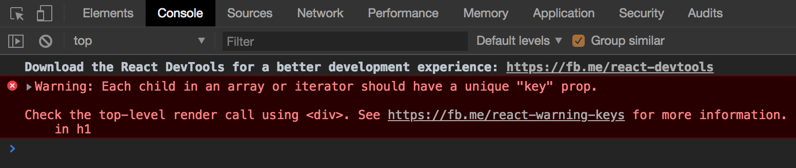
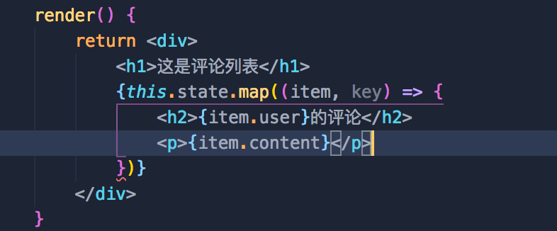
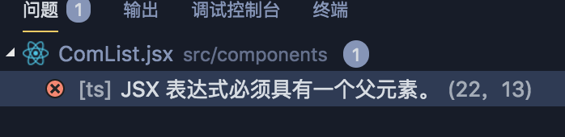

# 杂谈

## 1. 使用 react 开发新的项目

* 安装 create-react-app

  npm install create-react-app --global

* 使用 create-react-app 项目名称

  cd 项目名称

  然后进入项目，npm start

上述方法可以省去配置快速生成一个 React 项目，这个命令启动一个开发模式的服务器，同时也会让你的浏览器自动打开一个网页，指向本机的 http://localhost:3000/ 。

# 传智 React

## 1. 在项目中使用 react

1. 运行 npm i react react-dom -S 安装包
   * react： 专门用于创建组件和虚拟DOM的，同时组件的生命周期都在这个包中。
   * react-dom：专门进行 DOM 操作的，最主要的应用场景，就是 ReactDOM.render()。把虚拟 DOM 放到页面上去的。

```javascript
import React from 'react';
import ReactDom from 'react-dom';
// 必须要大写命名

//2.创建虚拟 DOM 元素
// 参数1：创建的元素的类型（字符串），表示元素的名称
// 参数2：对象或者null，表示当前这个 DOM 的属性
// 参数3：子节点（包括其他 虚拟 DOM 或者文本子节点）
// 参数n: 其他子节点
// 例如： <h1 id='myh1' title='hhh'>这是h1</h1>
//const myh1 = React.createElement('h1', null, '6666');
const myh1 = React.createElement('h1', {id: 'myh1', title: 'hhh'}, '6666')

// 3. 使用 ReactDOM 把虚拟 DOM 渲染到页面上
// 参数1. 要渲染的那个虚拟 DOM 元素
// 参数2. 指定页面上的一个容器（页面上的 DOM 元素）
ReactDOM.render(myh1, document.getElementById('app'));
```

## 2. JSX 语法

* 在 js 中混合写入类似于 HTML 的语法，叫做 JSX 语法；符合 XML 规范的 JS。（语法格式比 HTML 严谨）
* JSX 的本质还是在运行的时候，被转换成了 React.reactElement 形式来执行

### 1. 如何启用 JSX 语法

* 安装 babel 插件

  * 运行 npm i babel-core babel-loader babel-plugin-transform-runtime -D
  * 运行 npm i babel-preset-env babel-preset-stage-0 -D  （此处针对react）

  注意： preset 的包代表语法

* 安装能够识别转换 jsx 语法的包 babel-preset-react

  * 运行 npm i babel-preset-react -D

#### 配置babel

webpack 启用第三方工具需要装载（loader），配置 loader。

* webpack 默认只能打包处理 .js 后缀名类型的文件；像 .png .vue 无法主动处理，所以要配置第三方的 loader；.js 文件中识别不了的语法也会处理。

方法：

1. 在 webpack.config.js 文件中的 exports 对象中添加如下属性。（第三方工具的配置都在此）

```javascript
module: { //所有第三方模块的配置规则
    rules: [ // 第三方匹配规则
        { test: /\.js|jsx$/,use: 'babel-loader', exclude: /node_modules/ },//千万别忘记添加 exclude 排除项
    ]
}
```

注意： 在 exports 对象中 加 s 的都为数组， 不加s 的属性为对象。

2. 新建 .babelrc 文件

   是JSON 配置文件(把所有的语法模块和插件等都配置到这里面)

   ```javascript
   {
       "presets": ["evn", "stage-0", "react"],
        "plugins": ["transform-runtime"]   
   }
   ```

### 2. Jsx 语法使用

1. 在 jsx 中混合写入 js 表达式：在 JSX 语法中，要把JS 代码写到 {} 中

   * 渲染数字  let x=10;  {x + 2}

   * 字符串 {str}

   * 布尔值 需要转换为字符串输出，不直接输出

   * 为元素绑定属性

   * 渲染JSX 元素

     定义一个 元素

     const h1 = <h1>h1元素</h1>

     渲染到页面上和 js 代码的使用 一样

   * 渲染 JSX 元素数组

     定义一个 const arr = [

     ​	<h1>h1元素</h1>,

     ​	<h1>h222元素</h1>

     ]

     渲染到页面上

   * 将普通字符串数组，转为 JSX 数组并渲染到页面上 【两种方法】

     const arrStr = ['111', '222', '333'];

     1. for 循环

        ```jsx
        const nameArr = [];
        arrStr.forEach(item => {
            const temp = <h5>{item}</h5>  //一定要记住用对象接受
            nameArr.push(temp)
        })
        ```

     2. 内部进行 for 循环，使用数组 map 方法

   当我们需要在 JSX 控制的区域内，写 js 表达式就应该使用 {} 包括 JS 代码。

   注意： 

   1. 在 JSX 语法中写 HTML 元素属性的时候如果用 style 来实现，里面的属性名称需采用驼峰命名。

      ```javascript
      <View style={{alignItems: 'center'}}> </View>
      ```

      单独的属性也必须要使用 驼峰命名

      ```javascript
      <h1 className='h1'></h1>
      ```

   2. 使用遍历数组的方法时，需要给每个元素加上 key，绑定每个元素的状态，防止状态被其他元素取代。例如上面的将字符串数组渲染到页面上。

      

      * 需要把 key 添加给被 forEach 或 map 或 for 循环直接控制的元素。就是给每一个被遍历的 jsx 对象一个 key。被遍历的最外层的元素。

        ```javascript
        const arrStr = Array.from(arr, (item, key) =><h1 key={key}>{item}</h1>)
        ```

        直接 key = {} 的形式。

2. 在 jsx 语法中写注释

   ```jsx
   <h5>{/*我是注释*/}</h5>
   ```

3. 为 jsx 中的元素添加 class 类名：需要使用 `className` 俩替代 class ; htmlFor 替换label 的 for 属性。

   主要是为了避免与 JS 中的 class 和 for 循环中的 for 混淆。

4. 在 JSX 创建DOM的时候，所有的节点，必须有唯一的根元素进行包裹。所以需要 ID。

### 3. 创建组件的两种方式

#### 3.1 第一种创建组件的方式

```javascript
function Hello() {
    // return null  //什么都不返回，不渲染任何东西
    return <div>Hello 组件</div>
}

```

一个构造函数，return 一个合法的 JSX 元素

使用组件：

<Hello> </Hello>

直接把组件名称以标签的形式放到页面上。

* 给组件添加属性

  ```jsx
  function Hello(props) {
      // return null  //什么都不返回，不渲染任何东西
      console.log(props)
      return <div>Hello 组件---{props.name}</div>
  }
  ```

  props参数用来接收属性对象，表示该组件的所有属性。

  可以在使用组件的时候加属性。接受的属性对象在组件的内容中使用。

  <Hello name={dog.name}> </Hello>

  注意：

  * props 所有元素都是只读的，不能够更改。Vue 中的 props 也是只读的。
  * ==组件的首字母必须要大写，要不然会被当做一个普通的标签来解析。==
  * 这种定义组件的方式只能够通过props 属性参数的方式来接收传入的数据。

  对象的扩展符赋值：

  ```jsx
  function Hello (props) {
      return <div>这是自定义的 Hello 组件--{props.name}--{props.age}</div>
  }
  const obj = {
      name: 'zzz',
      age: 15
  }
  
  ReactDOM.render(<Hello {...obj}></Hello>, document.getElementById('app'))
  ```

* 注意需要将组件单独建一个文件。一定要在 src 下新建，比如新建一个 components 文件夹

  * 将组件放在一个 jsx 文件中，不做单独配置，引入时不能省略 .jsx

  * 如果需要不写 .jsx 后缀名，需要在 webpack 的配置文件中导出的对象中添加

    resolve: {

    ​	extensions: ['.js', '.jsx', '.json']  // 表示不写后缀名添加后缀名的顺序，顺序添加查找对应文件。默认省略 .js 和 .json 文件。

    }

    ```javascript
    const path = require('path')
    const HtmlWebPackPlugin = require('html-webpack-plugin') //导入自动生成 index 页面的插件
    //创建一个插件的实例对象
    const htmlPlugin = new HtmlWebPackPlugin({
        template: path.join(__dirname, './src/index.html'),//源文件
        filename: "index.html" // 生成的内存中首页的名称
    }) 
    
    module.exports = {
        mode: 'development',
        plugins: [
            htmlPlugin
        ],
        module: { //所有第三方模块的配置规则
            rules: [ // 第三方匹配规则
                { test: /\.js|jsx$/,use: 'babel-loader', exclude: /node_modules/ }//千万别忘记添加 exclude 排除项
            ]
        },
        resolve: {
            extensions: ['.js', '.jsx', '.json']
        }
    }
    ```

    

* 在引入组件的时候，有的时候路径前面不用 ./ 的形式用的是 @

  例： @/components/Hello   引入Hello 组件

  此时， @  代表项目根目录中的src 这一层目录。

  需要在 webpack  中进行配置，在 配置文件中 的 resolve 对象中加入属性 alias(别名)

  Alias: {

  ​	'@': path.join(__dirname, './src') //这样 @ 就表示项目根目录中的 src 这一层目录。

  }

#### 3.2 第二种创建组件的方法

使用 class 来创建组件

1. 最基本的组件结构

   ```jsx
   class 组件名称 extends React.Component{
       render() {
           return <div>这是 class 创建的组件 </div>
       }
   }
   ```

   组件内部必须有 render 函数，render 函数中必须返回合法的 JSX 虚拟 DOM 结构。render 函数的作用就是渲染当前组件所对应的 虚拟 DOM 元素。

   自定义组件必须要继承 React.Component 类，或者 继承 Component，后者是对象姐结构赋值，解构出来的。

* ***注意：***
  1. 在使用组件的时候相当于实例化了定义的组件（类），传递参数就是 {obj} 的形式。每使用一次就相当于 new 了一次。
  2. 无论采用哪种方式创建组件，他们的props 都是只读的，不能改变里面的属性。
* 在 class 创建的组件中，使用传递的 props 参数，不需要接收，直接在组件内 使用 this.props.属性名 的形式来使用。

#### 3.3 两种创建组件方式的对比

* 使用 class 关键字创建的组件，有自己私有的数据，但是使用 function 创建的组件，只有 props ，没有自己私有的数据和生命周期函数。

  1. 用 构造函数 创建出来的组件： 叫做“无状态组件”

  2. 用class关键字创建出来的组件，叫做“有状态组件”

  3. 什么情况下使用有状态组件？什么情况下使用无状态组件。最多使用的是有状态组件。

     * 区别就是有误 state 组件和有无生命周期函数
     * 如果一个组件需要自己的私有数据，推荐 class 创建的有状态组件，反则推荐无状态组件。
     * React 官方说：无状态组件由于没有自己的 state 和生命周期，运行效率较高。

  4. 组件中的 props 和 state（vue 中的 data）之间的区别

     props 中的数据都是实例化的时候传递过来的；

     state 中的数据，都是组件私有的：（通过 ajax 获取回来的数据，一般都是私有数据）

     props 中的数据都是只读的；state 中的数据 是可读可写的。

* props 中的数据是通过调用组件的时候（实例化）来传入的，state 中的数据是定义组件的使用在构造函数中创建的数据。props 中的数据甚至不能再构造函数中 使用 this.props.name = 'zzz'  的形式来设置。

* 需要在使用的新组件上传递属性值，一般使用 props 来传递；获取到后台的数据(通过 ajax 获取到的)在页面上渲染出来，一般使用 state 来传递数据。

* props 的数据是组件的属性，是能够在标签的属性位置使用的；state 只是组件的数据。当然 props 中也能够存储需要的数据。

#### 3.4 state

* state 中的数据是可读可写的。组件绑定的 ==私有数据== 。state 中的数据就是该组件的私有数据。

state 的使用方式：

```javascript
 constructor () {
        super();
        this.state = {
            gender: '男'
        }
    }
```


JSX 注意事项：

* JSX 一定要有一个父元素来包含它的结构。尤其在循环遍历的解构中，每一个循环都应该有一个父元素来包括。

   

  

  如上图，循环结构的外层必须有一个父元素来包含，才能赋值一个 key 确保位置属性的不变。

* JSX 的原则就是 JS 中可以使用 xml ，而 xml 中不能直接使用 JS。和模板引擎是有区别的。

非常重要的注意：

* 组件的使用就是它的实例化，<ComList {...obj}></ComList> 形式的使用，就是给它的实例化对象传递了一个值，相当于 new ComList(...obj) ，必须要 ...obj 形式来传值，因为这个位置只能够接收 key value 的形式的值。组件的实例化传递的值一定是传给了 props 对象，可以通过 constructor 函数来接收到 props 对象，对 state 对象进行赋值。

#### 3.3 在 JSX 中添加样式

* 样式 style={{color:'red'}}

  最外边的一层 {} 代表要使用 js 代码，里面的一层代表一个对象。

  注意： 对象里面的属性都采用驼峰命名的形式，例如 fontSize 。在行内样式中，如果是数值类型的样式，则可以不用引号包裹，如果是字符串类型的样式值，则必须使用引号来包裹。在对象中一般不适用 中间加 - 的形式。

* 第一层封装，将样式结构和 UI 结构分离，样式可以封装成为一个对象

* 第二层封装，合并成为一个大的样式对象。

* 第三层封装，样式可以抽离为单独的样式表 模块。

##### 3.3.1 将样式封装为 样式表 模块

在 src 下新建一个一个 css 文件夹，在文件夹中写入样式  .css 文件。这样就可以保持css 文件的书写格式。

* 在组件模块中导入样式表

  webpack 默认处理不了后缀名为 css 的文件，需要加loader css 处理工具。

  安装工具： npm i style-loader css-loader -D

  配置： 在 rules 数组中➕添加一项

  ```javascript
  {test: /\.css$/,use: ['style-loader', 'css-loader']} //打包处理 css 样式表的第三方loader，此处赢一个数组来配置多个选项。
  // 执行过程，找到 .css 文件会来此处查找是否有 处理该文件的方式，找到该数组，先从最后数组一项找工具，最后一个工具处理完成，再交给前一项工具来处理，直到第一项工具处理完成，打包合并。
  // 注意： -loader 不能够省略
  ```

* 样式表模块的使用过程

  在样式模块中添加 class 选择器，添加样式。在当前组件模块引入该样式

  import style.css 

  在组件上直接添加 clssName = 'title'  //title 为 calss 选择器的名称

##### 样式表的全局冲突问题

* 注意： 上述方式导入的 css 样式表对所有模块都会生效，作用域为全局。因为在打包之后，样式会对整个页面的html 元素生效。样式表没有作用域！
* 样式表的全局表现容易出现使用冲突的情况（类似全局污染，变量冲突无法再使用该变量）。不能实现一个组件引入一个样式的形式。
* == Vue 中的样式表也有冲突的问题，但是可以使用 <style scoped></style> 来解决，为 css 提供一个作用域 ==
* == 模块化的思想一定要向外暴露一个成员方便其他模块的使用 ==
* React 没有指令的概念，因此没 scoped 。

###### 问题的解决

* React 给 css 文件启用模块化来解决 css 文件的作用域问题。

* 在 webpack 配置文件中找到  .css 文件的处理代码。给该处理工具追加参数。（和浏览器地址栏添加参数的方式一样 ?  &）

  css 处理工具   css-loader?modules   为css 启用模块化。 

* 修改配置文件之后一定要重新启动服务器。

###### 样式表启用模块化

引入： 在 js 中引入 css 文件就能够使用模块化的方式

import obj from style.css

导入的 obj 是一个类名 ：真实类名字符串  的形式。

例如：css 文件中 有 title 这个 class 

​	obj 中就有 title 这个元素对应一个真实的类名字符串

使用： 在组件标签上使用类

​	<div className={obj.title}></div>

这样样式表就只能在导入它的组件中使用了

注意：css 模块化只针对 类选择器 和 ID 选择器生效，不会对标签选择器生效。

###### 使用 localIdentName 自定义生成的类名格式

可选的参数有：

* [path] 表示样式表相对于项目根目录 所在路径
* [name] 表示样式表文件名称
* [local] 表示样式的类名定义名称
* [hash:length] 表示 32 位的hash 值
* 例子：`{test:/\.css$/, use: ['style-loader', 'css-loader?modules&localIdentName=[path][name]-[local]-[hash: 5]']}`

这个配置主要是为了设置引入的 css 对象中每个生成的类名的格式。

比如 import cssobj from style.css

cssobj 里面的 title（和css文件中定义类名一致）对应的类名 就为 src-css- 为path 设置的当前相对路径。name 为 style 对应的是该文件名，表示要包含当前文件名。local 为这个类本来的名称，比如 .title  表现为 src-css-style-title ，表示包含本身类名。设置过程中的 - 是拼接的，为了好看。hash 是为了防止类名重复，一般只取到前5位即可，默认32位，hash: 5。

以后使用直接复制上面的代码即可。 

*******

# 书上的 React

## 1. 增加一个新的 React 组件

* React 的首要思想就是 通过组件（component）来开发应用。所谓组件，简单就是说，指的是能完成某个特定功能的<u>独立的</u>、<u>可重复用的</u>代码。
* 在开发的过程中我们主要关注 src 目录中的内容，这个目录中存放着所有的源码。
* 应用的入口文件时 src/index.js 文件。
* 新建一个React 项目的情况：


引入的模块

```javascript
import React, {Component} from 'react'
```

Component 模块是所有组件的基类，提供了很多组件共有的功能。创建一个新的组件必须要引入这个类。

注意：

* React 判断一个元素是 HTML 元素还是 React 组件的原则就是看第一个字母是否大写。

* JSX 中使用 onClick 的方式给一个元素添加一个事件处理函数，采用驼峰命名的规则。

  ```javascript
  <button onClick={fn}> </button>
  ```

  

