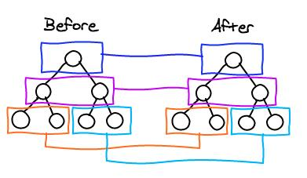

# react 学习笔记

* 在移动开发中，原生的APP 的开发成本较高，但现在还是必须的。因此为Web的用户体验仍无法超越Native（原生）。

  主要体现在：

  Native的原生控件有更好的体验；

  native有更好的手势识别。

  Native 有更合适的线程模式，尽管Web Worker可以解决一部分问题，但如图像解码、文本渲染仍无法多线程渲染，这影响了Web的流畅性。

* react native充分利用了Facebook现有的业务轮子，其核心设计理念：既拥有Native的用户体验，又保留React的开发效率。

* 目前，React Native基本完成了对多端的支持，实现了真正意义上的面向配置开发，开发者可以灵活的使用HTML和CSS布局，使用React语法构建组件，==实现：H5，Android，IOS多端代码的复用==。

  通过JS来封装。

* 广大的开发者可以使用JavaScript和React开发跨平台移动应用。React Native提倡组件化开发，即提供一个个封装好的组件。 

* 更适合前端的开发

React Native的优势：

 1. 跨平台开发

    运用React native，我们可以使用同一份业务逻辑核心代码来创建原生应用运行在web端，Android端和IOS端。

	2. 追求极致的用户体验：实时热部署。

	3. learn once，write everywhere（最具魅力）

    React Native不强求一份原生代码支持多个平台，所以不提"write once,run anywhere(java)"


react刚开始对IOS进行了包装，现在对安卓也进行了包装

## 传智react

* React设计思想及其独特，属于革命性创新，性能出众，代码逻辑却非常简单。可能是将来Web开发的主流工具。
* 首先清楚两个概念
  * library（库）：小而巧，只提供了特定的API；优点是船小好调头，可以很方便的从一个库切换到另一个库，但是代码几乎不会改变。
  * framework（框架）：大而全，框架提供了一整套的解决方案（全家桶）。若果在项目中间，想切换到另外的框架，是比较困难的。

三大框架一大抄

React和vue的对比：

* 模块化：是从代码的角度来进行分析的。把一些课复用的代码，抽离为单个的模块；便于项目的维护和开发。
* 组件化：是从UI界面的角度来进行分析的。把一些可复用的UI元素抽离为单独的组件。
  * 组件：组件可以扩展 HTML 元素，封装可重用的代码。
  * 组件系统让我们可以用独立可复用的小组件来构建大型应用，几乎任意类型的应用的界面都可以抽象为一个组件树，类似于搭积木。
* 组件化的好处：随着项目规模的增大，手里的组件越来越多；很方便就能把现有的组件拼接成一个完成的项目。


react特点：

1. 虚拟DOM，

   数据驱动视图，每次数据变化react都会自动扫描虚拟DOM树，自动计算与上次虚拟DOM的差异变化，然后针对需要变化的DOM部分对浏览器进行DOM更新。（效果就是性能特别好）

2. 组件化开发，把功能进行横向划分，将UI分为不同的组件。vue也是组件化开发。把每个小组件构成一个大组件，然后关联起开。

3. 单项数据绑定。双向虽然便捷，但是在复杂场景下副作用明显。单向数据流，从父节点传向子节点。

### 各种jian

注意：组件（component）是说的结构，html 

​	中间件（middlewares）是一种第三方处理方式 

#### React 实现组件化

注意： React 有组件化的概念，并没有像 vue 这样的组件模板文件；React 中，一起都是 JS 来表现的；因此要学习React ， JS 要合格； ES6 和 ES7（async 和 await） 要会用。

* React 开发移动 APP 要结合 ReactNative。
* React 一切基于 JS 并且实现了组件化开发的思想。

### 虚拟 DOM

* DOM 的本质： 浏览器中的概念，用 JS 对象来表示页面上的元素，并提供了操作 DOM 对象的 API。
* React 中的虚拟DOM： 是框架中的概念，用 程序员JS 对象来模拟 页面上的 DOM 和 DOM嵌套。
* 为什么要实现虚拟DOM （虚拟DOM 的目的）：为了实现页面中 DOM 元素的高效更新。
  * 模板引擎和字符串拼接的形式只是能够渲染到页面，但是每次改变 DOM 都会重新渲染页面。
  * 只需要重新渲染更新的数据所对应的页面元素。性能做到最优。
* DOM 树的概念：一个网页呈现的过程，1、浏览器请求服务器获取页面HTML代码；2、浏览器要先在内存中，解析DOM解构，并在浏览器内存中，渲染出一颗 DOM树；3、浏览器吧 DOM 树，呈现在页面上。
* 获取内存中新旧两颗 DOM 树，进行对比，得到 需要被按需更新的 DOM 元素。
* 如何获取新旧 DOM 树，从而实现 DOM 树的对比？
  * 浏览器并没有直接提供获取 DOM 树的API，因此，我们无法拿到浏览器内存中的 DOM 树。
* 程序员只能手动模拟 新旧两颗 DOM 树；
* 什么是虚拟 DOM ： 用 JS 对象的形式，来模拟页面上 DOM 嵌套关系；（虚拟DOM 是以 JS 对象的形式存在的）。目的就是为了实现页面元素的高效更新。
  * 本质： 用 JS 对象，来模拟 DOM 元素和嵌套的关系。
  * 目的： 实现页面元素的高效更新。

### Diff 算法（different）

* 为了高效寻找新旧树的差异。

1.  tree diff ： 新旧两颗 DOM 树，逐层对比的过程，就是 tree diff；当整棵树 DOM 逐层对比完毕，则所有需要被按需更新的元素，必然能够找到。
2. component diff : 每一层 都是有组件组成的，进行组件级别的对比。
   * 如果对比前后，组件的类型相同，则需要移除旧组件，创建新组件，并追加到页面上。
3. element diff：在进行组件对比的时候，如果两个组件类型相同，则需要进行 元素级别的对比。



*****

## 安装

1. 安装 xcode ，xcode 是开发 IOS app 必备的武器。

   终端： xcode-select --install

2. 安装 homebrew, 苹果电脑开发必备利器，Mac下的包管理工具。一条龙服务，解压安装配置。看官方文档。

3. 安装 watchman 和 flow 

   Watchman 是 Facebook 的一个开源项目，它开源用来监视文件并且记录文件的改动情况。

   Flow 是一个 javascript 的静态类型检查器，用于找出 JavaScript 代码中的类型错误。

   一系列安装：

   brew install watchman flow git gcc pak-config cairo libpng jpeg gitlib mongodb

4. 安装 nvm 包管理器

   官方的安装


* 安装完 yarn 之后就可以使用 yarn 代替npm 了，例如用 yarn 代替 npm install 命令，用 yarn add 某第三方库名 代替 npm install --save 某第三方库名


官方安装（补充）：

1. Android Studio


## 起步

* React 是一个用于构建用户界面的 JavaScript 库
* React 主要是用于构建 UI ，很多人认为 React 是 MVC 中的 V(视图)
* Facebook 内部项目


### 1. 特点

1. React 采用声明规范，可以轻松的描述应用。
2. 高效--React 通过对 DOM 的模拟，最大限度的减少与 DOM 的交互
3. 灵活——React 可以与已知的库或框架很好的配合
4. JSX——JSX 是JavaScript 语法的扩展。建议使用
5. 组件——通过 React 构建组件，使得代码更容易得到复用。能够很好的应用在大项目的开发中
6. 单相应的数据流——React 实现了单向相应的数据流，从而减少了重复代码，这就是它为什么比传统的数据绑定更简单。


## React

### 在项目中使用 React

1. 运行 npm i react react-dom -S 安装包
2. 

*********************

## React Native

### 2. 创建版本

* init 命令会默认创建最新的版本。为了稳定推荐指定 0.44.3 版本

   react-native init MyApp --version 0.44.3

* Genymotion 模拟器的使用

  创建 React Native 应用后，按下 command + M 来打开开发者菜单

* react-native init AwesomeProject   初始化一个项目

  cd AwesomeProject 	进入项目

  react-native run-android  运行项目

* sudo 就是为了取得管理员权限

### 3. 代码结构

* 启动后所有文件打包到 bundle.js 中

  

## 语法

1. 引入需要的模块

   `import React, { Component } from 'react';`是必须的

2. 然后向外暴露一个接口对象

   ```javascript
   export default class HelloWorldApp extends Component {
     render () {
       return (
         <Text>Hello World!</Text>
       )
     }
   }
   ```

   * 该接口需要继承的组件
   * render 方法返回一个 JSX 模板

3. 开发安卓刷新用 rr 键， command + m 打开开发工具

### 1. Props (properties：属性)

大多数组件在创建时就可以使用各种参数来进行定制，用于定制的这些参数就称为 `props`（属性）。

例如：

```javascript
import React, { Component } from 'react';
import { Image } from 'react-native';

export default class Bananas extends Component {
  render() {
    let pic = {
      uri: 'https://upload.wikimedia.org/wikipedia/commons/d/de/Bananavarieties.jpg'
    };
    return (
      <Image source={pic} style={{width: 193, height: 110}} />
    );
  }
}

```

上述 image 组件中，使用到了 props  source 和 style，该组件从 react-native 模块中引入。style 宽高不加 px 。

请注意`{pic}`外围有一层括号，我们需要用括号来把`pic`这个变量嵌入到JSX语句中。括号的意思是括号内部为一个js变量或表达式，需要执行后取值。因此我们可以把任意合法的JavaScript表达式通过括号嵌入到JSX语句中。

{} 可以签入 js 语法，style 样式中用 {{}}

注意：

* import React, {component} from 'react' 从react 模块中引入这两个组件是必须的。
* 样式在定义组件中使用时采用驼峰式命名的，例如 align-items 在组件中需要 alignItems

******

* 自定义组件

自定义的组件必须要继承 Component class。为了提高自定义组件的可复用性，可以使用 this.props（应该是获取到了该组件属性对象）。

例子：

```javascript
class MyComp extends Component {
  render () {
    return (
      <Text>my name is {this.props.name}!</Text>
    )
  }
}
```

上面定义了一个 MyComp 组件，render 方法返回的是它的解构。

自定义组件的名称可以作为 标签被使用。一般作为单闭合标签使用。

### 2. State(状态)

一般使用两种数据来控制一个组件

1. props 是在父组件中指定，而且一经过指定，在被指定的组件的生命周期中则不会再改变。对于需要改变的数据，需要使用 state。

### 常用组件

1. View 组件。

   View 组件常用作其他组件的容器，来帮助控制布局和样式。