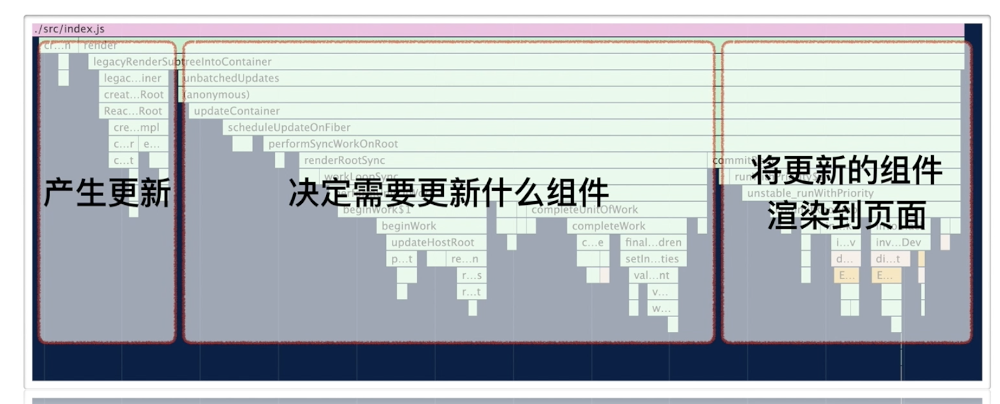
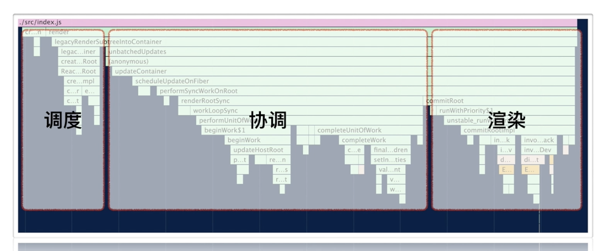
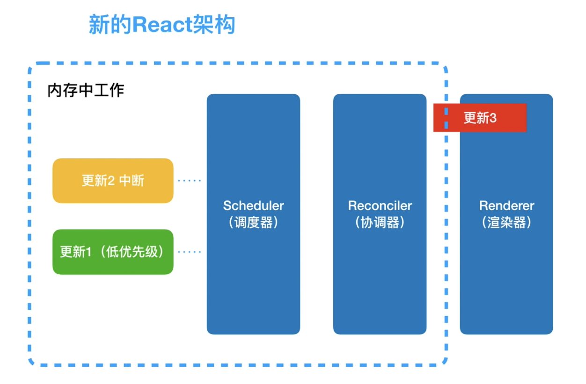
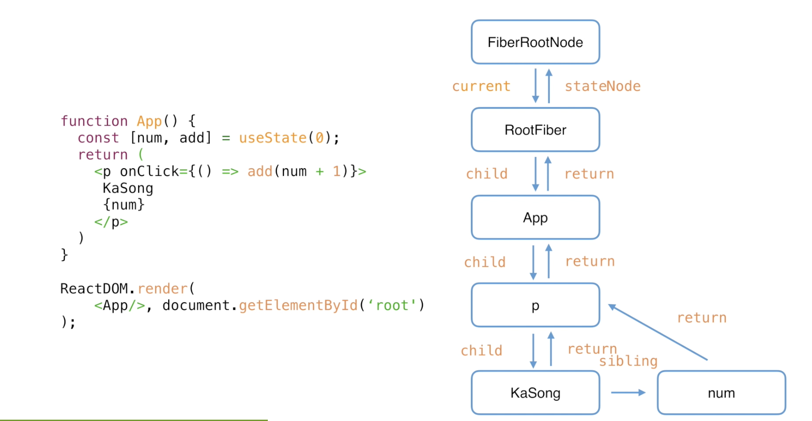
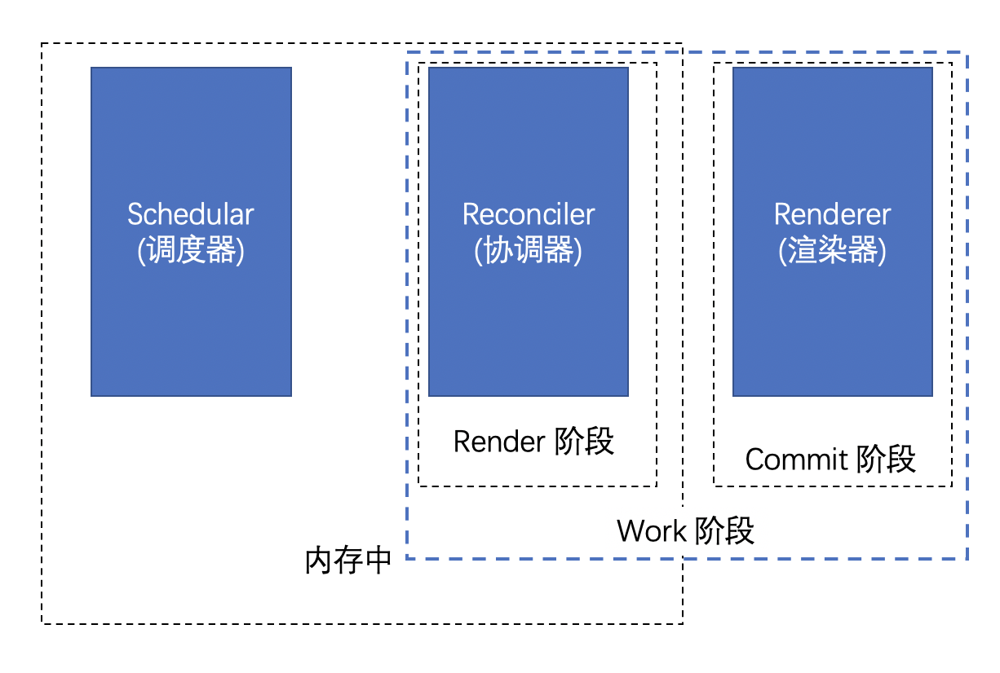
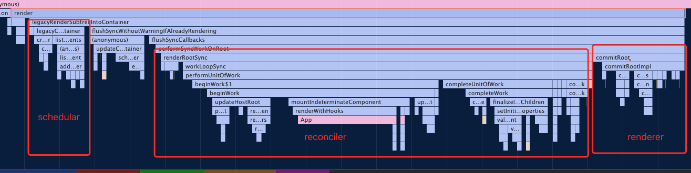
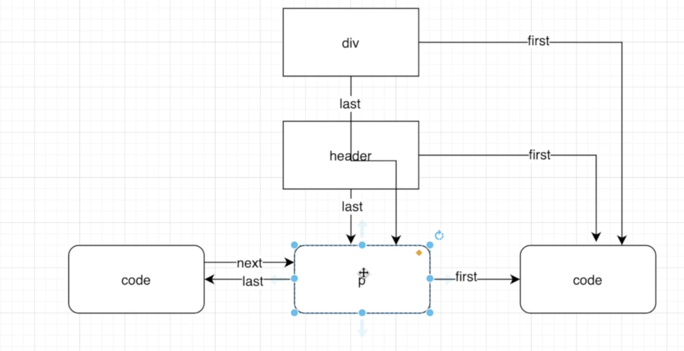
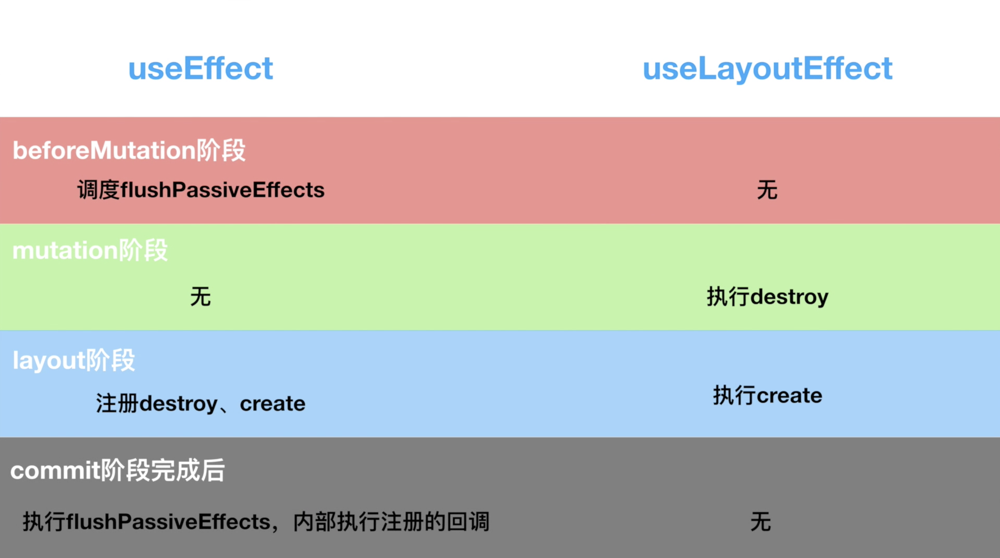

#  0. 前言

* react render 函数执行






# 开始吧

## 哲学

* 快速响应


## react 理念

我们日常使用App，浏览网页时，有两类场景会制约`快速响应`：

- 当遇到大计算量的操作或者设备性能不足使页面掉帧，导致卡顿。
- 发送网络请求后，由于需要等待数据返回才能进一步操作导致不能快速响应。

这两类场景可以概括为：

- CPU的瓶颈
- IO的瓶颈

`React`是如何解决这两个瓶颈的呢？

==我们知道，JS可以操作DOM，`GUI渲染线程`与`JS线程`是互斥的。所以**JS脚本执行**和**浏览器布局、绘制**不能同时执行。==

* 怎么解决 CPU 瓶颈带到快速响应的效果，react 创造了并发的概念，类似于 CPU 的执行——交替执行，处理js的时候能够中断去处理渲染。


* 一般浏览器要求 60hz 的刷新率

  ```text
  1000ms / 60hz = 16.6ms 浏览器刷新一次
  
  js脚本执行 -> 样式布局 -> 样式绘制
  
  react要控制js 脚本执行时间
  
  ```

* react 采用异步更新，使用预留时间去进行工作。

### 怎么解决js执行时间过长

答案是：在浏览器每一帧的时间中，预留一些时间给JS线程，`React`利用这部分时间更新组件（可以看到，在[源码 (opens new window)](https://github.com/facebook/react/blob/1fb18e22ae66fdb1dc127347e169e73948778e5a/packages/scheduler/src/forks/SchedulerHostConfig.default.js#L119)中，==预留的初始时间是5ms==）。

当预留的时间不够用时，`React`将线程控制权交还给浏览器使其有时间渲染UI，`React`则等待下一帧时间到来继续被中断的工作。

> 这种将长任务分拆到每一帧中，像蚂蚁搬家一样一次执行一小段任务的操作，被称为`时间切片`（time slice）


### 前端性能解决，那么网络性能该怎么解决呢？

* 缓存：pwa相关技术，比如 service worker
* http 缓存
* 静态文件cdn加速（基于地理位置加速）

### react 是怎么做的呢？

https://juejin.cn/post/7005484531054542885#heading-0

* 会将一个渲染任务拆分成多个 task(5ms左右)，react会在一帧（16.6ms）中执行一个task，然后交由页面的其他操作。这样就解决了也没卡顿的问题


## 总结

设计理念：快速响应

制约瓶颈：CPU 和 IO

解决方案：==异步可中断==更新

## ==异步可中断==


## 虚拟DOM——VDOM

> vdom是虚拟DOM(Virtual DOM)的简称，指的是用JS模拟的DOM结构，将DOM变化的对比放在JS层来做。VDOM的优势在于将 DOM 的 diff 操作放到 JS 内存中，同时可以做到 DOM 的复用。减少不必要的重绘从而提高效率。

* 先不用直接操作DOM（避免立即刷新），现在js内存中作，减少重绘提高效率

## react 15 架构

React15架构可以分为两层：

- Reconciler（协调器）—— 负责找出变化的组件
- Renderer（渲染器）—— 负责将变化的组件渲染到页面上

### Reconciler（协调器）

我们知道，在`React`中可以通过`this.setState`、`this.forceUpdate`、`ReactDOM.render`等API触发更新。

每当有更新发生时，**Reconciler**会做如下工作：

- 调用函数组件、或class组件的`render`方法，将返回的JSX转化为虚拟DOM。调用 render 方法，转换 JSX 为虚拟 DOM。
- 将虚拟DOM和上次更新时的虚拟DOM对比。diff算法
- 通过对比找出本次更新中变化的虚拟DOM。找到变化的虚拟 DOM
- 通知**Renderer**将变化的虚拟DOM渲染到页面上。渲染到页面。

> 你可以在[这里 (opens new window)](https://zh-hans.reactjs.org/docs/codebase-overview.html#reconcilers)看到`React`官方对**Reconciler**的解释

### [#](https://react.iamkasong.com/preparation/oldConstructure.html#renderer-渲染器) Renderer（渲染器）

由于`React`支持跨平台，所以不同平台有不同的**Renderer**。我们前端最熟悉的是负责在浏览器环境渲染的**Renderer** —— [ReactDOM (opens new window)](https://www.npmjs.com/package/react-dom)。

除此之外，还有：

- [ReactNative (opens new window)](https://www.npmjs.com/package/react-native)渲染器，渲染App原生组件
- [ReactTest (opens new window)](https://www.npmjs.com/package/react-test-Renderer)渲染器，渲染出纯Js对象用于测试
- [ReactArt (opens new window)](https://www.npmjs.com/package/react-art)渲染器，渲染到Canvas, SVG 或 VML (IE8)

在每次更新发生时，**Renderer**接到**Reconciler**通知，将变化的组件渲染在当前宿主环境。

> 你可以在[这里 (opens new window)](https://zh-hans.reactjs.org/docs/codebase-overview.html#renderers)看到`React`官方对**Renderer**的解释

### react 15 架构 缺点

在**Reconciler**中，`mount`的组件会调用[mountComponent (opens new window)](https://github.com/facebook/react/blob/15-stable/src/renderers/dom/shared/ReactDOMComponent.js#L498)，`update`的组件会调用[updateComponent (opens new window)](https://github.com/facebook/react/blob/15-stable/src/renderers/dom/shared/ReactDOMComponent.js#L877)。这两个方法都会递归更新子组件。

* 单个 vDOM，找到差异之后需要立即更新

#### [递归更新的缺点](https://react.iamkasong.com/preparation/oldConstructure.html#递归更新的缺点)

由于递归执行，所以更新一旦开始，中途就无法中断。当层级很深时，递归更新时间超过了16ms，==用户交互就会卡顿。==

这一点可以看下深度优先遍历算法（最大只能中断一条线向下执行）

## react 16 架构

React16架构可以分为三层：

- Scheduler（调度器）—— 调度任务的优先级，高优任务优先进入**Reconciler**。
- Reconciler（协调器）—— 负责找出变化的组件
- Renderer（渲染器）—— 负责将变化的组件渲染到页面上

具体执行原理：https://ke.segmentfault.com/course/1650000023864436/section/1500000023865295

原理：



* scheduler 和 reconciler 都在内存中执行
* 当有优先级高的任务进入时，会中断之前的任务。因为在内存中执行，用户不会感知。

### 更新流程


### 与react15 中 reconciler 的区别

我们知道，在React15中**Reconciler**是递归处理虚拟DOM的。让我们看看[React16的Reconciler (opens new window)](https://github.com/facebook/react/blob/1fb18e22ae66fdb1dc127347e169e73948778e5a/packages/react-reconciler/src/ReactFiberWorkLoop.new.js#L1673)。

我们可以看见，更新工作从递归变成了==可以中断的循环过程==，取代递归执行?。每次循环都会调用`shouldYield`判断当前是否有剩余时间。

```js
/** @noinline */
function workLoopConcurrent() {
  // Perform work until Scheduler asks us to yield
  while (workInProgress !== null && !shouldYield()) {
    workInProgress = performUnitOfWork(workInProgress);
  }
}
```

那么React16是如何解决中断更新时DOM渲染不完全的问题呢？

在React16中，**Reconciler**与**Renderer**不再是交替工作。当**Scheduler**将任务交给**Reconciler**后，**Reconciler**会为变化的虚拟DOM打上代表增/删/更新的标记，类似这样：

```js
export const Placement = /*             */ 0b0000000000010;
export const Update = /*                */ 0b0000000000100;
export const PlacementAndUpdate = /*    */ 0b0000000000110;
export const Deletion = /*              */ 0b0000000001000;
```

> 全部的标记见[这里(opens new window)](https://github.com/facebook/react/blob/1fb18e22ae66fdb1dc127347e169e73948778e5a/packages/react-reconciler/src/ReactSideEffectTags.js)

整个**Scheduler**与**Reconciler**的工作都在内存中进行。只有当所有组件都完成**Reconciler**的工作，才会统一交给**Renderer**。

> 你可以在[这里 (opens new window)](https://zh-hans.reactjs.org/docs/codebase-overview.html#fiber-reconciler)看到`React`官方对React16新**Reconciler**的解释


#### 总结

1. 实现方法发生了变化，采用 while 取代 递归，变为可中断的
2. 调用  shouldYield 判断是否有空闲时间
3. reconciler 不再是交替执行，而是受到 scheduler 的任务后，在虚拟DOM 上打标机。异步可中断，就是在 shouldyield 那段时间内，执行一点（cpu层面的交替执行），直到执行完成。

==从`React15`到`React16`，协调器（`Reconciler`）重构的一大目的是：将老的`同步更新`的架构变为`异步可中断更新`。==

### reconciler

* fiber  中的 reconciler 是 fiber reconciler
* React 15 采用递归，是 stack reconciler

### renderer 的区别

其中红框中的步骤随时可能由于以下原因被中断：

- 有其他更高优任务需要先更新
- 当前帧没有剩余时间

由于红框中的工作都在内存中进行，不会更新页面上的DOM，所以即使反复中断，用户也不会看见更新不完全的DOM（即上一节演示的情况）。

> 实际上，由于**Scheduler**和**Reconciler**都是平台无关的，所以`React`为他们单独发了一个包[react-Reconciler (opens new window)](https://www.npmjs.com/package/react-reconciler)。你可以用这个包自己实现一个`ReactDOM`，具体见**参考资料**


### 总结

通过本节我们知道了`React16`采用新的`Reconciler`。

==`Reconciler`内部采用了`Fiber`的架构。==


## fiber

> fiber：纤程。纤维。也是协程的一种实现
>
> * 为什么不用 generator？
>   1. 有传染性
>   2. 更新可以中断，高优先级能够中断低优先级的更新（generator 不能实现）
>
> process: 进程
>
> thread：线程
>
> coroutine：协程：js 中 generator
>
> * 操作系统中程序执行过程


### 代数效应

#### 在react中的使用

从`React15`到`React16`，协调器（`Reconciler`）重构的一大目的是：将老的`同步更新`的架构变为`异步可中断更新`。

`异步可中断更新`可以理解为：`更新`在执行过程中可能会被打断（浏览器时间分片用尽或有更高优任务插队），当可以继续执行时恢复之前执行的中间状态。


### fiber 与 代数效应

在很多文章中将`纤程`理解为`协程`的一种实现。在`JS`中，`协程`的实现便是`Generator`。

所以，我们可以将`纤程`(Fiber)、`协程`(Generator)理解为`代数效应`思想在`JS`中的体现。

`React Fiber`可以理解为：

`React`内部实现的一套状态更新机制。支持任务不同`优先级`，可中断与恢复，==并且恢复后可以复用之前的`中间状态`。==

其中每个任务==更新单元为`React Element`对应的`Fiber节点`==。

* fiber 任务中断之后能够复用之前的中间状态
* 每个任务的更新单元为 React Element 对应的 `fiber node`


###  Fiber的含义

`Fiber`包含三层含义：

1. 作为架构来说，之前`React15`的`Reconciler`采用递归的方式执行，数据保存在递归调用栈中，所以被称为`stack Reconciler`。`React16`的`Reconciler`基于`Fiber节点`实现，被称为`Fiber Reconciler`。

2. 作为静态的数据结构来说，每个`Fiber节点`对应一个`React element`，保存了该组件的类型（函数组件/类组件/原生组件...）、对应的DOM节点等信息。==fiber  节点对应 react 组件==

   这时的 fiber 节点就是所说的虚拟 DOM

3. 作为动态的工作单元来说，每个`Fiber节点`保存了本次更新中该组件改变的状态、要执行的工作（需要被删除/被插入页面中/被更新...）。


### fiber 作为静态数据结构

```jsx
import React from 'react';
import ReactDOM from 'react-dom';
import './index.css';
import App from './App';
import reportWebVitals from './reportWebVitals';

ReactDOM.render(
  <React.StrictMode>
    <App>
      <div>111</div>
      <div>111</div>
    </App>
  </React.StrictMode>,
  document.getElementById('root')
);

ReactDOM.render(
  <React.StrictMode>
    <App>
      {
        console.log('执行')
      }
      <div>222</div>
      <div>222</div>
    </App>
  </React.StrictMode>,
  document.getElementById('root1')
);

// If you want to start measuring performance in your app, pass a function
// to log results (for example: reportWebVitals(console.log))
// or send to an analytics endpoint. Learn more: https://bit.ly/CRA-vitals
reportWebVitals();

```

* 由于react 可以挂载多个应用。它有一个 `FiberRootNode` 来管理react应用。只能有一个 `FiberRootNode`。==第一次 ReactDOM.render 的时候就会创建 fiberRootNode， 每次调用 render会调用当前app的根节点==
* 每个应用有一个 `RootFiber` 根节点。

> 单词：static、stack、struct




* 如果只作为数据结构就和另一种静态的数据结构没什么区别——JSX。

* JSX 会被编译成 ReactElement

  

==fiber.stateNode 存放着component的实例==。或者 hostComponent 的真实 DOM 

```jsx

function FiberNode(
  tag: WorkTag,
  pendingProps: mixed,
  key: null | string,
  mode: TypeOfMode,
) {
  // 作为静态数据结构的属性
  // instance，作为静态节点属性
  // Fiber对应组件的类型 Function/Class/Host...
  this.tag = tag; // tag : classComponent、functionComponent、HostComponent

  // key属性
  this.key = key;
  // 大部分情况同type，某些情况不同，比如FunctionComponent使用React.memo包裹
  this.elementType = null;
  // 对于 FunctionComponent，指函数本身，对于ClassComponent，指class，对于HostComponent，指DOM节点tagName
  this.type = null;
  // Fiber对应的真实DOM节点
  this.stateNode = null;

  // 用于连接其他Fiber节点形成Fiber树
  this.return = null;
  this.child = null;
  this.sibling = null;
  this.index = 0; // 对于同级的 DOM 来说，代表插入DOM索引

  this.ref = null;

  // 作为动态的工作单元的属性，effect 代表副作用
  this.pendingProps = pendingProps; // 创建时候这个就是要处理的 props
  this.memoizedProps = null;
  this.updateQueue = null; // 存放更新队列的地方
  this.memoizedState = null; // 本次更新的 state。如果是 FC 就存放着 hooks，hooks 的依赖数据也是在这里保存
  this.dependencies = null;

  this.mode = mode;

  // 当前 fiber 与 下一个有 effectTag 的联系
  this.effectTag = NoEffect;
  this.nextEffect = null;

  this.firstEffect = null;
  this.lastEffect = null;

  // 调度优先级相关
  this.lanes = NoLanes;
  this.childLanes = NoLanes;

  // 指向该fiber在另一次更新时对应的fiber
  this.alternate = null;
}
```


### 做为动态工作单元

==一个 fiber 节点可以看做一个工作单元。== Fiber 节点是react的最小可调度单元，可以理解为`虚拟DOM节点`。


### 更新流程

为了解决diff流程不可中断的问题，fiber 将整个更新流程分为了两步

1. **Render阶段: 异步可中断的** **diff** **新老** **DOM**，找到差异后并不及时立刻更新。而是对该 Fiber 节点打上一个`tag(Update, Placement, Delete)`。

2. **Commit阶段:** 遍历存在 tag 的 Fiber ，根据 tag 的类型执行对应的 DOM 更新。

打tag，在commit阶段遍历存在tag的fiber，更新DOM


* 该架构最大的优势在于将 diff 和 渲染的流程分开。并基于 Schedule 实现异步可中断，解决了 复杂运算 大量占用 JS线程 的问题。

### 总结

通过上一节的学习，我们了解了`Fiber`是什么，知道`Fiber节点`可以保存对应的`DOM节点`。

相应的，`Fiber节点`构成的`Fiber树`就对应`DOM树`。

## fiber 架构工作原理

* 为什么要双fiber树，就是为了避免卡顿

### 怎么发展来的

* 正常的思路都是会新建一个不挂载在页面上的一个DOM元素，然后进行计算，最后再渲染
* fiber觉得计算DOM这一步也可以拆分了

### 双缓存

当我们用`canvas`绘制动画，每一帧绘制前都会调用`ctx.clearRect`清除上一帧的画面。

如果当前帧画面计算量比较大，导致清除上一帧画面到绘制当前帧画面之间有较长间隙，就会出现白屏。

为了解决这个问题，我们可以在内存中绘制当前帧动画，绘制完毕后直接用当前帧替换上一帧画面，由于省去了两帧替换间的计算时间，不会出现从白屏到出现画面的闪烁情况。

==这种**在内存中构建并直接替换**的技术叫做[双缓存 (opens new window)](https://baike.baidu.com/item/双缓冲)。==

`React`使用“双缓存”来完成`Fiber树`的构建与替换——对应着`DOM树`的创建与更新。


###  双缓存Fiber树(静态数据结构层面)

* ==current fiber tree & workInProcess fiber tree==。current fiber 可以理解为页面上正在展示的 fiber 树， workinprocess fiber 就是==内存中==正在执行的 fiber tree

在`React`中最多会同时存在两棵`Fiber树`。当前屏幕上显示内容对应的`Fiber树`称为`current Fiber树`，正在内存中构建的`Fiber树`称为`workInProgress Fiber树`。

`current Fiber树`中的`Fiber节点`被称为`current fiber`，`workInProgress Fiber树`中的`Fiber节点`被称为`workInProgress fiber`，他们通过`alternate`属性连接。

```js
currentFiber.alternate === workInProgressFiber;
workInProgressFiber.alternate === currentFiber;
```

`React`应用的根节点通过使`current`指针在不同`Fiber树`的`rootFiber`间切换来完成`current Fiber`树指向的切换。

### mount

* 由于是首屏渲染，页面中还没有挂载任何`DOM`，所以`fiberRootNode.current`指向的`rootFiber`没有任何`子Fiber节点`（即`current Fiber树`为空）。

* 接下来进入`render阶段`，==根据组件返回的`JSX`在内存中依次创建`Fiber节点`并连接在一起构建`Fiber树`==，被称为`workInProgress Fiber树`。（下图中右侧为内存中构建的树，左侧为页面显示的树）

  在构建`workInProgress Fiber树`时会尝试复用`current Fiber树`中已有的`Fiber节点`内的属性，在`首屏渲染`时只有`rootFiber`存在对应的`current fiber`（即`rootFiber.alternate`）。==如果复用，就要使用 alternate 属性建立连接==

  

* 图中右侧已构建完的`workInProgress Fiber树`在==`commit阶段`==渲染到页面。

  此时`DOM`更新为右侧树对应的样子。`fiberRootNode`的`current`指针指向`workInProgress Fiber树`使其变为`current Fiber 树`。

### update

1. 和`mount`时一样，`workInProgress fiber`的创建可以复用`current Fiber树`对应的节点数据。

> 这个决定是否复用的过程就是==Diff算法==，后面章节会详细讲解

2. `workInProgress Fiber 树`在`render阶段`完成构建后进入`commit阶段`渲染到页面上。渲染完毕后，`workInProgress Fiber 树`变为`current Fiber 树`。


### 工作流总结



- ==`Reconciler`工作的阶段被称为`render`阶段。因为在该阶段会调用组件的`render`方法。==

  `源码中是 renderRootSync 方法`（==在 performance 中查看==）

- ==`Renderer`工作的阶段被称为`commit`阶段。==就像你完成一个需求的编码后执行`git commit`提交代码。`commit`阶段会把`render`阶段提交的信息渲染在页面上。

- `render`与`commit`阶段统称为`work`，即`React`在工作中。相对应的，如果任务正在`Scheduler`内调度，就不属于`work`。

在`架构篇`我们会分别讲解`Reconciler`和`Renderer`的工作流程，所以章节名分别为`render阶段`和`commit阶段`。


## 源码目录结构

```text
根目录
├── fixtures        # 包含一些给贡献者准备的小型 React 测试项目
├── packages        # 包含元数据（比如 package.json）和 React 仓库中所有 package 的源码（子目录 src）
├── scripts         # 各种工具链的脚本，比如git、jest、eslint等
```

## 问题总结

1. ==react 目录下的api是不是都要试一下==

2. yarn link 不需要了解一下？


## 源码执行调用栈




# 源码预热

## tag

reactWorkTags.js

* classComponent
* functionComponent
* hostComponent


## 源码切换某个分支 tag

https://www.jianshu.com/p/d536769b12af


## JSX

> 在 babel 中添加 transform-react-jsx 能够实时编译。
>
> 待有关 \__DEV\__ 是 开发环境进入

* 写一个 jsx 最终会编译成为 `React.createElement` 函数执行

  ```jsx
  <div>111</div>
  
  React.createElement("div", null, "111");
  ```

* React.createElement 方法存在于 源码中 react -> src -> ReactElement.js 中

### createElement

```jsx
export function createElement(type, config, children) {}
```

* 接受三个参数
* 在 react 中有对应 DOM 节点的都叫 hostComponent
* config 就是节点的 attr 属性

#### 注意：

1. type 普通dom元素接收的就是普通元素的字符串，自定义 class component 接受的是component 对象，所以能够直接使用 type 处理 defaultProps

   [babel测试](https://www.babeljs.cn/repl#?browsers=&build=&builtIns=false&corejs=3.6&spec=false&loose=false&code_lz=MYGwhgzhAECC0FMAeAXBA7AJjASgswKAdAMID2AtgA5noYrQDeAUAJABOGmC7AFAJRNm0EdA4IUAV3bpoAclhzhogL7M1zTQB5MASwBu0UJAgA5MBQQBeAERoIKG9ADWCAJ62AjDYB8y1lqwAPR-AXr6PgBM0VpB4aE6BlExcUnMsfFAA&debug=false&forceAllTransforms=false&shippedProposals=false&circleciRepo=&evaluate=true&fileSize=false&timeTravel=false&sourceType=module&lineWrap=true&presets=react%2Cstage-2&prettier=true&targets=&version=7.14.3&externalPlugins=%40babel%2Fplugin-transform-react-jsx%407.14.5)

   ```jsx
   class A extends React.Component {
   	render() {
       	return 'A'
       }
   }
   
   
   
   <div className="test" key="1">
     	<A/>
   	<div>222</div>
   	<div>222</div>
   </div>
   
   
   // parse
   React.createElement(
     "div",
     {
       className: "test",
       key: "1"
     },
     /*#__PURE__*/ React.createElement(A, null),
     /*#__PURE__*/ React.createElement("div", null, "222"),
     /*#__PURE__*/ React.createElement("div", null, "222")
   );
   
   ```

   

#### 1. $$typeof

* $$typeof 用来判断一个 对象是否是合法的React Element。

  > 可以看到，`$$typeof === REACT_ELEMENT_TYPE`的非`null`对象就是一个合法的`React Element`。换言之，在`React`中，所有`JSX`在运行时的返回结果（即`React.createElement()`的返回值）都是`React Element`。

### ReactElement

* createElement 会调用 ReactElement 方法
* isValidElement 方法用来判断是否是一个合法的 ReactElement

#### what

* 就是 CteateElement 调用的结果。

#### component 与 ReactElement

* component 会作为 ReactElement 的第一个参数使用

#### 与 fiber 关系

返回的JSX -> 创建 fiber 依据

==根据返回的JSX与current fiber 进行对比，根据对比的结果创建 WorkInPorcess fibernode==


### React Component

在`React`中，我们常使用`ClassComponent`与`FunctionComponent`构建组件。


### 总结

* JSX 编译为 React.createElement -> 调用 ReactElement 方法

* $$typeof 什么意思? JSX 怎么转换成 fiber node 的？

  所以，在组件`mount`时，`Reconciler`根据`JSX`描述的组件内容生成组件对应的`Fiber节点`。


## 代码标记

* \__DEV__: 开发环境进入的分支
* lanes：都是优先级相关的


## 几个重要的标记

* lane 优先级
* flags effectTag
* tag  fiber  类型
* type 对应的真实 DOM tagName 或者 class
* stateNode 真实的 DOM 或者实例
* 


# 源码——render阶段

## 提要

* 源码中分为 old 和 new 目录，new 是react 团队为了测试一些新的功能创建的。我们打包出来的都是 old 目录。

* 所有函数以输入、输出为准


==之前应该执行了递归？找一下==


### ==执行流程==

* beginWork 阶段 创建子 fiber，根据 render 函数的执行。最后生成一个 fiber tree。

  如果是更新就打上 effectTag。只有在 update 阶段才会执行 while 循环去遍历。（diff算法阶段）

  这个阶段只有打两个标签：placement 和 deletion

* completeWork 阶段，把effectTag串联起来，创建 effectList ，打上标记。

  可能会涉及到某些生命周期函数的执行。

  这个阶段会打标机：Update（markUpdate 方法）

* beforeMutation 阶段：执行某些声明周期，调度某些 effect 函数

* mutation 阶段：执行具体的 DOM api，执行某些生命周期函数

* layout 阶段：执行某些声明周期函数（或者回调），执行完成 root.current = finishedWork


## 开始

* 开始于 performSyncWorkOnRoot 函数
* renderSyncWork -> workloopSync
* ==render 阶段永远从root开始遍历==


## beginWork

功能： beginWork`的工作是传入`当前Fiber节点`，创建`子Fiber节点。会执行 diff 算法

* 最终目的是为了创建当前 fiber 节点的==第一个子 fiber 节点==

路径


1. 最终目的是为了创建当前 fiber 节点的子 fiber 节点
2. 判断当前 fiber 节点的类型，进入不同的 update 逻辑。
3. 判断当前的 workinprocess fiber 是否存在 current fiber，判断是否需要添加/修改 effecttag
4. 进入 reconcile 逻辑，判断 elementType 进行什么样的操作。（hostComponent还是其他）。最终创建子 fiber 节点。

* 每次执行 beginWork 只会创建一个 fiber 节点，并不会因为 children 是一个数组，创建多个子 fiber 节点。


### createFiber

* 传入的 props 保存在 fiber  `pendingProps` 中
* 上一次的 props 保存在 `memoizedProps` 中


### updateHostComponent

* hostComponent 在 render 阶段会执行这个
* 然后执行 reconcileChildren


### reconcileChildren

* 目的：生成 workInProcess 的child

* 输入：current、workInProgress、nextChildren （返回的JSX）(fc会执行该函数)

  current 和 nextChildren对比

* 输入

* 调用：[cloneChildFibers](###cloneChildFibers)


### cloneChildFibers


### reconcileChildFibers


### 挂载什么样的 effectTag

1. placement

   `shouldTrackSideEffects` 为 true 和 `newFiber.alternate `为空，代表新增的节点


### createWorkInprogress

* 创建一个新的 workInProgress fiber 节点，或者复用已有的节点
* 也就是判断 current.alternate 是否存在。没有就创建一个，然后返回；有就复用 current.alternate ，然后部分属性复用 current 的属性（直接转录）。


### 什么生命周期执行

* 计算出了最新的state 和props，但是是在 workInProcess 并不能在外界拿到。
* componentWillReceiveProps 生命周期函数执行，传入了最新的state 和 props
* 这个阶段会执行 updateClassInstance 刷更新队列拿到最新的 state和 props


### ==阶段总结==

#### mount

* 第一次进来的时候 classComponent 作为 root 节点的子节点，那么他的子节点是怎么样创建的

  * 调用 constructClassInstance 方法，传入 Component 能够给该 fiber 节点初始化 state

  * finishClassComponent 会根据 Component 创建 子节点

    ```js
    // 执行 render 方法
    nextChildren = instance.render();
    
    ```

    ==render方法的执行：== render 阶段是在beginWork 执行的

    * 如果命中 bailoutOnAlreadyFinishedWork 就会跳出，不会执行 updateClassInstance

    * 是根据 shouldUpdate 来判断的，以 classComponent 的更新为例

    ```js
    shouldUpdate = updateClassInstance(
      current,
      workInProgress,
      Component,
      nextProps,
      renderLanes,
    );
    ```

    * updateClassInstance 会创建是否更新，具体调用 checkShouldComponentUpdate

      * 调用 updateClassInstance，判断是否更新 hasForceUpdate

      * 需要先判断 shouldComponentUpdate 是否返会 true

      * 如果是 pureComponent 需要做对比

        ```js
        if (ctor.prototype && ctor.prototype.isPureReactComponent) {
          return (
            !shallowEqual(oldProps, newProps) || !shallowEqual(oldState, newState)
          );
        }
        ```

        

      * props 和 context 的变化, 执行 componentWillReceiveProps 声明周期

        ```js
        // 条件
        unresolvedOldProps !== unresolvedNewProps ||
        oldContext !== nextContext
        ```

        

      * componentWillUpdate 执行

        1. state 是否更新
        2. 更新 state 

        

    * 

  

  * 第一个 child 的会在 fiber 节点挂载，其余的 sibling 节点会暂存在 pendingProps 中

    创建：

    ```js
    workInProgress.child = mountChildFibers(
      workInProgress,
      null,
      nextChildren,
      renderLanes,
    );
    ```

* ==如果当前节点的子节点都不存在 current，不会标记 effectTag。只会标记当前节点插入，然后会把整颗树插入到页面。==

* hostComponent 会执行 reconcileChild 创建子fiber(也就是下边的只有对于 hostComponent 会执行 diff 算法)

* 在 begin 阶段，会执行 reconcileChildren 创建好 sibling 节点的 fiber 对象，但是没有 stateNode 会在 completeWork 阶段完成


* 进来之前 有 pending，没有最新的 state

* 对于 classComponent 再次阶段会计算出最新 的状态（state和props，刷新更新队列(processUpdateQueue拿到最新的state，并且清空了 pending，)），执行完成之后可能会打上标签 `Update`

  * 清空了 pending
  * 更新了 memoizedState 最新数据
  * updateQueue.baseState 已经最新
  * 没有处理 props

* 对于 hostComponent 会执行 diff 算法

* 对于 只有一个的文本节点做出优化，不会产生 fiber 节点

* ==所有的类型都会有fiber节点，内部状态state，外部数据 props==

* 如果没有 更新优先级 或者 render 优先级的会跳出 beginWork???(render 咋执行的)

* 一个新的 classComponent 刚进入 beginWork 是没有child 节点的，通过 updateClassComponent 创建

  ```js
  // new 出实例，创建实例，返回创建的实例
  constructClassInstance(workInProgress, Component, nextProps);
  
  mountClassInstance(workInProgress, Component, nextProps, renderLanes);
  ```

  

### 总结

1. render 阶段在 beginWork 阶段执行，此时 state 已经发生了更新。


## ReactFiberFlags.js—— effectTag

* 所有副作用的 tag 存放在这里。*reconciler 在render阶段打的标记。render 阶段为需要执行的 fiber 节点打上标记*

### 问题

1. 为什么用二进制的方式表示 tag

   涉及到二进制的位操作符

   

> 注意
>
> 值得一提的是，`mountChildFibers`与`reconcileChildFibers`这两个方法的逻辑基本一致。唯一的区别是：`reconcileChildFibers`会为生成的`Fiber节点`带上`effectTag`属性，而`mountChildFibers`不会。

mountChildFibers 不会标记 effecttag？


## completeWork


### ==阶段总结==

* 遍历 props 打上对应的 flags 

* stateNode:  给创建上对应的DOM 节点

  ```js
  // 创建
  var instance = createInstance(type, newProps, rootContainerInstance, currentHostContext, workInProgress);
  // 挂载
  appendAllChildren(instance, workInProgress, false, false);
  workInProgress.stateNode = instance
  ```

* finalizeInitialChildren

  给 DOM 节点设置好 attribute 属性

* setValueForProperty 设置属性的方法

* 对于 functionComponent 是没有这个阶段的


1. mount
   * 会创建好每个节点的 DOM，然后会挂载到父节点下，归到 root 阶段时已经有了一颗完整的 DOM 树


2. update

   * 调用 prepareUpdate 

   * 返回 diffProperties

   见下：

   主要是进行了 props 的更新。


## 递阶段

* 基于 current fiber 创建 workInProcess fiber 执行函数 createWorkInProgress


### effectTag

==在 源码中叫 `fiberFlags`==。就是 fiberNode 中的 flag 属性

* Placement：对于hostComponent 来说是插入 DOM
* passive： 对于FunctionComponent 来说，内部存在未被调用的 useEffect 
  * flushPassiveEffects 就是触发 useEffect 的方法


### 为啥使用 二进制 掩码

便捷二进制位操作运算符

* 如果你的 flags 是 placement，只需要判断 `if (node.falgs & Placement)`，边际的计算

* 范围计算

  ```js
  if (flags > PerformedWork) {}
  ```

  


### effectTag 使用

```js
// 1. 判断是否有 effect tag
(effectTag & Passive) !== NoEffect
```


## update

* ==在 beginWork 函数中，会根据一些条件判断 didReceiveUpdate 是否为 true。这个变量代表了当前更新 此 fiber 节点是否有变化.== (包括classComponent 的变化)
  * 新旧 props 是否相等
  * 是否有 context 的变化
  * type 是否发生变化

### 归阶段 update(completeWork 阶段)

* 执行 completeWork

* 根据 component 类型 执行 updateHostComponent

* 调用 prepareUpdate 函数，返回 diffProperties 方法执行

* diffProperties

* nextProps 与 lastProps 对比，判断节点是否更新

* updatePayload 数组(更新 props)。赋值给 ==workInProgress.updateQueue==

  ==updateQueue index 是更新的 key，index + 1 是更新的 value==

* updatePayload 存在，进入 markUpdate 逻辑

* 

#### completeUnitOfWork

* returnFiber 就是父 fiber 节点
* firstEffect?

#### effectFilber 链表的关系（树节点是怎么递归的？）

* 所有 fiber 节点的 firstEffect 都指向于第一个有 effect tag 的fiber节点
* nextEffect 指向下一个有 effect tag 的 fiber 节点
* lastEffect 指向上一个 有 effectTag 的fiber 节点



## 归阶段 mount 时流程


# commit 阶段

* 遍历 effectTag 链表

* 执行阶段

  * ==commit 阶段开始于 commitRoot 方法==

  * 调用 runWithPriority （schedular 提供），第一个参数调度优先级

* 开始前需要把之前的 userEffect 遗留销毁函数执行，flushPassiveEffect 方法

## mutation

此时render 阶段已经产生好了 effectList，需要在commit 阶段执行相应的 effect 对应的原生操作，然后执行（或者调度）相应的生命周期函数。因此，diff 算法实际发生在 render 阶段。

* 对链表执行的操作

1. hostComponent
   * 增
   * 删
   * 改
2. 一共要经历三次循环，去执行以下三个阶段的操作。

### 1.before mutation（mutation 前）

* discreteUpdate 离散的更新，比如点击事件就是。在离散的事件中，react  需要处理光标的 focus 和 blur 
* 遍历 [effect](#### effectFilber 链表的关系（树节点是怎么递归的？）) 链表，使用的是 do while(nextEffext !== null)


`before mutation阶段`的代码很短，整个过程就是遍历`effectList`并调用`commitBeforeMutationEffects`函数处理。


####  调度`useEffect`

* 解释了为什么 useeffect 不会同步调用


#### 如何调度

在`flushPassiveEffects`方法内部会从全局变量`rootWithPendingPassiveEffects`获取`effectList`。

关于`flushPassiveEffects`的具体讲解参照[useEffect与useLayoutEffect一节](https://react.iamkasong.com/hooks/useeffect.html)

在[completeWork一节](https://react.iamkasong.com/process/completeWork.html#effectlist)我们讲到，`effectList`中保存了需要执行副作用的`Fiber节点`。其中副作用包括

- 插入`DOM节点`（Placement）
- 更新`DOM节点`（Update）
- 删除`DOM节点`（Deletion）


### 2. mutation 阶段

* 入口：commitMutationEffects

```js
// 判读是否有操作，非常经典。effect 的妙用
const primaryFlags = flags & (Placement | Update | Deletion | Hydrating);
```

* 目的：遍历 effectTag 执行相应的操作

  ==会执行原生的插入更新操作。==

#### getHostParentFiber

* 找到对应的 host fiber，因为他们有对应的 DOM 节点
  * hostComponent
  * hostRoot
  * HostPortal
  * ...


#### ==commitMutationEffects==

`commitMutationEffects`会遍历`effectList`，对每个`Fiber节点`执行如下三个操作：

1. 根据`ContentReset effectTag`重置文字节点
2. 更新`ref`
3. 根据`effectTag`分别处理，其中`effectTag`包括(`Placement` | `Update` | `Deletion` | `Hydrating`)


#### 更新

* commitWork 方法


#### 查找sibling——getHostSibling

* 因为插入当前节点有可能需要插入到已存在节点的前边

* *查找hostComponent 可能是跨层级的。比如 div 的兄弟 fiber 节点是 item，item 子节点是 li。在 DOM 节点中，div 的兄弟节点是 li*


* 会优先执行 useLayout 的销毁函数


#### 执行生命周期

此时执行的 instance 是 current

* componentWillUnmount ，此时还是 workInprogress


#### ==更新 DOM 属性==

* 在 mutation 阶段会执行 DOM 属性更新


#### 删除

* 需要递归删除子 fiber 节点


#### 总结

* 重置 text 文本节点
* 解绑或者更新 ref 操作
* 插入、更新、删除 DOM 节点


* Layout 之前 mutation 之后需要执行需要切换 fiber 树


==重要==

1. state 的变化只是改变了 class 的state 的值，具体页面的变化，需要在 commit 阶段的 mutation 调用 commitUpdate -> updateProperties 更新了页面展示
2.  ==mutation 阶段完成 页面就完成了挂载==


### 3. layout阶段（mutation 后）

* 会执行 useLayout 的回调函数
* 如果 current 存在，执行 componentDidUpdate；不存在执行 componentDidMount

#### 调用钩子

* 会调用 componentDidMount 或者 componentDidUpdate。(先执行)
* 还会调用 this.setState 的第二个回调。（后执行）
* 如果 reactDOM.render 存在第三个参数，也会执行

#### 执行 ref

* 调用 commitAttachRef


####  current Fiber树切换

* layout 阶段结束，执行 root.current = finishedWork;

在[双缓存机制一节](https://react.iamkasong.com/process/doubleBuffer.html#什么是-双缓存)我们介绍过，==`workInProgress Fiber树`在`commit阶段`完成渲染后会变为`current Fiber树`。==这行代码的作用就是切换`fiberRootNode`指向的`current Fiber树`。


我们知道`componentWillUnmount`会在`mutation阶段`执行。此时`current Fiber树`还指向前一次更新的`Fiber树`，在生命周期钩子内获取的`DOM`还是更新前的。

`componentDidMount`和`componentDidUpdate`会在`layout阶段`执行。此时`current Fiber树`已经指向更新后的`Fiber树`，在生命周期钩子内获取的`DOM`就是更新后的。


#### flushPassiveEffects

* 遍历执行 useEffect 的回调，然后异步执行 销毁函数。


### useEffect 和 useLayoutEffect




* useEffect 是在 mutation 阶段之后异步执行的，更新的队列确实从尾到头的。因此执行顺序是逆向的。
* useLayoutEffect 是同步执行的

> 阻断线程 100ms

```js
const now = performance.now()
while(performance.now() - now < 100) {}
```

* useEffect 的销毁函数每次都是先执行的，不过是异步的

  useLayoutEffect 也是每次先执行销毁函数，同步的

  销毁函数每次都执行时因为每次 layout 阶段开始前，每次都会刷新队列 flushPassiveEffects

  * 同步异步的现象就是，页面可能会闪动（useEffect）

* 如果有依赖，会先执行销毁函数，然后执行回调函数。

  为防止内存泄漏，清除函数会在组件卸载前执行。另外，如果组件多次渲染（通常如此），则**在执行下一个 effect 之前，上一个 effect 就已被清除**。在上述示例中，意味着组件的每一次更新都会创建新的订阅。若想避免每次更新都触发 effect 的执行，请参阅下一小节。

  销毁函数中的 state 是上一个 state。


==！声明周期这一段需要实践==


# 实现

## 1. diff 算法

* 空间换时间。
* 一般情况下 tree diff 时间复杂度是 O(n^3)，采用 react 这种算法时间复杂度 O(n)

> React 可以在每个 action 之后对整个应用进行重新渲染，得到的最终结果也会是一样的。在此情境下，重新渲染表示在所有组件内调用 `render` 方法，这不代表 React 会卸载或装载它们。React 只会基于以上提到的规则来决定如何进行差异的合并。
>
> 我们定期优化启发式算法，让常见用例更高效地执行。在当前的实现中，可以理解为一棵子树能在其兄弟之间移动，但不能移动到其他位置。在这种情况下，算法会重新渲染整棵子树。

由于 React 依赖启发式算法，因此当以下假设没有得到满足，性能会有所损耗。（空间换时间，==权衡==）

1. 该算法不会尝试匹配不同组件类型的子树。如果你发现你在两种不同类型的组件中切换，但输出非常相似的内容，建议把它们改成同一类型。在实践中，我们没有遇到这类问题。
2. Key 应该具有稳定，可预测，以及列表内唯一的特质。不稳定的 key（比如通过 `Math.random()` 生成的）会导致许多组件实例和 DOM 节点被不必要地重新创建，这可能导致性能下降和子组件中的状态丢失。


### 所有的遍历总结

* 实际 diff 的是 JSX createElement 的对象和 currentFilber。

* ==render 阶段对比的是 fiber 节点的对比==。实际上就是在 beginWork 阶段执行的。

* 只会遍历 fiberTree，不会 遍历 JSX tree。因为render 方法已经保存在了 type 中了。直接执行 render 方法即可。

  源码位置：

  ```js
  // 这个就是执行的 render 方法，把它赋值 nextChildren
  nextChildren = instance.render();
  ```

* 遍历的是 hostComponent 等，classComponent 并不会进行遍历。

* 目前只发现了 增加、和删除的 flags


1. 只对同级元素进行`Diff`。如果一个`DOM节点`在前后两次更新中跨越了层级，那么`React`不会尝试复用他。
2. 两个不同类型的元素会产生出不同的树。如果元素由`div`变为`p`，React会销毁`div`及其子孙节点，并新建`p`及其子孙节点。
3. 开发者可以通过 `key prop`来暗示哪些子元素在不同的渲染下能保持稳定。考虑如下例子：

总结：

策略：同级更新 type是否相同，key是否相同。


### 目的

* ==比较 currentFiber 和 JSX 对象，生成 workInProcessFiber==


### 方法

* 新建： createFiberFromElement
* 复用：useFiber 


* 单节点和多节点指的是 JSX children 的类型

### 1. 单节点 diff

* isObject

### 策略

先判断key，再判断 type

* Key 不相同，要把 child = child.sibling。对比完所有的 子元素，直到都不相同。（如果是 Object）

### 2. 多节点 diff

* isArray (说的是 children 是数组)
* 两轮遍历（数组和fiber）
* 返回 resultingFirstChild 保存 workInProcess


### 引入 key(主要针对位置变化)

* 有的情况，只是更换了位置，如果没有 key ，react 会删除、重新创建 DOM
* 引入 key 之后，就算位置发生了改变，react也会知道是调换了位置，只会创建新增的 key。使用的 map 方法。


### fiber 节点要插入的位置

* lastPlacedIndex


#### flags 的修改

* 只执行过

  `.flags = Placement` 和 `deletion`

* 标记更新: markUpdate 方法

  `workInProgress.flags |= Update`


#### 位置变换

* 位置变换是拿 key 去查找的，如果key找不到，就不是位置变换。不会出现复用的情况。


## 2. Symbol

* 为什么react 用 Symbol 类型 作为key。是用了 Symbol.for() 作为对比，只要用的字符串相同，就能进行全等对比。

### 在 react 中的作用

* 用来做diff算法的类型判断（错误）


### react 中类型总结

* type 具体是什么类型，hostComponent 就是字符串；functionComponent 就是 函数 本身；classComponent 就是 class 本身。（见上边 fiber节点定义）
* tag （如上）
* $$typeof: react 内部自定义的 Symbol 类型


render 方法执行？一定会执行？不受影响的组件呢？

记一下 effectTag : placement、deletion


## 状态更新

### 流程

* 组件 setState

* 创建 update 对象

  每次`状态更新`都会创建一个保存**更新状态相关内容**的对象，我们叫他`Update`。在`render阶段`的`beginWork`中会根据`Update`计算新的`state`。

* 从fiber到root


这一块要分两个部分去说，fiberRoot 和 classComponent 开始阶段不同。

* 触发更新方法：dispatchAction -> performSyncWorkOnRoot  之间就是调度过程


### dispatchAction(是一类统称)

#### ==触发更新的方法==

- ReactDOM.render
- this.setState
- this.forceUpdate
- useState
- useReducer

#### 创建 Update 对象

这些方法调用的场景各不相同，他们是如何接入同一套**状态更新机制**呢？

答案是：每次`状态更新`都会创建一个保存**更新状态相关内容**的对象，我们叫他`Update`。在`render阶段`的`beginWork`中会根据`Update`计算新的`state`。

* functionComponent（useState） 在该阶段==创建 Update 对象==


* markUpdateLaneFromFiberToRoot 从该节点开始一直向上遍历，==找到 根节点==。

  ==会为父节点的 childLanes 赋值(优先级)==

* 执行 ensureRootIsScheduled 方法(同步还是异步)，执行相应的 render 入口

  ```js
  if (newCallbackPriority === SyncLanePriority) {
    // 任务已经过期，需要同步执行render阶段
    newCallbackNode = scheduleSyncCallback(
      performSyncWorkOnRoot.bind(null, root)
    );
  } else {
    // 根据任务优先级异步执行render阶段
    var schedulerPriorityLevel = lanePriorityToSchedulerPriority(
      newCallbackPriority
    );
    newCallbackNode = scheduleCallback(
      schedulerPriorityLevel,
      performConcurrentWorkOnRoot.bind(null, root)
    );
  }
  ```


### 流程总结

```tex
触发状态更新（根据场景调用不同方法）

    |
    |
    v

创建Update对象（接下来三节详解）

    |
    |
    v

从fiber到root（`markUpdateLaneFromFiberToRoot`）

    |
    |
    v

调度更新（`ensureRootIsScheduled`）

    |
    |
    v

render阶段（`performSyncWorkOnRoot` 或 `performConcurrentWorkOnRoot`）

    |
    |
    v

commit阶段（`commitRoot`）
```


## 优先级和 Update

* React.render 没有优先级？？？？？？

* 优先级文件在 SchedulerPriorities.js

```js
// schedular 优先级文件
export type PriorityLevel = 0 | 1 | 2 | 3 | 4 | 5;

// TODO: Use symbols?
export const NoPriority = 0; // 无优先级
export const ImmediatePriority = 1; // 立即执行优先级，最高级
export const UserBlockingPriority = 2; // 用户触发的更新。比如 onclick 中的 this.setState
export const NormalPriority = 3; // 一般优先级，在请求数据后 去更新
export const LowPriority = 4; // suspense使用
export const IdlePriority = 5;
```

* 计算公式。（红色代表 UserBlockingPriority）

  


* Update 优先级会存放在一个链表中（环状链表）

* 在 fiber 中，环状链表会剪短组合到 updateQueue 中。


### Update (太重要了)

* 多条更新是保存在链表中的，链表之间的关系就是使用 next 指针来链接的，不过 Update 本身是一个循环链表

`ClassComponent`与`HostRoot`（即`rootFiber.tag`对应类型）共用同一种`Update结构`。hook的update再说吧。

```js
const update: Update<*> = {
  eventTime,
  lane,
  suspenseConfig,
  tag: UpdateState,
  payload: null,
  callback: null,

  next: null,
};
```

* payload 是 this.setState 的第一个callback，就是设置 state 的回调
* callback 是第二个参数，是 this.setState 的第二个回调


### Update  和 fiber 关系

* 类似`Fiber节点`组成`Fiber树`，`Fiber节点`上的多个`Update`会组成链表并被包含在`fiber.updateQueue`中。

* `shared.pending`：触发更新时，产生的`Update`会保存在`shared.pending`中形成单向环状链表。当由`Update`计算`state`时这个环会被剪开并连接在`lastBaseUpdate`后面。

  产生的 Update 是一个环状链表，保存在 fiber 的 shared.pending 中。

* Fiber 本身就有一个 updateQueue，里边保存着 update 的信息


### updateQueue

```js
const queue: UpdateQueue<State> = {
    baseState: fiber.memoizedState, // 如果本次优先级太低被跳过，则保存在这个字段中。
    firstBaseUpdate: null,
    lastBaseUpdate: null,
    shared: { // 新产生的 update
      pending: null,
    },
    effects: null,
  };
```

* 在 schedular 阶段会创建
* fiber.memoizedState 就是 fiber 中保存的当前遍历的状态
* ==如果省略优先级的情况，baseState就等于memoziedState==
* queue.shared.pending 指向的是最新生成的 Update（也就是最后一个），执行遍历的时候需要取 Update.next 也就是第一个执行


* 对于属性改变的 fiber updateQueue 是一个数组，k 与 k+1


### 更新的组件的是怎么样打上 Update 标签的？？？

组件 state 更新挂载到到 updateQueue 是在 beginWork 阶段执行的

state 的 更新也是在 beginWork 阶段执行的 方法：updateClassInstance

* 执行完成之后会打上标记

  ```js
  workInProgress.flags |= Update;
  ```

  


==组件之间的props更新是在completeWork阶段执行的==。下边更新：classComponent。这个阶段只判断 props 的更新，state 更新在 beginWork 阶段判断，因此只更新 props 是不能使得组件更新的。

* 是根据 UpdateQueue 的 payload 是否存在，来判断是否打上 Update 标签的。

  ```js
  if (updatePayload) {
    markUpdate(workInProgress);
  }
  ```

  * prepareUpdate 判断是否组件需要更新（和dispatchAction 新建 Update 不一样）

    ```js
    workInProgress.updateQueue = updatePayload
    ```

    

  * diffProperties 判断 props 是否修改

    这个主要是修改真实 DOM 的property 吧


### 如何保证优先级状态不丢失

* 每一次优先级的调用都会保存在 当前workInProcess fiber 的，updateQueue 中。currentFilber 会 ==克隆== workInProcess fiber 中的 updateQueue 。

  ```js
  cloneUpdateQueue(current, workInProgress)
  ```

  


### 如何保证状态依赖连续性


## ReactDOM.render 完整流程

* render ：Legacy 模式

* createRoot 的区别

* 不同的 root tag 进入不同的逻辑

  ```js
  // ReactRootTag 不同的 root tag
  export type RootTag = 0 | 1 | 2;
  
  export const LegacyRoot = 0;
  export const BlockingRoot = 1;
  export const ConcurrentRoot = 2;
  ```

* mount 阶段

  constructClassInstance（创建实例，） -> adoptClassInstance( 拿到实例的class，挂载到 workInprocess ，包括设置_reactInternals ) -> classComponentUpdater -> _reactInternals

* classComponent 变化

  * 打上更新 flag 

  * 执行 enqueueSetState  给 fiber 节点挂载 callback ，创建 update ，调用 enqueueUpdate

  * enqueueUpdate  将 Update 挂载到 updateQueue

  * scheduleUpdateOnFiber

    

  

  


### schedular 流程

hostRoot:

1. 创建 fiberroot 
2. 创建update
   * 初始化 updateQueue（也是 first、next链接）
   * 给 update 赋值：payload。主要是调度相关

* 上边是针对 fiberRootNode，具体的组件更新发生在 completeWork 阶段

3. 调度update


* 流程总结

  ```sh
  创建fiberRootNode、rootFiber、updateQueue（`legacyCreateRootFromDOMContainer`）
  
      |
      |
      v
  
  创建Update对象（`updateContainer`）
  
      |
      |
      v
  
  从fiber到root（`markUpdateLaneFromFiberToRoot`）
  
      |
      |
      v
  
  调度更新（`ensureRootIsScheduled`）
  
      |
      |
      v
  
  render阶段（`performSyncWorkOnRoot` 或 `performConcurrentWorkOnRoot`）
  
      |
      |
      v
  
  commit阶段（`commitRoot`）
  ```

* render 同步的情况：

  1. 执行 performSyncWorkOnRoot 函数

  2. 执行 renderRootSync

  3. 执行 workLoopSync 函数

     递归发生在这里，只要还能创建子 fiber 就创建子fiber，一直递归下去（为啥要强制递归呢？因为不知道是否要创建子元素）

  4. performUnitOfWork 调用 beginWork 创建子 fiber，然后创建链表用next 链接

     * 如果还存在 child 就继续调用

  5. 调用 beginWork 方法

     * 所有类型，只要没有命中 bai

     * 如果是 classComponent 则更新状态，则调用 reconcileChildFiber

     * 如果是 hostComponent  则调用 reconcileChildFibers 更新 fiber（diff 算法），每次只更新一层（children）

       reconcileChildrenArray 方法会构建一层 fiber 之间的关系 （sibling）

     * 由于是深度优先遍历，没有处理的子元素都放在了 pendingProps 中（保存着 reactElement），而reactElement 的 props 中保存着它本身的属性

       ```js
       workInProgress.pendingProps = pendingProps
       ```

       

  6. 调用 completeUnitOfWork 方法，进入 commit 阶段

     * completeUnitOfWork 方法会把 effectTag 连起来

       ```js
       // 完成之后
       workInProgress = completedWork;
       ```

       

  

  * 注意是在 遍历 循环内先调用 beginWork 再 调用 completeWork 方法的，一次遍历。beginWork 是创建子 fiber

  * 横向的遍历，在 diff 算法中执行，sibling 的遍历

  * ==深度优先遍历==: 如果 workInProcess 存在，就向下执行，如果 子节点存在就赋值给  workInProcess ，如果不存在子节点就 看 sibling 是否存在，存在就赋值给 workInProcess

    ```js
    if (siblingFiber !== null) {
          // If there is more work to do in this returnFiber, do that next.
          // 切换到下一个，横向遍历
          workInProgress = siblingFiber;
          return;
        }
    ```

    * 要求： completeUnitOfWork 必须在 第一个遍历中执行


## 三种模式

当前`React`共有三种模式：

- `legacy`，这是当前`React`使用的方式。当前没有计划删除本模式，但是这个模式可能不支持一些新功能。
- `blocking`，开启部分`concurrent`模式特性的中间模式。目前正在实验中。作为迁移到`concurrent`模式的第一个步骤。
- `concurrent`，面向未来的开发模式。我们之前讲的`任务中断/任务优先级`都是针对`concurrent`模式。


### concurrent 模式

https://zh-hans.reactjs.org/docs/concurrent-mode-adoption.html

```js
ReactDOM.unstable_createRoot(
  document.getElementById('root')
).render(<App />);
```


## this.setState

https://juejin.cn/post/6844903636749778958#heading-5

* 在 beginWork 阶段调用 shouldComponentUpdate 方法。作为判定 classComponent 是否更新的一个条件。==这个阶段判定的是state 的更新，props 的更新见上。==

  如果 `checkHasForceUpdateAfterProcessing` `checkShouldComponentUpdate` 其中有一项要更新，就执行生命周期函数，然后打上 Update tag

* 所以，==当某次更新含有`tag`为`ForceUpdate`的`Update`，那么当前`ClassComponent`不会受其他`性能优化手段`（`shouldComponentUpdate`|`PureComponent`）影响，一定会更新。==

* `state`的变化在`render阶段`产生与上次更新不同的`JSX`对象，通过`Diff算法`产生`effectTag`，在`commit阶段`渲染在页面上。


### 多个 setState 的调用

* 会产生多个 Update

* 多个为啥会合并成一个呢？

  源码：getStateFromUpdate 方法中

  ```js
  return Object.assign({}, prevState, partialState)
  ```

#### 异步还是同步

* legacy: 

  batchedUpdates 方法中 如果 `executionContext === NoContext` 才会同步执行回调队列。

  legacy模式下：命中batchedUpdates时是异步 未命中batchedUpdates时是同步的

  * 注意

    如果没有命中 batchedUpdates ，则 state 合并也不存在了

  concurrent模式下：都是异步的

  

  ```js
  if (lane === SyncLane) {
      if (
        // Check if we're inside unbatchedUpdates
        (executionContext & LegacyUnbatchedContext) !== NoContext &&
        // Check if we're not already rendering
        (executionContext & (RenderContext | CommitContext)) === NoContext
      ) {
        // Register pending interactions on the root to avoid losing traced interaction data.
        schedulePendingInteractions(root, lane);
  
        // This is a legacy edge case. The initial mount of a ReactDOM.render-ed
        // root inside of batchedUpdates should be synchronous, but layout updates
        // should be deferred until the end of the batch.
        // render 阶段的开始，进入之前已经给 fiber 打上了 update 的 flag
        performSyncWorkOnRoot(root);
      } else {
        ensureRootIsScheduled(root, eventTime);
        schedulePendingInteractions(root, lane);
        if (executionContext === NoContext) {
          // Flush the synchronous work now, unless we're already working or inside
          // a batch. This is intentionally inside scheduleUpdateOnFiber instead of
          // scheduleCallbackForFiber to preserve the ability to schedule a callback
          // without immediately flushing it. We only do this for user-initiated
          // updates, to preserve historical behavior of legacy mode.
          resetRenderTimer();
          // 如果没有 Context 同步更新队列
          flushSyncCallbackQueue();
        }
      }
    }
  ```

  

  


### 上一次的状态

* 上一次的状态都保存在 workInProcess 中

  ```js
  const oldState = workInProgress.memoizedState;
  const oldProps = workInProgress.memoizedProps;
  ```


## ref 

* render 阶段：completeWork 会更新 ref tag
* commit 阶段：mutation 阶段会更新 ref


## 上一次的状态保存

* updateQueue: 保存需要执行的 state 的状态（值、callback等）
* fiber 中保存上一次的 props 等（memoizedProps）


## instance 怎么来的

* 写的是 JSX语法，实际编译的是调用 createReactElement 函数创建的 createElement 对象。
* 在 `*prototype*.setState`中传递的是 this


# hooks(未实践)

## 更新的数据结构

* 与 Update 类似的数据结构，memoizedState 存放 hook


## useMemo 的实现

1. 依赖保存位置

   在函数 updateMemo 中有设置

   ```js
   function updateMemo<T>(
     nextCreate: () => T,
     deps: Array<mixed> | void | null,
   ): T {
     const hook = updateWorkInProgressHook();
     const nextDeps = deps === undefined ? null : deps;
     const prevState = hook.memoizedState;
     if (prevState !== null) {
       // Assume these are defined. If they're not, areHookInputsEqual will warn.
       if (nextDeps !== null) {
         const prevDeps: Array<mixed> | null = prevState[1];
         if (areHookInputsEqual(nextDeps, prevDeps)) {
           return prevState[0];
         }
       }
     }
     const nextValue = nextCreate();
     hook.memoizedState = [nextValue, nextDeps];
     return nextValue;
   }
   ```

   * deps 依赖数据会保存到 memoizedState 队列中


## 问题

1. react hook 组件在运行时，是把 useState 的数据挂到全局 window 上的
   * 可以在组件运行时打断点，然后再全局打印这个 state，就可以发现

# concurrent mode

除去“浏览器重排/重绘”，下图是浏览器一帧中可以用于执行`JS`的时机。

```js
一个task(宏任务) -- 队列中全部job(微任务) -- requestAnimationFrame -- 浏览器重排/重绘 -- requestIdleCallback
```

* 宏任务在浏览器调用栈中就是最上层的 Task


## schedular

Js 执行

```tex
宏Task -> micro Task -> requestAnimationFrame -> 重拍、重绘 -> requestIdleCallback
```

 requestIdleCallback是在浏览器重绘重排之后，如果还有空闲就可以执行的时机，所以为了不影响重绘重排，可以在浏览器在requestIdleCallback中执行耗性能的计算，但是由于requestIdleCallback存在兼容和触发时机不稳定的问题，scheduler中采用MessageChannel来实现requestIdleCallback，当前环境不支持MessageChannel就采用setTimeout。


包含两个功能：

1. 时间切片
2. 优先级调度

* 在`React`的`render`阶段，开启`Concurrent Mode`时，每次遍历前，都会通过`Scheduler`提供的`shouldYield`方法判断是否需要中断遍历，使浏览器有时间渲染

  主要是在 render 阶段进行判断


### react scheduler 浅谈和前置条件

https://zhuanlan.zhihu.com/p/48254036

* 对于离散型的操作，上一帧的渲染到下一帧的渲染时间是属于系统空闲时间，经过亲测，Input输入，最快的单字符输入时间平均是33ms(通过持续按同一个键来触发)，相当于，上一帧到下一帧中间会存在大于16.4ms的空闲时间，就是说任何离散型交互，最小的系统空闲时间也有16.4ms，也就是说，离散型交互的最短帧长一般是33ms。
* 对于连续型的操作（比如滚动），最短帧是16.6ms

### 浏览器渲染页面大致流程


执行JS(具体流程在上面有描述)--->计算Style--->构建布局模型(Layout)--->绘制图层样式(Paint)--->组合计算渲染呈现结果(Composite)

该流程的特征是：

- 整个过程称之为一帧
- 帧的渲染过程是在JS执行流程之后或者说一个事件循环之后
- 帧的渲染过程是在一个独立的UI线程中处理的，还有GPU线程，用于绘制3D视图
- 帧的渲染与帧的更新呈现是异步的过程，因为屏幕刷新频率是一个固定的刷新频率，通常是60次/秒，就是说，渲染一帧的时间要尽可能的低于16.6毫秒，否则在一些高频次交互动作中是会出现丢帧卡顿的情况，这就是因为渲染帧和刷新频率不同步造成的
- 对于离散型交互动作，不要求一帧的渲染时间低于16.6毫秒，但是也是有标准RAIL模型需要遵循的

一帧就是一个流程。js执行（宏任务）-> 执行微任务 -> 回流 -> 重绘

### 1. 时间切片

* 每次 5ms 

判断条件

```js
// 判断条件
getCurrentTime() >= dealline

// deadline
deadline = currentTime + yeildInterval

// 初始值
yeildInterval = 5
```

* yeildInterval 的值会根据设备的 fps 进行动态的调整

* 优先级对应过期时间的长短，expirationTime

  ```js
  var expirationTime = startTime + timeout
  ```


### 2. 任务优先级排序

每当有新的未就绪的任务被注册，我们将其插入`timerQueue`并根据开始时间重新排列`timerQueue`中任务的顺序。

当`timerQueue`中有任务就绪，即`startTime <= currentTime`，我们将其取出并加入`taskQueue`。

取出`taskQueue`中最早过期的任务并执行他。

为了能在O(1)复杂度找到两个队列中时间最早的那个任务，`Scheduler`使用[小顶堆 (opens new window)](https://www.cnblogs.com/lanhaicode/p/10546257.html)实现了`优先级队列`。

- timerQueue：保存未就绪任务
- taskQueue：保存已就绪任务


### [MessageChannel](https://developer.mozilla.org/zh-CN/docs/Web/API/MessageChannel)

* 异步执行的，在 setTimeout 之前

#### 为什么选用 MessageChannel ?

利用 MessageChannel 的 onMessage 触发 JS 的宏任务  

* 为什么使用 利用 MessageChannel 而不使用 setTimeout 是因为 setTimeout 的 4ms bug
*  https://juejin.cn/post/6846687590616137742 , 而 4ms 在一个 JS 浏览器渲染帧中, 影响是比较大的

> https://juejin.cn/post/7005484531054542885


### react scheduler为什么使用messagechannel实现呢？

* 参考：https://juejin.cn/post/6953804914715803678#heading-2

#### react 与 scheduler 基本交互

1. React 组件状态更新，向 Scheduler 中存入一个任务，该任务为 React 更新算法。

2. Scheduler 调度该任务，执行 React 更新算法。

3. React 在调和阶段更新一个 Fiber 之后，会询问 Scheduler 是否需要暂停。如果不需要暂停，则重复步骤 3，继续更新下一个 Fiber。

   更新一个 fiber 之后去查询是否暂停

4. 如果 Scheduler 表示需要暂停，则 React 将返回一个函数，该函数用于告诉 Scheduler 任务还没有完成。Scheduler 将在未来某时刻调度该任务。

* scheduler 工作的前提条件就是 react需要返回一个函数（完成返回null），该函数用于告诉scheduler没有完成执行，在未来某个时刻继续调用

  可以简单查看https://juejin.cn/post/7005484531054542885#heading-0 关于scheduler的实现

### scheduler 是一种通用的设计

> 可以将 Scheduler 这种调度方式理解为：当前执行函数返回执行权给调用方，调用方可以在将来继续执行该函数。这种调度方式与生成器函数（Generator Function）的功能一模一样，所以如果使用生成器函数来实现 Scheduler 将变得更简单。但 React 团队并没有使用生成器函数实现，主要原因是生成器函数是有状态的，而 React 希望无状态重新执行该任务。可参考[官方解释](https://link.juejin.cn?target=https%3A%2F%2Fgithub.com%2Ffacebook%2Freact%2Fissues%2F7942%23issuecomment-254987818)。

* 有状态意味着无法跳过中间某个过程

### 与 MessageChannel 的关系

scheduler需要满足：

1. 暂停 JS 执行，将主线程还给浏览器，让浏览器有机会更新页面
2. 在未来某个时刻继续调度任务，执行上次还没有完成的任务

要满足这两点就需要调度一个宏任务，因为宏任务是在下次事件循环中执行，不会阻塞本次页面更新。而**微任务是在本次页面更新前执行**，与同步执行无异，不会让出主线程。事件循环可参考下图，图片来源于[事件循环的进一步探索](https://link.juejin.cn/?target=https%3A%2F%2Fwww.youtube.com%2Fwatch%3Fv%3Du1kqx6AenYw%26t%3D853s)。

```typescript
Promise.resolve().then(() => {document.documentElement.innerText = 'dawdaw'})
requestAnimationFrame(() => {console.log(222)})
setTimeout(() => {debugger}, 10)
```

* 如上例子可以测试会先更新页面（执行渲染），然后再进入下一个事件循环。这也就是为什么js线程会和渲染线程互斥（要保证js操作完DOM，才去更新页面）

### 不能使用 setTimeout

* 4m误差！

### 不能实现 requestAnimationFrame

* 在渲染之前执行，不符合要求！会阻塞渲染！

### 宏任务不阻塞页面渲染

* 微任务会阻塞！
* 常规的就是setTimeout，这也是为什么react用setTimeout能更新

> 现有 WEB 技术中并没有规定浏览器应该什么何时更新页面，所以通常认为是在一次宏任务完成之后，浏览器自行判断当前是否应该更新页面。如果需要更新页面，则执行 `rAF()` 的回调并更新页面。否则，就执行下一个宏任务。


### react 设计

- `requestAnimationFrame`（简称`rAF`）一般用来处理动画，会在浏览器渲染前触发
- `requestIdleCallback`（简称`rIC`）在每一帧没有其他任务的空闲时间调用
- `setTimeout`、`postMessage`、`MessageChannel`在渲染之间触发

`React`使用`MessageChannel`实现优先级调度，`setTimeout`作为降级方案。


## lane 模型

* 优先级很多，方便计算
* `lane`模型借鉴了同样的概念，使用31位的二进制表示31条赛道，位数越小的赛道`优先级`越高，某些相邻的赛道拥有相同`优先级`。


触发方式实践？

event?


# ref

三种传值：

1. 字符串
2. 函数
3. 对象 ： { current: ref }


`ref`的工作流程可以分为两部分：

- `render阶段`为含有`ref`属性的`fiber`==添加`Ref effectTag`==
- `commit阶段`为包含`Ref effectTag`的`fiber`执行对应操作


Ref 操作：

* 如果是 function 类型，传入当前实例
* 如果是对象，如果有 current key，直接传入 实例

解绑阶段：

* 如果有 componentWillUnmount 则执行
* function 则解绑
* 对象，则把 current 赋值为 null


# 事件系统

* React17 的事件是用 容器 （root ）代理的，之前用的 document 做代理

* 原生的事件先执行，绑定的事件后执行

| 类型         | 原生事件  | 合成事件               |
| ------------ | --------- | ---------------------- |
| 命名方式     | 全小写    | 小驼峰                 |
| 事件处理函数 | 字符串    | 函数对象               |
| 阻止默认行为 | 返回false | event.preventDefault() |
|              |           |                        |

* 在 React 中另一个不同点是你不能通过返回 `false` 的方式阻止默认行为。你必须显式的使用 `preventDefault`。例如，传统的 HTML 中阻止表单的默认提交行为，你可以这样写：

* 一般情况下，react 的事件对象e会作为第二个参数进行传递

  在循环中，通常我们会为事件处理函数传递额外的参数。例如，若 `id` 是你要删除那一行的 ID，以下两种方式都可以向事件处理函数传递参数：

  ```
  <button onClick={(e) => this.deleteRow(id, e)}>Delete Row</button>
  <button onClick={this.deleteRow.bind(this, id)}>Delete Row</button>
  ```

  上述两种方式是等价的，分别通过[箭头函数](https://developer.mozilla.org/en-US/docs/Web/JavaScript/Reference/Functions/Arrow_functions)和 [`Function.prototype.bind`](https://developer.mozilla.org/en-US/docs/Web/JavaScript/Reference/Global_objects/Function/bind) 来实现。

  在这两种情况下，React 的事件对象 `e` 会被作为第二个参数传递。如果通过箭头函数的方式，事件对象必须显式的进行传递，而通过 `bind` 的方式，事件对象以及更多的参数将会被隐式的进行传递。


## 合成事件(synthetic)

> `SyntheticEvent` 实例将被传递给你的事件处理函数，它是浏览器的原生事件的跨浏览器包装器。除兼容所有浏览器外，它还拥有和浏览器原生事件相同的接口，包括 `stopPropagation()` 和 `preventDefault()`。

* 使用 nativeEvent 能够获取原生事件对象

  > 如果因为某些原因，当你需要使用浏览器的底层事件时，只需要使用 `nativeEvent` 属性来获取即可。合成事件与浏览器的原生事件不同，也不会直接映射到原生事件。例如，在 `onMouseLeave` 事件中 `event.nativeEvent` 将指向 `mouseout` 事件。

* 从 v17 开始，`e.persist()` 将不再生效，因为 `SyntheticEvent` 不再放入[事件池](https://zh-hans.reactjs.org/docs/legacy-event-pooling.html)中。

  * 原因 e 对象本身拿不到真实 的 DOM 数据

### 优势

- React把事件委托到document上（v17是container节点上）
- 先处理原生事件 冒泡到document上在处理react事件
- React事件绑定发生在reconcile阶段 会在原生事件绑定前执行


优势：

- 进行了浏览器兼容。顶层事件代理，能保证冒泡一致性(混合使用会出现混乱)

- 默认批量更新

- 避免事件对象频繁创建和回收，react引入事件池，在事件池中获取和释放对象（react17中废弃） react17事件绑定在容器上了

  节省内存


问题

1. 我们写的事件是绑定在`dom`上么，如果不是绑定在哪里？ 答：v16绑定在document上，v17绑定在container上
2. 为什么我们的事件手动绑定`this`(不是箭头函数的情况) 答：合成事件监听函数在执行的时候会丢失上下文
3. 为什么不能用 `return false `来阻止事件的默认行为？ 答：说到底还是合成事件和原生事件触发时机不一样
4. `react`怎么通过`dom`元素，找到与之对应的 `fiber`对象的？ 答：通过internalInstanceKey对应


# 面试

## render 执行顺序

1. react render 执行？

   有优先级 classComponent 才会进入 classComponentUpdate也是一样的。

   setState的时候，==下边的 hostComponent 没有优先级，他会直接进入 diff 算法。== context的时候会有。

   classComponent 主要是更新 state，hostComponent 要做diff算法

   classComponent 如果有 state 更新，下边的所有元素都要进行 beginwork 比较

* 父组件 render 执行 子组件 render一定执行，子组件 render 执行父组件 render 不一定执行


1. 怎么更新和插入的
   * 更新阶段会打 effectTag， completeUnitOfWork 完成之后交给 commit 阶段
   * mount 阶段只会给 根阶段打上 插入 标记，最后整个插入
2. setState 会在 ComponentDidMount 之后执行
3. render() 函数执行的之后，ref 还没有赋值


## 点击Father组件的div，Child会打印Child吗

```js
function Child() {
  console.log('Child');
  return <div>Child</div>;
}
    
    
function Father(props) {
  const [num, setNum] = React.useState(0);
  return (
    <div onClick={() => {setNum(num + 1)}}>
      {num}
      {props.children}
    </div>
  );
}
    
    
function App() {
  return (
    <Father>
      <Child/>
    </Father>
  );
}
    
const rootEl = document.querySelector("#root");
ReactDOM.render(<App/>, rootEl);
```

答： 不会，源码中是否命中bailoutOnAlreadyFinishedWork

* 如果子组件在父组件内写会跟随


# 其他阅读相关

## 搞懂 useState 和 useEffect 的实现原理

https://zhuanlan.zhihu.com/p/608959809?utm_campaign=shareopn&utm_medium=social&utm_oi=713439222677118976&utm_psn=1632329369153380352&utm_source=wechat_session

https://juejin.cn/post/7171231346361106440


# 单词

lane: 赛道

interval: 间隔

yeild：产量

Legacy： 遗产

concurrent: 同时发生的，并存的


# react 发展趋势

## 参考：

* Suspense对React的意义在哪里？ - 魔术师卡颂的文章 - 知乎 https://zhuanlan.zhihu.com/p/464875327

## 发展趋势

`React`从[v16](https://www.zhihu.com/search?q=v16&search_source=Entity&hybrid_search_source=Entity&hybrid_search_extra={"sourceType"%3A"article"%2C"sourceId"%3A"464875327"})到v18主打的特性经历了三次大的变化：

- v16：Async Mode（异步模式）
- [v17](https://www.zhihu.com/search?q=v17&search_source=Entity&hybrid_search_source=Entity&hybrid_search_extra={"sourceType"%3A"article"%2C"sourceId"%3A"464875327"})：Concurrent Mode（[并发模式](https://www.zhihu.com/search?q=并发模式&search_source=Entity&hybrid_search_source=Entity&hybrid_search_extra={"sourceType"%3A"article"%2C"sourceId"%3A"464875327"})）
- v18：Concurrent Render（并发更新）

要了解这三次变化的意义，需要先了解`React`中一个很容易混淆的概念 —— `render`（渲染）。

而将`render`的结果渲染到页面的过程，被称为`commit`。

## react18

https://de.legacy.reactjs.org/blog/2022/03/29/react-v18.html

Todo

### 作用

`Async Mode`的目的是为了让`render`变为异步、可中断的。

`Concurrent Mode`的目的是让`commit`在用户的感知上是并发的。

由于`Concurrent Mode`包含`breaking change`，所以`v18`提出了`Concurrent Render`，减少[开发者](https://www.zhihu.com/search?q=开发者&search_source=Entity&hybrid_search_source=Entity&hybrid_search_extra={"sourceType"%3A"article"%2C"sourceId"%3A"464875327"})迁移的成本。


# 问题

1. 为啥react props 能通过三个点传递，去源码看一下！

# 设计模式

## react 更新属于什么模式

* react 更新视图应该属于 dispatchEvent 模式。在每一个state变化之后就会 dispatch一个action

## 关于更新的颗粒度问题？

> 一般来说，给每个东西确定的调度，这个逻辑是 React 设计之初就一直在践行的思想：
>
> > 视图模型的变更只需要 props 和 key 就能唯一定位

* 内部的数据驱动就是 props（最终还是定位到state的变化上）
* 外部数据驱动，通过设置state的变化实现。外部的数据变化驱动页面变化都可以在 effect函数中设置state实现。


# 与 vue3 源码比较

https://juejin.cn/post/6844904134647234568#heading-9

* vue3 主要提升：静态标记和事件缓存
  * 静态标记：在 createObject 阶段就进行标记，而不是在 diff 阶段进行遍历再标记
  * 事件缓存：主要是对事件进行封装，cache缓存，调用时执行。不会因为事件的变化就进行 diff