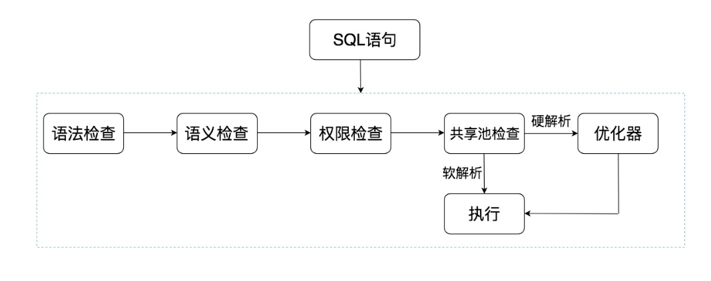
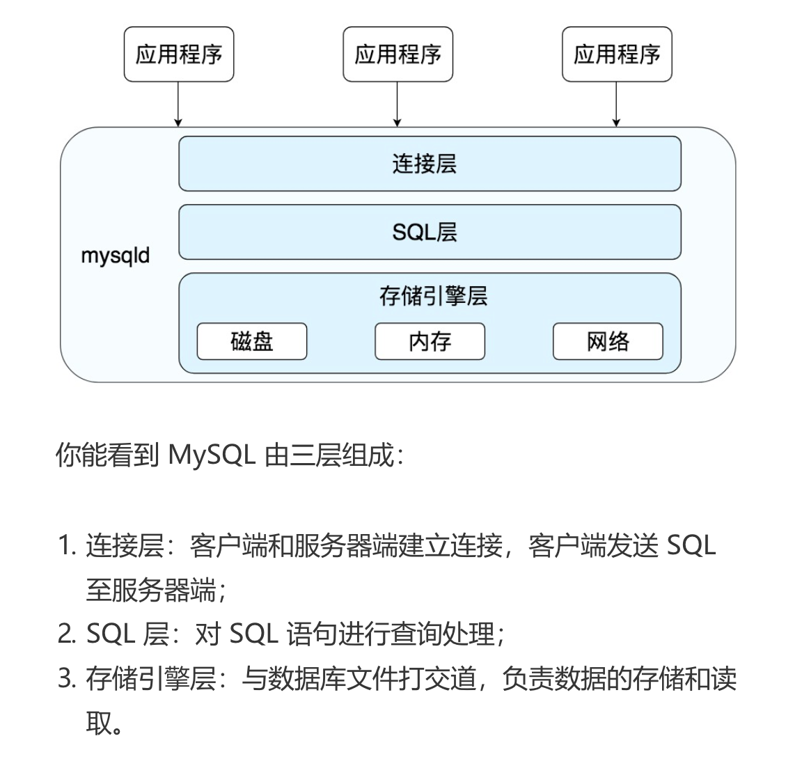

# 0. 一些基本的概念

* DB database，也就是数据库。数据库是存储数据的集合，你可以把它理解为多个数据表。
* DBMS （database management system），数据库管理系统，实际上它可以对多个数据库进行管理，所以你可以理解为 DBMS = 多个数据库(DB) + 管理系统。
* DBS (database System)，数据库系统。它是更大的概念，包括了数据库、数据库管理系统以及数据库管理人员 DBA
* Oracle、MySQL 等被称为数据库，确切的说，它们应该是数据库管理系统，即 DBMS
* RDBMS (relational database management system)，关系型数据库管理系统

# 1. 初始

* Oracle 中的 sql 是如何执行的

  
  
  
  
  * 共享池检查：==共享池( shared pool )== 是一块内存池，最主要的作用是缓存 SQL 语句和改语句的执行计划。Oracle 通过检查共享池是否存在 SQL 语句的执行计划，来判断进行软解析，还是硬解析。那软解析和硬解析又该怎么理解呢？
  
    在共享池中，Oracle 首先对 SQL 语句进行 Hash 运算，然后根据 Hash 值在库缓存（Library Cache）中查找，如果存在 SQL 语句的执行计划，就直接拿来执行，直接进入“执行器”的环节，这就是软解析。如果没有找到 SQL 语句和执行计划，Oracle 就需要创建解析树进行解析，生成执行计划，进入“优化器”这个步骤，这就是硬解析。
  
  * 优化器：优化器中就是要进行硬解析，也就是决定怎么做，比如创建解析树，生成执行计划。
  
  * 执行器：当有了解析树和执行计划之后，就知道了 SQL该怎么被执行，这样就可以在执行器中执行语句了。
  
* MySQL 架构

  首先 MySQL 是典型的 C/S 架构，即 Client/Server 架构，服务器端程序使用的 mysqld。

  

  你能看到 SQL 语句在 MySQL 中的流程是：SQL 语句→缓存查询→解析器→优化器→执行器。在一部分中，MySQL和 Oracle 执行 SQL 的原理是一样的。

   与 Oracle 不通的是，MySQL 的存储引擎采用了插件的形式，每个存储引擎都面向一种特定的数据库应用环境。同时开源的MySQL还允许开发人员设置自己的存储引擎。

  需要注意的是，数据库的设计在于表的设计，而在 MySQL中每个表的设计都可以采用不同的存储引擎，我们可以==根据实际的数据处理需要来选择存储引擎==，这也是 MySQL 的强大之处。对不通的表采用不通的存储引擎。

  不通的 数据库管理系统组织结构太过庞大，我们在学习的时候，还需要具备抽象的能力，抓取最核心的部分：==SQL 的执行原理==。因为不同的 DBMS 的SQL 的执行原理是相通的，只是在不同的软件中，各有各的实现路径。

## 2. mysql 的一些函数

```sql
-- 查询是否打开 profiling，检测性能的工具，能查看执行过程以及执行时间
slect @@profiling;
-- 打开 profiling
set profiling=1;
-- 查看执行的过程
show profile;
-- 查看请求query id为2的请求执行时间
show profile for query 2;
-- 查看版本
select version();
```

