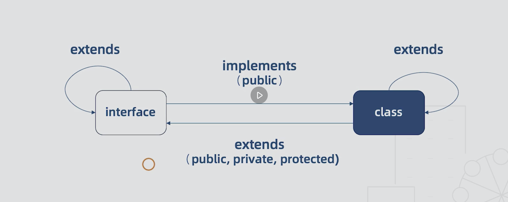

# 1. 为什么选择 TypeScript

1. typescript 增加了代码的可读性和可维护性

   * 类型系统实际上是最好的文档，大部分的函数看看类型的定义就可以知道如何使用了

   * 可以在编译阶段就发现大部分错误，这总比在运行时候出错好

   * 增强了编辑器和 IDE 的功能，包括代码补全、接口提示、跳转到定义、重构等

2. TypeScript 非常包容

   - TypeScript 是 JavaScript 的超集，`.js` 文件可以直接重命名为 `.ts` 即可
   - 即使不显式的定义类型，也能够自动做出[类型推论](https://ts.xcatliu.com/basics/type-inference.html)
   - 可以定义从简单到复杂的几乎一切类型
   - 即使 TypeScript 编译报错，也可以生成 JavaScript 文件
   - 兼容第三方库，即使第三方库不是用 TypeScript 写的，也可以编写单独的类型文件供 TypeScript 读取

...

## 1.3 静态和动态类型语言

* 静态类型语言：在编译阶段确定所有变量的类型
* 动态类型语言：在执行阶段确定所有变量的类型


# 2. 开始使用

全局安装 ts 

```shell
npm i -g typescript
```

编译一个ts文件

```shell
tsc hello.ts
```

> 约定使用 typescript 编写的文件使用 .ts 为后缀，使用 ts 编写 react 的时候以 `.tsx` 为后缀

* 为什么用 `tsc`来编译

  tsc 代表 typescript compiler 

1. TypeScript 中，使用 `:` 指定变量的类型，`:` 的前后有没有空格都可以。

* vscode 实现  .ts 文件的自动编译

  执行   tsc   --init， 生成  tsconfig.json 文件，修改代码输出目录  outDir，

  ```js
  "outDir": "./js", 
  ```

  vscode 中  终端 -> 运行任务 -> 监视 tsc 即可。

**TypeScript 只会进行静态检查，如果发现有错误，编译的时候就会报错。**

**TypeScript 编译的时候即使报错了，还是会生成编译结果**，我们仍然可以使用这个编译之后的文件。

## tsconfig.json 文件

如果一个目录下存在一个`tsconfig.json`文件，那么它意味着这个目录是TypeScript项目的==根目录==。`tsconfig.json`文件中指定了用来编译这个项目的根文件和编译选项。 一个项目可以通过以下方式之一来编译：

### 使用tsconfig.json

- 不带任何输入文件的情况下调用`tsc`，编译器会从当前目录开始去查找`tsconfig.json`文件，逐级向上搜索父目录。
- 不带任何输入文件的情况下调用`tsc`，且使用命令行参数`--project`（或`-p`）指定一个包含`tsconfig.json`文件的目录。

当命令行上指定了输入文件时，`tsconfig.json`文件会被忽略。（直接使用 tsc index.ts 的形式）

* 如果要在报错的时候终止 js 文件的生成，可以在 `tsconfig.json` 中配置 `noEmitOnError` 即可。

## webpack中配置 ts

* `npm i webpack webpack-cli webpack-dev-server -D`

* 在 rules 中配置
* npm i ts-loader -D

```js
module: {
  rules: [
    {
      test: /\.tsx?$/i,
      use: [{
        loader: 'ts-loader'
      }],
      exclude: /node_modules/
    }
  ]
}
```

### 测试环境配置

```js
module.exports = {
    devtool: 'cheap-module-eval-source-map'
}
```

* 开启 source map ，cheap 代表忽略文件的类信息，在调试的时候类信息是没有用的；module 代表定位 ts源码，不是 ts-loader 解析之后的js代码；eval-source-map 把 source map以dataurl 的方式把文件中，重编译速度非常快，不用担心性能问题

### 生产环境配置

```js
const { CleanWebpackPlugin } = require('clean-webpack-plugin')
module.exports = {
    plugins: [
        new CleanWebpackPlugin()
    ]
}
```

* 安装 clean-webpack-plugin，每次成功构建之后帮助我们清楚 dist 目录，清空缓存，清除无用的文件。因为在每次构建的时候文件名都是 hash生成的，多次构建之后就会产生无用的文件。

### 使用 webpack-merge 将两个文件合并

```js
const merge = require('webpack-merge')
const baseConfig = require('./webpack.base.config')
const devConfig = require('./webpack.dev.config')
const proConfig = require('./webpack.pro.config')

let config = process.env.NODE_ENV === 'development' ? devConfig : proConfig

module.exports = merge(baseConfig, config)
```

### 启动命令配置

```js
"start": "cross-env NODE_ENV=development webpack-dev-server --hot --open --config ./build/webpack.config.js"
```

* 需要安装：

  ```shell
  npm i cross-env
  ```

  

## 初始化一个 ts 项目

```shell
tsc --init
```

* 会生成一个 tsconfig 文件，里面就是 ts 的配置

# 3. 基础

## 0. JavaScript中的数据类型

https://developer.mozilla.org/zh-CN/docs/Web/JavaScript/Data_structures

## 1. 原始数据类型

### 布尔值

在 ts 中，使用 Boolean 定义布尔值类型。

```js
let isTrue: boolean = false
```

注意，使用构造函数的形式创建的对象不是布尔值：

```
let createdByNewBoolean: boolean = new Boolean(1);
```

==特别注意==

使用 new Boolean 或者  new String的方式，new 出来的变量是引用类型的，typeof 变量返回的是 object。new Boolean 的实际类型为 Boolean 类型，new String的类型为 String 类型。

事实上 `new Boolean()` 返回的是一个 `Boolean` 对象：

```js
let createdByNewBoolean: Boolean = new Boolean(1);
```

直接调用 `Boolean` 也可以返回一个 `boolean` 类型：

```js
let createdByBoolean: boolean = Boolean(1);
```

直接使用 Boolean 调用的方式，也能够返回一个 boolean 类型。

在 TypeScript 中，`boolean` 是 JavaScript 中的基本类型，而 `Boolean` 是 JavaScript 中的构造函数。其他基本类型（除了 `null`和 `undefined`）一样，不再赘述。

### 数值

使用 number 定义数值类型：

```js
let decLiteral: number = 6;
let hexLiteral: number = 0xf00d;
// ES6 中的二进制表示法
let binaryLiteral: number = 0b1010;
// ES6 中的八进制表示法
let octalLiteral: number = 0o744;
let notANumber: number = NaN;
let infinityNumber: number = Infinity;
```

### 字符串

使用 string 定义字符串类型：

```js
let myName: string = "tom"
let myAge: number = 12
// 模板字符串
let sentence: string = `Hello, my name is ${myName}.
I'll be ${myAge + 1} years old next month.`;
```

### 空值

JavaScript 没有空值（Void）的概念，在 TypeScript 中，可以用 `void` 表示没有任何返回值的函数：（写法都是在）

```js
function fn(): void {
    
}
```

声明一个`void`类型的变量没有什么用，只能将它赋值为 undefined 和 null。

```js
let unusable: void = undefined
```

* 在js 中使用 void 跟一个变量来定义 undefined ，因为 js 中没有 undefined 这个保留字，能够自定义一个 undefined 来覆盖全局的 undefined，因此用 void 0 这种方式来产生真正的 undefined。

### null 和 undefined

在 TypeScript 中，可以使用 `null` 和 `undefined` 来定义这两个原始数据类型：

```js
let u: undefined = undefined;
let n: null = null;
```

`undefined` 类型的变量只能被赋值为 `undefined`，`null` 类型的变量只能被赋值为 `null`。

与 `void` 的区别是，==`undefined` 和 `null` 是所有类型的子类型==。也就是说 `undefined` 类型的变量，可以赋值给 `number` 类型的变量：

> 主要是判断后面的类型是否在前面的类型里面包括

```js
// 这样不会报错
let num: number = undefined;
// 这样也不会报错
let u: undefined;
let num: number = u;
```

而 `void` 类型的变量不能赋值给 `number` 类型的变量：

```js
let u: void;
let num: number = u;

// index.ts(2,5): error TS2322: Type 'void' is not assignable to type 'number'.
```

### unknown

* unknown 类型只能被赋值给 any 类型和 unknown 类型本身。

### 任意值

任意值（Any）用来表示允许赋值为任意类型。

如果是一个普通类型，在赋值过程中改变类型是不被允许的：

```js
let myFavoriteNumber: string = 'seven';
myFavoriteNumber = 7;

// index.ts(2,1): error TS2322: Type 'number' is not assignable to type 'string'.
```

但如果是 `any` 类型，则允许被赋值为任意类型。

```js
let myFavoriteNumber: any = 'seven';
myFavoriteNumber = 7;
```

==任意值在赋值的过程中能够改变该变量的类型。==

#### 1. 任意值的属性和方法

在任意值上访问任何的属性和方法都是允许的：

就是说在任意值的后面加调用任何的属性和方法都不会报错，但是具体的执行还是看该变量有没有这个属性或方法。

可以认为，**声明一个变量为任意值之后，对它的任何操作，返回的内容的类型都是任意值**。返回的

#### 2. 未声明类型的变量

变量如果在声明的时候，未指定其类型，那么它会被识别成为任意值类型：

```js
let something;
something = 'seven';
something = 7;

something.setName('Tom');
```

等价于

```js
let something: any;
something = 'seven';
something = 7;

something.setName('Tom');
```

#### never 类型

* never 类型代表无返回，联 undefined 也不会返回，永远不会返回

  ```js
  // never
  let a: () => never = () => {
      throw new Error('111')
  }
  
  let b = () => {
    white (true) {
      
    }
  }
  ```

  

### ts 类型推论

在定义的时候如果没有赋值，则 ts 会把该变量的类型推断成 any 类型；如果在定义的时候已经赋值了，则会把变量的类型推断为等号后面的类型，在之后的赋值中不能再改变该变量的类型。

```js
let str
str = "string"
str = 1
// 正确
```

```js
let str = "string"
str = 1
// 报错
```

上面的代码，默认第一行  `let str: string = "string"`

### 联合类型

联合类型（union types） 表示取值可以为多种类型中的一种。

就是在定义的时候给予多个类型，使用 | 来分割不同的类型。

```js
let myFavoriteNumber: string | number;
myFavoriteNumber = 'seven';
myFavoriteNumber = 7;
// 正确

let myFavoriteNumber: string | number;
myFavoriteNumber = true;

// index.ts(2,1): error TS2322: Type 'boolean' is not assignable to type 'string | number'.
//   Type 'boolean' is not assignable to type 'number'.
```

#### 访问联合类型的属性和方法

> 当typescript 不确定一个联合类型的变量到底是哪个类型的时候（该类型还未被赋值具体的值），我们只能访问次联合类型的所有类型里共有的属性或方法。

联合类型的变量在被赋值的时候，会根据类型推论的规则推断出一个类型：（这个推出的类型是暂时的，在下一个赋值之前都可以用这个类型的属性，一旦有下一个赋值，就只能调用下一个赋值的属性）

 ## 对象的类型——接口

在 typescript 中我们使用接口（interfaces）来定义对象的类型。

### 接口（interfaces）

在面向对象的语言中，接口（interfaces）是一个很重要的概念。它是对行为的抽象，而具体如何行动需要由类（classes）去实现（implements）。

接口写法是一个对象，

* 对对象的 shape 进行描述

* 对类（class）进行抽象 

* duck typing （鸭子类型 ），有一些共同的特点，那他就是那个东西（鸭子）

  在动态语言中，更关注对象如何 被使用，而不是对象本身。


#### 例子

```ts
interface Person {
    name: string;
    age: number;
}

let tom: Person = {
    name: 'Tom',
    age: 25
};
```

上面的例子中，我们定义了一个接口 `Person`，接着定义了一个变量 `tom`，它的类型是 `Person`。这样，我们就约束了 `tom` 的形状必须和接口 `Person` 一致。

定义的变量采用了接口的类型，不能比接口少一些属性，也不能多出一些属性。因此，赋值额时候变量的形状必须和接口的形状保持一致。

接口的类型也可以定义为 any 类型，在赋值的时候能够赋值为任意的类型。

#### 鸭子类型

* 在前后端定义的接口中，获取到后端的字段是定义的接口的必要条件

```typescript
// interface
interface Iprops {
    name: string;
    age: number;
}
const fn = (arg: Iprops) => {
    console.log(arg)
}
const result = {
    name: 'zzz',
    age: 11,
    gender: 'female'
}
fn(result)
```

* 多了一个 gender 属性并没有报错

### 可选属性

有时候我们希望不要完全匹配一个形状，那么可以使用的可选属性：

```ts
interface Person {
    name: string;
    age?: number;
}

let tom: Person = {
    name: 'Tom'
};
```

可选属性的含义是该属性可以不存在

这时仍然不许新增一个接口没有定义的属性。

### 任意属性

有时候我们希望一个接口允许有任意的属性。可以使用 `[propName: string]:string `的形式来定义一个可以接收任意符合类型的属性。

第一个 string 的意思是 新增的未知 的属性的类型定义为 string，第二个 string 的意思是强制要求所有的属性的值都必须是 string 类型。（如果与已定义的属性的类型冲突，则会报错）

需要注意的是，**一旦定义了任意属性，那么确定属性和可选属性都必须是它的子属性**：

```typescript
interface Person {
    name: string;
    age?: number;
    [propName: string]: string;
}

let tom: Person = {
    name: 'Tom',
    age: 25,
    gender: 'male'
};

// index.ts(3,5): error TS2411: Property 'age' of type 'number' is not assignable to string index type 'string'.
// index.ts(7,5): error TS2322: Type '{ [x: string]: string | number; name: string; age: number; gender: string; }' is not assignable to type 'Person'.
//   Index signatures are incompatible.
//     Type 'string | number' is not assignable to type 'string'.
//       Type 'number' is not assignable to type 'string'.
```

上例中，任意属性的值允许是 `string`，但是可选属性 `age` 的值却是 `number`，`number` 不是 `string` 的子属性，所以报错了。`propName` 只是一个代称，可以使用其他的来代替，使用一个 p 也是可以的。

#### 另一种任意类型

* 在定义 interface 的时候，如果什么都没写，则这个对象的属性可以是任何值

  ```typescript
  interface IType = {}
  
  const types: IType = {
    test1: '111',
    test2: 222
  }
  ```

  

### 只读属性

有时候我们希望一个属性在创建的时候被赋值，其他任何情况不能再改变该值，那么可以使用到`readonly`定义只读属性。类似于`const`.

```ts
interface Person {
    readonly id: number;
    name: string;
    age?: number;
    [propName: string]: any;
}

let tom: Person = {
    id: 89757,
    name: 'Tom',
    gender: 'male'
};

tom.id = 9527;

// index.ts(14,5): error TS2540: Cannot assign to 'id' because it is a constant or a read-only property.
```

**注意，只读的约束存在于第一次给对象赋值的时候，而不是第一次给只读属性赋值的时候**：

==只读属性和一般的属性一样是必须在对象赋值的时候赋值，只是不能在之后修改该赋值==

总结：

1. 接口的写法就是对象的写法，后面的值就是他属性的类型。
2. 在接口的书写中，后面可以使用分号来分割语句。
3. 只读属性存在于 对象 数组 元祖

### 在对象中使用定义属性的类型

```ts
const obj = {
  a: '1' as string,
  o: [] as any[],
}
```


## 数组的类型

在 TypeScript 中，数组类型有多种定义方式，比较灵活。（就是任何类型的数据在定义的时候一定要注意规定类型）

### 「类型 + 方括号」表示法

最简单的方法是使用「类型 + 方括号」来表示数组：

let arr: number[] = [1, 1, 1, 2]

==数组的方法在使用的过程中也必须按定义时的类型进行限制==

例子： 

```ts
let fibonacci: number[] = [1, 1, 2, 3, 5];
fibonacci.push('8');

// index.ts(2,16): error TS2345: Argument of type 'string' is not assignable to parameter of type 'number'.
```

上例中，`push` 方法只允许传入 `number` 类型的参数，但是却传了一个 `string` 类型的参数，所以报错了。

#### 数组的联合类型

```js
let arr: (string | number)[] = ['1', '2', '3', 5]
```
#### 数组的 readonly

```typescript
const arr1: readonly number[] = [1, 2];
```


#### 注意

* 数组定义类型之后，数据的方法也会限定类型，比如说数组的push方法

### 数组泛型

能够使用数组泛型(Array Generic) `Array<elemType>`来表示数组：

```js
let arr: Array<number> = [1,2,3,4]
```

### 用接口来表示数组

接口也可以用来描述数组：

```ts
interface NumberArray {
    [index: number]: number;
}
let fibonacci: NumberArray = [1, 1, 2, 3, 5];
```

写法就是数组的index用 `[index: number]` 来写。

数组中需要存放任意类型的时候，直接将类型定义为任意类型即可。

```ts
let list: any[] = ['Xcat Liu', 25, { website: 'http://xcatliu.com' }];
```

### 类数组

类数组（Array-like Object）不是数组类型，比如 `arguments`

```ts
function sum() {
    let args: number[] = arguments;
}

// index.ts(2,7): error TS2322: Type 'IArguments' is not assignable to type 'number[]'.
//   Property 'push' is missing in type 'IArguments'.
```

事实上常见的类数组都有自己的接口定义，如 `IArguments`, `NodeList`, `HTMLCollection` 等：

```ts
function sum() {
    let args: IArguments = arguments;
}
```

==伪数组可以使用内置的接口来实现==

不能把伪数组赋值成数组类型

## 函数的类型

函数声明类型：

```typescript
function sum(x: number, y: number): number {
    return x+y
}
```


注意，**输入多余的（或者少于要求的）参数，是不被允许的**：

函数的赋值类型：

注意：函数的表达式需要在赋值的左边来定义输入输出的数据类型，不能够只在右边进行函数输入输出的定义。因为函数本身就是一种类型

```typescript
let sum: (x: number, y: number) => number = function (x: number, y: number): number {
    return x + y
}
```

注意不要混淆了 TypeScript 中的 `=>` 和 ES6 中的 `=>`。

在 TypeScript 的类型定义中，`=>` 用来表示函数的定义，左边是输入类型，需要用括号括起来，右边是输出类型。

==在ts中写接口的时候，冒号右边的可以想象成实现这个接口的时候右边的值的类型（包括函数的返回值的类型。）==

ts 中冒号的右边是类型和实际的代码逻辑没有什么关系。

* 一个变量定义了函数类型之后，给它赋值的函数就不必要再定义类型了。
* 函数类型的定义使用的是 冒号，函数类型的赋值使用的等号，分清楚

### 函数参数的可选

可选参数的写法与接口的可可选属性的写法是一样的

```ts
function buildName(firstName: string, lastName?: string) {
    if (lastName) {
        return firstName + ' ' + lastName;
    } else {
        return firstName;
    }
}
let tomcat = buildName('Tom', 'Cat');
let tom = buildName('Tom');
```

需要注意的是，==可选参数必须接在必需参数后面==。换句话说，**可选参数后面不允许再出现必须参数了**：

### 参数的默认值

```ts
function buildName(firstName: string = 'Tom', lastName: string) {
    return firstName + ' ' + lastName;
}
let tomcat = buildName('Tom', 'Cat');
let cat = buildName(undefined, 'Cat');
```

默认值的参数不受可选参数后面不能跟必选参数的限制。

默认值的参数就相当于可选参数。

### 函数参数只读

```typescript
const fn = function(a: string, b: readonly number[]) {
    
}
```

### 定义函数的三种方式

1. 直接定义类型

```js
let add: (x: number, y: number) => number
```

2. 接口定义

```typescript
interface Add {
  (x: number, y: number): number
}
// 接口定义函数返回值用 冒号 和其他的都一样
```

3. 类型别名

```typescript
type Add = (x: number, y: number) => number
```

* 注意：上面三种方式的函数参数都不是强制限制的，他们只是定义了函数的形状，但是函数具体使用的时候到底长什么样，还是要具体的函数实现的时候来定义的，类似于下边的 fn4 才会强制限定函数使用规范。
* 说白了函数的上述三种定义只是函数的重载，下面函数真正张什么样，只要包含上边的函数就行了

```typescript
interface IFn {
    (name: string): string;
    // [property: string]: string;
}

const fn1: IFn = () => {
    return ''
}

type IFn1 = (name: string) => string

const fn2: IFn1 = () => {
    return '111'
}

const fn3: (name: string) => string = () => {
    return ''
}

function fn4(name: string): string {
    return '11'
}
fn4('1')
```


### 重载

重载允许一个函数接受不同数量或类型的参数时，作出不同的处理。

好处就是不需要为了相似的功能选用不同的函数名称，增强了函数的可读性

就是接受number的参数的时候，return 一个number类型的数据。接受 string的参数，返回string类型的数据。

可以从上到下重复定义函数，函数的调用的时候从上到下匹配类型，从而表述清楚函数的返回类型。

上例中，我们重复定义了多次函数 `reverse`，前几次都是函数定义，最后一次是函数实现。在编辑器的代码提示中，可以正确的看到前两个提示。

注意，TypeScript 会优先从最前面的函数定义开始匹配，所以多个函数定义==如果有包含关系，需要优先把精确的定义写在前面。==

```typescript

```

1. 写几个函数不同参数的定义
2. ==在一个宽泛的函数中写出它的具体实现==（any 参数）

## 类型断言

类型断言（type assertion）可以用来手动指定一个值的类型。就是我们告诉编辑器我们知道这个类型就是指定的类型

#### 语法

```ts
<类型>值
```

或

```ts
值 as 类型
```

在 tsx 语法（React 的 jsx 语法的 ts 版）中必须用后一种。

类型断言就是在==联合类型==的情况下，对其中的一个类型进行if的赛选。

```ts
function getLength(something: string | number): number {
    if ((<string>something).length) {
        return (<string>something).length;
    } else {
        return something.toString().length;
    }
}
```

上面的例子中就不会出现 if 里面的语句报错的情况。

断言只能断言联合类型中的一个类型，也可以使用一种全部包含联合类型的类型，包含一个或多个。

==注意：在使用断言的时候，后续的具体使用都要<类型>值的形式来使用。类型的断言使用的interface所以跟着的类型是大写的==

## 声明文件

当使用第三方库时，我们需要引用它的声明文件，才能获得对应的代码补全、接口提示等功能。

在 ts 中使用第三方库的时候需要使用声明语句来对全局变量进行声明。

```ts
declare var jQuery: (selector: string) => any

jQuery("#foo")
```

这样写只是为了通过 ts 的编译，没有多余的作用。

## 什么是声明文件

通常我们会把声明语句放到一个单独的文件（`jQuery.d.ts`）中，这就是声明文件：

```ts
// src/jQuery.d.ts

declare var jQuery: (selector: string) => any;
```

声明文件必需以 `.d.ts` 为后缀。

一般来说，ts 会解析项目中所有的 `*.ts` 文件，当然也包含以 `.d.ts` 结尾的文件。所以当我们将 `jQuery.d.ts` 放到项目中时，其他所有 `*.ts` 文件就都可以获得 `jQuery` 的类型定义了。

### 第三方声明文件

当然，jQuery 的声明文件不需要我们定义了，社区已经帮我们定义好了：[jQuery in DefinitelyTyped](https://github.com/DefinitelyTyped/DefinitelyTyped/tree/master/types/jquery/index.d.ts)。

我们可以直接下载下来使用，但是更推荐的是使用 `@types` 统一管理第三方库的声明文件。

`@types` 的使用方式很简单，直接用 npm 安装对应的声明模块即可，以 jQuery 举例：

```bash
npm install @types/jquery --save-dev
```

可以在[这个页面](http://microsoft.github.io/TypeSearch/)搜索你需要的声明文件。  	

* 在使用第三方声明文件的时候，可以直接使用上面的方式进行安装即可，不需要自己再去定义了。

### 书写声明文件

具体的书写声明文件需要查看文档来实现。

https://ts.xcatliu.com/basics/declaration-files.html

全局变量的声明文件主要有以下几种语法：

- `declare var` 声明全局变量
- `declare function` 声明全局方法
- `declare class` 声明全局类
- `declare enum` 声明全局枚举类型
- `declare namespace` 声明全局对象（含有子属性）
- `interface` 和 `type` 声明全局类型

***缺失***

## 内置对象

内置对象是指根据标准在全局作用域（Global）上存在的对象。这里的标准是指 ECMAScript 和其他环境（比如 DOM）的标准。

ECMAScript 标准提供的内置对象有：

`Boolean`、`Error`、`Date`、`RegExp` 等。

我们可以在 TypeScript 中将变量定义为这些类型：

```ts
let b: Boolean = new Boolean(1);
let e: Error = new Error('Error occurred');
let d: Date = new Date();
let r: RegExp = /[a-z]/;
```

DOM 和 BOM 提供的内置对象有：

`Document`、`HTMLElement`、`Event`、`NodeList` 等。

TypeScript 中会经常用到这些类型：

```ts
let body: HTMLElement = document.body;
let allDiv: NodeList = document.querySelectorAll('div');
document.addEventListener('click', function(e: MouseEvent) {
  // Do something
});
```

它们的定义文件同样在 [TypeScript 核心库的定义文件](https://github.com/Microsoft/TypeScript/tree/master/src/lib)中。

### TypeScript 核心库的定义文件

typescript 定义了常用的对象和方法的shape，（采用接口的形式）

### typescript 写 node.js

Node.js 不是内置对象的一部分，如果想用 TypeScript 写 Node.js，则需要引入第三方声明文件：

```bash
npm install @types/node --save-dev
```

# 4. 进阶

## 类型别名

就是给类型起一个自定义的名字

常用作给联合类型起一个自定义的名字。

使用关键字 type 来实现，

```ts
type Name = string
```

应用：

```typescript
type PlusType = (a: number, b: number) => number;
const plues: PlusType = (a: number, b: number): number => {
    return a + b
}
```


## 字符串字面量类型

字符串字面量类型用来约束取值只能是某几个字符串中的一个，就是相当于自定义了几个字符串类型的类型。只能取自定义的字符串中的一个，也使用 type 关键字来实现。

## 元祖

数组合并了相同类型的对象，而元祖（tuple）合并了不同类型的对象.

### 举例

定义一对值分别为 `string` 和 `number` 的元组：

```ts
let xcatliu: [string, number] = ['Xcat Liu', 25];
```

就是在数组的定义过程中，为其中的每个元素规定类型。

### 越界的元素

当添加越界的元素时，它的类型会被限制为元组中每个类型的联合类型：

当超出规定类型的元素时，这个元素会被定义成之前数组定义过的类型的联合类型。

### 注意

* 元祖是特殊的数组，在定义的时候长度不能变，要和左侧的类型对齐。
* 元祖可以使用数组的方法来添加元素，比如说使用 push 方法。但是不能进行越界访问，实际开发的过程中不建议这样使用

## 枚举

枚举（enum）类型用于取值被限定在一定范围内的场景，比如一周只能有七天，颜色限定为红绿蓝等。

### 例子

枚举成员会被赋值为从 `0` 开始递增的数字，同时也会对枚举值到枚举名进行反向映射：

```ts
enum Days {Sun, Mon, Tue, Wed, Thu, Fri, Sat};

console.log(Days["Sun"] === 0); // true
console.log(Days["Mon"] === 1); // true
console.log(Days["Tue"] === 2); // true
console.log(Days["Sat"] === 6); // true

console.log(Days[0] === "Sun"); // true
console.log(Days[1] === "Mon"); // true
console.log(Days[2] === "Tue"); // true
console.log(Days[6] === "Sat"); // true
```

### 手动赋值

* 我们也可以给枚举项手动赋值

```ts
enum Days {sun = 7, mon =1, tue, wed, thu}
```

枚举手动赋值的元素会赋值为赋值的元素，没有赋值的元素还是会默认的赋值为当前所在位置的值（0,1,2,3）

注意：手动赋值的值最好不要和后面的值重复，如果重复的话，后面的值会覆盖掉前面的值。

* 枚举的手动赋值也可以不为数字，需要使用断言来避免ts检测出错，ts枚举的实质就是后面的值等于前面的值＋1，当前面一个元素手动赋值成字符串类型的话，后面也需要手动赋值成为字符串类型的值。

### 计算值

* 枚举中的计算值会被保留在执行阶段才会执行，就是不会立即执行

### 常亮枚举

* 不能存在计算值，比如 `arr.length`
* 当我们不需要一个对象，只需要一个对象的值的话就会使用到常量枚举

```typescript
const enum Month {
    Jan = 1,
    Feb,
    Jun
}
let test2 = [Month.Feb, Month.Jun]
console.log(test2)
```


### 字符串枚举

```typescript
enum Message {
  Success: '成功',
  Fail: '失败'
}
```

* 注意字符串枚举不能够反向映射

### 异构枚举

* 就是数字 + 字符串枚举

```typescript
enum Answer {
  N,
  Y = 'yes'
}
```

### 枚举类型

* 枚举也可以作为一种类型来使用

```typescript
// 枚举类型
enum E {
    a,
    b
}
enum F {
    a = 1,
    b = 2
}
enum G {
    a = 'test1',
    b = 'test2'
}

let e1: E = 5
let e2: F = 5
let e3: G = G.a
let e4: G.a = G.a
```

* 数字类型只要是数字就可以，字符串枚举类型只能取固定的值

### 枚举思考

* 在 js 中能够使用如下的方式去赋值

```js
var obj = {}
var a
obj[a = 1] = 'test'
// obj[1] === 'test'
```


## 类

TypeScript 除了实现了所有 ES6 中的类的功能以外，还添加了一些新的用法。

typescript 类的使用规则：https://ts.xcatliu.com/advanced/class.html

### 修饰符

* 类上的方法和属性提供修饰符

* publicre

* private 子类也不能访问，甚至连实例对象也不能直接访问，只能在 class 构造类中内部使用

  如果 private 作用在 constructor 上，则这个类既不能被实例，也不能被继承

* Protected 外界不能访问，子类可以访问。不能在实例中访问。

  如果 constructor 定义为 protected ，则这么类能被继承但是不能被实例，能作为一个基类。

* readonly 只读的，不能修改

* 静态的 

  static + 上面的修饰符
  
  静态的属性可以被继承，不需要写多余的继承代码

### 面向对象

封装、继承、多态

### ==重要==

1. es6 和 typescript 中的非函数类型的属性都绑定在实例对象上边，不是绑定在实例对象的原型上面。

2. 于 es 不同的是属性需要有初始值或者在构造函数中被初始化。（es 中直接在class中写一个name属性，不需要被赋值默认值或者constructor中被赋值）

3. Es 中的属性不需要在外边定义，直接在 constructor 中定义也是可以的，但是ts 中的属性必须要在class 中定义。

4. constructor 的参数也可以使用修饰符，使用了修饰符就不用再在 class 中定义了，会自动定义为实例属性

5. 类的继承除了new 的时候初始化的实例属性需要写额外的代码（super()），其他的都能直接使用。

6. ts 中方法的定义必须使用省略的书写，因为适应变量定义方法哪种会识别成变量，一个变量就必须要赋值

   ```typescript
   abstract eat(food: string): void
   // 正确
   public test: () => void
   // 错误，提示 test 没有赋值
   ```

7. 所有方法都应该写到 constructor 后面，不然就识别不了

### 类使用 interface

* 两个抽象的类，有共同的方法（特性），但是没法抽象出一个共同的父类，可以抽象出一个interface

```typescript
interface Radio {
  switchRadio(): void;
}
interface Battery {
  checkBatteryStatus();
}
class car implements Radio {
  switchRadio() {
    
  }
}
class phone implements Radio, Battery {
  switchRadio() {
    
  }
  checkBatteryStatus() {
    
  }
}
```

* 可以实现两个接口，一个公共的，一个特有的

甚至接口也可以继承接口，实现组合，继承一个接口即可。

```typescript
interface RadioWithBattery extends Battery {
  
}
```

1. 接口只能约束类的公有成员，不能约束 构造函数

2. 接口也可以继承类，这个类中的成员就会添加到这个约束中

   ```typescript
   class A {
     name = 1
   }
   interface Ia extends A {
   	
   }
   class B implements Ia {
     name = 2
   }
   
   ```

3. 接口能够抽离出类的公有、私有、保护的成员，接口继承类的私有成员但是不能被实现，实现会提示私有成员保护。同理保护的成员也一样。

   

   因此，接口在继承class时要考虑是否继承类的私有成员和保护成员。

### 抽象类

1. 抽象类 不能被实例，只能被继承
2. 抽象类中的抽象方法相当于指定了一个方法名，知道子类中有不同的实践，所有抽象类中的抽象方法不需要具体的方法实现，只有一个方法名

```typescript
abstract class Animal {
    constructor (name: string) {
        this.name = name
    }
    public name: string
    abstract eat(food: string): void
    // public test: () => void
}
console.log(Animal)
class Cat extends Animal {
    constructor (name: string) {
        super(name)
    }
    public eat(food: string) {

    }
}
```

### 小技巧（ts 的特殊类型 this）

1. 可以使用方法返回 this ，实现链式调用

## 泛型（牛的）（generics）

泛型（Generics）是指在定义函数、接口或类的时候，不预先指定具体的类型，而在使用的时候再指定类型的一种特性。

==可以把泛型想象成一个函数的参数，形参并不需要具体的值。泛型也可以叫做类型参数==

```js
function show<T>(arg: T): T {
  return arg
}
const result = show('111')
// 会做类型推断，推断出result的类型为 string
const result1 = show(true)
// 会报错

```

多个泛型

```js
function swap<T, U>(tuple: [T, U]): [U, T] {
  return [tuple[1], tuple[0]]
}
// 上边类型是元祖，不是数组
```

数组使用泛型

```js
function echoWithArr<T>(arr: T): T {
  return arr.length;
}
//报错，因为类型不确定，不一定有 length 属性
function echoWithArr<T>(arr: T[]): T[] {
  console.log(T.length)
  return arr
}
```

* 注意
  1. 函数的泛型只能在用函数定义的时候定义，不能在定义函数的引用的时候使用

### 泛型的继承

* 如果一个泛型有一些公共的属性，可以抽象成一个 interface

```typescript
interface Types {
    length: number;
}
function echoWithArr<T extends Types>(tuple: T): T {
    console.log(tuple.length);
    return tuple
}
```

### 类中使用泛型

```js
class Queue<T> {
  private data = []
  push(num: T) {
    this.data.push(num)
  }
	pop(): T {
    return this.data.shift()
  }
}

const queue = new Queue<number>()
```

==注意==

1. 泛型不能作用于类的静态成员
2. 类中的泛型如果没有指定类型，会当成一个任意值来执行（多个任意值？函数能不能是任意类型）

### interface 中使用泛型

```typescript
interface KeyPair<T, U> {
  k: T;
  v: U;
}
let key1: KeyPair<string, number> = {
  k: '111',
  v: 111
}
```

### 数组泛型

```typescript
const arr: Array<number> = [1, 2]
```

### 函数使用 interface 描述

```typescript
interface Iplus {
  (a: number, b:number): number
}
function plus(a: number, b: number): number {
  return a + b
}
const a: Iplus = plus
// 函数描述中使用泛型
interface Log<T> {
  (value: T): T
}
```

### 泛型中默认类型

* 默认类型用等号来表示

```typescript
class A<T = {}> {
    
}
interface Log<T = string> {
  (value: T): T
}

```
### 泛型的约束

* interface 也可以对泛型进行约束，因为泛型是一种类型，所以该约束是采用继承的方式

  ```typescript
  interface ILength {
      length: number;
  }
  class Log<T extends ILength> {
      
  }
  function fn<T extends ILength> (value: T) {
      console.log(value.length)
  }
  // 这样使用 T 就有了length 属性
  ```

### 泛型的好处

1. 函数和类可以轻松的支持多种类型，增强程序的可扩展性
2. 不必写多条函数重载，冗长的联合类型生命，增强代码可读性
3. 灵活控制类型之间的约束

# ts 的类型检查机制

## 1. 类型推断

* 第一种情况看上班

* 第二种情况发生在函数定义默认参数的时候

  ```typescript
  let c = (x = 1) => x + 1
  // 全部推断成 number
  ```

  * 最佳通用类型推断

  ```typescript
  let a = [1, '2']
  // number 和 string 的联合类型 	
  ```

### 从左向右的类型推断

* 通常发生在事件处理中

  ```typescript
  window.onkeydown = (event) => {
      
  }
  // event 就被推断为 内部的类型
  ```

### 覆盖类型推断

* 有时候 ts 不逼你更了解你的代码，你可以使用类型断言来覆盖类型推断（不推荐使用），改变上下文

```typescript
interface IFn {
    bar: number;
}
let fn = {} as IFn
fn.bar // 不报错
```


* 使用默认类型之后，在实际使用过程中的泛型就不需要指定具体的类型

## 2. 类型的兼容性

* 当一个类型 Y 可以被赋值给另一个类型 X 时，我们就可以说类型 X 兼容类型 Y。说白了 还是 duck typeing，就是说一个变量被规定了类型并且被赋值了，还是能被赋值为其他的类型.==兼容的一定是变量之间的兼容，直接用function定义的函数变量不能兼容，函数也必须用三种定义方式定义的才能兼容==

  口诀：

  结构之间兼容：成员少的兼容成员多的

  函数之间兼容：参数多的兼容参数少的
  
  普通类型（联合类型和普通类型）：多的兼容少的
  
  * 固定参数能够兼容可选参数和剩余参数
  * 可选参数不能兼容其他的参数
  * 可以修改tsconfig 中`strictFunctionTypes: false`，就可以互相兼容
  * 对象参数也符合这个特性
  
* 函数返回值的类型兼容

  返回值得类型兼容符合鸭子类型的特性

* ==函数重载就是一个关于参数和返回值的很好的例子==

```typescript
let fn11 = function(name: string): string {
    return name
}
let fn22 = function(name: string, age: number): string {
    return name
}
fn22 = fn11
```


### 函数兼容

1. 参数个数
2. 参数类型
3. 返回参数

### 枚举类型的兼容性

* 枚举类型和number类型是完全兼容的（非自定义的枚举）
* 枚举类型和枚举类型是完全不兼容的

### class 类的兼容性（类的实例比较）

* 类的兼容性：构造函数和静态成员不参与兼容性比较，只有成员属性参与比较；一旦有私有成员，则不兼容（父类和子类可以完全兼容）

### 泛型的兼容性

* 接口泛型，在没有使用具体的属性时，互相兼容
* 函数泛型，定义的函数可以互相兼容，因为没有在调用额时候传入具体的类型

# ts 类型保护

* ts 能够在特定的区块保证变量属于某种特定的类型

  可以在此区块中放心的使用该类型的属性和方法

## 1. instanceof

* 判断实例是否属于某个类

```typescript
 if (lang instanceof Java) {
        lang.helloJava()
    }
```


## 2. in 关键字

* 判断某个属性是否在这个对象中

  ```typescript
  if ('java' in lang) {
      lang.java
  }
  ```


## 3. typeof

* 只是能做到，但是只能一些Java中存在的基本类型

## 4. 创建类型保护的函数

* 返回类型谓词

```typescript
enum Type { Strong, Week }

let aa: Type.Strong = 1
let bb: Type.Week = 2
// aa = bb

class Java {
    helloJava() {
        console.log('is java')
    }
}

class JavaScript {
    helloJavaScript() {
        console.log('is javascript')
    }
}

function isJava(lang: Java | JavaScript): lang is Java {
    return (lang as Java).helloJava !== undefined
}
// 上面函数返回类型谓词，参数+is+类型

function getLanguage(type: Type) {
    let lang = type === Type.Strong ? new Java() : new JavaScript()
    // if (lang as Java) {
    //     (lang as Java).helloJava()
    // }
    if (isJava(lang)) {
        lang.helloJava()
    }
}

```

# 高级类型

## 1. 交叉类型

* 两个 interface 可以结合成一个类型，和联合类型不一样的是这两个类型的并集，改变量拥有了两个类型所有的属性。
* 联合类型是改变量在赋值的时候只能取其中的一种类型，交叉类型是取所有的类型的属性。但是交叉类型在使用的时候要注意，两种类型不能存在共同的属性，要不然会交叉出 never 类型。
* 交叉类型的两个类型必须没有共同的属性

```typescript
interface Test1 {
  name: string;
}
interface Test2 {
  age: number;
}

let obj: Test1 & Test2 = {
  name: '111',
  age: 111
}
```

* 交叉类型规则：共同的属性是两者的并集，交叉类型，如果没有公共的类型，则是never

```typescript
interface IName2 {
    name: string;
    age: string | number;
}
interface IAge {
    age: number | boolean;
}

let a2: IName2 & IAge = {
    name: '111',
    age: 111
}
```


## 2. 联合类型

* 联合类型可以是具体的字符串和数字

  ```typescript
  let a: '1' | '2' = '1'
  let b: 1 | 2 = 1
  ```

*  联合类型规则：interface 的公共属性会是两个的联合类型，非公共的则是具体的类型

### 使用联合类型的某些共同属性创建类型保护区域

* 存在的问题，让匹配不到的类型报错，undefined 的在ts 中最好能报错。在"漏斗"中，没有匹配到的类型，会一直到最后，每次脱去一个类型

  ```typescript
  interface Square {
      kind: 'square';
      length: number;
  }
  interface Rectangle {
      kind: 'rectangle';
      width: number;
      height: number;
  }
  interface Circle {
      kind: 'circle';
      radius: number;
  }
  
  let sha: Square | Rectangle = {
      kind: 'square',
      length: 1,
      // width: 1
  }
  
  type Shape = Square | Rectangle | Circle
  function area(s: Shape) {
      switch (s.kind) {
          case 'square':
              return s.length * s.length
          case 'rectangle':
              return s.width * s.height
          case 'circle':
              return s.radius * s.radius
          default:
          // 此时类型已经拖完，就是never类型
              return ((e: never) => {throw new Error(e)})(s)
      }
  }
  ```

* 为什么要这样做，ts 中最好让没考虑到的情况直接在编译阶段就报错。也是为了类型约束

## 3. 索引类型

### 索引类型的查询操作符

* `keyof T`

```typescript
interface Obj {
  name: string;
  age: number;
}
let a: keyof Obj
// a 就是所有属性的联合类型
```

### 索引访问操作符

* `T[k]`

```typescript
interface IObject {
    name: number;
    age: number;
}

type Test1 = keyof IObject
type Test2 = IObject['age']
```

* 最强应用

```typescript
function getValues<T ,K extends keyof T>(obj: T, keys: K[]): T[K][] {
    return keys.map(key => obj[key])
}

let obj1 = {
    name: '111',
    age: 111
}
getValues(obj1, ['name', 'age'])
```


## 4. 映射类型

* 把一个旧的类型映射成一个新的类型

1. 把一个接口所有属性变成一个只读的类型

   ```typescript
   interface Obj {}
   type ReadonlyObj = Readonly<Obj>
   ```

2. 变成可选属性

   ```typescript
   type PartialObj = Partial<Obj>
   ```

3. 抽取一些子集

   ```typescript
   type PickObj = Pick<Obj, 'a' | 'b'>
   // 第二个参数就是要抽取的 key
   ```

* 以上三种是 同态，不会创建新的类型

4. 加一些新的类型

   非同态

   ```typescript
   type RecordObj = Record<'x' | 'y', Obj>
   // 左侧是key，右侧是 value
   ```

## 5. 条件类型

`T extends U ? X : Y`

```typescript
// (A | B) extends U ? X : Y
// A extends U ? X : Y | B extends U ? X : Y
```


T 如果可以赋值给 U 类型，就返回 X 类型

### 官方实现的条件类型

* `Exclude<T, U>` 排除后边的类型
* NonNullable<T> 不是 undefined 和null
* Extract<T, U> 从 T 中抽取出可以赋值给 U 的类型
* `RecturnType<T>` 获取函数返回值的类型

```typescript
type Diff<T, U> = T extends U ? never : T

let diffType: Diff<'a' | 'b', 'a' | 'c' | 'e'> = 'b'

type NotNull<T> = Diff<T, null | undefined>

let type2: NotNull<string | undefined | number> = 1

let type3: Exclude<'a' | 'b', 'a' | 'e' | 'f'>

let test4: Extract<'a' | 'b', 'a' | 'c' | 'e'>

let test5: NonNullable<'t' | null | 'a'>

let test6: ReturnType<() => number> = 1
```


# 注意

* 所有的类型都是在定义的时候规定的，在赋值的右边是不需要去定义类型的
* 类型只能继承类型
* 所有类型和 never 的联合类型，类型不变

## 字面量和变量

* js 中常规的类型就是字面量，比如 object

# 工程篇


# tsconfig.json 文件

* ts 项目中 `tsconfig.json`文件能配置 ts检查的规则
* 在项目中只要配置了 ts-loader 规则，就会自动读取 tsconfig 文件的配置

## 1. null 和 undefined 问题

* null 和 undefined 是所有类型的子类型，本来可以赋值给任何类型的变量，需要配置`strictNullChecks`为 false

  ```js
  {
      "compilerOptions": {
          "strictNullChecks": true,
          //...
      }
  }
  ```

  

## 2. strictFunctionTypes

可以修改tsconfig 中`strictFunctionTypes: false`

## 3. 基本配置

```js
{
  "target": "es5",  // 配置编译成的js 版本
  "module": "commonjs", //编译成的模块系统
}
```

* tsc 命令行指定编译版本

  ```shell
  tsc ./test.ts -t es3
  # -t 代表 target
  ```

## 4. 模块化

* es6 和 commonjs 的区别，commonjs 没有顶级导出，module.exports 会覆盖所有，es6 则可以将 default 和普通的导出共存

* ts 做了处理，统一采用commonjs 导出

  default 导出使用 `exports['default'] `的方式

  所有的模块都会加上 default 属性，因此在 node 模块中使用 es6 导出的数据的时候，可以使用 `obj.default`来获取

### es module 和 commonjs 兼容

* 尽量避免 es6 和 commonjs  模块混用，如果要混用 ts 提供了混用的方案

导出：

```typescript
export = {
  name: 111
}
// 所有的都要合并成一个导出，类似于 commonjs
```

引入：

```typescript
import test = require('./test.ts')
```

如果在 tsconfig 中配置了

```js
{
  esModuleInterop: true
}
```

就可以使用 es6 的方式导入

```js
import test from './test.js'
```


## 5.命名空间

* ts 命名空间使用 `namespace` 来写

```typescript
namespace Shape {
  const pi = Math.PI
  export function circle(r: number) {
    return pi*r**2
  }
  // 导出的数据全局可见
}
  
// 使用
  Shape.circle(1)
```

*  **不同文件使用相同的命名空间，能共享数据? **
* 不要在模块中使用命名空间，直接在全局中使用
* 命名空间的使用，直接编译成 js 文件在html中用script 引入（推荐）

不同文件对命名空间的调用

```typescript
/// <reference path="a.ts" />
```

### 5.1 命名空间和模块补充

“内部模块”现在称做“命名空间”。 “外部模块”现在则简称为“模块”

## 6. 声明合并

接口表示函数

接口声明合并顺序

命名空间 + 命名空间 不能实现相同的属性

命名空间 + 函数

命名空间 + 类 相当于给类添加了一些静态的属性

命名空间 + 枚举   

命名空间 一定要放后边

1. 接口声明合并规则

   非函数成员，要求唯一性，要不就一模一样

   函数成员：每一个函数相当于函数重载，实现的时候需要一个更宽泛的类型

   顺序：接口内部从上到下，接口外部从下到上。如果函数的参数是一个字符串字面量（具体的值），就会被提升到最上边

## 如何编写声明文件

### 1. 声明文件编写

* 类库分为三类：全局类库、模块类库、umd 类库

* 在使用js 编写的类库的时候，一定要编写一个声明文件，为这个类库暴露api，比如说 jQuery

* 一般的类库声明文件都被写好了

  安装：

  ```shell
  npm i @types/jquery -D
  ```

#### 声明文件起作用

* 单独的模块，在同级目录下编写 d.ts 声明文件
* 工程化，配置declarationDir属性
* 一般情况下，自己写的模块用namespace来写声明文件（全局类库）；外部的模块用 module来写声明文件（模块类库）

### 2. 声明模块插件(添加约束)

1. 给引入的第三方模块添加方法

   ```typescript
   import m from 'moment'
   declare module 'moment' {
     export function myFn(): void
   }
   m.myFn = () => {}
   ```

2. 给全局定义插件(不推荐使用，避免全局污染)

   ```typescript
   declare global {
     export globalLib {
       function doSomething(): viod
     }
   } 
     // 调用
     globalLib.doSomething = () => {
       
     }
   ```

### 类库的声明文件

* 在 @types 中找到响应的类库的声明文件，下边的 package.json 文件中的 types 字段指定声明文件，一般都是 d.ts 文件

### 声明文件使用到的命名空间

* 在声明文件中`declare`的命名空间是约束的类型(而且需要在 .d.ts 文件中)，定义的命名空间必须使用 export 字段。

## tsconfig.json 文件

* 编辑器会编译 ts、tsx、d.ts 文件

```typescript
{
  "files": [
    "src/a.ts"
  ],
    // 需要编译的单个文件列表
   "include": [
     "src/*"
     // src 一级目录下的文件 
   ],
     // 编辑器需要编辑的目录
   "exclude": [
     "src/libs"
   ],
     // 需要排除的文件，默认会排除 node_moudles 文件 
   "compileOnSave": true
  // 保存自动编译，vscode不支持
}
```

* 配置文件是可以继承的，我们可以抽离出一些公共的配置 ，也可以在继承之后覆盖配置

比如：txconfig.base.json

```typescript
{
  extends: "./tsconfig.base.json"
}
```

```typescript
{
  "compilerOptions": {
      // "incremental": true,                // 增量编译，第一次编译生成一个编译信息的文件，在第二次编译的时候做增量编译，提高编译速度
      // "tsBuildInfoFile": "./buildFile",   // 增量编译文件的存储位置
      // "diagnostics": true,                // 打印诊断信息

      // "target": "es5",           // 目标语言的版本
      // "module": "commonjs",      // 生成代码的模块标准
      // "outFile": "./app.js",     // 将多个相互依赖的文件生成一个文件，可以用在 AMD 模块中

      // "lib": [],                 // TS 需要引用的库，即声明文件，es5 默认 "dom", "es5", "scripthost"，比如引入es的新特性，"ES2019.Array"，会有提示

      // "allowJs": true,           // 允许编译 JS 文件（js、jsx）
      // "checkJs": true,           // 允许在 JS 文件中报错，通常与 allowJS 一起使用
      // "outDir": "./out",         // 指定输出目录
      // "rootDir": "./",           // 指定输入文件目录（用于输出），一般情况下可以设置成 ./src，要不然会吧src同级的也输出

      // "declaration": true,         // 生成声明文件
      // "declarationDir": "./d",     // 声明文件的路径
      // "emitDeclarationOnly": true, // 只生成声明文件，不生成js文件
      // "sourceMap": true,           // 生成目标文件的 sourceMap
      // "inlineSourceMap": true,     // 生成目标文件的 inline sourceMap
      // "declarationMap": true,      // 生成声明文件的 sourceMap
      // "typeRoots": [],             // 声明文件目录，默认 node_modules/@types
      // "types": [],                 // 声明文件包

      // "removeComments": true,    // 删除注释

      // "noEmit": true,            // 不输出文件，只做类型检查
      // "noEmitOnError": true,     // 发生错误时不输出文件

      // "noEmitHelpers": true,     // 不生成 helper 函数，需额外安装 ts-helpers，下边这个打开就不需要安装这个插件了，生成helper函数会造成代码体积变大。
      // "importHelpers": true,     // 通过 tslib 引入 helper 函数，文件必须是模块

      // "downlevelIteration": true,    // 降级遍历器的实现（es3/5）

      // "strict": true,                        // 开启所有严格的类型检查，下边的属性都会变成 true 
      // "alwaysStrict": false,                 // 在代码中注入 "use strict";
      // "noImplicitAny": false,                // 不允许隐式的 any 类型
      // "strictNullChecks": false,             // 不允许把 null、undefined 赋值给其他类型变量
      // "strictFunctionTypes": false           // 不允许函数参数双向协变
      // "strictPropertyInitialization": false, // 类的实例属性必须初始化
      // "strictBindCallApply": false,          // 严格的 bind/call/apply 检查
      // "noImplicitThis": false,               // 不允许 this 有隐式的 any 类型

      // "noUnusedLocals": true,                // 检查只声明，未使用的局部变量
      // "noUnusedParameters": true,            // 检查未使用的函数参数
      // "noFallthroughCasesInSwitch": true,    // 防止 switch 语句贯穿
      // "noImplicitReturns": true,             // 每个分支都要有返回值, if else 都要有返回值

      // "esModuleInterop": true,               // 允许 export = 导出，由import from 导入
      // "allowUmdGlobalAccess": true,          // 允许在模块中访问 UMD 全局变量
      // "moduleResolution": "node",            // 模块解析策略
      // "baseUrl": "./",                       // 解析非相对模块的基地址，也就是node_modules文件
      // "paths": {                             // 路径映射，相对于 baseUrl，比如像要min版本文件
      //   "jquery": ["node_modules/jquery/dist/jquery.slim.min.js"]
      // },
      // "rootDirs": ["src", "out"],            // 将多个目录放在一个虚拟目录下，用于运行时。比如说有一个类库在 out 目录下，但是在src引用他，最后两个目录应该是同级的，而不是两个目录

      // "listEmittedFiles": true,        // 打印输出的文件
      // "listFiles": true,               // 打印编译的文件（包括引用的声明文件）
  }
}
```

* sourceMap 就是为了方便查找文件

### 工程引用

* 比如说前后端在一个项目中，不同的文件夹，每个项目配置自己的配置文件，三个项目文件夹，common，client、server
* 外层基础配置

```typescript
{
  "compilerOptions": {
    "target": "es5",
    "module": "commonjs",
    "strict": true,
    "composite": true, // 工程能被引用，增量编译
    "declaretion": true //工程引用必备
  }
}
```

* 前端项目

```typescript
{
    "extends": "../../tsconfig.json",
    "compilerOptions": {
        "outDir": "../../dist/client",
    },
    "references": [
        { "path": "../common" }
    ]
}
```

* 公共模块

```typescript
{
    "extends": "../../tsconfig.json",
    "compilerOptions": {
        "outDir": "../../dist/common",
    }
}
```

* server端

```typescript
{
    "extends": "../../tsconfig.json",
    "compilerOptions": {
        "outDir": "../../dist/server",
    },
    "references": [
        { "path": "../common" }
    ]
}
```

* `references`配置了引用的工程

新增编译命令

```shell
tsc -d 
# 编译  并且有声明文件
tsc -b src/server --verbose --clean
# 编译 build，多个工程依赖，编译其中一个依赖项目自动编译，verbose编译信息，clean 清空构建文件
```

#### 全局配置声明文件（实战）

* 在 react中推荐 import 引入样式，但是ts中不识别引入，需要在 d.ts 中声明

```typescript
declare module '*.css'
```

在最外层定义一个 声明文件`declaration.d.ts`

然后在 tsconfig 文件中配置加载声明文件

```typescript
{
  "include": [
    "./src/",
    "./declaration.d.ts"
  ],
}
```

## 编译工具

### 从ts-loader到babel

* ts-loader滴啊用了 tsc 命令，共享了外层的 tsconfig 文件，ts-loader 还有一些自己的配置

```typescript
{
  use: [{
    loader: 'ts-loader',
    options: {
      transpileOnly: false, //开启之后只做编译，不做类型检查，加快编译速度
    }
  }]
}
```

* 需要一个插件，会把类型检查放在一个独立进程中去进行

```shell
npm i fork-ts-checker-webpack-plugin -D
```

使用：

```js
const ForkTsCheckerWebpackPlugin = require('fork-ts-checker-webpack-plugin')
// .....

{
  plugins: [
    new ForkTsCheckerWebpackPlugin()
  ]
}
```

#### awesome-typescript-loader

* 与 ts-loader 相比：

  * 更适合 babel 继承，使用 babel的转义和缓存
  * 不需要安装额外的插件，类型检查在独立的进程中进行

* 安装：

  `npm i awesome-typescript-loader -D `

* 使用，如果设置只做编译，需要打开自带的插件做类型检查(类型检查有却选，不建议使用)

```js
const { CheckerPlugin } = require('awesome-typescript-loader')

{
  use: [{
    loader: 'awesome-typescript-loader',
    options: {
      transpileOnly: false //开启之后只做编译，加快编译速度
    }
  }]
}

// ....

{
  plugins: [
    new CheckerPlugin()
  ]
}
```

### babel 处理

* babel7 之前不能处理 ts，新版本之后 使用babel的生态去做编译，typescript 只做类型检查，利用 babel的生态去做编译的事。构建系统的统一，可维护性

* 需要执行  tsc --init 生成配置文件，然后打开配置中的 `"noEmit": true, `只做编译，不产出编译文件

  需要单独一个命令 `tsc --watch`

#### babel 配置工程过程

* 首先 npm init 一个项目

1. 安装包

   `yarn add @babel/cli @babel/core @babel/plugin-proposal-class-properties @babel/plugin-proposal-object-rest-spread @babel/preset-env @babel/preset-typescript -D`

   ```js
   "devDependencies": {
       "@babel/cli": "^7.10.5", // babel 必须
       "@babel/core": "^7.11.4", // babel 必须
       "@babel/plugin-proposal-class-properties": "^7.10.4",
       "@babel/plugin-proposal-object-rest-spread": "^7.11.0", // 支持剩余扩展标识符 
       "@babel/preset-env": "^7.11.0", // babel 必须
       "@babel/preset-typescript": "^7.10.4" // 编译ts文件
     }
   ```

2. 新建`.babelrc`文件，一个json文件，里面的配置就是包名称

   ```js
   {
       "presets": [
           "@babel/env",
           "@babel/preset-typescript"
       ],
       "plugins": [
           "@babel/proposal-class-properties",
           "@babel/proposal-object-rest-spread"
       ]
   }
   ```

3. 新建 src 文件测试

4. 编译脚本

   ```js
   {
     "scripts": {
       "build": "babel src --out-dir dist --extensions \".ts,.tsx\"" // 指定扩展名
     },
   }
   ```

   * 配置完成，但是没有类型检查

5. 安装 ts 

   ```shell
   npm i typescript -D
   ```

   新建配置文件

   `tsc --init `

   开启 ts 配置

   `"noEmit": true` 只做类型检查，不做编译

6. 编写类型检查脚本

   `"type-check": "tsc --watch"`，开启类型检查，需要重新打开一个终端

注意事项

1. 命名空间在编译的时候会出错，不要使用
2. 类型断言用 as
3. 常量枚举会报错
4. export = s 也会报错

### 代码检查

* tslint 会向 eslint 迁移 （以下的不建议在 babel 项目中使用，babel项目中建议使用 babel-eslint）


* 官方提供了 typescript-eslint 工具来讲 ts 树转换成 es 生成的树

1. 安装：

   `yarn add eslint @typescript-eslint/eslint-plugin  @typescript-eslint/parser -D`

   package.json:

   ```js
   {
     	"@typescript-eslint/eslint-plugin": "^3.9.1",
       "@typescript-eslint/parser": "^3.9.1",
       "eslint": "^7.7.0",
   }
   ```

2. 新建 eslint 配置

   新建文件 `.eslintrc.json`

   ```js
     
   {
     "parser": "@typescript-eslint/parser",
     "plugins": ["@typescript-eslint"],
     "parserOptions": {
         "project": "./tsconfig.json" //需要使用的类型信息
     },
     "extends": [
       "plugin:@typescript-eslint/recommended" // 官方默认指定的规则，可以不用，设置成 off 即可
     ],
     "rules": {
       "@typescript-eslint/no-inferrable-types": "off" // 关闭的规则
     }
   }
   ```

3. 脚本

   `"lint": "eslint src --ext .js,.ts"`

### 单元测试

* 单元测试也分为 babel 系和非babel
  * ts-jest
  * babel-jest
  
* babel-jest

  1. 安装

     `yarn add jest babel-jest @types/jest -D`

  2. 脚本

     ` "test": "jest"`

  3. 别忘了安装 node 声明文件，要不然不能使用 require 等语法

     `yarn add @types/node -D`

# 创建一个 react 项目

## 1. 环境

1. 安装

   `yarn add react react-dom`

   `yarn add @types/react @types/react-dom`

2. ts 配置

   ```json
   {
     "jsx": "react", //'preserve'(jsx文件，保留jsx 语法), 'react-native'（.js 文件 jsx 语法）, or 'react'（js 文件 js 语法）.
   }
   ```

3. 打包优化

   库文件和业务文件拆分成两个文件，这样就能充分利用浏览器的缓存，webpack4提供了一个新的拆包方式，能快速解决这个问题

   webpack配置：就可以吧 npm 下载的包，打包成一个 vendors 文件，业务代码打包成 app 文件 ，在修改业务代码后，app的hash值改变了，venders的hash没有改变

   ```js
   {
     optimization: {
       splitChunks: {
         chunks: "all"
       }
     }
   }
   ```

   

## 2. 脚手架安装

* 使用 npx 避免全局安装

* `npx create-react-app ts-react-app --typescript`

* Webpack  都被封装到了 react-scripts 里面，如果想自定义，暴露了一个脚本

  ```js
  {
    "scripts": {
      "start": "react-scripts start",
      "build": "react-scripts build",
      "test": "react-scripts test",
      "eject": "react-scripts eject"
    },
  }
  ```

* 安装依赖

  ```json
  {
    "devDependencies": {
      "@types/react-router-dom": "^5.1.5",
      "babel-plugin-import": "^1.13.0", // 实现antd的按需加载
      "customize-cra": "^1.0.0", // 实现脚手架自定义
      "http-proxy-middleware": "^1.0.5",  // 实现脚手架自定义
      "http-server": "^0.12.3",  // 搭建mock server
      "react-app-rewired": "^2.1.6" // 同上
    }
  }
  ```

  

## 3. react 组件约束


### hoc 约束

hoc 函数

```tsx
import React, { Component } from 'react'

interface ILoading {
    loading: boolean;
}
function HocFn<P> (ReactCom: React.ComponentType<P>) {
    // const { isLoading } = props
    return class extends Component<ILoading & P> {
        render() {
            const { loading, ...props } = this.props
            return loading
            ?
            <div>loading 中</div>
            :
            <ReactCom {...props as P} />
        }
    }
}

export default HocFn
```

使用：

```tsx
const CompNew = HocFn<{name: string}>(Hello) // 在此约束的要传递的类型

<CompNew loading={false} name={'我是生产的组件'}></CompNew>
```

