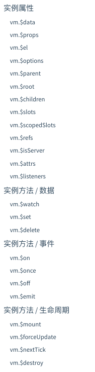
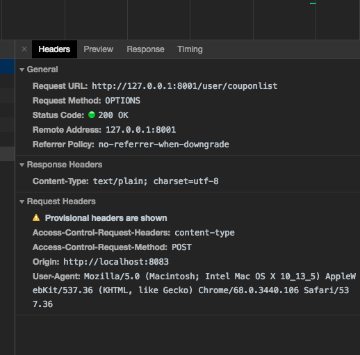
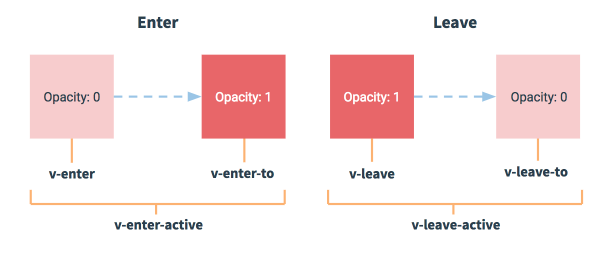

#  vue 学习

## 1. 什么是 Vue.js

* Vue 开发手机 APP 需要借助于 Weex
* Vue.js 是一套构建用户界面的框架， **只关注视图层**， 它不仅易于上手，还便于与第三方库或既有项目的整合。
* 前端主要工作主要负责MVC 中的 V 这一层；主要工作是和界面打交道，来制作前端页面效果。

### 为什么要学习流行框架

* 提高开发效率

* 提高效率

  原生 JS  -> jQuery 之类的类库 -> 前端模板引擎 ->1 angular.js / vue.js （能够减少我们不必要的 DOM 操作，提高渲染效率；双向数据绑定的概念【通过框架提供的指令，我们前端程序员只需要关心数据的业务逻辑，不再关心 DOM 是如何渲染的】）

* 在 Vue 中，一个核心的概念就是让用户不再操作 DOM 元素，解放用户的双手，让程序员更多的时间去关注业务逻辑。（去关注 MVC 的C层）

## 2. 框架和库的区别

* 框架：提供了一整套解决方案；对项目的侵入性较大，如果想要更换框架，则需要重新架构整个项目。
* node 中的 express
* 库（插件）： 提供某个小功能，对项目的入侵性较小，如果某个库无法完成某些需求，可以很容易切换到其他库实现需求。

## 3. 后端 MVC 与 前端中的 MVVM 之间的区别

* MVC 是后端的分层开发概念。（M 主要是CRUD，数据）（v就是视图层）（c 就是业务逻辑层，路由，登录 啊、注销）
* MVVM 是==前端视图层==的概念，主要关注于 视图层分离，也就是说：MVVM 把前端的视图层，分为三个部分：Model， View， VM ViewModel
* MVVM 主要把每个页面分成了 M、V和VM。其中，VM 是 MVVM 思想的核心；因为VM 是 M 和 V 之间的调度者。
* MVC 是后台对整个项目结构归类，MVVM 只是前端的视图层。
* MVVM 中的 M 保存着每个页面中单独的数据，（后台返回的数据）。V就是每个页面中的HTML 结构。 VM 它是一个调度者，分割了M和V，每当V层想要获取或者保存数据的时候，都要由VM做中间件的处理。
* 前端页面中的使用，MVVM 的思想，主要是为了让我们方便开发，因为 MVVM 提供了数据的双向绑定；注意：数据的双向绑定是由MV 提供 的。
* 三大框架都适合做单页面应用

### 配置webpack babel

* 安装 npm i babel-loader babel-core babel-preset-es2015 babel-plugin-transform-runtime -D
* rules: [ // 第三方匹配规则

​            { test: /\.js|jsx$/,use: 'babel-loader', exclude: /node_modules/ }//千万别忘记添加 exclude 排除项

​        ],

####  安装babel插件的配置

npm install babel-plugin-component -D

能够解析babel的插件

# Vue 语法

## 1. vue 的基本代码

* 本次学习 vue 版本为 2.4.0

* 在页面导入 vue 包

  ```html
  <script src="vue.js"></script>
  ```

* 创建一个 Vue 的实例

  当我们导入 vue 之后，在浏览器的内存中，就会多了一个 Vue 构造函数。

  ```javascript
  <!DOCTYPE html>
  <html lang="en">
  <head>
      <meta charset="UTF-8">
      <meta name="viewport" content="width=device-width, initial-scale=1.0">
      <meta http-equiv="X-UA-Compatible" content="ie=edge">
      <title>Document</title>
      <script src="./lib/vue.js"></script>
  </head>
  <body>
      <!-- new 出的 Vue 实例，会控制这个元素中所有的内容 -->
      <!-- Vue 实例所控制的这个元素区域，就是我们的 V -->
      <div id="app">
          <p>{{ msg }}</p>  
      </div>
      <script>
          // 2. 创建一个Vue 实例
          //  当我们导入包之后，在浏览器的内存中，就多了一个 Vue 构造函数
          // 注意： 我们 new 出来的 vm 对象，就是我们的 MVVM 中的 VM 调度者
          var vm = new Vue({
              el: "#app",  // 表示我们 new 的这个 Vue 实例，要控制在页面上的哪个区域
              // 这里的 data 就是 MVVM 中的 M，专门用来保存每个页面的数据
              data: {     //data 属性中，存放着是 el 中要用到的数据,不用再操作DOM 根据提供的指令直接操作
                  msg: 'hello Vue' // Vue 不提倡我们手动去操作 DOM 元素
              }
          })
      </script>
  </body>
  </html>
  ```

## 2. 单文件方式启动

* 单文件就是以`*.vue` 结尾的文件，最终通过 webpack 也会编译成为 `*.js` 在浏览器中运行。
* 内容： <template></template> + <script></script>+ <style></style> 

1. template 中只能有一个根节点 2.x（例如下面只能写一个 div）
2. script 中 按照 export default {配置} 来写
3. style 中可以设置scoped 属性，让其只在 template 中生效

### 以单文件的方式启动

配置好 webpack 之后安装 vue 相关的。

* webpack 找人来理解你的单文件代码

  * vue-loader ,vue-template-compiler, 代码中依赖 vue,

    依赖关系（和安装顺序没关系），先加载，再解析，再依赖vue

  * 安装 npm i vue -S

  * npm i vue-loader vue-template-compiler -D

#### 使用

1. 引入 vue 

   import Vue from 'vue';

2. 创建一个 Vue 实例，一般一个项目，大多数就是一个 vue 实例来完成显示。

   ```javascript
   import Vue from 'vue'
   import App from './app.vue'
   
   // 创建一个Vue的实例，一般一个项目只有一个Vue实例来完成显示
   new Vue({
       el: "#app",  // 目的地
       render(creater) {   // 渲染的内容
           return create(App)
       }
   })
   ```

   Vue 模块化开发

   创建一个 app.vue 文件

   ```javascript
   <template>
       <div>
           hello Vue! {{ txt }}
           输入： <input type="text" v-model="txt"> 
           <ul>
               <li v-for="p in list">
                   {{ p.name }}
               </li>
           </ul>   
       </div>
   </template>
   <script>
   export default {
       // 配置
       // 类似于 $scope.xxx = 'aaa'
       data() {
           return {
               txt: 'hello world',
               list: [{name: 'aaa'},{name: 'bbb'}]
           }
       }
   }
   </script>
   <style>
   
   </style>
   
   
   
   ```


* 注意： 每一个 第三方模块都有一个 package.json 文件，其中 main 属性后面对应的是入口文件。

## 3. 项目结构

* src 下存放着人可以看懂的代码，具备一定的功能划分，MVC

* dist 存放着上线的代码，（减少请求、混淆代码），机器能看懂

* 两个命令

  * webpack 立即读取 配置文件，生成到 dist 目录下
  * Webpack-dev-server 运行 src 下的代码，虚拟出 build.js 测试

* 拿到项目 npm i,

  npm i --production  不会安装开发环境的依赖

## 4. vue 组件化

* angular 模块化， 双向数据绑定（脏检测： 一个数组（$watch），更改之后检测一大堆，效率较差）

* vue 组件化

  组件： 组合起来的一个部件

  * 头部： 页面、样式、 动态效果
  * 代码： template  style   script
  * 双向数据流（基于ES5中的 defineProperty 来实现的，监听），IE9才支持


## 5. 双向数据流

1. js 内存属性发生改变，影响页面的变化
2. 页面的改变影响Js内存属性的改变

## 6. 常用指令

* v-text 是元素的 inner-Text 只能在双标签中使用（单标签一般用 value 属性）

  <span v-text="text"></span>

* v-html 是元素的 innerHTML， 不能包含 {{xxx}} 表达式

* v-if  元素是否移除或者插入

* v-show 元素是否显示或隐藏

* v-model 双向数据绑定

  一般使用在 input 标签中

  使用不需要再给 input 标签再给 value 值，value 只能给字符串，不能给变量。

  v-model 能给 select 标签选中变量指定的 option

  注意： v-model 相当于绑定表单元素的 value 属性

* v-bind 给元素某属性赋值

  例： v-bind:value='text' 这种绑定是单向的

  绑定之后可以传递变量来实现属性的绑定。v-bind 会把后面绑定的属性当做变量来执行，符合 js 语法的都可以直接写。

* V-cloak 这个指令保持在元素上直到关联实例结束编译。和 CSS 规则如 `[v-cloak] { display: none }` 一起用时，这个指令可以隐藏未编译的 Mustache 标签直到实例准备完毕。

  v-cloak 当做一个class一样的属性来使用。 在样式中使用像元素属性一样使用，直接用[]包围。避免闪烁。

* ```
  [v-cloak] {
    display: none;
  }
  <div v-cloak>
    {{ message }}
  </div>
  ```

v-bind 是单向数据绑定（内存js 改变影响页面），v-model 双向数据绑定

### class 结合 v-bind 使用

* 需要根据可变表达式的结果来给 class 赋值，就需要用到 v-bind:class="xxx"

  ```javascript
  <template>
      <div>
          <div v-bind:class="isRed?'red':'green'">aaaaaa</div>
  		<div :class="{'red':true,'big':true}">aaaaaa</div>
      </div>
  </template>
  <script>
  export default {
      data() {
          return {
              isRed: true
          }
      }
  }
  </script>
  <style>
      .red {
          background: red;
      }
      .green {
          background: green;
      }
  </style>
  
  
  ```

  ```html
  <div :class="{'red':true,'big':true}">aaaaaa</div> 
  ```

  可以简写，并且传递对象

  变量是直接在字符串中使用，class 是在字符串中加 字符串

  V-bind:  可以简写为 :

* v-bind:属性名=“表达式”，最终表达式运算结束的结果赋值给该属性名 

  * 引号里面可以放变量，也可以放字符串，字符串需要引号，把它当成一个 js  区域即可。

    加引号表示一个字符串，不加引号表示一个变量

  * 多个样式：返回对象（样式做key,true或false做为值）

    对象的 key 可以加引号，也可以不加引号

* 使用数组传值的形式

  :class="['red', 'green']"

注意： 传递多个class 的时候，不能够像 HTML 中直接并排写，需要使用数组或者对象的形式。单个class 即可以直接写。

### 内联样式

1. 直接在元素上通过 :style 的形式，书写样式对象

   ```html
   <h1 :style="{color:'red','font-size':'40px'}">
   </h1>
   ```

   采用了 : 就代表这是一个js 区域，因此 font-size 这样的 - 的样式需要加引号，也可以使用 fontSize 这样的 JS 样式书写方式

2. 直接使用 html 的内联样式  直接使用

3. 在 data 中写一个对象，对象中防止它的样式

4. 放一个数组，数组中传递一个一个的样式对象（data中定义好的），注意与 class 的区别。class 中的对象是在 style 标签中定义的，行内样式的对象是在 data 中定义的对象。

### 6.1 事件

* 绑定事件： v-on:事件

  例如： v-on:click

  事件后面加变量或者函数等任何表达式

  事件能够实时监测页面，页面会根据绑定变量的变化而变化

  简写：@事件名=“表达式||函数名”

  * 函数如果没有参数，可以省略括号 @click="fn"

* 绑定函数

  事件后面可以直接绑定函数。 v-on:click="fn()"

  在方法中使用当前模块的变量需要加 this 来调用

* 对象绑定形式

  ```html
  <button v-on="{ mousedown: doThis, mouseup: doThat }"></button>
  ```

  绑定多个对象。

* 函数写在 methods 中

  声明组件内函数，在 export default 这个对象的根属性加上 methods 属性，其是一个对象

  * key 是函数名 值是函数体

  在 export default 这个对象的跟属性加上 data 属性，其是一个函数，返回一个对象

  * 对象 的属性使我们初始化的变量的名称

* ==在绑定事件时，能够使用 $event 来调用原生事件对象的属性==

  ```html
  <button v-on:click="warn('Form cannot be submitted yet.', $event)">
    Submit
  </button>
  ```

  ```js
  // ...
  methods: {
    warn: function (message, event) {
      // 现在我们可以访问原生事件对象
      if (event) event.preventDefault()
      alert(message)
    }
  }
  ```

  使用 event 能够实现对事件绑定元素的操作，和原生的 event 对象是一样的。

### 6.1 注意 .native 事件修饰符

* 根据Vue2.0官方文档关于父子组件通讯的原则，父组件通过prop传递数据给子组件，子组件触发事件给父组件。但父组件想在子组件上监听自己的click的话，需要加上`native`修饰符，故写法就像上面这样。
* ==例如点击在父组件上显示的自定义的子组件，需要给点击 @click.native = fn。 .native 主要是给自定义的组件添加原生的事件的修饰符！==
* 如果不添加 .native 时间修饰符的话，会被当成自定义事件来处理。默认使用 $emit 来触发自定义的事件

#### 6.1.1 事件修饰符

* 在事件处理程序中调用 `event.preventDefault()` 或 `event.stopPropagation()` 是非常常见的需求

事件修饰符：

* .stop 阻止冒泡

  一定要明确 冒泡 行为是从里到外，阻止之后外层盒子绑定的事件将不再执行，不再有委托特性。

* .prevent 阻止默认事件

  比如说 a 标签的点击触发事件,，能够阻止a 标签的跳转

* .capture 添加事件侦听器时使用事件捕获模式

  与冒泡触发事件相反。从外向里触发事件。

* .self 只当事件在该元素本身（比如不是子元素）触发时触发回调

  防止事件委托。.self 与 .stop 的区别就是 .self 是给最外层的盒子加的修饰符，.stop 是 给子元素添加的修饰符。.self 并不能阻止从它本身向外冒泡的性质。

* .once 事件只触发一次

事件修饰符可以链式调用，例如 .prevent.once，once 是作用于 前面的事件的，阻止默认事件只执行一次。

使用：

​	@click.stop 	


* v-for 的使用

  可以使用操作数组 （item,index）

  可以使用 操作对象 （value, key, index）

  使用：

  数组： v-for="(value, index) in arr" :key="index"

  对象：  v-for="(value, key, index) in obj" :key="index"

  数字：迭代数字  v-for="i in 10" 也需要key

  需要绑定 key ,key 的值可以为 number 也可以为 string 不能为对象

  :key="index" 

  注意： key 的值最好用 value 中一项，防止出错

总结：

1. v- 指令后面加字符串，字符串中加js变量或者语句

* data 中的数据既可以使用v-text 类似有意义的绑定，也可以在 {{}} 中直接使用。

2. 凡是在 template 中使用 当前模块的变量，不需要加this 

   在script中使用当前模块的变量，需要加 this

3. 没有加 v- 的指令需要使用 v-bind: 来绑定

4. 实例化的 Vue 对象会实时监听自身 data 的变化，只要数据发生改变，就会自动把最新的数据，从 data 中同步到页面上。好好处就是 只关心数据，不需要操作 DOM ，关心 DOM 的改变。

5. v-if  直接不会创建出该元素

   v-show 只是会隐藏该元素

   v-if 有较高的切换性能消耗

   v-show 有较高的初始渲染消耗

### 6.2 eval() 方法的再次登场

* 计算字符串中的值，并返回（若果有的话）
* 字符串中是表达式，不是语句

### 6.3 array 又添加方法啦

* arr.map 方法，能够遍历数组中的每个元素，做出相应的处理。参数为function(item,key)和forEach 相同
* arr.some 方法，找到符合条件的元素就结束。参数相同，都是用 return 来结束
* arr.forEach() 方法，只是遍历数组，不会对本数组进行操作，可以用外面的数组来进行对比操作
* arr.filter() 方法，过滤吊不符合的元素，并返回新数组

## 7. SPA（单页面应用）组件的使用

* 使用组件的组件就是父组件
* 被使用的组件就是子组件

单页面中使用组件：（在导出的对象中）

```javascript
components: {
    // 组件名(在末班中使用的)：组件对象
}
```

组件对象需要在script 标签中使用 import 引入

* 单页面样式的使用

  如果希望该样式只在当前组件有效，可以给 style 加一个 scoped 属性

* 父子组件的使用（父传子）

  * 父和子，使用的父，被使用的是子
  * 父需要声明子组件，引入子组件对象，声明方式如下

  ```javascript
  components: {
      // 组件名(在末班中使用的)：组件对象
  }
  ```

  需要先引入一下。

  注意引入的组件名称不能够使用 - 来连接

* 全局组件，使用更为方便，不需要声明，直接使用，需要在 main.js (index.js) 中引入

  在 main.js (index.js) 中引入一次，使用 vue.component('组件名', 组件对象)；

  注册一个组件，第一个参数是名称，在 template 中使用，第二个参数是实际的对象，显示成什么内容，具备什么功能

  ```javascript
  import Vue from "vue"
  import App from "./components/app.vue"
  import Headervue from "./components/header.vue"
  import Bodyvue from "./components/body.vue"
  import Footervue from "./components/footer.vue"
  
  Vue.component("Headervue", Headervue);
  Vue.component("Bodyvue", Bodyvue);
  Vue.component("Footervue", Footervue);
  
  new Vue({
      el:"#app",
      render(creater) {
          return creater(App)
      }
  })
  ```

  直接就可以全局使用了。

* 接受父组件值参数的设置

  例子：props: ['text1']

  ​	是一个数组，可以接受很多数据。==接受组件在实例化过程中传递的参数。==

  ​	组件在作为标签使用的时候要定义一个 text1 = 'aaa'  的属性。

  可以通过使用 v-bind:text="name" 的形式，来让 text 能够被赋值变量。

  在js 中获取props 中的值，直接使用 this.text 来获取，和获取 data 中的数据是一样的。 


### 7.1 父传子

* 父组件通过子组件的属性将值进行传递

  方式有2：常量， 变量

* 子组件需要声明

  根属性 props: ["prop1", 'prop2']

  在页面中直接使用 {{prop1}}

注意： 

1. 组件 当标签使用的时候，不能再给标签中加东西了（加了也不顶用），而且都是双闭合标签
2. 只有带 v- 的属性可以传递变量，其他自定义的只能传递字符串，当做传入的值。可以使用 v-bind:text=""的形式来绑定，这样之后就可以直接传递变量。
3. 子组件的形式是一下传递一个子组件对象，全局组件的形式是一个一个传入组件对象，因此一个加 s 一个不加 s


## 8. 如何查看 vue 文档

* 全局 API 和 配置

  通过Vue. 能够调用的

* 实例方法/事件

  实例：组件内的 this 和 new Vue()

  

  只要能调用 this，就是一个实例

* 选项/数据

  options/类别 和实例相关，就是实例中的export 导出的那部分的key和new Vue 中传递的参数

* 全局的 API 是在 index.js 文件中添加，然后所有的 组件 中都能使用的

  全局API 对应的局部选项，是在每个组件中，为当前组件添加的

## 9. 子向父组件通信（vuebus）（扩展）

* 父与子组件之间的通信可以通过 

  实例.$on('自定义事件名称', function(){})

  实例.$amit('事件名称', '参数')

  使用$amit 能够出发 $on 中自定义的事件

  使用一个中间的模块，中间模块 new 一个 Vue 对象，两个组件分别引入这个 Vue 对象，调用这两个方法，可以实现通信。

************

在 vue 中不会提及 DOM 元素的操作，只要涉及直接操作 DOM 元素，都应该用 vue 来实现

## 10. 过滤器

* vue 允许你自定义过滤器，可被用于一些常见的文本格式化。过滤器可以用在这两个地方，mustachc插值{{}}和 v-bind 表达式。过滤器应该被添加在 js 表达式的尾部，有管道 符指示。

  例： {{ name | nameope }}

* 定义一个过滤器

  Vue.filter('过滤器名称', function(data) {})

  function 中第一个参数为管道符前面的值。

  ```javascript
  Vue.filter('msgFormat', function(msg) {
      return msg.replace('aaa', 'bbb')
  })
  ```

  ```javascript
  Vue.filter('msgFormat', function(msg, arg1, arg2) {
      return msg.replace('aaa', arg1+arg2)
  })
  ```

  也可以传递多个参数， {{ name | nameope(arg1, arg2) }}

  过滤器可以被多次调用

   {{ name | nameope(arg1, arg2) } | test }

* 过滤器调用规则

  先调用私有的过滤器，然后调用全局的过滤器（如果名称相同）

* es6 中的 自动填充 字符串方法

  .padStart(2, '0')   以 0 填充为长度为 2 的字符串

  .padEnd(2, '0')

## 11. 按键修饰符

* vue 提供了触发事件的按键修饰符，比如在能够输入键值的情况下

  - `.enter`
  - `.tab`
  - `.delete` (捕获“删除”和“退格”键)
  - `.esc`
  - `.space`
  - `.up`
  - `.down`
  - `.left`
  - `.right`

  使用： @kendown.enter = 'fn'

  也可以 @keyup.13 = 'fn'  ,  直接绑定按键的代码。

  也可以通过全局对象来设置(只能全局啦)，config 只能通过全局设置

  ```javascript
  Vue.config.keyCodes = {
    v: 86,
    f1: 112,
    // camelCase 不可用
    mediaPlayPause: 179,
    // 取而代之的是 kebab-case 且用双引号括起来
    "media-play-pause": 179,
    up: [38, 87]
  }
  ```

## 12. 自定义指令

* 全局定义

  使用 Vue.directive() 定义全局的指令  v-focus

  其中： 参数1：指令的名称，注意，在定义的时候，指令的名称前面，不需要加 v- 前缀，在调用的时候，必须在 指令名称前 加上 v- 前缀来进行调用

  参数二： 是一个对象，这个对象身上，有一些指令相关的函数，这些函数可以在特定的阶段，执行相关的操作

  常用到的钩子函数：

  ```javascript
  Vue.directive('focus', {
  
  	bind: function(el) {  // 每当指令绑到这个元素上的时候，会立即执行这个 bind 函数，只执行一次
      // 注意： 在每个函数中，第一个参数永远是 el ，表示 被绑定了 指令的那个元素，这个 el 参数是一个 原生 的 js 对象，可以使用 js 原生 DOM 方法
      // 在元素刚绑定了指定的时候，还没有绑定到 DOM树 中去，调用 focus 方法没有作用
  		el.focus()
      },
      inserted: function(el) { // 当元素插入到 DOM 树种的时候，会执行 inserted 函数[触发一次]
      	el.focus()
  	},
      updated: function (el) {  // 当VNnode 更新的时候，会执行 updated ，可能会触发多次
           
      }
  })
  
  ```

  页面刷新获取焦点，必须使用 inserted 来绑定自定义指令，只有绑定它之后，元素才会插入DOM 树

  应用：

   直接添加属性  v-focus  后面不用加值。

​	修改样式的自定义指令，可以使用 bind 来绑定方法。

注意：

1.  一般行为的自定义指令，需要 js 操作DOM 需要使用 inserted 的方式自定义指令。不能再内存中操作。

​	需要在页面中操作。要不然绑定不上方法。

2. 样式的操作会先加载完DOM 才会加载样式，因此可以使用 bind 的形式来 自定义样式，在内存中就会操作。

   样式，只要通过指令绑定给了元素，不管这个元素有没有被插入到页面中去，这个元素肯定有一个内联的样式，将来元素肯定会渲染到页面中去。

* 钩子函数的参数（看文档，教程里面）

  自定义指令之后，指令需要执行的函数中的参数

  第一个参数为 el ，当前绑定的元素

  第二个参数为一个 对象 binding

  包含很多属性：

  ​	常用的有 name (指令名称)

  ​			value(计算之后的值)

  ​			expression(把指令中的表达式拿到，原封不动)

  ​	比如说一个 字符串 'blue'，  v-color="'blue'"

  ​	value 拿到的值为 blue 类型为 字符串

  ​	expression 拿到的为 'blue'  字符串中的字符串

* 如果你可能只想在 `bind` 和 `update` 时触发相同行为，可以简写，省去对象的书写，直接写函数

  ```javascript
  Vue.directive('color-swatch', function (el, binding) {
    el.style.backgroundColor = binding.value
  })
  ```

  相当于把函数写到 bind 和 update 中去了。

  注意： 唯一一个直接操作 DOM 的

## vue 双向数据绑定注意

==vue 双向数据绑定 绑定的数组和对象除了直接更改对象的引用能够监听到，其他的修改引用内的属性的方式都无法被监听到。==

还是由于 JavaScript 的限制，**Vue 不能检测对象属性的添加或删除**：（但是vue能够监听到属性的变化）

对于已经创建的实例，Vue 不能动态添加根级别的响应式属性。但是，可以使用 `Vue.set(object, key, value)` 方法向嵌套对象添加响应式属性。

```js
var vm = new Vue({
  data: {
    userProfile: {
      name: 'Anika'
    }
  }
})
// 使用全局的方式添加属性
Vue.set(vm.userProfile, 'age', 27)
// 使用vue实例的方式添加属性
vm.$set(vm.userProfile, 'age', 27)
```

###  给对象添加多个属性--使用Object.assign()

使用 Object.assign() 方法，如果需要给一个对象添加多个属性，推荐使用第一个参数为空对象的形式，防止对原对象的修改。

```js
vm.userProfile = Object.assign({}, vm.userProfile, {
  age: 27,
  favoriteColor: 'Vue Green'
})
```

直接给这个对象重新赋值，即可实现对象的双向数据绑定

Object.assign 方法值支持可枚举 的属性的赋值。

可枚举的性质是在定义这个属性的时候来设置的，比如

```js
Object.definePropety(obj, "age", {
    enumerable: false
})
```


# Vue 选项

## name

* 组件在父组件中注册的时候，自动的把定义的 ID 作为 name 选项

  指定 `name` 选项的另一个好处是便于调试。有名字的组件有更友好的警告信息。另外，当在有 [vue-devtools](https://github.com/vuejs/vue-devtools)，未命名组件将显示成 `<AnonymousComponent>`，这很没有语义。通过提供 `name` 选项，可以获得更有语义信息的组件树。

* 直接作为选项 在 vue 实例中使用 name 属性来赋值

## mixins(混入)

* mixins 作为 vue 的一个选项，能够将一些公共的方法或者是data 之类的组件选项，封装起来实现复用。需要指定一个 vue 对象。mixins 对应的是一个数组。

* mixins 就相当于 vue 组件的函数封装，比如只会用到的一些公用的方法（如果公用一些template模板之类的，应该封装成公共的组件）

* 比如两个组件共同使用一些方法，就可以单独定义到一个 对象中。

  ```js
  const base = {
      methods: {},
      data: {}
  }
  
  new Vue {
      el: "#app",
      mixins: [base]
  }
  ```

  ***如果传入的对象包含钩子函数，Mixin 钩子按照传入顺序依次调用，并在调用组件自身的钩子之前被调用。***他们将在 `Vue.extend()` 里最终选择使用相同的选项合并逻辑合并。（就是如果说存在相同的方法）

## 混入

混入就是 mixins 的应用，还包括一个全局的混入

```js
const base = {}
Vue.mixin(base)
```

* 注意 vue 实例中的所有的东西都可以使用 vm.$ 的形式访问到

```js
new Vue {
    Option: {},
        methods: {
            fn() {
                console.log(this.$Option)
            }
        }
}

```

### 混入合并规则

data 数据优先是组件本身就有的 data ，然后使用mixins中的数据。

## prop（特性）

* 通过 prop  能够实现父组件 给子组件传值

* props 中的数据能够直接当做 属性 的形式在组件上使用

  ```js
  Vue.component('blog-post', {
    props: ['title'],
    template: '<h3>{{ title }}</h3>'
  })
  <blog-post title="My journey with Vue"></blog-post>
  ```

  注意： 并不是 组件拥有 title 属性，是template 中使用了 title 属性在组件中呈现

### Props 验证

* 我们可以为组件的 prop 指定验证要求，例如你知道的这些类型。如果有一个需求没有被满足，则 Vue 会在浏览器控制台中警告你。这在开发一个会被别人用到的组件时尤其有帮助。
* 为了定制 prop 的验证方式，你可以为 `props` 中的值提供一个带有验证需求的对象，而不是一个字符串数组。（就是验证传过来的值）

```js
props: {
    // 基础的类型检查 (`null` 匹配任何类型)
    propA: Number,
    // 多个可能的类型
    propB: [String, Number],
    // 必填的字符串
    propC: {
      type: String,
      required: true
    },
    // 带有默认值的数字
    propD: {
      type: Number,
      default: 100
    },
    // 带有默认值的对象
    propE: {
      type: Object,
      // 对象或数组默认值必须从一个工厂函数获取
      default: function () {
        return { message: 'hello' }
      }
    },
    // 自定义验证函数
    propF: {
      validator: function (value) {
        // 这个值必须匹配下列字符串中的一个
        return ['success', 'warning', 'danger'].indexOf(value) !== -1
      }
    }
  }
```

* 能够验证类型、是否必须、默认值
* 注意：如果不使用数组的形式接收传值，也可以使用验证的形式来实现值的定义接收

## model 选项

* 该选项与 `v-model`配合使用，规定了 v-model 绑定的事件和绑定的变量

  ```js
  Vue.component('base-checkbox', {
    model: {
      prop: 'checked',
      event: 'change'
    },
    props: {
      checked: Boolean
    },
    template: `
      <input
        type="checkbox"
        v-bind:checked="checked"
        v-on:change="$emit('change', $event.target.checked)"
      >
    `
  })
  ```

  获取这个值用 checked，触发用 change 事件。

## inheritAttrs 

* 父组件给子组件传递的数据需要子组件使用 props 来进行注册，如果没有注册则不能使用该数据。会当做普通元素的属性绑定到子组件最外层的元素上。

  

  使用了 `inheritAttrs`选项设置为 false 可以不在属性中显示未注册的数据。

## $attrs

* 使用 vm.$attrs 能够获取到所有别传入的数据，不论 inheritAttrs 的设置。

# Vue 生命周期

* 生命周期： 从Vue 实例的创建、运行、到销毁期间，总是伴随着各种各样的事件，这些事件，统称为生命周期！（说白了就是各种事件）

* 生命周期钩子：就是生命周期事件的别名

  生命周期钩子=生命周期函数=生命周期事件

  

1. var vm = new Vue({}) 

2. init 表示初始化一个 Vue 空的实例对象，这时候这个对象身上，只有默认的一些生命周期函数和默认的事件，其他的东西都未被创建

3. 在 beforeCreate 生命周期函数执行的时候，data 和 methods 中的 数据都还是没有初始化

   在实例化对象中有一个 beforeCreate（） 函数，在执行这个函数的时候，打印 data 或者是 methods 都显示undefined，这个函数会自动的被调用

4. 在 created() 方法中，data 和 methods 中的数据都已经加载好了，可以直接调用。

   如果要调用 methods 中的方法和操作data 中的数据，最早能在 created 方法中调用

5. 是否存在 template 选项，编译 template 模板

   判断是否存在 el 选线的时候，表示 Vue 开始编译模板，吧 Vue 代码中的那些指令进行执行， 最终，在内存中生成一个编译好的最终模板字符串，然后把这个模板字符串，渲染为 内存中的 DOM ，此时只是在内存中，渲染好了模板，并没有把 模板挂在到真正的页面当中去。 

6. 第三个生命周期函数 beforeMount （在嵌入前），表示模板在内存中编辑完成了，但是尚未吧 模板 渲染到页面中。

   执行 beforeMount ，打印页面上元素的值，还无法打印出  使用 document.getElementById()

7. 第四个生命周期函数，mounted() 表示内存中的模板，已经真实的挂载到页面中，用户已经可以看到渲染好的页面了。可以获取到

   mounted 是实例创建期间的最后一个生命周期函数，当执行完 mounted 就表示，实例已经被完全创建好了，此时，如果没有其他的操作的话，这个实例就存放在内存中。

   如果要通过某些插件操作 DOM ，最好在 mounted 方法中进行。

   只要执行完了 mounted ，就表示整个 Vue 实例已经初始化完毕了，此时，组件已经脱离了创建阶段；进入了运行阶段

8. 接下来的圈是组件运行阶段的生命周期函数，只有两个 beforeUpdate 和 updated 

9. 当 data changes 时，beforeUpdate 会触发，这俩事件，会根据 data 数据的改变，有选择性的 触发 0次 到 多次

   这时候表示我们的界面还没有被更新，数据被更新啦。 MVVM 中 M 被更新啦，还没有表现到 v 上面。

   当执行 beforeUpdate 的时候，页面中的显示的数据，还是旧的，此时 data 数据是最新的，页面上的数据还没有同步。编写程序实现

10. virtual DOM 虚拟的DOM  patch 打补丁

    这一步执行的是：先根据 data 中的最新的数据，在内存中，重新渲染出一份 最新的 内存 DOM 树， 当最新的内存 DOM 树被更新之后，会把最新的 内存DOM 树，重新渲染到真实压面中去，这时候，就完成了数据 从 data（Model）-> view（视图层）的更新。

    生命周期函数 updated()，执行的时候页面和data 数据已经保持同步更新了，都是最新的

11. 当执行 beforeDestroy 钩子函数的时候，Vue 实例就已经从 运行阶段，进入到了销毁阶段，当执行 beforeDestroy() 函数的时候，实例身上多有的 data 和所有的 methods ，过滤器、指令等等，都处于可用状态，此时还没真正执行销毁过程。

12. 当执行 destroyed 函数的时候，组件已经被销毁啦，此时组件所有的数据都不可用了。

总结： 两次使用到 钩子函数的地方，自定义指令 和 生命周期钩子函数。

​	钩子函数只会执行一次！（除了 beforeUpdate 和 updated）

2.0 新的生命周期钩子补充：（配合 keep-alive 组件使用）

**activated在组件第一次渲染时会被调用，之后在每次缓存组件被激活时调用**

**deactivated：组件被停用(离开路由)时调用**

# 使用 vue-resource 

* 安装 npm i vue-resource

* import VueResource from 'vue-resource'

* 安装插件（所有带 vue- 的第三方插件都可以这么用）

  Vue.use(VueResource);  能够通过this.$http，插件都是挂载属性，在原型上挂载

  原理： Vue.prototype.$http -> 实例(this)就可以 .$http

* this.$http.get(url).then(data).catch(srr)  基本使用

* 请求方式 Request Method: OPTIONS

  options 预检请求，是当浏览器发现跨域+application/json 的请求，就会自动发起并且在发起的时候携带了一个 content-type 的头(Request-Headers)

  因此需要设置 emulateJSON:boolean

  content-type:application/x-www-form-urlencoded

  

# axios 基于Promise的http库，适用于浏览器和node.js。

* vue 不推荐操作 DOM ，不推荐使用 jQuery，因此发送ajax 请求需要第三方工具
* axios 可以在三大框架中使用
* 浏览器端发起XMLHttpRequests请求
* node端发起http请求
* 支持Promise API
* 拦截请求和返回
* 转化请求和返回（数据）
* 取消请求
* 自动转化json数据
* 客户端支持抵御[XSRF（跨站请求伪造）](http://baike.baidu.com/link?url=eFrTMGA9IsLxlOnyqKky-t6vTs3g6YoAfFc1sYmv2fVVS1FrfIoI3q3jxUV_o1AgIIoLdk9N0Ni_TxLItoRU3K)

安装：npm i axios

引入：import Axios from 'axios'

给 Vue 原型挂载一个属性

Vue.prototype.$axios = Axios;

在 created 钩子函数中调用

this.$axios.get('url',{params: {ID: 12345}}, { headers: {'content-type': 'application/x-www-form-urlencoded’}}).then(data).catch(err)

this.$axios.post('url', {key: 'value'}, {}).then().catch()

post 请求的第三个参数为设置

常用设置： headers: {

​				'content-type': 'application/x-www-form-urlencoded'

​			}

form data 数据的格式应该为 key=value  的形式

如果不设置 headers 的话，请求数据的格式应该为 key=value 的形式（value 没有自动的转换）

this.$axios.post('url', 'key=value', {}).then().catch() ，如果你写这 json  浏览器就会自动把请求头设置成 json 的格式。

请求的服务器数据不是同网页的服务器，因此需要跨域，axios 已经实现了跨域。

get 请求的设置在第二个参数，post 请求的设置在 第三个参数。

配置：

 Axios.defaults.baseURL = 'http://127.0.0.1:8001/'  可以配置默认的地址，get 和 post 请求中的地址会直接拼接在后面。(也可局部设置)

局部设置：axios.defaults.baseURL = 'http://47.89.21.179:8080'；

设置完成直接写后面需要补充的字符串。

* 总结

  1. Post 请求的时候，如果数据是字符串，默认头就是键值对，否则是对象就是 application/json

  2. this.$axios.get(url, options)

     this.$axios.post(url, data, options)

     常用设置： options: {params:{id:1}, headers:{}}

也可以 import Axios from 'axios'

直接使用对象在局部使用

* 手动发起的请求没有表单格式，application/x-www-form-urlencoded，有的服务器处理不了
* form data 表单数据

# Vue 动画



* Vue 动画分为四个部分
* 进入动画(v-enter-active)  v-enter  v-enter-to
* 离开动画 (v-leave-active)  v-leave  v-leave-to
* 时间段 加 一个 active
* 四个时间点 和 两个时间段               

使用：

1. 使用 transition 元素，把需要被动画控制的元素，包裹起来.

   transition 是 vue 官方提供的

   <transition> 

   </transition>

2. 自定义两组样式，来控制 transition 内部元素实现动画

   ```html
   <style>
   
   	.v-enter, .v-leave-to {
   
   		/*设置出入时间点的样式*/
   
   		opacity:0;
   
   		transform: translateX(80px)
   
   	}
   
   .v-enter-active, .v-leave-active {
   
   	transition: all 0.4 ease;
   
   // 设置 该时间段的过渡
   
   }
   
   </style>
   
   ```

   

   不规定 .v-enter-to 的样式，默认恢复默认样式。

   如果一个元素想要实现上述的动画，需要设置 v-if = 'flag'，让 transition 元素包括。会自动给它加这个类，由于元素的进出，需要 加 v-if 让它实时进出，才能实现效果。

定义私有的动画：

上述的动画效果，只要被 transition 元素包括的都会执行一样的效果。如果希望只执行自己的动画效果，需要给 transition 元素的name 属性定义一个私有的 标记，在样式中直接使用私有的 标记-enter 的形式就可实现动画的私有定制。

例：

```html
<transition name='my'> 

</transition>

<style>

	.my-enter, .my-leave-to {

		/*设置出入时间点的样式*/

		opacity:0;

		transform: translateX(80px)

	}

.my-enter-active, .my-leave-active {

	transition: all 0.4 ease;

// 设置 该时间段的过渡

}

</style>

```


## 动画使用第三方类实现

`animate.css` 是一个集合酷的，有趣的和跨浏览器的动画。

引入 css 模块

直接在 transition 标签元素上添加对应的类，vue动画添加类采用 enter-active-class='' 和 leave-active-class='' 后面直接加类名

例：

```html
<transition enter-active-class='animated bounceIn' leave-active-class='animated bounceOut' :duration='200'>
	<h3 v-if="flag">h3 元素</h3>
</transition>
```

注意：需要加基础类，animated。或者加到动的元素身上也可以。

```html
<h3 v-if="flag" class='animated'>h3 元素</h3>
```

* 定制一个显性的过渡持续时间 (以毫秒计)：

  :duration='200'   持续时间 200 毫秒

* 分别定制过渡时间

  :duration='{enter:200, leave: 300}'

注意：enter-active-class 后面跟着的 js 变量

## 使用钩子函数实现动画

使用钩子函数实现 动画 可以只实现半程的动画，不用实现全部过程的动画。

```html
<transition
  v-on:before-enter="beforeEnter"
  v-on:enter="enter"
  v-on:after-enter="afterEnter"
  v-on:enter-cancelled="enterCancelled"

  v-on:before-leave="beforeLeave"
  v-on:leave="leave"
  v-on:after-leave="afterLeave"
  v-on:leave-cancelled="leaveCancelled"
>
  <!-- ... -->
</transition>
```

如上：钩子函数实现动画的形式采用事件绑定的形式，因此绑定的事件需要在 methods 中实现。

```javascript
beforeEnter(el) {
    // 动画入场之前，此时，动画尚未开始，可以在 beforeEnter 中，设置元素开始动画之前的样式
    el.style.transform = 'translate(0, 0)'
}
enter(el) {
    
}
```

动画钩子函数的第一个参数el 表示要执行动画的哪个元素，是个原生的 JS DOM 对象。

在执行过程中的函数 enter 和 leave 函数中，第二个参数尾 done 表示 after-enter 的绑定函数，只要调用 done() 函数，在过渡完成或立即执行 afterEnter() 函数，不会存在等的问题。 

注意： 在 enter() 函数中写动画的最终状态，需要些 一行代码 el.offsetWidth。这样动画才能正确执行到终点位置。

```javascript
methods: {
      beforeEnter(el) {
          el.style.transform = "translate(0, 0)"
          el.style.opacity = 0
      },
      enter(el) {
        //   el.offsetWidth
        //   el.style.transform = "translate(100px, 800px)"
        //   el.style.transition = "all 1s ease"
          
        //   el.style.opacity = 1
        //   done()
      },
      afterEnter(el) {
          el.style.transform = "translate(100px, 800px)"
          el.style.transition = "all 1s ease"
          el.style.opacity = 1
          this.flag = !this.flag
      }
  }
```

也可以在 afterEnter() 中实现动画。

### 过渡模式

* <transition> 默认行为是 进入和离开是同时发生的

  为了避免进入和离开时产生的突兀，引入了 过渡 的概念，更平滑的处理进入和离开情况。 

* 过渡模式在 transition 标签中加入 mode 属性来控制过渡的情况。

  同时生效的进入和离开的过渡不能满足所有要求，所以 Vue 提供了 **过渡模式**

  - `in-out`：新元素先进行过渡，完成之后当前元素过渡离开。
  - `out-in`：当前元素先进行过渡，完成之后新元素过渡进入

## 给列表实现动画

 给 li 列表实现动画效果，需要 使用 transition-group 取代 transition 来包裹加动画的元素.

列表的改变会影响位置的变化，如果需要给位置变化加动画需要使用 .v-move 样式类来实现（和 .v-enter 用法一样）。

如果加上 .v-leave-active{position: absolute} 可以使元素飘起来，实现效果。

.v-move 要结合 .v-leave-active{position: absolute} 使用。

注意： 所有的  .v- 的样式，全部会加到 动画的元素身上

* 开始入场动画：可以通过 `appear` 特性设置节点在初始渲染的过渡。
* 注意：采用直接在 ul 下使用 transition-group 标签包括的情况，容易出现ul 下面有一个 span 标签的情况，最好采用 取消 ul 标签，在 transition-group 标签中加 tag="ul"， 会自动的在最外层渲染为一个 ul 标签，如果不指定，默认渲染为 span 标签

## 动画注意

* 过渡模式的开启，一般都要结合 .v-leave-active{position: absolute} 来使用，不会出现错误。

# 模块化 和 组件化

* 模块化是代码逻辑的角度来说的；方便分层开发，保证每一个功能模块的职能单一。
* 组件化：从 UI 界面的角度来进行划分的，前端组件化，方便 UI 的重用

组件创建的三种方式

1. 使用 Vue.extend 来创建全局的 Vue 组件

   ```javascript
   var com1 = Vue.extend({
       template: "<h1>aaa</h1>" // 通过 template 属性，指定了组件要展示的 HTML 结构
   })
   ```

   使用 Vue.component('组件的名称', '创建出来的模板对象')

   Vue.component('myCom1', com1)

   注意： 使用组件的时候，要使用 - 连接 的形式，（不使用驼峰命名，直接使用）

   ​		<my-com1></my-com1>

   ​	style 样式的书写在 js 代码中也要驼峰

注意：组件的引用就是 使用组件标签

2. 第二种

   Vue.component('myCom', {

   ​	template: "<h1>111</h1>"

   })

3. 第三种

   Vue.component('myCom', {

   ​	template: "#temp1"

   })

   将 template 写到页面上，直接使用 # id 选择器引入，说明 Vue 接受对象，都可以接受 ID。

自定义组件的命名最好为 "" 包括起来

## 组件中的 data

实例中的 data 为一个对象，组件中的data 必须为一个方法，并且返回一个对象。

# 组件的切换

* 在项目中点击切换为登录，切换为另一个 小界面

v-if 和 v-else 的配合使用。

它两个必须使用同一个变量

## Vue 提供的组件表达方式

Vue 提供了 component 标签来表示组件的使用，

例： 

```html
<component :is="'组件的名称'"></component>
```

组件的名称是一个字符串，在 component 中使用，需要加引号。

可以使用 组件的名称的切换，来达到页面中 组件切换的效果。

注意： 在html 标签中写 JS 代码，所使用到的变量，必须在 data 中定义。

动画效果只能控制 v-if 消失和出现的动画，使用 opacity 没有作用

# 组件之间的传递数据

子组件中，不能直接 调用父组件中 data 上的数据和 methods 的方法。

在开发过程中有时需要子组件获取 父组件 的数据，展示出来。

可以通过 v-bind:自定义属性的 形式 给子组件传值。

例： 在父组件中，<com :fathermsg = "msg"></com> 

需要在 子组件中 定义一个 props 数组来接收，传递的数据。

例： props: ['fathermsg']

* 组件中的 所有 props 中的数据，都是通过父组件传递给子组件的。
* 子组件的 data 数据是自身私有的。
* data 中的数据都是可读可写的， props 中的数据都是可读的

传递方法：

父组件给子组件传递方法，需要使用v-on: 来绑定，绑定事件后，在子组件的 可以使用 this.$emit('事件') 来实现事件的传递调用。需要执行 该语句 就需要使用一个函数来调用。（绑定事件等号后面只能跟表达式，不能跟变量）

this.$emit(function, arg1, args2...)

利用传参的特性，可以有子组件 给 父组件传递数据。使用 data 中的变量获取。这种方式是子组件给父组件传递参数的方式。

补充： 

1. 组件上 绑定 v-model="msg" ，实际上相当于，v-bind:value="msg"
2. 组件上还可以 @on 绑定事件，是为了传递方法（目前所知）

## ref

* ref 是 reference 的缩写

  Vue 提供了 ref 来实现对 DOM 元素的调用属性

  ```html
  <div ref="mydiv">
      我是 div 中的元素
  </div>
  ```

  在 js 部分就可以通过 this.$refs.mydiv.innerText 的形式来操作该节点。

  * ref用在元素上，refs 获取到的就是该 DOM 节点。

  * ref用在组件上，获取的就是该组件的引用。 	

### ref 的重要使用

* ref 可以获取组件，获取组件之后也可以获取组件内的变量和方法
* 使用 ref 可以调用子组件的方法
* ref 和 document.getElement 方法获取到的对象是一样的

## v-model 的使用

* v-model 在组件中的使用能够实现父子组件的双向绑定，既能够实现父组件到子组件的传值，也能够实现子组件到父组件的传值。

  ```html
  <children v-model="msg"></children>
  ```

  相当于：

  ```html
  <children v-bind:value="msg" v-on:input="msg=$event"></children>
  ```

  如上，v-model 的使用结合了上述的两种数据传递的方式，既可以在子组件中使用 props 来接收 value，实现父组件向子组件传递数据，也可以在子组件中出发 input 事件实现子组件向父组件传递数据。

注意：`msg=$event`能够实现在子组件中触发该事件传值并能被父组件接收的效果。

props 特性里面的数据是不能直接修改的，使用v-model在子组件中使用`@input="$emit('input',$event.target.value)"`，通过修改$event.target.value就能够实现对 props 中的数据的修改。只有在 v-model 的情况下能够实现。

### v-model  的修饰符

#### .lazy 

v-model 默认绑定 input 事件，如果想要让其绑定 change 事件，需要加一个 .lazy 修饰符。（表单失去焦点的情况才会触发事件）

#### .number

将绑定的值变成数值类型。

#### .trim 

如果需要自动过滤用户输入的首尾空白字符串，可以给 v-model 添加 .trim 修饰符。

# 组件高级用法

## 1. 插槽

* 在 vue 组件的使用过程中，是不能够直接在组件中添加内容的，添加的内容会被组件过滤掉。

* 如果需要在组件的使用过程中插入其他的内容（文字、标签或者其他的组件），需要使用 slot  标签来在组件的内部来占位。

  ```html
  <test-com>
  	包含的内容
  </test-com>
  
  ```

  testCom 组件：

  ```html
  <div>
      <a>aaa</a>
      <slot></slot>
  </div>
  ```

  slot 就是占位符，组件使用过程中包含的内容就会在该位置显示。

## 2. 具名插槽（映射关系--指定位置显示，slot 加 name）

* 我们需要把组件使用过程中不同的内容显示到组件内部不同的位置

* 需要给标签或者组件添加一个 slot 的属性，该属性的名称对应着组件内部占位符 slot 标签的 name 属性的值。

* 也可以使用 template 标签来把需要显示的组件来包括起来，给 template 设置属性slot 来规定在哪个位置显示。

  组件使用过程中到的示例：

  使用 template 标签

  ```html
  <base-layout>
    <template slot="header">
      <h1>Here might be a page title</h1>
    </template>
  
    <p>A paragraph for the main content.</p>
    <p>And another one.</p>
  
    <template slot="footer">
      <p>Here's some contact info</p>
    </template>
  </base-layout>
  ```

  ```html
  <base-layout>
    <h1 slot="header">Here might be a page title</h1>
  
    <p>A paragraph for the main content.</p>
    <p>And another one.</p>
  
    <p slot="footer">Here's some contact info</p>
  </base-layout>
  ```

  组件内部的 slot 占位：

  ```html
  <div class="container">
    <header>
      <slot name="header"></slot>
    </header>
    <main>
      <slot></slot>
    </main>
    <footer>
      <slot name="footer"></slot>
    </footer>
  </div>
  ```

  * 使用不同的name属性来区分不同的显示
  * 没有加 name 属性的slot则匹配到默认的内容（没有加 slot 属性的内容）

## 3. 插槽的默认内容

* slot 标签内部可以写默认的内容，直到组件使用的过程中传递值来修改默认的值。

* 例如，

  ```html
  <button>
      <slot>submit</slot>
  </button>
  ```

  按钮默认值为 submit ，根据后期组件使用过程中传入的值来确定按钮的值。

## 4. 编译作用域

* 如果在插槽位置使用了数据，只能够访问当前使用组件的组件的数据，不能够访问插槽所在组件的数据。

> 父组件模板的所有东西都会在父级作用域内编译；子组件模板的所有东西都会在子级作用域内编译。

## 5. 作用域插槽

* 插槽的元素和样式由父组件来提供。数据也由父组件来提供，如果想要从子组件中获取数据，就需要使用作用域插槽（添加  slot-scope 属性来实现）。这样就可以使用一套数据不同的实现不同的样式。

* 在子组件中需要使用 slot 标签来占位，并使用 v-bind 绑定一个子组件的数据。

  ```html
  <slot :items="data"></slot>
  ```

* 在父组件中，需要使用 template 标签并设置 slot-scope (值为一个对象)来接受数据。可以自定义用什么标签实现遍历。

  ```html
  <template slot-scope="slotProps">
  	<span v-if="slotProps.items"></span>
  </template>
  ```

## 6. 插槽的样式

- 插槽的样式需要由父组件来提供，在样式使用了 scope 规定的样式作用域的情况下，插槽的样式只能在父组件中写，插槽默认值的样式由子组件来提供。

==注意：==

- 插槽默认值只能使用 template 标签的形式进行展示，一旦使用了普通的元素（甚至是字符串），slot 的内容（默认内容）将会被清空。
- 如果子组件中啥也不写，会显示 slot 中的默认内容

## [解析 DOM 模板时的注意事项](https://cn.vuejs.org/v2/guide/components.html#%E8%A7%A3%E6%9E%90-DOM-%E6%A8%A1%E6%9D%BF%E6%97%B6%E7%9A%84%E6%B3%A8%E6%84%8F%E4%BA%8B%E9%A1%B9)

 有些 HTML 元素，诸如 `<ul>`、`<ol>`、`<table>` 和 `<select>`，对于哪些元素可以出现在其内部是有严格限制的。而有些元素，诸如 `<li>`、`<tr>` 和 `<option>`，只能出现在其它某些特定的元素内部。

在这些元素中使用自定义的组件，由于该元素的限制，自定义的组件会被解析提升到该元素的外层，为了防止这种情况的出现，vue 提供了一个 is 特性，在普通的元素上添加is特性就能够实现在普通元素上使用自定义组件。

```html
<table>
  <tr is="blog-post-row"></tr>
</table>
```

在vue单页面文件开发中不存在这种情况。

## 注意：

1. 如果使用 template 标签，在页面上渲染是不会包含任何标签的，里边的内容相当于字符串，如果需要最好在template内部再定义一些标签。

## 异步组件

* 在大型应用中，我们可能需要将应用分割成小一些的代码块，并且只在需要的时候才从服务器加载一个模块。为了简化，Vue 允许你以一个工厂函数的方式定义你的组件，这个工厂函数会异步解析你的组件定义。Vue 只有在这个组件==需要被渲染的时候==才会==触发该工厂函数==，且会==把结果缓存起来==供未来重渲染。

  使用：

  ```js
  Vue.component('async-example', function (resolve, reject) {
    setTimeout(function () {
      // 向 `resolve` 回调传递组件定义
      resolve({
        template: '<div>I am async!</div>'
      })
    }, 1000)
  })
  ```

* 与webpack的代码分离结合使用，实现最优加载

  全局使用：

  ```js
  Vue.component(
    'async-webpack-example',
    // 这个 `import` 函数会返回一个 `Promise` 对象。
    () => import('./my-async-component') // import 内部执行 Promise 方法就会执行 resolve 方法，所以符合vue出发工厂函数的定义
  )
  ```

  组件内使用：

  ```js
  new Vue({
    // ...
    components: {
      'my-component': () => import('./my-async-component')
    }
  })
  ```

  后面的函数就相当于组件

* 处理加载状态的情况

  若想要控制组件加载过程中的状态（延迟、加载失败怎么办、加载过程显示什么组件），可以在工厂函数返回一个如下格式的对象

  ```js
  const AsyncComponent = () => ({
    // 需要加载的组件 (应该是一个 `Promise` 对象)
    component: import('./MyComponent.vue'),
    // 异步组件加载时使用的组件
    loading: LoadingComponent,
    // 加载失败时使用的组件
    error: ErrorComponent,
    // 展示加载时组件的延时时间。默认值是 200 (毫秒)
    delay: 200,
    // 如果提供了超时时间且组件加载也超时了，
    // 则使用加载失败时使用的组件。默认值是：`Infinity`
    timeout: 3000
  })
  ```

### 异步组件实现路由懒加载

* 路由懒加载只需要把上述的工厂函数作为组件传入到路由的 component 属性中，即可实现路由懒加载

# 路由

* 前端的路由：对于单页面应用来说，主要通过 URL 中的hash （#号）来实现不同页面之间的切换的，同时hash 有一个特点；HTTP 请求中不会包含 hash 相关的内容，所以，单页面程序中的页面跳转主要用 hash 实现。

* Vue 实例能够通过 $router 访问路由实例。能够调用 vue-router 所有的方法。

* $route 是一个路由的对象，能够获取当前页面的路由信息。$router 是一个路由实例，能够使用 vue-router 的方法。

  $router 对象中能够在 options 中找到 $routes 是一个 $route 对象的数组。

## vue-router

* 安装：

  npm i vue-router

  使用：

  import VueRouter from "vue-router"

  Vue.use(VueRouter)

* 当引入 vue-router 这个包之后，可以new 出一个路由对象，传递一个对象。注意： routes 不带 r

  ```javascript 
  var routerObj = new VueRouter({
      // route   // 这个配置对象中的 route 表示 路由匹配规则 的意思
      routes: [ // 路由匹配规则
          // 每个路由规则，都是一个对象，这个规则对象，身上，有两个必须的属性
          // 属性1 是 path，表示监听 哪个路由链接地址
          // 属性2 是 component，表示 如果路由是前面匹配的 path，则展示 component 属性对应的那个组件，url 后面相当于一个hash
          // 注意： component 必须为直接引入的组件名称，不能为 父组件 注册组件时起的名称
          { path: '/login', component: com1 },  // 不能加引号
      ]
  })
  
  new Vue({
      router: routerObj // 将匹配规则注册 到 vue 实例上，用来监听 URL 地址的变化，然后展示对应的组件
  })
  ```

  ```html
  // 需要在页面上放显示的容器  vue-router 提供了一个标签元素 用来存放路由模块 专门用来当做 占位符的，将来 路由规则匹配到的组件就会展示到这个 元素中去
  <router-view></router-view>
  ```

* 不切换 组件的时候可以只放一个 router-view 来占位，只放一个组件

  

切换模块的时候，可以使用 a 标签 中写链接的形式实现，记住一定要加 # 要不然会出现地址的跳转

```html
<a href="#login"></a>
<a href="#resign"></a>
```

因为每次都添加 # 所以不推荐使用上述的方式来实现路由，vue-router 还提供了一个 router-link 元素来实现路由，它实际渲染出来的还是一个 a  标签。（地址必须要加 “/”）

```html
<router-link to="/login">登录</router-link>
```

如果想让它成为一个其他的标签，则需要使用 tag="span" 的形式来实现。

存在一个问题，刚进去页面的时候，会出现在首页 #/ 的页面，需要默认出现在 登录的页面，可以使用 重定向。url 的地址和 页面 都将变为重定向的地址。

```js
{path: "/", redirect: "/login"}
```

* vue-router 会自动的在 / 对应的页面后面 加一个 #/

当前页面 按钮 需要高亮的样式修改，当前选中的按钮 会有一个 router-link-active 类名，直接修改次 class  也可实现。第二种方式，看文档。还有定义动画没看？？？？

## .push() 方法(编程式导航)


## 路由传递参数

因为 该路由实在一个页面上跳转，因此不能够使用HTTP 请求那样的设置请求参数。

* 如果在路由中 使用 查询字符串 给路由 传递参数，则不需要修改路由规则的 path 属性。

  直接在 path 中的地址后面使用 ? 拼接字符串

  使用 this.$route.query.id  的形式就可以获取到 queryString 请求值。

  注意：页面上 js 区域，可以使用 所有在 this  后面跟着的数据 都可以写上去。

  例如： this.$route.query.id 可以使用 $route.query.id 在页面上呈现。默认省略 this 。

* 第二种传递参数的方法

  直接在 url 后面拼接要传递的数据。

  首先在 path 中设置，

  {path: "/login/:id/:name", component: login}

  在 router-link 标签中直接 to="/login/12/zs"

  在 this.$route.params. 中就能打印对应的 参数

通过注入路由器，我们可以在任何组件内通过 `this.$router` 访问路由器，也可以通过 `this.$route`访问当前路由：

注意： $route 表示的是当前目录的路由。

上述两种传递参数的方式都可以，在开发中可以选择

## 子路由(路由的嵌套)

在 VueRouter 实例中，能够通过 children 属性来设置子路由，通过子路由能够访问子组件。直接在父组件的路由设置中操作。

```js
{path: "/account", component: Acoount, children: [
    {path: "login", component: Login},
    {path: "register", component: Register}
]}
```

 注意：子路由的路径不能加 '/'，加上`/`会认为从根目录开始 

```html
<div>
    <div>Account 组件</div> 
    <router-link to="/account/login">登录</router-link>
    <router-link to="/account/register">注册</router-link>
	<router-view></router-view>    
</div>
```

* 在子组件中嵌套，一定要记住，一定要有一个占位符来显示要显示的组件。

## 一个路由放多个路由组件

路由设置的时候，也能够在路径后面跟一个组件对象。在页面上，使用 router-view 属性的 name 来规定这个坑由谁来填。

```js
path: "/", components: {
    "default": header,
   	"left": leftBox,
    "main": mainBox
}

// 使用
<router-view></router-view>
<router-view name="left"></router-view>
<router-view name="mainBox"></router-view>
```

不写的话，默认匹配 ”default“。次情况适合于页面布局 的情况。

## 路由状态和权限检查（导航钩子&导航守卫）

`vue-router` 提供的导航守卫主要用来通过跳转或取消的方式守卫导航。有多种机会植入路由导航过程中：全局的, 单个路由独享的, 或者组件级的。

主要是检查状态。360守卫

记住**参数或查询的改变并不会触发进入/离开的导航守卫**。你可以通过[观察 `$route` 对象](https://router.vuejs.org/zh/guide/essentials/dynamic-matching.html#%E5%93%8D%E5%BA%94%E8%B7%AF%E7%94%B1%E5%8F%82%E6%95%B0%E7%9A%84%E5%8F%98%E5%8C%96)来应对这些变化，或使用 `beforeRouteUpdate` 的组件内守卫。

* 在路由层面就检查好状态和权限，在组件执行之前，减少性能开销。在访问有管理性质的页面的时候，首先做一个检查。使用路由的钩子函数，在路由对象创建之后。

```js
router.beforeEach(function(to, from, next) {
    
})
```

to：即将要进入的目标 路由对象

from：当前导航正要离开的路由

next: 是一个函数，一定要调用该方法来 **resolve** 这个钩子。执行效果依赖 `next` 方法的调用参数。

一定要调用 next 方法，否则钩子函数不会被 resolved。

next 方法使用：

next() 调用，正常跳转。

next("/login") 跳转至登录组件。

***$route.path 能够显示路由的地址***

因此，可以使用 to.path 来判断路由访问的地址是否为我们想要跳转的地址。

* 第二个全局的路由钩子(只有to 和 from)

```js
router.afterEach(function(to, from) {
    
})
```

## 动态路由匹配

* 第二种参数传值的使用

使用同样的组件，但是对应的用户id不一样，需要使用路由传参的形式实现id的传递。

使用：在路由定义时定义传递的参数的key

```js
{path: "/user/:id",component: User}
```

然后直接在使用路由的时候在后面拼接 /地址 的形式。（路由的value）

现在呢，像 `/user/foo` 和 `/user/bar` 都将映射到相同的路由。

一个“路径参数”使用冒号 `:` 标记。当匹配到一个路由时，参数值会被设置到 `this.$route.params`，可以在每个组件内使用。

如果一个相同的id下面还有两个组件，可以使用在路由中设置多段的“路径参数”，对应的值都会设置到`$route.parmas`中。

| 模式                          | 匹配路径            | $route.params                        |
| ----------------------------- | ------------------- | ------------------------------------ |
| /user/:username               | /user/evan          | `{ username: 'evan' }`               |
| /user/:username/post/:post_id | /user/evan/post/123 | `{ username: 'evan', post_id: 123 }` |

### 响应路由参数的变化

提醒一下，当使用路由参数时（就是第二种路由传参的方式），例如从 `/user/foo` 导航到 `/user/bar`，**原来的组件实例会被复用**。因为两个路由都渲染同个组件，比起销毁再创建，复用则显得更加高效。**不过，这也意味着组件的生命周期钩子不会再被调用**。

==注意：==

也可以在路由中手动设置 query 参数，但不会直接在地址中显示。

## $router 和 $route 的区别

> $router 是 vue-router 的实例对象，$route 相当于 vue-router 内部的 routes 的实例对象，$router 能够使用 vue-router 提供的一些 api 去实现路由的跳转（还有一些全局的配置，比如使用的使命模式等），==重点查看mode和history两个选项== ；
>
> $route 对象中存放着 当前路由的一些信息，比如说当前的 fullpath 、params、query 等信息。并且能够使用路由元信息来获取到定义路由的时候的元信息。

==注意：==

在 使用 watch 监听路由变化的时候，一般 watch `$route` 对象，监听的是当前路由对象的变化，才能监到路由的变化。

# watch 监听

* Vue 实例对象中有一个属性， watch 后面跟着一个属性，可一监听 data 中数据的变化，只要 data 中的数据发生变化，就会执行该监听数据后面的函数。

  ```js
  data() {
      msg: "aaa"
  },
  watch: {
      msg: function(newVal, oldVal) {
          this.fullname = newVal + oldVal
      }
  }
  ```

  向 keyup 和 change 这种状态变化事件，也需要注意与 watch 的对比。

  一般会结合 v-model 使用

* 监听路由地址的变化

  watch: $route.path

  $route.path 返回当前的路由 /login，不加 #

* 监听的属性要用字符串

# computed 

* 在 computed 中，可以定义一些 属性，这些属性，叫做 【计算属性】，计算属性的本质，就是一个方法，只不过，我们在使用这些计算属性的时候，是把 他们 的名称直接当做属性来使用的，并不会把计算属性当做方法去调用

```js
"fullname": function(){
    return this.firstname 
}
```

相当于在 data 中定义了一个 fullname 的变量，它的值 为后面的函数的处理结果。但是 data 中不需要再定义 fullname 变量了。

==计算属性的值不能直接改变==

计算属性默认只有 getter ，不过在需要时你也可以提供一个 setter ：

```js
// ...
computed: {
  fullName: {
    // getter
    get: function () {
      return this.firstName + ' ' + this.lastName
    },
    // setter
    set: function (newValue) {
      var names = newValue.split(' ')
      this.firstName = names[0]
      this.lastName = names[names.length - 1]
    }
  }
}
// ...
```

现在再运行 `vm.fullName = 'John Doe'` 时，setter 会被调用，`vm.firstName` 和 `vm.lastName` 也会相应地被更新。

注意：1. 计算属性，在引用的时候，一定不要加 （）去调用，直接把它 当做 普通 属性去使用就好了；

​	2.只要计算属性 function 内部使用到的 data 中的数据，发生变化，就会触发该函数去求值。实时的求值。

​	3.计算属性的求值结果，会被缓存起来，方便下次直接调用；若计算属性方法中使用到的 data 数据都没发生过变化，则不会对计算属性求值。（提升效率）

为啥常用 "" 的形式 "fullname"

* 上面两种为 非 DOM 元素的改变时间绑定

总结：

1. 计算属性 和 watch 都是一个后面加了一个 function
2. watch 没有 return 一个返回值
3. methods中 是业务逻辑的处理

* watch、computed、methods 之间的区别
  1. computed 属性的结果会被缓存，除非依赖的响应式属性变化才会重新计算，主要当做属性来使用；
  2. methods 方法表示一个具体的操作，主要书写业务逻辑
  3. watch 一个对象，键是需要观察的表达式，值是对应回调函数。主要用来监听某些特定数据的变化，从而进行某些具体的业务逻辑操作；可以看做是 computed 和 methods 的结合体。
  4. computed 中的数据相当于，先定义一个数据然后再监控它的计算值是否发生变化。watch 中的数据，直接就监听的 该变量是否发生变化。

> 注意： component、watch、computed 中的属性都是字符串。
>
> computed 的属性不用再data中定义，直接在computed中定义

# vue 中的 render 方法

* render 方法是一个函数，调用它能够把指定的组件模板，渲染为 html 结构

  ```js
  render(createElments) {
      return createElments(login)
  }
  ```

  return 的结果会替换页面中 el 指定的哪个容器。

  render 方法会清空 el 中的所有元素。

* 设置 Vue 被导入时候的包的路径

  ```js
  resolve: {
      alias: { // 修改 Vue vein导入时候的包的路径
          "vue$": "vue/dist/vue.js" // 修改在 node_modules 中的文件的地址
      }
  }
  ```

## 样式的问题

* 样式组件私有化，加 scoped 属性。

* style 标签启用 scss 或者 less， 需要为 style 元素，设置 lang 属性

  ```html
  <style lang="scss" scoped></style>
  ```

  推荐都开启 scoped 属性。

## 抽离路由模块

将引入组件和创建路由对象的语句单独抽离出来放到 router.js 文件中。

index.js 文件中还需要 use 路由模块，

路由文件需要 export default 路由对象，并且在 index.js 文件中挂载 

# 在动态组件上使用 keep-alive

* 如果在使用 `component`标签来使用组件的切换，切换的过程中如果想保持组件的状态（填写的记录等），可以使用 `keep-alive` 把`component`标签包括起来，实现组件切换的状态保存。
* 也可以在 `router-view ` 标签上使用 `keep-alive` 来保持状态。

# Prop 验证

props: {} 后面是对象的就是prop验证的形式。

# 深入响应式原理

## 异步更新队列

> vue 异步执行 DOM 更新，https://cn.vuejs.org/v2/guide/reactivity.html#%E5%BC%82%E6%AD%A5%E6%9B%B4%E6%96%B0%E9%98%9F%E5%88%97
>
> 在数据更新之后，想要获取dom更新的数据，直接使用 this.$el.textContent 是不能获取到更新的数据的，数据是异步更新的，还没有执行完成。可以使用 this.$nextTick() 方法来实现获取dom更新之后的数据。
>
> $nextTick() 方法能够接受一个函数，在函数中能够获取到更新的数据。

```js
this.$nextTick(function () {
    console.log(this.$el.textContent) // => '更新完成'
})
```

因为$nextTick() 方法返回一个Promise对象，也可以使用 async 和await 来实现获取更新之后的 数据。

# mint-ui

* 如果需要安装整个 ui 文件

  npm i mint-ui -S

使用

```js

import Vue from 'vue'
import MintUI from 'mint-ui'
import 'mint-ui/lib/style.css'
import App from './App.vue'

Vue.use(MintUI)

new Vue({
  el: '#app',
  components: { App }
})
```

import MintUI from 'mint-ui' 全局导入

css 标签不需要再导入，直接使用就行了

<mt-butto></mt-butto>

Mint-ui 提供了 css components 和 js 和 from

按需加载

import {Toast} from 'mint-ui'

Js 组件都需要导入

* 按需导入

```js
import Vue from "vue"
import App from "./app.vue"
import 'mint-ui/lib/style.css'  // 导入样式是必须的

import { Button } from 'mint-ui';

import store from "./vuex/vuex.js"

Vue.component(Button.name, Button)
Vue.use(Button)

new Vue({
    el: "#app",
    render(c) {
        return c(App)
    },
    store
})
```


## css 样式模块的使用

```js
import { Button } from 'mint-ui';

Vue.component(Button.name, Button)
```

直接在全局中使用。

## js 模块的使用

```js
import { Toast } from 'mint-ui';
```

在使用 js 样式的子模块 中调用。

这种情况下的 Vue.component(Button.name, Button) 可以自定义组件的名称，把Button.name 变成你想要的 组件名称，直接写在 页面上。 

# 使用 git 管理文件代码

1. 新建一个 .gitignore 文件，忽略不需要上传的代码

   内容：

   ```js
   node_modules
   .idea
   .vscode
   .git
   ```

2. 新建一个 README.md 文件

   使用 markdown 写项目说明

3. 新建开源协议文件

   LICENSE （内容，从项目中粘贴）

4. 在项目源文件下，命令行 git init

   git status 查看文件的状态（标红为未提交）

5. git add .

   将所有的文件放到暂存区

6. git commit -m "init my project" 提交到代码仓库

7. 码云仓库与电脑的链接，公钥在 c/user/.ssh 中 .pub 文件就是我们的公钥。

   创建项目，都不要勾选。

   创建完成之后，会出现 git 全局的设置，把 git 全局配置命令 在 cmd 中执行一遍。

# MUI

MUI 不同于 Mint-UI，MUI 只是开发出来的一套好用的代码片段，里面提供了配套的样式。配套的HTML代码段，类似于 BootStrap；而 Mint-UI，是真正的组件库，是使用 Vue 技术封装出来的成套的组件，可以无缝的 和 Vue 项目进行集成开发；因此，从体验上来说，Mint-UI 体验更好，因为这是别人帮我们开发好的现成的Vue组件；从体验上来说，MUI 和 Bootstrap 类似；

Mint-UI 只适用于 Vue 项目，任何项目都可以使用 MUI 或者 Bootstrap。

不是 Vue 开发出来的，因此不能使用 vue.use() 来使用。

使用：

直接打开 example 中拷贝例子的使用。

* 项目结构：

  新建 lib 中存放着自己拷贝过来的第三方包，node_modules 中存放着 npm 安装的第三方包。

  吧 mui 中dist下的代码，存放到 lib 中去。

# vuex 

* Vuex 是一个专为 Vue.js 应用程序开发的**状态管理模式**。它采用集中式存储管理应用的所有组件的状态，并以相应的规则保证状态以一种可预测的方式发生变化。

* 是vue 配套的公共数据管理工具，它可以把一些共享的数据，保存到 vuex 中，方便整个程序中的任何组件直接获取或修改我们的公共数据；

* vuex 是为了保存 组件之间共享数据而诞生的，如果组件之间有要共享的数据，可以直接挂载到 vuex 中，而不必要通过父子组件之间传值了，如果组件的数据不需要共享，此时，这些不需要共享的私有数据，没必要放到 vuex 中；

  只有共享的数据，才有权利放到 vuex 中，私有的数据，只要放到组件的 data 中即可；

  props 和data 和 vuex 中的区别？

* vuex 是一个全局的共享数据存储区域，就相当于是一个数据的仓库；

安装： 

npm i vuex -S

显示的通过 Vue.use() 来安装 Vuex；

import Vuex form "vuex"

Vue.use(Vuex)

使用：

1. 创建一个 store。

   

   ```js
   const store = new Vuex.Store({
       state: {
           count: 0
       },
       mutations: {
           
       }
   })
   ```

   state 相当于 vue 模块中的 data， mutation 相当于 组件只能够的 methods 。mutation 中的方法主要使用来操作 state 中的数据的。

   mutation mount

   需要显示的把 store 放到 vm 的实例中。

   store: store

   ```js
   import Vue from "vue"
   import App from "./app.vue"
   import Vuex from "vuex"
   Vue.use(Vuex)
   
   import {a as a1} from "./test1.js"
   
   const store = new Vuex.Store({
       state: {
           count: 0
       },
       mutations: {
           increment(state) {
               state.count++
           }
       }
   })
   
   new Vue({
       el: "#app",
       render(c) {
           return c(App)
       },
       store: store  // 挂载到 vm 实例上
   })
   console.log(a1);
   
   
   ```

   在组件中访问 store 中的state 数据，需要使用 this.$store.state."名称" 的形式来访问。

   只要在 vm 对象中 store: store  挂载了，就可以通过全局访问，任何组件都能够使用 store 来存储数据。

   如果要操作 store 中的 state 的值，只能通过 调用 mutations 提供的方法，才能操作对应的数据，不推荐直接操作 state 中的数据。

   ```js
   mutations: {
           increment(state, arg) {
               count++
           }
       }
   ```

   如果组件想要调用 mutations 中的方法，只要使用 this.$store.commit("方法名") 来调用。

   使用 this.$store.commit("方法名"， 参数) 的形式能够给操作 state 的方法传递参数。

   注意： mutations 中只支持两个参数的传递，参数1 为 state 状态，参数二为 commit 调用的时候传递的参数，可以使用 array 的形式传递多个参数。

   getters

   ```js
   getters: {
       // 注意这里的 getters，只负责对外提供数据，不负责修改数据，如果想要修改state数据，请求找 mutations  getters 中的数据都是 function
       optCount： function(state) {
           return "当前的值为" + state.count
       }
   }
   ```

   在页面上，就可以通过 this.$store.getters.optCount 来使用

   getters  就是对对外提供的数据做了一层包装

   vuex 模块化抽离

   ```js
   import Vuex from "vuex"
   import Vue from "vue"
   Vue.use(Vuex) // 记住在这之前 use vuex
   export default new Vuex.Store({
       state: {
           str: "我是共享数据"
       },
       mutations: {
           fn (state) {
               state.str+="hh"
           }
       },
       getters: {
           fn1 (state) {
               return "加上字符串" + state.str
           }
       }
   })
   ```

## action 

Action 类似于 mutation，不同在于：

- Action 提交的是 mutation，而不 是直接变更状态。
- Action 可以包含任意异步操作。(action 是可以包含异步操作，不一定必须是异步操作)

Action 函数接受一个与 store 实例具有相同方法和属性的 context 对象，该方法的参数是一个对象，拥有 store 实例的方法和属性。你可以使用这个对象调用 store 里面的方法。

```js
const store = new Vuex.Store({
  state: {
    count: 0
  },
  mutations: {
    increment (state) {
      state.count++
    }
  },
  actions: {
    increment (context) {
      context.commit('increment')
    }
  }
})
```

也可以解构赋值的形式获取：

```js
actions: {
  increment ({ commit }) {
    commit('increment')
  }
}
```

### 分发 Action

* Action 通过 `store.dispatch`方法触发action内的方法。

  ```js
  store.dispatch("increment")
  ```

不采用 mutation 的方式触发，是因为 mutation 只能够同步触发。mutation 中的方法只要调用就会执行，action 中的方法是对mutation 中方法的二次调用，能够在 action 中使用定时器进行异步的调用。

Action 触发的形式：

```js
// 以载荷形式分发
store.dispatch('incrementAsync', {
  amount: 10
})

// 以对象形式分发
store.dispatch({
  type: 'incrementAsync',
  amount: 10
})
```


## modules 选项

由于使用单一状态树，应用的所有状态会集中到一个比较大的对象。当应用变得非常复杂时，store 对象就有可能变得相当臃肿。

为了解决以上问题，Vuex 允许我们将 store 分割成**模块（module）**。每个模块拥有自己的 state、mutation、action、getter、甚至是嵌套子模块——从上至下进行同样方式的分割：

#  注意

* > 所有的方法或者是其他的 vue  实例中的属性，想要获取其他方法中的属性，都能通过传值给 data 的形式来访问。 其他的属性也可以访问 methods 中的方法，this."方法名" 的形式，方法之间可以直接通过 this 访问，如果是方法内部的变量需要被访问，需要 使用 data 做中间传递的桥梁。还是要考虑作用域的。

* > components 组件的名称是字符串，在使用的时候也应该当成字符串来使用。

* > v-for 是遍历需要重复的元素，元素中的内容才是要使用 item 写的东西。>

* > 注意需要操作 vue 元素的时候一定要运用生命周期的概念，要不然不能够操作 dom 元素。

* > ***使用 setTimeout() 的时候一定要注意 this 指向的问题，尽量使用箭头函数的方式***

* > v-bind 一般写作 v-bind= ，v-on 一般写作 v-on:

  > 写作 v-bind:  后面加了修饰符的 在 .sync 中，写作 v-on={} 在事件的对象绑定中
  >
  > 不论方法还是变量都能够使用 this 来调用

# element-ui

## 1. 表单

1. prop 属性在校验表单的时候是必须的（使用 validate 方法的时候）
2. 在验证表单的时候，rules 中的属性就使用 prop 中定义的值

## 2. 时间默认值

```js
timeDefaultShow: [new Date('2022-10-23'), new Date('2022-11-23')]
```

直接两个数组设置。

## 3. upload 上传文件

上传过程中判断文件的大小

```js
beforeAvatarUpload(file) {
                let reader = new FileReader()
                reader.onload = function (e) {
                    let data = e.target.result
                    // 加载图片获取图片真实宽度和高度
                    let image = new Image()
                    image.onload = function () {
                    let width = image.width
                    let height = image.height
                    // console.log(width, height)
                    let isAllow = width/height==1
                    if (!isAllow) {
                        // console.log('stop upload')
                        return false
                    }
                    }
                    image.src = data
                }
                reader.readAsDataURL(file)

                const isJPG = file.type === 'image/jpeg'||file.type === 'image/png';
                const isLt5M = file.size / 1024 < 100;
                return isJPG && isLt5M;
            },
```

计算图片的大小

修改 element-ui 默认的上传行为(修改el-upload元素的 http-request 属性)，可以在文件上传到远端之前对文件进行操作。

```js
httpRequest (options) {
    let file = options.file
    let reader = new FileReader();
    reader.readAsDataURL(file);
    reader.onload = (e)=>{ 
        reader.result // 这个就是base64编码了
        this.uploadData.uploadFile = reader.result;
        quRequest.send(quRequest.Apis.qupost.memberbatchjob.avatarBase64, this.uploadData).then(res=>{
            this.count++
            dataArr.push({picname:file.name,url:res.data,result:'成功'})
            if(this.allMsg==this.count+this.msgFail+this.msgErr) {
                quRequest.send(quRequest.Apis.qupost.memberbatchjob.createPicJob, 
                 {type: 6, success: this.count, fail: this.msgFail+this.msgErr, picsource: JSON.stringify(dataArr)}).then(res => {
                    this.count = this.msgFail = this.msgErr = this.allMsg = 0
                    dataArr = []
                    this.$message.success("上传图片成功")
                }).catch(err => {
                    this.$message.error(err.message)
                })
            }
        }).catch(err=>{
            dataArr.push({picname:file.name,url:"",result:'上传失败'})
            this.msgErr++
        })
    }
}
```

## 4. element-ui 配置 babel

```js
"plugins": [
    "transform-runtime", ["component", [{
        "libraryName": "mint-ui",
        "style": true
    },
    {
        "libraryName": "element-ui",
        "styleLibraryName": "theme-chalk"
    }]],
    "syntax-dynamic-import"
]
```

上面的配置mint-ui，下面的配置 element-ui

## 思考，element-ui 是怎样使用绑定变量的形式实现对方法的调用的？

element-ui 绑定方法也使用 `:fn`的形式，在子组件中时怎样触发这个方法的？

> 自己总结： : 只能绑定变量的，使用该方法绑定的方法，在子组件中只能通过 props 获取到变量的值，方法也是获取到方法的字符串，如果想要触发字符串的话，需要使用 eval() 方法来触发字符串内的 js 来执行。

# Object.defineProperty()

* 该方法会直接在一个对象上定义一个新属性，或者修改一个对象的现有属性，并返回这个对象。如果不指定configurable, writable, enumerable ，则这些属性默认值为false，如果不指定value, get, set，则这些属性默认值为undefined。
* https://segmentfault.com/a/1190000011294519

语法：

```js
Object.defineProperty(obj, prop, descriptor)
```

**obj:** 需要被操作的目标对象
**prop:** 目标对象需要定义或修改的属性的名称
**descriptor:** 将被定义或修改的属性的描述符

```js
var obj = new Object();

Object.defineProperty(obj, 'name', {
    configurable: false,
    writable: true,
    enumerable: true,
    value: '张三'
})

console.log(obj.name)  //张三
```
存取描述符属性：

```js
var obj = {};
var aValue; //如果不初始化变量, 不给下面的a属性设置值,直接读取会报错aValue is not defined
var b;
Object.defineProperty(obj, 'a', {
    configurable : true,
    enumerable : true,
    get: function() {
        return aValue
    },
    set: function(newValue) {
        aValue = newValue;
        b = newValue + 1
    }
})
```

调用属性时执行get方法，调用obj.a="aaa"时调用set方法。存取描述符不能与数据描述符混用，会抛出错误（value属性）

# vue 项目结构


在src 中只有 app.vue 文件 和 main.js 文件是单独的文件（vue-cli 生成的项目），common 下面是一些公共的文件，比如说 vue 的公共方法文件 mixin 文件，一些layout 布局 vue 文件等。module 下面是一些处理逻辑的js文件，模块。core下面是一些封装的api请求文件，router和store文件不用多介绍。

>  util 目录为工具目录

# vue-cli

* npm i vue-cli -g

* vue init webpack my-project

官方脚手架提供的项目结构就是常用的项目结构。

# vue 原理性分析

> 既然 Vue 构造函数在创建 Vue 实例时会将 template 编译成 render 渲染函数，但我们在调用 new Vue 时的 Vue 选项对象中并没有包含 template 属性，那么 template 模板是从哪儿来的呢？
>
> 这涉及到 Vue 选项对象中的 el 属性、template属性和 render 渲染函数的关系问题，当 Vue 选项对象中有 render 渲染函数时，Vue 构造函数将直接使用渲染函数渲染 DOM 树，当选项对象中没有 render 渲染函数时，Vue 构造函数首先通过将 template 模板编译生成渲染函数，然后再渲染 DOM 树，而当 Vue 选项对象中既没有 render 渲染函数，也没有 template 模板时，会通过 el 属性获取挂载元素的 outerHTML 来作为模板，并编译生成渲染函数。