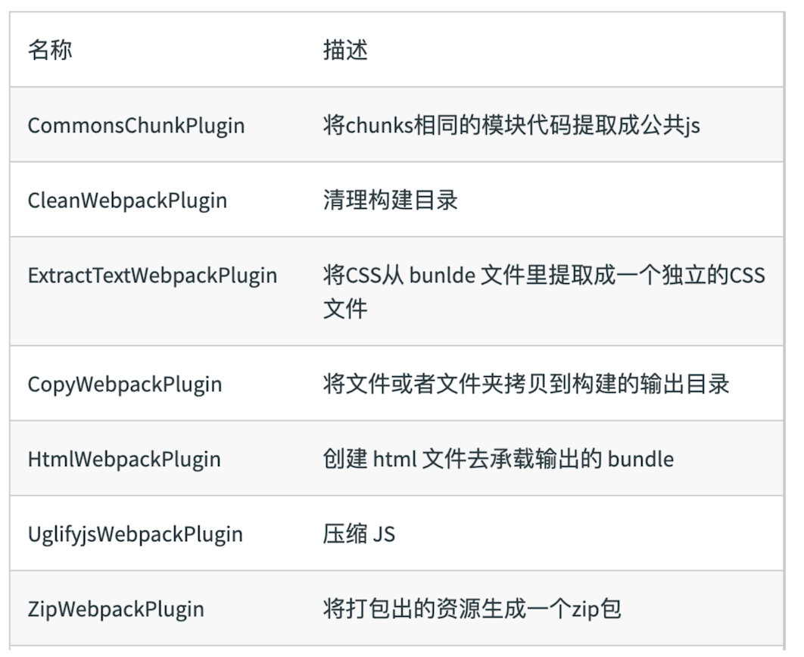
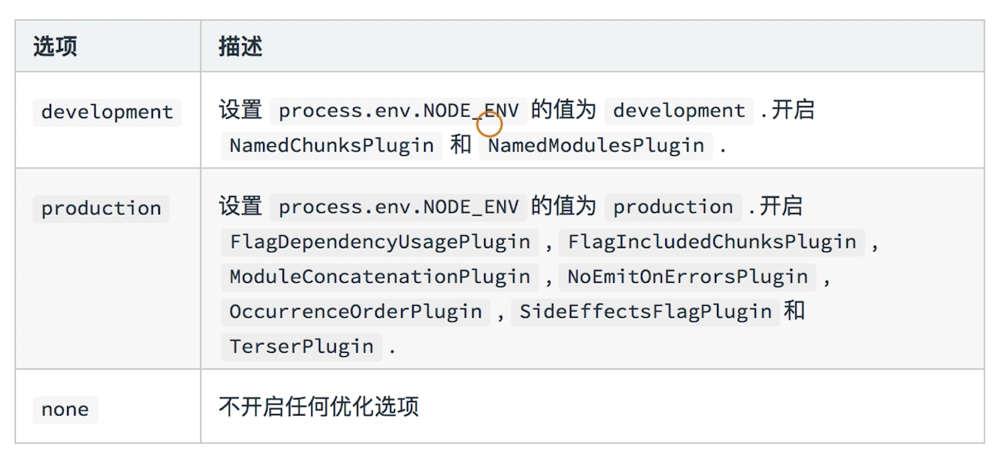
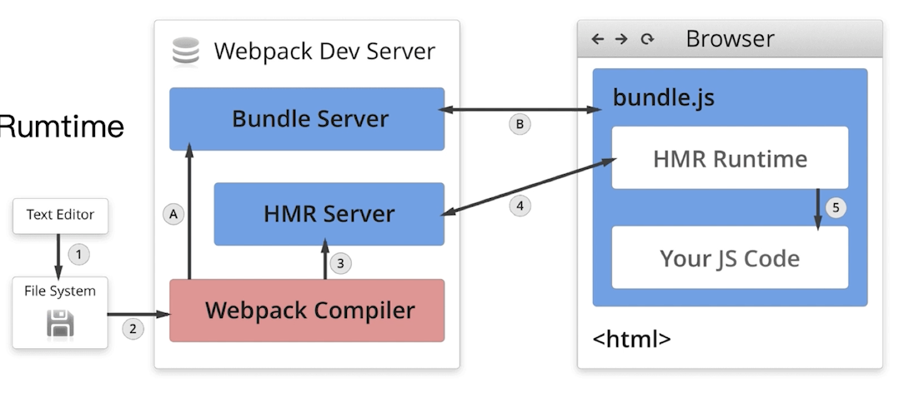
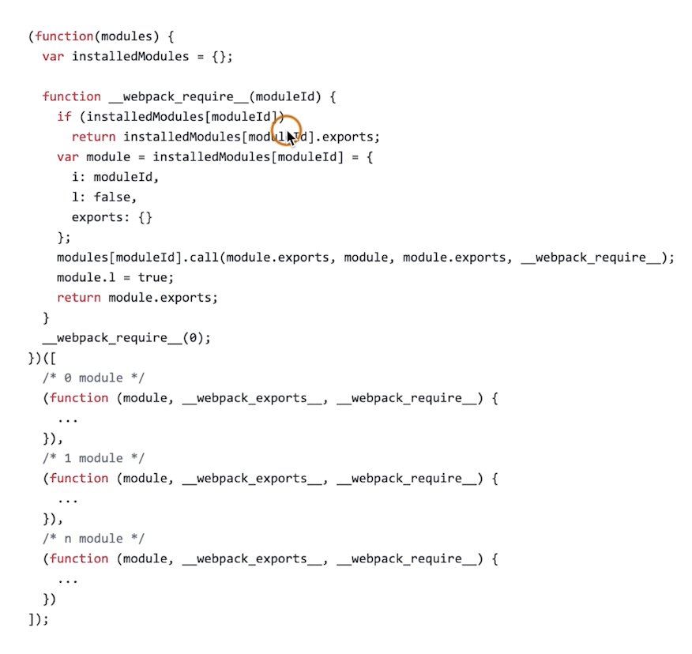
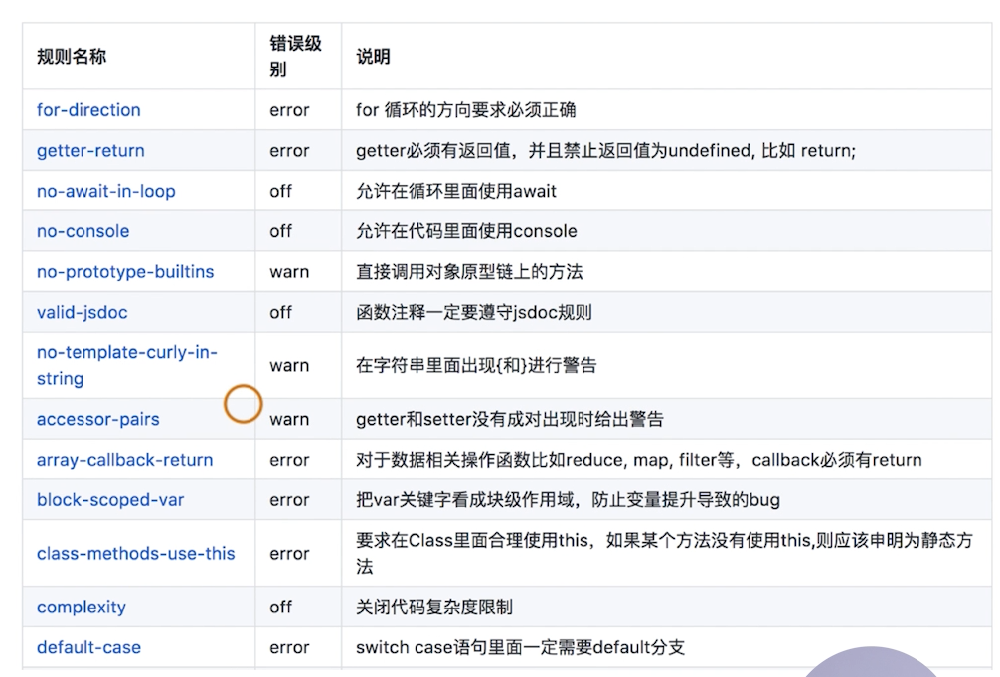
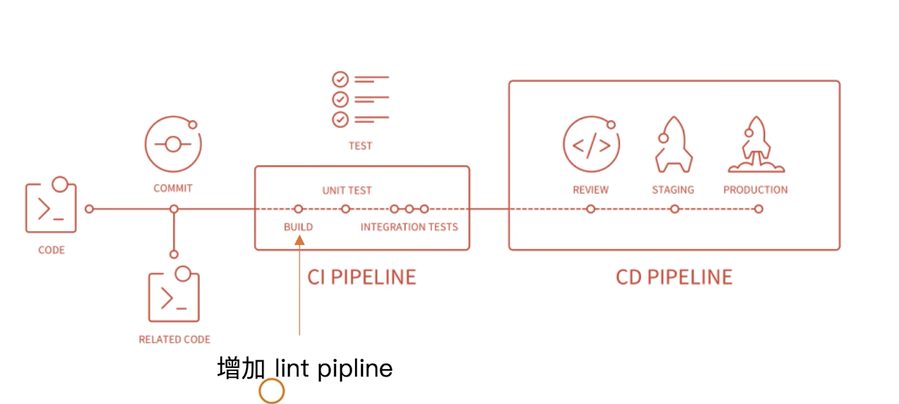
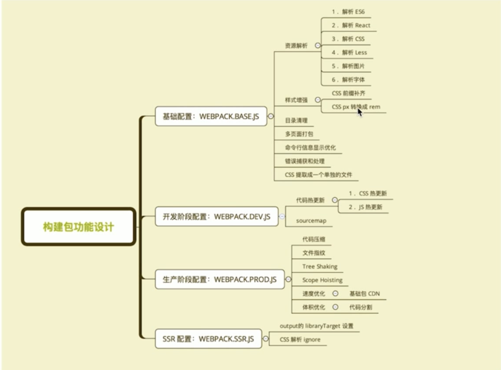
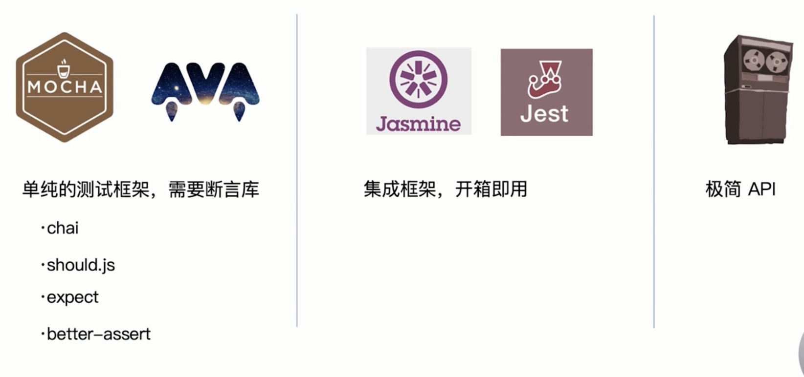
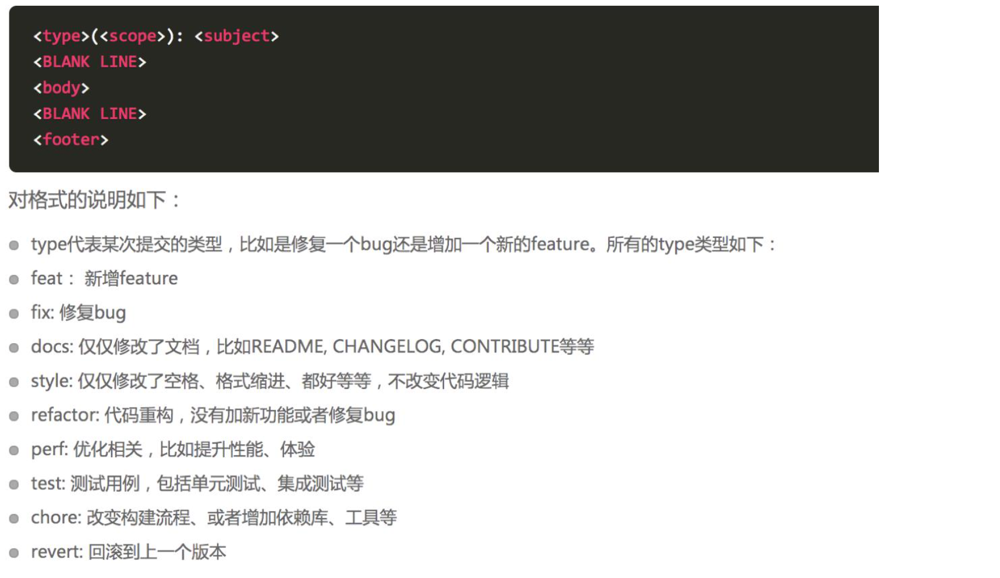
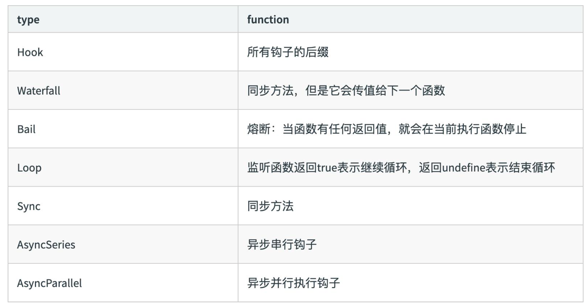

# 创建基本的 webpack4.x 项目

1. 运行 npm init -y 快速初始化项目。

2. 在项目根目录新建一个 src 文件，用来存放项目的源代码。

3. 项目根目录下新建一个 dist 文件，发布时的代码。

   在 dist 中新建一个 index.html 文件

4. 在 src 文件夹下新建一个 index.html 文件

5. 在 src 下新建一个 main.js 文件，该文件是 webpack 的入口文件。

补充：npm 允许在 package.json 文件中，使用 scripts 字段定义脚本命令。

```javascript
* {  // ... "scripts": { "build": "node build.js" }}
```

上面代码是package.json文件的一个片段，里面的scripts字段是一个对象。它的每一个属性，对应一段脚本。比如，build命令对应的脚本是node build.js。命令行下使用npm run命令，就可以执行这段脚本。$ npm run build 等同于执行$ node build.js。

npm run 可以查看当前项目的所有脚本。

6. 使用 npm 安装webpack，运行 npm i webpack --save-dev

7. 安装 webpack 命令行工具， npm i webpack webpack-cli -D

8. 命令 webpack 打包（提供了命令行工具）

9. 在根目录下需要新建一个 webpack.config.js 的js文件，内容如下：

   ```javascript
   // 向外暴露一个打包的配置对象；webpack 是基于 node.js 构建的，支持所有 node  API 和 语法
   module.exports = {
       mode: 'development' // development 和 production
       //在 webpack4.x 中，有一个很大的特性，就是约定大于配置，默认的打包入口路径是 src -> index.js
   }
   
   ```

   约定大于配置就是为了减少配置文件的体积。

   默认约定了：

   * 打包的入口是 `src`->`index.js`文件
   * 打包的输出文件是：`dist`->`main.js`

   打包 webpack 命令

10. webpack 打包好后，会在 dist 目录下生成一个 main.js 文件，就是页面调用的入口文件。

```html
<script src='../dist/main.js'></script>
```

11. 如果将 mode 改成 production 则会对文件进行压缩处理。不需要想老版本一样装插件。

    mode 选项是必须的。

12. 用webpack 实现热加载，实现实时的打包编译

    安装： npm i webpack-dev-server -D

    ​	或者加 -g 全局安装

    配置： 在 package.json 文件中 scripts 对象中新加：

    ​		"dev": "webpack-dev-server"

    ​		会默认生成的 main.js 在本项目的根目录下。该文件看不见（在内存中 ，不在磁盘），托管到了内存中。内存  访问速度快。

    ​		后面可以加参数：（需要在package.json 中加）

    ​			--open 打包后自动打开浏览器

    ​			--port3000 端口

    ​			--hot

    ​			--compress  压缩

    ​			--host  127.0.0.1

    ```javascript
     "dev": "webpack-dev-server --open --port 3000 --hot"
    ```

    

    中间不能有空格

    执行： npm run dev

    ​	该命令会自动打包，会一直在后台执行，实时监控文件变化

    * scripts 中的命令 都需要 加一个 run 来运行。

13. webpack 将首页也放到内存中，方便快速更新。（这个插件就是能让html也被打包到该文件的插件）


安装： npm i html-webpack-plugin -D

使用：webpack.config.js 文件中

```javascript
const path = require('path')
const HtmlWebPackPlugin = require('html-webpack-plugin') //导入自动生成 index 页面的插件
//创建一个插件的实例对象
const htmlPlugin = new HtmlWebPackPlugin({
    template: path.join(__dirname, './src/index.html')//源文件
    filename: 'index.html'  // 生成的内存中首页的名称
})  
```

然后：

```javascript
module.exports = {
    mode: 'development' // development 和 production
    //在 webpack4.x 中，有一个很大的特性，就是约定大于配置，默认的打包入口路径是 src -> index.js
    plugins: [
    	htmlPlugin
    ]
}
```

该插件有一个能力，会动给首页添加 mian.js 的引入。


babel 的配置

在写 React jsx 语法时，不是直接调用显示到页面上的，需要 babel 的转换。

详见react基础。


## 注意：

拉下来的项目一定要先运行 npm install 安装所有的依赖项。

* webpack 的插件一个都是采用 - 链接的方式命名
* dev-server 打包生成的 js 文件没有放到实际的物理磁盘中，而是托管到电脑的内存中了。


 # webpack 3.x 属性配置

配置：

```javascript
const path = require("path")
module.exports = {
    //entry: { //main是默认入口，也可以是多入口
    //    mian: './src/main.js'
    //},
    entry: path.join(__dirname, "./src/main.js"), // 入口表示 webpack 打包哪个文件
    output: {
        filename: 'build.js', //指定js 文件
        path: path.join(__dirname, '/dist')                       //最好是绝对路径
    }
}
```

path: path.join(__dirname, 'dist') 后面可以跟很多参数，比如说 

path: path.join(__dirname, 'dist', '..') 代表 dist 的上一层目录

 ## 在网页中常用的静态资源

* js

  .js   .jsx    .coffee    .ts

* css

  .css .less  .scss(sass)

* Images 

  .jpg   .png   .gif   .bmp   .svg

* 字体文件

  .svg   .ttf  .eot   .woff   .woff2

* 模板文件

  .ejs    .jade   .vue  (这是在webpack中定义组件的方式, 推荐这么用)

## 网页中引入静态资源多了以后有什么问题？？？

1. 网页加载速度慢，因为 我们要发起很多的二次请求。
2. 要处理错综复杂的依赖关系

### 解决上述问题

1. 合并、压缩、精灵图、图片的Base64编码
2. 使用 webpack 可以解决各个包之间的复杂依赖关系；

### 常用的 网页 性能优化

减少请求（合并请求），压缩代码，压缩图片，精灵图

webpack css模块化的处理也能够减少 ajax请求的发送

## webpack 

* 是前端项目自动化构建工具，可以完美实现资源的合并、打包、混淆等诸多功能。


### nrm

安装 npm i nrm -g，提供了安装包的地址

* 命令

  * nrm list

    查看所有安装包路径

  * nrm use npm

    切换到 npm 的官方地址

* nrm 是用来切换 npm 安装包的地址，npm还是装包工具

* 注意区分地址和安包工具的区别

  例如地址有一个cnpm， 地址也有一个 cnpm

# vue 中webpack babel 的配置

- 安装 babel 插件

  - 运行 npm i babel-core babel-loader babel-plugin-transform-runtime -D
  - 运行 npm i babel-preset-env babel-preset-stage-0 -D  （此处针对react）

  注意： preset 的包代表语法

- 安装能够识别转换 jsx 语法的包 babel-preset-react

  - 运行 npm i babel-preset-react -D

# webpack 4 中的基础

```javascript
const path = require('path')
const HtmlWebPackPlugin = require('html-webpack-plugin') //导入自动生成 index 页面的插件
//创建一个插件的实例对象
const htmlPlugin = new HtmlWebPackPlugin({
    template: path.join(__dirname, './src/index.html'),//源文件
    filename: 'index.html'  // 生成的内存中首页的名称
}) 

module.exports = {
    mode: "development",
    plugins: [
    	htmlPlugin
    ],
    module:{   
        rules: [ // 第三方匹配规则
            { test: /\.js$/,loader: 'babel-loader', exclude: /node_modules/, options:{
                presets:['es2015'],  // 关键字
                plugins:['transform-runtime']    // 函数
            } },//千万别忘记添加 exclude 排除项
            { test:/\.(jpg|svg|png|gif)$/, use: 'url-loader?limit=4096&name=[name].[ext]' },
            {test: /\.css$/,use: ['style-loader', 'css-loader']} 
        ],
    }
}
```

常见配置：

```javascript
// 配置快捷启动
"scripts": {
    "build": "webpack",
    "start": "webpack-dev-server"
}
```

开发的时候用 run start

上线的时候用 run build

注意：一定要用 loader

```javascript
{ test: /\.js$/,loader: 'babel-loader', exclude: /node_modules/, options:{
                presets:['es2015'],  // 关键字
                plugins:['transform-runtime']    // 函数
            } }
```

## 样式表的导入

import "./css/index.css"

直接导入样式表文件，直接写类。

### less 和 scss 文件的处理

* 处理less 文件，需要安装

  npm i less -D （less-loader 内部依赖的文件，不需要再 webpack 配置文件中定义）

  npm i less-loader -D

  webpack 配置

  ```js
  {test: /\.less$/, use: ['style-loader', 'css-loader', 'less-loader']}
  ```

  因为 less 是样式，肯定要依赖前面的配置文件，因此要设置

* 处理 .scss 文件，需要安装

  npm i sass-loader -D

  cnpm i node-sass -D 推荐使用cnpm

  ```js
  {test: /\.scss$/, use: ['style-loader', 'css-loader', 'sass-loader']}
  ```

### url-loader

* 默认的情况下，webpage 不能处理样式 css 文件中的 urL 地址，不管是图片还是字体库，只要是 url 地址都处理不了，需要第三方的loader 来处理。

  安装：

  npm i url-loader file-loader -D

  需要配置 url-loader

  配置：

  ```js
  {test: /\.(jpg|png|gif|bmp|jpeg)$/, use: "url-loader?limit=7631&name=[hash:8]-[name].[ext]"} // 处理图片路径的 loader
  ```

  然后就可以在样式中， background-iamge:url() 这样写图片了。

  background 处理之后的图片采用 base64 编码，减少 url 请求。可以在后面加参数来规定什么图片转化为 base64 的代码。 ?limit=7631 限制图片的大小（单位是 字节 byte），大于此限制的图片，不采用 base64 的编码，直接采用 图片的地址（hash 编码值，防止图片重复）。name=[name].[ext] 采用原来的命名和后缀名，一般不采用此配置。[hash:8] 最多 32.

  node_modules 中的 css 文件不需要相对路径，还是采用 node 中引入路径的方法，一定要引到  .css 文件。

  * 样式文件中的字体文件配置

    ```js
    {test: /\.(ttf|eot|svg|woff|woff2)$/, use: "url-loader"} // 处理字体文件的 loader
    ```

  json 文件中不能写注释！！！

## babel 的配置

安装： npm i babel-core babel-loader babel-plugin-transform-runtime -D

​		npm i babel-preset-env babel-preset-stage-0 -D

配置： 

```js
{ test: /\.js$/,loader: 'babel-loader', exclude: /node_modules/}
```

新建一个 .babelrc 文件

```js
{
    "presets": ["env", "stage-0"], // 语法
    "plugins": ["transform-runtime"]
}
```

 env 是最新的，比es2015 的新


# http-server

* 安装：

  npm i http-server -S

* 启动 

  http-server start

  http://www.cnblogs.com/leee/p/5502727.html

# webpack 的一些基本知识

## 1. bundle（捆）和 chunks（块）

1. chunks就是代码块的意思，有name的chunk是在entry里配置了name的，那些1，2，3，4啥的应该是用了code splitting配置生成的，数字是chunk的id
2. ==多个chunk合在一起就是bundle==，一个bundle可以理解为一个大的js打包之后生成的文件，而多个bundle里可能有公共的部分，或者一个bundle里的东西并不需要一次性加载，需要按照路由按需加载，这个时候就需要按需加载，拆分成不同的chunk
3. 你的和官方的不一致，可能是因为你没有用到code splitting


## 2. webpack的入口和出口的配置

* 查看官网

## 3. webpack 代码分离

* 在vue单页应用中，若不做任何处理，所有vue文件会打包为一个文件，这个文件非常的大，造成网页在首次进入时比较缓慢。做了代码分割后，会将代码分离到不同的bundle中，然后进行按需加载这些文件，能够提高页面首次进入的速度，网站性能也能够得到提升。（其实就相当于原生里面的异步加载）

### import() 方法在 webpack 中的使用

* import() 方法

  动态地加载模块。调用 `import()` 之处，被作为分离的模块起点，意思是，被请求的模块和它引用的所有子模块，会分离到一个单独的 chunk 中。参数为相对路径

  该方法内部调用一个 Promise 方法

* 因为 es6 中的import 只能放在顶层作用域的使用，如果想要在组件中使用 import ，需要使用插件`syntax-dynamic-import`

  * 安装：

    `npm i babel-plugin-syntax-dynamic-import -D`

  * .babelrc 配置

    ```js
    {
      "plugins": ["syntax-dynamic-import"]
    }
    ```

* import 方法可以使用如下的方式给 chunk 添加一个name

  ```js
  import(/* webpackChunkName: "name" */ "相对地址")
  ```

  也可以使用在 output 中配置的形式来实现对非入口 chunk 的命名

  ```js
  output: {
      filename: '[name].bundle.js',
      chunkFilename: '[name].bundle.js',
      path: path.resolve(__dirname, 'dist')
   },
  ```

  * filename 是入口文件的命名，chunkFilename 是非入口文件的命名

## 4. webpack 规定打包时的配置文件

> 默认情况下 webpack 会自动搜索项目下的 webpack.config.js 文件作为打包的配置文件，如果需要指定打包时的配置文件，需要在打包的时候加入指令 --config webpack.dev.config.js ，能够在不同的打包情况下配置不同的打包文件。

Webpack 在执行的时候，除了在命令行传入参数，还可以通过指定的配置文件来执行。默认情况下，会搜索当前目录的 `webpack.config.js` 文件，这个文件是一个 node.js 模块，向外暴露一个 json 格式的配置信息对象，或者通过 `--config` 选项来指定配置文件。

## 5. webpack loader

### 1. 编写一个 loader 

loader 是导出为一个函数的 node 模块。该函数在 loader 转换资源的时候调用。给定的函数将调用 [loader API](https://webpack.docschina.org/api/loaders/)，并通过 `this` 上下文访问。

## 6. webpack 编写一个全局变量吧

能够使用 webpack.DefinePlugin 来实现在webpack项目中定义一个全局的变量，不需要单独 require 引入插件。

在webpack 配置文件中使用：

```js
 plugins: [
    new webpack.DefinePlugin({
      'process.env': config.dev.env
    }),
 ]
```

单独添加：

```js
webpackConfig.plugins.push(new webpack.DefinePlugin({
    'CODE_ENV': JSON.stringify(codeEnv)
}))
```


# 重新开始吧

## webpack配置文件名称

* 默认配置文件：webpack.config.js
* 可以通过webpack --config 指定配置文件


## 官方配置

* 可以参考：https://webpack.docschina.org/configuration/#options

  很全！


## 导出配置

* https://webpack.docschina.org/configuration/configuration-types/

  可以是module、函数、promise等

* 


## 配置组成

```js
module.exports = {
  entry: './src/index.js', // 打包入口文件
  output: './dist/main.js', // 打包的输出
  mode: 'production', // 环境
  module: {
    rules: [ // loader配置
      {test: /\.txt$/, use: 'raw-loader'}
    ]
  },
  plugins: [ // 插件配置
    new HmtlwebpackPlugin({
      template: './src/index.html'
    })
  ],
  resolve: {
    extensions: ['.ts', '.tsx', 'js'], // 扩展名
  },
}
```

* 就这五个常用的

### context

* 上下文路径，是一个绝对路径。设定之后，entry就可以写相对路径，相对于context的路径。https://juejin.cn/post/6844903512262836238

```js
{
  context: path.resolve(__dirname, 'src'),
  entry: './main.js', // 可以直接写相对于 context 的路径
}
```


### entry

* entry用来指定webpack的打包入口
  * webpack会根据依赖文件去构建依赖树，对于非代码比如说图片、字体依赖也会不断加入依赖图中（这就是为什么图片、字体等，也可以采用import的方式进行引用）

#### 单入口

* entry是一个字符串，适用于单页面应用

  ```ts
  module.exports = {
    entry: './index.ts'
  }
  ```

#### 多入口

* entry是一个对象，适合于多应用

```tsx
module.exports = {
  entry: {
    app: './index.ts',
    adminApp: './index.ts'
  }
}
```


### output

* 用来告诉webpack如何将编译后的文件输出到磁盘

1. 单入口配置

   ```tsx
   {
     output: {
       filename: 'bundle.js',
       path: __dirname + '/dist'
     }
   }
   ```

2. 多入口配置

   * output 没有多出口的概念，通过占位符确保文件名称的唯一

   ```tsx
   module.exports = {
     entry: {
       app: './index.ts',
       adminApp: './index.ts'
     },
     output: {
       filename: '[name].js', // name就是占位符，会保持原有name
       path: __dirname + '/dist'
     }
   }
   ```

   


### loaders

* ==webpack 开箱即用只支持JS和JSON两种文件类型==，通过loaders去支持其他文件类型并且把它们转换成有效的模块，并且可以添加到依赖图中

  本身是一个函数，接受源文件作为参数，返回转换的结果。

常用loaders：

| 名称          | 描述                                     |
| ------------- | ---------------------------------------- |
| Babel-loader  | 转换es6、es7等js新特性语法               |
| css-loader    | 支持.css文件的加载和解析。import css文件 |
| less-loader   | 将less文件转换成css                      |
| ts-loader     | 将ts转换成js                             |
| file-loader   | 将图片、字体等的打包                     |
| raw-loader    | 将文件以字符串的形式导入                 |
| thread-loader | 多进程打包js和css                        |


#### 用法

```typescript
{
  module: {
    rules: [
      {
        // 不能再对webpack的ts文件进行解析了
        test: /\.tsx?$/, // 匹配规则
        use: [{ // 使用loader名称
          loader: 'ts-loader',
          options: {},
        }],
        // include: [
        //   path.join(__dirname, '../src')
        // ]
      }
    ],
  }
}
```


### Plugins

* 插件用于 bundle 文件的优化，资源管理和环境变量注入等，增强webpack的功能

  作用于整个构建过程（和loader的区别）

* 常用plugin

  

* htmlWebpackPlugin 创建html去承接，不需要每次去手动创建

  参考：https://juejin.cn/post/6844903853708541959

#### 用法

* 顶层属性

```typescript
module.exports = {
  plugins: [ // 放到plugin数组中
    new HtmlWebpackPlugin({
      template: '/src/index.html'
    })
  ]
}
```


### mode

* Mode 用来指定当前构建环境是： production、development、none。webpack4新增
* 设置mode可以使用 webpack 内置的函数，默认值是 production



* 设置为development在热更新非常有用，能看到哪个模块获或者chunk更新了
* 设置为production，能够开启一些压缩工作，能够识别那些是有副作用的（tree shaking有用）


## 常用

### Babel —— 解析es6

* es6、react语法都是通过babel进行解析的

* 使用babel-loader，babel的配置文件是 .babelrc

```typescript
{
  module: {
    rules: [
      {
        test: /\.js$/,
        use: 'babel-loader'
      }
    ]
  }
}
```

* .babelrc 文件，以下为es6的配置

  安装：`npm i @babel/core @babel/preset-env babel-loader -D`

  ```typescript
  {
    "presets": [ // 一系列功能的集合
      "@babel/preset-env",
      "@babel/preset-react", // react配置，npm i @babel/preset-react -D
    ],
     "plugins": [ // 一个功能就是一个plugin
       "@babel/proposal-class-properties",
       "@babel/plugin-syntax-dynamic-import" // 需要安装 npm i @babel/plugin-syntax-dynamic-import -D
     ]
  }
  ```

* *注意：使用了ts-loader解析tsx后，就不用再解析jsx文件了*
* vue 文件是由 vue-loader 解析的？

#### 配置文件

* 默认配置文件参考：https://babeljs.io/docs/en/config-files


#### core.js

* 应该是babel的核心


### 解析css

* css-loader 用于加载 .css 文件，并且转换成 commonjs 对象。`css-loader` 会对 `@import` 和 `url()` 进行处理，就像 js 解析 `import/require()` 一样，也就是正常引用css的方式都可以

  参考：https://webpack.docschina.org/loaders/css-loader/，css-loader 功能是真的多！

  style-loader 将样式通过 \<style> 插入到head中

  ```typescript
  {
    rules: [
      {
        test: /\.csc$/,
        use: [
          'style-loader',
          'css-loader',
          'less-loader', // less解析，注意顺序。npm i less less-loader -D
        ]
      }
    ]
  }
  ```

* 为啥先用style-loader呢？loader执行顺序：从右到左，先去解析，然后创建style承接

* css-module

#### 解析成单独文件

* https://webpack.docschina.org/plugins/mini-css-extract-plugin/

注意：

* 单独文件不需要再使用 style-loader 了


#### css webpack 配置推荐

* [只允许 `可交互的 CSS` 使其与 `CSS Module` 特性分离](https://webpack.docschina.org/loaders/css-loader/#separating-interoperable-css-only-and-css-module-features)

  这个是讲：分离变量和css样式

* ICSS —— `可交互的 CSS`，也就是css变量

#### ==webpack5推荐使用资源模块的方式处理css和字体==

https://webpack.docschina.org/guides/asset-modules/

```typescript
{
  test: /\.(png|jpg|gif|jpeg|svg)$/,
    // 静态资源配置参考：https://webpack.docschina.org/guides/asset-modules/
    type: 'asset', // webpack5 已推荐使用这种方式代替 url-loader 和 file-loader
      parser: {
        dataUrlCondition: {
          maxSize:8*1024  //data转成url的条件，也就是转成bas64的条件,maxSize相当于limit
        }
      },
        generator: {
          filename: 'static/imgs/[name]-[hash].[ext]',
            // publicPath: 'static/', // 这个就是公共的路径，会自动给该资源加上这个路径
        },
}
```


### 解析图片

* file-loader 用于处理文件

```typescript
{
  rules: [
    {
      test: /\.(png|svg|jpg|gif|jpeg)$/,
      use: [
        'file-loader'
      ]
    }
  ]
}
```

* svg 用内联的

#### 处理SVG

* 推荐使用 svgr 工具进行处理，参考：https://react-svgr.com/docs/webpack/

  安装：npm install --save-dev @svgr/webpack

```typescript
module.exports = {
  module: {
    rules: [
      {
        test: /\.svg$/i,
        issuer: /\.[jt]sx?$/,
        use: ['@svgr/webpack'],
      },
    ],
  },
}
```

react 中 svg 的处理也是用这种方式

### 解析字体

* 同样使用 file-loader

```typescript
{
  test: /\.(woff|woff2|eot|ttf|otf)/,
  use: [
    'file-loader'
  ]
}
```

#### webpack5推荐

* 放弃直接使用 file-loader

```typescript
// 解析字体，webpack5 已推荐使用资源模块的方式引入字体，不再使用 file-loader
{
  test: /\.(woff|woff2|eot|ttf|otf)/,
    type: 'asset', // webpack5 已推荐使用这种方式代替 url-loader 和 file-loader
      parser: {
        dataUrlCondition: {
          maxSize:8*1024  //data转成url的条件，也就是转成bas64的条件,maxSize相当于limit
        }
      },
        generator: {
          filename: 'static/fonts/[name]-[hash].[ext]',
            // publicPath: 'static/', // 这个就是公共的路径，会自动给该资源加上这个路径
        },
}
```


### url-loader

* url-loader 也可以处理图片和字体

  可以设置较小资源自动 base64

```typescript
{
  test: /\.(png|svg|jpg|gif|jpeg)$/,
  use: [{
    loader: 'url-loader',
    options: {
      limit: 10240 // 10K大小以内 base64 打入到代码中
    }
  }]
}
```

#### 使用background url 引入图片不存在问题

https://blog.csdn.net/wuyxinu/article/details/122959978


### 导入json

* https://www.webpackjs.com/loaders/json-loader/

  \>=2 版本支持导入json。默认作为模块


### 文件监听

* 文件监听是在发现源码发生发辫时，自动重新构建出新的输出文件

  有以下两种方式：

  1. 启动webpack命令时，带上 --watch 参数
  2. 在配置 webpack.config.js 中设置 watch: true

* 唯一缺点就是需要手动刷新浏览器，好像在开发环境没啥用哦

#### 原理分析

轮询判断文件的最后编辑时间是否发生变化

某个文件发生了变化，并不会立即告诉监听者，而是先缓存起来，等 aggregateTimeout

```typescript
{
  watch: true, // 默认false
  watchOptions: {
    ignored: /node_modiles/, // 不监听的部分，支持正则
    aggregateTimeout: 300, // 监听到变化之后等300ms再去执行，默认300ms
    poll: 1000, // 判断文件是否变化时通过不停询问系统指定文件有没有变化实现的，默认每秒问1000次
  }
}
```


### 热更新——webpack-dev-server

WDS不刷新浏览器；不输出文件，而是放在内存中；使用 HotModuleReplacementPlugin(webpack自带) 插件

* package.json

```typescript
{
  "script": {
    "dev": "webpack-dev-server --open"
  }
}
```

* webpack.config

```typescript
import { HotModuleReplacementPlugin } from 'wenpack'

module.exports = {
  mode: 'dev',
  plugins: [
    // new HotModuleReplacementPlugin() webpack5 不需要设置该项，devserver hot 能够自动开启
  ],
  devServer: {
    contentBase: './dist', // 输入内容位置
    hot: true,
    liveReload: false,
  }
}
```


### 热更新：使用webpack-dev-middleware

* wdm 将 webpack 输出的文件传输给服务器

  适用于灵活的定制场景


### 热更新原理

概念：

webpack compile: 将JS编译成Bundle

HMR Server: 将热更新的文件输出给HMRRuntime

Bundle server: 提供文件在浏览器的访问

HMR Runtime: 会被注入到浏览器，更新文件的变化

bundle.js 构建输出的文件




### 文件指纹

* 打包后输出的文件名的后缀，可以做一些版本的管理，没有修改的文件还可以使用本地的缓存

  比如： index_51222db.js

#### 如何生成

受 compile（启动时创建） 对象 和 compilation（文件变化就会变化）

* Hash: 和整个项目的构建相关，只要项目文件有修改，整个项目构建的hash值就会更改
* Chunkhash: 和webpack打包的chunk相关，不通的entry会生成不同的chunkhash值。js文件采用，一个模块就是独立的chunk
* Contenthash: 根据文件内容来定义hash，文件内容不变，则contenthash不变。css文件采用这个方式，一般使用这种情况，比如js使用了css，css并没有变就不用打包


#### js文件指纹设置

* 设置 optput 的 filename，使用[chunkhash]

```typescript
{
  output: {
    filename: '[name][chunkhash:8].js',
    path: __dirname + '/dist'
  }
}
```


#### css 文件指纹

设置 MiniCssExtractPlugin 的 filename，使用 [contenthash]。loader部分也需要配置

```typescript
{
  plugins: [
    new MiniCssExtractPlugin({
      filename: `[name][contenthash:8].css`
    })
  ]
}
```

#### 图片的文件指纹

设置 file-loader 的name，使用 hash


* hash 并不是第一部分所说的项目hash，而是指 contentHash

```typescript
{
  test: /\.(png|jpg|gif|jpeg|svg)$/,
  use: [{
    loader: 'file-loader',
    options: {
      name: 'img/[name][hash:8].[ext]', // 取前8位，放到 img 文件夹下
    }
  }]
}
```

#### 字体的文件指纹

```typescript
{
  test: /\.(woff)$/,
  use: [
    {
      loader: 'file-loader',
      options: {
        name: 'img/[name][hash:8].[ext]', // 取前8位
      }
    }
  ]
}
```


#### 注意

* 文件指纹一般在正式环境使用，开发环境热更新不支持文件指纹


### 代码压缩

分为：

* HTML 压缩
* CSS 压缩
* JS 压缩

#### js 文件压缩

webpack4内置了 uglifyjs-webpack-plugin

* production默认开启了压缩，不需要单独配置。可以添加参数（比如并行压缩等）

webpack5 自带TerserWebpackPlugin压缩，如果需要定制则需要安装该插件。

https://webpack.docschina.org/plugins/terser-webpack-plugin/#uglify-js


#### css 压缩

https://webpack.docschina.org/plugins/css-minimizer-webpack-plugin/#root

使用 optimize-css-assets-webpack-plugin 、 cssnano

同时使用 cssnano(css预处理器)

```typescript
{
  new OptimizeCSSAssetsPlugin({
    assetNameRegExp: /\.css$/g, // 匹配到css文件
    cssProcessor: require('cssnano') // 预处理器压缩
  })
}
```


* webpack 5 推荐使用 CssMinimizerWebpackPlugin 进行压缩

https://webpack.docschina.org/plugins/css-minimizer-webpack-plugin/#root


#### html文件压缩

修改 html-webpack-plugin，设置压缩参数

```typescript
{
  plugins: [
    {
      new HtmlWebpackPlugin({
     		template: 'public/index.html', // 定义一个模板
      	// filename: 'index.html', // 指定打包名称
      	// chunks: ['index'], // html使用那些chunk，多页配置的时候需要动态引入。对应entry里面的chunk name
        inject: true, // js 或者 css 会自动的注入到这个template中
      	minify: {
          html5: true,
          collapseWhitespace: true,
          preserveLineBreaks: false,
          minifyCSS: true,
          minifyJS: true,
          removeComments: false,
        }
      })
    }
  ]
}
```

* 注意： 一个模块对应一个plugin，如果是多个模块需要配置多个plugin


### 自动清理构建目录产物

#### 1. 通过 npm scripts 清理

```json
{
  "scripts": {
    "clean": "rm -rf ./dist && webpack",
    "clean1": "rimraf ./dist && webpack",
    "comment": "第三方库"
  }
}
```

* 上述方式不是很优雅，而且需要手动执行

2. 通过插件来实现

使用clean-webpack-plugin

* 默认会删除output指定的输出目录

```typescript
{
  plugins: [
    new CleanWebpackPlugin()
  ]
}
```


### css功能增强

* css3功能由于浏览器实现的区别，需要加前缀

#### 前缀问题

* 自动补齐

  安装： npm i postcss-loader autoprefixer -D

  使用 postcss 插件 autoprefixer，css后置处理器，和普通的loader（less和sass等预处理器）不一样，一般loader是预加载阶段执行

  根据 Can i use 规则(https://caniuse.com/)

```typescript
{
  use: [
    'style-loader',
    'css-loader',
    'less-loader',
    {
      loader: 'postcss-loader', // 支持css module
      options: {
        postcssOptions: {
          plugins: () => [
            require('autoprefixer')({
              browsers: ['last 2 version', '>1%', 'ios 7'] // css兼容版本 最新俩版本、使用人数大于百分之1、ios 7以上的
            })
          ]
        }
      }
    }
  ]
}
```


#### css rem转换

以前怎么做适配呢？

* 使用css媒体查询实现响应式布局。缺点是：需要写多套适配样式代码

W3C 对 rem 的定义：font-size of the root element

Rem 和 px 对比：

* rem 是相对单位
* px是绝对单位


1. 使用 px2rem-loader，把 px 转换成 rem

* 可以使用手淘的 lib-flexible 库

````typescript
{
  rules: [
    {
        test: /\.less$/,
        use: [
          // 'style-loader',
          MiniCssExtractPlugin.loader, // 解析成单独的文件
          'css-loader',
          'less-loader',
          {
            loader: 'px2rem-loader',
            options: {
              remUnit: 75, // 750视觉稿
              remPrecision: 8 // rem转换为px小数点位数
            }
          }
        ]
    }
  ]
}
````

* 安装：

  ```shell
  npm i px2rem-loader -D
  
  npm i lib-flexible -S # 动态计算
  ```

2. 计算出当前font-size大小

   两种方式：

   1. 手动添加代码，注意：在打开的时候就需要计算，需要前置script，把这段代码放到最前边


### webpack资源内联

#### 资源内联的意义

代码层面：

* ==页面框架的初始化脚本，比如说 rem 的计算，一打开就要进行计算（常用）==
* 上报相关打点。css初始化时间，js加载时间
* css内联避免页面闪动。加载html回来就能渲染，避免import慢

请求层面：减少HTTP网络请求数

* 小图片或者字体内联（url-loader）（上述已实践）

#### html 和 js 内联

raw-loader 内联 html

```html
<script>${require('raw-loader!babel-loader!./meta.html')}</script>

<!--htmlwebpackplugin使用模板语法ejs，可直接使用下面这种情况-->
${require('raw-loader!babel-loader!./meta.html')}
```

* 内联一个html片段，做h5常用的meta代码。

  htmlwebpackplugin 的 meta字段是不是也能做

raw-loader 内联 JS

```html
<script>${require('raw-loader!babel-loader!../node_modules/lib-flexible')}</script>
```

* 先转换后内联

推荐使用 raw-loader 0.5.1 版本

#### css 内联

方案一：借助 style-loader

```typescript
{
  test: /\.scss$/,
    use: [
      {
        loader: 'style-loader',
        options: {
          insertAt: 'top', // 样式插入到<head>
          singleon: true, // 将所有的style标签合并成一个，加快速度
        }
      },
      'css-loader',
      'sass-loader'
    ],
}
```

方案二：html-inline-css-webpack-plugin

* 打包后的css chunk代码内联到 head 之间
* todo


### 多页面应用（MPA）

* 每一次页面跳转的时候，后台服务器就会返回一个新的html文档，这种类型的网站也就是多页网站，也叫做多页应用
* 页面间解耦，利于seo

#### 基本思路

每个页面对应一个entry，一个 html-webpack-plugin

缺点：每次新增或删除页面都需要改webpack配置

```typescript
module.exports = {
  entry: {
    index: './index',
    search: './search.js'
  }
}
```


#### 通用方案

动态获取entry和设置html-webpack-plugin数量

利用 glob.sync

```js
{
  entry: glob.sync(path.join(__dirname, './src/*/index.js'))
}
```

* src 某个目录下的index就是入口
* npm i glob -D

todo: 动态配置多页面入口


### 使用source map

作用：通过 source map 定位到源代码

* 参考：https://www.ruanyifeng.com/blog/2013/01/javascript_source_map.html

开发环境开启，线上环境关闭。避免业务逻辑暴露，如果要暴露要用暴露不那么深的type

* 线上排查问题的时候可以将 sourcemap 上传到错误监控系统


#### source map 关键字

eval: 使用 eval 包裹模块代码

source map: 产生 .map 文件。js css 文件分离

cheap: 不包含列信息

inline: 将.map作为 DataURL嵌入，不单独生成 .map 文件

module: 包含loader 的sourcemap.

* 详细使用规则参考：https://webpack.docschina.org/configuration/devtool/


#### 设置

* 首先mode 设置为 none，不进行代码压缩

```typescript
// 最外层
{
  // devtool: 'eval', // 打包后没有source map 单独文件，用 eval 包裹，有一个代码url
  // devtool: 'source-map', // 与js文件有一个同名的 .map 文件。js文件最后一行会告诉source map 对应文件
  devtool: 'inline-source-map', // 直接写入代码中，代码会非常大
}
```

* 打包后没有source map 单独文件，用 eval 包裹，有一个代码url

#### 注意

webpack有两种source map 方案，一种是 devtool ，另一种是 source map loader（配置更全）。但是不能两种混用。

> 你可以直接使用 `SourceMapDevToolPlugin`/`EvalSourceMapDevToolPlugin` 来替代使用 `devtool` 选项，因为它有更多的选项。切勿同时使用 `devtool` 选项和 `SourceMapDevToolPlugin`/`EvalSourceMapDevToolPlugin` 插件。`devtool` 选项在内部添加过这些插件，所以你最终将应用两次插件。
>
> https://webpack.docschina.org/configuration/devtool/


## 代码类型

[代码类型](##webpack代码类型)

### runtime 和 manifest

#### runtime

> runtime，以及伴随的 manifest 数据，主要是指：在浏览器运行过程中，webpack 用来连接模块化应用程序所需的所有代码。它包含：在模块交互时，连接模块所需的加载和解析逻辑。包括：已经加载到浏览器中的连接模块逻辑，以及尚未加载模块的延迟加载逻辑。

* 主要是webpack组织代码的运行时

#### manifest

> 一旦你的应用在浏览器中以 `index.html` 文件的形式被打开，一些 bundle 和应用需要的各种资源都需要用某种方式被加载与链接起来。在经过打包、压缩、为延迟加载而拆分为细小的 chunk 这些 webpack [`优化`](https://www.webpackjs.com/configuration/optimization/) 之后，你精心安排的 `/src` 目录的文件结构都已经不再存在。所以 webpack 如何管理所有所需模块之间的交互呢？这就是 manifest 数据用途的由来……
>
> 当 compiler 开始执行、解析和映射应用程序时，它会保留所有模块的详细要点。这个数据集合称为 "manifest"，当完成打包并发送到浏览器时，runtime 会通过 manifest 来解析和加载模块。无论你选择哪种 [模块语法](https://www.webpackjs.com/api/module-methods)，那些 `import` 或 `require` 语句现在都已经转换为 `__webpack_require__` 方法，此方法指向模块标识符(module identifier)。通过使用 manifest 中的数据，runtime 将能够检索这些标识符，找出每个标识符背后对应的模块。

* Runtime 根据manifest保存的数据组织代码，manifest主要用来保存compiler解析代码时模块的详细要点。
* runtime通过manifest来解析和加载模块。

> 你可能会很感兴趣，webpack 和 webpack 插件似乎“知道”应该生成哪些文件。答案是，webpack 通过 manifest，可以追踪所有模块到输出 bundle 之间的映射。如果你想要知道如何以其他方式来控制 webpack [`输出`](https://www.webpackjs.com/configuration/output)，了解 manifest 是个好的开始。

* Webpack 通过 manifest 追踪到 bundle 之间的映射

## 提取页面公共资源

* 公共模块的重复引用
* 公共资源的重复加载

### webpack代码类型

> 在使用 webpack 构建的典型应用程序或站点中，有三种主要的代码类型：
>
> 1. 你或你的团队编写的源码。
> 2. 你的源码会依赖的任何第三方的 library 或 "vendor" 代码。
> 3. webpack 的 runtime 和 **manifest**，管理所有模块的交互。

* 源码
* library 或者 vendor 第三方代码
* webpack 的 runtime 和 manifest，管理所有模块的交互

### 基础库的分离

* 思路：将react、react-dom 基础包通过 cdn 引入，不打入 bundle 中
* 方法：使用 html-webpack-externals-plugin 

```typescript
{
  plugins: [
    new HtmlWebpackExternalsPlugin({
      externals: [
        {
          module: 'react',
          entry: 'cdn地址',
          global: 'React',
        }
      ]
    })
  ]
}
```


### splitchunks

* SplitChunks插件是什么呢，简单的来说就是Webpack中一个提取或分离代码的插件，主要作用是提取公共代码，防止代码被重复打包，拆分过大的js文件，合并零散的js文件。

  打包层面的公共代码抽取，防止重复引用。

配置参考：https://zhuanlan.zhihu.com/p/152097785

==注意：==

1. 被切割出来的chunk name 由 splitChunks 定制
2. 一般控制内部的cacheGroups 单独定制，要不然影响全局

```typescript
// 配置参考
{
  splitChunks: { // 配置参考：https://zhuanlan.zhihu.com/p/152097785。外层的配置会影响整个webpack打包，注意。
    chunks: 'all',
      // minSize: 9000, // 规定被提取的模块在压缩前的大小最小值，单位为字节，默认为30000，只有超过了30000字节才会被提取。
      // minRemainingSize: 0,
      maxSize: 0, // 选项：把提取出来的模块打包生成的文件大小不能超过maxSize值，如果超过了，要对其进行分割并打包生成新的文件。单位为字节，默认为0，表示不限制大小。
        minChunks: 2, // 表示要被提取的模块最小被引用次数，引用次数超过或等于minChunks值，才能被提取。
          maxAsyncRequests: 5, // 最大的按需(异步)加载次数。也就是在代码中使用了动态 import 的方式的代码
            maxInitialRequests: 3, // 打包后的入口文件加载时，还能同时加载js文件的数量（包括入口文件），默认为4
              // enforceSizeThreshold: 50000,
              // name: 'test', // 这个name就是在webpack生命周期内的name，最终输出还是依赖于 output 的配置。只是替换了 name 字段
              cacheGroups: { // 核心重点，配置提取模块的方案。里面每一项代表一个提取模块的方案。优先级高于同级配置。
                common: { // 同步的配置
                  name: 'common-chunk',
                    minChunks: 2,
                      priority: -20,
                        chunks: 'initial',
                          minSize: 9000,
                            reuseExistingChunk: true,
                },
                  venders: { // node_modules 打包
                    maxSize: 3000,
                      name: 'chunk-venders',
                        test: /[\\/]node_modules[\\/]/,
                          priority: -10, // 提高优先级
                            chunks: 'all',
                  },
              },
  },
}
```


### 利用 SplitChunksPlugin 进行公共脚本分离

* webpack4 内置的，替代 CommonsChunkPlugin 插件

https://webpack.docschina.org/plugins/split-chunks-plugin/#optimizationsplitchunks

Chunks 参数说明：（相同的代码会抽离成一个文件）

* async 异步引入的库进行分离（默认）
* initial 同步引入的库进行分离
* all 所有引入的库进行分离（推荐）

```typescript
{
  optimization: {
    splitChunks: {
      chunks: 'async',
      minSize: 30000, // 公共包最小大小
      maxSize: 0,
      minChunks: 1, // 次数，大于等于1，就是两个地方会引用到，就会提取成公共文件
      maxAsyncRequests: 5, // 同时请求最大的异步资源
      maxInitialRequests: 3,
      automaticNameDelimiter: '~',
      name: true,
      cacheGroups: {
        vendors: { // vendor 小摊贩
          test: /[\\/]node_modules[\\/]/,
          priority: -10
        }
      }
    }
  }
}
```

> 当 webpack 处理文件路径时，它们始终包含 Unix 系统中的 `/` 和 Windows 系统中的 `\`。这就是为什么在 `{cacheGroup}.test` 字段中使用 `[\\/]` 来表示路径分隔符的原因。`{cacheGroup}.test` 中的 `/` 或 `\` 会在跨平台使用时产生问题。
>
> 正则匹配适配win和mac，查看JavaScript的正则的范围符


### 利用 SplitChunksPlugin 分离基础包

```typescript
{
  optimization: {
    splitChunks: {
      minSize: 0,
      cacheGroups: {
        commons: {
          test: /(react|react-dom)/, // 匹配规则
          name: 'vendors',
          chunks: 'all'
        }
      }
    }
  },
  plugins: [
    {
      new HtmlWebpackPlugin({
     		template: 'public/index.html', // 定义一个模板
      	// filename: 'index.html', // 指定打包名称
      	chunks: ['vendors', 'index'], // html使用那些chunk，需要添加vendors。这样react就会引入，注意引入顺序
        inject: true, // js 或者 css 会自动的注入到这个template中
      	minify: {
          html5: true,
          collapseWhitespace: true,
          preserveLineBreaks: false,
          minifyCSS: true,
          minifyJS: true,
          removeComments: false,
        }
      })
    }
  ]
}
```

* 分离完成之后需要在 HtmlWebpackPlugin 中添加引用


### 利用 SplitChunksPlugin 分离页面公共文件

* minChunks 设置最小引用次数为2
* minSize 分离包体积

```typescript
{
  optimization: {
    splitChunks: {
      minSize: 0, // 不急内存，只要引用了就会提取。如果设置成 100，小于100k的不会提取
      cacheGroups: {
        commons: {
          name: 'commons',
          chunks: 'all',
          minChunks: 2, // 规则：不用test匹配，而是使用了两次就需要提取
        }
      }
    }
  }
}
```

* 会打包成公共的 js 文件


Todo: https://webpack.docschina.org/plugins/split-chunks-plugin/#optimizationsplitchunks 细读

* 代码是怎么组织起来的，公共代码是动态引入？拆分的代码怎么进来的

  同步的是在打包的时候创建的script，动态引入是在需要的时候创建 script（运行时）。


## tree shaking

* tree shaking 就是只把用到的方法打入到 bundle，没有用到的方法会在 uglify 阶段被擦除掉

* webpack 默认支持，在 .babelrc 里设置 modules: false 即可

  production mode的情况下默认开启

* 必须是 es6 语法，Cjs  不支持。

  Todo动态 import 支持吗？支持的，动态导出的会看成普通的语句去tree shaking

### DCE(elimination)

代码不会被执行，不可到达

```typescript
if (false) {
  // something 不会执行
}
```


代码执行结果不会被用到

代码只影响死变量（只读不写），const: todo const a = false


### tree-shaking 原理

利用 ES 6模块特点：

* 只能作为模块顶层的语句出现

* import 的模块名只能是字符串常量。应用的是一个引用

  commonjs 模块名称可以是表达式。。

* 不管 `import` 的语句出现的位置在哪里，在模块初始化的时候所有的 `import` 都必须已经导入完成。

* import binding 是 immutable 的

  就是导入的模块名不能再赋值给其他值，防止 tree shaking 出错，保证这个值的唯一性。commonjs 就可以使用 let a = require('a') 这样修改这个值。

tree shaking 做标记，然后仅需 uglify 阶段

代码擦除：uglify 阶段删除无用代码

* 官方文档非常难懂，建议参考：https://juejin.cn/post/7002410645316436004


### 要求

- 使用 ES2015 模块语法（即 `import` 和 `export`）。
- 确保没有编译器将您的 ES2015 模块语法转换为 CommonJS 的（顺带一提，这是现在常用的 @babel/preset-env 的默认行为，详细信息请参阅[文档](https://babeljs.io/docs/en/babel-preset-env#modules)）。==babel不能转换成commonjs==
- 在项目的 `package.json` 文件中，添加 `"sideEffects"` 属性。
- 使用 `mode` 为 `"production"` 的配置项以启用[更多优化项](https://webpack.docschina.org/concepts/mode/#usage)，包括压缩代码与 tree shaking。


### 副作用

"side effect(副作用)" 的定义是，在导入时会执行特殊行为的代码，而不是仅仅暴露一个 export 或多个 export。举例说明，例如 polyfill，它影响全局作用域，并且通常不提供 export。


### 其他模式怎么开启 tree shaking

```typescript
{
  optimization: {
    usedExports: true, // 其他模式打开 tree shaking
  }
}
```


## ScopeHoisting

* 现象：构建后代码存在大量的闭包代码

  看一下打包后的文件

* 导致问题

  大量闭包包裹代码，导致体积增大（模块越多越明显）

  运行代码时创建的函数作用域变多，内存开销变大

### 为什么

* webpack 会给模块进行转换，变成模块函数

  * 猜测可能是为了namespace

* 结论：

  被webpack转换后的模块会带上一层包裹

  import 会被转换成 __webpack_require

### webpack module 分析



* 打包出来是一个 IIFE
* Modules 是一个数组，每一项是一个模块初始化函数
* __webpack_require 用来加载模块，返回 module.exports
* 通过 WEBPACK_REQUIRE_METHOD(0) 启动程序（0就是module id）


### scope hoisting 原理

原理：将所有模块的代码按照`引用顺序(模块调用顺序)`放在一个函数作用域里，然后适当的重命名一些变量以防止变量名冲突

对比：通过 scope hoisting 可以减少函数声明代码和内存开销


### scope hoisting 使用

webpack mode 为 production 默认开启，只用 ModuleConcatenationPlugin（也可以手动引入这个插件）

必须是 ES6 语言，CJS 不支持（动态语法不能确定引用顺序）


## 代码分割

### 意义

对于大的web应用来讲，将所有的代码都放在一个文件中显然是不够有效的，特别是当你的某些代码块是在某些特殊的时候才会被用到。webpack 有一个功能就是将你的代码库分割成 chunks (语块)，当代码运行到需要他们的时候再进行加载

使用的场景：

* 抽离相同代码到一个共享块（上边已实践）
* 脚本懒加载，是的初始下载的代码更小

### 懒加载 JS  脚本的方式

CommonJS: require.ensure

ES6: 动态import(目前还没有原生支持，需要babel转换)

### 动态 import 

* 安装babel插件

  npm install @babel/plugin-syntax-dynamic-import -D

* Babel 配置

  ```typescript
  {
    "plugins": ["@babel/plugin-syntax-dynamic-import"],
  }
  ```

### 原理

* 使用 jsonP 的方式，动态创建一个 script 标签实现。典型的 jsonp 的方式
* es class 的 super 可以使用 arguments 

todo: raect 组件懒加载


## webpack+eslint

### 行业优秀的 ESLint 规范实践

airbnb: eslint-config-airbnb、eslint-config-airbnb-base

腾讯：

* alloyteam 团队 eslint-config-alloy

  https://github.com/AlloyTeam/eslint-config-alloy/blob/master/README.zh-CN.md#typescript-react

* ivweb 团队： eslint-config-ivweb


todo： prettier 参考：https://github.com/react-hook-form/react-hook-form


### 制定团队的 ESlint 规范

* 不要重复造轮子，基于 eslint:recommend 配置并改进
* 能够帮助发现代码错误的规则，全部开启
* 帮助保持团队的代码风格统一，而不是限制开发体验





#### 使用

参考：https://juejin.cn/post/7067072359995457567

安装：npm i -D eslint

初始化：npx eslint --init

* init 之后配置项非常全，按需选择

==ESLint 配置参考：==  https://eslint.bootcss.com/docs/rules/

- `"off"` 或 `0` - 关闭规则
- `"warn"` 或 `1` - 开启规则，使用警告级别的错误：`warn` (不会导致程序退出)
- `"error"` 或 `2` - 开启规则，使用错误级别的错误：`error` (当被触发的时候，程序会退出)

推荐脚本：npx eslint --fix 既可以检测又可以修复一部分


### 代码风格

* 推荐使用 Prettier，参考：https://juejin.cn/post/6844903621805473800


### git 规范

参考：https://juejin.cn/post/7038143752036155428#heading-4

> Git 有很多的 hooks, 让我们在不同的阶段,对代码进行不同的操作,控制提交到仓库的代码的规范性,和准确性, 以下只是几个常用的钩子
>
> ### 提交的代码规范
>
> - **pre-commit**
> - 描述: 通过钩子函数,判断提交的代码是否符合规范
>
> ###  提交的信息规范
>
> - **commit-msg**
> - 描述: 通过钩子函数,判断 commit 信息是否符合规范
>
> ### 提交的代码影响
>
> - **pre-push**
> - 描述: 通过钩子,执行测试,避免对以前的内容造成影响


### ESLint 如何执行落地

* 和ci/cd 系统集成，写入到 pipeline
* 和 webpack 集成


### 方案1：webpack 和ci/cd 系统集成



* 在 build 前添加 lint pipeline，防止 git -n 绕过检查


### 本地开发阶段增加 precommit 钩子

安装 husky

npm i husky -D

增加 npm script，通过 lint-staged 增量检查修改的文件

```typescript
{
  "scripts": {
    "precommit": "lint-staged"
  },
  {
    "lint-staged": {
      "linters": {
        "*.{js,scss}": ["eslint --fix", "git add"]
      }
    }
  }
}
```


#### husky

参考：https://github.com/typicode/husky

```shell
npx husky add .husky/pre-commit "npm test"
```


#### lint staged

1. 主要是通过 .lintstagedrc.json 配置文件起作用

   ```json
   {
       "*.{js,jsx,ts,tsx}": ["eslint"]
   }
   ```

2. package.json 中配置

   ```json
   {
     "lint-staged": {
       "*.{js,jsx,ts,tsx}": ["eslint"]
     }
   }
   ```


#### 为什么需要 lint-staged

> `husky`：是一个为 git 客户端增加 hook 的工具。安装后，它会自动在仓库中的 .git/ 目录下增加相应的钩子；比如 pre-commit 钩子就会在你执行 git commit 的触发。我们可以在 pre-commit 中实现一些比如 lint 检查、单元测试、代码美化等操作。当然，pre-commit 阶段执行的命令当然要保证其速度不要太慢，每次 commit 等很久体验不好。
>
> `lint-staged`：一个仅仅过滤出 Git 代码暂存区文件(被 git add 的文件)的工具；这个很实用，因为我们如果对整个项目的代码做一个检查，可能耗时很长，如果是老项目，要对之前的代码做一个代码规范检查并修改的话，这可能就麻烦了，可能导致项目改动很大。所以这个 lint-staged，对团队项目和开源项目来说，是一个很好的工具，它是对个人要提交的代码的一个规范和约束。
>
> https://juejin.cn/post/7086365265260183583

* husky 是方便操作 git hook 的
* line-staged 是用来做增量检查的


### 增加 git commit-msg 钩子

* 提交规范：https://www.conventionalcommits.org/en/v1.0.0/

安装：

```shell
# 规范 commitlint, @commitlint/config-conventional 采用angular提交规范
npm i commitlint @commitlint/config-conventional -D
# 添加钩子
npx husky add .husky/commit-msg 'npx --no-install commitlint --edit "$1"'
# 配置规范
echo "module.exports = {extends: ['@commitlint/config-conventional']}" > commitlint.config.js

```

自定义规范：

1. 采用 validate-commit-msg

2. 自定义 commitlint（推荐）

   参考：https://juejin.cn/post/7038143752036155428#heading-4  -> 自定义规范

   

规范提示：

```shell
npm i commitizen cz-conventional-changelog -D

npm set-script commit "git-cz" # package.json 中添加 commit 指令, 执行 `git-cz` 指令

npx commitizen init cz-conventional-changelog --save-dev --save-exact
```

* 只要执行 npm run commit 就能按提示提交


### 生成changelog

参考：https://juejin.cn/post/6844903700574502919#heading-16

```shell
# 安装
npm i -D conventional-changelog-cli
```

* 添加 script

```typescript
{
  "scripts": "changelog": "npx conventional-changelog -p angular -i CHANGELOG.md -s -r 0"
}
```

* 会自动生成 changelog.md 文件


### 方案2：webpack 与 ESLint 集成

* 使用 eslint-loader ，构建时检查 js 规范

注意：

eslint-loader 已经被废弃了，使用 https://www.npmjs.com/package/eslint-loader。

推荐使用：eslint-webpack-plugin


## webpack 打包库和组件——腾讯面试题？

* webpack 除了可以用来打包应用，也可以用来打包 js 库
* 实现一个大整数加法库的打包
  * 需要打包压缩版和非压缩版。大整数因为 js 的数字类型有安全整数限制
  * 支持 AMD/CJS/ESM 模块引入
  * 支持 script 引入

### 如何将库暴露出去

* library：指定库的全局变量
* libraryTarget: 支持库的引入方式

````typescript
module.exports = {
  mode: 'none', // 设置成none
  entry: { // 多个入口就有多个出口
    "large-number": "./src/index/js",
    "large-number.min": "./src/index.js"
  },
  output: {
    filename: "[name].js",
    library: "largeNumber", // 库名称
    libraryExport: 'default', // 如果是 default，那么这个库就必须使用 export default 导出，如果需要导出 default + 其他成员，则需要采用默认的 undefined。https://webpack.docschina.org/configuration/output#outputlibraryexport
    libraryTarget: "umd" // 各种引用方式，全局、script、esmodule、commonjs
  },
  optimization: { // 配置压缩规则
    minimize: true,
    minimizer: [
      // 参考：https://webpack.docschina.org/plugins/terser-webpack-plugin/#root
      new TerserPlugin({ // 使用该插件压缩能够压缩 es6 语法，使用 uglify plugin 会出错
        include: /\.min\.js$/, // 针对的是chunk name
      })
    ],
  }
}
````

### 各种模块

https://juejin.cn/post/6977604469794013197#heading-9

- `amd` – 异步模块定义，用于像RequireJS这样的模块加载器
- `cjs` – CommonJS，适用于 Node 和 Browserify/Webpack
- `esm` – 将软件包保存为 ES 模块文件，在现代浏览器中可以通过 `<script type=module>` 标签引入
- `iife` – 一个自动执行的功能，适合作为`<script>`标签。（如果要为应用程序创建一个捆绑包，您可能想要使用它，因为它会使文件大小变小。）
- `umd` – 通用模块定义，以`amd`，`cjs` 和 `iife` 为一体
- `system` - SystemJS 加载器格式


### 设置入口文件

package.json 的 main 字段为 index.js

根据环境变量调用不同的文件

````typescript
if (process.env.NODE_ENV === 'production') {
  
}
````


### 打包ts库和组件

参考：https://blog.csdn.net/ZY_FlyWay/article/details/122553136

1. 需要配置tsconfig 的打包规则，会被 ts-loader 执行

   主要是 type 输出目录

2. 在 package.json 中执行 type 入口。入口由 main 指定

   ```json
   {
     "type": "./dist/types/index.d.ts"
   }
   ```

3. ***files*** 字段，指定要发布的文件

​	

### 发布到 npm

打包之前准备工作：必须build，执行 npm prepare

npm publish


## webpack 实现 SSR 打包

### 服务端渲染（ssr）是指

渲染：HTML+CSS+JS+Data -> 渲染后的 HTML

服务端：

所有模板等资源都存储在服务端

内网机器拉取数据更快

一个html返回所有数据


客户端穿行，服务端相当于并行渲染。

### 客户端渲染和服务端渲染对比


* 服务端渲染（SSR）的核心是减少请求
* 渲染更像是 react 的 render 函数，说白了就是数组编程 html。一个是在客户端做这个事，一个是在服务端做这个事


### ssr 优势

* 减少白屏时间
* 对seo友好，利于爬虫分析


### SSR 代码实现思路

服务端：

* 使用 react-dom/server 的 renderToString 方法将 React 组件渲染成字符串
* 服务端路由返回对应的模板

客户端：

* 打包出针对服务端的组件。如果开启了server render


### webpack ssr 打包存在的问题

浏览器的全局变量（node.js 中没有 document，window）

* 组件适配： 将不兼容的组件根据打包环境进行适配
* 请求适配：将 fetch 或者 ajax 发送请求的写法改成 isomorphic-fetch 或者 axios

样式问题（node 无法解析 css）

方案一： 服务端打包通过 ignore-loader 忽略掉 css 的解析

方案二： 将 style-loader 替换成 isomorphic-style-loader 


### 如何解决样式不显示的问题

* 使用打包出来的浏览器端 html 为模板（有很对原信息等）

* 这是占位符，动态插入组件

  就是一个注释的字符串，replace 替换掉
  
  上述步骤完成之后，正常的css打包就可以实现样式复用。因为打包出的html已经引用了这些样式。


### 首屏数据如何处理

* 服务端获取数据
* 替换占位符


## webpack 占位符

https://juejin.cn/post/7031568627862241317

上文中我们提到了占位符的概念，在webpack里有如下类型占位符

- [fullhash]:compilation 完整的 hash 值
- [id]:内部 chunk id
- [contenthash]: 生成的内容产生的 hash
- [chunkhash]:chunk 的 hash 值，包含该 chunk 的所有元素

[hash]，[contenthash] 或者 [chunkhash] 的长度可以使用 [hash:16]（默认为 20）来指定。或者，通过指定output.hashDigestLength 在全局配置长度。当你要在实际文件名中使用占位符时，webpack 会过滤出需要替换的占位符。例如，输出一个文件 [name].js， 你必须通过在括号之间添加反斜杠来转义[name]占位符。 因此，[\name] 生成 [name] 而不是 name。


## webpack 代码分析-体积

https://juejin.cn/post/6844903825216651271

* 借助webpack-bundle-analyzer 查看

  配置了该插件，默认8888端口

```typescript
{
  plugins: [
    // 包分析
    new BundleAnalyzerPlugin({
      analyzerMode: 'static', // 静态的，不会启动一个服务
      analyzerPort: 'auto', // 自动以防端口被占用
      openAnalyzer: false, // 是否自动打开分析页面，设置为false，可以手动在浏览器中打开
    }),
  ]
}
```


* 官方：https://webpack.docschina.org/guides/code-splitting/#bundle-analysis
* 还有更多的分析工具：https://webpack.docschina.org/guides/code-splitting#bundle-analysis


## webpack安装包

* webpack4之后webpack分为了webpack安装包和webpack-cli两个包


## 使用typescript编写webpack

* 参考：https://webpack.docschina.org/configuration/configuration-languages/

  *使用ts配置webpack，https://webpack.docschina.org/configuration/configuration-languages/。直接参照第三种方式为webapck配置一个单独的typescript配置文件，不和其他文件公用typescript配置*


## 优化构建时命令行显示日志

### 当前构建时日志显示

* 展示一大堆日志，很多并不需要开发者关注

### 统计信息 stats

https://webpack.docschina.org/configuration/stats/#root

* 生产环境：直接设置

  ```typescript
  {
    stats: 'errors-only',
  }
  ```

* 开发环境：需要在 devServer 中设置

  ```typescript
  ```


### 优化命令行构建日志

* 使用 friendly-errors-webpack-plugin
  * success 构建成功日志提示
  * warning 构建警告日志提示
  * error 构建报错日志提示

```typescript
{
  plugins: [
    new FirendlyErrorsWebpackPlugin()
  ],
 	stats: 'error-only', // 注意这个设置
}
```

* friendly-errors-webpack-plugin 已经不适合webpack 5 了。推荐使用：@soda/friendly-errors-webpack-plugin

  https://www.npmjs.com/package/@soda/friendly-errors-webpack-plugin


## 如何判断构建是否成功

在 CI/CD 的pipeline 或者发布系统需要知道当前的构建状态

每次构建完成后输入 echo $? 获取错误码

### 构建异常和中断处理

Webpack4 之前的构建失败不会抛出错误码（error code）

Node.js 中的 process.exit 规范

* 0 表示成功完成，回调函数中，err 为 null
* 非 0 表示执行失败，回调函数中，err 不为null，err.code 就是传给 exit 的数字

### 如何主动捕获并处理构建错误

compiler 在每次构建结束后会触发 done 这个 hook

process.exit 主动处理构建报错。==构建失败可以做一些上报的操作==

```typescript
{
  plugins: [
    function () {
      this.hooks.done.tap('done', stats => {
        // 借助 compilation 对象
        if (stats.compilation.errors && stats.compilation.errors.length && process.argv.indexOf('--watch')==-1) {
          console.log('build error');
          process.exit(1); // 抛出错误码
        }
      })
    }
  ]
}
```


## 构建配置包设计

### 构建配置抽离成 npm 包的意义

把webpack配置拆成公共的包

通用性

* 业务开发者无需关注构建配置
* 同一团队构建脚本

可维护性

* 构建配置合理的拆分
* README 文档、changelog 文档等

质量

* 冒烟测试、单元测试、测试覆盖率
* 持续集成

### 构建配置管理的可选方案

如下四个方案：

通过多个配置文件管理不同环境的构建，webpack --config 参数进行控制

将构建配置设计成一个库，比如：hjs-webpack、Neutrino、webpack-blocks

抽成一个工具进行管理，比如：create-react-app、kyt、nwb。==todo: webpack脚手架==

将所有的配置放在一个文件中，通过 --env 参数控制分支选择

* 本次采用第一第二中方案

### 构建配置包设计

通过多个配置文件管理不同环境的 webpack 配置

* 基础配置：webpack.base.js
* 开发环境：webpack.dev.js
* 生产环境：webpack.prod.js
* ssr环境：webpack.ssr.js

抽成一个 npm 包统一管理

* 规范： git commit 日志、README、ESlint 规范、semver 规范
* 质量：冒烟测试、单元测试、测试覆盖率和CI


规范+质量

### 功能模块设计

参考：




### 冒烟测试设计

#### 冒烟测试

冒烟测试是指对提交测试的软件在进行详细深入的测试之前进行的预测试，这种预测试的主要目的是暴露导致软件需重新发布的基本功能失效等严重问题。

#### 冒烟测试执行

关注两点

构建是否成功

每次构建完成 build 目录是否有内存输出

* 是否有 js css 等静态资源文件
* 是否有 html 文件

期望用工具去实现


#### 1. 构建是否成功

* webpack hook 去监听（已实践）

* 判断基本功能是否正常

  编写 mocha 测试用例

  * 是否有 js css 等静态资源文件
  * 是否有 html 文件


### 单元测试与测试覆盖率



* mocha 和 ava 需要安装断言库
* jasmine 和 jest 开箱即用，jest是react官方推荐
* 还有一些极简api


#### 编写单元测试用例

技术： Mocha + chai(断言库)

测试代码：describe(一个文件一个描述)，it(一个测试用例)，except（断言 chai 提供）

测试命令：mocha add.test.js


#### 单元测试接入

1. 安装

   ```shell
   npm i mocha chai -D
   ```

2. 新建test目录，编写测试文件

3. 添加命令

   ```shell
   npx mocha --require ts-node/register index.ts
   # 用ts执行
   ```


#### 测试覆盖率

推荐：Istanbul （新版命令已经改为 nyc），npm i nyc


### 持续集成的作用

有点：

* 快速发现错误
* 防止分支大幅偏离主干

核心措施是，代码集成到主干之前，必须通过自动化测试。只要一个测试用例失败，就不能集成

### 接入 Travis CI

1. 在官网用 github 登陆
2. 在 项目列表中 为项目开启
3. 项目根目录下新增 .travis.yml

### 发布到npm

登陆：npm login

添加用户： npm adduser

升级版本，自动更新

升级补丁版本号：npm version patch

升级小版本号：npm version minor

升级大版本号：npm version major

升级版本号：npm publish

#### 发布带命名空间的包

* 如果加了 @elvis 这样的命名空间，默认是私有包

  ```fortran
  npm publish --access public
  ```

	* 可以用上述命令发布公共包


### git 规范和 changelog 生成

良好的 git commit 规范优势

* 加快 code review 的流程
* 根据 git commit 的元数据生成 changelog
* 后续维护者可以知道 feature 被修改的原因

#### commit 规范

采用 angular的git commit 日志作为基本规范（todo）

* 日志提交时友好的类型选择提示：使用 commitize 工具
* 不符合要求格式的日志拒绝提交的保障机制：使用 validate-commit-msg 工具；需要同事在客户端、gitlab server hook 做
* 统一 changelog 文档信息生成：使用 conventional-changelog-cli 工具

#### commit msg

```
type(<scope>): <subject>
# scope 作用域，根据需求自定义
```



* body 作为补充内容；footer 作为补充链接（比如一个issue）

| **类型** | **描述**                                               |
| -------- | ------------------------------------------------------ |
| build    | 编译相关的修改，例如发布版本、对项目构建或者依赖的改动 |
| chore    | 其他修改, 比如改变构建流程、或者增加依赖库、工具等     |
| ci       | 持续集成修改                                           |
| docs     | 文档修改                                               |
| feat     | 新特性、新功能                                         |
| fix      | 修改bug                                                |
| perf     | 优化相关，比如提升性能、体验                           |
| refactor | 代码重构                                               |
| revert   | 回滚到上一个版本                                       |
| style    | 代码格式修改, 注意不是 css 修改                        |
| test     | 测试用例修改                                           |


#### changelog 生成

* 同上


## webpack 性能分析

### 使用 stats 查看

* 忽略

### 速度分析——时间维度

使用 speed-measure-webpack-plugin

* 可以方便的查看每个 loader 和插件执行耗时
  * 分析整个打包耗时
  * 每个插件和loader的耗时情况


## webpack 性能优化——时间维度

### 1. 使用高版本的 webpack 和 node.js

webpack4 带来的优化：

V8 带来的优化(for of 替代 forEach、Map 和 Set 替代 Object、includes 替代 indexOf)? todo 为什么

默认使用更快的 md4 hash 算法，替换md5

 webpacks AST 可以直接从 loader 传递给 AST，减少解析时间 

使用字符串方法替代正则表达式


### 2. 多进程/多实例构建：资源并行解析可选方案——编译时

* thread-loader
* parallel-webpack
* happyPack 社区提供

#### happypack


* 已经不维护了

#### thread- loader (推荐使用)

原理:每次 webpack 解析一个模块，thread- loader 会将它及它的依赖分配给 worker 进程中（注意是进程）

在 worker 池中运行的 loader 是受到限制的。例如：

- 这些 loader 不能生成新的文件。
- 这些 loader 不能使用自定义的 loader API（也就是说，不能通过插件来自定义）。
- 这些 loader 无法获取 webpack 的配置。

每个 worker 都是一个独立的 node.js 进程，其开销大约为 600ms 左右。同时会限制跨进程的数据交换。

==请仅在耗时的操作中使用此 loader！==


### 多进程/多实例:并行压缩——压缩优化

使用terser-webpack-plugin 开启 parallel 参数


### 进一步分包——预编译资源模块

* 需要单独配置 dll plugin

 * dev 环境泽呢么引入呢？

   ```html
   <script src="library/library.dll.js"></script>
   <!-- dev环境能够引入dll，需要在html模板中引入 -->
   ```

   * 总之，测试环境如果想要正常使用，需要引入dll js文件。引入 reference 好像不起作用

* entry 可以设置 业务逻辑 vender library、biz library

### 生产环境增量编译

* 目前看到的多页面构建优化都是找到增量编译文件对应的多页面入口，然后设置参数，只编译这一个入口。还做不到真正的增量编译，因为涉及到了代码压缩合并的能力。


## 缓存

目的：提升二次构建速度

* babel-loader 开启缓存

  这个简单,https://webpack.docschina.org/loaders/babel-loader#root

* Terser-webpack-plugin 开启缓存

  查官网

* 使用 cache-loader 或者 hard-source-webpack-plugin，提升模块转换阶段缓存

  看 github

如果有缓存会在 node_modules 下生成 .cache 目录

### cache-loader

https://webpack.docschina.org/loaders/cache-loader/

* 给loader加缓存，能够给所有的loader使用

  在一些性能开销较大的 loader 之前添加 cache-loader，以便将结果缓存到磁盘里。


## 缩小构建目标

### 缩小构建目标

目的：尽可能的少构建模块

比如 babel-loader 不解析 node_modules

### 减少文件搜索范围

优化 resolve.modules 配置(减少模块搜索层级) ，最好能指定 node_modules 目录，省去 webpack 查找目录时长 

优化 resolve.mainFields 配置。也就是指定查找 第三方包 main 指定的文件作为入口。

优化 resolve.extensions 配置。也就是省略的后缀，少写一点较少负担。尽可能的写全（把后缀写上，也能减少查找时长）

合理使用 alias


## webpack 性能优化——空间维度

* 主要是压缩

### 图片压缩

* js css 文件很小，图片一般都很大

首要压缩对象

要求:基于 Node 库的 imagemin（推荐，对应如下loader） 或者 tinypng API 

使用:配置 image-webpack-loader

#### imagemin 的优点分析

有很多定制选项 

可以引入更多第三方优化插件，例如pngquant

可以处理多种图片格式

#### webpack5配置

* 推荐结合资源模块使用

```typescript
{
          test: /\.(png|jpg|gif|jpeg|svg)$/,
          // 静态资源配置参考：https://webpack.docschina.org/guides/asset-modules/
          type: 'asset', // webpack5 已推荐使用这种方式代替 url-loader 和 file-loader
          parser: {
            dataUrlCondition: {
              maxSize: 0  //data转成url的条件，也就是转成bas64的条件,maxSize相当于limit
            }
          },
          generator: {
            filename: 'static/imgs/[name]-[hash].[ext]',
            // publicPath: 'static/', // 这个就是公共的路径，会自动给该资源加上这个路径
          },
          use: [
            {
              loader: 'image-webpack-loader',
              options: {
                mozjpeg: {
                  progressive: true,
                },
                // optipng.enabled: false will disable optipng
                optipng: {
                  enabled: false,
                },
                pngquant: {
                  quality: [0.65, 0.90],
                  speed: 4
                },
                gifsicle: {
                  interlaced: false,
                },
                // the webp option will enable WEBP
                webp: {
                  quality: 75
                }
              }
            },
          ]
        },
```


### 无用的css如何删除

* 推荐使用 purgecss-webpack-plugin 和 mini-css-extract-plugin 配合使用

purgecss-webpack-plugin 会把 css module 方式引用的样式擦除掉，因此参考如下用法

https://github.com/FullHuman/purgecss/issues/163#issuecomment-688953170

* 注意：这个插件并不能很好的支持css module的语法，不建议使用

```typescript
{
  loader: 'postcss-loader', // 支持css module
    options: {
      postcssOptions: {
        plugins: () => [
          require('autoprefixer')({
            browsers: ['last 2 version', '>1%', 'ios 7'] // css兼容版本 最新俩版本、使用人数大于百分之1、ios 7以上的
          }),
          [
            // 下面就是重点，具体什么意思我也不太懂
            "@fullhuman/postcss-purgecss",
            {
              content: [
                path.resolve(__dirname, "../public/index.html"),
                ...glob.sync(
                  `${path.resolve(__dirname, "src")}/**/**.*sx`,
                  {
                    nodir: true,
                  }
                ),
              ],
            },
          ],
        ]
      },
    }
},
```


### 动态的 polyfill


## 体积优化策略总结

* scope hoisting
* tree shaking
* 公共资源分离
* 图片压缩
* 动态 polyfill


## 总结——性能优化

从如下几个方面回答

* 时间维度
* 空间维度
* mode 开发环境还是生产环境

### 空间维度

1. webpack 公共

   * scope hoisting
   * tree shaking
   * 公共资源分离
   * 图片压缩

2. 业务相关

   是否需要 polyfill，需要polyfill 就需要设计按需加载

   


## webpack 配置总结

* webpack 会把module 打包成一个一个的 module，组成一个 modules  数组，然后分别在每个 module 中引入依赖

  只有 splitchunk 和 async import 能够把 modules 进行拆分之后动态引入

### webpack 模块机制

* 打包出来的是一个 IIFE (匿名闭包) 
* modules 是一个数组，每一项是一个模块初始化函数
*  __webpack_require 用来加载模块，返回 module.exports 
*  通过 WEBPACK_REQUIRE_METHOD(0) 启动程序。也就是入口 module


## webpack output 压缩

* 参考：https://juejin.cn/post/7110895995298250788 ， https://juejin.cn/search?query=compression-webpack-plugin

  打包出 zip，还需要设置Nginx encode-type

* todo

  https://www.webpackjs.com/plugins/compression-webpack-plugin/

  * 使用 compression-webpack-plugin 插件

```typescript
{
  plugins: [
    new CompressionPlugin({
      // filename: '[path].gz[query]', //  使得多个.gz文件合并成一个文件，这种方式压缩后的文件少，建议使用
      filename: '[path][base].gz',
      algorithm: 'gzip', // 官方默认压缩算法也是gzip
      test: /\.js$|\.css$|\.html$|\.ttf$|\.eot$|\.woff$/, // 使用正则给匹配到的文件做压缩，这里是给html、css、js以及字体（.ttf和.woff和.eot）做压缩
      threshold: 10240, //以字节为单位压缩超过此大小的文件，使用默认值10240吧
      minRatio: 0.8, // 最小压缩比率，官方默认0.8
      //是否删除原有静态资源文件，即只保留压缩后的.gz文件，建议这个置为false，还保留源文件。以防：
      // 假如出现访问.gz文件访问不到的时候，还可以访问源文件双重保障
      deleteOriginalAssets: false
    }),
  ],
}
```


### nginx 配置

* todo


## webpack 打包骨架屏

* todo


## webpack 打包进度条 优化

todo

* 参考：https://www.yisu.com/zixun/686662.html


## webpack 打包文件输出cdn

* 可设置cdn地址，让页面动态去获取资源。也就是设置一个资源的动态地址

  https://webpack.docschina.org/configuration/output/#outputpublicpath

todo

## webpack 强缓存——todo 待验证

* 每次的文件名都是变化的（chunk hash），那么只要入口设置强缓存为0，js文件强缓存为永不过期就可以了。只要文件变化，路径就会不同！

## loader

### ts-loader

* 参考：https://github.com/TypeStrong/ts-loader
* Ts-loader 需要读取 tsconfig 的配置进行解析，包括解析入口和出口等。

```typescript
{
  module: {
    rules: [
      {
        // 不能再对webpack的ts文件进行解析了
        test: /\.tsx?$/,
        use: [{
          loader: 'ts-loader',
          options: {},
        }],
        // include: [
        //   path.join(__dirname, '../src')
        // ]
      }
    ],
  }
}
```

* 如果使用的是typescript编写的webpack配置，在使用ts-loader的时候需要把webpack配置的ts文件排除出去，可以在ts-loader时设置

* 如果不设置ts-loader的排除，需要在ts的配置文件中设置（ts-loader会读取tsconfig.json文件）排除路径

  include:

  ```json
  {
    "include": [
      "src"
    ]
  }
  ```

  或者 exclude

  ```json
  {
    "exclude": [
      "dist",
      "node_modules",
      "config"
    ]
  }
  ```


### 如何生成 .d.ts 文件，方便ts项目引用

使用插件：https://www.npmjs.com/package/declaration-bundler-webpack-plugin

* 安装：npm i declaration-bundler-webpack-plugin


### 服务端 ts 配置

* ts-config

  这一条非常重要，需要解析成 commonjs。

  https://stackoverflow.com/questions/62096269/cant-run-my-node-js-typescript-project-typeerror-err-unknown-file-extension

```json
{
  "compilerOptions": {
    "module": "commonjs"
  }
}
```

* Package.json

  去掉 type: module


## alias

* 别名，参考：https://webpack.docschina.org/configuration/resolve/#resolvealias

让ide识别，需要在tsconfig 的path进行配置。参考：https://blog.csdn.net/qq_36404808/article/details/118213053

```json
{
  "baseUrl": "./",                                  /* Specify the base directory to resolve non-relative module names. */
  "paths": {
    "@/*": ["src/*"]
  },   
}
```


## 安装总结

```tex
安装

babel

npm i @babel/plugin-syntax-dynamic-import  @babel/preset-react  @babel/core @babel/preset-env babel-loader -D

Loader

npm i ts-loader raw-loader style-loader css-loader postcss-loader less-loader file-loader -D

环境

npm i cross-env -D 

eslint

npm i eslint-plugin-jsx-a11y eslint eslint-config-alloy @typescript-eslint/eslint-plugin eslint-plugin-import eslint-plugin-jsdoc eslint-plugin-prefer-arrow eslint-plugin-react -D 

webpack

插件
npm i typescript webpack webpack-cli mini-css-extract-plugin css-minimizer-webpack-plugin html-webpack-plugin webpack-bundle-analyzer eslint-webpack-plugin clean-webpack-plugin @soda/friendly-errors-webpack-plugin -D 

插件类型
npm i @types/webpack-bundle-analyzer -D
```


## webpack5升级了啥

* todo

### 资源模块——静态资源打包

https://webpack.docschina.org/guides/asset-modules/

* webpack5 新增，简化之前静态资源打包的步骤。主要是 raw-loader、url-loader、file-loader 的整合

主要是配置type字段，会自动的帮助调用某些loader


### 哪些loader适配了webpack5

* 可以参考：https://github.com/FlorentinTh/LE2ML-GUI/issues/274


### rule

每个规则可以分为三部分 - 条件(condition)，结果(result)和嵌套规则(nested rule)。


### Rule.type 配置

https://webpack.docschina.org/configuration/module/#ruletype

* 如果希望loader 自主的可以设置为 type: JavaScript

例子：

```js
// type 控制
{
  test: /\.(png|jpg|gif|jpeg|svg)$/,
    // 静态资源配置参考：https://webpack.docschina.org/guides/asset-modules/
    type: 'asset',
      parser: {
        dataUrlCondition:{
          maxSize:8*1024  //data转成url的条件，也就是转成bas64的条件,maxSize相当于limit
        }
      },
        generator: {
          filename: 'static/imgs/[name]-[hash].[ext]',
            // publicPath: 'static/', // 这个就是公共的路径，会自动给该资源加上这个路径
        },
          // use: [
          //   // 'file-loader'
          //   { // 使用url-loader
          //     loader: 'url-loader',
          //     options: {
          //       limit: 10, // 限制10k
          //     }
          //   }
          // ]
}

// loader 控制
```


### 独立配置 loader

* 文件出口使用通过output 设置，也可以通过 loader 内的generator 来控制


## todo

1. 多进程压缩 optimization 没看
2. bundle


# webpack 原理分析

## 流程

* 查找 webpack 入口文件

  在命令行运行以上命令后，npm会让命令行工具进入node_modules\.bin 目录 查找是否存在 webpack.sh（mac或Linux） 或者 webpack.cmd（windows） 文件，如果存在，就执行，不 存在，就抛出错误

### 入口文件

```js
process.exitCode = 0;
const runCommand = (command, args) =>{...}; const isInstalled = packageName =>{...};
const CLIs =[...];
webpack-command
const installedClis = CLIs.filter(cli => cli.installed); if (installedClis.length === 0){...}else if
(installedClis.length === 1){...}else{...}.
//1. 正常执行返回 //2. 运行某个命令
//3. 判断某个包是否安装
//4. webpack 可用的 CLI: webpack-cli 和
//5. 判断是否两个 ClI 是否安装了 //6. 根据安装数量进行处理
```

* 目的：找到 webpack-cli 然后执行

## webpack-cli 流程

引入 yargs，对命令行进行定制

分析命令行参数，对各个参数进行转换，组成编译配置项

引用webpack，根据配置项进行编译和构建

### webpack-cli 执行结果

webpack-cli对配置文件和命令行参数进行转换最终生成配置选项参数 options

最终会根据配置参数实例化 webpack 对象，然后执行构建流程


## webpack 本质

Webpack可以将其理解是一种==基于事件流的编程范例==，一系列的插件运行。

### tapable

Tapable 是一个类似于 Node.js 的 EventEmitter 的库（发布订阅系统）, 主要是控制钩子函数的发布 与订阅,控制着 webpack 的插件系统。

Tapable库暴露了很多 Hook(钩子)类，为插件提供挂载的钩子




### tabpable 的使用 -new hook 新建钩子

Tapable 暴露出来的都是类方法，new 一个类方法获得我们需要的钩子

class 接受数组参数 options ，非必传。类方法会根据传参，接受同样数量的参数。

const hook1 = new SyncHook(["arg1", "arg2", "arg3"]);


## webpack 构建流程

* 怎么样借助插件，每个预置的参数转换为插件，然后调用 apply 方法把 compiler 对象传进去
* 啥是插件机制，怎么样设计插件机制

### 准备阶段


### compiler

> `Compiler` 模块是 webpack 的主要引擎，它通过 [CLI](https://webpack.docschina.org/api/cli) 或者 [Node API](https://webpack.docschina.org/api/node) 传递的所有选项创建出一个 compilation 实例。 它扩展（extends）自 `Tapable` 类，用来注册和调用插件。 大多数面向用户的插件会首先在 `Compiler` 上注册。
>
> 在为 webpack 开发插件时，你可能需要知道每个钩子函数是在哪里调用的。想要了解这些内容，请在 webpack 源码中搜索 `hooks.<hook name>.call`。
>
> https://webpack.docschina.org/api/compiler-hooks/

* 把命令参数整理好之后就会实例化一个 compiler

* 运行 compiler.run 方法，该方法会创建一个 compilation 对象。这才是核心。。

  创建 compiler -> 执行 compiler.run 方法 -> 执行 compiler.compile() 编译方法-> 触发beforeCompile 钩子-> ==创建 compilation==，把编译参数传入（使用const logger = compilation.getLogger("webpack.Compiler");能够实例出一个logger函数使用） -> 执行make(开始编译钩子)，把实例的 compilation 作为参数传入这个钩子，供监听者（插件）使用 -> 执行 finishMake （编译完成钩子）把compilation 传入 ->  

* ==更多的提供的是外层准备工作，流程管理类的hook==， compiler 看起来做了一些整理环境，整理资源（assets），关闭编译等周边的事情。真正的核心在于 run 方法调用了 compile 方法（==真正的核心==）

  compilation 编译完成之后，由 compiler 输出至磁盘（mkdir方法）

#### compiler hooks 流程

流程相关：依次执行如下钩子

* (before-)run

* (before-/after-)compile 
* make

* (after-)emit

* done

run -> compile -> make -> emit -> done

如果是watch，则执行：

* watch-run 
* watch-close

#### compiler 调用 compilation 方法

* addEntry -> addModuleChain 

* finish (上报模块错误)

* seal

通过调用 compilation 的方法，执行然后再方法内部触发 compilation 的声明周期。也就是说compilation的钩子并没有在 compiler 中直接使用。


心得：

* 说白了就是每个执行时机都广播一下，让各插件做准备。认为的切割出多个触发时机

* 同步的钩子：只通知，不管是否成功

  异步的钩子：通知还能知道是否成功，成功了之后继续调用自身的方法（这个对插件系统有所启发）

#### ModuleFactory

ModuleFactory

* NormalModuleFactory  一般module 就是指正常引用的 module
* ContextModuleFactory contextModule 指使用 webpack 指定方法 require.context 引入的 module ，https://webpack.docschina.org/api/module-methods/#requirecontext


#### module

支持的模块方式

* NormalModule

​	普通模块

* ContextModule

​	./src/a ./src/b

* ExternalModule

​	module.exports =jQuery

* DelegatedModule

​	manifest，dll 就是这种方式

* MultiModule

​		entry: [‘a’, ‘b’]


### compilation

> `Compilation` 模块会被 `Compiler` 用来创建新的 compilation 对象（或新的 build 对象）。 `compilation` 实例能够访问所有的模块和它们的依赖（大部分是循环依赖）。 它会对应用程序的依赖图中所有模块， 进行字面上的编译(literal compilation)。 在编译阶段，模块会被加载(load)、封存(seal)、优化(optimize)、 分块(chunk)、哈希(hash)和重新创建(restore)。
>
> https://webpack.docschina.org/api/compilation-hooks/
>
> ==更多是关于模块内部的操作，访问所有的模块==

* 负责模块编译的过程，这位才是重量级啊，大部分功能都在这进行

  compiler 在make 阶段实例化了 compilation，compilation constructor 构造函数中进行了很多步骤，看来编译阶段很大主要是在 compilation 中执行的

* 插件不仅监听 compilation 的钩子，可会直接使用 compilation 实例的方法进行操作。

#### compilation 钩子


#### 转换 AST

使用的工具是 acorn，https://github.com/acornjs/acorn


### 阶段总结——todo

每个阶段也就对应相应的钩子

* make 阶段就是编译阶段
* emit 就是文件输出阶段


### js 怎么加载的？

* 现代的单页应用只有一个html模板，剩下的都是 js 代码，那么那么多拆分的js代码是如何引入的呢？

  * 实际上就是动态创建script标签，然后挂载，再删除。参考 react-devtools 的实现

  ```js
  case 'react-devtools-inject-backend':
        const script = document.createElement('script');
        script.src = chrome.runtime.getURL('build/react_devtools_backend.js');
        document.documentElement.appendChild(script);
        script.parentNode.removeChild(script);
        break;
  ```

  

### logger 

todo: 抄一下他的 logger 怎么封装的


### chunk 生成算法（遍历算法）

1. webpack 先将 entry 中对应的 module 都生成一个新的 chunk

2. 遍历 module 的依赖列表，将依赖的 module 也加入到 chunk 中

3. 如果一个依赖 module 是动态引入的模块，那么就会根据这个 module 创建一个 新的 chunk，继续遍历依赖。todo 动态import webpack 是如何做的(自己测试)

   就是动态创建 script 标签

4. 重复上面的过程，直至得到所有的 chunks


### webpack 源码目的

* 会写 loader 和 plugin

* 了解 webpack plugin 体系，提供参考

  不可能别人花了10年人力迭代的需求和业务逻辑，你能很快的掌握


### todo

* 动态import webpack 是如何做的(自己测试)
* 拆包之后，浏览器会在去请求一个新的资源吗？怎么做到的
* Webpack 流程串起来


## 写一个简易的 webpack 

### ast 基础知识

抽象语法树(abstract syntax tree 或者缩写为 AST)，或者语法树(syntax tree)，是 源代码的抽象语法结构的树状表现形式，这里特指编程语言的源代码。树上的每个节点都 表示源代码中的一种结构。

* 在线测试网站：https://esprima.org/demo/parse.html


### 实现目的

可以将 ES6 语法转换成 ES5 的语法 

* 通过 babylon 生成AST

* 通过 babel-core 将AST重新生成源码

可以分析模块之间的依赖关系

* 通过 babel-traverse 的 ImportDeclaration 方法获取依赖属性

生成的 JS 文件可以在浏览器中运行


## 自定义 loader 

### 定义

loader 只是一个导出为函数的 JavaScript 模块

一个简单的loader，只有在编译阶段有作用

```js
module.export = (source) => {
  return source; // source 就是源码
}
// 传入源码，只有在 compile 阶段起作用
```

引用loader，需要在loader 目录替换成绝对路径

```tsx
{
  
}
```


### 多loader时执行顺序

多个loader 串行执行，顺序从后到前。一个 loader执行完成之后把源码传递给下一个loader

### 函数组合的两种情况

* unix 中的 Pipline 从左到右
* compose （webpack 采用），从右到左


### loader context

https://webpack.docschina.org/api/loaders/#the-loader-context

loader context 表示在 loader 内使用 `this` 可以访问的一些方法或属性。


### 开发一个loader

#### loader-runner 介绍

定义： loader-runner 允许你在不安装 webpack 的情况下运行 loaders

作用：

* 作为 webpack 的依赖，webpack 中使用它执行 loader。webpack 源码中真实使用
* 进行 loader 的开发和调试

注意：

* loader-runner 不能识别抛出的错误，只会看到无数据

#### loader-runner 使用

```js
import { runLoaders } from 'loader-runner';
import path from 'path';
import fs from 'fs';
import colors from 'colors';

runLoaders({
    resource: path.resolve(__dirname, '../src/index.js'),
    loaders: [
        path.resolve(__dirname, './loaders/test-loader.ts')
    ],
    readResource: fs.readFile.bind(fs),
    context: {}, // 参考loader context，也就是是否给该loader传入其他的loader方法。基础上下文之外的额外 loader 上下文
}, (err, result) => {
    console.log(colors.yellow(result.resourceBuffer!.toString('utf-8')))
});

```

### 开发一个 raw-loader


### loader 的参数获取

通过 loader-utils 的 getOptions 方法获取，

Todo 复习一下 px2rem

```js
import { urlToRequest } from 'loader-utils';
import colors from 'colors';
// import webpack from 'webpack';
import { LoaderDefinitionFunction, LoaderContext } from 'webpack';
import Schema from 'json-schema';
import { validate } from 'schema-utils'

const loader: LoaderDefinitionFunction = function(source) { // 必须加类型
    // 当前this所有的方法参考loader context，https://webpack.docschina.org/api/loaders/#the-loader-context
    if (this.getOptions != null) {
        const options = this.getOptions(); // 官方推荐使用这种方式取代 loaderUtils.getOptions 的使用
        console.log(colors.red(options as string));
    }
    
    const schema = {
        type: 'object',
        properties: {
            test: {
            type: 'string',
            },
        },
    }

    // js 安全字符串
    const json = JSON.stringify(source)
        .replace(/\u2028/g, '\\u2028')
        .replace(/\u2029/g, '\\u2029')
    console.log(colors.bgBlack(json))
    return `export default ${json}`
    // return source
}

export default loader;
```

### loader（同步） 异常处理

两种方案：

* loader 内直接通过 throw 抛出 通过 this.callback 传递错误
* 通过 this.callback 传递错误。同样返回内容也可以直接调用 callback

```js
this.callback(
  err: Error | null,
  content: string | Buffer,
  sourceMap?: SourceMap,
  meta?: any,
);
```

* todo 不返回值，采用 callback 的方式 done

### loader 异步处理

通过 this.async 来返回一个异步函数 

* 第一个参数是 Error，第二个参数是处理的结果

```js
// 3. 异步处理
const callback = this.async();
setTimeout(() => {
  callback(null, `export default ${json}`);
}, 1000);
```

### 在 loader 中使用缓存

webpack 中默认开启 loader 缓存

* 可以使用 this.cacheable(false) 关掉缓存

缓存条件: loader 的结果在相同的输入下有确定的输出 

* 有依赖的 loader 无法使用缓存

### loader 进行文件输出


### 实战开发一个自动合成雪碧图的loader

* 合成雪碧图工具：https://github.com/twolfson/spritesmith


## 自定义插件

https://webpack.docschina.org/contribute/writing-a-plugin/#creating-a-plugin

### 插件的运行环境

插件没有像loader那样独立的运行环境

只能在 webpack 里运行

### 与 loader 对比

* loader 处理各种资源
* 插件是非常强大的，在wenpack 整个生命周期都存在。loader 没法做的事情，插件都可以做

### 插件传参

* 传入 constructor 中

### 插件的错误处理

* 参数检验阶段可以通过 throw error 的方式

* 进入到 hook 中，可以通过 compilation 对象的 warning 和 errors 接收

  ```typescript
  compilation.warnings.push("warning"); compilation.errors.push("error");
  ```

### 插件扩展：编写插件的插件

* todo 可以试一下


### 实战——编译一个压缩构建资源为 zip 包的插件

要求：

* 生成的 zip 包文件名称可以通过插件传入
* 需要使用 compiler 对象上的特地 hooks 进行资源的生成

#### node.js 里将文件压缩成 zip 包

使用jszip

#### compiler 上负责文件生成的 hooks

* hooks 是 emit，是一个异步的 hook(AsyncSeriesHook)
* emit 生成文件阶段，读取的是 compilation.assets 对象的值
  * 可以将 zip 资源包设置到 compilation.assets 对象上

#### compilation 对象的 options 可以获取 webpack 配置的信息


## webpack-sources——一个处理源码的基类

* 参考：https://juejin.cn/post/6847902223595208717

可以把内容直接转换成一个 webpack source 类型

```typescript
import { sources } from 'webpack';

const RawSource = sources.RawSource;

let content = 'test222'
console.log(content, new RawSource(content))
```


## webpack 条件编译基础

https://webpack.docschina.org/plugins/define-plugin/

* todo

## webpack 循环依赖问题

如果出现了循环依赖，还是会出现依赖 undefined 的问题。只是webpack会解决循环依赖的依赖问题。

### 检测循环依赖plugin

https://github.com/aackerman/circular-dependency-plugin


# node cli 命令编写

* todo
* https://juejin.cn/post/6844903702453551111#heading-1


# todo

* webpack 动态import 怎么实现

# ast

## acorn

* webpack 使用 acorn 做ast 转换

扩展参考：https://juejin.cn/post/6844903450287800327

```typescript
import acorn, { parse } from 'acorn';
import { simple } from 'acorn-walk';
import { transformFromAst } from 'babel-core';

console.log(acorn, '---test---', parse)
// console.log(parse("1 + 1", { // 转换为ast
//     ecmaVersion: 'latest',
// }))
let ast = parse("1 + 1", { // 转换为ast
    ecmaVersion: 'latest',
})
let ast1 = parse("let x = 10", {
    ecmaVersion: 'latest',
})
```

## babel ast

* babel 使用 babylon 做ast 转换，==babylon强依赖与acron==

  https://www.npmjs.com/package/babylon

* Babel 使用 babel-core 进行 ast -> code 转换

  https://www.npmjs.com/package/babel-core#options

```typescript
// babylon 基于 acorn
import { parse } from 'babylon';
import { transformFromAst } from 'babel-core';

// console.log(parse('1+1', {
//     sourceType: 'module',
// }))
let astCode = parse('let a = 2', {
    sourceType: 'module',
    allowReturnOutsideFunction: true, // 顶层可以返回值
})

astCode.tokens

let { code, map, ast } = transformFromAst(astCode)
// console.log(transformFromAst(astCode))
console.log(code, '---', map, '---', ast)

```


# babel

## what

参考：https://juejin.cn/post/6844904199554072583#heading-8

Babel 是一个 JavaScript 编译器(Babel 是一个 JavaScript compiler)。就是一个JavaScript编译器

> Babel 是一个工具链，主要用于将 ECMAScript 2015+ 版本的代码转换为向后兼容的 JavaScript 语法，以便能够运行在当前和旧版本的浏览器或其他环境中。 下面列出的是 Babel 能为你做的事情：
>
> - 语法转换
> - 通过 Polyfill 方式在目标环境中添加缺失的特性 (通过 [@babel/polyfill](https://link.juejin.cn?target=https%3A%2F%2Fwww.babeljs.cn%2Fdocs%2Fbabel-polyfill) 模块)
> - 源码转换 (codemods)
> - 更多！ (查看这些 [视频](https://link.juejin.cn?target=https%3A%2F%2Fwww.babeljs.cn%2Fvideos.html) 获得启发)

==真实的情况是babel只是提供了一个“平台”，让更多有能力的plugins入驻我的平台，是这些plugins提供了将 ECMAScript 2015+ 版本的代码转换为向后兼容的 JavaScript 语法的能力。==

## babel 要解决的问题

* 语法层面的转换，比如 const 转换成 val
* 数据结构（api）层面的转换，Promise、map、set

## 工作原理解析

* 参考：https://juejin.cn/post/6845166891015602190

babel的工作过程分为三个阶段：**parsing(解析)、==transforming（转化）==、printing（生成）**

- parsing阶段babel内部的 babylon 负责将es6代码进行语法分析和词法分析后转换成抽象语法树
- transforming阶段内部的 babel-traverse 负责对抽象语法树进行变换操作
- printing阶段内部的 babel-generator 负责生成对应的代码

其中第二步的转化是重中之重，babel的插件机制也是在这一步发挥作用的，plugins在这里进行操作，转化成新的AST，再交给第三步的babel-generator。 所以像我们上面说的如果没有这些plugins进驻平台，那么babel这个“平台”是不具备任何能力的。就好像这样：

```
const babel = code => code;
复制代码
```

因此我们可以有信心的说出那个答案“需要”。不仅需要polyfill，还需要大量的plugins。

* 也就是第二阶段是非常重要的，也就是我们常常所说的 babel 转换阶段。

### 转换 AST

* babel 使用的是 babylon 


## 预设

Babel 预设可以作为 Babel 插件和配置 [选项](https://babel.docschina.org/docs/en/options) 的共享集。也就是省下插件配置和配置选项

### 官方预设

我们为常见环境组合了几个预设：

- [@babel/preset-env](https://babel.docschina.org/docs/en/babel-preset-env) 用于编译 ES2015+ 语法，==基础核心==
- [@babel/preset-typescript](https://babel.docschina.org/docs/en/babel-preset-typescript) 用于 [TypeScript](https://www.typescriptlang.org/)
- [@babel/preset-react](https://babel.docschina.org/docs/en/babel-preset-react) 用于 [React](https://reactjs.org/)
- [@babel/preset-flow](https://babel.docschina.org/docs/en/babel-preset-flow) 用于 Flow

## polyfill

### what

* 做了api层面的 polyfill
  - Promise、includes、map等，这些是在全局或者Object、Array等的原型上新增的方法，它们可以由相应es5的方式重新定义

* 怎么使用？

  可以直接在 webpack 的entry文件中引入，或者 webpack 配置预加载

### 怎么样做按需引入

上面我们通过 `import "@bable/polyfill"` 的方式来实现针对api层面的“抹平”。然而从 babel v7.4.0开始官方就不建议采取这样的方式了。 因为引入 @bable/polyfill 就相当于在代码中引入下面两个库

```
import "core-js/stable"; 
import "regenerator-runtime/runtime";
复制代码
```

这意味着不仅不能按需加载还有全局空间被污染的问题。因为他是通过向全局对象和内置对象的prototype上添加方法来实现的。

### useBuiltlns 实现按需引入——babel 7 中已放弃（原因如下，采用 transform-runtime处理）

不知道大家又没有想到这样一个问题，我代码里边只用到了几个es6，却需要引入所有的垫片，这不合情理啊。要优化这一点，就需要用到useBuiltIns这个属性了。
`useBuiltIns`这一配置项，它的值有三种：

- `false`: 不对`polyfills`做任何操作
- `entry`: 根据`target`中浏览器版本的支持，将`polyfills`拆分引入，仅引入有浏览器不支持的`polyfill`
- `usage(新)`：检测代码中`ES6/7/8`等的使用情况，仅仅加载代码中用到的`polyfills`

官方推荐的三种方式：https://babeljs.io/docs/en/babel-preset-env#corejs。配置最新的 polyfill 规则

> - when using
>
>    
>
>   ```
>   useBuiltIns: "usage"
>   ```
>
>    
>
>   you have two different alternatives:
>
>   - set the [`shippedProposals`](https://babeljs.io/docs/en/babel-preset-env#shippedproposals) option to `true`. This will enable polyfills and transforms for proposal which have already been shipped in browsers for a while.
>   - use `corejs: { version: "3.8", proposals: true }`. This will enable polyfilling of every proposal supported by `core-js@3.8`.

### 代码冗余问题

@babel/plugin-transform-runtime。transform-runtime是利用plugin自动识别并替换代码中的新特性，检测到需要哪个就用哪个

* 比如两个页面使用了 class 会生成两个class的解析

安装：npm i --save-dev @babel/plugin-transform-runtime @babel/runtime

### 解决全局污染

可以看出preset-env在处理例如Promise这种的api时，只是引入了core-js中的相关的js库，这些库重新定义了Promise，然后将其挂载到了全局。 
 这里的问题就是：必然会造成全局变量污染，同理其他的例如Array.from等会修改这些全局对象的原型prototype，这也会造成全局对象的污染。

```typescript
{
   "plugins": [
        "@babel/proposal-class-properties",
        [
            "@babel/plugin-transform-runtime",
            {
                "corejs": { version: "3.8", proposals: true }, // core-js 交给transform-runtime处理，解决全局污染问题
            }
        ], // 解决代码冗余问题
        "@babel/plugin-syntax-dynamic-import", // 动态 import
        // "transform-es3-member-expression-literals" // 转换为es3
    ],
}
```

> 可以看出，我们是将core-js这个属性添加到`@babel/plugin-transform-runtime`这个插件的配置下，让这个插件处理，同时也不需要配置useBuiltIns了，因为在babel7中已经将其设置为默认值 （transform-runtime是利用plugin自动识别并替换代码中的新特性，检测到需要哪个就用哪个


## package.json

* 常常和webpack一起使用，暂且写在这里吧

### 利用devDependencies组织代码

* 比如在 devDependencies 中添加一个本地的依赖，该依赖就会被 node_nodules 引用，和yarn link一模一样

==这种思想需要和yarn link区分开！==

```json
{
  "devDependencies": {
    "@test": "file:packages/config",
    "comment": "这个是对应在该根目录下的一个文件，可以使用git submodule管理"
  }
}
```

tsconfig

```json
{
  "extends": "@test/config/ts-browser"
}
```

