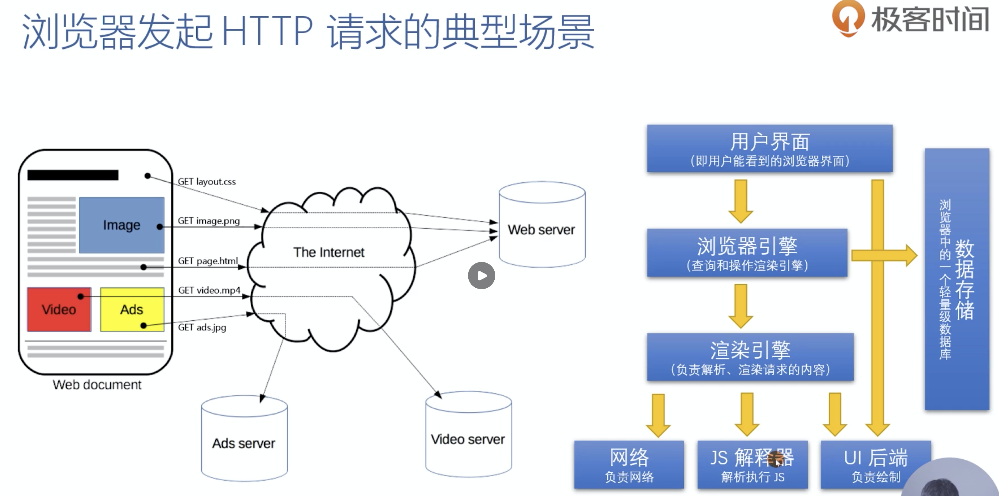
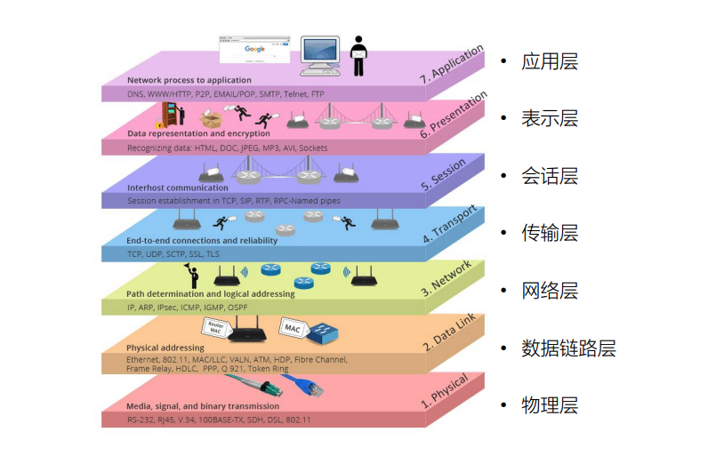
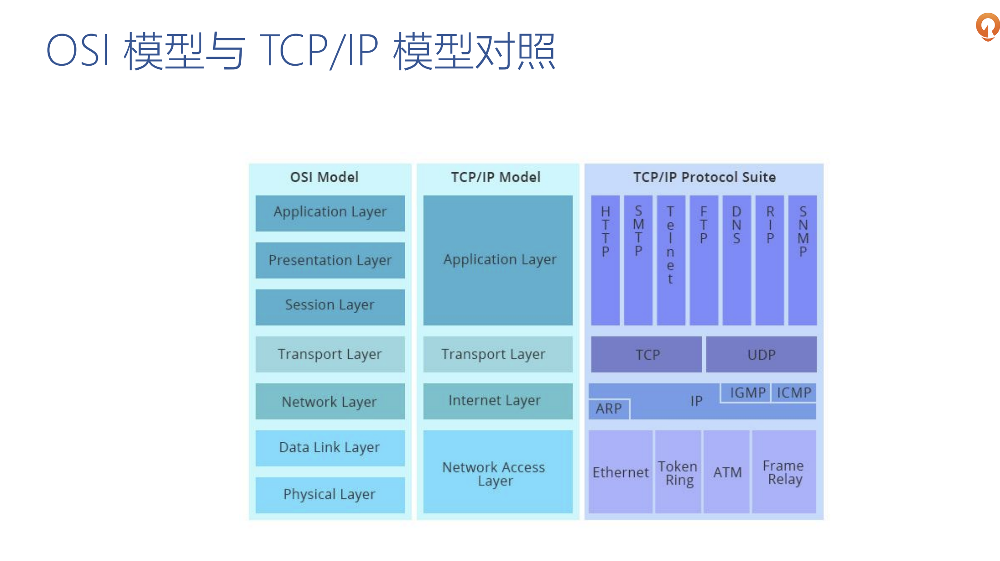
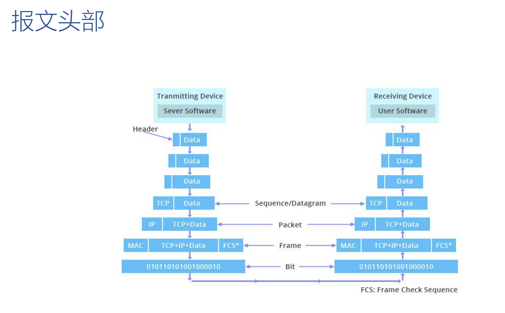
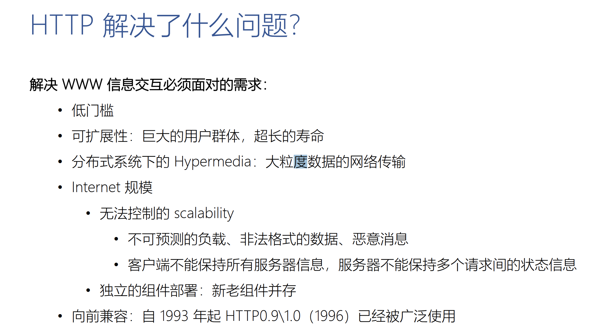
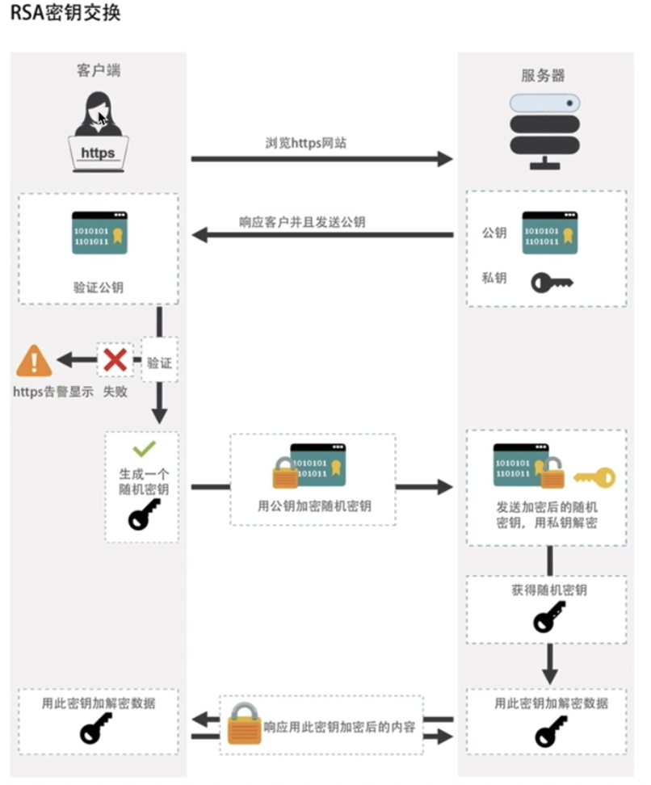

# 1. 准备

浏览器发起http请求的一般场景：



* 数据存储会存储访问过的地址，自动填充功能

# 2 http 协议前言

* Hypertext transfer protocol （超文本传输协议）

  一种无状态的、应用层的、以请求/应答方式运行的协议，它使用可扩展的语义和自描述消息格式，与基于网络的超文本信息（不限于文本，图片，视频文件）系统灵活的互动。主要查看 RFC 文档。

## 2.1 http 协议格式

* 使用 abnf 方式描述，定义协议语法常用这个范式

请求：(口语化表达)

```ABAP
GET / HTTP/1.1
HOST: www.baidu.com
```

* 描述： get请求 空格 路径（根目录） 空格 http 版本号 \n
* host 头

响应：

```tex
HTTP/1.1 200 OK
date: Mon, 19 Oct 2020 17:07:31 GMT
```

总结：请求/响应 行，头部字段，消息体

## 2.2 工具

* mac 使用 telnet，`brew install telnet`
* windows 使用 xshell

1. `telnet www.baidu.com 80`
2. `  GET /wp-content/plugins/Pure-Highlightjs_1.0/assets/pure-highlight.css?ver=0.1.0 HTTP/1.1`
3. `  Host:www.taohui.pub`

`注：2，3之间用 command + return，3后用 command + return*2`

响应：包含后面的响应体

```tex
HTTP/1.1 200 OK
Server: openresty/1.15.8.3
Date: Tue, 20 Oct 2020 06:28:57 GMT
Content-Type: text/css
Content-Length: 108
Last-Modified: Thu, 27 Dec 2018 07:35:33 GMT
Connection: keep-alive
ETag: "5c2480c5-6c"
Expires: Tue, 27 Oct 2020 06:28:57 GMT
Cache-Control: max-age=604800
Accept-Ranges: bytes

pre.pure-highlightjs {
    background-color: transparent;!important;
    border: none;
    padding: 0;
}
```


## 2.3 OSI 模型和 TCP/IP 模型

### 1 OSI (Open System Interconnection Reference Model) 概念模型



* 表示层：不是真实存在，由 ttl/ssl 等表达
* 会话层：不是真实存在，例：session 机制，维持会话关系
* 传输层：解决进程与进程之间的通信，把报文分发到那个进程，（tcp 报文的可达性，流量的控制）
* 网络层：ip 协议找到地址
* 数据链路层：在局域网中使用 mac 地址连接到相应的交换机、路由器，只工作中以太网局域网上，把报文转发到相应的主机上
* 物理层：物理传输介质

### 2. Osi 和 tcp/ip 对照



* 报文头部 

  

## 2.4 所要解决的问题



## 2.5 web 架构的关键属性（去的均衡的状态）

1. 性能 Performance：影响高可用的关键因素。
2. 可伸缩性 Scalability：支持部署可以互相交互的大量组件。
3. 简单性 Simplicity：易理解、易实现、易验证。
4. 可见性 Visiable：对两个组件间的交互进行监视或者仲裁的能力。如缓存、分层设计等。
5. 可移植性 Portability：在不同的环境下运行的能力。
6. 可靠性 Reliability：出现部分故障时，对整体影响的程度。
7. 可修改性 Modifiability：对系统作出修改的难易程度，由可进化性、可定制性、可扩展性、可配置性、可重用性构成。

* 性能：概念https://www.cnblogs.com/data2value/p/6220859.html

## http 协议

请求信息：请求行、请求头、空行还有其他消息体。

特点：

* 客户端&服务端

* 简单（路径+方法+传递类型）

  客户向服务端请求服务时，只需要传递请求方法和路径。请求方法常用有 GET、POST、HEAD等。每种方法规定了客户端与服务端联系类型的不同。由于HTTP协议简单，使得HTTP服务器的程序规模小，因而通信速度很快。

* 灵活

  HTTP允许传输任意类型的数据对象，正在传输的类型由 Content-Type 加以标识。

* 无连接

  无连接的含义是限制每次连接只处理一个请求，服务器处理完成客户的请求，并收到客户的应答后，即断开连接。采用这种方式可以节省传输时间。

* 无状态有会话

  HTTP协议是无状态协议，无状态是指协议对于事务处理没有记忆能力。

  缺少状态意味着如果后续处理需要前面的信息，则它必须重传，这样可能导致每次连接传送数据量增大。另一方面，在服务器不需要先前信息时它的应答就较快。

  > 注意，HTTP本质是无状态的，使用 cookies 可以创建有状态的会话。


HTTP不足之处

* 通信内容使用明文——内容可能被窃听
* 不验证通信方的身份——可能遭遇伪装
* 无法验证报文的完整性——报文有可能已遭篡改

## HTTPS 协议

超文本传输安全协议（hyperText Transfer Protocol Secure，通常称 HTTP over TLS、HTTP over SSL 或者 HTTP secure)是一种通过计算机网络进行安全通信的传输协议。HTTPS 经由HTTP进行通信，但利用 SSL/TLS 来加密数据包。HTTPS 开发的主要目的，是提供对网络服务器的身份认证，保护交换数据的隐私与完整性。这个协议由网景公司（Netscape）在1994年首次提出，随后扩展到互联网上。

主要作用：在不安全的网络上创建一个安全通信。

### HTTPS 认证原理

认证方式：数字证书

认证机构，三种：数字证书认证机构（certificate authority CA），EV SSL（extended validation SSL certificate） 证书，OpenSSL 自认证。

证书信任方式：

* 操作系统和浏览器内核
* 证书颁发机构
* 手动指定证书


RSA密钥交换



* 公钥是数字证书，三种方式进行认证。相当于结婚登记处 + 自愿
* 公钥 + 私钥 = 签名


## 如何配置 HTTPS

1. [Let's Encrypt](https://letsencrypt.org/) 组织介绍

2. acme 来自动化申请

   https://github.com/acmesh-official/acme.sh

   按照如上一步一步安装，

   安装完成 查看 `./bashrc` 发现已经有这个脚本命令，需要执行 `source ~/.bashrc` 让其生效


前置条件：

1. 域名，配置 DNS 解析，支持列表见下方

2. 有公网 IP 的服务器

3. 安装 Nginx、acme.sh

   


## 再谈一谈状态码

* 5xx

  502(错误网关)：服务器作为网关或代理，从上游服务器收到无效响应。

  503 （服务不可用）:服务器目前无法使用（由于超载或停机维护）。 通常，这只是暂时状态。

  504 （网关超时）:服务器作为网关或代理，但是没有及时从上游服务器收到请求。

  505 （HTTP 版本不受支持）:服务器不支持请求中所用的 HTTP 协议版本。


# 云数据库

阿里云关系型数据库RDS（Relational Database Service）是一种稳定可靠、可弹性伸缩的在线数据库服务。基于阿里云分布式文件系统和SSD盘高性能存储，RDS支持MySQL、SQL Server、PostgreSQL、PPAS（Postgre Plus Advanced Server，高度兼容Oracle数据库）和MariaDB TX引擎，并且提供了容灾、备份、恢复、监控、迁移等方面的全套解决方案，彻底解决数据库运维的烦恼。

https://help.aliyun.com/document_detail/26092.html