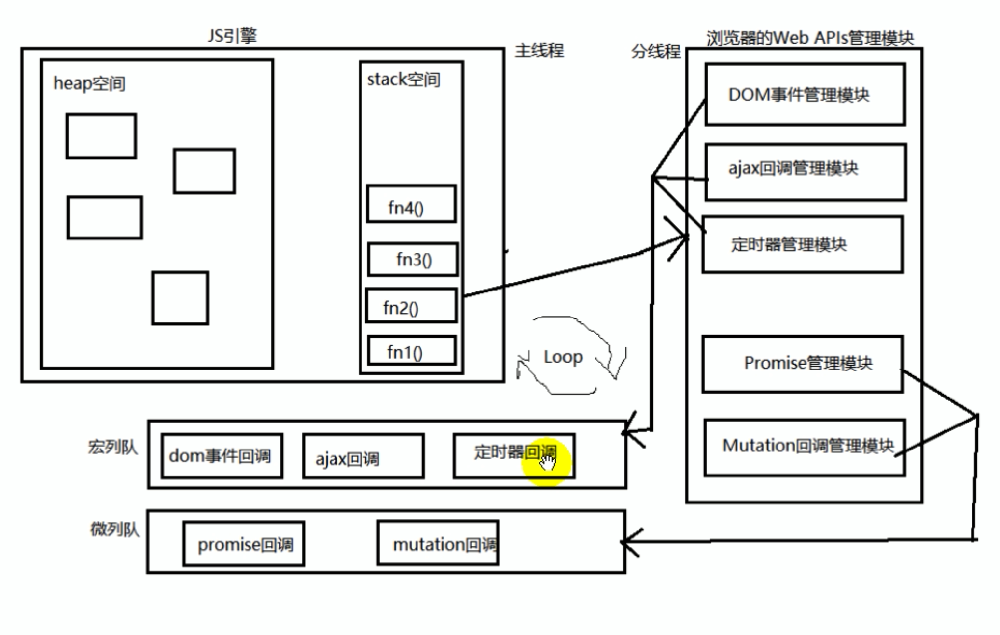

# BFC 

* BFC : block formatting context

## block

box CSS 布局的基本单位

box 是 css 布局的对象和基本单位，直观点来说，就是一个页面由很多个 Box 组成的。

元素的类型 和 display 属性，决定了 box 的类型，不同的类型的 box，会参与不同的 Formatting Context （一个决定如何渲染文档的容器），因此 box 内的元素会以不同的方式渲染。

box-level box:

​	display 属性为block list-item table 的元素，会生成 block-level box。并参与 block formatting context 

inline-level box:

​	display 属性为 inline ，inline-block,inline-table 的元素，会生成 inline-level box

​	并且参与 inline formatting context

formatting context

​	它是页面中的一块渲染区域，并且有一套渲染规则，它决定了其子元素将如何定位，以及和其他元素的关系和相互作用。

## BFC 是什么 

​	它是一个独立的渲染区域，只有 block-level box 参与，它规定了内部的 block-level box 如何布局，并且与这个区域外部毫无相干。

## BFC布局规则

1. 内部的box会在垂直方向，一个接一个的放置。
2. BFC的区域不会与 float box重叠。
3. 内部的 box 垂直方向的距离由 margin 决定。属于同一个 BFC 的两个相邻的 BOX(必须为块级元素，行内块都会相隔) 的margin会发生重叠。（包括margin-top 塌陷的问题）
4. 计算 BFC 的高度时，浮动元素也参与计算（清除浮动 haslayout）
5. BFC 就是页面上的一个隔离的独立容器，容器里面的子元素不会影响到外面的元素。反之也如此。

## BFC 什么时候出现（哪些元素生成 BFC）

* 根元素（HTML）
* float 属性不为 none
* position 为 absolute 或 fixed
* overflow 不为 visible
* display 为 inline-block flex相关的（管理内部的块级元素）

BFC 是一个容器，管理子元素。

# 多出文字省略

3个样式

white-space: nowrap;   文本不会换行

text-overflow: ellipsis;  超出文本省略

overflow: hidden; 

# js定义变量

* 可以全局不写var 赋值，不能全局不写 var 进行定义再调用

# js 类型转换

## js 减法计算遵循的规则

​    **1、如果两个操作符都是数值, 则执行常规的算术减法操作，并返回结果。**

　**2、如果有一个操作数是NAN， 则结果也是NaN。**

　**3、如果有一个操作数是字符串、布尔值、null、undefined则先在后台调用Number()方法将其转换为数值, 然后在根据根据前面的规则进行减法计算，如果转换的结果是NaN, 则减法的结果就是NaN。**

　**4、如果有一个操作数是对象，则调用对象的 valueof() 方法以取得该方法返回后的值，如果得到的值是NaN,则减法的结果就是NaN, 如果对象没有valueOf()方法，则调用其toString()方法并将得到的字符串转为数值。**

* 可以使用给后面加一个 `-0`操作，强制给该值转化为 数值结果

  ```js
  "12" - 0
  ```

## js 加法运算的规则

1，如果操作数里有一个是对象，对象会被转换成原始值（例如：[1,2] => '1,2'，{} => '[object object]'（只有空对象才会是0，其他的都是`[object object]`）, new Date() =>  Fri Jun 22 2018 09:49:28 GMT+0800 (中国标准时间)）；

在计算过程中，false、[]、{}、null 都是 0 （[] 是 "0"）

2，如果操作数里有一个是字符串，其他的值将被转换成字符串；

3，其他情况，操作数转换成数字执行加法运算。

# Number 和 parseInt

Number("123aaa") 为 nan

# 后台数据编码


响应的 HTTP 请求中header 中携带者内容的编码信息。

# domain 的设置

* 后台在设置cookie的时候，能够明确指出 domain 域名，子域名可读取（子域共享该cookie），删除时则也必须明确指定域名，否则无法删除。
* 设置 cookie 时不指定域名，使用默认值，则表示 只有当前域名可见（子域不可共享）。删除时也不需要指定域名，否则无法删除。

比如： 设置 domain 域名为 baidu.com，map.baidu.com 是可以使用 cookie 中的数据的。

https://blog.csdn.net/ogog123/article/details/77227553

# 域名分级

.com 顶级域名(一级[域名](https://baike.baidu.com/item/%E5%9F%9F%E5%90%8D))

baidu.com 二级域名

tieba.baidu .com 三级域名

# ssh 的生成

* vim ~/.ssh/id_rsa.pub  可以进入到 .ssh 文件

# git

* 一个本地仓库对应一个远程的仓库地址
* git init
  git remote add origin https://git.qutoutiao.net/positive-content/positive-cms-fe.git
  git add .
  git commit -m "Initial commit"
  git push -u origin master （本地的分支名称，上传至远端也是这个分支名称）

## 如果本地没有远端的代码

* 可以直接使用 git clone 地址 分支name 的形式来实现对远程仓库代码的拷贝，修改之后使用 git push -u origin master 的形式提交

* git clone 是一个从无到有的过程，如果本地已经有代码了需要使用 git pull  来实现代码的更新。

* git fetch 的拉取过程(有本地代码)

  **git remote add origin git@github.com:XXXX/nothing2.git**（建立连接）

  git fetch origin dev(远程仓库名称)

  **git checkout -b dev(本地分支名称) origin/dev(远程分支名称)**

* git pull 是 git fetch+git merge 的组合，git pull 会自动把远端拉去的代码合并到本地，git fetch 不会主动的合并拉取的代码到本地。

* 删除远端分支，git push origin --delete 分支name

注意：

1. git 不会建立分支，除非你 commit 一些东西之后。
2. 你提交到远端的哪个分支，就要 origin 分支name，提交到哪个分支。

## git更新远程仓库代码到本地

1 使用命令查看连接的远程的仓库

　　　　git remote -v

2 远程获取代码

　　　　git fetch origin master

　　如果出现 Already up-to-date 说明代码更新好了

　　出现 FETCH_HEAD

　　使用命令 git merge FETCH_HEAD

3 当然 我们也可以git fetch origin master:temp建立新分支temp，将代码合并到新分支temp上，在删除新分支temp

## 修改用户的name 和 email

```shell
git config user.name ``"真实姓名"
git config user.email ``"您的公司邮箱"
```

## git fork

当需要操作别人的项目的时候，先 fork 别人的项目，然后会在自己 的代码仓库有一个别人的项目代码，然后直接操作自己代码仓库中的代码，提交之后在网页执行 pull request 操作，把你的代码提交到别人的项目中去，只要别人一同意就可以实现对别人代码的修改。

fork 主要是用来实现对别人代码的修改，常规的合并能够实现最自己仓库代码的修改。

## git 错误解决

1. fatal: refusing to merge unrelated histories

   在 git pull 的后面添加 --allow-unrelated-histories
   
2. git 更换远程仓库地址

   git remote set-url origin 

## git diff

1. `git diff master main.js` 能够查看当前分支和目标分支指定文件的差别
2. `git diff HEAD -- main.js` 查看当前和历史某个版本差别

## git修改远程仓库地址

方法有三种：

1.修改命令 git remote set-url origin [url]

例如: git remote set-url origin https://github.com/boonook/react-native.git

2.先删后加 git remote rm origin

git remote add origin [url]

3.直接修改config文件 --------------------- 本文来自 码农甲乙丙 的CSDN 博客 ，

全文地址请点击：https://blog.csdn.net/u012852597/article/details/79241548?utm_source=copy

# Linux 读写权限

读取权限 r = 4
写入权限 w = 2
执行权限 x = 1

你可以在linux终端先输入ls -al,可以看到如:
   -rwx-r--r-- (一共10个参数)
第一个跟参数跟chmod无关
2-4参数:属于user
5-7参数:属于group
8-10参数:属于others
接下来就简单了:r\==>可读 w\==>可写 x==>可执行
​               r=4      w=2      x=1
所以775代表 rwxrwxr-x
777代表 rwxrwxrwx

# web workers

* web worker 是运行在后台的 JavaScript，独立于其他脚本，不会影响页面的性能。您可以继续做任何愿意做的事情：点击、选取内容等等，而此时 web worker 在后台运行。

* 兼容：

  所有主流浏览器均支持 web worker，除了 Internet Explorer。

* 测试兼容性

  ```js
  if(typeof(Worker)!=="undefined")
    {
    // Yes! Web worker support!
    // Some code.....
    }
  else
    {
    // Sorry! No Web Worker support..
    }
  ```

# http-server

详见webpack的笔记中。

# 盒模型注意的事

* 默认的宽高为 content
* 设置 box-border 为box

# Number 对象方法

* NumberObj.toFixed(num)

  toFixed() 方法可把 Number 四舍五入为指定小数位数的数字。

# i标签作为图标的元素

* 开发的过程中一般使用i标签作为图标元素，用来显示一些图标类的样式。

# 第三方工具

## 1. moment.js--第三方格式化时间的工具

基础使用： 

```js
import moment from "moment"
moment() // 此处获取的是当前的时间
moment(dataStr).format(pattern)  // 获取指定时间，并格式化
```

# form 表单上传的一些问题（图片）

* 只需要配置 action 地址并且给图片的input一个name属性即可，不需要知道图片的具体数据

# delete 关键字

* 内置对象的内置属性不能被删除，用户自定义的属性可以被删除。
* 不能删除原型对象上的属性，可以通过 delete o.prototype.name 的形式删除
* 可以删除隐式全局变量，但不可已删除显示全局变量。 
  全局变量其实是global对象(window)的属性。

# event 对象补充

* 使用 event.target 能够获取绑定元素对象
* 在 vue 事件的使用过程中，常常使用 $event 来实现对原生 event 事件的调用

# typeof 关键字

* 打印出来的都是小写的类型

# 大括号注意问题

* {} 作为一个整体参与运算的时候，需要加 () 来包括起来，才能参与运算

# call、apply、bind 注意

call、apply 方法返回的值就是前面的函数的处理结果，bind 返回的值为前面的函数本身。因为call、apply立马执行，bind 不会立马执行，需执行返回的函数。

* 记住： bind 方法永远使用的是其返回的函数！！！

# 跳转的方式

* 使用`a`标签实现跳转，默认是在本页面进行跳转，如果需要开新的页面，需要使用`target`属性设置为`_blank`

# 特性（property）和属性（attributes）

* 特性是元素标签内的性质

  ```html
  <div id="aa" title="定的">
      
  </div>
  ```

* 属性时对象的性质

  ```js
  divDom.title = "哈哈哈"
  ```

两者有一些共有的值，比如说 title 和 id 

# 利用 image 对象对图片预加载

```js
var img=new Image();

img.src="http://www.abaonet.com/img.gif";

img.onload = function() {}
```

# upload 上传图片

使用 input 上传图片，有一个 files 的属性，里面存放着 上传文件的信息。element-ui中的upload 中钩子函数的参数也是该file属性。

```js
document.querySelector("input").onchange=function() {
    console.log(this.files.length);
}
```

uploadFile 实例对象的值(base 64码)就是上传image的 src，所以能够使用下面的方式获取上传图片的宽高

```js
let reader = new FileReader()
	reader.onload = function (e) {
        let data = e.target.result
        // 加载图片获取图片真实宽度和高度
        let image = new Image()
        image.onload = function () {
            let width = image.width
            let height = image.height
            let isAllow = width >= 750 && height >= 490
            console.log('isAllow', isAllow)
            if (!isAllow) {
                console.log('stop upload')
                return false
            }
    }
    console.log(123)
    image.src = data
    console.log(456)
}
reader.readAsDataURL(file)
```

## 使用URL.createObjectURL上传文件

URl.createObjectURL 拥有较好的性能。URL 需要做一个浏览器兼容性判断， createObjectURL 方法会返回上传文件的 base64 编码

```js
let _URL = window.URL || window.webkitURL;
let img = new Image();
img.onload = function() {
    let valid = img.width==img.height;
    valid ? resolve() : reject();
}
img.src = _URL.createObjectURL(file);
```


# 测试网络连接

判断一个域名是不是可以访问，不要用 ping xxx.com,最好用telnet xxx.com 或者curl xxx.com

ping 只是看网络是不是通的，不能看某个端口是不是能访问，比方有防火墙限制了80端口访问，但ping 是能通的，telnet curl会去访问80端口

telnet ip port

curl ip:port

# 在项目中的host的配置

在webpack打包的项目中，有的项目打包完成之后，会返回一个链接，该链接不是 127.0.0.1 开头的，因此需要配置 host 文件，让该地址能够实现跳转到 127.0.0.1


该工具是 switchhost 

# 内容换行

white-space:nowrap; 能够使内容（盒子或者文本）不换行

## Object 方法的注意

## 1. instance 和 isPrototypeOf() 的区别

instance 关键字是一个对象的原型链上是否存在后面的构造函数的实例对象。

isPrototypeOf() 方法是 该对象是否在后面对象的原型链上。一般在构造函数上使用，`P.prototype.isPrototypeOf(p)`。

实例

```js
function A() {}
var a = new A()
Object.isPrototypeOf(a)
//false
Object.prototype.isPrototypeOf(a)
//true
A.prototype.isPrototypeOf(a)
//true
a instanceof A
//true
a instanceof Object
//true
```

# 实现关闭页面提示保存表单

使用 window.onbeforeunload() 事件监听实现关闭或者刷新页面时的提示。

```js
window.onbeforeunload = function() {
    return "补充的信息"
}
```

# 伪类补充&新样式补充

:focus 伪类：当元素获取焦点的时候，该伪类会起作用

# 再说一下目录问题

* ~ 代表~ ：当前用户的家目录
* / 根目录

# js 中set和get关键字

```js
var obj = {
    _x: "1",
    set x(val) {
        this._x = val
    },
    get x() {
        return this._x+"加点新的东西"
    }
}
obj.x= "dadawd"
console.log(obj.x)
```

在对象的定义中能够使用 set 和 get 关键字来实现对对象属性的设置的获取。

相当于找了一个中间的变量来实现对赋值的转发。

# token 机制简单理解

https://blog.csdn.net/daimengs/article/details/81088172

## jwt (json web tokens) 详解

http://www.ruanyifeng.com/blog/2018/07/json_web_token-tutorial.html

```javascript
Header.Payload.Signature
```

- Header（头部）
- Payload（负载）
- Signature（签名）

# 深浅拷贝

## 深拷贝

1. 可以使用 jquery 的extend 扩展方法来实现对对象的深浅拷贝。

   使用：

   ```js
   jQuery.extend([deep], target, object1, [objectN])
   ```

   deep 为 boolean 类型，默认是 false 浅拷贝，深拷贝为 true

   也可以使用递归的方式，重复赋值，实现深拷贝

2. 使用 JSON 对象来是想深拷贝

   JSON.stringify 先转化为字符串，然后 JSON.parse 方法转化为对象。

使用原则：避免对原有对象产生影响的时候，使用深拷贝

## 浅拷贝

除了上面的jquery 方法之外，还可以使用 es6 的新方法，Object.assign() 方法 来实现对对象的浅拷贝。

3. 可以使用解构赋值的形式来实现对对象的浅拷贝 扩展运算符的形式来实现对对象的浅拷贝。

   ```js
   let {...a} = o
   ```

   

# 发送请求由 json 格式和 formData 格式转换

## json 形式的请求数据转换成 formData 形式的请求数据

因为http请求会默认的识别请求数据格式，并且带上相应的请求头，因此不需要单独的设置 content-type 了。

json 转换成 formData 类型的数据，就是利用 formData 的 append 方法来给一个新的 formData 对象添加元素。

```js
let formData = new FormData()
// params 就是需要上传的json字符串
Object.keys(params).forEach(key => {
    formData.append(key, params[key])
})
```

# 代码调试

## 1. 打断点

### 1. 手动打断点

直接在 source 中找到资源然后打断点调试

### 2. 自动打断点

==在source中找不到资源==，可以在代码中插入 debugger 能够在代码运行时自动打断点。

# 网段

网段（network segment）一般指一个计算机网络中使用同一物理层设备（传输介质，中继器，集线器等）能够直接通讯的那一部分。例如，从192.168.0.1到192.168.255.255这之间就是一个网段。

网关一般是 192.168.0.1，广播地址一般是 192.168.255


# 在js中变量作为判断条件的时候

| a的值                                               | 说明                                                         | 表达式 if(a)的结果： |
| --------------------------------------------------- | ------------------------------------------------------------ | -------------------- |
| var a;                                              | 只声明不赋值                                                 | false                |
| a = '' \|\| a = "" \|\| a = null \|\| a = undefined | 当a为空串或null或undefined时，评估结果为false                | false                |
| a = 'somevalue', ...                                | 当为a赋值后， 评估结果true                                   |                      |
| a = ' ' \|\| a = " "                                | * a为空格， 空格也是一个字符， 评估结果为true                |                      |
| a = 0 \|\| a = 0.0                                  | * 当a为数值0或0.0，0.00，评估结果为false，其他数值一律为true |                      |
| a = f                                               | 当a为函数对象， 且不带括号， 该函数对象定义了评估结果就为true，否则为false |                      |
| a = f()                                             | 当a为函数对象， 且带括号， 则先执行函数， 按照函数的返回结果来作为评估结果， 若无返回结果: 则为false，因为默认返回undefined |                      |
| a = obj.pro1, a = obj.f1()                          | 当a为对象的属性或方法时， 按照a为单独带队属性或方法时的一样进行评估 |                      |

> 当变量的值为空字符串、undefined、null、0（0.0等）、NaN、函数返回为为上面的值 等情况下，会判断为 false，其余情况只要字符串有值，空格也行，都会判断成 true，包括所有形式的对象（包括 `{}`）

# 回到顶部

回到顶部需要执行的 js 代码

```js
window.pageYOffset = 0
document.documentElement.scrollTop = 0
document.body.scrollTop = 0
```

# js 的new 到底干了什么

1. 创建一个新的对象，这个对象的类型是object。
2. 该对象的prototype设置为构造器的prototype属性，即`this.__proto__= Foo.prototype` (伪代码)
3. 执行构造器函数。(把this都换成该对象)
4. 如果构造器函数有返回值，则以该对象作为返回值。若没有return或return了基本类型，则将上述的新对象作为返回值。

一个好的例子，不管有没有写 new 都能够实现对 P 函数的实例：

```js
function Person(name,age){
    if(this instanceOf Person){
        this.name=name;
        this.age=age;
    }else{
        return new Person(name,age);
    }
}
```

# js 实现默认天数（计算出相隔天数）

* js能够通过 Date 实例的 setDate 和 getDate 实现对相隔天数的设置。

  使用过程:

  1. 使用 getDate 方法获取到月份日期
  2. 使用 setDate 方法设置日期，把getDate 方法获取到的日期减去相隔的天数。

# 网页设置 icon

* 在head 标签内设置 link 标签，rel="shortcut icon" href="favicon.ico" (必须这个名字)

  ```html
  <link rel="shortcut icon" href="favicon.ico">
  ```

# 在less 中使用 calc() 计算属性

* calc(~"50% - 10px")

  一定要注意：空格、已经写法

# 手动触发事件

1. click 事件

   ```js
   ele.onclick = fn
   ele.click() // 手动出发点击事件
   ```

# 左侧导航布局的问题

* 左右导航布局，左侧导航的高度由右侧的 content 来决定，父元素宽度自适应

  ```html
  <div class="box">
    <div class="left"></div>
    <div class="right"></div>
  </div>
  
  <style>
    .box {
      display: flex;
    }
    .left {
      /* flex: 0 0 220px; */
      background: pink;
      width: 220px;
      /* min-height: 100vh; */
    }
    .right {
      flex: 1;
      height: 400px;
      background-color: black;
    }
  </style>
  ```

  只需要父元素设置 display: flex 即可

* ==注意==

  样式中使用 `flex: 0 0 220px` 的方式规定元素的宽度的时候，需要加上 `width: 220px` 防止在有得情况下 flex 布局发生塌陷的情况。

# 动画

* animation 能够加 forwards 属性来规定动画执行完成之后，应用结束的样式

# 闭包再总结

* 闭包的形成

  return 一个引用类型，并没有清理掉内存，即可实现缓存的效果

  ```js
  function fn () { var num = 10; return function() { num++;return num } }
  ```

  注意： 如果调用 `fn()()` 则不会实现缓存，会一直重新定义 num 变量

  ​			如果调用 `var fn1 = fn(); fn1()` 则会实现缓存。这样的话才能将闭包赋值于外层的变量，变量的内存才不会被回收。
  
* 打开调试工具，函数中的函数，右边watch 工具里面的 scopes 下的第一个元素 Closure 就是闭包。

  函数中的函数引用外部函数的数据才会出现闭包的标志。

  ```js
  function fn () {
    var a = 1
    function fn1 () {
      console.log(a)
    }
    fn1()
  }
  fn()
  ```

* 闭包的产生条件：当一个嵌套的内部的（子）函数引用了嵌套的外部的（父）函数的变量（也可能是函数）时，就产生了闭包。==调用形参也是调用了外层函数的数据==

  内部的函数不需要被调用，只需要定义就会产生闭包。

  一定要应用外层函数变量。 

## 闭包的生命周期

1. 产生：在嵌套内部函数定义执行完成时就产生了（不是在调用）
2. 死亡：在嵌套的内部函数成为垃圾对象时，`f = null`

## 闭包的产生

* 外部函数调用一次，就会产生一个新的闭包

## 闭包的使用

### 1. 自定义js 模块（ES5写法）(==接口的写法==)

* 新建一个 js 文件，该文件为一个方法，返回一个对象，向外暴露一个对象，需要执行这个函数

  ```js
  function fn() {
    var a = 1
    function fn1 () {
      console.log(111)
    }
    function fn2 () {
      console.log(a + 1)
    }
    return {
      fn1: fn1,
      fn2: fn2
    }
  }
  ```

* 第二种方式，直接挂早到 window 上面

  ```js
  (function (window) {
    var a = 1
    function fn1 () {
      console.log(111)
    }
    function fn2 () {
      console.log(a + 1)
    }
    window.myModule = {
      fn1: fn1,
      fn2: fn2
    }
  })(window)
  ```

将一个属性放到对象不是私有的，只有放到函数中才是私有的。

## 注意：

1. 闭包的缓存一定要看有没有产生新的闭包（即在外层定义一个变量保存返回的闭包对象），只有产生新的闭包，才会更新数据。否则会实现缓存

   ```js
   function fn () {
     var a = 1
     return {
       fn: function fn1 () {
         console.log(a)
       }
     }
   }
   var a = fn()
   a.fn()
   a.fn()
   a.fn()
   // 三次的结果一样，并没有产生新的闭包
   ```

2. 做题思路，有没有产生闭包，有没有产生新的闭包，有没有缓存

   有新的闭包就会重新刷新调用的数据，没有新的闭包就会缓存，并且如果没有新的赋值，就会一直使用之前的缓存。

   https://github.com/programmerZbb/some-test/blob/master/closure/index.js

## 内存的溢出和泄露

* 由于闭包的存在会造成内存无法自动释放

  容易造成内存泄露

解决：

* 能不用闭包就不用
* 及时释放（fn = null）

## 1. 溢出

* 内存溢出，会抛出一个 error

## 2. 泄露

* 可能导致内存溢出

可能的原因：

1. 闭包的使用
2. 意外定义的变量（在函数中定义变量没使用 var，定义了一个全局变量）
3. 没有清理定时器或者回调函数

# vue 和 react 中key 的作用

* diff 算法会使用 key 来diff 组件的变化，**key的作用主要是为了高效的更新虚拟DOM**。

  https://www.cnblogs.com/zhumingzhenhao/p/7688336.html

# 同步回调和异步回调

* 数组常用的方法都是同步回调
* 回调函数有两种写法：
  1. 在回调函数所在的函数内部定义一个回调函数的结构，这种形式的回调函数在使用的时候只需要传一个引用形参就行（不一定要为函数），比如 Promise 里的 resolve 函数
  2. 回调函数所在的函数是回调函数的使用者，具体函数的定义实在调用外层函数的使用写的。

## 1. 重新总结 Promise

new Promise(executor)

executor: 执行器（就是 Promise 的回调函数）

Promise 是一个代理对象，代理一个异步结果。

## 2. 手写 Promise

* ==在class中直接写 then = fn 的形式是把函数挂载到构造函数上了，只有省略写的方式才能挂载到原型上 then() {}==
* 同理 state = {} 这种写法也是挂载到构造函数中，相当于 this.state = {}

注意点：

1. 两个回调只能执行一个

2. .then 方法 的回调是异步执行的，排到微任务的后面

3. then  方法后面的 then 方法 

   then 方法执行完成，return 的数据会在 第二个 then 方法的第一个成功的回调执行，如果发生语法错误（throw error）会在第二个then 方法的失败回调执行。

   返回一个 promise 对象，则由该 promise 对象的状态来决定第二个 then 方法的执行回调

* ==一定要注意 callback 的调用是在函数的内部进行的，只有在调用的时候才能传参，后期在函数的使用过程中给callback 位置传递函数，只是他的引用（这个callback真正的样子，相当于定义），不是真正的调用。callback 所在的函数被调用的时候需要定义callback的结构，在定义外层函数的时候只是调用callback。==

4. promise 的then 方法是同步执行的，执行完会把 回调函数添加到微任务中。
5. Promise 的状态改变并不会阻断 Promise 内部的执行，状态改变就回去执行 then 方法 添加微任务回调，然后执行完 Promise 的同步代码。
6. Promise 的失败状态也是一种 error

## 3. Js 执行规则

队列，任务（在队列中）

1. 执行js 同步代码（过程中有可能会向队列中添加待执行的回调函数），同步代码出错，不再执行后面的代码，直接执行异步添加的微队列（实际上执行宏队列里的任务，微队列没法实现）回调执行。
2. 依次取出微队列中所有的回调（任务）去执行
3. 取出宏队列中的第一个回调（任务）去执行（过程中可能向微队列中添加回调）
4. 如果微队列中有待处理任务，执行2，开始循环

## 4. async await 拓展

1. async 函数

   async 表示后面跟一个==异步函数==，函数的返回值为 Promise 对象

   Promise 对象的结果由 async 函数执行的返回值决定（和  then 方法类似）

   ```js
   async function fn () {
     //return 1  // 返回一个成功的 promise
     //throw 'cuo' // 返回一个失败的 promise
     //return new Promise((res, rej) => {}) // 则由promise 的状态决定
   }
   ```

2. await 表达式

   await 右侧的表示式一般为 promise 对象，单也可以是其他的值

   如果表达式是 promise 对象，await 返回的是 promise 成功的值，失败了需要使用 try catch 来获取失败的值，返回的值为undefined(说白了还是要 promise 来配合)。如果直接在 await 后面写一个异步的函数，则该函数还是会异步执行，并且 不会获取到返回的值。

   如果表达式是其他的值，直接将此值作为 await 的返回值

3. 总结

   * async 返回非 promise的值，状态就变成 resolved，值为返回的值。
   * 返回 promise 类型的值，状态变为 pending，值为 promise 的值，promiseStatus 状态为返回的promise的状态。
   * 如若 async 函数中抛出错误（内部应该做了错误捕获，包括 promise的reject），都会返回一个 rejected 的promise，值为错误的信息，而且后续的代码不再执行。（类似于 then）

## 5. js 数据结构（事件循环）



* 栈空间中存放着基本变量和引用类型的地址
* 堆空间中存放着引用类型的实体
* 栈（stack），堆（heap），队列（callback queue，也叫回调队列）

1. fn1 调用 fn2 依次。。。

   fn4 执行完就出栈（自动释放空间）
   
2. 定时管理模块会在添加定时任务的时候就开始计时，到了定时完成之后开始添加到宏队列中

2. 宏队列中的任务在微队列执行完成之后执行

3. 所有局部变量都放在 stack 空间

4. 主线程，分线程执行异步的任务，==主线程是js引擎执行，分线程是浏览器来管理==

6. 执行宏队列要保证微队列是空的，才能执行。

2. 定时管理模块会在添加定时任务的时候就开始计时，到了定时完成之后开始添加宏队列中任务

注意：

​	不要忘记栈是先入后出，队列是先入先出。

# web workers（线程相关）

* js 是单线程的，但是 H5 中的 WEB workers 可以提供多线程运行
* 浏览器是多线程运行的
* 浏览器是单进程还是多进程
  1. 单进程： Firefox、老版 IE
  2. 多进程：chrome、新版的IE

# http 相关

## 1. 跨域相关

* 异步请求在存在跨域的情况，会首先发送一个 options 类型的请求，在后端允许跨域的情况下才会继续发送 get/post 请求，成功代码一般为204(意思等同于请求执行成功，但`是没有数据`，浏览器不用刷新页面)

## 2. 请求和响应

1. 前后台请求交互基本过程

   * 前端应用从浏览器想服务器发送 HTTP 请求（请求报文）
   * 后台服务器接收到请求后，调度服务器应用处理请求，想浏览器端返回 HTTP 响应（响应报文）
   * 浏览器端接收到响应，解析显示响应体/调用监视回调（异步请求 XMLHttpRequest 对象不会自动刷新页面，同步请求会刷新页面显示返回的内容。）

2. 浏览器异步请求的方式

   * XMLHttpRequest 对象
   * fetch(：取来) 方法，返回一个 promise

3. 请求报文

   https://developer.mozilla.org/zh-CN/docs/Web/HTTP/Overview  (HTTP 报文)

   * 请求报文

     HTTP报文：HTTP报文（在HTTP/2之前）是语义可读的。在HTTP/2中，这些简单的消息被封装在了帧中，这使得报文不能被直接读取，但是原理仍是相同的。

     ```html
     GET / HTTP/1.1
     Host: developer.mozilla.org
     Accept-Language: fr
     ```

     1. url:  可能带 GET请求参数

     2. method: 请求方式  ，专业理解请求行： url+ method

     3. headers ： 多个请求头（key: value）

        Host: localhost:4000

        Cookie: 

        Content-type（请求参数格式）: application/x-www-form-urlencode    、application/json

     4. Body: 请求体(get 请求没有)

        Post 请求有请求体，携带到 body 中，与返回的 body 相似

        重要：

        ​	content-tyep 类型（post 请求在请求体中）

        * application/x-www-form-urlencode;charset=utf-8 ：username=tom&age=12   urlencode 格式

        * application/json;charset=utf-8 ： {"name": "tom"}  json 格式

        * multipart/form-data  用于上传文件（post）  (multipart 多部分的)

        form 表单一般是 formData 的格式（键值对），除非用 multipart 方式传文件。

        

4. 响应报文

   * 响应状态码（响应行）： 200/404

   * 多个响应头

     content-Type: text/html;charset=ytf-8

     Set-cookie:  设置的cookie

   * 响应体

     html文本/json文本/js/css/image
   
## 3. 请求及其作用

   * GET：从服务器端读取数据
   * POST： 向服务器端添加新数据
   * Put：更新服务器端已有数据
   * DELETE：删除服务器端数据

   目前，没有严格的限制，都是可以请求的。

## 4. API 的分类

1. REST API：restful

   发送请求进行CRUD哪个操作由请求方式来决定

   同一个请求路径可以进行多个操作，可以同时 GET 获取、POST添加（一个接口能四个操作）

   请求方式会用到 GET/POST/PUT/DELETE

2. 非 REST API： restless

   请求方式不决定请求的 CRUD 操作

   一个请求路径只对应一个操作

   一般只有 GET/POST，(一般情况，post 增删改） 

### rest Api 包——json-server

1. 全局安装
2. 项目根目录新建 db.json 文件

## 5. 请求头中 url、origin、referer(uri)的简单区别

* url 统一资源定位符 具体某一个请求的具体位置（uri 的子集）
* uri 通一资源标志符 所有资源的位置，相当于项目根目录 `http://localhost:9016/`
* origin 该请求的域名

# 给div 等不可直接编辑的元素添加 keyup 事件

* 给 div 等不可编辑的元素添加 `tabindex="0"`属性，就可实现改元素可编辑，从而能实现`keyup`事件生效

  ```html
  <div tabindex="0" style="outline: none" onkeyup="test()">11111</div>
  ```

  不过会出现外层线，需要设置`outline`不可见。

# \n和\r

'\r' 回车，回到当前行的行首，而不会换到下一行，如果接着输出的话，本行以前的内容会被逐一覆盖；

'\n' 换行，换到当前位置的下一行，而不会回到行首；

# H5 web workers 多线程

# 1. 使用

* 在处理一个主线程的同步任务的时候，由于该任务执行会消耗时间，可能阻塞主线程的执行，因此h5提供了一个多线程 API，能够处理分线程的任务。

http://www.ruanyifeng.com/blog/2018/07/web-worker.html

## 2. 缺点

1. 慢（不是因为快使用，是因为能阻塞主线程执行）
2. 不能跨域加载 js（分配给 Worker 线程运行的脚本文件，必须与主线程的脚本文件同源，且只能加载网络资源，不能加载 file 文件资源）
3. Worker 内部代码不能操作 DOM （更新ui）（分线程没有提供 window 对象，不能操作window 下面的属性）
4. 不是每个浏览器都支持这个特性。

# 节流和防抖

## 1. 函数节流（throttle）

1. 理解：

   在函数需要频繁触发时，函数执行一次后，只有大于设定的执行周期后才会执行第二次

   适合多次事件按时间做平均分配

2. 场景：

   窗口调整（resize）、页面滚动（scroll）、DOM 元素拖拽功能实现（mousemove）、抢购疯狂点击（mousedown）

## 2. 函数防抖（debounce）

1. 理解：

   在函数需要频繁触发时，在规定的时间内，只让最后一次生效，前面的不生效

   适合多次事件一次响应的情况

2. 场景：

   实时搜索联想（keyup）、文本输入的验证（连续输入文字后发送 ajax 请求进行验证、验证一次就好），判断 scroll 是否滑到了底部，滚动事件+函数防抖

# apply 补充

* apply 方法是能使用 伪数组作为第二个参数的

# cookie 补充

* 不超过 4k

# 路径补充

* 组件的引用能够使用，因为从 src 出发的，不能直接使用绝对路径

  ```js
  import Test from 'src/Test.vue'
  ```

* a 标签的使用则可以使用绝对路径

  ```html
  <a href='/src/test'></a>
  ```

这两种形式都可以使用相对路径

# object 方法再总结

## 1.create 方法

* `Object.create`方法能够把一个对象变为另一个对象的原型对象

  ```js
  let o = { name: 'test' }
  let b = Object.create(o)
  // o方法就变成了 b 方法的原型对象
  ```

# 页面上报

## 方法一

* 使用拦截对象的方式来实现对页面组件的拦截，在使用方法的时候捕获，发送上报请求。

前置知识，proxy 拦截对象的 get 方法能够获取对象属性或者方法的使用，拦截 apply 方法能够实现对方法调用的拦截（参见 ES6 文档）

代码：

```js
// lazy loading Components
// https://github.com/vuejs/vue-router/blob/dev/examples/lazy-loading/app.js#L8
import { log } from '../loger/log';

function lazy() {
    return (name, index = false) => {
        return () => {
            let component = import(`../views/${name}${index ? '/index' : ''}.vue`);
            return component.then(res => {
                if (!res.mounted) {
                    Object.defineProperty(res, 'mounted', {
                        get() {
                            if (window.location.pathname.replace(/.*\//, '').replace(/[-_]/, '').length === name.replace(/.*\//, '').length) {
                                log({
                                    path: window.location.pathname,
                                    eventName: 'pageEnter',
                                    params: window.location.search
                                });
                            }
                        }
                    })
                }
                else {
                    res.mounted = new Proxy(res.mounted, {
                        apply(target, context, args) {
                            if (window.location.pathname.replace(/.*\//, '').replace(/[-_]/, '').length === name.replace(/.*\//, '').length) {
                                log({
                                    path: context.$route.path,
                                    eventName: 'pageEnter',
                                    params: context.$route.query
                                });
                            }
                            return target.apply(context, args);
                        }
                    });
                }
                return enpower(res);
            });
        }
    }
}

function enpower(component) {
    let { methods, components } = component;
    if (methods) {
        Object.keys(methods).map(key => {
            methods[key] = new Proxy(methods[key], {
                apply(target, context, args) {
                    if (key.indexOf('_nolog') === -1) {
                        log({
                            path: context.$route.path,
                            eventName: key,
                            params: args
                        });
                    }
                    return target.apply(context, args);
                }
            })
        });
    }

    if (components) {
        Object.keys(components).map(key => {
            enpower(components[key]);
        });
    }
    return component;
}
export default lazy();


```

* 上述代码 log.js 是上报请求的配置

自己写的例子：

```js
let methods = AccountInfo.methods
Object.keys(methods).forEach((item, index) => {
    console.log(methods[item], '在这')
    methods[item] = new Proxy(methods[item], {
        apply: function (target, ctx, args) {
            console.log('拦截了')
            return Reflect.apply(...arguments);
          	// return target.apply(ctx, args)
        }
    })
})
console.log(window.location.pathname, 'pathname')
```

Proxy 中的拦截方法，基本都能使用 Reflect 来直接调用（参数都不用变）

vue methods 中的方法可以更换，但是 methods 是不能直接赋值的方式更换的。


# 方法和函数

* 方法（method）指定是对象挂载的函数。

# 检测屏幕横屏还是竖屏（媒体查询扩展）

`window.matchMedia('(orientation: portrait)')`‘

`window.matchMedia()` 方法可以用来检测是否符合自定义的样式，返回的对象有三个属性

* matches 是否符合
* media 查询的字符串
* onchange 符合的时候会触发

| addListener(*functionref*)    | 添加一个新的监听器函数，该函数在媒体查询的结果发生变化时执行。 |
| ----------------------------- | ------------------------------------------------------------ |
| removeListener(*functionref*) | 从媒体查询列表中删除之前添加的监听器。      如果指定的监听器不在列表中，则不执行任何操作。 |

# 使用a 标签实现 CSV 数据的下载

```html
<a class="btn-a1" ref="downLink" :href="downloadStr" download="导出数据.csv">导出数据</a>

```

* 可以让 a 标签 `display: none`，并且在页面渲染好之后(vue 中的 $nextTick())，才能`设置`a标签`click()`事件
* `downloadStr`的数据格式为`'data:text/csv;charset=utf-8,\ufeff'test1\n value\n`

# float 布局的一些问题

* float 布局的开始是从盒子的 content 开始的，不包括 border padding