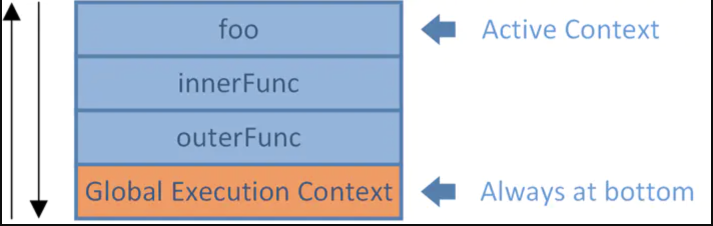
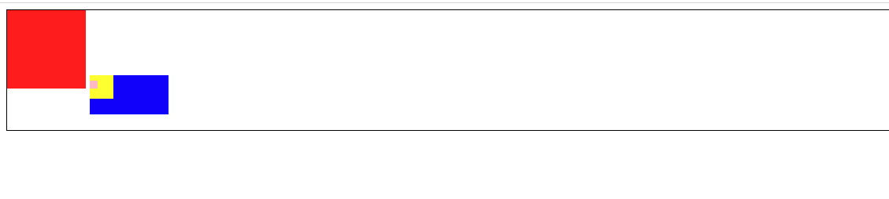

# BFC 

* BFC : block formatting context

## block

box CSS 布局的基本单位

box 是 css 布局的对象和基本单位，直观点来说，就是一个页面由很多个 Box 组成的。

元素的类型 和 display 属性，决定了 box 的类型，不同的类型的 box，会参与不同的 Formatting Context （一个决定如何渲染文档的容器），因此 box 内的元素会以不同的方式渲染。

box-level box:

​	display 属性为block list-item table 的元素，会生成 block-level box。并参与 block formatting context 

inline-level box:

​	display 属性为 inline ，inline-block,inline-table 的元素，会生成 inline-level box

​	并且参与 inline formatting context

formatting context

​	它是页面中的一块渲染区域，并且有一套渲染规则，它决定了其子元素将如何定位，以及和其他元素的关系和相互作用。

## BFC 是什么 

​	它是一个独立的渲染区域，只有 block-level box 参与，它规定了内部的 block-level box 如何布局，并且与这个区域外部毫无相干。

## BFC布局规则

1. 内部的box会在垂直方向，一个接一个的放置。

2. ==BFC的区域不会与 float box重叠。==

3. 内部的 box 垂直方向的距离由 margin 决定。属于同一个 BFC 的两个相邻的 BOX(必须为块级元素，行内块都会相隔) 的margin会发生重叠。（包括margin-top 塌陷的问题）

4. 计算 BFC 的高度时，浮动元素也参与计算（清除浮动 haslayout）

   ==就是一个单独的文档流，不脱离。浮动元素也不会脱离这个特殊的文档流==

5. BFC 就是页面上的一个隔离的独立容器，容器里面的子元素不会影响到外面的元素。反之也如此。

## BFC 什么时候出现（哪些元素生成 BFC）

* 根元素（HTML）
* float 属性不为 none
* position 为 absolute 或 fixed
* overflow 不为 visible
* display 为 inline-block flex相关的（管理内部的块级元素）

BFC 是一个容器，管理子元素。


## BFC 注意

* 根节点虽然开启了 BFC，但是只要内部的盒子变为一个 BFC 容器，他就不符合 BFC 规则了
* **BFC 可以包含浮动的元素**

* ==BFC的区域不会与 float box重叠==，float 不能重叠


# 多出文字省略

3个样式

white-space: nowrap;   文本不会换行

text-overflow: ellipsis;  超出文本省略

overflow: hidden; 

超出两行：

```css
overflow:hidden; 
text-overflow:ellipsis;
display:-webkit-box; 
-webkit-box-orient:vertical;
-webkit-line-clamp:2; 
```


# js定义变量

* 可以全局不写var 赋值，不能全局不写 var 进行定义再调用

# js 类型转换

## js 减法计算遵循的规则

​    **1、如果两个操作符都是数值, 则执行常规的算术减法操作，并返回结果。**

　**2、如果有一个操作数是NAN， 则结果也是NaN。**

　**3、如果有一个操作数是字符串、布尔值、null、undefined则先在后台调用Number()方法将其转换为数值, 然后在根据根据前面的规则进行减法计算，如果转换的结果是NaN, 则减法的结果就是NaN。**

　**4、如果有一个操作数是对象，则调用对象的 valueof() 方法以取得该方法返回后的值，如果得到的值是NaN,则减法的结果就是NaN, 如果对象没有valueOf()方法，则调用其toString()方法并将得到的字符串转为数值。**

* 可以使用给后面加一个 `-0`操作，强制给该值转化为 数值结果

  ```js
  "12" - 0
  ```

## js 加法运算的规则

1，如果操作数里有一个是对象，对象会被转换成原始值（例如：[1,2] => '1,2'，{} => '[object object]'（只有空对象才会是0，其他的都是`[object object]`）, new Date() =>  Fri Jun 22 2018 09:49:28 GMT+0800 (中国标准时间)）；

在计算过程中，false、[]、{}、null 都是 0 （[] 是 "0"）

2，如果操作数里有一个是字符串，其他的值将被转换成字符串；

3，其他情况，操作数转换成数字执行加法运算。

# Number 和 parseInt

Number("123aaa") 为 nan

# 后台数据编码


响应的 HTTP 请求中header 中携带者内容的编码信息。

# domain 的设置

* 后台在设置cookie的时候，能够明确指出 domain 域名，子域名可读取（子域共享该cookie），删除时则也必须明确指定域名，否则无法删除。
* 设置 cookie 时不指定域名，使用默认值，则表示 只有当前域名可见（子域不可共享）。删除时也不需要指定域名，否则无法删除。

比如： 设置 domain 域名为 baidu.com，map.baidu.com 是可以使用 cookie 中的数据的。

https://blog.csdn.net/ogog123/article/details/77227553

# 域名分级

.com 顶级域名(一级[域名](https://baike.baidu.com/item/%E5%9F%9F%E5%90%8D))

baidu.com 二级域名

tieba.baidu .com 三级域名

# ssh 的生成

* vim ~/.ssh/id_rsa.pub  可以进入到 .ssh 文件

# git

* 一个本地仓库对应一个远程的仓库地址
* git init
  git remote add origin https://git.qutoutiao.net/positive-content/positive-cms-fe.git
  git add .
  git commit -m "Initial commit"
  git push -u origin master （本地的分支名称，上传至远端也是这个分支名称）

## 如果本地没有远端的代码

* 可以直接使用 git clone 地址 分支name 的形式来实现对远程仓库代码的拷贝，修改之后使用 git push -u origin master 的形式提交

* git clone 是一个从无到有的过程，如果本地已经有代码了需要使用 git pull  来实现代码的更新。

* git fetch 的拉取过程(有本地代码)

  **git remote add origin git@github.com:XXXX/nothing2.git**（建立连接）

  git fetch origin dev(远程仓库名称)

  **git checkout -b dev(本地分支名称) origin/dev(远程分支名称)**

* git pull 是 git fetch+git merge 的组合，git pull 会自动把远端拉去的代码合并到本地，git fetch 不会主动的合并拉取的代码到本地。

* 删除远端分支，git push origin --delete 分支name

注意：

1. git 不会建立分支，除非你 commit 一些东西之后。
2. 你提交到远端的哪个分支，就要 origin 分支name，提交到哪个分支。

## git更新远程仓库代码到本地

1 使用命令查看连接的远程的仓库

　　　　git remote -v

2 远程获取代码

　　　　git fetch origin master

　　如果出现 Already up-to-date 说明代码更新好了

　　出现 FETCH_HEAD

　　使用命令 git merge FETCH_HEAD

3 当然 我们也可以git fetch origin master:temp建立新分支temp，将代码合并到新分支temp上，在删除新分支temp

## 修改用户的name 和 email

```shell
git config user.name ``"真实姓名"
git config user.email ``"您的公司邮箱"
```

## git fork

当需要操作别人的项目的时候，先 fork 别人的项目，然后会在自己 的代码仓库有一个别人的项目代码，然后直接操作自己代码仓库中的代码，提交之后在网页执行 pull request 操作，把你的代码提交到别人的项目中去，只要别人一同意就可以实现对别人代码的修改。

fork 主要是用来实现对别人代码的修改，常规的合并能够实现最自己仓库代码的修改。

## git 错误解决

1. fatal: refusing to merge unrelated histories

   在 git pull 的后面添加 --allow-unrelated-histories
   
2. git 更换远程仓库地址

   git remote set-url origin 

## git diff

1. `git diff master main.js` 能够查看当前分支和目标分支指定文件的差别
2. `git diff HEAD -- main.js` 查看当前和历史某个版本差别

## git修改远程仓库地址

方法有三种：

1.修改命令 git remote set-url origin [url]

例如: git remote set-url origin https://github.com/boonook/react-native.git

2.先删后加 git remote rm origin

git remote add origin [url]

3.直接修改config文件 --------------------- 本文来自 码农甲乙丙 的CSDN 博客 ，

全文地址请点击：https://blog.csdn.net/u012852597/article/details/79241548?utm_source=copy

# Linux 读写权限

读取权限 r = 4
写入权限 w = 2
执行权限 x = 1

你可以在linux终端先输入ls -al,可以看到如:
   -rwx-r--r-- (一共10个参数)
第一个跟参数跟chmod无关
2-4参数:属于user
5-7参数:属于group
8-10参数:属于others
接下来就简单了:r\==>可读 w\==>可写 x==>可执行
​               r=4      w=2      x=1
所以775代表 rwxrwxr-x
777代表 rwxrwxrwx

# web workers

* web worker 是运行在后台的 JavaScript，独立于其他脚本，不会影响页面的性能。您可以继续做任何愿意做的事情：点击、选取内容等等，而此时 web worker 在后台运行。

* 兼容：

  所有主流浏览器均支持 web worker，除了 Internet Explorer。

* 测试兼容性

  ```js
  if(typeof(Worker)!=="undefined")
    {
    // Yes! Web worker support!
    // Some code.....
    }
  else
    {
    // Sorry! No Web Worker support..
    }
  ```

# http-server

详见webpack的笔记中。

# 盒模型注意的事

* 默认的宽高为 content
* 设置 box-border 为box

# Number 对象方法

* NumberObj.toFixed(num)

  toFixed() 方法可把 Number 四舍五入为指定小数位数的数字。

# i标签作为图标的元素

* 开发的过程中一般使用i标签作为图标元素，用来显示一些图标类的样式。

# 第三方工具

## 1. moment.js--第三方格式化时间的工具

基础使用： 

```js
import moment from "moment"
moment() // 此处获取的是当前的时间
moment(dataStr).format(pattern)  // 获取指定时间，并格式化
```

# form 表单上传的一些问题（图片）

* 只需要配置 action 地址并且给图片的input一个name属性即可，不需要知道图片的具体数据

# delete 关键字

* 内置对象的内置属性不能被删除，用户自定义的属性可以被删除。
* 不能删除原型对象上的属性，可以通过 delete o.prototype.name 的形式删除
* 可以删除隐式全局变量，但不可已删除显示全局变量。 
  全局变量其实是global对象(window)的属性。

# event 对象补充

* 使用 event.target 能够获取绑定元素对象
* 在 vue 事件的使用过程中，常常使用 $event 来实现对原生 event 事件的调用

# typeof 关键字

* 打印出来的都是小写的类型

# 大括号注意问题

* {} 作为一个整体参与运算的时候，需要加 () 来包括起来，才能参与运算

# call、apply、bind 注意

call、apply 方法返回的值就是前面的函数的处理结果，bind 返回的值为前面的函数本身。因为call、apply立马执行，bind 不会立马执行，需执行返回的函数。

* 记住： bind 方法永远使用的是其返回的函数！！！

# 跳转的方式

* 使用`a`标签实现跳转，默认是在本页面进行跳转，如果需要开新的页面，需要使用`target`属性设置为`_blank`

# 特性（property）和属性（attributes）

* 特性是元素标签内的性质

  ```html
  <div id="aa" title="定的">
      
  </div>
  ```

* 属性时对象的性质

  ```js
  divDom.title = "哈哈哈"
  ```

两者有一些共有的值，比如说 title 和 id 

# 利用 image 对象对图片预加载

```js
var img=new Image();

img.src="http://www.abaonet.com/img.gif";

img.onload = function() {}
```

# upload 上传图片

使用 input 上传图片，有一个 files 的属性，里面存放着 上传文件的信息。element-ui中的upload 中钩子函数的参数也是该file属性。

```js
document.querySelector("input").onchange=function() {
    console.log(this.files.length);
}
```

uploadFile 实例对象的值(base 64码)就是上传image的 src，所以能够使用下面的方式获取上传图片的宽高

```js
let reader = new FileReader()
reader.onload = function (e) {
        let data = e.target.result
        // 加载图片获取图片真实宽度和高度
        let image = new Image()
        image.onload = function () {
            let width = image.width
            let height = image.height
            let isAllow = width >= 750 && height >= 490
            console.log('isAllow', isAllow)
            if (!isAllow) {
                console.log('stop upload')
                return false
            }
    }
    console.log(123)
    image.src = data
    console.log(456)
}
reader.readAsDataURL(file)
```

## 使用URL.createObjectURL上传文件

URl.createObjectURL 拥有较好的性能。URL 需要做一个浏览器兼容性判断， createObjectURL 方法会返回上传文件的 base64 编码

```js
let _URL = window.URL || window.webkitURL;
let img = new Image();
img.onload = function() {
    let valid = img.width==img.height;
    valid ? resolve() : reject();
}
img.src = _URL.createObjectURL(file);
```


# 测试网络连接

判断一个域名是不是可以访问，不要用 ping xxx.com,最好用telnet xxx.com 或者curl xxx.com

ping 只是看网络是不是通的，不能看某个端口是不是能访问，比方有防火墙限制了80端口访问，但ping 是能通的，telnet curl会去访问80端口

telnet ip port

curl ip:port

# 在项目中的host的配置

在webpack打包的项目中，有的项目打包完成之后，会返回一个链接，该链接不是 127.0.0.1 开头的，因此需要配置 host 文件，让该地址能够实现跳转到 127.0.0.1


该工具是 switchhost 

# 内容换行

white-space:nowrap; 能够使内容（盒子或者文本）不换行

## Object 方法的注意

## 1. instance 和 isPrototypeOf() 的区别

instance 关键字是一个对象的原型链上是否存在后面的构造函数的实例对象。

isPrototypeOf() 方法是 该对象是否在后面对象的原型链上。一般在构造函数上使用，`P.prototype.isPrototypeOf(p)`。

实例

```js
function A() {}
var a = new A()
Object.isPrototypeOf(a)
//false
Object.prototype.isPrototypeOf(a)
//true
A.prototype.isPrototypeOf(a)
//true
a instanceof A
//true
a instanceof Object
//true
```

## 2. hasOwnProperty

* hasOwnProperty 方法只能检测自身的属性，不能检测原型链上挂载的属性。

* ==可以使用该属性来判断一个未知的类型是否含有某个属性（react 源码）==

  ```js
  Object.hasOwnProperty.call({name: 1}, 'name')
  // 就算是普通类型，也不会报错
  ```

* 与 in 字段的区别

  in 字段只能判断是否在后面的对象中，必须为对象，如果是普通类型就会报错。

## 3. typeof 关键字

`typeof` 关键字打印出来的都是小写类型

# 实现关闭页面提示保存表单

使用 window.onbeforeunload() 事件监听实现关闭或者刷新页面时的提示。

```js
window.onbeforeunload = function() {
    return "补充的信息"
}
```

# 伪类补充&新样式补充

:focus 伪类：当元素获取焦点的时候，该伪类会起作用

# 再说一下目录问题

* ~ 代表~ ：当前用户的家目录
* / 根目录

# js 中set和get关键字

```js
var obj = {
    _x: "1",
    set x(val) {
        this._x = val
    },
    get x() {
        return this._x+"加点新的东西"
    }
}
obj.x= "dadawd"
console.log(obj.x)
```

在对象的定义中能够使用 set 和 get 关键字来实现对对象属性的设置的获取。

相当于找了一个中间的变量来实现对赋值的转发。

# token 机制简单理解

https://blog.csdn.net/daimengs/article/details/81088172

## jwt (json web tokens) 详解

http://www.ruanyifeng.com/blog/2018/07/json_web_token-tutorial.html

```javascript
Header.Payload.Signature
```

- Header（头部）
- Payload（负载）
- Signature（签名）

# 深浅拷贝

## 深拷贝

1. 可以使用 jquery 的extend 扩展方法来实现对对象的深浅拷贝。

   使用：

   ```js
   jQuery.extend([deep], target, object1, [objectN])
   ```

   deep 为 boolean 类型，默认是 false 浅拷贝，深拷贝为 true

   也可以使用递归的方式，重复赋值，实现深拷贝

2. 使用 JSON 对象来是想深拷贝

   JSON.stringify 先转化为字符串，然后 JSON.parse 方法转化为对象。

使用原则：避免对原有对象产生影响的时候，使用深拷贝

## 浅拷贝

除了上面的jquery 方法之外，还可以使用 es6 的新方法，Object.assign() 方法 来实现对对象的浅拷贝。

3. 可以使用解构赋值的形式来实现对对象的浅拷贝 扩展运算符的形式来实现对对象的浅拷贝。

   ```js
   let {...a} = o
   ```

   

# 发送请求由 json 格式和 formData 格式转换

## json 形式的请求数据转换成 formData 形式的请求数据

因为http请求会默认的识别请求数据格式，并且带上相应的请求头，因此不需要单独的设置 content-type 了。

json 转换成 formData 类型的数据，就是利用 formData 的 append 方法来给一个新的 formData 对象添加元素。

```js
let formData = new FormData()
// params 就是需要上传的json字符串
Object.keys(params).forEach(key => {
    formData.append(key, params[key])
})
```

# 代码调试

## 1. 打断点

### 1. 手动打断点

直接在 source 中找到资源然后打断点调试

### 2. 自动打断点

==在source中找不到资源==，可以在代码中插入 debugger 能够在代码运行时自动打断点。

# 网段

网段（network segment）一般指一个计算机网络中使用同一物理层设备（传输介质，中继器，集线器等）能够直接通讯的那一部分。例如，从192.168.0.1到192.168.255.255这之间就是一个网段。

网关一般是 192.168.0.1，广播地址一般是 192.168.255


# 在js中变量作为判断条件的时候

| a的值                                               | 说明                                                         | 表达式 if(a)的结果： |
| --------------------------------------------------- | ------------------------------------------------------------ | -------------------- |
| var a;                                              | 只声明不赋值                                                 | false                |
| a = '' \|\| a = "" \|\| a = null \|\| a = undefined | 当a为空串或null或undefined时，评估结果为false                | false                |
| a = 'somevalue', ...                                | 当为a赋值后， 评估结果true                                   |                      |
| a = ' ' \|\| a = " "                                | * a为空格， 空格也是一个字符， 评估结果为true                |                      |
| a = 0 \|\| a = 0.0                                  | * 当a为数值0或0.0，0.00，评估结果为false，其他数值一律为true |                      |
| a = f                                               | 当a为函数对象， 且不带括号， 该函数对象定义了评估结果就为true，否则为false |                      |
| a = f()                                             | 当a为函数对象， 且带括号， 则先执行函数， 按照函数的返回结果来作为评估结果， 若无返回结果: 则为false，因为默认返回undefined |                      |
| a = obj.pro1, a = obj.f1()                          | 当a为对象的属性或方法时， 按照a为单独带队属性或方法时的一样进行评估 |                      |

> 当变量的值为空字符串、undefined、null、0（0.0等）、NaN、函数返回为为上面的值 等情况下，会判断为 false，其余情况只要字符串有值，空格也行，都会判断成 true，包括所有形式的对象（包括 `{}`）

# 回到顶部

回到顶部需要执行的 js 代码

```js
window.pageYOffset = 0
document.documentElement.scrollTop = 0
document.body.scrollTop = 0
```

# js 的new 到底干了什么

1. 创建一个新的对象，这个对象的类型是object。
2. 该对象的prototype设置为构造器的prototype属性，即`this.__proto__= Foo.prototype` (伪代码)
3. 执行构造器函数。(把this都换成该对象)
4. 如果构造器函数有返回值，则以该对象作为返回值。若没有return或return了基本类型，则将上述的新对象作为返回值。

一个好的例子，不管有没有写 new 都能够实现对 P 函数的实例：

```js
function Person(name,age){
    if(this instanceOf Person){
        this.name=name;
        this.age=age;
    }else{
        return new Person(name,age);
    }
}
```

# js 实现默认天数（计算出相隔天数）

* js能够通过 Date 实例的 setDate 和 getDate 实现对相隔天数的设置。

  使用过程:

  1. 使用 getDate 方法获取到月份日期
  2. 使用 setDate 方法设置日期，把getDate 方法获取到的日期减去相隔的天数。
  
  ```js
  let d = new Date()
  d.setDate(d.getDate() + 10)
  d.getDate()
  ```
  
  

# Date 对象补充

1. 获取当前时间（毫秒数）

   `Date.now()`

# 网页设置 icon

* 在head 标签内设置 link 标签，rel="shortcut icon" href="favicon.ico" (必须这个名字)

  ```html
  <link rel="shortcut icon" href="favicon.ico">
  ```

# 在less 中使用 calc() 计算属性

* calc(~"50% - 10px")

  一定要注意：空格、已经写法

# 手动触发事件

1. click 事件

   ```js
   ele.onclick = fn
   ele.click() // 手动出发点击事件
   ```

# 左侧导航布局的问题

* 左右导航布局，左侧导航的高度由右侧的 content 来决定，父元素宽度自适应

  ```html
  <div class="box">
    <div class="left"></div>
    <div class="right"></div>
  </div>
  
  <style>
    .box {
      display: flex;
    }
    .left {
      /* flex: 0 0 220px; */
      background: pink;
      width: 220px;
      /* min-height: 100vh; */
    }
    .right {
      flex: 1;
      height: 400px;
      background-color: black;
    }
  </style>
  ```

  只需要父元素设置 display: flex 即可

* ==注意==

  样式中使用 `flex: 0 0 220px` 的方式规定元素的宽度的时候，需要加上 `width: 220px` 防止在有得情况下 flex 布局发生塌陷的情况。

# 动画

* animation 能够加 forwards 属性来规定动画执行完成之后，应用结束的样式

# 闭包再总结

* 闭包的形成

  return 一个引用类型，并没有清理掉内存，即可实现缓存的效果

  ```js
  function fn () { var num = 10; return function() { num++;return num } }
  ```

  注意： 如果调用 `fn()()` 则不会实现缓存，会一直重新定义 num 变量

  ​			如果调用 `var fn1 = fn(); fn1()` 则会实现缓存。这样的话才能将闭包赋值于外层的变量，变量的内存才不会被回收。
  
* 打开调试工具，函数中的函数，右边watch 工具里面的 scopes 下的第一个元素 Closure 就是闭包。

  函数中的函数引用外部函数的数据才会出现闭包的标志。

  ```js
  function fn () {
    var a = 1
    function fn1 () {
      console.log(a)
    }
    fn1()
  }
  fn()
  ```

* 闭包的产生条件：当一个嵌套的内部的（子）函数引用了嵌套的外部的（父）函数的变量（也可能是函数）时，就产生了闭包。==调用形参也是调用了外层函数的数据==

  内部的函数不需要被调用，只需要定义就会产生闭包。

  一定要应用外层函数变量。 

## 闭包的生命周期

1. 产生：在嵌套内部函数定义执行完成时就产生了（不是在调用）
2. 死亡：在嵌套的内部函数成为垃圾对象时，`f = null`

## 闭包的产生

* 外部函数调用一次，就会产生一个新的闭包

## 闭包的使用

### 1. 自定义js 模块（ES5写法）(==接口的写法==)

* 新建一个 js 文件，该文件为一个方法，返回一个对象，向外暴露一个对象，需要执行这个函数

  ```js
  function fn() {
    var a = 1
    function fn1 () {
      console.log(111)
    }
    function fn2 () {
      console.log(a + 1)
    }
    return {
      fn1: fn1,
      fn2: fn2
    }
  }
  ```

* 第二种方式，直接挂早到 window 上面

  ```js
  (function (window) {
    var a = 1
    function fn1 () {
      console.log(111)
    }
    function fn2 () {
      console.log(a + 1)
    }
    window.myModule = {
      fn1: fn1,
      fn2: fn2
    }
  })(window)
  ```

将一个属性放到对象不是私有的，只有放到函数中才是私有的。

## 注意：

1. 闭包的缓存一定要看有没有产生新的闭包（即在外层定义一个变量保存返回的闭包对象），只有产生新的闭包，才会更新数据。否则会实现缓存

   ```js
   function fn () {
     var a = 1
     return {
       fn: function fn1 () {
         console.log(a)
       }
     }
   }
   var a = fn()
   a.fn()
   a.fn()
   a.fn()
   // 三次的结果一样，并没有产生新的闭包
   ```

2. 做题思路，有没有产生闭包，有没有产生新的闭包，有没有缓存

   有新的闭包就会重新刷新调用的数据，没有新的闭包就会缓存，并且如果没有新的赋值，就会一直使用之前的缓存。

   https://github.com/programmerZbb/some-test/blob/master/closure/index.js

## 内存的溢出和泄露

* 由于闭包的存在会造成内存无法自动释放

  容易造成内存泄露

解决：

* 能不用闭包就不用
* 及时释放（fn = null）

## 1. 溢出

* 内存溢出，会抛出一个 error

## 2. 泄露

* 可能导致内存溢出

可能的原因：

1. 闭包的使用
2. 意外定义的变量（在函数中定义变量没使用 var，定义了一个全局变量）
3. 没有清理定时器或者回调函数

# vue 和 react 中key 的作用

* diff 算法会使用 key 来diff 组件的变化，**key的作用主要是为了高效的更新虚拟DOM**。

  https://www.cnblogs.com/zhumingzhenhao/p/7688336.html

# 同步回调和异步回调

* 数组常用的方法都是同步回调
* 回调函数有两种写法：
  1. 在回调函数所在的函数内部定义一个回调函数的结构，这种形式的回调函数在使用的时候只需要传一个引用形参就行（不一定要为函数），比如 Promise 里的 resolve 函数
  2. 回调函数所在的函数是回调函数的使用者，具体函数的定义实在调用外层函数的使用写的。

## 1. 重新总结 Promise

new Promise(executor)

executor: 执行器（就是 Promise 的回调函数）

Promise 是一个代理对象，代理一个异步结果。

## 2. 手写 Promise

* ==在class中直接写 then = fn 的形式是把函数挂载到构造函数上了，只有省略写的方式才能挂载到原型上 then() {}==
* 同理 state = {} 这种写法也是挂载到构造函数中，相当于 this.state = {}

注意点：

1. 两个回调只能执行一个

2. .then 方法 的回调是异步执行的，排到微任务的后面

3. then  方法后面的 then 方法 

   then 方法执行完成，return 的数据会在 第二个 then 方法的第一个成功的回调执行，如果发生语法错误（throw error）会在第二个then 方法的失败回调执行。

   返回一个 promise 对象，则由该 promise 对象的状态来决定第二个 then 方法的执行回调

* ==一定要注意 callback 的调用是在函数的内部进行的，只有在调用的时候才能传参，后期在函数的使用过程中给callback 位置传递函数，只是他的引用（这个callback真正的样子，相当于定义），不是真正的调用。callback 所在的函数被调用的时候需要定义callback的结构，在定义外层函数的时候只是调用callback。==
* then 方法也会返回一个 promise 对象，后面的 then 由前面的 then 的状态确定。

4. promise 的then 方法是同步执行的，执行完会把 回调函数添加到微任务中。
5. Promise 的状态改变并不会阻断 Promise 内部的执行，状态改变就回去执行 then 方法 添加微任务回调，然后执行完 Promise 的同步代码。
6. Promise 的失败状态也是一种 error，在浏览器中报错
7. .then 方法没有返回就相当于 穿了 一个 resolve(undefined)

面试题：


## 3. Js 执行规则

队列，任务（在队列中）

1. 执行js 同步代码（过程中有可能会向队列中添加待执行的回调函数），同步代码出错，不再执行后面的代码，直接执行异步添加的微队列（实际上执行宏队列里的任务，微队列没法实现）回调执行。
2. 依次取出微队列中所有的回调（任务）去执行
3. 取出宏队列中的第一个回调（任务）去执行（过程中可能向微队列中添加回调）
4. 如果微队列中有待处理任务，执行2，开始循环

## 4. async await 拓展

1. async 函数

   async 表示后面跟一个==异步函数==，函数的返回值为 Promise 对象

   Promise 对象的结果由 async 函数执行的返回值决定（和  then 方法类似）

   ```js
   async function fn () {
     //return 1  // 返回一个成功的 promise
     //throw 'cuo' // 返回一个失败的 promise
     //return new Promise((res, rej) => {}) // 则由promise 的状态决定
   }
   ```

2. await 表达式

   await 右侧的表示式一般为 promise 对象，单也可以是其他的值

   如果表达式是 promise 对象，await 返回的是 promise 成功的值，失败了需要使用 try catch 来获取失败的值，返回的值为undefined(说白了还是要 promise 来配合)。如果直接在 await 后面写一个异步的函数，则该函数还是会异步执行，并且 不会获取到返回的值。

   如果表达式是其他的值，直接将此值作为 await 的返回值

3. 总结

   * async 返回非 promise的值，状态就变成 resolved，值为返回的值。
   * 返回 promise 类型的值，状态变为 pending，值为 promise 的值，promiseStatus 状态为返回的promise的状态。
   * 如若 async 函数中抛出错误（内部应该做了错误捕获，包括 promise的reject），都会返回一个 rejected 的promise，值为错误的信息，而且后续的代码不再执行。（类似于 then）

## 5. js 数据结构（事件循环）


* 栈空间中存放着基本变量和引用类型的地址
* 堆空间中存放着引用类型的实体
* 栈（stack），堆（heap），队列（callback queue，也叫回调队列）
* web api 去处理分任务

1. fn1 调用 fn2 依次。。。

   fn4 执行完就出栈（自动释放空间）
   
2. 定时管理模块会在添加定时任务的时候就开始计时，到了定时完成之后开始添加到宏队列中

2. 宏队列中的任务在微队列执行完成之后执行

3. 所有局部变量都放在 stack 空间

4. 主线程，分线程执行异步的任务，==主线程是js引擎执行，分线程是浏览器来管理==

6. 执行宏队列要保证微队列是空的，才能执行。

2. 定时管理模块会在添加定时任务的时候就开始计时，到了定时完成之后开始添加宏队列中任务

注意：

​	不要忘记栈是先入后出，队列是先入先出。

==队列更像两个线程之间通信的方案==

# web workers（线程相关）

* js 是单线程的，但是 H5 中的 WEB workers 可以提供多线程运行
* 浏览器是多线程运行的
* 浏览器是单进程还是多进程
  1. 单进程： Firefox、老版 IE
  2. 多进程：chrome、新版的IE

# 单线程和多线程

* **进程是资源分配的最小单位，线程是CPU调度的最小单位**

# http（超文本传输协议） 相关

## 1. 跨域相关

* 异步请求（复杂请求）在存在跨域的情况，会首先发送一个 options 类型的请求，在后端允许跨域的情况下才会继续发送 get/post 请求，成功代码一般为204(意思等同于请求执行成功，但`是没有数据`，浏览器不用刷新页面)

### 1.2 简单请求和复杂请求

https://developer.mozilla.org/zh-CN/docs/Web/HTTP/CORS

1. 简单请求

   简单请求就是 html form 表单可以发送的请求，比如 form 表单的method 可以设置请求方式，可以用 enctype 属性设置请求头，合法的值不包括 （application/json）的方式。

   (text/plain
   multipart/form-data
   application/x-www-form-urlencoded
   )

2. 复杂请求

   复杂请求（非表单请求）就是html form 表单无法实现的请求，包括其他的请求方式，比如说 PUT，或者其他能设置 content-type（编码方式） 的请求

* 1. 服务器默认不接受跨域，没必要去计算origin是不是可以跨域；2.计算是否允许跨域，也需要计算成本

  cors-preflight 就是一种机制，浏览器先请求一次询问是否允许跨域，如果不允许的话，就不发送实际的请求（请求的数据），注意：先许可再请求是默认禁止了跨域，如果允许的话，浏览器会记住，然后发送实际的请求，且后续每次请求不再询问是否跨域。所以服务器真正计算的是 preflight ，本身真正的响应代码则不管这个事。preflight 是允许性的，也就是说不允许之后的事情服务器都不需要管。

  但是 cors-preflight 机制只针对于非简单请求，如果发送 form 简单请求，还是不能依赖 cors-preflight 机制，要不然不能访问（不采用 preflight 机制，直接采用 cors 即可）。因此采用 preflight 机制，反而在复杂请求的时候多了一次计算。

3. 注意

   ajax 异步请求也可能是简单请求，主要看请求方法是否是 GET/POST，content-type 是否是 `text/plain`、`multipart/form-data`、`application/x-www-form-urlencoded`中的一种，符合即为简单请求。

### 1.3 跨域方案总结

* 同源策略

  浏览器端的一个策略，协议、域名、端口限制

1. cors 方案

   后端设置请求头 access-control-allow-origin ，包含简单请求和复杂请求

2. jsonP 方案

   动态创建 script 标签，在 src 请求中拼接 callback

3. 正向代理

   和页面域名不相同的服务器代理发送请求，客户端知道请求来源的服务器

4. 反向代理

   和页面域名相同的服务器代理发送请求，客户端不知道请求来源的服务器

### 1.4 cors 详细

* cors （跨域资源共享）是一种机制，它使用额外的 HTTP 头来告诉***浏览器*** 让origin（domain）上的web应用被准许访问来自不同源服务器上指定的资源

> 复杂请求的预检会发送两个请求头，告知服务器实际请求需要使用的请求方法，和自定义的请求头。
>
> ```
> Access-Control-Request-Method: POST
> Access-Control-Request-Headers: X-TOKEN, Content-Type
> ```
> 如上：请求方法为 post ，自定义的请求头为 ` X-TOKEN, Content-Type`。这是浏览器行为，不需要开发人员去设置。

预检的响应：

> ```
> Access-Control-Allow-Origin: http://foo.example
> Access-Control-Allow-Methods: POST, GET, OPTIONS
> Access-Control-Allow-Headers: X-PINGOTHER, Content-Type
> Access-Control-Max-Age: 86400
> ```
> ```html
> Access-Control-Allow-Credentials: true
> ```
>
> [`Access-Control-Allow-Credentials`](https://developer.mozilla.org/zh-CN/docs/Web/HTTP/Headers/Access-Control-Allow-Credentials) 头指定了当浏览器的`credentials`设置为true时是否允许浏览器读取response的内容。当用在对preflight预检测请求的响应中时，它指定了实际的请求是否可以使用`credentials`。请注意：简单 GET 请求不会被预检；如果对此类请求的响应中不包含该字段，这个响应将被忽略掉，并且浏览器也不会将相应内容返回给网页。
>
> 是否能允许读取 response 的内容，
>
> `Access-Control-Max-Age` ：浏览器多长时间内不需要发送预检请求
>
> 测试

#### ==注意==：

1.  **Referrer** 在图片防盗链中的作用
2. 只有在cors 跨域请求的时候 request header 中才会出现 origin 字段，其他情况下不需要 origin 字段。


### 预检（preFlight）

响应code: 200

* 因为跨域请求，预检的条件是 请求 `Content-Type: application/json` ，因为要添加 content-type ，因此在预检的时候，客户端会发送 `access-control-Request-headers: content-type`，因此客户端需要允许跨域，就需要设置 `access-control-allow-headers` 为 content-type。
* **Access-Control-Request-Method** 则不需要理会
* `Access-Control-Allow-Credentials` 规定跨域是否允许携带 cookies

### withCredentials 属性(跨域发送 cookie)

上面说到，CORS请求默认不发送Cookie和HTTP认证信息。如果要把Cookie发到服务器，一方面要服务器同意，指定`Access-Control-Allow-Credentials`字段。

> ```http
> Access-Control-Allow-Credentials: true
> ```

另一方面，开发者必须在AJAX请求中打开`withCredentials`属性。

> ```javascript
> var xhr = new XMLHttpRequest();
> xhr.withCredentials = true;
> ```

否则，即使服务器同意发送Cookie，浏览器也不会发送。或者，服务器要求设置Cookie，浏览器也不会处理。

但是，如果省略`withCredentials`设置，有的浏览器还是会一起发送Cookie。这时，可以显式关闭`withCredentials`。

> ```javascript
> xhr.withCredentials = false;
> ```

需要注意的是，如果要发送Cookie，`Access-Control-Allow-Origin`就不能设为星号，必须指定明确的、与请求网页一致的域名。同时，Cookie依然遵循同源政策，只有用服务器域名设置的Cookie才会上传，其他域名的Cookie并不会上传，且（跨源）原网页代码中的`document.cookie`也无法读取服务器域名下的Cookie。


## 2. 请求和响应

1. 前后台请求交互基本过程

   * 前端应用从浏览器想服务器发送 HTTP 请求（请求报文）
   * 后台服务器接收到请求后，调度服务器应用处理请求，想浏览器端返回 HTTP 响应（响应报文）
   * 浏览器端接收到响应，解析显示响应体/调用监视回调（异步请求 XMLHttpRequest 对象不会自动刷新页面，同步请求会刷新页面显示返回的内容。）

2. 浏览器异步请求的方式

   * XMLHttpRequest 对象
   * fetch(：取来) 方法，返回一个 promise

3. 请求报文

   https://developer.mozilla.org/zh-CN/docs/Web/HTTP/Overview  (HTTP 报文)

   * 请求报文

     HTTP报文：HTTP报文（在HTTP/2之前）是语义可读的。在HTTP/2中，这些简单的消息被封装在了帧中，这使得报文不能被直接读取，但是原理仍是相同的。

     ```html
     GET / HTTP/1.1
     Host: developer.mozilla.org
     Accept-Language: fr
     ```

     1. url:  可能带 GET请求参数

     2. method: 请求方式  ，专业理解请求行： url+ method

     3. headers ： 多个请求头（key: value）

        Host: localhost:4000

        Cookie: 

        Content-type（请求参数格式）: application/x-www-form-urlencode    、application/json

     4. Body: 请求体(get 请求没有)

        Post 请求有请求体，携带到 body 中，与返回的 body 相似

        重要：

        ​	content-tyep 类型（post 请求在请求头中）

        * application/x-www-form-urlencode;charset=utf-8 ：username=tom&age=12   urlencode 格式

        * application/json;charset=utf-8 ： {"name": "tom"}  json 格式

        * multipart/form-data  用于上传文件（post）  (multipart 多部分的)

          上传文件的 content-type 必须是这个

        form 表单一般是 formData 的格式（键值对），除非用 multipart 方式传文件。
        
        

4. 响应报文

   * 响应状态码（响应行）： 200/404

   * 多个响应头

     content-Type: text/html;charset=ytf-8

     Set-cookie:  设置的cookie

   * 响应体

     html文本/json文本/js/css/image
## 3. 请求及其作用

   * GET：从服务器端读取数据
   * POST： 向服务器端添加新数据
   * Put：更新服务器端已有数据
   * DELETE：删除服务器端数据

   目前，没有严格的限制，都是可以请求的。

## 4. API 的分类

1. REST API：restful

   发送请求进行CRUD哪个操作由请求方式来决定

   同一个请求路径可以进行多个操作，可以同时 GET 获取、POST添加（一个接口能四个操作）

   请求方式会用到 GET/POST/PUT/DELETE

2. 非 REST API： restless

   请求方式不决定请求的 CRUD 操作

   一个请求路径只对应一个操作

   一般只有 GET/POST，(一般情况，post 增删改） 

### rest Api 包——json-server

1. 全局安装
2. 项目根目录新建 db.json 文件

## 5. 请求头中 url、origin、referer(uri)的简单区别

* url 统一资源定位符 具体某一个请求的具体位置（uri 的子集）
* uri 通一资源标志符 最完整的数据，包括请求的数据
* origin 该请求的域名

## 6. 各状态码的分析

1. 301 永久重定向

   没有响应体（无返回数据），需要重定向的网址在响应头 header 中的 location 中保存着

2. 302 同上

   注意： 重定向相当于前端的路由，直接往后面加

   如果想重定向到其他的页面，需要加上http 协议
   
3. 301 和 302 的区别

   实施301后，新网址完全继承旧网址，排名也将继承

   302 后，新的页面和旧的页面互不干扰

## 浏览器缓存

* 浏览器缓存分为强缓存和协商缓存

### 强缓存

* 不会向服务器发送请求，直接从缓存中读取资源，在network中可以看到该请求返回的200状态码，并且size显示from disk cache或者from memory cache

* expires 响应头里面的缓存时间

* cache-control `max-age=300`

  像百度 cache-control 就设置的 max-age=0，不要缓存

注意：

* Expires和Cache-Control的区别还有一个：Expires是一个具体的服务器时间，这就导致一个问题，如果客户端时间和服务器时间相差较大，缓存命中与否就不是开发者所期望的。Cache-Control是一个时间段，控制就比较容易。

### 协商缓存

* 向服务器发送请求，服务器根据请求来判断是否命中协商缓存，如果命中，则返回304状态码并带上新的 response header 通知浏览器从缓存中读取资源

* 服务端会返回一个etag 响应头中的标记

  客户端请求的时候会在 请求头的`if-none-match`中带上这个 etag

注意：

* 在协商缓冲中，返回 304 ，不会有响应体，直接拿缓存数据。

## 7 http1 和 http2 协议区别

1. http1.1 虽然是长连接

   但是在连接中发送多个请求，还是会顺序处理这样一个一个请求的话，后面的请求就会被阻塞。

   http 1.1 是长连接，不用重复的创建连接，创建连接是耗性能的，以前的版本都是发一个请求，服务器回应后就会断开连接，下一个请求时会重新创建连接。虽然它是个长连接，但在连接中发送的多个请求还是会顺序处理。长连接是默认的 请求头里面的 `connection: keep-alive`

2.  http2.0

   解决了长连接会阻塞的情况，采用多路复用的方式去解决。就是一个通道可以让多条线路同时占用而不搞混。这里的作法是为每一个请求带一个编号，它样服务器方就能为请求的回应对上号了。如果一个请求时间过长，那么服务器就可以先暂停这个请求，先处理下一个请求，处理完再回来处理这个长请求，如果找回这个长请求呢，那就靠这个编号了。

   除此之处，它还规定了HTTP传输的所有内容都转为二进制进行传输，以前的版本只有头部信息会转为二进制，内容体并不会。不统一总会造成额外的麻烦。比如内容是文本，而文本是有多种样式的，这样的话解析它的一方就很麻烦了，要支持你各种样式。

http2 优势：

1、采用二进制格式传输数据，而非http1.1文本格式(http1 只有在头部使用二进制编码)，二进制格式在协议的解析和优化扩展上带来了跟多的优势和可能

2、对消息头采用Hpack进行压缩传输，能够节省消息头占用的网络流量，http1.1每次请求，都会携带大量冗余的头信息，浪费了很多宽带资源。

3、异步连接多路复用

4、Server Push，服务器端能够更快的把资源推送到客户端。

5、保持与HTTP 1.1语义的向后兼容性也是该版本的一个关键。

## 保持连接（长连接）

* http 请求头里面的 connection 字段能设置该请求是否能复用（不用再建立 tcp 连接）

  connection: keep-alive 长连接

  connection: close 短连接

# 给div 等不可直接编辑的元素添加 keyup 事件

* 给 div 等不可编辑的元素添加 `tabindex="0"`属性，就可实现改元素可编辑，从而能实现`keyup`事件生效

  ```html
  <div tabindex="0" style="outline: none" onkeyup="test()">11111</div>
  ```

  不过会出现外层线，需要设置`outline`不可见。

# \n和\r

'\r' 回车，回到当前行的行首，而不会换到下一行，如果接着输出的话，本行以前的内容会被逐一覆盖；

'\n' 换行，换到当前位置的下一行，而不会回到行首；

# H5 web workers 多线程

# 1. 使用

* 在处理一个主线程的同步任务的时候，由于该任务执行会消耗时间，可能阻塞主线程的执行，因此h5提供了一个多线程 API，能够处理分线程的任务。

http://www.ruanyifeng.com/blog/2018/07/web-worker.html

## 2. 缺点

1. 慢（不是因为快使用，是因为能阻塞主线程执行）
2. 不能跨域加载 js（分配给 Worker 线程运行的脚本文件，必须与主线程的脚本文件同源，且只能加载网络资源，不能加载 file 文件资源）
3. Worker 内部代码不能操作 DOM （更新ui）（分线程没有提供 window 对象，不能操作window 下面的属性）
4. 不是每个浏览器都支持这个特性。

# 节流和防抖

## 1. 函数节流（throttle）

1. 理解：

   在函数需要频繁触发时，函数执行一次后，只有大于设定的执行周期后才会执行第二次

   适合多次事件按时间做平均分配

2. 场景：

   窗口调整（resize）、页面滚动（scroll）、DOM 元素拖拽功能实现（mousemove）、抢购疯狂点击（mousedown）

## 2. 函数防抖（debounce）

1. 理解：

   在函数需要频繁触发时，在规定的时间内，只让最后一次生效，前面的不生效

   适合多次事件一次响应的情况

2. 场景：

   实时搜索联想（keyup）、文本输入的验证（连续输入文字后发送 ajax 请求进行验证、验证一次就好），判断 scroll 是否滑到了底部，滚动事件+函数防抖

# apply 补充

* apply 方法是能使用 伪数组作为第二个参数的

# cookie 补充

* 不超过 4k

# 路径补充

* 组件的引用能够使用，因为从 src 出发的，不能直接使用绝对路径

  ```js
  import Test from 'src/Test.vue'
  ```

* a 标签的使用则可以使用绝对路径

  ```html
  <a href='/src/test'></a>
  ```

这两种形式都可以使用相对路径

## a 标签

* `/` 浏览器会自动拼接上当前的域名，不拼接当前的路由或者param
* `// `会拼接当前的协议

# object 方法再总结

## 1.create 方法

* `Object.create`方法能够把一个对象变为另一个对象的原型对象

  ```js
  let o = { name: 'test' }
  let b = Object.create(o)
  // o方法就变成了 b 方法的原型对象
  ```

# 页面上报

## 方法一

* 使用拦截对象的方式来实现对页面组件的拦截，在使用方法的时候捕获，发送上报请求。

前置知识，proxy 拦截对象的 get 方法能够获取对象属性或者方法的使用，拦截 apply 方法能够实现对方法调用的拦截（参见 ES6 文档）

代码：

```js
// lazy loading Components
// https://github.com/vuejs/vue-router/blob/dev/examples/lazy-loading/app.js#L8
import { log } from '../loger/log';

function lazy() {
    return (name, index = false) => {
        return () => {
            let component = import(`../views/${name}${index ? '/index' : ''}.vue`);
            return component.then(res => {
                if (!res.mounted) {
                    Object.defineProperty(res, 'mounted', {
                        get() {
                            if (window.location.pathname.replace(/.*\//, '').replace(/[-_]/, '').length === name.replace(/.*\//, '').length) {
                                log({
                                    path: window.location.pathname,
                                    eventName: 'pageEnter',
                                    params: window.location.search
                                });
                            }
                        }
                    })
                }
                else {
                    res.mounted = new Proxy(res.mounted, {
                        apply(target, context, args) {
                            if (window.location.pathname.replace(/.*\//, '').replace(/[-_]/, '').length === name.replace(/.*\//, '').length) {
                                log({
                                    path: context.$route.path,
                                    eventName: 'pageEnter',
                                    params: context.$route.query
                                });
                            }
                            return target.apply(context, args);
                        }
                    });
                }
                return enpower(res);
            });
        }
    }
}

function enpower(component) {
    let { methods, components } = component;
    if (methods) {
        Object.keys(methods).map(key => {
            methods[key] = new Proxy(methods[key], {
                apply(target, context, args) {
                    if (key.indexOf('_nolog') === -1) {
                        log({
                            path: context.$route.path,
                            eventName: key,
                            params: args
                        });
                    }
                    return target.apply(context, args);
                }
            })
        });
    }

    if (components) {
        Object.keys(components).map(key => {
            enpower(components[key]);
        });
    }
    return component;
}
export default lazy();


```

* 上述代码 log.js 是上报请求的配置

自己写的例子：

```js
let methods = AccountInfo.methods
Object.keys(methods).forEach((item, index) => {
    console.log(methods[item], '在这')
    methods[item] = new Proxy(methods[item], {
        apply: function (target, ctx, args) {
            console.log('拦截了')
            return Reflect.apply(...arguments);
          	// return target.apply(ctx, args)
        }
    })
})
console.log(window.location.pathname, 'pathname')
```

Proxy 中的拦截方法，基本都能使用 Reflect 来直接调用（参数都不用变）

vue methods 中的方法可以更换，但是 methods 是不能直接赋值的方式更换的。


# 方法和函数

* 方法（method）指定是对象挂载的函数。

# 检测屏幕横屏还是竖屏（媒体查询扩展）

`window.matchMedia('(orientation: portrait)')`

`window.matchMedia()` 方法可以用来检测是否符合自定义的样式，返回的对象有三个属性

* matches 是否符合
* media 查询的字符串
* onchange 符合的时候会触发

| addListener(*functionref*)    | 添加一个新的监听器函数，该函数在媒体查询的结果发生变化时执行。 |
| ----------------------------- | ------------------------------------------------------------ |
| removeListener(*functionref*) | 从媒体查询列表中删除之前添加的监听器。      如果指定的监听器不在列表中，则不执行任何操作。 |

# 使用a 标签实现 CSV 数据的下载

```html
<a class="btn-a1" ref="downLink" :href="downloadStr" download="导出数据.csv">导出数据</a>

```

* 可以让 a 标签 `display: none`，并且在页面渲染好之后(vue 中的 $nextTick())，才能`设置`a标签`click()`事件
* `downloadStr`的数据格式为`'data:text/csv;charset=utf-8,\ufeff'test1\n value\n`
* 后面拼接的数据需要使用 `encodeURIComponent()` 进行编码

# float 布局的一些问题

* float 布局的开始是从盒子的 content 开始的，不包括 border padding
# 媒体查询


# 关于 window 和 document 对象的思考

* window 相当于页面上挂载的顶级对象，当时也能操作页面，比如说 `window.scrollTo`方法
* document 提供了许多操作文档的方法， 

## scroll 方法再总结

`scroll`相关方法，既能再 window 上使用，也能在 `element`上使用

`scrollTo` 移动到某个指定的位置

`scrollBy`移动指定是距离

# tcp/ip 三次握手

1. 客户端发送连接请求（第一次握手），是否准备好了
2. 服务端返回应答请求，准备好了
3. 客户端返回连接就绪，告诉准备就绪要发送请求了

详细

**第一个包，即A发给B的SYN 中途被丢，没有到达B**

A会周期性超时重传，直到收到B的确认

**第二个包，即B发给A的SYN +ACK 中途被丢，没有到达A**

B会周期性超时重传，直到收到A的确认

**第三个包，即A发给B的ACK 中途被丢，没有到达B**

A发完ACK，单方面认为TCP为 Established状态，而B显然认为TCP为Active状态

问题：

1. 为啥不是两次握手

   b 无法知道 a 是否接收到了自己的信号

## websocket 握手

* websocket **实现了浏览器与服务器全双工通信**

* 以前网站想实现实时的通信，需要使用轮询（polling），缺点是客户端需要不断的发送 http 请求，http请求头的信息有比较多，有用的比较少，会占用很多的带宽。
* websocket 定义的两个协议框架ws和wss与http类似
* websocket 只需要一次握手就能建立一个快速的通道，客户端和服务端就能互相传递数据。

过程：

1. 发送握手请求

   此时的连接状态是CONNECTING

2. 返回握手应答

   此时的连接状态是Open


# 浏览器渲染过程

* 关键渲染路径

1. 构建DOM树，构建cssom树

   字节流-(词法分析器)->词语-（语法分析器）->节点

   bytes -解析->字符串-token化->node

   解析的过程中遇到 script 和 link 标签，会根据src对应的地址去加载资源，阻塞dom树的创建。

   如果script没有设置 async/defer 属性，这个过程是加载并执行完全部的代码，阻塞dom、cssom树的构建。操作DOM元素，就出错。

   加载完 css 文件之后，DOM 树和cssom 树的构建是两个线程进行的，两个树创建完成才能去渲染，因此css的加载会阻塞页面的渲染。

   dom 树 + cssom 树 ready 才能构建 render 树，因此css放到前面，script放到页面的最后

2. 渲染树打的构建

   render树

3. 布局

   把块级元素排列好，layout 回流

4. 渲染 painting (重绘)

   将渲染树种的每个节点转化屏幕上的实际像素，GPU

* 当元素的位置、布局发生变化。就触发回流（根据视口大小计算），一点触发重绘
* 重绘 样式发生变化

## DOMContentLoaded 和 load

* DOMContentLoaded 在初始的 HTML 文档解析加载完成之后会触发而无需等待样式表和图片和子框架的加载完成（jquery 的 $(document).ready(function() { // ...代码... }); 其实监听的就是 DOMContentLoaded 事件）;load 需要等页面完全加载才会触发（包括图片和css）
* 但是 DOMContentLoaded 之前的css 样式表也会阻塞时间的绑定。

# toString 注意

* 在引用类型的在页面显示或者alert过程，会直接调用本身的 tosring 方法

# xss 和 csrf

* csrf 跨站请求伪造

* 防御

  方法一、Token 验证：（用的最多）

  （1）服务器发送给客户端一个token；

  （2）客户端提交的表单中带着这个token。

  （3）如果这个 token 不合法，那么服务器拒绝这个请求。

  方法二：隐藏令牌：

  把 token 隐藏在 http 的 head头中。

  方法二和方法一有点像，本质上没有太大区别，只是使用方式上有区别。

  方法三、Referer 验证：

  Referer 指的是页面请求来源。意思是，只接受本站的请求，服务器才做响应；如果不是，就拦截。

* XSS（Cross Site Scripting）：跨域脚本攻击

  防御：

  1. 编码对一些script 标签进行编码

  2. 过滤，后端直接把标签过滤掉

  3. 校正

     把不匹配的标签校正

* 两者区别

  xss 不需要获取用户信息，直接串改页面

  csrf 获取用户信息，模拟登陆

# 图片img实现自适应

* 图片的大小设置成和父盒子大小一样（100%）
* 然后设置 object-fit属性
  * object-fit: cover(覆盖，剪裁图片)、fill(填充，拉伸图片)、contain（按原尺寸包含）

# offsetWidth、clientWidth、scrollWidth

<https://www.cnblogs.com/mycognos/p/9131180.html>

参考上边的链接。

* offsetWidth = content + padding + border + margin
* clientWidht = content + padding + border 

* scrollTop

## https://developer.mozilla.org/zh-CN/docs/Web/API/Element/clientWidth

## 注意

1. clientWidth 如果作用在根元素上，将返回 viewport 的宽度

   ```js
   document.documentElement.clientWidth
   
   ```

2. 如果元素本身没有滚动

   scrollWidth 等于 clientWidth

   * scrollWidth 是指内容滚动宽度

   如果存在滚动：

   scrollWidth 不等于 clientWidth

3. 三个都是正整数

### scrollTop

* 可设置和获取。
* 可滚动的元素滚动的距离

### offsetTop

**`HTMLElement.offsetTop`** 为只读属性，它返回当前元素相对于其 [`offsetParent`](https://developer.mozilla.org/zh-CN/docs/Web/API/HTMLElement/offsetParent)

元素的顶部内边距的距离。

* 找到上一个 relative 盒子的相对位置

### clientTop

* 顶部边框宽度


## scrollTo & scrollBy

* 一个是滚动的目标
* 一个是股东的距离


# ==documentElement==

`**Document.documentElement**` 是一个会返回文档对象（[`document`](https://developer.mozilla.org/zh-CN/docs/Web/API/Document)(https://developer.mozilla.org/zh-CN/docs/Web/API/Element)的只读属性（如HTML文档的 [``](https://developer.mozilla.org/zh-CN/docs/Web/HTML/Element/html) 元素）。


## event 时间对象里面的坐标

* pageX 返回相对于document 的坐标，不会随着滚动而变
* clientX 返回相对于可见区域的坐标，会随着滚动而变化
* offsetX 返回相对于上一级定为元素的位置
* screenX 相对于屏幕包含浏览器的导航（不可用区域）

# webSocket 握手过程

* websocket基于http协议，因为它借用了一部分为http请求头信息来进行验证和请求的的。
* 分为 ws 和 wss 协议，分别对应 http 普通请求和 https  ssl加密安全传输

协议包含两个部分：

（1）.握手。

（2）.数据传输。

每个WebSocket连接都始于一个HTTP请求，该请求和其他请求很相似，但包含一个特殊的首标—Upgrade。

Upgrade首标表示客户端将把连接升级到不同的协议，这个协议就是WebSocket。

响应：

* 101 切换协议

  101 Switching Protocols

* <https://www.softwhy.com/article-10171-1.html>

# 箭头函数注意事项

```js
function Fn() {
    fn: () => {
        console.log(this)
    }
}
```

* 箭头函数在定义的时候就绑定了this作用域。上述情况，就需要看看 Fn 是怎么用的，Fn 的this 就是箭头函数的this
* 函数体内的`this`对象，就是定义时所在的对象，而不是使用时所在的对象。

# 作用域相关

## let

```js
for(let a=0;a<4;++a) { setTimeout(() => { console.log(a) },1000) }
```

执行结果 0,1,2,3

注意：

1. let 定义的变量并不会绑定到 window 上。

# TTFB

* time to first byte

  第一字节时间

  DNS解析+tcp三次握手时间+http请求+第一个字节返回时间

# csp

* 内容安全策略，

# 认证和鉴权

## 1.认证 （authentication）

* 客户端发送一个账号密码认证

  服务端做出认证，正确或失败

1. session 的方式


* session id 回写，服务端生成 session
* cookie 存放一些不敏感的数据
* 客户端拿到 session id 去请求

2. token 方式

   * session 缺点要保存 sessionid ，对容量要求

   
   
   * token 的方式，服务端把钥匙和锁都返回到客户端，服务端不存储
   
   
   
   token 不依赖 cookie 可以跨域，可以用请求头(设置header里面的x-token)，请求体

## 2. 鉴权 （authorization）

* 鉴别能力

  * 只有登录的用户才有操作data 的能力

  * 只有admin 用户才能操作更高权限的数据
    * 删除数据

* 不需要鉴权的

  纯展示的

### 2.1 详细

* http 是无状态协议

  上一次请求和本次请求没有联系，无法共享信息，好处就是快

  比如：视频是不是接着上次播放

## 3. 公司的登录加密

* 使用工具`crypto-js`

  加密方式 DES

* 拿到 token 前端设置到 cookie 里面，设置 expires: 7，
* 每次请求请求数据中拼接token

## http 请求取消

* axios 中的 CancelToken 可以取消发送请求

  ```js
  import axios from "axios";
  const CancelToken = axios.CancelToken;
  
  // 发送请求
  let cancel;
  axios.get('/testApi', {
       cancelToken: new CancelToken(function executor(c) {
      cancel = c;
    })
  });
  
  // 一定情况取消请求
  if (typeof cancel===`function`){
      cancel()
      cancel=null
  }
  ```

## cookie 设置

顶级域名设置的`cookie`可以共享【需要指定`domain`主域名的`host`】给二级域名，也可以自己私有【不指定`domain`】。

* 父子域名之间共享cookie

  如果希望二级域名能够拿到一级域名的cookie，需要在设置 domain 的时候，设置成以及域名

  比如： `baidu.com`等同于`.baidu.com`，在访问`shuku.baidu.com`的时候就能拿到

  不能设置成`www.baidu.com`因为这已经成了二级域名了

* cookie 最多 4k

### 服务器设置cookie

* 在http 请求的响应头中有字段

  **Set-Cookie**

## 单点登录设置

* 检测没有登录，跳转到登录页面，与当前不通的域名，发送数据包括当前的uri（其实也可以从referer中拿到）

* 登录验证之后，返回一个 302 的临时重定向，header中的 location（重定向地址）中设置登录前的页面

  header中的set-cookie 中设置着需要记录的登录信息，就可以在登录前的页面cookie中设置登录信息。

# cookie 、localstorage

cookie 最多 4k，localstorage 最多 5m


# 函数的柯里化

* 如果函数能传递两个值，可以拆分成传递一个值，再返回一个函数，再传另一个值

# vue 项目中添加公共的方法

1. 在main.js 文件中，在导出的 Vue 对象实例之前，先创建一个 Vue.mixin，在mixin中的 Vue.methods 中挂载该方法。
2. 插件暴露一个 install 方法，接受一个 Vue 构造函数，第二个为选项。

# console.time 和 console.timeEnd

* `console.time(str)`用来标记一个起始事件，`console.timeEnd(str)`用来标记一个结束时间，然后计算相隔的时间

  ```js
  console.time('test')
  setTimeout(() => {
      console.timeEnd('test')
  }, 5000)
  ```

  用一个相同的字符串就可以

# viewport 视口

* 视口分为 visual viewport 和 layout viewport 

* visual viewport 指的是该屏幕的可视区域的宽，layout viewport 是布局页面的宽，布局页面的宽经常大于visual viewport 的宽度，会出现滚动条

* 如果不设置meta 里面的viewport ，则浏览器会默认给定视宽为 980px

  在移动端就会出现一个 div 的宽度默认是 980px

* 因此需要设置 meta 标签的 viewport 属性

  ```html
  <meta name='viewport' content='widht=device-width, inital-scale=1.0'>
  ```

  能够设置视口的宽度，和用户可缩放的比例

# es6 相关

## 1. 解构赋值

* 伪数组可以通改过扩展运算符，返回一个数组

  ```js
  let arr = [...arguments]
  ```

## 2. 数组的 reduce 方法

* 该方法提供了一种遍历，每次都有返回一个值，这个值能加入下次的计算，能快速实现函数的 compose （组成）

例如

```js
function a (n) { return n * 6 }

function b (n) { return n + 6 }

[a, b].reduce((total, num) => { return num(total) }, 5)
```
# toString() 和 parseInt() 对别

* parseInt 方法是将所有的类型转化为 10 进制，==第二个参数是规定前面的参数的进制==。一看 parseInt 就是要转换为 整形。第一个参数一般是字符串。

  例如

  ```js
  parseInt('1111', 2)
  ```

  parseInt() 也可以解析 二进制，如下，这样写。可以不用写后面的进制，能够直接识别。不能写成字符串。

  `parseInt(0b111)`

* 数字的 tostring 方法——可以转换为指定的进制

  该方法是将数字转化成指定进制的数字的 字符串 类型，默认是10进制

  ```js
  (111).toString(2)
  ```

  该方法是将10进制转化成指定的进制，也可以转换成十进制，各种进制之间的转换。除了十进制其他都需要加前缀。（0b，0o，0x）
  
  ```js
  (0x111).toString()
  // "273"
  (0x11).toString()
  // "17"
  (0o10).toString()
  // "8"
  ```
  
  
  
* 还要注意和 Number() 方法的对比

  [js 的数字类型总结](text/plain
  multipart/form-data
  application/x-www-form-urlencoded
  )

# html 跟随系统语言

* html 标签的 lang 属性能设置该页面是中文的、还是英文的

  主要是向搜索引擎展示

  ```html
  <html lang='en'>
      
  </html>
  
  <html lang='zh'>
      
  </html>
  ```

## js 获取系统语言

navigator.languages 能够获取系统的语言

# 浏览器内核

1. trident IE 内核

   css 前缀： ms

2. webkit chrome、safari 内核

   css 前缀：webkit

3. gecko Firefox 内核

   css 前缀：moz

# [js 的数字类型总结]

1. 0 开头的数字自动为 8 进制

2. `parseInt` 和 `Number`的区别

   parseInt 能够将字符串转化为整数，末尾有字符串会自动切割掉

   Number 只会转化都是数字的字符串，有其他类型的就会出错，返回 NaN

   Number 能够将首字母为 0 的数字转化成正常的数字，包括能将 `-1`的字符串转化成 -1 数字

# script 标签中的 async 和 defer

* defer 的标签的脚本，会在后台进行下载，但是不会阻塞页面的渲染，当页面解析和渲染完毕之后，会等到所有的defer 加载完成，并按顺序执行，执行完成后触发 DOMContentLoaded 事件
* `async`脚本会在加载完毕后执行。
  `async`脚本的加载不计入`DOMContentLoaded`事件统计

# 移动端问题

## 1. 移动端点击300ms延迟

*  原因： 就是 iphone 在初期的双击缩放，点一次 300ms 确认是否点击第二次


# DOM 事件流

* dom2 增强了html交互行为，引入了事件流

  事件捕获阶段、目标阶段、事件冒泡阶段。

  当用户在HTML页面上做交互行为时，事件会从根节点开始向子节点层层遍历，寻找目标节点，找到目标节点后又层层向父亲节点层层遍历，直到根节点结束遍历。

  事件捕获就是从父节点找目标一直找到目标节点，事件冒泡就是目标节点触发事件，一层一层遍历触发事件

* 事件委托

* 阻止事件冒泡

  `event.stopPropagation`

# 原生dom操作

## 1. 获取所有节点

`document.getElementsByTagName('*')`

tagName 为 `*`即可获取所有的节点

# 做前后端输入验证

* 做前后端输入验证的时候一点要注意过滤字符串前后的空格。！！！

# 不同进制的表示方法

* 16 进制 0x 开头， `0x1111`
* 8进制 0o 开头（es6）（大小写均可）
* 2进制 0b 开头

# css 缩放

1. `transform: scale(0, 0, 0)`这个缩放需要指定缩放源点，并且盒子所占的位置和大小不会发生变化
2. `zoom: 0.4` 这种缩放是视口的缩放，盒子的位置和大小都会跟着响应的变化。

# class 类总结

## ==重要==

* es6 和 typescript 中的非函数类型的属性都绑定在实例对象上边，不是绑定在实例对象的原型上面。

# 模块化

## 1. es6 

* Es6 的模块是可以同时导出 default 和 直接 export的，可以用 `* as a`接受所有的导出。如果直接用某个变量去获取，那么它只能获取到 default 导出的数据 

## 2. Es6 模块问题总结

1. es6 模块导出的数据是单例的，因为webpack 会把相同的引入合并成一个引入，比如说a引入b，c引入b，会合并成一个引入。因此在外部修改 es6 导出的模块，会影响到其他模块对它的再次引用（要注意执行顺序）

   例如

   ```js
   // 模块 a
   import b from './b'
   import { cVal } from './c'
   
   b.name = 'newValue'
   
   console.log(cVal, '----c')
   
   // 模块 b
   const bVal = {
       name: 'test'
   }
   
   setTimeout(() => {
       console.log(bVal.name)
   }, 100);
   export default bVal
   
   // 模块c
   import b from './b'
   
   setTimeout(() => {
       console.log(b.name, '---c中的数据')
   }, 200);
   export var cVal = b.name + '---cTest'
   
   /**
   	打印
   	test---cTest ----c
   	newValue
   	newValue ---c中的数据
   **/
   ```

   重点是要注意执行顺序，比如在模块a 中引入模块c的时候，c获取的b数据并没有变化（因为引入模块的时候，就会立即执行）。

2. node commonjs 也是一样的

   引用立马执行，单例，按执行顺序来执行

## 3 原生js模块化

* 在原生的js中，为了避免定义的变量造成全局的污染，会进行如下的模块化

  ```js
  (function (window) {
    var a = '1'
    window.test = {}
  })(window)
  ```

  比如 jQuery中的模块化就是这样

# 查看原生的code里面的属性

* 原生的code可以使用 `Object.create(fn)`来查看原生code里面的属性，会在创建出的对象的 `__proto__`中看到。

# clipboard 第一次复制失败的问题

```js
{
    public copyConf(e, str) {
        e.persist();
        e.stopPropagation();
        clipboard = new Clipboard('.copy-btn', {
            text: (target) => {
                return str;
            }
        });
        // tslint:disable-next-line: no-shadowed-variable
        clipboard.on('success', (e: any) => {
          // 就这一步
            e.clearSelection();
            clipboard.destroy();
            message.success('复制成功', 1);
        });
        clipboard.on('error', () => {
            clipboard.destroy();
            message.success('复制失败', 1);
        });
        clipboard.onClick(e);
    }
}
```

# 聊一聊 enctype

* 表单在提交的时候能够设置 enctype 属性规定在发送到服务器之前应该如何对表单数据进行编码

https://zhuanlan.zhihu.com/p/122912935

* content-type 中的 ----WebKitFormBoundary${boundary} 浏览器会自动生成，在node中则需要使用 form-data 的 getHeaders() 第三方库来实现。

```tex
------WebKitFormBoundaryUe3dYPmvMytuOrqi
Content-Disposition: form-data; name="files[]"; filename="5-1.png"
Content-Type: image/png


------WebKitFormBoundaryUe3dYPmvMytuOrqi
Content-Disposition: form-data; name="pid"

QA-SERVEREE-FE-OUT
------WebKitFormBoundaryUe3dYPmvMytuOrqi
Content-Disposition: form-data; name="dir"

test1
------WebKitFormBoundaryUe3dYPmvMytuOrqi
Content-Disposition: form-data; name="token"

742_bf199328c722a5f0b9ef664fe0b1263c
------WebKitFormBoundaryUe3dYPmvMytuOrqi--
```

# 总结一下js 编译的事吧

js 中代码运行过程，一共经历两个阶段

1、 预编译阶段

2、 执行阶段

代码的预编译阶段主要是在内存中开辟一些空间以此来存放变量、函数等。预编译时，JS会搜集所有的变量声明并且变量声明提升，而其他的语句都保持顺序不变，并且，变量声明提升后，会给变量设置默认值`undefined`。

代码的执行阶段就是按照代码的顺序从上到下一步一步执行的

## 1. 预编译

* 预编译阶段

  * 整个js 的预编译发生在 js 执行的前一刻
  * 函数内部的预编译发生在函数执行的前一刻

  比如说理解：

  ```js
   function test(a) 
   {
           console.log(a);
           var a = 123;
           console.log(a);
           function a() {}
           console.log(a);
           var b = function () {}
           console.log(b);
           function d() {}
   }
   test(1);
  
  ```

* 注意

  1. 函数预编译阶段

     默认值会在变量初始化之后立马进行赋值

     ```js
     function fn (a = b, b) {
       console.log(a, b)
     }
     fn(undefined)
     // 报错，undefined 会去读 b，b未赋值。形参没有变量提升
     ```

  2. 函数的形参没有变量提升

     ```js
     function fn (a = b, b) { console.log(a, b) }
     
     fn(undefined)
     // 报错，b并没有提升
     ```

## 2. js 执行上下文

https://segmentfault.com/a/1190000014896030

### 执行环境

1. 全局环境

   是JS代码开始运行时的默认环境（浏览器中为window对象）。全局执行环境的变量对象始终都是作用域链中的最后一个对象。

2. 函数环境

   当某个函数被调用时，会先创建一个执行环境及相应的作用域链。然后使用arguments和其他命名参数的值来初始化执行环境的变量对象。

3. eval函数环境 （已不推荐使用）

### 执行上下文类型

1. 全局执行上下文
2. 函数执行上下文
3. eval函数执行上下文

### 执行上下文

https://www.jianshu.com/p/8f19e45fd1f1

执行环境（execution context，EC）或称之为执行上下文，当js执行代码的时候，会进入不同的执行上下文，而每个执行上下文基本组成如下:

|Execution Context|																|
| :-------------: | :--------------------------: |
| Variable Object | { 变量 variables, function declarations，函数形参 arguments } |
| [[scope]]属性 | 指向作用域链。 |
|this指针|指向一个环境对象(Context object)|

* 变量对象 （variable object，vo）: 变量对象，即包含变量的对象，除了我们无法访问它外，和普通的对象没什么区别。
* [[scope]] 属性：数组。作用域链是一个由变量 对象组成的带头节点的单向链表，其主要作用就是用来进行变量查找。而[[scope]]属性是一个指向这个链表节点的指针。
* this 指向一个环境对象，注意是一个对象，而且是一个普通对象

例子：

```js
contextObj = {
  variable_Object: {},
  Scope: [],
  this: {}
}
```


若干执行上下文会构成一个执行上下文栈（Execution context stack，ECS）。而所谓的执行上下文栈，举个例子，比如下面的代码

```jsx
var a = "global var";

function foo(){
    console.log(a);
}

function outerFunc(){
    var b = "var in outerFunc";
    console.log(b);
    
    function innerFunc(){
        var c = "var in innerFunc";
        console.log(c);
        foo();
    }
    
    innerFunc();
}


outerFunc()
```




执行全局代码时，会产生一个执行上下文环境，每次调用函数都又会产生执行上下文环境。当函数调用完成时，这个上下文环境以及其中的数据都会被消除，再重新回到全局上下文环境。==处于活动状态的执行上下文环境只有一个==。


 ### 产生执行上下文的两个阶段

* 在 JavaScript 解释器内部，每次操作执行上下文，分为两个阶段，***①创建阶段*** 和 ***②激活/代码执行阶段***

#### 1. 创建阶段

生产 EC ： 当一段JS代码执行的时候，JS解释器会通过两个阶段去产生一个EC

* 创建阶段，（当函数被调用，没有执行其内部的代码执行）。创建阶段主要做创建执行上下文：
  * 创建作用域链 （scope chain）
  * 创建变量对象（函数的形参、函数声明、变量声明）
  * 求 this 的值
  * 激活/代码执行阶段
* 初始化变量对象，即设置变量的值（undefined）、函数的引用，然后解释/执行代码。

#### 创建变量对象VO过程

1.根据函数的参数，创建并初始化arguments object

2.==扫描函数==内部代码，查找函数声明（function declaration）。==是在函数执行之前创建的==。

- 对于所有找到的函数声明，将函数名和函数引用存入VO中
- 如果VO中已经有同名函数，那么就进行覆盖

3.扫描函数内部代码，查找变量声明（Variable declaration）

- 对于所有找到的变量声明(通过var声明)，将变量名存入VO中，并初始化为undefined
- 如果变量名跟已经声明的形参或函数相同，则什么也不做。这就是为什么函数的提升>变量的提升

> 注：步骤2和3也称为声明提升（declaration hoisting），这就是预编译阶段变量提升的由来，在创建 ov 对象的时候，赋值了默认值。


## 3. js 解释器执行过程

代码：

```jsx
var  global_var1 = 10;
function  global_function1(parameter_a){
    var  local_var1 = 10 ;
    return  local_var1 + parameter_a + global_var1;
}
var global_sum = global_function1(10);
alert(global_sum);
```

- 是以执行完一次主线程的维度来叙述的

### 1. 创建全局上下文

首先，在解释器眼中，`global_var1`、`global_sum`叫做全局变量，因为它们不属于任何函数。`local_var1`叫做局部变量，因为它定义在函数`global_function1`内部。global_function1叫做全局函数，因为它没有定义在任何函数内部。

然后，解释器开始扫描这段代码，为执行这段代码做了一些准备工作——***创建了一个全局上下文***。==首先创建全局上下文==

全局上下文，可以把它看成一个JavaScript对象，姑且称之为`global_context`。这个对象是解释器创建的，当然也是由解释器使用。（我们的JavaScript代码是接触不到这个对象的）

```js
global_context = {
       Variable_Object :{......},
       Scope           :[......],
       this            :{......}
}
```

可以看到，global_context有三个属性: 

- Variable_Object（以下简称VO）
  
   ```js
   {
     global_var1：undefined
     global_function1：函数 global_function1的地址
  global_sum：undefined
  }
  ```
  
   解释器在VO中记录了变量全局变量`global_var1`、`global_sum`，但它们的值现在是`undefined`的，还记录了全局函数`global_function1`，但是没有记录局部变量`local_var1`。VO的原型是`Object.prototype`。
  
- Scope数组中的内容如下：

  ```json
    [     global_context.Variable_Object     ]
  ```

  我们看到，Scope数组中只有一个对象，就是前面刚创建的对象VO。

- this

  this的值现在是undefined

global_context对象被解释器压入一个栈中，不妨叫这个栈为context_stack。现在的context_stack是这样的：


* 创建完成 `global_context` 后，==解释器给 `global_function1` 设置了一个内部属性，也叫 `scope`==，它的值就是 `golbal_context`的scope。==其实就是当前context的scope，因为后期在创建执行context的时候还需要拼接到执行context的scope的后边==


```js
  	global_function1.scope === [  global_context.Variable_Object   ];
```

### 2. 逐行执行代码

1. 遇到变量，给变量赋值

2. 遇到函数什么都不做，因为已经赋值过了（遇不到函数了因为已经提升了）；如果遇到了变量，会进行覆盖；就算书写位置在函数的前边也会覆盖。

3. ```js
   var global_sum = global_function1(10);
   ```


   解释器看到，我们在这里调用了函数`global_function1(`解释器已经提前在`global_context`的VO中记录下了`global_function1`，所以它知道我们这里是一个函数调用)，并且传入了一个参数`10`，函数的返回结果赋值给了全局变量`global_sum`。

   ==在执行函数代码之前，解释器要为该函数创建一个 context==，称为 执行 context，（execution context， EC）。在函数执行之前创建，执行过程中，给 vo 赋值，计算this，然后逐行执行代码，为局部变量赋值。

   execution_context 和 global_context 对象很像，内容：

```js
   execute_context = {
          Variable_Object :{ 
                  parameter_a：10,
                  local_var1：undefined,
                  arguments：[10]              
           },
           Scope          :[execute_context.Variable_Object, 			  global_context.Variable_Object ],
           this           :undefined
   }
```


   VO:

   - 首先记录了函数的形式参数parameter_a，并且给它赋值10，这个10就是我们调用函数时传递进去的。==赋值执行时传递的值==。（这就是为什么函数形参的赋值操作是在定义的时候同时进行的，比局部变量的提升还早。）
   - 然后记录了函数体内的局部变量local_var1，它的值还是undefined。
   - 然后是一个arguments属性，它的值是一个数组，里面只有一个10。

   scope:

   Scope 依然是一个数组，元素多了一个 `execute_context.Variable_Object`，并且排在了 `global_context.Variable_Object` 的前边。

   作用域链的查找，解释器是根据什么规则决定Scope中的内容：

   ```undefined
   execute_context.Scope = execute_context.Variable_Object + global_function1.scope。
   ```

   * 也就是说，每当要执行一个函数时，解释器都会将执行上下文（execute_context）中Scope数组的第一个元素设为该执行上下文（execute_context）的VO对象，==然后取出函数创建时保存在函数中的scope属性（本文中则是global_function1.scope），将其添加到执行上下文（execute_context）Scope数组的后面==。

   > 任何一个函数在创建时，解释器都会把它所在的执行上下文或者全局上下文的Scope属性对应的数组设置给函数的scope属性，这个属性是函数“与生俱来”的。

   This:

   this的值此时仍然是undefined的(但不同的解释器可能有不同的赋值)。一般要在==创建==执行上下文对象的时候，算出 this 的值。（This Binding）

AO：

==当函数执行时，进入执行上下文，VO就变成了AO对象，AO对象就是复制后的VO对象引用，然后就能访问AO对象中的属性，可能是undefined。==也就说在函数执行之前真正创建的是AO对象（在初始化 arguments 时执行），函数中查找变量真正是查找 AO 中的属性。


   解释器为函数global_function1创建好了execute_context（执行上下文）后，会把这个上下文对象压入context_stack中，所以，现在的context_stack是这样的：

   


### 3. 函数代码执行

创建完 execution_context 后就开始执行函数内的代码了，此时我们称函数是在执行上下文中运行的。

1. 赋值形参，局部变量赋值

2. 执行过程中遇到变量首先在 execution_context 中查找，如果在 `execution_context` 的 vo 中没有找到该属性，则在当前Scope的第二个context，本次使用 `gloabl_context` 中的vo查找，直到找到为止。

3. 遇到 return 或者执行完成之后，执行上下文没有用了，于是 从 `context_stack` 中弹出，没有其他对象引用的 execution_context 解释器就==销毁==。

   ==一般情况下每次context_stack中都只有一个函数在执行（或者一串函数）。==

4. 当执行完成所有的语句之后，就把 global_context 、context_stack 等资源全部销毁。

### 4. AO 和 VO关系

* 对于VO和AO的关系可以理解为，VO在不同的Execution Context中会有不同的表现：当在**Global Execution
  Context**中，可以**直接使用VO**；但是，在**函数Execution Context**中，**AO**就会被创建。

总结：

（1）只有**全局上下文**的**变量对象**允许通过VO的属性名称**间接**访问；

（2）在**函数执行上下文**中，VO是**不能直接**访问的，此时由激活对象(Activation Object,缩写为AO)扮演VO的角色。


（3）**激活对象**是在**进入函数上下文时刻**被创建的，它通过函数的**arguments**属性初始化。

### 5. 谈一谈闭包吧

```js
var  global_var1 = 10;
function  global_function1(parameter_a){
    var  local_var1 = 10 ;
   function local_function1(parameter_b){
        return parameter_b  + local_var1 + parameter_a + global_var1;
   }
   return   local_function1 ;
}
var global_sum = global_function1(10);
alert(global_sum(10));
```

* global_function1 vo 中多了一个 `local_function1` 属性，然后解释器就开始执行 `global_function1` 中的代码

* 分析 `local_function1` 执行，揭露闭包的形成

  当解释器在`execute_context`中执行创建`local_function1`时，它仍然会将`execute_context`的Scope设置给函数`local_function1`的scope属性，也就是这样：

  ```undefined
  local_function1.scope = [ execute_context.Variable_Object,   global_context.Variable_Object ]
  ```

  然后，解释器碰到了返回语句，把`local_function1`返回并赋值给了全局变量`global_sum`。此时`global_context`的VO中`global_sum`的值就是函数`local_function1`。

  * global_function 已经执行完成了，解释器会把 execute_context 从 `context_stack` 中弹出，但并不会完全销毁，保留了 `execute_context.Variable_object`对象。

    引用链：

    
    
    global_function 调用结束之后，他的变量并没有被销毁，仍然存在。因为这个引用还在。
    
    要执行local_function1 仍然会为它创建一个执行上下文
    
    ```tsx
    execute_context2 = {
       Variable_Object :{ 
               parameter_b：10,
               arguments：[10]              
        },
        Scope          :[execute_context2.Variable_Object, execute_context.Variable_Object, global_context.Variable_Object ],
        this           :undefined
    }
    ```
    
    这里我们重点看看Scope属性，它的第一个元素毫无疑问是`execute_context2.Variable_Object`，后面的元素是从`local_function1.scope`属性中获得的，它是在`local_function1`创建时所在的执行上下文的Scope属性决定的。
    
    ### 啥是闭包
    
    简单讲，当我们从函数`global_function1`中返回另一个函数`local_function1`时，由于`local_function1`的`scope`属性中引用着为执行`global_function1`创建的`execute_context.Variable_Object`对象，导致`global_function1`在执行完毕后，它的`execute_context.Variable_Object`对象并不会被回收，此时我们称函数`local_function1`是一个闭包，***因为它除了是一个函数外，还保存着创建它的执行上下文的变量信息\***，使得我们在调用它时，仍然能够访问这些变量。
    
    **函数将创建它的上下文中的VO对象封闭包含在自己的scope属性中，函数就变成了一个闭包**。从这个广泛的意义上来说，`global_function1`也可以叫做闭包，因为它的scope内部属性也包含了创建它的全局上下文的变量信息，也就是`global_context.VO`
    
    

## 4. for 循环的上下文

* var 定义的变量属于全局上下文
* let 定义的变量会创建一个块级作用域，而且 () 内的作用域在 {} 上层。

## 5. Es6  新增的块级作用域

也可以使用分析函数执行作用域的方式分析


## 总结

1. JS中的代码执行共经历了两个阶段，预编译阶段和执行阶段。

2. 所谓的变量提升（函数提升），是指在JS代码执行中， JS引擎（V8）把变量的声明部分和函数的声明部分提升到当前作用域开头的行为，变量提升后，会给变量设置默认值undefined，给函数赋值函数体。

3. 当有多个同名变量声明时，函数声明会覆盖其他的声明。如果有多个同名函数声明，则是由最后的一个函数声明覆盖之前所有的声明。

4. 处于激活状态的上下文只有一个

5. 函数的 scope 保存着是上一个 context 的 vo 

6. ==js 采用的是***词法作用域***，也称为静态作用域，函数作用域在定义的时候就决定了==，就是函数内部属性 scope 的赋值。

   只是确定了作用域，this的计算在执行的时候进行计算。

7. 闭包只是变量对象没回收，不是函数执行上下文没出栈，已经出栈了，只是变量对象还存在。

8. ==变量提升是 函数提升到最前边，如果函数前边有赋值操作，会进行覆盖的情况==

   ```js
   a = 2
   function a() {}
   // a = 2
   ```

   


参考：

1. https://github.com/yued-fe/y-translation/blob/master/en/understanding-execution-context-and-execution-stack-in-javascript.md


# 总结一下js中的数字

* 10 可以使用`e`来代替，比如：`1e2 === 100`

# 输出数据类型

* `Object.prototype.toString()` 方法能够打印出对象的类型

利用该方法，能够打印出所有的类型

```js
Object.prototype.toString.call(test)
```

能够打印出所有的类型，与 typeof 不同的是(都是小写)，打印出来的类型是首字母大写的。`[object Array]`

# 数组总结

## 数组浅拷贝

1. 扩展运算符

```js
let arr = [1, 2]
[...arr]
```

2. concat 方法

```js
let arr = [1, 2]
arr.concat()
```

3. Array.from()

```js
let arr = [1, 2]
Array.from()
```

# 一些专有==名词==

## 字面量

> 译注：字面量是由语法表达式定义的常量；或，通过由一定字词组成的语词表达式定义的常量） 在JavaScript中，你可以使用各种字面量。这些字面量是脚本中按字面意思给出的固定的值，而不是变量。（译注：字面量是常量，其值是固定的，而且在程序脚本运行中不可更改，比如_false_，3.1415，thisIsStringOfHelloworld **，invokedFunction: myFunction("myArgument")。

* 说白了就是，一个固定表达变量的词法，能够表达固定的意思。

  在 JavaScript 中字面量表示 值（values）。它们是你在脚本中字面上写出来的固定的值，而不是变量。

* 例子：

  ```js
  let a = '111'
  let b = {
    name: 1
  }
  ```


## [shim 和 polyfill](https://www.html.cn/archives/8339)

### shim

* shim(垫片)， shim是一个库,它将一个新的API引入到一个旧的环境中,而且仅靠旧环境中已有的手段实现；更多的针对一个浏览器新特性兼容旧浏览器做的一个库。

* polyfill就是一个 用在浏览器API上的shim.我们通常的做法是先检查当前浏览器是否支持某个API,如果不支持的话就加载对应的polyfill.然后新旧浏览器就都可以使用这个API了.（注： 术语polyfill来自于一个家装产品Polyfilla）。更多的是针对某一个 api 来讲。

  >  Polyfilla是一个英国产品,在美国称之为Spackling Paste(译者注:刮墙的,在中国称为腻子).记住这一点就行:把旧的浏览器想象成为一面有了裂缝的墙.这些[polyfills]会帮助我们把这面墙的裂缝抹平,还我们一个更好的光滑的墙壁(浏览器)


# js 数字长度限制问题

* https://www.zhihu.com/question/29010688/answer/42886646
* JavaScript 最大安全整数是 `2^53 - 1`

# return 和 break 的问题

* return 是作用于函数的，也能顺便切断循环（如果在函数中的话）。

# DOM 相关

## 1. innerText & textContent

* textContent 可能会输出样式，并且不会过滤 `display: none` 的元素。


# 样式总结

## 1. 总结一下 vertical-align

https://zhuanlan.zhihu.com/p/28626505

* 块级元素内的行内块元素

  * 如果行内块都没有内容，会在底部出现一个空隙，那是因为父盒子的字体大小和行高自荐的距离，可以设置 `font-size: 0` 或者 `line-height: 0`来消除，或者设置其他的 vertical-align 的值。==只要一个不为空，就拿它的子元素作为baseline== 。子元素位置的移动，并不改变父元素的位置。

  * 取最后一个 line-block 元素的baseline 作为整个一行的baseline。如下，就算是很深的行内块，也要取最深的行内块的baseline作为一行基准线。(广度优先遍历，选最深的那个)。一开始就确定了baseline，后面所有盒子的调整都是根据 baseline 来调整的。

    具体到 top 还是 middle 都是以baseline 的盒子为准。

  * 如果出现 overflow 不为 visible的，且有内容，则以外层为准，不再去找内容。

  

  ```html
  <!DOCTYPE html>
  <html lang="en">
  <head>
      <meta charset="UTF-8">
      <meta http-equiv="X-UA-Compatible" content="IE=edge">
      <meta name="viewport" content="width=device-width, initial-scale=1.0">
      <title>Document</title>
      <style>
          .box {
              /* display: inline-block;
              vertical-align: baseline; */
              /* display: table; */
              /* height: 200px; */
              border: 1px solid #000;
          }
          .left {
              display: inline-block;
              line-height: 40px;
              font-size: 28px;
              width: 100px;
              height: 100px;
              background-color: red;
              /* vertical-align: middle; */
          }
          .right {
              display: inline-block;
              /* line-height: 20px; */
              font-size: 16px;
              width: 100px;
              height: 50px;
              background-color: blue;
              /* margin-top: 20px; */
              /* vertical-align: middle; */
              margin-bottom: 20px;
              /* overflow: hidden; */
          }
          .inner {
              width: 30px;
              height: 30px;
              display: inline-block;
              background-color: yellow;
          }
          .innerBox {
              width: 10px;
              height: 10px;
              display: inline-block;
              background-color: pink;
          }
      </style>
  </head>
  <body>
      <div class="box">
          <div class="left"></div>
          <div class="right">
              <div class="inner">
                  <div class="innerBox"></div>
              </div>
              <!-- <div>222222</div> -->
              <!--  -->
          </div>
      </div>
  </body>
  </html>
  ```

* 单独的行内块元素

  1.  inline-block元素盒子里，**没有内容(流内内容)，是一个空的盒子时**，baseline位置就是该盒子margin-bottom的边界（没有margin-bottom值，就是盒子的边界值）。如下图左侧div
  2. inline-block元素盒子里，**有内容元素，并且overflow属性值为visible时(默认值)**，那么该盒子的baseline位置就是里面最后一个内容元素的baseline。如下图中间div
  3. inline-block元素盒子里，**有内容元素，并且overflow属性值为非visible时 (比如overflow:hidden)，**那么该盒子的baseline位置就是该盒子margin-bottom的边界。

## 2. 行内块 & 行内元素之间的间隙

* 行内元素之间的空隙

  ```html
  <div>
    <span>111</span> <span>111</span>
    <span>111</span>
    <span>111</span>
  </div>
  ```

  span 之间的空隙是由空格决定的

* 行内块之间的空隙

  如 `1` 所示，行内块之间的空隙是由换行符决定的，因为一个块级元素理论上后边是要跟一个空格。

* 所有不独占一行的元素，都会出现空隙 问题。

### 解决方案

https://www.zhangxinxu.com/wordpress/2012/04/inline-block-space-remove-%E5%8E%BB%E9%99%A4%E9%97%B4%E8%B7%9D/

* 最好的解决方案：
  1. 使用flex 能够解决
  2. 或者直接取出之间的空格
  3. font-size 设置为0

## 3. float

### 文字环绕

* float 盒子 前边的盒子，不会受到任何影响。后边的盒子会占用浮动盒子的空间，后边盒子的文字会对 浮动的盒子进行环绕。

* https://blog.csdn.net/qq_22855325/article/details/78015502

  关于浮动的问题，清除浮动会影响到其他的盒子。


# 冒泡 和 捕获

* 冒泡：就是指从内到外绑定事件的触发
* 捕获：是指事件从外到内的绑定

一个事件的触发执行顺序一定是从外到内的。

document >  self > fatherBox  >... >window

* widnow 是最后触发的。
* document 一定是首先触发的
* 从内到外触发


# 回流和重绘

https://www.cnblogs.com/dujingjie/p/5784890.html

https://blog.csdn.net/weixin_43964148/article/details/109352410?utm_medium=distribute.pc_relevant.none-task-blog-2%7Edefault%7EBlogCommendFromMachineLearnPai2%7Edefault-17.control&depth_1-utm_source=distribute.pc_relevant.none-task-blog-2%7Edefault%7EBlogCommendFromMachineLearnPai2%7Edefault-17.control

* 渲染流程

  1.根据文档生成DOM树（包括display:none的节点）2.在DOM树基础上根据节点的几何属性（margin/padding/width/height等)生成render树（不包括display:none、head节点但会包含visibility:hidden节点）3.在render树基础上进行进一步渲染包括color,outline等样式

* 发生在 render树之后。==渲染树中的节点被称为“帧”或“盒”==,符合CSS模型的定义

**reflow:**当render树中的一部分或者全部因为大小边距等问题发生改变而需要重建的过程叫做回流

**repaint:**当元素的一部分属性发生变化，如外观背景色不会引起布局变化而需要重新渲染的过程叫做重绘

* 就是render树发生了变化
* 不同的重绘影响范围不同

> 当DOM的变化影响了元素的几何属性（宽或高），浏览器需要重新计算元素的几何属性，同样其他元素的几何属性和位置也会因此受到影响。浏览器会使渲染树中受到影响的部分失效，并重新构造渲染树。这个过程称为重排。完成重排后，浏览器会重新绘制受影响的部分到屏幕，该过程称为重绘。由于浏览器的流布局，对渲染树的计算通常只需要遍历一次就可以完成。但table及其内部元素除外，它可能需要多次计算才能确定好其在渲染树中节点的属性，通常要花3倍于同等元素的时间。这也是为什么我们要避免使用table做布局的一个原因。

## 回流原因

* render 树发生变化

  1. 首当其冲自然是dom树结构变化，比如你删除或者添加某个node. （DOM 树发生变化）

  2. 元素几何属性变化，包括margin,padding,height,width,border等（CSSOM 树发生变化）

  3. 页面渲染初始化

  4. 获取某些属性。虽然浏览器引擎可能会针对重排做了优化，比如Opera，它会等到有足够 数量的变化发生，或者等到一定的时间，或者等一个线程结束，再一起处理，这样就只发生一次重排。但除了render树的直接变化，当获取一些属性时，浏览器为取得 正确的值也会触发回流。这样就使得浏览器的优化失效了。这些属性包括：==offsetTop、offsetLeft、 offsetWidth、offsetHeight、scrollTop、scrollLeft、scrollWidth、scrollHeight、 clientTop、clientLeft、clientWidth、clientHeight、`getComputedStyle()` (currentStyle in IE)。==所以，在多次使用这些值时应进行缓存。（这段我是直接引用的。。。）

  5. 浏览器窗口发生变化-resize事件发生时

     ```js
     var` `s = document.body.style;``s.padding = ``"2px"``; ``// 回流+重绘``s.border = ``"1px solid red"``; ``// 再一次 回流+重绘``s.color = ``"blue"``; ``// 再一次重绘``s.backgroundColor = ``"#ccc"``; ``// 再一次 重绘``s.fontSize = ``"14px"``; ``// 再一次 回流+重绘``// 添加node，再一次 回流+重绘``document.body.appendChild(document.createTextNode(``'abc!'``));
     ```

     　　现在我们大概都能得出的结论是：回流比重绘的代价要高，至于具体的花销跟render树有多少节点需要重新构建有关。

     　　还有就是，回流一定会伴随着重绘，但是重绘不一定会引起回流。
     
     > - 并非所有 CSS 属性更改都会导致重新绘制。特别是，如果使用该`transform `属性为元素设置动画效果，则浏览器将为已转换的元素使用单独的图层，并且在元素移动时甚至不必重绘：元素的新位置在组合中处理。

## 如何避免

* 等队列中的操作到了一定的数量或者到了一定的时间间隔，浏览器就会flush队列，进行一个批处理。这样就会让多次的回流、重绘变成一次回流重绘。

* 如果要进行如下操作，浏览器为了精确计算还是会刷新队列

  1. offsetTop, offsetLeft, offsetWidth, offsetHeight

  2. scrollTop/Left/Width/Height

  3. clientTop/Left/Width/Height

  4. width,height

  5. 请求了getComputedStyle(), 或者 IE的 currentStyle

解决方案：

1. 将那些改变样式的操作集合在一次完事，直接改变className或者cssText

2. 让要操作的元素进行离线处理，处理完事以后再一起更新

   * 使用DocumentFragment进行缓存操作，引发一次回流和重绘

   课外延伸：

   DocumentFragment 节点不属于文档树，继承的 parentNode 属性总是 null。

   不过它有一种特殊的行为，该行为使得它非常有用，即当请求把一个 DocumentFragment 节点插入文档树时，插入的不是 DocumentFragment 自身，而是它的所有子孙节点。这使得 DocumentFragment 成了有用的占位符，暂时存放那些一次插入文档的节点。它还有利于实现文档的剪切、复制和粘贴操作。

   其实他就是一个游离在DOM树外面的容器，所以你在把它插入文档节点之前，随便给他增删节点都不会引起回流

   * 使用display:none,只引发两次回流和重绘。道理跟上面的一样。因为display:none的元素不会出现在render树。不会引起重绘。

   * 使用cloneNode和replaceChild技术，引发一次回流和重绘

3. 不要经常访问会引起浏览器flush队列的属性，非要高频访问的话建议缓存到变量；

4. 将需要多次重排的元素，position属性设为absolute或fixed，这样此元素就脱离了文档流，它的变化不会影响到其他元素。例如有动画效果的元素就最好设置为绝对定位；

5. 尽量不要使用表格布局，如果没有定宽表格一列的宽度由最宽的一列决定，那么很可能在最后一行的宽度超出之前的列宽，引起整体回流造成table可能需要多次计算才能确定好其在渲染树中节点的属性，通常要花3倍于同等元素的时间。

举例，合并一次计算

在 ul 中批量添加 li

```js
var ul = document.getElementById('demo');
for(var i = 0; i < 1e5; i++){
 var li = document.createElement('li');
 var text = document.createTextNode(i);
 li.appendChild(text);
 ul.appendChild(li);
}
```


```js
var ul = document.getElementById('demo');
ul.style.display = 'none'; 
for(var i = 0; i < 1e5; i++){
    var li = document.createElement('li');
    var text = document.createTextNode(i);
    li.appendChild(text);
    ul.appendChild(li);
}
ul.style.display = 'block';

var ul = document.getElementById('demo');
var frg = document.createDocumentFragment(); 
for(var i = 0; i < 1e5; i++){
    var li = document.createElement('li');
    var text = document.createTextNode(i);
    li.appendChild(text);
    frg.appendChild(li); 
}
ul.appendChild(frg); 

var ul = document.getElementById('demo');
var clone = ul.cloneNode(true); 
for(var i = 0; i < 1e5; i++){
    var li = document.createElement('li');
    var text = document.createTextNode(i);
    li.appendChild(text);
    clone.appendChild(li); 
}
ul.parentNode.replaceChild(clone,ul);

```

## 1. Window.getComputedStyle()

https://developer.mozilla.org/zh-CN/docs/Web/API/Window/getComputedStyle

返回样式表对象，所有的样式（CSSMO tree 的所有值）

```js
let style = window.getComputedStyle(element, [pseudoElt]);
// 第二项是伪元素字符串
// 快速拿到某个属性值
getComputedStyle(node1).getPropertyValue('height')
```

返回的对象与从元素的 [`style`](https://developer.mozilla.org/zh-CN/docs/orphaned/Web/API/ElementCSSInlineStyle/style)具有相同的类型;然而，两个对象具有不同的目的。从`getComputedStyle`返回的对象是==只读的（因此要进行计算）==，可以用于检查元素的样式（包括由一个`<style>`元素或一个外部样式表设置的那些样式）。`elt.style`对象应用于在特定元素上设置样式。

`getComputedStyle`的返回值是 [`resolved values`](https://developer.mozilla.org/zh-CN/docs/Web/CSS/resolved_value)ues是相同的值。 但对于一些旧的属性，比如width, height, padding 它们的值又为 used values。 最初, CSS2.0定义的计算值Computed values 就是属性的最终值。 

在某些情况下，通过浏览器会特意返回不准确的值。 特别是在避免CSS 浏览历史泄露的安全问题， 比如，浏览者看过某个网站， 它的链接通常会变成蓝色带下划线的链接，通过判断链接的颜色（getComputedSytle(node, null).color) 是否为蓝色，就会泄露用户的浏览历史， 所以浏览器会特意返回不准确的值，保护用户隐私。可以了解更多关于css安全的链接


==布局前与布局后的区别是， width 或者 height的 百分比可以代表元素的宽度，在布局后会被像素值替换.==

注意：

1. element.style.width 返回的是 computed values （布局前的值），getComputedStyle 返回的是计算后的值（used values）。
2. CSS 属性的解析值（**resolved value** ）是 [`getComputedStyle()`](https://developer.mozilla.org/zh-CN/docs/Web/API/Window/getComputedStyle) 返回的值。 对于大多数属性，它是计算值


## 2. computed values

但是CSS2.1 重新定义了 computed values 为布局前的值， used values布局后的值。 布局前与布局后的区别是， width 或者 height的 百分比可以代表元素的宽度，在布局后会被像素值替换.


## 3. **resolved value**

https://developer.mozilla.org/zh-CN/docs/Web/CSS/resolved_value

* getComputedStyle 返回的值就是 **resolved value**。对于大多数属性，它是计算值computed value，但对于一些旧属性（包括宽度和高度），它是使用值used value。 有关详细信息，请参阅下面的规范链接。


## 4. CSS Object Model (CSSOM)

https://developer.mozilla.org/zh-CN/docs/Glossary/CSSOM

**CSS 对象模型** **(CSSOM)** 是树形形式的所有CSS选择器和每个选择器的相关属性的映射，具有树的根节点，同级，后代，子级和其他关系。CSSOM 与 [文档对象模型(DOM)](https://developer.mozilla.org/zh-CN/docs/Glossary/DOM) 非常相似。两者都是**关键渲染路径**的一部分，也是正确渲染一个网站必须采取的一系列步骤。

==CSSOM 与 DOM一起构建**渲染树**，浏览器依次使用渲染树来布局和绘制网页。==

### [CSSOM API](https://developer.mozilla.org/zh-CN/docs/Glossary/CSSOM#cssom_api)

[CSS 对象模型](https://developer.mozilla.org/zh-CN/docs/Web/API/CSS_Object_Model)也是一组API，允许从J avaScript 操纵 CSS。它非常类似于DOM，但应用于 CSS 而不是 HTML。它允许用户动态读取和修改 CSS样式。

https://developer.mozilla.org/zh-CN/docs/Web/API/CSS_Object_Model

## 5. DocumentFragment

https://developer.mozilla.org/zh-CN/docs/Web/API/DocumentFragment

文档片段


# 渲染页面：浏览器的工作原理

https://developer.mozilla.org/zh-CN/docs/Web/Performance/How_browsers_work

==页面内容快速加载和流畅的交互==是用户希望得到的Web体验，因此，开发者应力争实现这两个目标。

了解如何==提升性能==和==感知性能==，有助于了解浏览器的工作原理。

## [概述](https://developer.mozilla.org/zh-CN/docs/Web/Performance/How_browsers_work#概述)

快速响应的网站提供更好的用户体验。用户期待内容快速加载和交互流畅的Web体验

==等待资源加载时间==和大部分情况下的==浏览器单线程执行==是影响Web性能的两大主要原因。

等待时间是需要去克服来让浏览器快速加载资源的主要威胁. 为了实现快速加载，开发者的目标就是尽可能快的发送请求的信息，至少看起来相当快。网络等待时间是在链路上传送二进制到电脑端所消耗的链路传输时间。 Web性能优化需要做的就是尽可能快的使页面加载完成。

大部分情况下，浏览器是单线程执行的。为了有流畅的交互 ，开发者的目标是确保网站从流畅的页面滚动到点击响应的交互性能。渲染时间是关键要素，确保主线程可以完成所有给它的任务并且仍然一直可以处理用户的交互。通过了解浏览器单线程的本质与最小化主线程的责任可以优化Web性能，来确保渲染的流畅和交互响应的及时。


## 概念

### 1. ==关键渲染路径==

**关键渲染路径**是浏览器将 HTML，CSS 和 JavaScript 转换为屏幕上的像素所经历的步骤序列。优化关键渲染路径可提高渲染性能。关键渲染路径包含了 [文档对象模型 ](https://developer.mozilla.org/zh-CN/docs/Web/API/Document_Object_Model)(DOM)，[CSS 对象模型 ](https://developer.mozilla.org/zh-CN/docs/Web/API/CSS_Object_Model)(CSSOM)，渲染树和布局。

在解析 HTML 时会创建文档对象模型。[HTML][1]可以请求 JavaScript，而 JavaScript 反过来，又可以更改 DOM。HTML 包含或请求样式，依次来构建 CSS 对象模型。浏览器引擎将两者结合起来以创建渲染树。布局确定页面上所有内容的大小和位置。确定布局后，将像素绘制到屏幕上。

优化关键渲染路径可以缩短首次渲染的时间。了解和优化关键渲染路径对于确保重排和重绘可以每秒 60 帧的速度进行，以确保高效的用户交互并避免讨厌是很重要的。

### 理解 CRP（关键渲染路劲）

网页请求从 HTML 文件请求开始。服务器返回 HTML -- 响应头和数据。然后浏览器开始解析 HTML，转换收到的数据为 DOM 树。浏览器每次发现外部资源就初始化请求，无论是样式、脚本或者嵌入的图片引用。有时请求会阻塞，这意味着解析剩下的 HTML 会被终止直到重要的资源被处理。浏览器接着解析 HTML，发请求和构造 DOM 直到文件结尾 ，这时开始构造 CSS对象模型。等到 DOM 和 CSSOM 完成之后，浏览器构造渲染树，计算所有可见内容的样式。一旦渲染树完成布局开始，定义所有渲染树元素的位置和大小。完成之后，页面被渲染完成，或者说是绘制到屏幕上。


## 构建 DOM 树

当解析器发现非阻塞资源，[==例如一张图片，浏览器会请求这些资源并且继续解析。当遇到一个CSS文件时，解析也可以继续进行==][1]，但是对于\<script>标签（特别是没有 `async` 或者 `defer` 属性）会阻塞渲染并停止HTML的解析。尽管浏览器的==预加载扫描器==加速了这个过程，但过多的脚本仍然是一个重要的瓶颈。

* 只有js 能够修改 DOM 树的内容
* 等待获取CSS不会阻塞HTML的解析或者下载，但是它的确阻塞JavaScript，因为JavaScript经常用于查询元素的CSS属性。

### [预加载扫描器](https://developer.mozilla.org/zh-CN/docs/Web/Performance/How_browsers_work#预加载扫描器)

浏览器构建DOM树时，这个过程占用了主线程。当这种情况发生时，预加载扫描仪将解析可用的内容并请求高优先级资源，如CSS、JavaScript和web字体。多亏了预加载扫描器，我们不必等到解析器找到对外部资源的引用来请求它。它将在后台检索资源，以便在主HTML解析器到达请求的资源时，它们可能已经在运行，或者已经被下载。==预加载扫描仪提供的优化减少了阻塞。==

==等待获取CSS不会阻塞HTML的解析或者下载，但是它的确阻塞JavaScript，因为JavaScript经常用于查询元素的CSS属性。==


* 预加载扫描器 是用来加载异步资源的，比如说 脚本和图像。如果script 标签添加了  defer 和 async  也会走预加载扫描器。

## 构建 cssom 树

第二步是处理CSS并构建CSSOM树。CSS对象模型和DOM是相似的。DOM和CSSOM是两棵树. 它们是独立的数据结构。浏览器将CSS规则转换为可以理解和使用的样式映射。浏览器遍历CSS中的每个规则集，根据CSS选择器创建具有父、子和兄弟关系的节点树。

与HTML一样，浏览器需要将接收到的CSS规则转换为可以使用的内容。因此，它重复了HTML到对象的过程，但对于CSS。

#### JavaScript 编译

当CSS被解析并创建CSSOM时，其他资源，包括JavaScript文件正在下载（多亏了preload scanner）。JavaScript被解释、编译、解析和执行。脚本被解析为抽象语法树。一些浏览器引擎使用”Abstract Syntax Tree“并将其传递到解释器中，输出在主线程上执行的字节码。这就是所谓的JavaScript编译。

## [渲染](https://developer.mozilla.org/zh-CN/docs/Web/Performance/How_browsers_work#渲染)

渲染步骤包括样式、布局、绘制，在某些情况下还包括合成。在解析步骤中创建的CSSOM树和DOM树组合成一个Render树，然后用于计算每个可见元素的布局，然后将其绘制到屏幕上。在某些情况下，可以将内容提升到它们自己的层并进行合成，通过在GPU而不是CPU上绘制屏幕的一部分来提高性能，从而释放主线程。

像<head>和它的子节点以及任何具有`display: none`样式的结点，例如`script { display: none; }`（在user agent stylesheets可以看到这个样式）这些标签将不会显示，也就是它们不会出现在Render树上。具有`visibility: hidden`的节点会出现在Render树上，因为它们会占用空间。由于我们没有给出任何指令来覆盖用户代理默认值，因此上面代码示例中的script节点将不会包含在Render树中。

## style

每个可见节点都应用了其CSSOM规则。==Render树保存所有具有内容和计算样式的可见节点==——将所有相关样式匹配到DOM树中的每个可见节点，并根据CSS级联确定每个节点的计算样式。

## layout

第四步是在渲染树上运行布局以计算每个节点的几何体。布局是确定呈现树中所有节点的宽度、高度和位置，以及确定页面上每个对象的大小和位置的过程。回流是对页面的任何部分或整个文档的任何后续大小和位置的确定。

构建渲染树后，开始布局。渲染树标识显示哪些节点（即使不可见）及其计算样式，但不标识每个节点的尺寸或位置。为了确定每个对象的确切大小和位置，浏览器从渲染树的根开始遍历它。

第一次确定节点的大小和位置称为布局。随后对节点大小和位置的重新计算称为回流。在我们的示例中，假设初始布局发生在返回图像之前。由于我们没有声明图像的大小，因此一旦知道图像大小，就会有回流。

## [Paint](https://developer.mozilla.org/zh-CN/docs/Web/Performance/How_browsers_work#paint)

First Meaningful Paint (关键词)：最后一步是将各个节点绘制到屏幕上，第一次出现的节点称为[first meaningful paint](https://developer.mozilla.org/en-US/docs/Glossary/first_meaningful_paint)。

最后一步是将各个节点绘制到屏幕上，第一次出现的节点称为[first meaningful paint](https://developer.mozilla.org/en-US/docs/Glossary/first_meaningful_paint)。在绘制或光栅化阶段，浏览器将在布局阶段计算的每个框转换为屏幕上的实际像素。绘画包括将元素的每个可视部分绘制到屏幕上，包括文本、颜色、边框、阴影和替换的元素（如按钮和图像）。浏览器需要非常快地完成这项工作。

为了确保平滑滚动和动画，占据主线程的所有内容，包括计算样式，以及回流和绘制，必须让浏览器在16.67毫秒内完成。在2048x 1536，iPad有超过314.5万像素将被绘制到屏幕上。那是很多像素需要快速绘制。为了确保重绘的速度比初始绘制的速度更快，屏幕上的绘图通常被分解成数层。如果发生这种情况，则需要进行合成。

==绘制可以将布局树中的元素分解为多个层。将内容提升到GPU上的层（而不是CPU上的主线程）可以提高绘制和重新绘制性能。==有一些特定的属性和元素可以实例化一个层，包括<video>和<canvas>，任何CSS属性为opacity、3D转换、`will-change`的元素，还有一些其他元素。这些节点将与子节点一起绘制到它们自己的层上，除非子节点由于上述一个（或多个）原因需要自己的层。

==层确实可以提高性能，但是它以内存管理为代价，因此不应作为web性能优化策略的一部分过度使用。==

### [Compositing](https://developer.mozilla.org/zh-CN/docs/Web/Performance/How_browsers_work#compositing)

当文档的各个部分以不同的层绘制，相互重叠时，必须进行合成，以确保它们以正确的顺序绘制到屏幕上，并正确显示内容。

当页面继续加载资产时，可能会发生回流（回想一下我们迟到的示例图像），回流会触发重新绘制和重新组合。==如果我们定义了图像的大小，就不需要重新绘制==，只需要重新绘制需要重新绘制的层，并在必要时进行合成。但我们没有包括图像大小！从服务器获取图像后，渲染过程将返回到布局步骤并从那里重新开始。

* ==浏览器主进程将默认的图层和复合图层交给 GPU 进程，GPU 进程再将各个图层合成（composite），最后显示出页面==

  最后一步是 GPU 渲染图层

## [交互](https://developer.mozilla.org/zh-CN/docs/Web/Performance/How_browsers_work#交互)

一旦主线程绘制页面完成，你会认为我们已经“准备好了”，但事实并非如此。如果加载包含JavaScript（并且延迟到`onload`事件激发后执行），则主线程可能很忙，无法用于滚动、触摸和其他交互。

==”Time to Interactive“（TTI）==是测量从第一个请求导致DNS查找和SSL连接到页面可交互时所用的时间——可交互是”First Contentful Paint“之后（即资源加载完成之后的交互时间）的时间点，页面在50ms内响应用户的交互。如果主线程正在解析、编译和执行JavaScript，则它不可用，因此无法及时（小于50ms）响应用户交互。

## 帧率

帧率是网站响应能力的指标。 较低或不一致的帧率可能会使网站显得响应慢或卡死，从而带来不良的用户体验。

60 fps 的帧率是站点流畅展示的目标，因此，为响应某些事件所需的所有更新，您需要 16.7 ms 的时间预算。

https://developer.mozilla.org/zh-CN/docs/Tools/Performance/Frame_rate


## 渲染原理的一些事件

### DOMContentLoaded

当初始的 **HTML** 文档被完全加载和解析完成之后，**`DOMContentLoaded`** 事件被触发，而无需等待样式表、图像和子框架的完全加载。


## js 解析引擎和渲染引擎

众所周知，浏览器中有两个引擎——JavaScript引擎和渲染引擎，它们对应了浏览器的两个线程。这两个引擎各司其职：

1. JavaScript引擎解析并执行JavaScript代码。
2. 渲染引擎对界面进行绘制或者重绘（对DOM的渲染）。

在浏览器取得HTML文档并解析HTML的时候，浏览器会：

1. ==对DOM树进行解析。解析`<body>`中标签内容时，能形成渲染树，并渲染其中的元素。这个是在渲染引擎中做的。==
2. 遇到`<script>`标签时（注意解析HTML时遇到的script标签），基于JavaScript可能会修改DOM的考虑，其中的内容将会在此时被执行（如果是外部JS文件的代码，会先加载这个文件资源，这部分后面再表）。执行JavaScript代码是在JavaScript引擎中做的。

由于：

> **脚本执行和渲染DOM的并发可能会引发严重的冲突**,

所以：

> **JavaScript引擎和渲染引擎所在的两个线程被设计为互斥的！**

这就意味着：

**在执行`<script>`中内容时，浏览器会切换到JavaScript引擎所在的线程，此时渲染引擎所在的线程会阻塞，故其后元素的解析和渲染会暂停**。这时候如果脚本执行时间太长的话，不仅后面的元素会一直看不到，对DOM的解析工作也会一直完不成。用户会陷入焦急的等待中。

解决这个问题的一个经典思路，就是：

==**把`<script>`放到紧跟`</body>`之前的位置**。== 这样就不会影响需要放到页面上的UI元素的解析了。这样的好处就是，用户能即使看到页面上的UI元素，而防止出现了浏览器白屏等现象。


==当浏览器遇到 script 标记时，会**阻止解析器继续操作，直到 CSSOM 构建完毕**，JavaScript 才会运行并继续完成 DOM 构建过程。==


### 加载资源带来的阻塞

* 加载是浏览器从网络中请求资源（比如图片、样式文件、静态脚本等），将资源进行相应的处理。

* ==不会和js引擎、渲染引擎互斥。==

  > 例如图片资源就可以并行下载，**下载的最大并行数量与浏览器的配置有关系**。（这里还有一个知识点，下载的最大并行数指的是从一个主机上下载的最大并行数，如果从多个主机下载资源，这个数量会翻倍，但是由于对DNS的解析也是一个性能优化的点，故而一般策略是：**不应设置超过4个主机，最好只设置2个主机**）。

* 不要放在 body 里面，要不然就阻塞

#### 三种解决方案

* ==defer==

  如果确认 script 中没有 document.write 方法。才推荐使用，即`document.readyState`变为`inactive`之后和上述的`DOMContentLoaded`事件触发之前执行。

  * defer 会在 DOM 解析完成之后执行，会计入 DOMContentLoaded 时间。

    ```html
    <script defer>
      for(var i=0; i<1000000000; i++){
        // 这个同步脚本将延迟DOM的解析。
        // 所以DOMContentLoaded事件稍后将启动。
      } 
      console.log('defer 执行')
    </script>
    ```

    

#### 动态脚本元素


## 总结 （defer、async）

\* async: 当我们在 script 标记添加 async 属性以后，浏览器遇到这个 script 标记时会继续解析 DOM，同时脚本也不会被 CSSOM 阻止，即不会阻止 CRP。 * defer: 与 async 的区别在于，脚本需要等到文档解析后（ DOMContentLoaded 事件前）执行，而 async 允许脚本在文档解析时位于后台运行（两者下载的过程不会阻塞 DOM，但执行会）。 * 当我们的脚本不会修改 DOM 或 CSSOM 时，推荐使用 async 。 * 预加载 —— preload & prefetch 。 * DNS 预解析 —— dns-prefetch 。

* defer 加载会和 html 解析并行，但是会在 DOMContentLoaded 之前执行，计入首屏渲染时间

  异步执行，html解析完成执行。==保证执行优先顺序==

* async 加载会和 html 解析并行，如果提前拿到 js 就执行，如果延迟拿到 js 就在首屏渲染之后执行。

  尽快执行，加载完就执行。==不保证执行顺序==


## 总结

渲染页面： 浏览器的工作原理

DNS 查找 -> tcp handshake 

* TCP的”三次握手“技术经常被称为”SYN-SYN-ACK“—更确切的说是 SYN, SYN-ACK, ACK—因为通过TCP首先发送了三个消息进行协商，开始一个TCP会话在两台电脑之间。 是的，==这意味着每台服务器之间还要来回发送三条消息，而请求尚未发出。==

* ==为了在HTTPS上建立安全连接，另一种握手是必须的。==更确切的说是TLS协商 ，它决定了什么密码将会被用来加密通信，验证服务器，在进行真实的数据传输之前建立安全连接。在发送真正的请求内容之前还需要三次往返服务器。

  

* 虽然建立安全连接对增加了加载页面的等待时间，对于建立一个安全的连接来说，以增加等待时间为代价是值得的，因为在浏览器和web服务器之间传输的数据不可以被第三方解密。

  经过8次往返，浏览器终于可以发出请求。

### 解析和渲染

* ==js 加载会阻断html的解析，但是解析完成的html可以在页面上看到，执行会直接阻塞==
* js 加载、执行，阻塞 html 的解析
* css 的加载不阻塞解析，但是阻塞 render树的生成

### script 标签的影响

* script 标签外联资源的加载会阻塞 html 解析，（除了有预加载扫描器的浏览器）。
* 因此在有预加载扫描器的浏览器中，建议放到 body 后面
* 从语义化的角度，js 房子 body 后面能够获取 dom 和 css 样式。

## [TCP 慢开始 / 14kb 规则](https://developer.mozilla.org/zh-CN/docs/Web/Performance/How_browsers_work#tcp_慢开始_14kb_规则)

第一个响应包是14kb大小。这是慢开始的一部分，慢开始是一种==均衡网络连接速度的算法==。慢开始逐渐增加发送数据的数量直到达到网络的最大带宽。

在=="TCP slow start"==中，在收到初始包之后, 服务器会将下一个包的大小加倍到大约28kb。 后续的包依次是前一个包大小的二倍直到达到预定的阈值，或者遇到拥塞。


如果您听说过初始页面加载的14Kb规则，TCP慢开始就是初始响应为14Kb的原因，也是为什么web性能优化需要将此初始14Kb响应作为优化重点的原因。TCP慢开始逐渐建立适合网络能力的传输速度，以避免拥塞。

* tcp 慢开始就是为了控制拥塞

### [拥塞控制](https://developer.mozilla.org/zh-CN/docs/Web/Performance/How_browsers_work#拥塞控制)

当服务器用TCP包来发送数据时，客户端通过返回确认帧来确认传输。由于硬件和网络条件，连接的容量是有限的。 如果服务器太快地发送太多的包，它们可能会被丢弃。意味着，将不会有确认帧的返回。服务器把它们当做确认帧丢失。拥塞控制算法使用这个发送包和确认帧流来确定发送速率。


# 引用说明

[1]: 浏览器同步加载说明，src 都是同步的。

