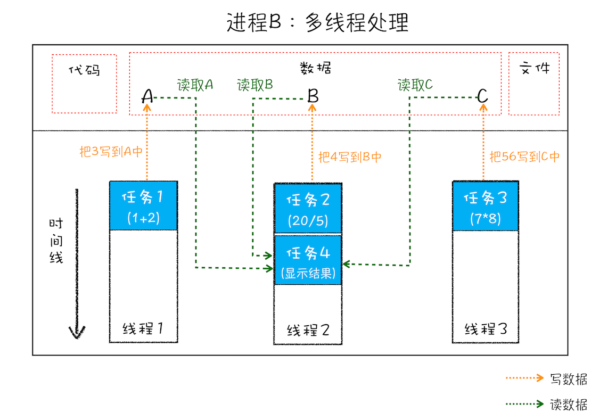

# why

## 1. 具备评估项目可行性的能力——技术选型

## 2. 从更高的维度审视页面——web页面性能的提升

* 当用户请求一个网站时，如果在 1 秒内看不到关键内容，用户会产生任务被中断的感觉。——首屏渲染
* 当用户点击某些按钮时，如果 100ms 内无法响应，用户会感受到延迟。——action 响应，包括异步请求
* 如果 Web 中的动画没有达到 60fps，用户会感受到动画的卡顿。——动画

# Chrome 架构

## 1. 打开一个页面为什么有4个进程

* 一切都源于 Chrome 推出的 多进程 架构

  

### 进程和线程补充

* 多线程可以并行处理任务，但是==**线程是不能单独存在的，它是由进程来启动和管理的**==。那什么又是进程呢？——进程启动和管理线程

> **一个进程就是一个程序的运行实例**。详细解释就是，启动一个程序的时候，操作系统会为该程序创建一块内存，用来存放代码、运行中的数据和一个执行任务的主线程，我们把这样的一个运行环境叫**进程**。

一个程序运行实例，（相当于一个 new 创建一块内存），能够存放运行的代码、运行中的数据和执行任务的主线程，这个运行的环境统称进程。

* 如图一个进程下的线程

* 线程是依附于进程的，进程中使用多线程并行处理能提升运算效率

总结：

1. 进程中任意一线程执行出错，都会导致整个进程的崩溃

2. ==线程之间共享进程中的数据==

   

​	从上图可以看出，线程 1、线程 2、线程 3 分别把执行的结果写入 A、B、C 中，然后线程 2 	继续从 A、B、C 中读取数据，用来显示执行结果。

3. 当一个进程关闭之后，操作系统就会回收进程所占用的内存

   当一个进程退出时，操作系统会回收该进程所申请的所有资源；即使其中任意线程因为操作不当导致内存泄漏，当进程退出时，这些内存也会被正确回收。

4. **进程之间的内容相互隔离。**

   进程隔离是为保护操作系统中进程互不干扰的技术，每一个进程只能访问自己占有的数据，也就避免出现进程 A 写入数据到进程 B 的情况。正是因为进程之间的数据是严格隔离的，所以一个进程如果崩溃了，或者挂起了，是不会影响到其他进程的。如果进程之间需要进行数据的通信，这时候，就需要使用用于进程间通信（IPC）的机制了。

### 进程间通信（IPC）

* 进程间通信一般有如下方法

  (1) 半双工Unix管道

  (2) FIFOs(命名管道)

  (3) ==消息队列==

  (4) 信号量

  (5) ==共享内存==

  (6) ==网络Socket==

详细参考：https://www.jianshu.com/p/c1015f5ffa74

## Chrome 多进程架构

目的：稳定性、流畅性和安全性

从图中可以看出，最新的 Chrome 浏览器包括：1 个浏览器（Browser）主进程、1 个 GPU 进程、1 个网络（NetWork）进程、多个渲染进程(一个tab有一个渲染进程，包含关键渲染步骤的管理)和多个插件进程。

* 个人理解：就像时间循环一样，进程和线程都需要启动和管理，知识宿主不一样。

  进程：实例；线程：方法

### 进程详解

* ==浏览器进程==：主要负责解码显示、用户交互、子进程管理，同时提供存储等功能。
* 渲染进程：核心任务是将 HTML、CSS 和 JavaScript 转换为用户可以与之交互的网页，==排版引擎 Blink 和 JavaScript 引擎 V8 都是运行在该进程中==，默认情况下，==Chrome 会为每个 Tab 标签创建一个渲染进程==。出于安全考虑，渲染进程都是运行在沙箱模式下。
  * 排版引擎 blink
  * Javascript 引擎 V8
* GPU  进程：其实，Chrome 刚开始发布的时候是没有 GPU 进程的。而 GPU 的使用初衷是为了实现 3D CSS 的效果，只是随后网页、Chrome 的 UI 界面都选择采用 GPU 来绘制，这使得 GPU 成为浏览器普遍的需求。最后，Chrome 在其多进程架构上也引入了 GPU 进程。
* 网络进程：主要负责页面的网络资源加载，之前是作为一个模块运行在浏览器进程里面的，直至最近才独立出来，成为一个单独的进程。
* 插件进程：主要是负责插件的运行，因==插件易崩溃，所以需要通过插件进程来隔离==，以保证插件进程崩溃不会对浏览器和页面造成影响。

### 小 tips

* 同一站点共享同一个渲染线程

> 是这样的，通常情况下是一个页面使用一个进程，但是，有一种情况，叫"同一站点(same-site)"，具体地讲，我们将“同一站点”定义为根域名（例如，geekbang.org）加上协议（例如，https:// 或者http://），还包含了该根域名下的所有子域名和不同的端口，比如下面这三个：
>
> https://time.geekbang.org
> https://www.geekbang.org
> https://www.geekbang.org:8080
> 都是属于同一站点，因为它们的协议都是https，而根域名也都是geekbang.org。你也许了解同源策略，但是同一站点和同源策略还是存在一些不同地方，在这里你需要了解它们不是同一件事就行了。
>
> Chrome的默认策略是，每个标签对应一个渲染进程。但是如果从一个页面打开了新页面，而新页面和当前页面属于同一站点时，那么新页面会复用父页面的渲染进程。官方把这个默认策略叫process-per-site-instance。
>
> 直白的讲，就是如果几个页面符合同一站点，那么他们将被分配到一个渲染进程里面去。
>
> 所以，这种情况下，一个页面崩溃了，会导致同一站点的页面同时崩溃，因为他们使用了同一个渲染进程。
>
> 为什么要让他们跑在一个进程里面呢？
>
> 因为在一个渲染进程里面，他们就会共享JS的执行环境，也就是说A页面可以直接在B页面中执行脚本。因为是同一家的站点，所以是有这个需求的。

### 目前的问题

不过凡事都有两面性，虽然多进程模型提升了浏览器的稳定性、流畅性和安全性，但同样不可避免地带来了一些问题：

- **更高的资源占用**。因为每个进程都会包含公共基础结构的副本（如 JavaScript 运行环境），这就意味着浏览器会消耗更多的内存资源。
- **更复杂的体系架构**。浏览器各模块之间耦合性高、扩展性差等问题，会导致现在的架构已经很难适应新的需求了。

### QA

* 打开浏览器两个tab有几个进程

  > 1:==如果页面里有iframe的话，iframe也会运行在单独的进程中！(单独新开一个进程，可以用做页面优化)==
  > 2:如果页面里有插件，同样插件也需要开启一个单独的进程！
  > 3:如果你装了扩展的话，扩展也会占用进程
  > 4:如果2个页面属于同一站点的话，并且从a页面中打开的b页面，那么他们会公用一个渲染进程
  >
  > 这些进程都可以通过chrome的任务管理器来查看。

  * iframe 也会新开一个进程，能作为一个优化的手段

# TCP 协议再谈

> 在衡量 Web 页面性能的时候有一个重要的指标叫“**FP（First Paint）**”，是**指从页面加载到首次开始绘制的时长**。这个指标直接影响了用户的跳出率，更快的页面响应意味着更多的 PV、更高的参与度，以及更高的转化率。那什么影响 FP 指标呢？其中一个重要的因素是**网络加载速度**。

* 从首屏加载时长引出网络加载速度

## 数据包的完整旅程

> **互联网，实际上是一套理念和协议组成的体系架构**。

### 1. IP:  把数据包送达目的主机——贴上地址条

> ==数据包要在互联网上进行传输，就要符合**网际协议**（Internet Protocol，简称**IP**）标准==。互联网上不同的在线设备都有唯一的地址，地址只是一个数字，这和大部分家庭收件地址类似，你只需要知道一个家庭的具体地址，就可以往这个地址发送包裹，这样物流系统就能把物品送到目的地。

**计算机的地址就称为 IP 地址，访问任何网站实际上只是你的计算机向另外一台计算机请求信息。**

#### ip 头

> 如果要想把一个数据包从主机 A 发送给主机 B，那么在传输之前，数据包上会被附加上主机 B 的 IP 地址信息，这样在传输过程中才能正确寻址。额外地，数据包上还会附加上主机 A 本身的 IP 地址，有了这些信息主机 B 才可以回复信息给主机 A。这些附加的信息会被装进一个叫 IP 头的数据结构里。IP 头是 IP 数据包开头的信息，包含 IP 版本、源 IP 地址、目标 IP 地址、生存时间等信息。

