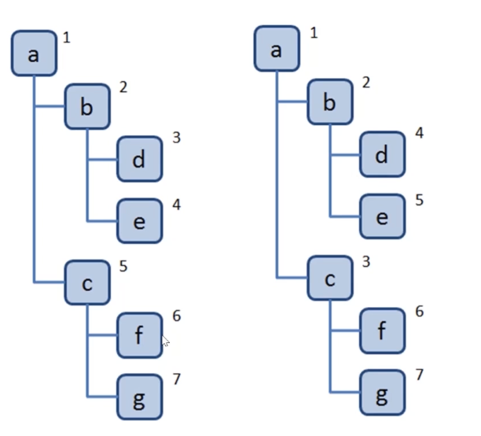
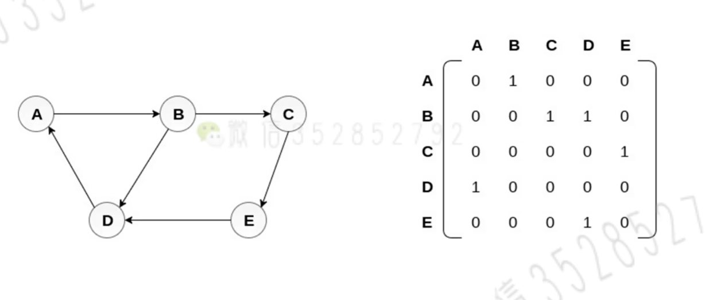
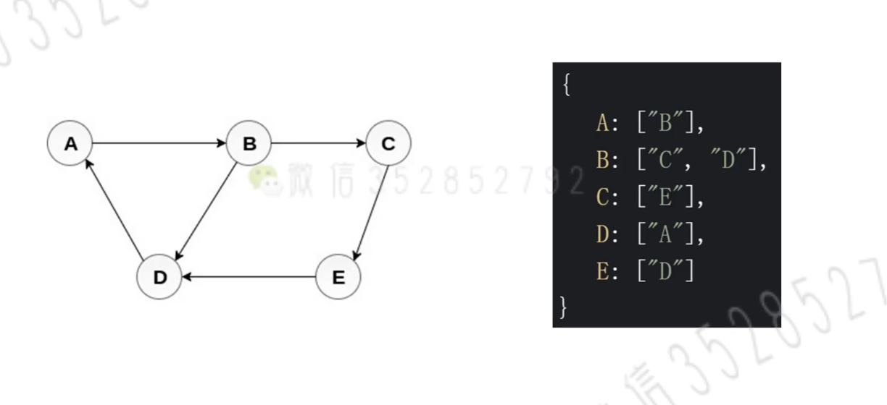
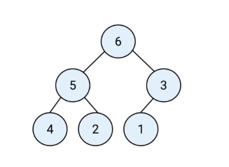
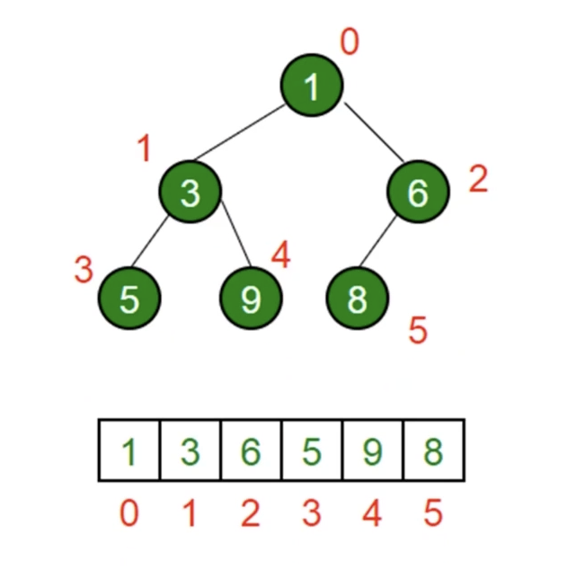
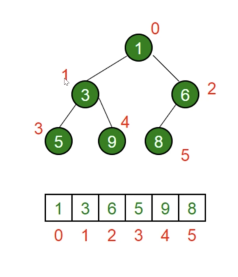

# 复杂度

* o 是量级

  空间复杂度，时间复杂度

* o(n)、o(n^2)

  o(n) 线性增长，可以接受。o(n^2) 复杂度较高，不能接受


# 数据结构

* 都是为了解决实际的问题。

## 1. 数组

* 普通语言的数组不能存放不同的数据类型，因此所有在封装通常存放在数据的是Object 类型，方便扩展

* 常见语言数组容量不会自动改变（需要申请一个更大容量的数组来扩容）

* 常见语言的数组进行中间插入和删除操作性能比较低

  因为数组结构是线性的，存储空间是连续的，操作一个需要移动剩余元素的位置，性能较低。

数组的优势：

* index 数组的索引，查找的性能很高

## 2. 栈（stack）

* 数组能够在任意位置插入和删除数据，有些时候我们为了实现某些功能必须对这种任意性加以限制
* 栈和队列就是常见的受限的线性结构

### 递归和函数调用栈

* 使用递归之后，函数调用栈的空间复杂度就不是 O(1)，而是需要乘一个调用函数的次数。

### 2.1 特点

* ==后进先出（LIFO）==
  其限制的是只能在表的一端进行插入和删除运算，这一端被称为栈顶，相对的，另一端被称作栈底。
* 受限的数据结构，只能在栈顶操作数据

### 2.2 应用场景

* 十进制转二进制，判断字符串的括号是否有效，函数调用堆栈

## 3. 队列（queue）

* 受限的数据结构，先进先出，表的前端进行删除，表的后端进行插入
* 先进先出

### 3.2 应用场景

* 所有需要先进先出的场景
* 例子：食堂排队打饭，js 异步中的任务队列，计算最近请求次数。（面对那些无法同时处理的场景，采用队列这种数据结构。）
* 计算最近请求次数

## 4. 链表

* 多个元素组成


### 总结

* 链表操作一定要新建一个指针，然后去遍历

### 前端和链表

* 原型链

## 5. 集合

* 集合是一组==无序且唯一==的数据结构
* Es6 中 Set

### 应用场景

* 数组去重、判断某元素是否在集合中、就集合交集

## 6. 字典

* 与集合类似，字典也是一种存储唯一值的数据结构，但他是以键值对的形式来存储。
* se6 中添加了字典，Map

## 7. 树

* 一种分层数据的抽象模型。

* 前端工作中常见的树：DOM 树，级联选择，树形控件...

* js 中没有树，可以使用 Object 和Array 构建树

  用 Object 创建的链式对象不算数，因为是一个节点，算链表
  
* ==自我总结==：树的算法都是先产生算法，然后才会产生遍历顺序。而且算法都是递归，因此只要记住递归即可实现树的算法。

### 什么是深度/广度优先遍历（递归&队列）

* 深度优先遍历：尽可能深的搜索树的分支
* 广度优先遍历：先访问离根节点最近的节点。

如图：



### 深度优先遍历算法口诀（dfs）

* 访问根节点
* 对根节点的 children 挨个进行深度优先遍历

### 广度优先遍历算法口诀(bfs)

* 新建一个队列，把根节点入队
* 把队头出队并访问
* 把队头的 children 挨个入队
* 重复 二三步骤，直到队列为空 

### 二叉树

* 树中每个节点最多只能有两个子节点
* js 中通常使用 Object 来模拟二叉树

#### 先序遍历

* 算法口诀
  * 访问根节点
  * 对根节点的左子树进行先序遍历
  * 对根节点的右子树进行先序遍历

#### 中序遍历

* 对根节点的左子树进行中序遍历
* 访问根节点
* 对根节点的右子树进行中序遍历

#### 后序遍历算法口诀

* 对根节点的左子树进行后序遍历
* 对根节点的右子树进行后序遍历
* 访问根节点

#### 三种遍历非递归版

### 前端与树：遍历 JSON 的所有节点值

* 深度优先遍历

## 8. 图

* 图是网络结构的抽象模型，是一组由边连接的节点

* js 中没有图，但是可以用 Object 和 Array 构建图
* 图的表示法：邻接矩阵、邻接表、关联矩阵......

### 图的表示法：邻接矩阵



### 图的表示法：邻接表



* 不一定要是数组，链表也行。只要能描述清楚指向关系即可。

### 常用操作

* 深度优先遍历
  * 访问根节点
  * 对根节点的==没有访问过的相邻节点==挨个进行深度优先遍历
* 广度优先遍历
  * 新建一个队列，把根节点入队
  * 把队头出队并访问
  * 把对队头的没访问过的相邻节点入队

## 9. 堆

* 堆是一种特殊的完全二叉树

* 所有的节点都大于等于（最大堆）或小于等于（最小堆）它的子节点。`6>5>4>2`

  如图完全二叉树，子节点填满。如果未填满，则缺少右边的节点。只能在最后一层缺少

  

* JS 中通常用数组表示堆，如下图

  

* 左侧子节点的位置是 `2*index+1`

* 右侧子节点的位置是 `2*index+2`

* 父节点位置`(index - 1) / 2`。只求商



### 应用

* 堆能高效、快速的找出最大值和最小值，时间复杂度：O(1)
* 找出第 K 个最大（小）元素

#### 找出第 K 个最大元素

* 构建一个最小堆，并将元素依次插入堆中
* 当堆的容量超过K，就删除堆顶
* 插入结束后，堆顶就是第 K 个最大元素。为啥是堆顶呢，因为小的值有可能在 子节点的左边，也有可能右边！

### 构建一个最小堆类

#### 插入

* 将值插入堆的底部，即数组的尾部
* 然后上移：将这个值和它的父节点进行交换，知道父节点小于等于这个插入的值
* 大小为 K 的堆中插入元素的时间复杂度是 O(logK)

> 树高度 h 和节点数量 K 之间的关系是 h = log K。
>
> 2 + 2 ^2 + ... + 2^h = K
>
> 因为每次添加前边的都是有序的，所以一个新加入的数据，最多上移的高度就是 当前的高度。整个插入上移的高度就是 h 的前 n 项和 `h + h-1 + h -2 + ... + 1` 一次上移的时间复杂度就是 O(logK)。
>
> ==后 n-k 个元素的移动都是 logK==

#### 删除堆顶

* 用数组尾部元素替换堆顶（直接删除堆顶会破坏堆结构）
* 然后下移：将新堆顶和它的子节点进行交换，直到子节点大于等于这个新堆顶
* 大小为 K 的堆中删除堆顶的时间复杂度为 O(logK)。主要是下移操作

#### 获取堆顶和堆的大小

* 堆顶数组的第一项
* 堆的大小，数组的长度


# 排序和搜索

* 排序：把某个乱序的数组变为升序或者降序
* 搜索：找出数组中某个元素的下标

## js 中的排序和搜索

* sort 
* indexOf、find、findIndex

## js 实现：冒泡排序

* 比较相邻的两个元素，如果第一个比第二个大，则交换他们
* 一轮下来，可以保证最后一个数是最大的
* 执行n轮，这就是最外层的循环。

所有排序的动画演示：https://visualgo.net/zh/sorting


## js 实现：选择排序

* 选出最小的一个一个放
* 需要执行n-1轮


## js实现插入排序

* 从第二个数开始往前比
* 比它大就往后排
* 以此类推进行到最后一个

思路：

* 单拎出一个作为临时变量，用来对比。
* 比我大移动到右边，当前值不动。直到不需要移动的时候，直接把临时值赋给他

精髓：

拿出一个值往前对比，直到找到他的合适位置。最后一个往合适位置插入。


## 搜索

### 1. 顺序搜索

### 2. 二分搜索

* 前提是数组有序

解题：

* 需要定义开始和结束区间索引
* *二分法采用左右指针的算法*


## js 实现归并排序

> 火狐浏览器中的 sort 方法就是归并排序

* 分：把数组劈成两半，再递归对子数组进行”分“操作，直至分成一个个单独的数
* 合：把两个数合并为有序数组，再对有序数组进行合并，直至全部子数组合并为一个完整的数组。

### 方法

* 新建一个空数组 res，用于存放最终排序后的数组
* 比较两个有序数组的头部，较小者出队并推入 res 中
* 如果两个数组还有值，就重复第二步

## js 实现快速排序

* 分区：从数组中任意选择一个基准，所有比基准小的元素放到基准的前面


# 分而治之

* 分而治之是算法设计中的一种方法。
* 它将一个问题==分==成多个和原问题相似的小问题，==递归解决==小问题，再将结果==合==并以解决原来的问题。

## 1. 归并排序

* 分
* 解：递归地对两个子数组进行归并排序
* 合：合并有序子数组

## 2. 快速排序

* 分：选基准，分为两个数组
* 解：递归地对两个子数组进行快速的递归排序
* 合：对两个子数组进行合并

## 总结

* 就是利用递归，拆分之后不断的执行
* *分而治之每次都要返回一个数据，方便上一个调用使用，然后写一个递归的出口*。小的单元执行完的结果一定要返回去给大的单元执行。

? 差2题


# 动态规划

* 动态规划是算法设计中的一种方法
* 它将一个问题分解为==相互重叠==的子问题，通过反复求解子问题，来解决原来的问题。分而治之是相互独立的子问题。

例子：斐波那契数列

`F(n) = F(n-1) + F(n-2)`

方法：

* 需要写出一个 n 依赖前边结果的公式。定义子问题
* 反复执行


# 贪心算法

* 贪心算法是算法设计中的一种方法
* 期盼通过每个阶段的局部最优选择，从而达到全局的最优
* 结果并不一定是最优

举例：

* 零钱兑换


# 回溯算法

* 回溯算法是算法设计中的一种方法
* 回溯算法是一种渐进式寻找并构建问题解决方式的策略。
* 回溯算法会先从一个可能的动作开始解决问题，如果不行，就回溯并选择另一个动作，直到将问题解决。

## 什么问题适合使用回溯算法解决

* 有很多路
* 这些路，有死路，也有出路
* 通常需要==递归==来模拟所有的路

有点像老虎机。属于一种暴力解决问题。

## 什么问题

* 全排列

  输出 `[1,2,3]` 所有的排列组合

## 解题方法

* 递归模拟出所有的情况。==分为选择路径和选择列表==
* 保证接的数字都是后面的数字
* 收集所有到达递归终点的情况，并返回

https://zhuanlan.zhihu.com/p/93530380

```text
for 选择 in 选择列表:
    # 做选择
    将该选择从选择列表移除
    路径.add(选择)
    backtrack(路径（新的路径，不要影响原来的路径，引用值）, 选择列表)
    # 撤销选择
    路径.remove(选择)
    将该选择再加入选择列表
```

* 注意：路径先添加再删除，会改变原来的数组，建议使用 `concat` 方法，直接把新的数组作为参数传递到递归方法中。


# 算法

## 1. 大O 表示法

* 公司分为小中大公司规模，大概描述
* 在算法中可以用类似的快捷方式来描述计算机算法的效率
* 在计算机中这种粗略的度量被称为“大O”表示法
* 在算法比较过程中，我们可能会说A的算法比B快两倍，但是这样的比较有时候没有意义
* 在数据项个数发生变化时，算法效率会跟着发生变化
* 所以我们通常使用一种算法的速度会如何跟随着数据量的变化的（跟随数据量变化）

## 2. 常见的大O表示形式

| 符号 | 名称   |描述|
| ---- | ------ |----|
| O(1) | 常数的 |算法不会随着数据项的变化而变化|
| O(log(n)) |对数的|二分法效率较高（100万查找，大约20次）|
|O(n)|线性的||
|O(nlog(n))|线性和对数乘积|快速排序|
|O(n2)|平方|冒泡、插入|
|O(2n)|指数的||

* 描述的随着数据量的变化的变化曲线，O(log(n))几乎重叠，并不是完全准确，需要变化的来获取复杂度


* 大O表示法的推导公式，比如2N2+3n+1
  1. 用常量1取代运行时间中所有的加法常量；比如 + 76 用 O(1)取代
  2. 在修改后的运算函数中，只保留最高阶项；`2n2+3n+1`只保留 O(2n2)
  3. 如果最高存在且不为1，则去除这个项相乘的常数; `2n2` 2不为1，可以去除

## 3.排序算法

* 排序算法有很多：冒泡、选择、插入排序、归并排序、计数排序（counting sort）、基数排序(radix sort)、希尔排序、堆排序、桶排序、快速排序
* 简单排序：冒泡、选择排序、插入排序
* 高级排序：希尔排序、快速排序（笔试题推荐、最快）

### 3.1 冒泡（比较+交换）

* 冒泡排序 比较次数 (N-1)+(N-2)+...+1 = N*(N-1)/2  O(n2)

* 交换次数：N*(N-1)/4  O(n2)，估算每两次需要比较一次

  前一个后一个对别交换（这是核心！！！！）

## 3.2 选择排序

* 选择最小的放到前边
* 比较次数 O(n2)
* 交换次数 O(n)

## 3.3 插入排序

* 简单排序中效率最高的，
* 局部有序
* 最坏复杂度比较次数： n*(n-1)/2  平均除2  n*(n-1)/4  O(n2)
* 交换次数： 最差 n(n-1)/2，平均 n(n-1)/4


// 插入排序，默认前边的有顺序

```js
function sort (arr) {
    for(var i=0;i<arr.length;++i) {
        let j = i
        let temp 
        // 默认前边的有顺序，直接拿新进来的去插入
        while (j>=0 && arr[j-1] >arr[j]) {
            temp = arr[j]
            arr[j] = arr[j-1]
            arr[j-1] = temp
            j--
        }
    }
    return arr
}

console.log(sort([2,1,7,2,4,6,3,1]))
```


## 3.4 希尔排序

* 以前认为排序无法超越 O(n2),知道希尔排序出现。
* 


## 快速排序

* 选一个数字左右划分，分而治之，递归实现

1. 枢纽的选择，第一个中间数，一旦选定，位置不变

```jsx
let arr = []

function quickSort () {
    quick(0, arr.length-1)
}

function quick (left, right) { 
    if (left >= right-1) {
        return
    }
    let pivot = findPivot(left, right)
    let i = left
    let j = right - 1
    while(true) {
        while(arr[++i] < pivot) {}
        while(arr[--j] > pivot) {}
        if (i < j) {
            swap(i, j)
        } else {
            break
        }
    }
    swap(i, right - 1)
    quick(left, i-1)
    quick(i+1, right)
}

function swap (i, j) {
    let temp = arr[i]
    arr[i] = arr[j]
    arr[j] = temp
}

function findPivot (i, j) {
    let x = Math.floor((i + j)/2)
    if (arr[i] > arr[x]) {
        swap(i, x)
    }
    if (arr[x] > arr[j]) {
        swap(x, j)
    }
    if (arr[i] > arr[x]) {
        swap(i, x)
    }
    swap(x, j-1)
    return arr[j-1]
}
arr = [6,3,2,9,1,50,0,119,20,118]
quickSort()
console.log(arr)

```

`log2(N)` 是二分法的复杂度，`n(1/2k)=1` ,k = log2(n)


# leetcode 刷题

* 查看参数和return 注释怎么写
* js 中构造函数怎么写
* 链表输入都是 `[1, 2]`数组输入的形式

## 20. 有效的括号

* 一前一后，查找，就是栈的结构。后入先出。

## 933 最近的请求次数

* js 中类的基础数据绑定在 function 内的 this 上，能够确保实例出来的对象都是使用同一个数据
* js 中的方法一般都绑定在 prototype 上
* 先入先出的概念，使用队列这种数据结构去描述

## 237. [删除链表中的节点](https://leetcode-cn.com/problems/delete-node-in-a-linked-list/)

## 206. 反转链表

* 快慢指针法，每次都走一格，交换

## 2. 两数相加


## 83.


## 根据路径（数组）遍历 json

## 349 两个数组交集

* 用集合和字典分别做

## 1. 两数之和

* 关键词唯一性
* 没有找到就先登记，然后查找

## 3. 无重复字符的最长子串

* 双指针滑动窗口

## 76. 最小覆盖子串

## 65. 有效数字

## 215. 数组中的第K个最大元素

* 看到 第 K 个最大元素
* 考虑使用最小堆

## 347. 前 K 个高频元素

## 23. 合并K个排序链表

## 21. 合并两个有序链表

## 374. 猜数字大小

1. 二分搜索

2. 分而治之

   递归

## 226. 翻转二叉树

## 70. 爬楼梯

## 198. 打家劫舍

## 455. 分饼干

## 122. 买卖股票的最佳时机

## 46. 全排列

## 78 子集


# 总结方法

## 1. 队列的使用

* 所有的先入先出，有序的，控制出队条件的，就应该使用队列这种数据结构。

## 2. 递归和while 的使用

* 如果出现自己想调用自己的情况，可以使用递归；如果出现递归的方法中要使用一个共同的变量（所有递归函数都要使用），可以考虑使用 while 循环，创造一个自己调用自己的封闭区域。
* ==while 能够适用于线性数据结构遍历，不适合分叉的数据结构。递归更适合分叉的数据结构==

