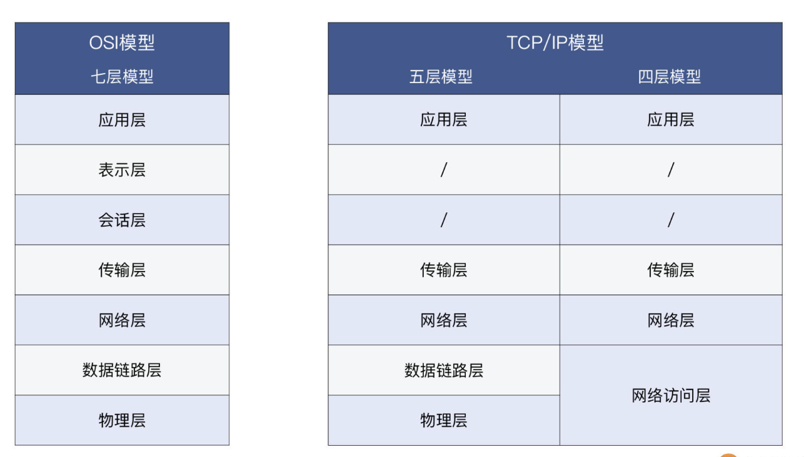
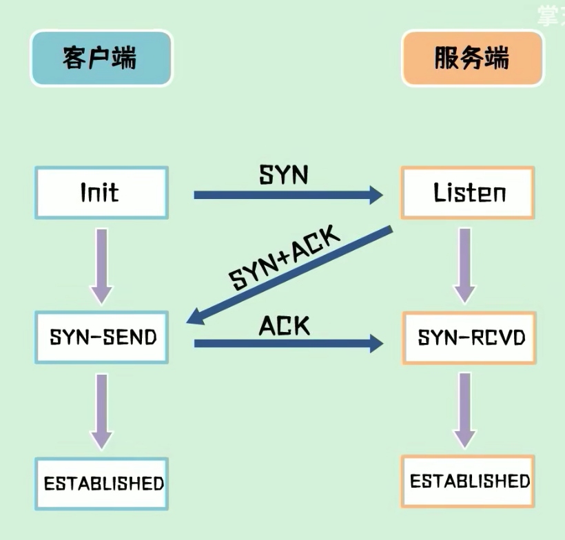
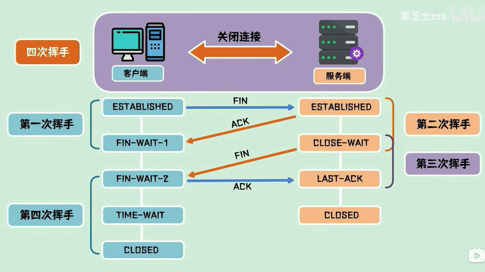
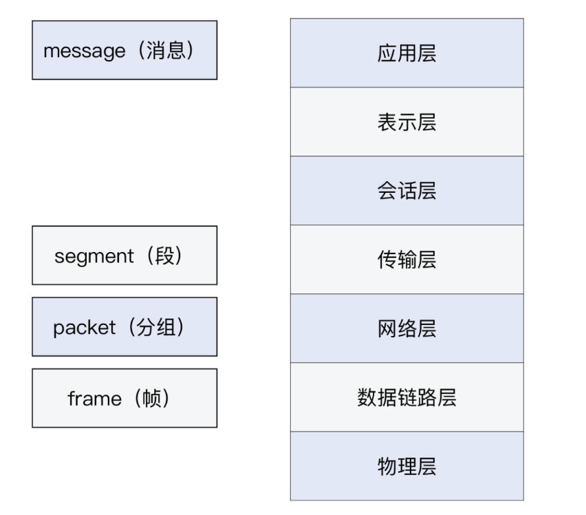
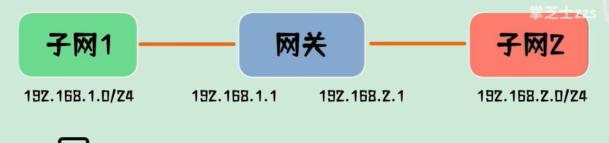
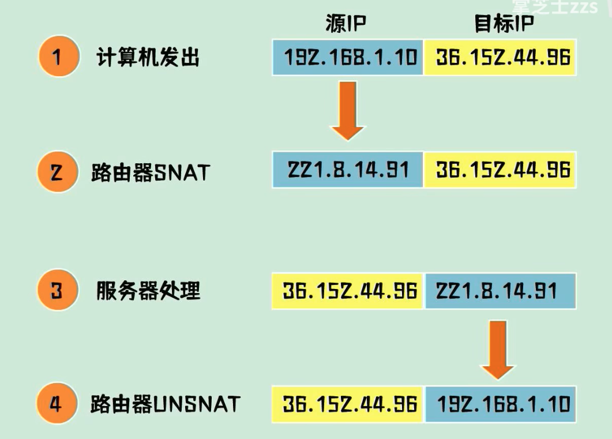
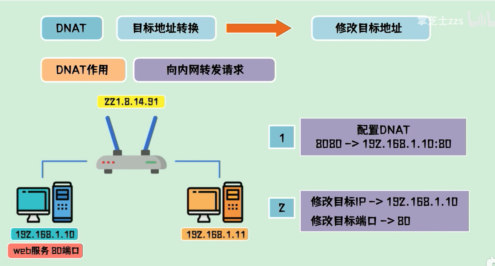

# 协议和分层

https://zhuanlan.zhihu.com/p/141396896

* todo

## 为什么要分层

- 简化问题难度和复杂度。由于各层之间独立，我们可以分割大问题为小问题。
- 灵活性好。当其中一层的技术变化时，只要层间接口关系保持不变，其他层不受影响。
- 易于实现和维护。
- 促进标准化工作。分开后，每层功能可以相对简单地被描述。

也就是符合单一原则

分层的缺点：

功能可能出现在多个层里，产生了额外开销。

### 和编程语言对比

* 分层的概念特别像编程语言的封装，在编程中，我们需要把一些逻辑抽象为函数或者对象，以实现更好的解耦和复用。

## 分层

OSI 的七层协议体系结构的概念清楚，理论也较完整，但它既复杂又不实用，TCP/IP 体系结构则不同，但它现在却得到了非常广泛的应用。TCP/IP 是一个四层体系结构，它包含应用层，运输层，网际层和网络接口层（用网际层这个名字是强调这一层是为了解决不同网络的互连问题），不过从实质上讲，TCP/IP 只有最上面的三层，因为最下面的网络接口层并没有什么具体内容，因此在学习计算机网络的原理时往往采用折中的办法，即综合 OSI 和 TCP/IP 的优点，采用一种只有五层协议的体系结构，这样既简洁又能将概念阐述清楚，有时为了方便，也可把最底下两层称为网络接口层。

**四层协议，五层协议和七层协议的关系如下：**

- TCP/IP是一个四层的体系结构，主要包括：应用层、运输层、网际层和网络接口层。
- 五层协议的体系结构主要包括：应用层、运输层、网络层，数据链路层和物理层。
- OSI七层协议模型主要包括是：应用层（Application）、表示层（Presentation）、会话层（Session）、运输层（Transport）、网络层（Network）、数据链路层（Data Link）、物理层（Physical）。

注：五层协议的体系结构只是为了介绍网络原理而设计的，实际应用还是 TCP/IP 四层体系结构。

* https://zhuanlan.zhihu.com/p/141396896

### **OSI 的七层模型**，和 **TCP/IP 的四层 / 五层模型**



* 如上：OSI模型和 tcp/ip 四层/五层 模型主要的区别是应用层的。OSI 细分为 应用层、表示层、会话层。

### 哪种分层更好？

参考：极客时间——网络排查案例

* 不必纠结这个问题，tcp/ip 分层为了简化复杂度，降低理解成本出现的。但是有一些场景必须使用 OSI 分层来理解。

  > 比如，TLS 虽然在 TCP 之上，按 TCP/IP 模型就要被归入应用层。但事实上，在 HTTPS 的场景下，HTTP 协议就是运行在 TLS 协议之上的，那么是不是把 HTTP 和 TLS 分到不同的层次更合适呢？正好在七层模型里，第五层和第六层，可以分别代表 TLS 的会话保持功能和数据加解密这种表示层的功能。

  TLS 在TCP之上，http协议又是在 TLS 协议之上的，那么TLS 不能笼统的被归于应用层，反而OSI七层模型中的表示层和会话层能够更精确的表达它的作用。

## tcp/ip协议簇

协议列表：https://baike.baidu.com/item/TCP%2FIP%E5%8D%8F%E8%AE%AE%E7%B0%87?fromModule=lemma_inlink

推荐阅读：太厉害了，终于有人能把TCP/IP 协议讲的明明白白了 - iOSer的文章 - 知乎 https://zhuanlan.zhihu.com/p/147370653

### 应用层

常用协议

* DNS
* http
* SMTP 邮件协议：Simple Mail Transfer Protocol
* DHCP 运行中UDP基础上

### 传输层

* tcp
* UDP

### 网络层

网络层的任务就是选择合适的网间路由和交换结点，确保计算机通信的数据及时传送。在发送数据时，网络层把运输层产生的报文段或用户数据报封装成分组和包进行传送。在 TCP/IP 体系结构中，由于网络层使用 IP 协议，因此分组也叫 IP 数据报 ，简称数据报。

互联网是由大量的异构（heterogeneous）网络通过路由器（router）相互连接起来的。互联网使用的网络层协议是无连接的网际协议（Intert Prococol）和许多路由选择协议，因此互联网的网络层也叫做网际层或 IP 层。

* 大量异构的网络通过路由连接起来的

### 数据链路层


在两个相邻节点之间传送数据时，数据链路层将网络层交下来的 IP 数据报组装成帧，在两个相邻节点间的链路上传送帧。每一帧包括数据和必要的控制信息（如同步信息，地址信息，差错控制等）。

在接收数据时，控制信息使接收端能够知道一个帧从哪个比特开始和到哪个比特结束。

* ==主要是加了以太网首部==。上层的协议都加了标记，那么数据链路层，主要的目的就是分包，怎么样把数据流拆分成单个包，那就加上以太网首部。

> 发送端在层与层之间传输数据时，每经过一层时会被打上一个该层所属的首部信息。反之，接收端在层与层之间传输数据时，每经过一层时会把对应的首部信息去除。

### 物理层

在物理层上所传送的数据单位是比特。 物理层([physical layer](https://www.zhihu.com/search?q=physical layer&search_source=Entity&hybrid_search_source=Entity&hybrid_search_extra={"sourceType"%3A"article"%2C"sourceId"%3A"141396896"}))的作用是实现相邻计算机节点之间比特流的透明传送，尽可能屏蔽掉具体传输介质和物理设备的差异。使其上面的数据链路层不必考虑网络的具体传输介质是什么。“透明传送比特流”表示经实际电路传送后的比特流没有发生变化，对传送的比特流来说，这个电路好像是看不见的。

* 物理层主要是为了数据链路层看起来是透明的，抹平不同硬件设备的差异，把各个网络设备连接起来，让其可以传输0、1电信号

## 各层协议


## 各层的排查工具

每个层级的排查工具，用大白话说就是：“这可是我们吃饭的家伙儿”。

### 应用层

应用层以 HTTP 为例，可以用**浏览器开发者工具**，实现远程 IP 识别、耗时分析、Cookie 删除等需求。

* 查看远程IP，是确认当前这次连接的IP（因为CDN的存在，连接可能不是唯一的）

#### nslookup

查找IP

```shell
nslookup www.baidu.com
```

#### curl

curl 命令能够模拟客户端的请求，100%完全还原出错场景。

其他的一些用法：

查看本机IP

```shell
curl ipinfo.io

# 中文查看
curl cip.cc
```

### 传输层

传输层主要是携带了端口信息，那么一般就是针对端口做排除

#### telnet —— 客户端使用

客户端使用，来判断服务端的连接

使用：
```shell
telnet www.baidu.com 443
```

#### netstat —— 服务端使用

* 一般用在服务端，用来查看服务端的端口使用情况

https://juejin.cn/post/6923824434578997255

### 网络层

在这一层，除了可以直接用 ping 这个非常简便的工具以外，你还应该掌握另外两个命令，它们能提供更为强大的排查能力，它们就是 **traceroute 和 mtr**。

一般情况下先 ping 一下，如果没有通，那么就是网络问题了。

* 注意：网络层的工具都是不需要加端口的，因为它们不在乎端口

#### ping 命令

```shell
ping -c 4 www.baidu.com
# 发送4个包查看情况
```

响应如下：

包含送达率、丢失率、平均、最大、最小、稳定的响应时长

```tex
--- baidu.com ping statistics ---
4 packets transmitted, 4 packets received, 0.0% packet loss
round-trip min/avg/max/stddev = 12.946/14.807/19.826/2.900 ms
```

总览的看下网络是否联通，包含响应时长。如果怀疑有问题可以继续使用 traceroute 进一步排查。

##### 检测本机网络配置是否正确——测试网卡是否正常

可以使用回环测试

```bash
ping 127.0.0.1
```

#### traceroute

主要用于检测经过了多少个路由或者网关，看看哪个网关出问题了。包括相应时长、是否响应等信息。

使用：

```shell
traceroute  www.baidu.com -I
```

* 加上 **-I** 参数（I 代表 ICMP），就不会出现星号了

> 背后的原理，就是 traceroute 默认是用 UDP 作为探测协议的，但是很多网络设备并不会对 UDP 作出回应。所以我们改成 ICMP 协议做探测后，网络设备就有回应了。其实，Windows 上的 tracert，就是默认用 ICMP，这一点跟 Linux 正好是反过来的。两个操作系统，真是“相爱相杀”啊。

原理参考：https://juejin.cn/post/6910183724944457741

不足：**它不能对这个路径做连续多次的探测**。

#### mtr

> 于是，mtr 出现了，它可以说是 traceroute 的超集，除了 traceroute 的功能，还能实现丰富的探测报告。尤其是它对每一跳的丢包率的百分比，是用来定位路径中节点问题的重要指标。所以，当你在遇到**“连接状况时好时坏的问题”**的时候，单纯用一次性的 traceroute 恐怕难以看清楚，那就可以用 mtr，来获取更加全面和动态的链路状态信息了。

* traceroute 的超集，丰富的探测报告。

使用：

```shell
mtr www.baidu.com -r -c 10
```

总结：
使用 telnet 查看传输层是否有问题；然后使用 traceroute 查看网络层是否有问题。

#### 查看路由

netstat -r

### 数据链路层和物理层

这一层离应用层已经很远了，一般来说是专职的网络团队在负责。如果这一层有问题，就会直接体现在网络层表现上面，比如 IP 会有丢包和延迟等现象，然后会引发传输层异常（如丢包、乱序、重传等）。所以，**一个稳定的数据链路层乃至物理层，是网络可靠性的基石。**


# tcp协议

## 简介

面向连接的。目的就是在不可靠的网络环境中，建立可靠的连接。

### 与 udp 区别

想象一下人与人的通信方式

1. 写信，不知道是否送达，内容是否完整，顺序是否正确。udp
2. Tcp 电话：经历了电话连接，互通电话，结束挂断。能够确保对方准确收到

## 如何保证其可靠性的

### 1. 三次握手

建立链接的过程



1. 客户端向服务端发送 syn 包。先发一包连接请求数据，询问一下能否建立链接
2. 如果同意则回复一包 syn + ack 包
3. 客户端收到之后回复一包ack包。连接建立

发送了三包数据，称为三次握手。

#### 为什么不能两次握手

* 为了防止已失效的请求报文忽然又传到服务器引起错误。

  说白了就是避免客户端和服务端的状态对不上，客户端发送了两次连接请求，有一次失效，为了建立链接，客户端会重新发送 syn包，这次请求正常送达。如果第一次滞留的包后面又送达，服务端就会进入数据请求等待。服务端认为是两次连接，客户端任务是一次链接，造成了状态不一致。

  如果是三次握手，服务端收不到ack包就不会认为连接建立。说白了就是客户端可以重新发起多次请求连接的syc包，但是服务端要确实是哪一次成功链接了。

==三次握手本质上就是为了解决网络信道不可靠的问题==。这也是tcp的本质！！

* 为了在不可靠的信道上建立可靠的链接，三次握手之后客户端和服务端都进入了数据传输阶段。

### 2. 传输确认

一问一答的方式。

* 为了建立一个可靠的连接，需要考虑几个问题

  一包数据有可能会被拆成多包发送

  1. 丢包问题；
  2. 多个包乱序问题

* tcp 协议为每一个连接建立了一个发送缓存区，从建立连接后的第一个序列化为0，后面的每个字节的序列号都会增加1。发送数据时，从发送缓存区取一部分数据组成发送报文。

  发送缓存区： 0 1 2 3 ... n

  发送报文：序列号 长度 数据内容

* 接受端在收到数据后，需要回复确认报文

  确认报文中的ack， ack = 序列化 + 长度，刚好对应下一次报的起始序列号

* 重传机制：发送端切割发送，服务端根据序列号和长度重组，假设丢失了某些数据，接受端可以要求发送端重传，只需要重新返回一个 ack （也就是数组的起始序列号）即可。

这样一问一达的发送方式，能够确保发送端确认发送的数据已经被对方收到。很像是数组的索引。

发送端也可以一次性发送连续的多包数据，接受端只需要回复一次 ack 就可以。

> TCP 的传输可靠性是通过序列号、确认号、重传机制等来保证的

* 序列化、确认号、重传机制

### 3. 四次挥手

处于连接状态的客户端和服务端都可以发起关闭连接请求。此时需要四次挥手来进行连接关闭。四次挥手的目的也是为了建立可靠链接，确保断开连接成功。



1. 比如客户端主动发起断开连接请求，需要向服务端发送起一包 fin 包，表示要关闭连接，然后自己进入终止等待1状态（FIN-WAIT-1），这是第一次挥手

2. 服务端收到 FIN 包，然后发送一包 ACK 包，表示自己进入关闭等待状态（CLOSE-WAIT）。 第二次挥手

   客户端收到 ack 包之后，进入 终止等待2状态 （FIN-WAIT-2）。

   此时服务端还可以发送未发送的数据，客户端还可以接受数据。

3. 待服务端发送完数据后，发送一个 FIN 包进入最后确认状态。 第三次挥手

4. 客户端收到 FIN 包之后，回复 ACK 包，进入超时等待状态，经过超时之后关闭连接。服务端收到 ACK 包之后立即关闭连接。 这是第四次挥手

#### 为什么需要超时等待阶段

* 客户端在发送 ACK 包之后，如果ack包在网络中丢失，则服务端会一直处理最后确认状态。一段时间后，会重新发送 FIN 包进行确认，客户端在收到 FIN 包之后，重新发送 ACK 包，并刷新超时时间。

  这个机制也是为了确保在不可靠的网络连接中进行可靠的连接断开确认！

### tcp可靠性——TCP 重传、滑动窗口、流量控制、拥塞控制

* 也就是如上的传输确认阶段。

  所有的策略都是为了可靠性。为了实现可靠性传输，需要考虑很多事情，例如数据的破坏、丢包、重复以及分片顺序混乱等问题。如不能解决这些问题，也就无从谈起可靠传输。

  那么，TCP 是通过序列号、确认应答、重发控制、连接管理以及窗口控制等机制实现可靠性传输的。

> TCP 的传输可靠性是通过序列号、确认号、重传机制等来保证的

### tcp 是一问一答的吗

* 在如何保证其可靠性说明了它是分段传输的，它会新建一个发送缓存区，然后分段去发送。

  准确的说是确认应答的方式，需要响应一个 `ACK包 = 序列号 + 长度`
  
  简单看确实是一问一答的发送方式。

## tcp 流？

> 其实，这里的 TCP 流，就是英文的 TCP Stream。Stream 这个词有“流”的意思，也有“连续的事件”这样一个含义，所以它是有前后、有顺序的，这也正对应了 TCP 的特性。

* 连续的事件，也是js编程中rxjs或者node中stream的含义

> 跟 Stream 相对的一个词是 Datagram，它是指没有前后关系的数据单元，比如 UDP 和 IP 都属于 Datagram。在 Linux 网络编程里面，TCP 对应的 socket 类型是 SOCK_STREAM，而 UDP 对应的，就是 SOCK_DGRAM 了。显然，DGRAM 就是 Datagram 的简写。

* Datagram 就是没有前后关系的数据包

### tcp 流的表达形式

在具体的网络报文层面，一个 TCP 流，对应的就是一个五元组：**传输协议类型、源 IP、源端口、目的 IP、目的端口**。比如，今天你访问了极客时间网站，那么你这次的 TCP 流就可能就是这样一个五元组：

```tex
(TCP, your_ip, your_port, geekbang_ip, 443)
```

* 一个五元数组（也就是五个元素）表示：传输协议类型，源IP、源端口、目的IP、目的端口。

> 一个 IP 报文，包含了所有这五个元素，所以 Wireshark 在解析抓包文件时，自然就能通过五元组知道每个报文所属的 TCP 流了。这也是为什么我们可以在 Wireshark 里，用 Follow TCP Stream 的方法，找到报文所在的 TCP 流。

* IP报文根据上面五个元素进行描述，自然也能通过五元组知道每个报文所述的TCP流。

> 不过有时候，也会有四元组的说法。其实它跟五元组大体上是一致的，只是四元组没有区分传输层协议类型（TCP 或者 UDP）。但是如果我们都清楚地知道应用类型，比如知道应用是 HTTP 协议的，那它的传输层协议默认就是 TCP，这一元是否算在里面，已经不重要了。

## 报文、帧、分组、段、数据包

也就是各个层是怎么样切分数据的

### 报文

**报文（packet）**，是一种相对宽泛和通用的说法，基本上每一层都可以用。比如，在应用层，你可以说“HTTP 报文”；在传输层，你可以说“TCP 报文”；同样的，在网络层，当然就是“IP 报文”了。事实上，网络层也是“报文”一词被使用最多的场景了。**数据包**也是类似的，可以在很多场景下通用。

我们再稍微考究一下语法。packet 这个词的后缀是 et。而在英文中，以 et 结尾的很多词表示某一个小小的东西。比如功能完备的一小段代码，叫 code snippet，一小段内嵌在 HTML 中的 Java 前端代码，叫 applet。自然的，packet 就是一个小的 pack（包裹）。

* 一个通用的说法，可以在每一层使用。

### 帧

**帧（frame）**是二层也就是数据链路层的概念，代表了二层报文，它包含帧头、载荷、帧尾。注意，帧是有尾部的，而其他像 IP、TCP、HTTP 等层级的报文，都没有尾部。我们不可以说“TCP 帧”或者“IP 帧”，虽然也许对方也明白你的意思，但我们都想做得专业一点，不是嘛。这里还有个小知识点：HTTP/2 实现了多路复用，其中也有帧的概念，不过那个帧，跟这里网络二层的帧，除了名称相同以外，就没有别的联系了。

* 主要是数据链路层的概念，还没到网络层
* 需要有帧头和帧尾进行帧的拆分，tcp应该是有报文的长度来控制的。

### 分组

**分组**是 IP 层报文，也就是狭义的 packet。

* IP 层的报文，狭义的 packet。

### 段

**段特指 TCP segment**，也就是 TCP 报文。既然 segment 是“部分”的意思，那这个“整体”又是什么呢？它就是在应用层交付给传输层的消息（message）。当 message 被交付给传输层时，如果这个 message 的原始尺寸，超出了传输层数据单元的限制（比如超出了 TCP 的 MSS），它就会被划分为多个 segment。这个过程就是**分段**（segmentation），也是 TCP 层的一个很重要的职责。、

### 数据报

另外，这里还要提一下，Datagram 的中文叫**“数据报”**，但不是“数据包”。读音类似，但意思并不完全相同。前面说过，“数据包”是一个通用词，所以用“UDP 数据包”指代“UDP 数据报”并没有问题。但反过来，非 UDP 协议的数据包，比如 TCP 段，就不能叫“TCP 数据报”了，因为 TCP 不是 Datagram。




* 各个术语和分层的关系

### 名词和各层关系

> 我们需要知道TCP在网络OSI的七层模型中的第四层——Transport层，IP在第三层——Network层，ARP在第二层——Data Link层，在第二层上的数据，我们叫Frame，在第三层上的数据叫Packet，第四层的数据叫Segment。
>
> https://coolshell.cn/articles/11564.html

* 数据链路层：frame 帧，包含：帧头、载荷、帧尾，帧头和帧尾能够拆分帧

* 网络层：packet

* 传输层：

  tcp: segment，会对应用层的message进行分段，分段控制就是长度

  UDP：数据报 Datagram

* 应用层： message（消息），也可以用报文来形容（广义上的报文）

## TCP 协议详解

https://coolshell.cn/articles/11564.html

> 首先，我们需要知道，我们程序的数据首先会打到TCP的Segment中，然后TCP的Segment会打到IP的Packet中，然后再打到以太网Ethernet的Frame中，传到对端后，各个层解析自己的协议，然后把数据交给更高层的协议处理。

* 每一层都有每一层的拆分规则

### TCP 头格式

在具体的网络报文层面，一个 TCP 流，对应的就是一个五元组：**传输协议类型、源 IP、源端口、目的 IP、目的端口**。

```tex
(TCP, your_ip, your_port, geekbang_ip, 443)
```


几个注意点：

* TCP 不关心IP地址
* 一个TCP连接需要四个元组来表示同一个连接（src_ip、src_port, dst_ip、dst_port） 准确说是五元组，还有一个是协议。（默认TCP）

几个非常重要的东西：

### 几个重要的概念

* sequence number 是包的序列，用来解决网络包乱序（reordering）问题

  > 主要是要初始化Sequence Number 的初始值。通信的双方要互相通知对方自己的初始化的Sequence Number（缩写为ISN：Inital Sequence Number）——所以叫SYN，全称Synchronize Sequence Numbers。

  这也是为啥叫 SYN 包。

* **Acknowledgement Number** 就是ACK——用于确认收到，用来解决不丢包的问题

* **Window又叫Advertised-Window**，也就是著名的滑动窗口（Sliding Window），**用于解决流控的**。

  用来控制流速的

* TCP Flag，也就是包类型，主要是用于操控TCP的状态机的

### TCP 状态机

网络传输是没有连接的，包括TCP也是一样的。

> 而TCP所谓的“连接”，其实只不过是在通讯的双方维护一个“连接状态”，让它看上去好像有连接一样。所以，TCP的状态变换是非常重要的。

### TCP 传输流程


# UDP

速度快，可能丢包。

基于非连接。


# IP 地址

## 简介

https://juejin.cn/post/7064833642849108005

https://juejin.cn/post/6844903798620553229#heading-3

> IP地址是一个32位的二进制数，通常被分割为4个“8位[二进制](https://link.juejin.cn?target=https%3A%2F%2Fbaike.baidu.com%2Fitem%2F%E4%BA%8C%E8%BF%9B%E5%88%B6)数”（也就是4个字节）。IP地址通常用“[点分十进制](https://link.juejin.cn?target=https%3A%2F%2Fbaike.baidu.com%2Fitem%2F%E7%82%B9%E5%88%86%E5%8D%81%E8%BF%9B%E5%88%B6)”表示成（a.b.c.d）的形式，其中，a,b,c,d都是0~255之间的十进制整数。例：点分十进IP地址（100.4.5.6），实际上是32位二进制数（01100100.00000100.00000101.00000110）。

IP地址=网络部分+主机部分=32位

网络部分用来确定终端是不是在同一个网段

主机部分用来确定终端的容量大小; (这个网段最多可以容纳多少台主机)

* 4个8位地址
* 子网掩码当中连续的1代表了网络部分，连续的0代表了主机部分。

## 版本


## 分类

### 为什么分类

> 最初设计[互联网络](https://link.juejin.cn?target=https%3A%2F%2Fbaike.baidu.com%2Fitem%2F%E4%BA%92%E8%81%94%E7%BD%91%E7%BB%9C)时，为了便于[寻址](https://link.juejin.cn?target=https%3A%2F%2Fbaike.baidu.com%2Fitem%2F%E5%AF%BB%E5%9D%80)以及层次化构造网络，每个IP地址包括两个[标识码](https://link.juejin.cn?target=https%3A%2F%2Fbaike.baidu.com%2Fitem%2F%E6%A0%87%E8%AF%86%E7%A0%81)（ID），即网络ID和[主机](https://link.juejin.cn?target=https%3A%2F%2Fbaike.baidu.com%2Fitem%2F%E4%B8%BB%E6%9C%BA)ID。同一个[物理网络](https://link.juejin.cn?target=https%3A%2F%2Fbaike.baidu.com%2Fitem%2F%E7%89%A9%E7%90%86%E7%BD%91%E7%BB%9C)上的所有[主机](https://link.juejin.cn?target=https%3A%2F%2Fbaike.baidu.com%2Fitem%2F%E4%B8%BB%E6%9C%BA)都使用同一个网络ID，网络上的一个[主机](https://link.juejin.cn?target=https%3A%2F%2Fbaike.baidu.com%2Fitem%2F%E4%B8%BB%E6%9C%BA)（包括网络上工作站，服务器和[路由器](https://link.juejin.cn?target=https%3A%2F%2Fbaike.baidu.com%2Fitem%2F%E8%B7%AF%E7%94%B1%E5%99%A8)等）有一个主机ID与其对应。Internet委员会定义了5种IP地址类型以适合不同容量的网络，即A类~E类。
>
> 其中A、B、C3类（如下表格）由InternetNIC在全球范围内统一分配，D、E类为特殊地址。

* 为了适应不同容量的网络
* A、B、C 类地址由 InternetNIC 在全球范围内统一分配。


A、B、C类地址都留有私有地址！！！

### 特殊地址

* 每一个字节都为0的地址（“0.0.0.0”）对应于当前[主机](https://link.juejin.cn?target=https%3A%2F%2Fbaike.baidu.com%2Fitem%2F%E4%B8%BB%E6%9C%BA)；

* IP地址中的每一个字节都为1的IP地址（“255．255．255．255”）是当前子网的[广播地址](https://link.juejin.cn?target=https%3A%2F%2Fbaike.baidu.com%2Fitem%2F%E5%B9%BF%E6%92%AD%E5%9C%B0%E5%9D%80)；

* IP地址中凡是以“11110”开头的[E类IP地址](https://link.juejin.cn?target=https%3A%2F%2Fbaike.baidu.com%2Fitem%2FE%E7%B1%BBIP%E5%9C%B0%E5%9D%80)都保留用于将来和实验使用。

* IP地址中不能以十进制“127”作为开头，该类地址中数字127．0．0．1到127．255．255．255用于回路测试，如：[127.0.0.1](https://link.juejin.cn?target=https%3A%2F%2Fbaike.baidu.com%2Fitem%2F127.0.0.1)可以代表本机IP地址，用“http://127.0.0.1”就可以测试本机中配置的Web服务器。

* 网络ID的第一个8位组也不能全置为“0”，全“0”表示本地网络。

### 分类图


* 如上是公网的IP分类图

## 私有地址和公有地址

### 私有地址

分类

A类：10.0.0.0 ~ 10.255.255.255        （ 第一个字节为网络号，后三个字节为主机号部分）

B类：172.16.0.0 ～172.31.255.255    （前两个个字节为网络号，后两个字节为主机号部分）

C类：192.168.0.0～192.168.255.255  （前三个字节为网络号，后一个字节为主机号部分）

私有地址只能出现在局域网中，可以重复使用。每个局域网都是独立的分支，如果没有在互联网中出现的话，不会影响别的局域网通信

* 可以看到私有地址的分类也是属于上面的地址分类的一部分
* 私有地址可以在局域网中重复，这样就能出现不断重复的私有地址IP

### 公有地址

公有地址（Public address）由Inter NIC（Internet Network Information Center[因特网](https://link.juejin.cn/?target=https%3A%2F%2Fbaike.baidu.com%2Fitem%2F%E5%9B%A0%E7%89%B9%E7%BD%91)信息中心）负责。这些IP地址分配给注册并向Inter NIC提出申请的组织机构。通过它直接访问[因特网](https://link.juejin.cn/?target=https%3A%2F%2Fbaike.baidu.com%2Fitem%2F%E5%9B%A0%E7%89%B9%E7%BD%91)。

公有地址出现在互联网中，如果地址重复，将不能正常转发，因为地址必须唯一

* 公有地址必须是唯一的！！！


## 路由器和交换机

> 路由器连接不同网段，负责不同网段之间的数据转发，交换机连接的是同一网段的计算机。通过设置网络地址和主机地址，在互相连接的整个网络中保证每台主机的IP地址不会互相重叠，即IP地址具有了唯一性。

* 路由器：网络层。路由转发所依据的对象是：IP地址。（网络地址）
* 交换机：数据链路层，主要识别mac地址。交换机转发所依据的对象时：MAC地址。（物理地址）
* 网关：应用层，通常用来做 proxy

### 主要不同

交换机主要用于组建局域网，

而路由主要功能是将由交换机组好的局域网相互连接起来，或者接入Internet。

交换机能做的，路由都能做。

交换机不能分割广播域，路由可以。

路由还可以提供防火墙的功能。

路由配置比交换机复杂。

## 120.0 vs 0.0

https://zhuanlan.zhihu.com/p/72988255

> IP地址中不能以十进制“127”作为开头，该类地址中数字127．0．0．1到127．255．255．255用于回路测试，如：[127.0.0.1](https://link.juejin.cn?target=https%3A%2F%2Fbaike.baidu.com%2Fitem%2F127.0.0.1)可以代表本机IP地址，用“http://127.0.0.1”就可以测试本机中配置的Web服务器。
>
> 网络ID的第一个8位组也不能全置为“0”，全“0”表示本地网络。

* 127 用于回路测试，可以使用 127.0.01 测试本地配置的web服务器
* 全 0 代表本地网络

# 2. 子网掩码

## 简介

https://baike.baidu.com/item/%E5%AD%90%E7%BD%91%E6%8E%A9%E7%A0%81/100207

子网掩码(subnet mask)又叫[网络掩码](https://baike.baidu.com/item/网络掩码/7862514)、[地址掩码](https://baike.baidu.com/item/地址掩码/8623995)、子网络遮罩，它是一种用来指明一个[IP地址](https://baike.baidu.com/item/IP地址)的哪些位标识的是[主机](https://baike.baidu.com/item/主机/455151)所在的子网，以及哪些位标识的是主机的位掩码。子网掩码不能单独存在，它必须结合IP地址一起使用。

子网掩码只有一个作用，就是将某个IP地址划分成[网络地址](https://baike.baidu.com/item/网络地址/9765459)和[主机地址](https://baike.baidu.com/item/主机地址/9765500)两部分。

* 需要和ip地址一起使用，目的就是IP地址划分为网络地址和主机地址两部分。

使用子网是为了减少IP的浪费。因为随着[互联网](https://baike.baidu.com/item/互联网?fromModule=lemma_inlink)的发展，越来越多的网络产生，有的网络多则几百台，有的只有区区几台，这样就浪费了很多IP地址，所以要划分子网。使用子网可以提高网络应用的效率。

## 功能

一是用于屏蔽IP地址的一部分以区别网络标识和[主机](https://baike.baidu.com/item/主机?fromModule=lemma_inlink)标识，并说明该IP地址是在[局域网](https://baike.baidu.com/item/局域网?fromModule=lemma_inlink)上，还是在远程网上。二是用于将一个大的IP网络划分为若干小的子网络。

> 子网掩码是一个32位地址，用于屏蔽IP地址的一部分以区别网络标识和主机标识，并说明该IP地址是在[局域网](https://baike.baidu.com/item/局域网/98626?fromModule=lemma_inlink)上，还是在[广域网](https://baike.baidu.com/item/广域网/422004?fromModule=lemma_inlink)上。

* 能够区分该 IP 是在局域网上，还是广域网上。
* 将一个大的 IP 网络划分成若干个小的子网络

> 一般都将子网掩码的作用描述为通过[逻辑运算](https://baike.baidu.com/item/逻辑运算/7224729?fromModule=lemma_inlink)，将IP地址划分为网络标识(Net.ID)和主机标识(Host.ID)，只有网络标识相同的两台主机在无路由的情况下才能相互通信。

* 只有网络标识相同的两台主机才能在无路由的情况下通行。

子网掩码是在[IPv4](https://baike.baidu.com/item/IPv4/422599)地址资源紧缺的背景下为了解决IP地址分配而产生的==虚拟IP技术==，通过子网掩码将A、B、C三类地址划分为若干子网，从而显著提高了IP地址的==分配效率==，==有效解决了IP地址资源紧张的局面==。另一方面，在企业内网中为了==更好地管理网络==，网管人员也利用子网掩码的作用，人为地将一个较大的企业内部网络划分为更多个小规模的子网，再利用[三层交换机](https://baike.baidu.com/item/三层交换机/816331)的路由功能实现子网互联，从而有效解决了网络广播风暴和网络病毒等诸多网络管理方面的问题。

* 出现的原因是为了解决 IP 地址分配而出现的

### 意义

TCP/IP协议规定，不同子网之间是不可以直接通信的！

## 原理

> 根据RFC950定义，子网掩码是一个32位的2进制数， 其对应网络地址的所有位都置为1，对应于主机地址的所有位置都为0。
>
> 子网掩码告知[路由器](https://baike.baidu.com/item/路由器/108294?fromModule=lemma_inlink)，地址的哪一部分是网络地址，哪一部分是主机地址，使路由器正确判断任意IP地址是否是本[网段](https://baike.baidu.com/item/网段/11026985?fromModule=lemma_inlink)的，从而正确地进行路由。网络上，数据从一个地方传到另外一个地方，是依靠IP寻址。从逻辑上来讲，是两步的。第一步，从IP中找到所属的网络，好比是去找这个人是哪个小区的；第二步，再从IP 中找到主机在这个网络中的位置，好比是在小区里面找到这个人。

真正的寻址步骤：

1. 从IP中找到所属网络，好比去找那个小区
2. 再找到主题所在的网络，小区中找到个人

> 子网掩码的设定必须遵循一定的规则。与[二进制](https://baike.baidu.com/item/二进制?fromModule=lemma_inlink)IP地址相同，子网掩码由1和0组成，且1和0分别连续。子网掩码的长度也是32位，左边是网络位，用[二进制](https://baike.baidu.com/item/二进制?fromModule=lemma_inlink)数字“1”表示，1的数目等于网络位的长度；右边是主机位，用[二进制数字](https://baike.baidu.com/item/二进制数字/5920908?fromModule=lemma_inlink)“0”表示，0的数目等于主机位的长度。这样做的目的是为了让掩码与IP地址做按位与运算时用0遮住原主机数，而不改变原网络段数字，而且很容易通过0的位数确定子网的主机数（2的主机位数次方-2，因为主机号全为1时表示该网络[广播地址](https://baike.baidu.com/item/广播地址?fromModule=lemma_inlink)，全为0时表示该网络的[网络号](https://baike.baidu.com/item/网络号?fromModule=lemma_inlink)，这是两个特殊地址）。通过子网掩码，才能表明一台主机所在的子网与其他子网的关系，使网络正常工作。

* 网络地址位置都是1，主机地址位置都是0
* 必须是连续的0或者1

## 两个特殊的地址

* 广播地址和网络号

2的主机位数次方-2，因为主机号全为1时表示该网络[广播地址](https://baike.baidu.com/item/广播地址?fromModule=lemma_inlink)，全为0时表示该网络的[网络号](https://baike.baidu.com/item/网络号?fromModule=lemma_inlink)，这是两个特殊地址。

1. 网络地址： 网络地址是指仅包含网络号而不包含主机号的IP地址。它用于唯一标识一个网络。在网络通信中，网络地址用于路由和寻址。例如，一个IP地址为192.168.0.0，IP掩码为255.255.255.0，那么它的网络地址就是192.168.0.0。
2. 广播地址： 广播地址是指在特定网络上发送广播消息的地址。它用于向网络上的所有设备发送信息。广播地址通常是某个网络的最大可能地址，将主机号部分全部设置为1。例如，在 IP 地址为192.168.0.0，IP掩码为255.255.255.0 的情况下，广播地址就是192.168.0.255。
3. 主机地址： 主机地址是指除网络地址和广播地址之外的IP地址部分。它用于标识一个特定的主机或设备。主机地址可以是网络中的任意一个有效地址。例如，在 IP 地址为192.168.0.0，IP掩码为255.255.255.0 的情况下，可以有从192.168.0.1到192.168.0.254的主机地址。

在 ARP 或者其他协议主机需要广播行为就需要借助广播地址。

> 举个例子，假设你的局域网中有四台计算机，它们的 IP 地址范围是：192.168.0.1 - 192.168.0.4，子网掩码为 255.255.255.0。如果你想向整个局域网发送一个广播消息，你可以将目标地址设置为 192.168.0.255，这是该网络的广播地址。这样，所有四台计算机都能够接收到该消息，并根据需要作出响应。

参考：https://www.cnblogs.com/zjdxr-up/p/17739852.html

## 怎么样计算

* 子网掩码是连续的 0 和 1。0用来掩盖主机 ip 地址，剩余的就是网络段。

```tex
255.255.255.0
# 末尾8个0，则能掩盖 256个主机。有连续的 1 24个，也可简称 192.168.1.0/24
255.255.252.0
# 先把252转换成二进制，末尾有 10 个0，则能掩盖 2^10 个主机。简称 192.168.1/22
```

表 1　默认子网掩码 [2] 

| 类别 | 子网掩码的二进制数值                | 子网掩码的十进制数值 |
| ---- | ----------------------------------- | -------------------- |
| A    | 11111111 00000000 00000000 00000000 | 255.0.0.0            |
| B    | 11111111 11111111 00000000 00000000 | 255.255.0.0          |
| C    | 11111111 11111111 11111111 00000000 | 255.255.255.0        |

子网掩码一定是配合IP地址来使用的。对于常用网络A、 B、C 类IP地址其默认子网掩码的二进制与十进制对应关系如表1所示。子网掩码工作过程是：将32位的子网掩码与IP地址进行[二进制](https://baike.baidu.com/item/二进制/361457?fromModule=lemma_inlink)形式的按位逻辑“[与](https://baike.baidu.com/item/与/13025631?fromModule=lemma_inlink)”运算得到的便是网络地址，将子网掩码二进制的非的结果和IP地址二进制进行逻辑“与”（AND）运算，得到的就是主机地址。

如：192.168.10.11 AND 255.255.255.0，结果为192.168.10.0，其表达的含义为：该IP地址属于 192.168.10.0这个网络，其主机号为11，即这个网络中编号为11的主机。

* 说白了就是掩盖多少个网络段


# DHCP服务器

Dynamic Host Configuration Protocol

https://baike.baidu.com/item/DHCP%E6%9C%8D%E5%8A%A1%E5%99%A8/9956953

* 动态主机配置协议

> 动态主机配置协议是一个局域网的[网络协议](https://baike.baidu.com/item/网络协议/328636?fromModule=lemma_inlink)。指的是由[服务器](https://baike.baidu.com/item/服务器/100571?fromModule=lemma_inlink)控制一段IP地址范围，客户机登录服务器时就可以自动获得服务器分配的IP地址和[子网掩码](https://baike.baidu.com/item/子网掩码/100207?fromModule=lemma_inlink)。担任DHCP服务器的计算机需要安装[TCP/IP协议](https://baike.baidu.com/item/TCP%2FIP协议?fromModule=lemma_inlink)，并为其设置[静态IP地址](https://baike.baidu.com/item/静态IP地址?fromModule=lemma_inlink)、子网掩码、[默认网关](https://baike.baidu.com/item/默认网关/2152622?fromModule=lemma_inlink)等内容。

* 局域网协议
* 用来分配IP地址和子网掩码。

# ARP 协议

* 解决怎么样找到 mac 地址的协议，在局域网怎么找到mac地址呢？

## 怎么理解

类似于发信：

| 发信     | 网络    |
| -------- | ------- |
| 收件人   | IP地址  |
| 收件地址 | MAC地址 |

计算机每发一包数据都需要填写数据链路层的

源mac | 目标MAC | 源IP | 目标IP -> 传输层

* 数据链路层信息

> 注意：也就是说目标mac和目标ip可能不是对应的，这样就能组合了

如上，只有目标 mac 是一个未知数，因此 ARP 就是用来解决这个问题的。

ARP 就是通过 IP 地址查询 mac 地址的协议。

* 参考：https://www.bilibili.com/video/BV16t4y1d7ev/?spm_id_from=333.880.my_history.page.click&vd_source=2fabd0267018a76cc44ae9345564dfb9

* ARP 协议的信息是在网络层的，用来获取的数据到时会填充到数据链路层。

## ARP 流程

## ARP 缓存表

* 并不需要每次去查询，有一个 ARP 缓存表维护在主机本地！

## 并更广播

* 如果更换了 IP，当前主机会主动向网络广播一条免费的 ARP 包

# MAC地址

 https://www.zhihu.com/question/49335649/answer/1860224576

MAC是Media Access Control Address的缩写，是大部分IEEE 802网络设备使用的物理地址格式。这个地址用于==物理上直接可达的网络内的网络设备之间的通讯==，在ISO-OSI七层模型中位于第二层==数据链路层==。

MAC用于连接在==同一个局域网的网卡间==的直接通讯；通讯模式是用带着目标MAC地址的数据报文在网络中广播，只有地址正确的那个网卡才会接收这个报文，其它网卡不予理睬（设置为混杂模式除外）。

> 用来连接同一个局域网网卡间的直接通讯

## 与 IP 不同

IP地址是网络层地址，它属于ISO-OSI七层协议的第三层网络层。

网络层协议是IP，底层协议是以太网。

IP地址的设计重点在于路由，也就是要考虑如何规划路径才能把报文投递给目标设备。主要是传递给指定的路由。

> 打个比方的话，IP地址类似于邮政编码，隐含了国家、地区、城市、街道等信息；携带IP地址信息的报文到了路由器之后，路由器要完成分拣工作、按照南来北往东投西递等不同方向给IP不同的报文分类、投递到正确的端口——比如，这一批邮件是发往X省的，都给997号班车；另一批邮件是发往Y省的，都给996号班车，等等。
>
> 等到了X省，那里的分拣中心（路由器）要进一步分拣，这一批到YP地区，走8235号班车；那一批到YY地区，走8233号班车，依此类推。
>
> 
>
> 最终，等邮件到了你所在小区（局域网），IP地址就无能为力了。它只管分拣（路由）这一层，不管数据链路层。

这时候怎么办呢？

转交给MAC地址，让它投递给正确的网卡。

因此，IP协议需要数据链路层协议承载才能工作，单靠它是完成不了消息投递工作的。

### 为啥在局域网还是需要ip地址呢？

为了统一，要不然很不方便在局域网访问另一台主机。

这也是数据链路层的核心能力

## 怎么找到正确的 mac 地址

但是，互联网上的IP报文并不携带MAC地址啊？它是投递到小区了，怎么找到正确的网卡呢？

这时就需要ARP协议来帮忙了。

ARP协议在你家/你公司的出口==路由器里面维护一张ARP表==，记录了本地局域网里面每一块网卡的MAC地址和IP地址的对应关系；互联网过来个报文，一看IP地址是202.11.123.13，ARP表一查，MAC地址FE.AC.12.34.56.78，于是在外面包装一层，打包成以太网数据，局域网一丢，完事。

注意，这里是在IP报文外面附加个以太网报头，并不影响IP报文本身。

换句话说，IP并不在乎自己的承载协议是不是以太网协议、也不在乎物理地址是不是MAC地址——所以才说IP地址和MAC地址毫无关系——你完全可以用另外一套地址协议取代以太网/MAC地址。只要实现个自己特有的ARP体系即可。

举例来说，你自己玩无线电，自己定了个地址协议，用甲、乙、丙、丁标记不同的接收机（或者用载波频率90MHZ、94MHZ、96MHZ、104MHZ区分也没问题）；那么只要你做一个甲、乙、丙、丁和IP的对应表、正确实现了相关地址的翻译工作，这些接收机就可以通过互联网访问，对IP报文没有丝毫影响。

## NAT——Network Address Translation

* 网络地址转换协议

我们用的PC、手机往往有一个局域网ip地址，一般是192.168.0.*；这个地址并不能用于互联网访问。==它和真实的互联网地址之间可以通过NAT协议相互转换。==

比如，路由器的互联网地址是202.10.11.123，你的局域网ip地址是192.168.1.16；当你访问互联网时，路由器会把你的IP地址替换成202.10.11.123然后才发送到互联网；互联网服务器回应你时，也会使用202.10.11.123这个地址（也就是你的路由器的互联网地址）。

然后，你的路由器会维护一个对外通信端口和内部ip的对应表。比如，它把你的报文通过端口14566和互联网服务器通讯；那么当端口14566端口收到报文时，它就会把ip地址202.10.11.123替换成你的局域网ip 192.168.1.16，然后再查ARP表、打包成以太网报文并最终完成通信。

这个过程，就是所谓的NAT（网络地址转换）。

如果你所在的==公司很大==的话，路由器可能仅仅完成局域网IP的翻译工作，报文仍然需要借助路由协议投递到你所在部门的子网，然后再打包成以太网报文，这才能投递给你。

注意，在公司很大这个场景下，不同部门的子网可能仍然是通过以太网协议接入的；因此，“报文投递到正确子网”这一步也要打包成以太网报文、投递给子网网关（此时用的MAC地址是子网网关的MAC）；然后子网网关从中解出IP报文、把以太网包头丢弃，之后再次用你的MAC打包成以太网包，这才能投递给你。

其中，公司主网关使用部门子网网关MAC打包、投递这一步，对你来说是不可见的——甚至于，这一步可能在互联网上就要执行十多次（没错，你用trace router追踪时，看到的每一跳可能都对应着一个重新打包-解包过程）。


由此也可见，IP地址和MAC地址其实是毫无瓜葛的。两者仅仅是在传输过程中偶遇、旋即分开而已——那仅仅是报文投递过程中的一个实现细节罢了。

## 交换机

**传统交换机只处理以太网报文，完全不看IP层的内容**。每次主机发送以太网帧，源地址填写自己的MAC地址，目的地址填写对端的MAC地址或者广播地址。交换机每次收到以太网帧，就在**MAC地址表**中记录这个帧的源MAC地址和收到这个帧的端口，这叫做**MAC地址学习**，然后再看这个帧的目的MAC地址，如果在MAC地址表中找到，就发给对应的端口，否则广播。

路由器则不同，它通过收到包的**IP地址**，查找**路由表**来决定转发到哪个端口。

* 交换机只关心 MAC 地址，不关心 IP 地址
* 在数据链路层，也称为 二层设备

## 路由器

### 接口

* LAN 口：可以有多个，家庭设备网络，wifi等
* WAN 口：连接运营商网络，连接到互联网

如果忽略 WAN 口，路由器就是一台交换机。

### 网关

加上 WAN 口就引入了网关的概念，也就是如上子网掩码的内容！

#### 子网

TCP/IP协议规定，不同子网之间是不可以直接通信的！

如果想通信就需要通过网关来进行转发

### 整体访问流程

https://www.bilibili.com/video/BV1fU4y1t7Ju/?spm_id_from=333.788&vd_source=2fabd0267018a76cc44ae9345564dfb9



如上图所示：

1. 主机 A 访问主机B，首先要判断是否是同一个子网。

   如果是同一个子网，则直接网卡发出（因为已经知道对方的MAC地址了，直接交换机访问就可以）

   如果不是同一个子网，则将目标mac改为网关的MAC发出，发送给网关。

> 注意：也就是说目标mac和目标ip可能不是对应的，这样就能组合了

2. 网关拿到这一包数据后，通过路由表查询这一包数据属于子网2，修改目标mac地址为计算机B的MAC地址，修改源mac为网关自己的MAC，从子网2的网卡发出

以上根据目标IP判断如何发送的行为就成为==路由！==

## 总结

* 一台电脑访问互联网，会使用路由器的网络地址作为公网的 ip 地址，路由器会为该请求开放一个端口，在拿到响应的时候，会先查询对应的内网 IP（NAT转换），查询 ARP 表找到对应的 mac 地址，包装以太网进行传输。

# 源地址转换和目标地址转换（NAT）

nat 技术深入到我们生活的方方面面，在 IPv4 地址匮乏的今天，NAT技术帮助我们对网络进行了扩展。

## SNAT

Source Network Address Translation



* 就是一个局域网ip转换为公网IP；公网IP转换为内网IP的协议。

实际转换过程中还涉及到一个如果两个内网主机访问公网，需要把主机端口转换为一个路由端口的能力。

* 协议 TCP、UDP或者其他的协议也是一样的，通过协议特定的标记来进行关联。

## DNAT（目标地址转换）

目标地址转换 -> 修改目标地址

* 就是怎么样让公网的请求直接到达主机



# ICMP

## 简介

ICMP： Internet Control Message Protocol，互联网控制消息协议。

帮助网络管理员检测网络中发生的各种问题，根据问题原因做出诊断和解决。

## ping命令的原理

主要是两大块功能：

* 询问报告：询问主机是否可以访问，并做出回答，ping命令就是根据这个功能实现的
* 差错报告：发现目标主机不可达，需要把错误报告给原主机。traceroute 就是用这个功能实现的。

## traceroute 能力的实现

这个命令帮助我们了解一个连接的网络拓扑结构。

网络层有一个 TTL 字段表示能够经过多少个网关。


# DNS

## 缓存

### 1. 浏览器 DNS缓存

浏览器DNS缓存的时间跟DNS服务器返回的TTL值无关。

浏览器在获取网站域名的实际IP地址后会对其IP进行缓存，减少网络请求的损耗。==每种浏览器都有一个固定的DNS缓存时间==，其中==Chrome的过期时间是1分钟==，在这个期限内不会重新请求DNS。Chrome浏览器看本身的DNS缓存时间比较方便，在地址栏输入

```
chrome://net-internals/#dns
```

* Chrome 缓存 1 分钟

### 操作系统缓存

OS缓存会参考DNS服务器响应的TTL值，但是不完全等于TTL值。


# tcp 相关

## **开启Keep-Alive的优缺点：**
优点：Keep-Alive模式更加高效，因为避免了连接建立和释放的开销。
缺点：长时间的Tcp连接容易导致系统资源无效占用，浪费系统资源。

## **当保持长连接时，如何判断一次请求已经完成**

1. **Tcp的Keepalive** （检测在线策略）

   连接建立之后，如果客户端一直不发送数据，或者隔很长时间才发送一次数据，当连接很久没有数据报文传输时如何去确定对方还在线，到底是掉线了还是确实没有数据传输，连接还需不需要保持，这种情况在TCP协议设计中是需要考虑到的。
   TCP协议通过一种巧妙的方式去解决这个问题，当超过一段时间之后，TCP自动发送一个==数据为空的报文（侦测包）==给对方，如果对方回应了这个报文，说明对方还在线，连接可以继续保持，如果对方没有报文返回，并且重试了多次之后则认为链接丢失，没有必要保持连接。
   
1. 客户端的检测

   > 当客户端开启了 TCP keep-alive 选项后，TCP 连接可以通过 keep-alive 机制来检测客户端是否关闭连接。TCP keep-alive 是一种机制，用于检测连接的存活性，即使在没有数据交换的情况下也能够监测到连接的状态。
   >
   > 
   >
   > 在 TCP keep-alive 机制中，客户端会定期向服务器发送 keep-alive 探测包（keep-alive probe），以确认连接是否仍然有效。服务器在收到这些探测包后会发送确认响应，从而让客户端知道连接仍然是活跃的。
   >
   > 
   >
   > 如果客户端在一段时间内没有收到服务器的确认响应，或者收到了服务器端的响应但发现连接已经失效，客户端就会认为连接已经断开，并关闭连接。这样，客户端可以通过检测服务器的响应来判断连接的状态，从而避免长时间保持与已经失效的服务器连接。

说白了就是客户端和服务端需要定期维护这个 keep-alive 的tcp连接，超过一段时间没有发送数据之后，需要发送一个数据内容为空的侦测包，也就是 keep-alive probe，如果重试几次仍然没有响应，则认为该连接结束。


## 为什么三次握手

对比 SSL 更强调安全性

1. 可靠性
2. 服务端作为数据给出方，如果不确认是否建立连接，一直等待浪费资源。

## 三次握手

客户端首先发送SYN数据包，然后服务器发送SYN+ACK数据包，最后客户端发送ACK数据包，接下来就可以发送内容了。这三个数据包的发送过程，叫做TCP握手。

==其中ACK报文是用来应答的，SYN报文是用来同步的==


## 四次挥手

* 因为TCP是全双工通信的，相当于两个 socket 必须要全部断开。

  因此当主动方发送断开连接的请求（即FIN报文）给被动方时，仅仅代表主动方不会再发送数据报文了，但主动方仍可以接收数据报文。

* https://zhuanlan.zhihu.com/p/374998210?utm_source=wechat_session&utm_medium=social&utm_oi=713439222677118976&utm_campaign=shareopn

  
  
  
  
  fin -> 
  
  <- ack
  
  

# 相关知识

## TTL

在IPv4包头中TTL是一个8 bit字段，它位于IPv4包的第9个字节。如下图所示，每

一行表示 32 bit（4字节），位从0开始编号，即0~31。


TTL的作用是限制IP数据包在计算机网络中的存在的时间。TTL的最大值是255，TTL的一个推荐值是64。

> TTL的作用是限制IP数据包在计算机网络中的存在的时间。TTL的最大值是255，TTL的一个推荐值是64。
>
> 虽然TTL从字面上翻译，是可以存活的时间，但实际上TTL是IP数据包在计算机网络中可以转发的最大跳数。TTL字段由IP数据包的发送者设置，在IP数据包从源到目的的整个转发路径上，每经过一个路由器，路由器都会修改这个TTL字段值，具体的做法是把该TTL的值减1，然后再将IP包转发出去。如果在IP包到达目的IP之前，TTL减少为0，路由器将会丢弃收到的TTL=0的IP包并向IP包的发送者发送 ICMP time exceeded消息。
>
> TTL的主要作用是避免IP包在网络中的无限循环和收发，节省了网络资源，并能使IP包的发送者能收到告警消息。
>
> TTL 是由发送[主机](https://baike.baidu.com/item/主机?fromModule=lemma_inlink)设置的，以防止数据包不断在[IP](https://baike.baidu.com/item/IP?fromModule=lemma_inlink)互联网络上永不终止地循环。转发[IP](https://baike.baidu.com/item/IP?fromModule=lemma_inlink)数据包时，要求路由器至少将 TTL 减小 1。

* TIME TO Live，为了避免IP包在网络中出现无限循环和收发（主要在某些路由器配置出现问题，主要是回路问题）的情况下，节省网络资源，并能使IP包的发送者收到告警消息。
* 由发送主机设置，转发IP数据包的时候，要求路由器至少将TTL减少一。

## TTFB 

TIME TO FIRST BYTE

TTFB是发出页面请求到接收到应答数据第一个字节所花费的毫秒数.

* 对于前端来说，是一个衡量网络质量的一个很重要的指标。
* 包含很多项数据，包括TCP连接、IP网络情况、https的ssl协议握手情况等。


# http 相关

## 1. SSL延迟

https://www.ruanyifeng.com/blog/2014/09/ssl-latency.html

* https 要比 http 慢2~100倍。

## **Keep-Alive timeout**——http 链接的保持时长

* Tcp 通道的占用时长


